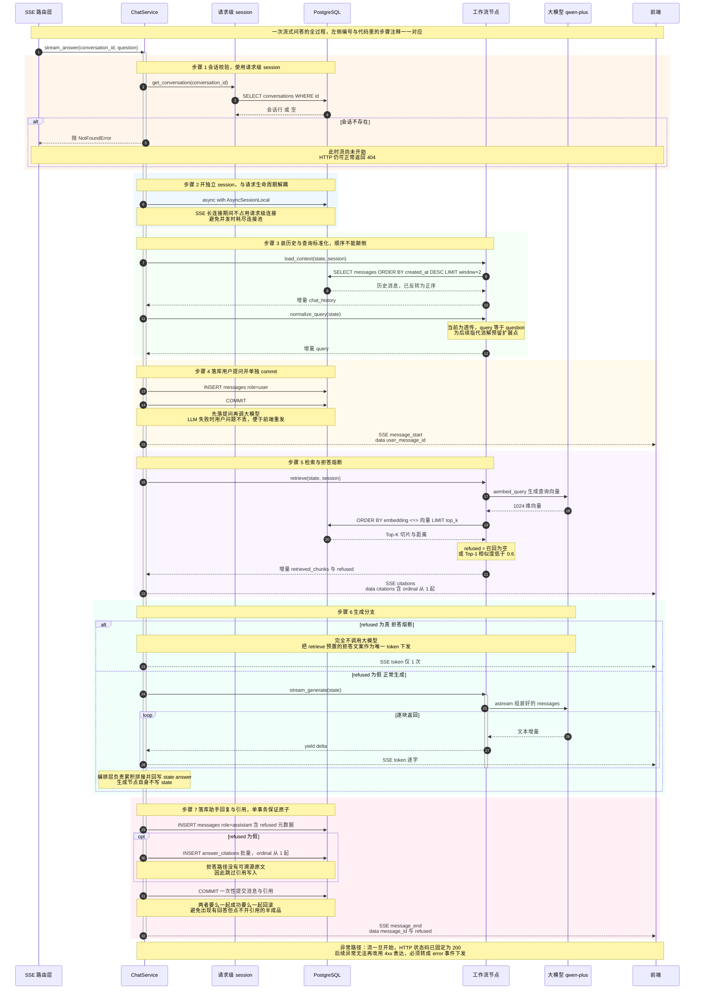
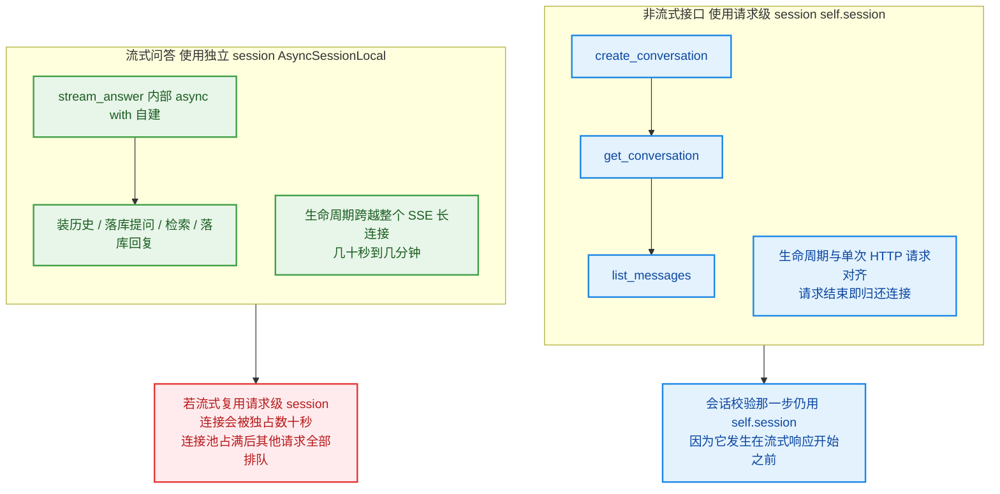
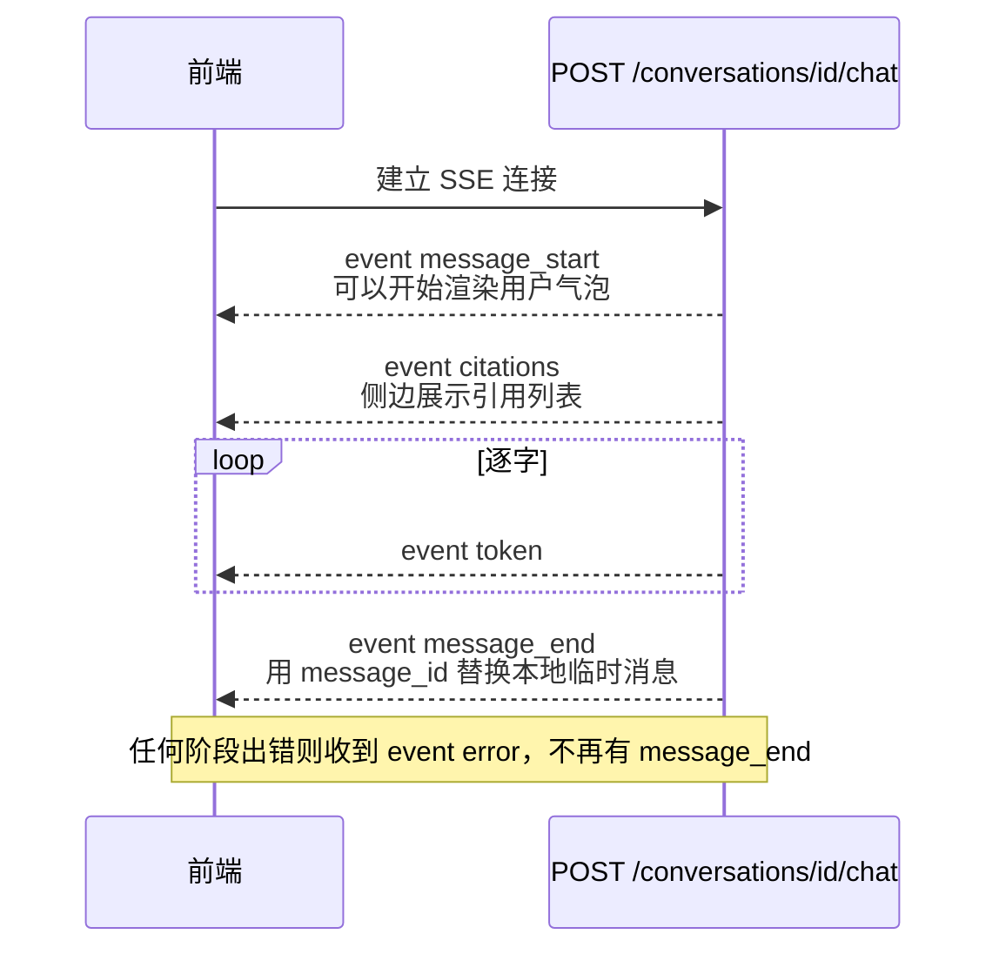

# ChatService 流式问答主链路（时序图）

对应代码：`backend/app/services/chat_service.py` → `stream_answer()`

---

## 图 1：`stream_answer` 十步执行时序



---

## 图 2：两个 session 的边界与生命周期

这是本章最容易踩坑的地方：**同一个类里同时存在两种 session**。



---

## 图 3：客户端视角的事件流

同一时刻前端看到的东西：



---

## 关键设计点速查

| 设计点 | 代码位置 | 为什么 |
| --- | --- | --- |
| 会话校验用请求级 session | `stream_answer` 开头 | 发生在流式开始之前，此时仍可返回 404 |
| 流式用独立 session | `async with AsyncSessionLocal()` | SSE 长连接不能占用请求级连接，否则耗尽连接池 |
| `load_context` 必须早于落库提问 | 步骤 3 先于步骤 4 | 否则本轮提问会被当成历史读回来 |
| 用户提问单独 commit | `_persist_user_message` | LLM 失败时问题不丢，便于前端重发 |
| `message_start` 在检索之前发 | 步骤 4 之后 | 前端尽早拿到 `user_message_id` 占位，参考资料的耗时（embedding 约 1 秒）不阻塞首屏 |
| 拒答时 `token` 只发 1 次 | 步骤 6 的 `if` 分支 | 完全不调 LLM，机制上不给幻觉机会 |
| 累积拼接由编排层做 | 步骤 6 的 `answer_parts` | `stream_generate` 是异步生成器，无法同时 yield 碎片又 return 完整 dict |
| 助手消息与引用同一事务 | `_persist_assistant_message` | 避免"有回答但点不开引用"的半成品数据 |
| 拒答不写引用 | 步骤 7 的 `opt` 分支 | 拒答没有可溯源的原文依据 |
| 异常转 `error` 事件 | `except` 分支 | 流已开始则 HTTP 状态码固定 200，抛给上层无法表达 |

## 实测事件序列（真实运行结果）

```
正常分支:  message_start -> citations -> token × 48 -> message_end
           回答 403 字，耗时 7.4 秒，落库 2 条消息 + 5 条引用

拒答分支:  message_start -> citations -> token × 1  -> message_end
           回答为固定拒答文案，未调用大模型，落库 2 条消息 + 0 条引用
```
