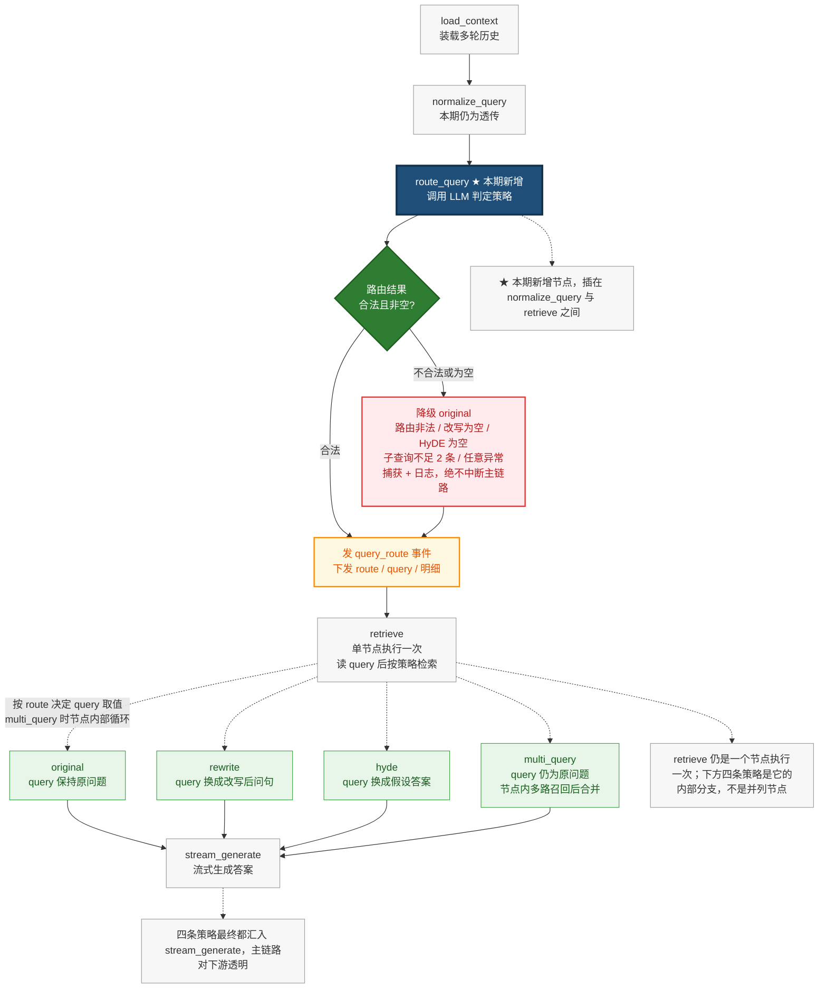
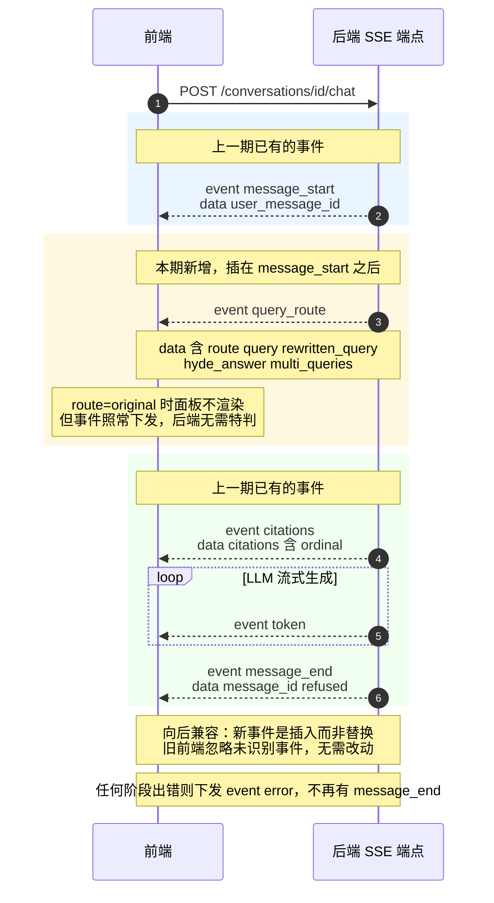

# 01_需求分析与方案设计

> 项目阶段：Day05_Query 优化
> 覆盖章节：第 1 章 需求分析、第 2 章 方案设计
> 记录日期：2026.09.18

---

## 一、这一期要解决什么

回顾第 9 章留下的空位——`normalize_query` 节点当前实现只有一行：

```python
# app/workflows/nodes/normalize_query.py:28
return {"query": state["question"]}
```

当时的注释已写明它是空位：

> 当前基线版本作为透传节点……后续可在此处结合 chat_history 扩展大模型改写逻辑（如消解代词"它/这个"，补充上下文语境）

**这一期把这个空位填上，并扩展为一套完整的 Query 优化能力。**

> **核心命题：`query = question` 这个等式，只在"用户提问本身完整且清晰"时才成立。**

---

## 二、第 1 章：需求分析

### 2.1 四类失效场景

| # | 场景 | 用户输入示例 | 失效原因 |
| --- | --- | --- | --- |
| 1 | **指代消解**（代词 / 省略） | 「**它**的学分是多少？」 | query 里没有"它"指代的对象，向量库无从匹配 |
| 2 | **口语化 / 缩写** | 「住宿**报销**标准是多少」 | 口语与文档书面语不一致，embedding 语义距离被拉大 |
| 3 | **抽象 / 开放** | 「向量检索会有什么问题？」 | 几乎没有具体关键词，短查询在向量空间语义边界模糊 |
| 4 | **数据类型不匹配**（多实体并列） | 「对比 **HNSW** 和 **IVFFlat** 的优缺点」 | 一次向量检索只能召回一个方向，难以兼顾两者 |

### 2.2 ⚠️ 失效的两种表现（都要警惕）

```
Top-1 相似度 >= 阈值  → 不熔断 → 召回到无关片段 → 答案跑偏（用户可能看得出来）
Top-1 相似度 <  阈值  → 熔断   → 直接拒答        → 用户觉得"这明明能答"
```

**两种结局都算失败。** 而且更危险的是场景 4：

```
只召回一半资料（比如只召回到 HNSW），模型却基于这一半"自信地"下结论
→ 回答语法通顺、语气笃定 → 用户看不出破绽 → 这才是真正的幻觉风险
```

> **对比**：代词指代失效通常表现为"答非所问"（容易察觉）；多实体对比失效表现为"貌似正确的片面答案"（难以察觉）。

---

## 三、第 2 章：方案设计

### 3.1 四种 Query 策略对比

| 策略 | 做法 | 适用场景 | LLM 调用 | 召回路径 | 风险 |
| --- | --- | --- | --- | --- | --- |
| **original** | 原样检索 | 问题清晰、有具体词 | 0 | 1 | 无 |
| **rewrite** | 结合历史改写成独立完整问句 | 指代、省略、口语化 | 1 | 1 | 改写偏离原意 |
| **hyde** | 先让 LLM 编"假设答案"，用答案去检索 | 抽象、开放 | 1 | 1 | 假设答案部分偏离 → 召回"像是对的错东西" |
| **multi_query** | 生成多个角度的子查询，分别检索后合并 | 多实体、多角度 | 1 + N 次 embedding | N | 最贵，成本随 N 线性增长 |

**成本是全表的关键**：

```
original     0 次 LLM 调用
rewrite      1 次
hyde         1 次
multi_query  1 次 LLM 生成 + N 次 embedding（N 条子查询各付一次）
```

> 教程原话：**Query 优化策略必须按需，否则成本增加了效果没提。**

### 3.2 HyDE 的核心思路与风险

```
普通检索:   问题 → embedding → 比对文档片段
            ↑ 问题（问句形式）与文档（陈述形式）天然存在形式错配

HyDE:      问题 → LLM 编一个假答案 → 假答案 embedding → 比对文档片段
                  ↑ 假答案是陈述句，形式与真文档一致 → 距离更近
```

**风险（关键）**：假答案通常是**部分偏离**，而非完全错误。

```
若完全脱离正确性 → embedding 远离所有真实文档 → 召回到明显无关内容（易发现）
若部分偏离       → 与真文档在向量空间靠得很近 → 召回"看起来对、实际错"
                 → 模型基于错误依据作答且毫无察觉（危险）
```

> 因此 HyDE 适合"抽象问题、直接检索召不到"的场景；**事实性问题用 HyDE 反而危险**。

### 3.3 为什么用 LLM 做路由

```
方案 A  关键词规则判断
  ✓ 零延迟、零成本、开发快
  ✗ 覆盖不了典型场景（判断"它"指代什么，规则写不出来）

方案 B  训练小型分类模型（BERT 微调）
  ✓ 效果可能更好
  ✗ 需标注训练数据、需维护、维护者须懂模型

方案 C  直接用大模型判断  ← 本项目选择
  ✓ 开发成本低、覆盖面广、零训练数据
  ✗ 多一次 LLM 调用
```

**选择逻辑很务实**：本阶段重点是"先把链路跑通"，用一次 LLM 调用换"不用标注数据、不用维护模型"是划算的。

**但代价不止"多调一次 LLM"，还有两个隐含成本：**

```
① 延迟且位置最糟
   路由是"串行阻塞"的：不拿到路由结果就无法确定 query
   → 无法开始检索，更无法开始生成
   → 这次 LLM 调用（1~3s）叠加在用户等待时间的最前面
   （对比第 10 章把 message_start 提到检索之前，正是为了不让耗时拖延首屏）

② 引入"静默的误判失败模式"
   路由判错（该 rewrite 却判成 original）→ 优化白做
   → 用户与开发者都不会立刻察觉
```

### 3.4 节点编排：插在 `normalize_query` 后面

上一期链路：`load_context → normalize_query → retrieve → stream_generate`

本期在中间插入 `route_query`：`load_context → normalize_query → route_query → 发 query_route 事件 → retrieve(multi_query 多路召回) → stream_generate`

**各策略对 query 字段的影响：**

```
route=original     → query 保持原始问题，空查询不走 embedding
route=rewrite      → query 换成改写后的问句
route=hyde         → query 换成假设答案
route=multi_query  → query 仍保持原问题，多路召回在 retrieve 内循环执行
```

### 3.5 ⚠️ 从设计推出实现约束（教程未言明但躲不掉）

`multi_query` 保持 `query` 不变这一设计，**直接决定了 `retrieve` 节点必须扩展**：

```python
# 现状：只接受单个查询
async def search(self, query: str, top_k: int) -> list[RetrievedChunk]   # vector_retriever.py:58

chunks = await retriever.search(state["query"], top_k=...)               # retrieve.py:41
```

```
单查询:  query         → 1 次检索 → N 条 chunks
多查询:  multi_queries → N 次检索 → 合并去重 → 取 Top-K
                                    ↑ 必须回答三个教程没写的问题：
                                      ① 多路结果怎么合并？按分数排序还是按位次？
                                      ② 同一 chunk 被多路命中如何去重？
                                      ③ Top-K 是"每路 K 条"还是"合并后共 K 条"？
```

> **读设计文档的方法：主动找出"它没说清但实现时躲不掉"的地方。** 这也是 `multi_query` 被排在四个策略最后实现的原因——复杂度明显更高。

### 3.6 失败降级策略（本章最值得学的设计）

教程给出的降级表：

```
路由输出不在 4 个合法值内        → 降级 original
rewrite 返回空字符串             → 降级 original（避免空 query 去 embedding）
HyDE 返回空                     → 降级 original
multi_query 拿不到 2 条子查询    → 降级 original（没必要为 1 条查询走多路）
任何 Exception                  → 捕获 + 日志 + 降级 original
```

**为什么"避免空 query 去 embedding"这条特别重要：**

```
query = "" 传给 embedding API 的两种后果：
  ① API 报 400（空 input）→ 整条链路抛异常 → 用户看到"问答处理失败"
  ② 返回一个无意义向量 → 检索结果全是噪声 → 且不报错 → 更隐蔽的失败
```

> **降级到 `original` 的本质是：退回"优化前的自己"。优化失败不倒退——退化只退化到原本水平。**

**与第 9 章拒答熔断的对比（两种容错方向）：**

| | 第 9 章 拒答熔断 | 本期 路由降级 |
| --- | --- | --- |
| 策略 | **fail-fast**（不确定就拒答） | **fail-safe**（失败就退回基线） |
| 保护对象 | **答案可信度** | **链路可用性** |
| 触发时行为 | 宁可不说 | 不能变差 |

**同一系统可同时存在两种容错方向，因为保护目标不同。**

### 3.7 SSE 事件协议扩展——前端契约已就绪

本期在 `message_start` 之后插入 `query_route` 事件，把路由结果实时下发给前端调试面板。

**实测确认前端已完整实现该契约（后端尚未实现）：**

```typescript
// frontend/src/client/types.gen.ts:1036
export type QueryRouteRead = {
    route: 'original' | 'rewrite' | 'hyde' | 'multi_query';
    query: string;
    rewritten_query?: string | null;
    hyde_answer?: string | null;
    multi_queries?: Array<string> | null;
};
```

```typescript
// frontend/src/api/chatStream.ts:128
case 'query_route':
  onEvent({ type: 'query_route', queryRoute: data as QueryRouteRead })
```

```tsx
// frontend/src/components/QueryRoutePanel.tsx:23
if (queryRoute.route === 'original') return null;   // ← original 时面板不渲染
```

**第二处的设计含义**：`route=original` 表示"没有发生优化"，前端自动不渲染面板。**因此后端在 original 时也应照常下发该事件，无需特判**——契约更简单。

**后端现状（本期开始前的缺口）：**

```
✓ app/api/schemas/chat.py           存在，但尚无 QueryRouteRead
✗ app/workflows/nodes/route_query.py   缺失
✗ rag_state.py 无 route / multi_queries 字段
✗ chat_service.py 无 query_route 事件
```

**第 3 章要做的四件事**：加 schema、加 state 字段、加节点、在编排里 yield 事件。

---

## 四、图 1：节点编排（`route_query` 插入位置与降级路径）



---

## 五、图 2：SSE 事件协议（本期在 message_start 后插入 query_route）



---

## 六、自测题与批改记录

### 题目与作答

| # | 题目 | 作答 | 判定 |
| --- | --- | --- | --- |
| 1 | `query = question` 在什么情况下失效？表现是什么？ | 「多轮对话的"它"；失效表现是向量库没有对应切片，会没有回答」「对比两项事物时可能只召回单一事物的切片，导致答案不准或幻觉」 | ✅ |
| 2 | HyDE 的核心思路？为什么有效？风险是什么？ | 「先根据问题生成假答案，再用假答案检索；因为问题与切片形式不同而假答案与切片形式相似；风险是假答案可能完全脱离正确性，检索出噪声导致幻觉」 | ⚠️ 风险措辞需修正 |
| 3 | 为什么用 LLM 做路由而非训练分类器？代价是什么？ | 「开发成本低、覆盖面广；代价是多调一次 LLM」 | ⚠️ 漏关键代价 |
| 4 | 为什么空字符串要降级而不是照样检索？ | 「空字符串检索会造成噪声，或链路直接崩坏；降级至少保证基线是通的，是保底措施」 | ✅ |
| 5 | `multi_query` 时 `query` 保持不变意味着什么？对 `retrieve` 有何影响？ | 「代表降级为基线状态，没有大的影响」 | ❌ |

### 逐题批改

**第 1 题 —— 正确，第二场景判断很准**

两场景都对。特别值得肯定的是"导致回答结果不准确或者出现幻觉"——**幻觉正是这类失效最危险处**：

```
代词指代失效   → 通常表现为拒答或答非所问（用户能察觉）
多实体对比失效 → 只召回一半资料，模型却"自信地"下结论
                 → 语法通顺、语气笃定 → 用户看不出破绽 ← 真正的幻觉风险
```

补充"失效表现"的精确区分：**取决于 Top-1 相似度落在阈值哪一侧**（见 2.2 节）。

**第 2 题 —— 核心思路对，风险措辞需修正**

思路与"形式匹配"的洞察都正确。风险一句需改：

```
❌ "假答案可能完全脱离正确性，会检索出噪声"
✓ "假答案通常部分偏离，会检索出语义相近但事实错误的片段"
```

**区别很重要**：完全偏离会召回到明显无关内容（易发现）；部分偏离召回"像是对的错东西"（危险）。见 3.2 节。

**第 3 题 —— 结论对，漏了最关键的代价**

"多调一次 LLM"只是代价的一半。更关键的是**延迟，且位置最糟**：

```
路由是"串行阻塞"的 → 不拿到结果就无法确定 query → 无法开始检索与生成
→ 这次 LLM 调用（1~3s）叠加在用户等待时间最前面
```

还有一个隐含代价：**引入"静默的误判失败模式"**（路由判错，优化白做且不报错）。见 3.3 节。

**第 4 题 —— 正确**

"保底措施"用词准确。补充空 query 的两种后果，**不报错的那种更隐蔽**（见 3.6 节）。

**第 5 题 —— 理解偏了**

"降级为基线状态"是误读：这条**不是降级设计，而是正常工作时也有意为之的功能设计**。

```
降级设计        : LLM 失败时的兜底，目标"不影响主链路"
multi_query     : 正常工作时保留原问题作为有效检索输入，N 个真子查询由另一字段承载
```

**真正要考的是推论**：`multi_query` 意味着 **`retrieve` 必须支持多路召回**，而它当前签名是单查询的。由此冒出三个必须回答的问题：**怎么合并、怎么去重、Top-K 语义**（见 3.5 节）。

---

## 七、本期两条原则

### 原则一：建立可度量的失败判据

第 1 章的核心不是"四类场景"，而是**能量化对比优化前后**：

```
同一批用户问题，优化前 vs 优化后：
  Top-1 相似度分布有没有上移？
  拒答率有没有下降？
  ⚠️ 注意：拒答率下降不一定好——可能是把"该拒答的"也答了
```

**实现完第 3 章后，应拿多轮问题跑一次前后对比**，而不是凭"感觉回答变好了"。

### 原则二：同一系统可并存两种容错方向

```
拒答熔断（第 9 章）: fail-fast   保护答案可信度   宁可不说
路由降级（本期）  : fail-safe   保护链路可用性   不能变差
```

**因为保护目标不同，所以方向可以相反。**

---

## 八、遗留待办

| 待办 | 说明 | 归属章节 |
| --- | --- | --- |
| `retrieve` 支持多路召回 | 需回答合并策略、去重规则、Top-K 语义 | 第 3 章 |
| 路由延迟的前端反馈 | 路由阻塞在链路最前，需考虑是否加早期事件 | 第 3 章 |
| 多轮失效的实测基线 | Docker 启动后跑「它的学分是多少」看 Top-1 分数 | 环境恢复后 |

---

## 九、一句话总结

> `query = question` 的等式在**指代、口语化、抽象、多实体**四类场景下失效，失效可能是"答歪"也可能是"拒答"，其中多实体对比失效会产出**难以察觉的片面答案**；方案上用 LLM 做路由在四种策略（original / rewrite / hyde / multi_query）间按需选择，**代价是延迟且位置最糟、并引入静默误判**；失败一律**降级回 original**（fail-safe，保护链路可用性，与第 9 章 fail-fast 的拒答熔断方向相反）；而 `multi_query` 保持 `query` 不变这一设计，直接推出 **`retrieve` 必须扩展为多路召回**这一实现约束。

---

## 十、关联代码索引

| 位置 | 说明 |
| --- | --- |
| `app/workflows/nodes/normalize_query.py:28` | 当前透传实现，本期插入点之前 |
| `app/workflows/nodes/retrieve.py:41` | 单查询调用，`multi_query` 需扩展 |
| `app/retrieval/vector_retriever.py:58` | `search(query, top_k)` 单查询签名 |
| `app/workflows/rag_state.py` | 需新增 `route` / `multi_queries` 等字段 |
| `app/services/chat_service.py` | 需新增 `query_route` 事件下发 |
| `frontend/src/client/types.gen.ts:1036` | `QueryRouteRead` 契约（已就绪） |
| `frontend/src/api/chatStream.ts:128` | `query_route` 事件分派（已就绪） |
| `frontend/src/components/QueryRoutePanel.tsx:23` | `original` 时不渲染面板 |
