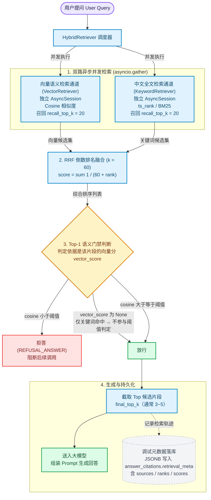

# 第六期 需求分析与方案设计

> 项目阶段：Day06_全文检索、混合检索与 RRF
> 覆盖章节：第 1 章 需求分析、第 2 章 方案设计
> 记录日期：2026.09.20

---

## 一、这一期要解决什么

前五期做的全是**语义检索**（embedding + 余弦相似度）。本期增加一条**关键词精确匹配**通道，并把两路结果融合。

```
向量检索：  语义相近 → 适合"意思差不多"的查询
关键词检索：字面命中 → 适合"就是这个东西"的查询
                ↓
        两者结果【融合】→ 混合检索（Hybrid Retrieval）
```

---

## 二、第 1 章：向量检索的三个盲区

| # | 盲区 | 示例 | 为什么失效 |
| --- | --- | --- | --- |
| 1 | **精确匹配型** | `AP-7`、`api/documents/upload`、`错误码 0x80070005` | embedding 是**语义压缩**，丢掉了字面精确性 |
| 2 | **短查询型** | 版本号、编号、文件名 | 语义稀薄，embedding 表达不出"我要找这个确切的东西" |
| 3 | **陌生词型** | 知识库出现过但模型语料中罕见的词 | 同理，向量落不到有效位置 |

### 根本原因

```
embedding 把文本压成稠密向量 → 语义相近的字面串向量也相近：
  "AP-7" 与 "AP-8"              → 几乎无法区分
  "api/documents/upload"        → 与 "api/documents/init" 同样接近

⇒ 语义相近 ≠ 字面相同
⇒ 用户要"确切那一处"时，压缩本身就是障碍
```

> **两个阶段的职责要分清**：
> 第五期解决"查询写得不好"（指代、省略）—— 改的是**查询文本**；
> 第六期解决"查询写得好但形式是精确字面"—— 加的是**另一条召回路**。

---

## 三、第 2 章：PostgreSQL 全文检索的中文方案

| 方案 | 状态 | 安装方式 | 中文支持 |
| --- | --- | --- | --- |
| `zhparser` | 社区维护 | 需编译源码 | 对中文支持好 |
| `pg_jieba` | 已有版本，安装麻烦 | 依赖 jieba + C 编译 | 词库好，生态少 |
| `pg_trgm` | **内置可装** | **`CREATE EXTENSION`** | trigram 切分，非分词 |

教程选 `zhparser`（生态成熟），并把 Docker 镜像从 `pgvector/pgvector:pg16` 换成含中文解析器的镜像（如 `leonardo17/pgvector-zhparser`）。

---

## 四、⭐ 为什么必须用 RRF，不能简单相加分数

### 4.1 天真方案为什么失败

```
天真方案：final_score = vector_score + keyword_score

问题：两路分数量纲完全不同
  向量相似度：cosine ∈ [0, 1]         （0.6 是及格线）
  BM25 分数： ts_rank ∈ [0, +∞)       （可能 0.05，也可能 10+）

后果不只是"权重被淡化"，而是【排序被一路完全支配】：
  若 ts_rank 在 0.05~10 波动，而 cosine 只在 0.4~0.8：
  → 相加后排序几乎完全由 keyword 分决定 → 向量这一路等于白做
  → 且 ts_rank 绝对值依赖语料规模与词频 → 无法设通用权重
```

### 4.2 RRF（Reciprocal Rank Fusion）的核心思想

> **不用分数，只用排名。**

```
RRF(d) = Σ  1 / (k + rank_i(d))
        i∈各路

rank_i(d) = 文档 d 在第 i 路结果中的排名（从 1 开始）
k         = 平滑常数，一般取 60
```

**为什么排名能解决量纲问题**：

```
分数 → 每路量纲、分布、绝对尺度都不同 → 不可比
排名 → 每路都输出 1、2、3、4…         → 天然同量纲，可直接相加
```

### 4.3 数值示例（k=60）

设两路各召回 3 条：

```
向量路  : A(rank1)  B(rank2)  C(rank3)
关键词路: B(rank1)  D(rank2)  A(rank3)

A = 1/(60+1) + 1/(60+3) = 0.01639 + 0.01587 = 0.03226
B = 1/(60+2) + 1/(60+1) = 0.01613 + 0.01639 = 0.03252   ← 最高
C = 1/(60+3)              = 0.01587
D =              1/(60+2) = 0.01613

最终: B > A > D > C
```

**注意 B 排到第一**——它不是任何一路的第一名（向量路第 2、关键词路第 1），但**两路都命中**，融合后自然上浮。

> **这正是混合检索的价值：两路都认可的结果，比单路强推的结果更可信。**

### 4.4 三个优点与代价

```
① 不需要分数归一化   → 全程只用 rank
② 鲁棒性好           → k=60 让 1/(60+1) 与 1/(60+3) 差距很小（0.01639 vs 0.01587）
                        单路异常对整体影响被平滑
③ 多路命中自动上浮   → 上面 B 的例子，这是最重要的实际收益

代价：只用排名 → 丢掉分数携带的【置信度】
  某路第 1 名但分数 0.51（勉强及格）与某路第 1 名但分数 0.95（铁定相关）
  → RRF 视为完全同等；k=60 又进一步压平头部差距
```

---

## 五、双路并发：SQLAlchemy 的坑

```python
vector_hits, keyword_hits = await asyncio.gather(
    vector_retriever.search(query, top_k),
    keyword_retriever.search(query, top_k),
)
```

**并发收益**（教程的算术）：

```
串行：e5 向量查询 50ms + 全文查询 30ms = 80ms
并发：max(50, 30) = 50ms
```

### 为什么不能在同一个 `AsyncSession` 上并发

```
AsyncSession 内部 = 1 个连接 + 1 个事务状态
create_task 两个协程 → 交替向【同一个连接】发 SQL
→ 事务状态被互相踩踏（一个协程的 SQL 跑在另一个的事务里）
→ Session 检测到并发使用 → InvalidRequestError
```

### 解法：为每一路开启独立 Session

```python
async def _search_keyword(...):
    async with AsyncSessionLocal() as s:     # ← 自己的连接
        ...
```

**两个好处**：

```
① 真正的并发：两条 SQL 走两个独立连接，可并行执行
② 天然隔离，避免影响外部事务：
     检索本该只做只读查询，但若挂在调用方（如 chat_service）的事务 session 上，
     一旦检索报错可能影响外层事务状态
     独立 session 打开即用、用完归还，与外部业务逻辑完全隔离
```

---

## 六、⭐ Top-1 拒答口径：把"审判权"还给对的路

### 6.1 问题

改造前：

```python
refused = not chunks or chunks[0].score < settings.retrieval_min_score
                                  ↑ 纯向量 cosine 分
```

改造后两路融合，**关键词路来的片段没有 cosine 分**（`vector_score = None`）。

### 6.2 修正后的口径（三条规则）

```
① 若 Top-1 自留则看 vector_score（cosine 分）：
     命中向量路：cosine >= 阈值 → 放行；< 阈值 → 拒答
     只命中关键词路（vector_score 为 None）→ 【放行，不参与阈值判定】
     整个 Top-1 都没有向量分 → 【放行，不熔断】
```

**判定树**：

```
                    Top-1 的 vector_score
                            │
        ┌───────────────────┼───────────────────┐
        │                   │                   │
   为 None              >= 阈值              < 阈值
（仅关键词命中）      （语义与字面双通过）    （语义未通过）
        │                   │                   │
     【放行】             【放行】            【拒答】
```

### 6.3 为什么"只被关键词命中"不能拒答

```
关键词命中说明什么？
  → 用户要找的【确切内容就在这里】—— 这正是本期加该通道的目的

若用向量阈值否决它：
  → 用户搜 "AP-7"，关键词精确命中
  → 但该片段向量分只有 0.45
  → 被拒答 → 【等于把本期的功能关掉了】
```

> 教程原话：**用向量阈值去否决它 = 把工具用反了。**

**典型 Bad Case（教程举的）**：用户问某个 API 端点：
- 向量检索没召回它（路径不敏感）
- 关键词检索命中了
- 若按"向量分低就拒答" → 明明库里有的 API 文档被拒答
- 用户「查到了但没命中」→ 实际会摧毁产品信任

### 6.4 与"拒答"的边界

```
拒答：向量召回最高分低，且关键词也无匹配 → 确实可能没有相关内容 → 拒答
放行：关键词命中了 → 用户要精确找的东西存在 → 必须给模型
```

---

## 七、检索元数据落库

写入 `answer_citations.retrieval_meta`（JSONB，每行一条引用对应一条）：

```json
{
  "sources": ["vector", "keyword"],
  "vector_rank": 1,
  "vector_score": 0.865,
  "keyword_rank": 3,
  "keyword_score": 0.452,
  "rrf_score": 0.03226
}
```

| 字段 | 含义 |
| --- | --- |
| `sources` | 命中的检索路：`["vector"]` / `["keyword"]` / `["vector","keyword"]` |
| `vector_rank` / `vector_score` | 向量路排名与原余弦相似度；未走该路则为 null |
| `keyword_rank` / `keyword_score` | 关键词路排名与原始匹配分（`ts_rank`） |
| `rrf_score` | 融合分，系统最终按它降序截取 Top-K |

### 为什么要存

```
① 线上查 Bad Case：回答很烂时，看元数据即可定位
     是向量路没匹配到？还是全文路把无关内容顶上来？还是 RRF 权重分配不合理？
② 前端调试与效果透视：把来源渲染成标签（如「双路命中 | 向量第1 | 全文第3」）
```

### ⚠️ 两条召回数量的口径必须区分

| 参数 | 默认值 / 作用 | 设计理由 |
| --- | --- | --- |
| `recall_top_k` | 每路召回数量（默认 20） | **宽进**：单路各取 20，留足候选，防止某些内容在单路排十几名而被过早漏掉 |
| `final_top_k` | 最终送入 LLM 的数量（通常 3~5） | **严出**：给 LLM 最精华片段，防止上下文过长导致 Token 消耗过大、推理变慢甚至分散注意力 |

---

## 八、整体链路



> **图中最容易配错的一处**：`vector_score 为 None`（仅关键词命中）必须走**放行**，不是拒答。
> 这是本期的核心设计点——用向量阈值去否决关键词命中，等于把新加的能力关掉。

---

## 九、⚠️ 实测：本环境的中文全文检索不可用（**开工前必须决定**）

### 实测结果

```
已安装扩展:     仅 plpgsql + vector 0.8.6
文本检索配置:   29 个（全是欧洲语言 + simple），【无任何中文配置】
pg_trgm:        未安装，但【可安装】✓
zhparser:       【不可安装】✗
pg_jieba:       【不可安装】✗

中文分词实测（simple 配置）:
  to_tsvector('simple', '向量检索')  = '向量检索':1      ← 整句当一个 token
  to_tsvector('simple', '上传 接口') = '上传':1 '接口':2   ← 只有空格分隔才切

中文关键词命中测试（关键）:
  语料 '用户上传接口的参数说明' 匹配 '上传'     -> False
  语料 '用户上传接口的参数说明' 匹配 '接口'     -> False
  语料 '用户上传接口的参数说明' 匹配 '上传接口'  -> False
```

### 原因

```
PostgreSQL 默认解析器把【整句中文当成一个 token】
→ 语料里 "用户上传接口的参数说明" 是一个 token
→ 查询的 '上传' 是另一个 token
→ 两者不相等 → 匹配不上
```

### 结论与三条出路

**当前 `docker-compose.yml` 用的镜像是 `pgvector/pgvector:pg16`，只含 vector 扩展，不含 zhparser。** 按教程原样实现，**中文关键词通道对本项目是"死通道"**——库里全是中文文档，任何中文查询都会返回空结果。

| 方案 | 做法 | 代价 |
| --- | --- | --- |
| **A. 换自建镜像** | 用 `leonardo17/pgvector-zhparser` 或参照其 Dockerfile 自建 | 换镜像、重跑迁移、已有数据卷需注意兼容 |
| **B. 用 `pg_trgm`** | `CREATE EXTENSION pg_trgm` + GIN 索引；trigram 对中文按 3-gram 切分 | **零镜像改动**；索引更大，语义不如分词精细 |
| **C. 先按教程写** | 代码写对，接受"中文返回空" | 骨架完整，但本期对本项目无实际收益 |

> **建议优先评估 B**：它是唯一"零镜像改动就能让中文关键词检索真正工作"的路子。

---

## 十、一句话总结

> 向量检索因"语义压缩"在**精确字面**（编号 / 路径 / 错误码）、**短查询**、**陌生词**三类查询上失效，故本期增加 PostgreSQL 全文检索通道并以 **RRF 倒数排名融合**（`Σ 1/(k+rank)`，k=60）合并——它**绕开"两路分数量纲不可比"的根本问题**（cosine ∈ [0,1] vs ts_rank ∈ [0,+∞)），代价是丢弃分数的置信度信息；双路以 `asyncio.gather` 并发，且必须**各自持有独立 AsyncSession**（同一 session 不支持并发）；拒答口径改为**只对"向量分低于阈值"熔断，仅关键词命中的片段一律放行**；检索轨迹以 `retrieval_meta`（JSONB）随引用落库供 Bad Case 排查；同时区分 `recall_top_k`（宽进，每路 20）与 `final_top_k`（严出，3~5）。

---

## 十一、关联文件索引

| 位置 | 说明 |
| --- | --- |
| `docker-compose.yml` | 当前 `pgvector/pgvector:pg16`（**不含中文解析器**） |
| `app/retrieval/vector_retriever.py` | 现有向量检索器（本期要并发调用） |
| `app/workflows/nodes/retrieve.py` | 本期要改造为双路 + RRF + 新拒答口径 |
| `app/db/models.py` | `AnswerCitation` 需新增 `retrieval_meta`（JSONB） |
| `frontend/src/client/types.gen.ts` | 已含 `RetrievalMeta` 契约（sources / ranks / scores） |
| `frontend/src/components/CitationList.tsx` | 引用列表（未来展示检索来源标签） |
