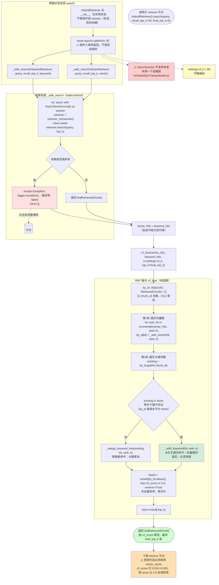
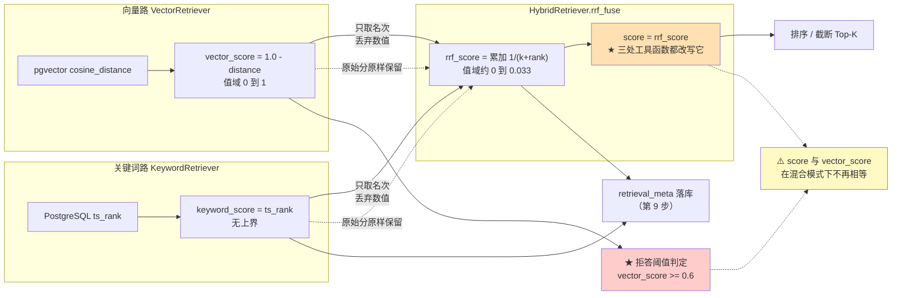
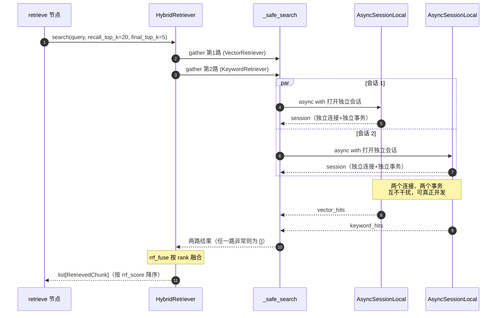

# 03_HybridRetriever与RRF融合

> 章节：Day06_全文检索、混合检索与 RRF · 第 3 章 开发实现 · 第 8 步
> 覆盖：`backend/app/retrieval/hybrid_retriever.py`（新建）、`backend/app/core/config.py`（加 2 项）
> 记录日期：2026.09.20

---

## 一、本模块在整期里的位置

```
                    retrieve 节点  ← 第 9 步才切换过来
                            │
                            ▼
                  ┌─────────────────────┐
                  │   HybridRetriever   │  ← 本模块（本期核心）
                  │   asyncio.gather    │
                  └──────┬───────┬──────┘
                         │       │   两个独立的 AsyncSessionLocal
              ┌──────────▼──┐ ┌──▼──────────┐
              │  向量路      │ │  关键词路    │
              │ VectorRetr. │ │ KeywordRetr.│
              └──────┬──────┘ └──┬──────────┘
                     │           │
                     └─────┬─────┘
                           ▼
                    rrf_fuse()   按「排名」而非「分数」融合
                           ▼
                  list[RetrievedChunk]（同一份契约）
```

**本模块要解决的核心问题**：两路的分数**量纲完全不同，加不起来**，所以改用**排名**来融合。

| 文件 | 动作 | 行数变化 |
| --- | --- | --- |
| `app/retrieval/hybrid_retriever.py` | **新建** | **343**（其中纯注释 103 行） |
| `app/core/config.py` | 加 `rrf_k` / `retrieval_recall_top_k` | 168 → **180** |

---

## 二、为什么必须用 RRF（不能直接相加）

### 2.1 实测的两路分数

| 路 | 分数含义 | 实测值 | 值域 |
| --- | --- | --- | --- |
| 向量 | 余弦相似度 | `0.658601` | [0, 1] |
| 关键词 | `ts_rank` | `0.086545` | **无上界** |

### 2.2 直接相加的三个致命问题

**① 量纲不可比。** `0.7 + 0.09` 里那个 `0.09` 是什么？在关键词路里 `0.0865` 是**第 1 名**（满分），但数值上只占向量分的 13%。相加等于**让向量分单方面决定排序**。

**② 尺度随查询浮动。** 实测：

```
'DDR5-4800' 命中 1 篇 → ts_rank = 0.188390
'接口'      命中 16 篇 → ts_rank = 0.086545
```

`ts_rank` 受**词频与文档长度**影响，换个查询整个尺度就变了。今天"0.09 很高"，明天"0.09 很低"。（根因见上一批归档：`ts_rank` 与 IDF 无关，只看词频。）

**③ `ts_rank` 有大量并列。** 实测 `接口` 的第 2~5 名**全是 `0.082746`**。用分数排序无法区分，先后取决于数据库的偶然返回顺序。

### 2.3 RRF 的解法：只看排名

排名天然解决这三个问题：没有量纲（就是 1, 2, 3…）、不受查询尺度影响（永远从 1 开始）、天然消解并列。

**RRF 对照表（k=60，实测值）**：

| rank | `1/(k+rank)` | 两路都排该名 → `2/(k+rank)` |
| ---: | ---: | ---: |
| 1 | 0.01639344 | **0.03278689** |
| 2 | 0.01612903 | 0.03225806 |
| 3 | 0.01587302 | 0.03174603 |
| 4 | 0.01562500 | 0.03125000 |
| 5 | 0.01538462 | 0.03076923 |
| 6 | 0.01515152 | 0.03030303 |
| 7 | 0.01492537 | 0.02985075 |
| 8 | 0.01470588 | 0.02941176 |
| 9 | 0.01449275 | 0.02898551 |
| 10 | 0.01428571 | 0.02857143 |

**从这张表能读出 RRF 的全部精髓**：

```
单路 rank=1（可能满分）      = 0.01639344
两路都 rank=5（两路都垫底）   = 0.03076923    ← 比单路满分还高 88%
```

**"两路都命中"的增益（约 +100%）远大于"单路排得更高"的增益（k=60 时，第 1 名到第 5 名只差约 6.5%）。**

**这就是 RRF 的设计信念**：两条腿的检索原理完全不同（一个语义、一个字面），**同时命中说明两种独立证据都支持它**，这比"被一条腿极度看好"更可靠。

### 2.4 常数 k 的作用

`k=60` 的物理含义：**它把"名次差"压缩得非常平缓**。

```
第 1 名 0.01639344  ←→  第 5 名 0.01538462
差 0.00100882（仅 6.2%）
```

- `k` **越小** → "名次"的影响越大，"两票"的优势越小
- `k` **越大** → 越平滑，越依赖"两路都命中"这件事本身

所以 `k` 调的正是**"名次"与"共识"的权重比**。

---

## 三、`HybridRetriever` 类的两个关键设计

### 3.1 刻意不接收外部 session（`hybrid_retriever.py` L42-53）

```python
class HybridRetriever:
    """混合检索器：两路独立 session 并发召回，再用 RRF 融合成一份结果。

    【刻意不接收外部 session】：
    - SQLAlchemy 的 AsyncSession 【不支持并发执行】：一个 session 对应一个数据库连接
      与一个事务状态，两路 gather 共用一个 session 会让两条语句在同一连接上交错下发，
      把底层 asyncpg 连接搞成 InFailedSQLTransactionError（事务已失败，后续语句全部拒绝）。
    - 检索过程纯读，不写库，因此与调用方的写事务（落库 user / assistant 消息）
      天然解耦——各自开会话反而更干净，不会因为检索失败而污染调用方事务。
    """
    # 说明：类里没有任何 __init__，也刻意不保存任何实例状态。
```

**`AsyncSession` 为什么不能并发**，逐层拆：

```
一个 AsyncSession
   └── 绑定一个数据库连接（Connection）
          └── 承载一个事务（Transaction）
                 └── 有唯一的事务状态（进行中 / 已提交 / 已失败）
```

共用 session 的后果链条：

```
时刻1  向量路在共用连接上发出 BEGIN / SELECT
时刻2  向量路抛异常          → 事务进入 aborted 状态
时刻3  关键词路复用同一连接发 SELECT
       → PostgreSQL 拒绝：current transaction is aborted,
         commands ignored until end of transaction block
       → asyncpg 报 InFailedSQLTransactionError
```

**⚠️ 一个容易误判的点**：关键词路**本身没错**，它只是"搭在一辆已经翻了的车上"。所以现象是"两路都拿不到结果"，但根因只有一个。

**更阴的地方**：`_safe_search` 的 `except Exception` **仍然会触发**，但它只返回 `[]`：

```
向量路异常 → catch → 返回 []
关键词路被毒化 → catch → 返回 []
        ↓
    rrf_fuse([], []) → 返回 []
        ↓
   用户看到"拒答"
```

**"兜底生效"和"兜底有用"是两件事。** 从日志看两路"都正常工作（只是异常被兜住了）"，实际上降级降到了零。

**附带好处**：检索纯读不写库，所以和调用方的写事务（`_persist_user_message` / `_persist_assistant_message`）完全解耦。检索挂了不会污染调用方事务；会话现场创建、`async with` 结束即归还连接池。

### 3.2 `_safe_search`：`@staticmethod` + 自建会话 + 宽兜底（L106-155）

```python
    @staticmethod
    async def _safe_search(
        retriever_cls: type[VectorRetriever] | type[KeywordRetriever],
        query: str,
        top_k: int,
        label: str,
    ) -> list[RetrievedChunk]:
        try:
            async with AsyncSessionLocal() as session:
                retriever = retriever_cls(session)
                return await retriever.search(query, top_k)
        except Exception:
            logger.exception("hybrid retrieve %s 路异常，降级为空结果", label)
            return []
```

**三个设计点**：

**(a) `@staticmethod`** —— 不需要 `self`，没有实例状态。让两路走**完全一致**的代码路径（`retriever_cls(session).search(query, top_k)` 对两个类都成立），这正是统一契约换来的对称性。

**(b) `label` 参数** —— 纯为日志能看出**哪一路挂了**。没有它，两路日志长得一模一样。

**(c) `try` 的位置很关键** —— 它包住的是"**开会话 + 构造检索器 + 检索**"整段，而不只是 `search()` 那一行。因为 `AsyncSessionLocal()`（获取连接）、检索器构造、`search` 内部的向量化/建连/执行 SQL **都可能抛异常**。

**`except` 必须在 `async with` 之外** —— 这样会话退出时的清理异常也会被同一套语义覆盖。

**实测三种降级场景**（用桩注入异常）：

| 场景 | 结果 |
| --- | --- |
| 向量路抛异常，关键词路正常 | 返回 1 条 `('K1', ('keyword',), 0.01639344)` |
| 关键词路抛异常，向量路真实 | 返回 3 条，`sources` 全为 `('vector',)` |
| **两路都抛异常** | 返回 `[]`，**未抛异常** |

异常日志同时打出（含完整堆栈）：

```
hybrid retrieve vector 路异常，降级为空结果
Traceback (most recent call last):
  File ".../hybrid_retriever.py", line 144, in _safe_search
    return await retriever.search(query, top_k)
RuntimeError: 模拟 embedding 服务 5xx
```

### 3.3 ⚠️ 宽兜底的代价：缺"告警"这一层

`except Exception` 是**有意写宽**的，理由见下节自测题 Q3 详解。但必须记住它的代价：

**它会掩盖"某一路长期全挂"这种系统性问题。**

```
场景：embedding 服务 API Key 过期
第 1 天  向量路异常 → 记日志 → 返回 [] → 关键词路照常 → 用户无感
第 7 天  同上
用户体感："检索质量怎么越来越差了"（语义检索早没了，只剩字面匹配）
运维侧：日志里几万条堆栈，没人看
```

**根因**：异常被"合法化"了 —— 变成了每次都正常发生的**降级路径**，而不是需要人工介入的**故障**。

| 层 | 现状 |
| --- | --- |
| ① 兜底（不阻断用户） | ✅ 已有 |
| ② 可观测（记日志含堆栈） | ✅ 已有（`logger.exception`） |
| ③ **告警（连续 N 次降级 → 主动告警）** | ❌ **缺** |

**这是本模块唯一的技术债。**

---

## 四、`search` 的两个签名细节（L56-101）

```python
    async def search(
        self,
        query: str,
        *,
        recall_top_k: int,
        final_top_k: int,
    ) -> list[RetrievedChunk]:
        vector_hits, keyword_hits = await asyncio.gather(
            self._safe_search(VectorRetriever, query, recall_top_k, "vector"),
            self._safe_search(KeywordRetriever, query, recall_top_k, "keyword"),
        )
        return rrf_fuse(
            vector_hits=vector_hits,
            keyword_hits=keyword_hits,
            k=settings.rrf_k,
            top_k=final_top_k,
        )
```

### 4.1 `*` 强制关键字传参

`recall_top_k` 与 `final_top_k` **都是 `int`**，位置传参极易写反：

```python
await hybrid.search(q, 5, 20)     # ✗ 意思完全反了：用 5 召回、再截到 20
```

**写反的后果是静默的**：不报错，只是"每路只召回 5 条候选，然后想截 20 条"—— 融合时手上只有 5 条可融合，**RRF 退化成"对同一批结果重排"**，关键词腿完全失去引入新文档的能力。

加了 `*` 之后，写反**根本编译不过**。

### 4.2 `recall_top_k` ≠ `final_top_k`

| 参数 | 含义 | 默认 | 为什么不同 |
| --- | --- | --- | --- |
| `recall_top_k` | **每条腿各自**召回多少候选 | `settings.retrieval_recall_top_k = 20` | 必须够宽，融合才有素材 |
| `final_top_k` | 融合后交给 LLM 多少条 | `settings.retrieval_top_k = 5` | prompt 的 Token 预算 |

**为什么加了 `retrieval_recall_top_k` 这个配置**：教程截图里 `search` 引用了 `settings.rrf_k`，但 `config.py` 里**没有**这个字段（会在运行时 `AttributeError`），同时也没有"单路召回宽度"这一项。若不引入宽度配置，就只能复用 `retrieval_top_k=5`，那样两路各只有 5 条候选，融合池最多 10 条 —— 而关键词腿本来能召回 16 条，其中 11 条**根本没机会参与融合**。

### 4.3 `gather` 与 `_safe_search` 的配合

- `gather` 的返回顺序**严格等于传入顺序**，不保证"谁先跑完谁在前"。所以 `vector_hits` 必定是第一路。
- `gather` **不会因为其中一个抛异常就取消另一个**（默认行为）。但 `_safe_search` 内部已把异常吃掉，传给 `gather` 的协程**永远不会抛** —— 双保险。
- 如果 `_safe_search` 不兜底，`gather` 会把第一个异常向上抛，另一个协程的结果被丢弃。

---

## 五、`rrf_fuse`：核心算法（L157-229）

```python
def rrf_fuse(vector_hits, keyword_hits, *, k, top_k) -> list[RetrievedChunk]:
    by_id: dict[UUID, RetrievedChunk] = {}

    # 1. 向量路：先建立基线
    for rank, hit in enumerate(vector_hits, start=1):
        by_id[hit.chunk_id] = _with_vector(hit, rank=rank, k=k)

    # 2. 关键词路：已存在的累加分数，不存在的直接放入
    for rank, hit in enumerate(keyword_hits, start=1):
        existing = by_id.get(hit.chunk_id)
        if existing is None:
            by_id[hit.chunk_id] = _with_keyword(hit, rank=rank, k=k)
        else:
            by_id[hit.chunk_id] = _merge_keyword_into(existing, hit, rank=rank, k=k)

    # 3. 全局按融合分降序排序后截断
    fused = sorted(by_id.values(), key=lambda c: c.rrf_score or 0.0, reverse=True)
    return fused[:top_k]
```

### 5.1 ⭐ 关键理解：`if existing is None` 走的是 `_with_keyword`

**这是最容易看错的一处**（详见第七节 §7.1 的误判记录）：

| 情况 | `existing` | 走哪个分支 | 效果 |
| --- | --- | --- | --- |
| 该切片**向量路召回过** | 是 `RetrievedChunk` | `_merge_keyword_into` | **累加**两路分数，`sources` 合并 |
| 该切片**只在关键词路** | `None` | **`_with_keyword`** | **新建**一条 keyword-only 记录放进 `by_id` |

**第二个分支是关键词腿存在的全部意义**。没有它，关键词路只能在向量路已召回的候选里重排，**永远无法引入向量路遗漏的文档** —— 那本期的迁移、`keyword_search`、`KeywordRetriever` 就全白做了。

**单元测试实证**：

```
输入: 向量=[A(r1), B(r2)]  关键词=[C(r1), D(r2), A(r3)]
输出:
  A  sources=('vector','keyword')  rrf=0.03226646   ← 两路累加
  C  sources=('keyword',)          rrf=0.01639344   ← 仅关键词，被保留 ✓
  B  sources=('vector',)           rrf=0.01612903
  D  sources=('keyword',)          rrf=0.01612903   ← 仅关键词，被保留 ✓
输出条数=4(无丢失) ✓
```

### 5.2 `existing is None` 与 `not in by_id` 严格等价

**为什么敢用 `is None` 判断"键不存在"**：`by_id` 的值域是 `{RetrievedChunk}`，三个工具函数**没有一个返回 `None`**。所以 `by_id.get(k) is None` ⟺ `k not in by_id`。

穷举验证（9 组场景，两种写法输出**完全一致**）：两路完全不重叠 / 同序 / 逆序 / 向量独有+关键词独有 / 关键词独有排第 1 / 排最后 / 多条关键词独有 / 向量空 / 关键词空。

### 5.3 为什么用 `dict` 而不是 `list`

1. **按 `chunk_id` 去重**是融合的前提：同一切片被两路都召回时，必须在**同一条记录**上累加，而不是产生两条；
2. **O(1) 查找**：两路各 20 条，list 查找是 O(n²)；
3. `chunk_id` 是 `UUID`（不可变、可 hash），天然适合当键。

### 5.4 `sorted` 之后再切片，不能提前截断

```python
fused = sorted(全部候选, key=rrf_score, reverse=True)
return fused[:top_k]
```

**必须先把全量排完再截**。因为融合分是**遍历完两路之后才知道的**：一条切片可能在关键词路第 15 位，但加上向量路的贡献后跃升到第 2 位。**提前截断会漏掉它。**

### 5.5 `key=lambda c: c.rrf_score or 0.0` 的两点作用

1. 类型上 `rrf_score` 是 `float | None`，`None` 参与 `<` 比较会 `TypeError`；
2. 兜住任何意外路径下的 `None`。

**注意**：`0.0 or 0.0 == 0.0`，所以合法零分不会被算错。但这个写法**只在"`None` 与 `0.0` 等价"时才安全**，不是万能模板。

---

## 六、三个纯函数（L237-343）

```python
def _with_vector(hit, *, rank, k):     # 仅向量命中 → 融合视图
    rrf_score = 1.0 / (k + rank)
    return RetrievedChunk(..., score=rrf_score,
                          sources=("vector",),
                          vector_rank=rank,
                          vector_score=hit.vector_score,
                          rrf_score=rrf_score)

def _with_keyword(hit, *, rank, k):    # 仅关键词命中 → 融合视图（严格对称）
    rrf_score = 1.0 / (k + rank)
    return RetrievedChunk(..., score=rrf_score,
                          sources=("keyword",),
                          keyword_rank=rank,
                          keyword_score=hit.keyword_score,
                          rrf_score=rrf_score)
    # 【关键】此处刻意不填 vector_rank / vector_score，让它们保持默认值 None

def _merge_keyword_into(existing, keyword_hit, *, rank, k):   # 两路命中 → 累加
    new_rrf = (existing.rrf_score or 0.0) + 1.0 / (k + rank)
    return RetrievedChunk(..., score=new_rrf,
                          sources=("vector", "keyword"),
                          vector_rank=existing.vector_rank,
                          vector_score=existing.vector_score,
                          keyword_rank=rank,
                          keyword_score=keyword_hit.keyword_score,
                          rrf_score=new_rrf)
```

**"纯函数"在这里的含义**：同样输入必得同样输出、**不修改入参**（`RetrievedChunk` 本来就是 `frozen=True`）、不碰数据库。

**好处**：融合逻辑可以被**单独推理和测试**。11 项单元测试全部不连库、不用桩 —— 直接构造 4 个 `RetrievedChunk` 就能测。

### 6.1 ⚠️ `score` 在融合后被改写（三个函数都改）

因为**融合之后，排序依据不再是单个路的原始分**。这正是第 6 期契约里 `score` = "本次排序依据"的语义兑现：

| 模式 | `score` 等于 | 范围 |
| --- | --- | --- |
| 向量单路 | `vector_score` | [0, 1] |
| 关键词单路 | `keyword_score` | 无上界 |
| **混合检索** | **`rrf_score`** | ≈ [0, 0.033] |

**原始分一条都没丢**，全在 `vector_score` / `keyword_score` 里 —— 供调试面板和 `retrieval_meta` 落库用。

**⚠️ 由此带来第 9 步必须处理的后果**：`score` 的量级从 `[0,1]` 掉到 `≈[0,0.033]`，而 `retrieve` 节点还在用 `chunks[0].score < settings.retrieval_min_score (0.6)` 判拒答 → **会恒拒答**。见 §9.2 的实测证据。

### 6.2 ⚠️ `vector_rank = None` 与 `= 0` 的天壤之别

`_with_keyword` 建出来的记录 `vector_rank=None`、`vector_score=None`。**这不是"缺数据"，而是如实表达"向量路没有召回它"**。

| 如果误写成 | RRF 会怎么算 | 后果 |
| --- | --- | --- |
| `vector_rank=None`（正确） | 跳过向量路贡献，只加 `1/(k+k_rank)` | ✓ 正确 |
| `vector_rank=0`（错误） | 加 `1/(k+0) = 0.01666667` | ✗ **凭空获得比第 1 名（0.01639344）还高的名次** |

**它还会被累加抬高**：

```
错误：1/(60+0) + 1/(60+20) = 0.01666667 + 0.01250000 = 0.02916667
正确：只算关键词路                              = 0.01250000
```

**一条只被关键词路勉强召回（第 20 名）、向量路完全没看见的切片，会从榜尾直接跳到榜首。而且不报错。**

---

## 七、图：本模块的完整流程

### 7.1 主流程图



### 7.2 数据血缘图：四个分数字段从哪来、到哪去

**这张图是理解整套契约的关键。**



**三条必须记住的结论**：

| 字段 | 给谁用 | 混合模式下的值 |
| --- | --- | --- |
| `score` | **排序 / 截断** | `rrf_score`（≈0.016~0.033） |
| `vector_score` | **拒答阈值判定** | 余弦相似度（0~1），**仅关键词命中时为 `None`** |
| `keyword_score` / `rrf_score` | 调试面板、`retrieval_meta` 落库 | 原始分 / 融合分 |

### 7.3 用时序图看"两个独立会话"



---

## 八、验证结果

### 8.1 `rrf_fuse` 单元测试（11 项全过，纯函数不连库）

输入：向量路 `[A(r1), B(r2)]`，关键词路 `[C(r1), D(r2), A(r3)]`，`k=60`

| 名称 | `sources` | `v_rank` | `k_rank` | `rrf_score` |
| --- | --- | --- | --- | --- |
| **A** | `('vector','keyword')` | 1 | 3 | **0.03226646** |
| C | `('keyword',)` | None | 1 | 0.01639344 |
| B | `('vector',)` | 2 | None | 0.01612903 |
| D | `('keyword',)` | None | 2 | 0.01612903 |

```
OK  A 两路累加            0.03226646 vs 1/(60+1)+1/(60+3)
OK  A sources 合并        ('vector', 'keyword')
OK  A 保留向量字段          v_rank=1 v_score=0.8
OK  A 补上关键词字段         k_rank=3
OK  C 仅关键词被保留         sources=('keyword',) v_rank=None
OK  C 分数=单路满分         0.01639344
OK  D 仅关键词被保留         存在
OK  B 仅向量被保留          sources=('vector',)
OK  输出条数=4(无丢失)       4
OK  降序排列
OK  A 排第一(两路命中上浮)     第一是 A
```

**A 排第一是 RRF 的核心价值**：A 在向量路第 1、关键词路第 3，单独看任一路都不如 C（关键词第 1）—— **但两路都命中让它上浮**。

### 8.2 边界与降级

```
top_k=2 截断        -> ['A', 'C']
top_k=0             -> []
向量空 + 关键词非空   -> ['C', 'D']      关键词腿独立可用
向量非空 + 关键词空   -> ['A', 'B']      向量腿独立可用
两路都空            -> []
向量路抛异常         -> 返回关键词路结果，未抛异常
关键词路抛异常        -> 返回向量路结果，未抛异常
两路都抛异常         -> 返回 []，未抛异常
```

### 8.3 端到端（真实两路并发 + 真实 DB + 真实 Embedding）

**`query='B200'` —— 最能说明价值的一组**：

```
耗时=0.21s  返回 5 条   含向量=5  含关键词=5  两路都命中=5
  1. rrf=0.03278689 src=('vector','keyword') v_rank=1 k_rank=1  产品技术规格-B200.md
  2. rrf=0.03128055 src=('vector','keyword') v_rank=6 k_rank=2  产品技术规格-B200.md
  3. rrf=0.03102453 src=('vector','keyword') v_rank=3 k_rank=6  产品技术规格-B200.md
  4. rrf=0.03100962 src=('vector','keyword') v_rank=4 k_rank=5  产品技术规格-B200.md
  5. rrf=0.03100962 src=('vector','keyword') v_rank=5 k_rank=4  产品技术规格-B200.md
```

两个要点：

- 第 1 名 `0.03278689` **精确等于 `2/(60+1)`** —— 两路都排第 1
- 第 2 名：**向量路第 6、关键词路第 2** → **被关键词腿捞上来**。注意它（`0.03128055`）**高过**向量路第 2 名，因为向量第 2 名没被关键词路命中，只有 `1/(60+2) = 0.01612903`

**`query='DDR5-4800'`**：

```
  1. rrf=0.03278689 src=('vector','keyword') v_rank=1 k_rank=1  产品技术规格-B200.md
  2. rrf=0.01612903 src=('vector',)          v_rank=2 k_rank=None
```

关键词路只命中 1 条，恰是向量路第 1 → 融合分**翻倍**，正确文档被牢牢钉在第 1。

**`query='接口'`**：Top1 `rrf=0.03201844`（`v_rank=1, k_rank=4`），5 条全部两路都命中。

### 8.4 ⚠️ 实测到的真问题：关键词腿会静默归零

```
query='上传 报错'  耗时=0.19s  返回 5 条   含向量=5  含关键词=0  两路都命中=0
  1. rrf=0.01639344 src=('vector',)  v_rank=1 k_rank=None
  ...
```

**关键词路 0 命中**，混合检索**静默退化**成纯向量检索。根因是 `plainto_tsquery` 的 **AND 语义**（上一批归档已记录：`'接口'` 16 条而 `'上传 接口'` 0 条）。

- **好的一面**：降级机制让它不报错、不断链，向量腿照常给出 5 条；
- **坏的一面**：**没有任何信号告诉调用方"关键词腿这次废了"**。`sources` 全是 `('vector',)` 是唯一线索，但没人会主动去看。

**这是第 9 步之后要处理的真实缺口。** 四种可选方案（暂不改）：

| 方案 | 做法 | 代价 |
| --- | --- | --- |
| 拆词 OR | 把查询拆成单词逐个查再合并 | 多次往返；单词召回可能过宽 |
| 改 `to_tsquery` 手工拼 `\|` | 需要自己分词 | Python 侧拿不到 zhparser 分词结果 |
| 加 `websearch_to_tsquery` | 支持 `OR` 语法 | 需要教学用户 |
| 加可观测性 | 在 `retrieval_meta` 里记 `keyword_hits=0` | 不解决召回，只让问题可见 |

### 8.5 注释补充验证（保证只加注释、行为不变）

按要求为除函数签名外的每行代码补充逻辑注释后：

```
总行数            263 -> 343（+80）
纯注释行          ~25 -> 103
函数签名          6 个，逐字未变
git diff --stat  1 file changed, 83 insertions(+), 0 deletions(-)
行尾空白          0 处
```

**0 deletions 是最硬的证据：原有代码一行未改。** 单元 11/11、端到端 4 组数字与加注释前**逐项一致**。

---

## 九、⚠️ 三个必须知道的坑

### 9.1 `rrf_fuse` 的"仅关键词命中"分支极易看漏

**这是本次实现过程中实际发生的误判**（记录下来警示）：

初读 `rrf_fuse` 时看到 `if existing is None:`，把它**误当成"两路都命中"的分支**，从而推断"仅在关键词路命中的切片无法进入结果、会被静默丢弃"，并准备"修正"代码。

**实际 L204-208 正是处理"仅关键词路命中"的分支** —— `_with_keyword(hit, rank, k)` 会**新建**一条 keyword-only 记录塞进 `by_id`。

**用 9 组场景穷举验证后确认：两种写法输出完全一致，教程代码正确。**

**教训**：报 bug 前必须先跑可执行复现。这是连续第二次因"读半截代码就下结论"而误判（前一次是 `rank` / `rank_score`）。

### 9.2 ⚠️ 拒答口径必须改（实测证据）—— 第 9 步已修复

**本模块产出后，`retrieve` 节点的原判定式会失效**（`app/workflows/nodes/retrieve.py` 当时的 L55）：

```python
refused = not chunks or chunks[0].score < settings.retrieval_min_score   # 0.6
```

用真实的混合检索输出实测：

```
当前拒答阈值 retrieval_min_score = 0.6
原判定式: refused = not chunks or chunks[0].score < 0.6

query           top1.score   top1.vector_score   原判定(用score)   正确判定(用vector_score)
'接口'            0.03201844            0.658601   拒答 ← 错！     放行
'B200'          0.03278689            0.66772    拒答 ← 错！     放行
'DDR5-4800'     0.03278689            0.64756    拒答 ← 错！     放行
'上传 报错'         0.01639344              0.5855   拒答             拒答（都对）
```

**前三行：`score`（RRF 分）永远小于 0.6 → 恒拒答，所有问题都答不出来。**

**根因链条**：

```
① 第 6 期契约：score = "本次排序依据"
        ↓
② HybridRetriever 把 score 赋成 rrf_score（契约上完全正确）
        ↓
③ 但 0.6 这个阈值是按【余弦相似度】标定的
        ↓
④ score 的量级从 [0,1] 掉到 [0,0.033]（上限为 2/(k+1) = 0.03278689）
        ↓
⑤ score < 0.6 恒成立 → 全拒答
```

#### 9.2.1 第 9 步的实际修法（教程写法）

```python
    # 场景 A：一条都没召回 → 无任何依据，必然拒答
    if not chunks:
        return True

    top = chunks[0]

    # 场景 B：Top1 仅命中关键词路，缺乏语义佐证 → 保守拒答
    if top.vector_score is None:
        return True

    # 场景 C：向量路命中了，但语义相似度低于阈值 → 不达标，拒答
    return top.vector_score < settings.retrieval_min_score
```

**实测确认已修复**（`retrieve.py` L86-115）：

```
'接口'                  refused=False  top1 v_score=0.6586
'B200'                refused=False  top1 v_score=0.6677
'DDR5-4800'           refused=False  top1 v_score=0.6476
'上传 报错'               refused=True   top1 v_score=0.5855   ← 低于 0.6，正确拒答
'学分是多少啊这个东西'        refused=True   top1 v_score=0.5465   ← 语料中无此内容，正确拒答
```

#### 9.2.2 ⚠️ 更正：`vector_score is None` 时是**拒答**，不是放行

**本归档初版在此处写过一句错误结论**：

> ~~`vector_score is None` 必须**放行**。因为如果按"没有向量分就不达标"拒答，
> 等于把本期新增的关键词能力直接关掉。~~

**这句话是错的。** 教程代码（`_should_refuse` L110-112）与流程图均为**拒答**：

```python
    if top.vector_score is None:
        return True          # 保守拒答
```

**而且流程图当初的读法也是错的**。重新读那张 `retrieve` 节点流程图：

```
Top1 vector_score is None   →  ↓  ┐
Top1 vector_score < 阈值     →  ↓  ├→ 拦截拒答 (REFUSAL_ANSWER)
                                ┘  │
Top1 vector_score >= 阈值    →  放行处理
```

**三条线里的两条（`None` 与 `< 阈值`）都汇进"拦截拒答"**，只有 `>= 阈值` 一条走向放行。**图与代码一致，是当初把图读反了。**

**修正后的三种情形对照表**：

| `chunks[0].vector_score` | 含义 | 决策 |
| --- | --- | --- |
| 有值 ≥ 0.6 | 向量语义相关 | 放行 |
| 有值 < 0.6 | 向量语义不相关 | 拒答 |
| **`None`** | **向量路压根没召回它，只有关键词路命中** | **拒答（保守）** |

#### 9.2.3 那么关键词腿的价值体现在哪（修正后的正确理解）

不在于"让纯关键词命中的切片通过"，而在于**三条更细的实际作用**：

| 作用 | 机制 | 实测证据 |
| --- | --- | --- |
| **① 提升正确切片的排名** | 两路都命中 → 融合分翻倍 | `B200` 第 1 名 `rrf = 0.03278689 = 2/(60+1)` |
| **② 把向量路排位靠后的捞上来** | 关键词路名次高即可上浮 | `B200` 第 2 名：向量路**第 6**、关键词路第 2 → 升至第 2 |
| **③ 对字面唯一命中的切片做交叉验证** | 弱向量分 + 高关键词分 = "字面 + 语义"双重佐证 | `DDR5-4800` 唯一关键词命中恰是向量路第 1 → 融合分翻倍 |

**这三条发挥作用的前提都是 Top1 同时被向量路召回。** 纯关键词命中的切片被拒答，并不影响这三条。

**保守拒答的工程理由**：关键词召回**"精确但脆弱"** —— 它找的是**包含这个词的片段**，而不是**回答这个问题的片段**。用户问"B200 的散热设计"，关键词路可能召回十条都含 `B200`、但讲的是价格 / 供货 / 包装的切片。

#### 9.2.4 ⭐ 这个 guard 是**必需的**（否则会崩）

如果不写 `if top.vector_score is None: return True` 这个 guard，直接执行最后一行：

```python
return top.vector_score < settings.retrieval_min_score    # None < 0.6
```

**`None < 0.6` 在 Python 3 会抛**：

```
TypeError: '<' not supported between instances of 'NoneType' and 'float'
```

所以这个分支同时做了两件事，**必须把两者分开看**：

| 事项 | 性质 |
| --- | --- |
| **必须处理 `None`** | **语言约束**（不处理就崩） |
| **处理方式是"拒答"还是"放行"** | **业务选择**（教程选保守拒答） |

> **一般性结论**：`None` 参与比较运算在 Python 里必然崩。任何"可选分数"进入阈值判断前，
> 都**必须**有一个显式的 `None` 分支——这个分支无论如何都要写；
> 区别只在于"放行还是拒答"是业务选择，而"必须处理 `None`"是语言约束。

#### 9.2.5 一句话记住

**`score` 是给「排序」用的，`vector_score` 才是给「阈值」用的。两者在混合模式下不再相等**（`vector_retriever.py` L108 / L113 的等式只在单路成立，详见 §9.3）。

### 9.3 `score` 与 `vector_score` 的等式只在单路成立

`vector_retriever.py` L108 / L113 把两者写成**同一个表达式**，是为了让**纯向量模式**下拒答阈值能正确工作（并防止有人日后单独改其中一个）。

但一旦接入混合检索，`_with_vector` / `_merge_keyword_into` 会把 `score` 改写成 `rrf_score`，**这个等式就被打破了** —— 这是设计使然，不是缺陷。**前提是下游必须同步切换判定依据**（见 §9.2）。

---

## 十、自测题与批改记录

### Q1　为什么两路不能共用一个 session？

**参考答案**：`AsyncSession` 一个实例 = 一个数据库连接 + 一个事务状态。两路 `gather` 共用一个 session，会让两条 SQL 在同一连接上交错下发；向量路抛异常后事务进入 **aborted** 状态，关键词路复用它会被 PostgreSQL 拒绝（`current transaction is aborted, commands ignored until end of transaction block`），asyncpg 报 `InFailedSQLTransactionError`。

**⚠️ 关键细节**：不是"两条路同时宕机"，而是**事务被毒化**。关键词路本身没错，它只是"搭在一辆已经翻了的车上"。

**⚠️ 更阴的一点**：`_safe_search` 的 `except Exception` **仍然会触发**，但它只返回 `[]`。于是两路都返回 `[]` → 最终结果为空 → **用户看到拒答**。

**"兜底生效"和"兜底有用"是两件事。**

| 作答情况 | 评价 |
| --- | --- |
| 本次作答 | 机制方向正确，但"连保底机制都触发不了"需修正为"触发了但降级到零" |

### Q2　RRF 加分计算

**题目**：`k=60`，X（向量 5、关键词 1），Y（向量 4、关键词未命中），算分并排序。

**参考答案**：

```
X = 1/(60+5) + 1/(60+1) = 0.01538462 + 0.01639344 = 0.03177806   ← 两票
Y = 1/(60+4)             = 0.01562500                             ← 一票
X > Y，X 排在前面
```

**追问：Y 在向量路排第 4，X 只排第 5，为什么 Y 输了？**

因为 RRF 加的是**"被几条腿分别看作第几名"**，不是名次本身：

```
X：向量第 5 + 关键词第 1  →  两票，总计 0.03177806
Y：向量第 4              →  一票，总计 0.01562500
X 是 Y 的 2.03 倍
```

`1/(k+rank)` 在 k=60 时压缩得极厉害：第 1 名到第 5 名只差 **6.2%**。而"多一票"带来近 **100%** 的增益。**所以"共识"压倒"名次"。**

**推论**：`k` 越小 → 名次影响越大、共识优势越小；`k` 越大越相反。这就是 `k` 作为"平滑常数"的含义。

| 作答情况 | 评价 |
| --- | --- |
| 本次作答 | **未作答（忘了）** —— 这是本期的数学核心，必须掌握 |

### Q3　`except Exception` 写宽的理由与代价

**支持理由（两条）**：

1. **检索是旁路能力，不是主流程**。用户要的是"回答"，检索只是"让回答更准"。任一路失败都不该让用户看不到回答。
2. **未知异常最可能出现**（模型返回异常结构、SQL 语法变体、第三方 SDK 内部错误），**逐类列举不可能穷尽**。

**反对理由（一条，考点）**：**宽兜底会掩盖"某一路长期全挂"这种系统性问题。**

```
场景：embedding 服务 API Key 过期
第 1 天  向量路异常 → 记日志 → 返回 [] → 关键词路照常 → 用户无感
第 7 天  同上
用户体感："检索质量怎么越来越差了"（语义检索早没了，只剩字面匹配）
运维侧：日志里几万条堆栈，没人看
```

**根因**：异常被"合法化"了 —— 变成每次都正常发生的**降级路径**，而不是需要人工介入的**故障**。

**完整形态需要三层**：① 兜底（已有）② 可观测/记日志含堆栈（已有）③ **告警：连续 N 次降级 → 主动告警（缺）**。

| 作答情况 | 评价 |
| --- | --- |
| 本次作答 | 支持理由答对一条；**反对理由完全没答**，且不知道缺告警层 |

### Q4　`score` 被改写的语义依据，以及 `retrieve` 要改什么

**前半（语义依据）**：`score` 在契约里的定义是"**本次排序依据**"。混合检索下排序依据不再是余弦相似度或 ts_rank，而是 RRF 融合分，所以 `score` 必须跟着改。

**后半（`retrieve` 要改什么）—— 这是重点，也是本次作答漏掉的一环**：

`retrieve` **必须改**，否则**恒拒答**。实测：

| query | `top1.score` | `top1.vector_score` | 用 `score` 判 |
| --- | --- | --- | --- |
| `'接口'` | 0.03201844 | 0.658601 | **拒答** ❌ |
| `'B200'` | 0.03278689 | 0.66772 | **拒答** ❌ |
| `'DDR5-4800'` | 0.03278689 | 0.64756 | **拒答** ❌ |

RRF 分的值域 `≈[0, 0.033]`，**永远小于 0.6**。

**改成**：判定依据从 `score` 换成 `vector_score`；且 **`vector_score is None`（仅关键词命中）时保守拒答**——注意这个 `None` 分支无论如何都必须写，否则会抛 `TypeError`。详见 §9.2。

| 作答情况 | 评价 |
| --- | --- |
| 本次作答 | 前半正确；后半答"retrieve 没啥要改的" —— **方向性错误，必须纠正** |

### Q5　`vector_rank = 0` 的后果

**后果**：该切片获得 `1/(60+0) = 0.01666667`，**比真正的第 1 名（0.01639344）还高**。并且因为 `_merge_keyword_into` 会累加，它还会再叠加关键词路的真实贡献：

```
错误：1/(60+0) + 1/(60+20) = 0.01666667 + 0.01250000 = 0.02916667
正确：只算关键词路                              = 0.01250000
```

**一条只被关键词路排第 20、向量路完全没看见的切片，会从榜尾跳到榜首，被抬高 2.33 倍。**

**会不会报错？不会。** 逐项排除：

| 可能报错点 | 为什么没触发 |
| --- | --- |
| 类型错误 | `0` 是合法 `int`，与 `int | None` 标注兼容 |
| `None` 属性访问 | 反而**避免**了 `None`（错误写法的动机正是"避免 None 判断"） |
| 除零 | `k + 0 = 60`，非零 |
| 排序崩溃 | `sorted` 照常工作，只是排错 |

**如何发现它（三个手段）**：

| 手段 | 做法 |
| --- | --- |
| ① **单元测试断言**（最可靠） | 构造 `vector_rank=None` 的切片，断言 `rrf_score == 1/(k+k_rank)` |
| ② 不变式检查 | 在 `rrf_fuse` 末尾断言 `vector_rank` 要么 `None` 要么 `>= 1` |
| ③ 看 `retrieval_meta` | 落库后查 `sources=('keyword',)` 的记录，`vector_rank` 应为 `null` 而非 `0` |

**当前实现选 ①**：11 项单元检查中 `"C 仅关键词被保留"` 那一项同时断言了 `res["C"].vector_rank is None`。

| 作答情况 | 评价 |
| --- | --- |
| 本次作答 | 现象描述正确（分数不准、顺序可能反转）；**严重程度、是否报错、如何发现均未答** |

### 批改汇总

| 题 | 结果 | 核心缺口 |
| --- | --- | --- |
| Q1 | ✅ 机制对，措辞需精确 | "保底触发不了" → 实际是"触发了但降级到零" |
| Q2 | ❌ 未作答 | **RRF 加法不会算**（本期数学核心） |
| Q3 | ⚠️ 一半 | 漏"宽兜底掩盖长期全挂" + 不知道缺告警层 |
| Q4 | ❌ 一半 | **未意识到 `retrieve` 会恒拒答** |
| Q5 | ⚠️ 方向对 | 未答严重程度、是否报错、如何发现 |

**两个必须补的硬伤**：① Q2 的 RRF 加法；② Q4 的"恒拒答"（下一步即将踩的坑）。

### 待补练习（纸笔即可，不用写代码）

**练习一（补 Q2）**：`k=60`，算 P、Q、R 的 `rrf_score` 并排序。

| 切片 | 向量 rank | 关键词 rank |
| --- | --- | --- |
| P | *未命中* | 2 |
| Q | 3 | 5 |
| R | 1 | *未命中* |

**练习二（补 Q4）**：用一句话回答 —— 为什么 `retrieve` 节点不能继续用 `chunks[0].score < 0.6` 判拒答？改成什么？

---

## 十一、当前状态与剩余待实现

```
✅ 迁移（镜像 + content_tsv + GIN + retrieval_meta）      ← 第 1-3 步
✅ ORM 模型同步                                          ← 第 4 步
✅ chunk_repo.keyword_search                             ← 第 5 步
✅ RetrievedChunk 契约统一                                ← 第 6 步
✅ KeywordRetriever                                      ← 第 7 步
✅ HybridRetriever（两路并发 + RRF 融合）                  ← 第 8 步
✅ config: rrf_k=60 / retrieval_recall_top_k=20
⬜ retrieve 节点：VectorRetriever → HybridRetriever 切换   ← 第 9 步
⬜ 拒答口径：score → vector_score（None 时保守拒答）      ← 第 9 步（见 §9.2，已完成）
⬜ retrieval_meta 打包 + 落库到 answer_citations           ← 第 9 步
⬜ 关键词腿静默归零的可观测性（记 keyword_hits 数）           ← 待定
⬜ 宽兜底的告警层（连续 N 次降级报警）                       ← 技术债
```

---

## 十二、一句话总结

> 本模块用 **RRF 按「排名」而非「分数」** 融合两条腿，因为两路量纲完全不同
> （余弦相似度 [0,1] vs `ts_rank` 无上界），且 `ts_rank` 有大量并列；
> **`1/(k+rank)` 的设计精髓是"两票"压过"名次"**（k=60 时第 1 名到第 5 名只差 6.2%，
> 而两路都命中翻倍），实测 `B200` 查询第 1 名精确等于 `2/(60+1)`；
> 关键实现点有三：**① 两路各持独立 session**（共用一个会因事务毒化把两路一起拖垮，
> 且 `_safe_search` 会把这种"双双降级"伪装成正常兜底）；**② `if existing is None` 分支是
> 「仅关键词命中」的入口**，没有它关键词腿就无法引入向量路的盲区文档；
> **③ 三处工具函数都把 `score` 改写成 `rrf_score`**（契约上正确），
> **但这直接导致 `retrieve` 节点用 `score < 0.6` 判拒答会恒拒答**（实测 RRF 分仅 0.016~0.033），
> 第 9 步必须改用 `vector_score`，且 **`vector_score is None`（仅关键词命中）时保守拒答**
> ——该 `None` 分支无论如何都必须写，否则 `None < 0.6` 会抛 `TypeError`；
> 已实测到的缺口有两处：**关键词腿在 AND 语义下会静默归零**（`'上传 报错'` → 0 命中），
> 以及**宽兜底缺告警层**，会让"某一路长期全挂"被伪装成正常降级。

---

## 十三、关联文件索引

| 文件 | 关键位置 | 说明 |
| --- | --- | --- |
| `app/retrieval/hybrid_retriever.py` | L1-22 | 模块 docstring（为什么用 RRF / 实现选择 / 调用方须知） |
| `app/retrieval/hybrid_retriever.py` | L42-51 | `HybridRetriever` 类 + 刻意不接收 session 的理由 |
| `app/retrieval/hybrid_retriever.py` | L52-54 | 类无 `__init__`、无实例状态的原因 |
| `app/retrieval/hybrid_retriever.py` | L56-61 | `search` 签名（`*` 强制关键字传参） |
| `app/retrieval/hybrid_retriever.py` | L82-88 | `asyncio.gather` 两路并发（按传入顺序返回） |
| `app/retrieval/hybrid_retriever.py` | L92-99 | `rrf_fuse` 调用 + `k=settings.rrf_k` |
| `app/retrieval/hybrid_retriever.py` | L106-155 | `_safe_search`（`@staticmethod` + 自建会话 + 宽兜底） |
| `app/retrieval/hybrid_retriever.py` | L138 | `async with AsyncSessionLocal()` 独立会话 |
| `app/retrieval/hybrid_retriever.py` | L147-154 | `except Exception` + `logger.exception` + `return []` |
| `app/retrieval/hybrid_retriever.py` | L187 | `by_id` 初始化 |
| `app/retrieval/hybrid_retriever.py` | L192-195 | 第 1 轮：向量路建立基线 |
| `app/retrieval/hybrid_retriever.py` | **L201-213** | **第 2 轮：`is None` 分支（仅关键词命中）与累加分支** |
| `app/retrieval/hybrid_retriever.py` | L218-229 | 全量排序 + 切片截断 |
| `app/retrieval/hybrid_retriever.py` | L237-266 | `_with_vector`（公式 L245） |
| `app/retrieval/hybrid_retriever.py` | L268-301 | `_with_keyword`（公式 L277，L297 注释 None 语义） |
| `app/retrieval/hybrid_retriever.py` | L303-343 | `_merge_keyword_into`（累加 L321，sources 合并 L334） |
| `app/core/config.py` | L156-167 | 第 6 期混合检索配置（`rrf_k` L161 / `retrieval_recall_top_k` L166） |
| `app/core/config.py` | L139 / L143 | `retrieval_top_k=5` / `retrieval_min_score=0.6` |
| `app/retrieval/vector_retriever.py` | L108 / L113 | `score` 与 `vector_score` 同一表达式（单路等式） |
| `app/retrieval/vector_retriever.py` | L111 / L115 | `sources=("vector",)` / `enumerate(start=1)` |
| `app/retrieval/keyword_retriever.py` | L73 / L76 | `keyword_rank=rank` / `enumerate(start=1)` |
| `app/workflows/nodes/retrieve.py` | L19 / L32 | `retrieve` 定义 / 当前实例化 `VectorRetriever`（待切） |
| `app/workflows/nodes/retrieve.py` | **L55** | **当前拒答判定（待改成 `vector_score`，见 §9.2）** |
| `app/services/chat_service.py` | L259 | `retrieve` 调用点 |
| `app/services/chat_service.py` | L381 | `AnswerCitation` 落库处（待加 `retrieval_meta`） |
