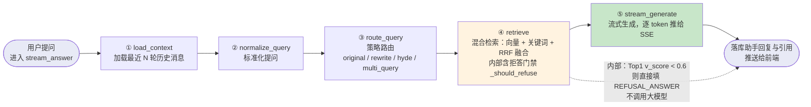
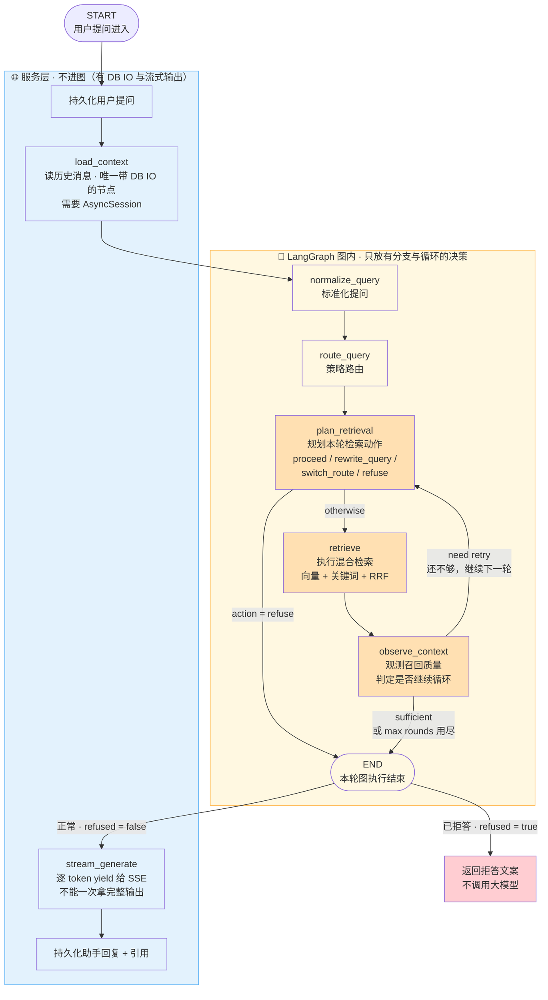
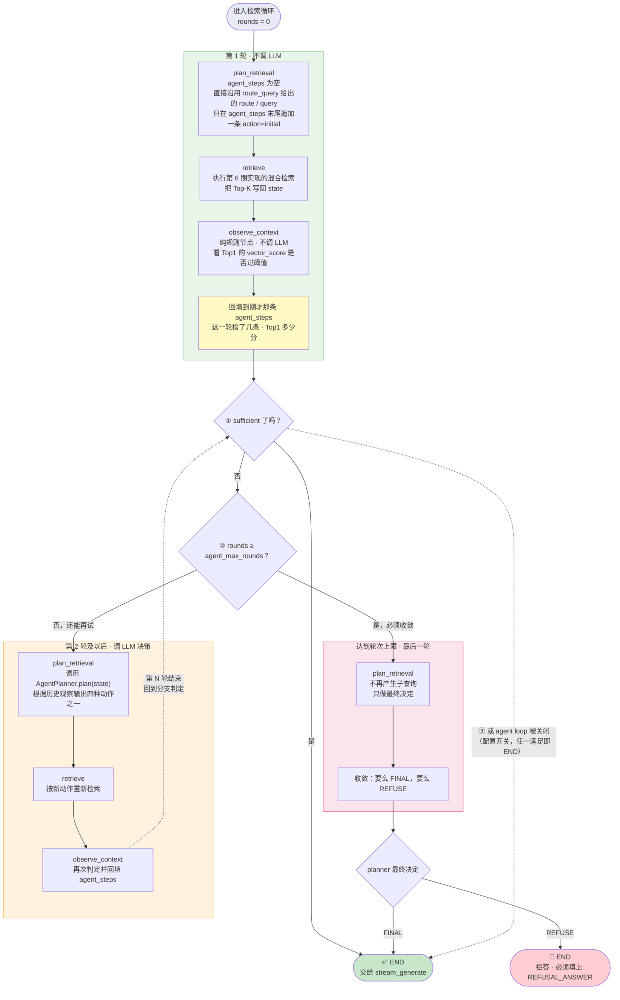
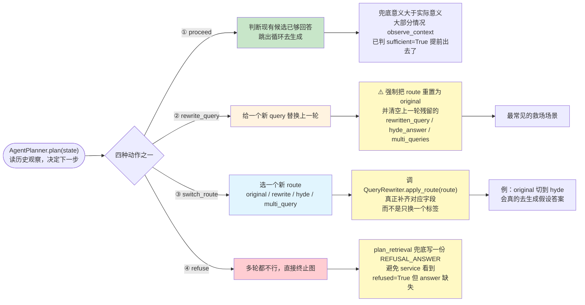

# 01_需求分析与方案设计

> 章节：Day07_Agentic RAG · 第 1 章 需求分析 · 第 2 章 方案设计
> 覆盖：为什么要改、要改成什么形状、LangGraph 的图边界怎么划、三个节点与四种动作
> 记录日期：2026.09.21

---

## 一、本期的位置与起点

前六期把 RAG 链路从**「单路向量」**升级到**「Query 优化 + 混合检索 + RRF 融合」**，但整条链路的**形状没变过**：



> **图 01** 当前流程（线性 RAG）

**读图要点**：整条线**只有一个向右的箭头，没有任何回头的线**。一步做完就往下走，**首轮召回不准没有任何补救机会**。

---

## 二、需求分析

### 2.1 根本问题：一次召回定生死

当前流程是**一次性走到底**的，中间**没有反思也没有回退**。一旦首轮召回不准（Query 表述不对、路由选错、知识库确实不覆盖），系统只能：

- 拿着那批 chunk 去生成（可能答偏）
- 或者直接拒答

### 2.2 要解决的四种场景

| # | 场景 | 现在的行为 | 应该变成 |
| --- | --- | --- | --- |
| ① | **召回为空** | 直接拒答 | **自动换 Query 再试 / 换策略再试** |
| ② | **召回的 chunk 都低分** | 带着低质内容硬答（阈值之上但实际不相关） | **改 Query / 换策略再来一轮** |
| ③ | **多轮仍不够** | 不存在"多轮"概念 | **提前拒答**，别让弱证据进 LLM |
| ④ | **每轮的决策依据** | 前端完全看不到 | **留痕 `agent_steps`**，便于复盘 |

### 2.3 核心需求一句话

> **把检索流程从「单次直通」变成「闭环循环」。**

---

## 三、方案设计

### 3.1 为什么这一期才正式使用 LangGraph

前几期其实已经用了 `app.workflows.nodes` 下的**节点函数**，但 `ChatService.stream_answer` 是**手动顺序 `await`** 它们的：

```python
state.update(await load_context(state, session))
state.update(await normalize_query(state))
state.update(await route_query(state))
await self._persist_user_message(state, session)
state.update(await retrieve(state))
state.update(await self._persist_assistant_message(state, session))
```

**这种写法在流程比较直线时效率最高**：节点入口出口都看得见，调试起来直接 `print` 就可以。

**但从这一期开始，检索流程出现了真正的条件循环**：

- 发现上下文不够要**回到检索步骤**
- 达到最大轮数要**停止**
- 如果继续在 service 里写，就会变成**嵌套 `while` + `if/elif` 的状态机**，之后再加新节点都会很痛苦

**LangGraph 的 `StateGraph` 处理这种情况合适**：

| 能力 | 手搓 `while/if` | LangGraph |
| --- | --- | --- |
| 循环与条件跳转 | 嵌套分支，越加越乱 | `add_conditional_edges` **声明式** |
| 节点返回值 | 必须返回全量 state | **返回增量 dict**（partial state） |
| 流程可视化 | 靠注释画图 | 图结构**本身可导出** |
| 加节点 | 改多处 | `add_node` 一行 |

**而且底层完全兼容**：现有节点函数都是 `async def xxx(state) -> dict`，**天然就是 LangGraph 节点**（LangGraph 的规范正是"`async` 函数，参数是 state，返回值是 partial state"）。**前几期写的东西不用重写。**

### 3.2 ⚠️ 关键判断：LangGraph 的「图」并不是越大越好

> 图越大，状态、分支、调试、成本和测试复杂度都会同步上升。**所以我们要先把图的边界定义清楚。**

**哪些节点进图、哪些留在 service** —— 两条判据如下：

| 节点 | 为什么不进图 | 官方理由（原文要点） |
| --- | --- | --- |
| `load_context` | **要拿 `AsyncSession` 读历史消息** | "是唯一带 DB IO 的节点。把 session 透传进图意味着**所有节点签名都得多个 `session` 参数**，或者要在图配置里塞一个**全局 session**，两种方案都会**污染节点纯度**" |
| `generate` | **要逐 token `yield` 给 SSE** | "而 LangGraph 的 `ainvoke` 更适合拿到**一次完整图执行后的最终结果**。强行把流式塞进节点要么**破坏 SSE 的实时性**、要么要走 LangGraph 的事件流接口（`astream_events`），都不如**直接在 service 里 `await stream_generate` 干净**" |

**结论（官方原话）**：

> LangGraph 只负责「**要不要检索、怎么检索、检索够不够、是否继续检索**」这些**有分支和循环的决策逻辑**；
> **上下文加载和最终流式回答仍然留在业务服务层处理**。

### 3.3 本期图的覆盖范围（官方 `get_graph()` 输出）

```
START → normalize_query → route_query → plan_retrieval
                                          ├─ action=refuse ──────────────→ END
                                          └─ otherwise → retrieve → observe_context
                                                                          ├─ need retry ──→ plan_retrieval
                                                                          └─ sufficient 或 max rounds ──→ END
```

**图内只有 5 个节点 + `END`**。`load_context` / `stream_generate` / 两处持久化**都在服务层**。

### 3.4 目标架构全景（含服务层，便于看清边界）



> **图 02** 目标架构与图边界

**⚠️ 读图须知**：`END` 之后那两条**不是图的边**，是**服务层根据 `state["refused"]` 做的判断**。官方图里只有蓝框之外的 5 个节点 + `END`；蓝框内是服务层，**刻意不进图**（理由见 §3.2）。

### 3.5 检索子图的核心：三个节点（官方流程 5 条）

检索子图的核心是 `plan_retrieval`、`retrieve`、`observe_context` 这三个节点：

1. **首次进入 `plan_retrieval`** 时 `agent_steps` 还是空，节点**不调 LLM**，直接沿用 `route_query` 给出的 `route` / `query`，**只在 `agent_steps` 末尾追加一条 `action=initial` 的记录**
2. **`retrieve`** 执行上一期实现的**混合检索**，把 Top-K 写回 state
3. **`observe_context` 是纯规则节点**：看 Top1 `vector_score` 是否过 `retrieval_min_score` 阈值，过则 `sufficient=True`，**并把「这一轮检了几条、Top1 多少分」回填到刚才那条 `agent_steps` 上**
4. **回到分支判定**：**足够 / 达到 `agent_max_rounds` 上限 / 关闭了 agent loop**，**任一满足就 `END`**；否则回 `plan_retrieval` 让 LLM 决策下一步
5. **第二轮 `plan_retrieval`** 会调用 `AgentPlanner.plan`，根据历史观察输出**四种动作之一**

### 3.6 循环展开图



> **图 03** 检索循环展开

### 3.7 `plan_retrieval` 的四种动作

`plan_retrieval` 节点会输出**固定的四个 action**，覆盖「**试一下能不能救回来**」到「**直接放弃**」的全部决策：



> **图 04** Planner 四种动作

**四种动作对照表**：

| 动作 | 语义 | 兜底 / 实际意义 | 关键副作用 |
| --- | --- | --- | --- |
| **`proceed`** | 模型自己判断现有候选已经够回答了，跳出循环走生成 | **兜底意义大于实际意义** —— 大部分情况 `observe_context` 已经判 `sufficient=True` 提前出去了 | 无 |
| **`rewrite_query`** | 模型给一个新 query 替换上一轮 | **最常见的救场场景** | **强制把 `route` 重置为 `original`** + 清空上一轮残留的 `rewritten_query` / `hyde_answer` / `multi_queries` |
| **`switch_route`** | 模型选一个新 route | 原路彻底没用时 | 调 **`QueryRewriter.apply_route(route)`** 真正补齐对应字段，**而不是只换一个标签**（例：`original` → `hyde` 会**真的去生成假设答案**） |
| **`refuse`** | 多轮都不行，直接终止图 | 兜底 | `plan_retrieval` 兜底写一份 `REFUSAL_ANSWER`，**避免 service 看到 `refused=True` 但 `answer` 缺失** |

---

## 四、⭐ 两个必须提前记下的高危点

这两条官方文档**没有明确说明**，但从设计推导出来的**必然要求**。实现时必须核对，否则会出现难查的 bug。

### 4.1 ⚠️ `rounds` 的自增位置（漏了会**死循环**）

图 03 左上有 `rounds = 0` 的初始值，判定处有 `rounds ≥ agent_max_rounds`，但**官方文档没有明说哪里自增**。

**推导**：自增**必须发生在回到 `plan_retrieval` 之前**（例如 `observe_context` 返回 `need retry` 时自增，或在 `plan_retrieval` 入口处自增）。

**如果漏了自增**：

```
rounds 永远是 0
  → rounds ≥ agent_max_rounds 永远为假
  → 循环永远不退出
  → 【无限循环】，每轮一次 LLM + 两次检索
```

**这比 `observe_context` 判据写错更危险** —— 判据写错只是"变慢"（每轮都跑满上限），而漏自增是**请求永远不返回**。**这是本期最容易埋的死循环 bug。**

### 4.2 ⚠️ `agent loop 被关闭` 这条路径下 `refused` 怎么定

官方原文是"**足够 / 达到上限 / 关闭了 agent loop，任一满足就 `END`**"。图 03 里那条虚线**直接从 `observe_context` 的判定处通往 `✅ END`，绕过了 `planner 最终决定` 菱形**。

**这是对的**（`END` 本就该直达），**但语义上要留意**：

```
agent loop 关掉 = 不做多轮了，就用当前这一轮的结果
  → 不经过 planner 的最终决定是合理的
  → 但【refused 的取值只能来自 observe_context 的判定】
```

**需要确认的边界**：如果此时 `sufficient = False`（召回质量不达标），那么应该

- ① 带着现有 chunk 去生成？还是
- ② 直接拒答？

**官方文档未明确**。实现时按 ② 处理更安全（与 `observe_context` 的判据保持一致的严格性），但**必须与教程后续代码核对**。

---

## 五、实现顺序（官方给出的路线）

> 先装依赖、加配置，再实现新的节点函数，最后用 `StateGraph` 把它们编排成图。

| 步骤 | 内容 | 备注 |
| --- | --- | --- |
| 1 | **装依赖** | `langgraph`（已装 **1.2.11**） |
| 2 | **加配置** | `agent_max_rounds`（循环上限）、agent loop 开关 |
| 3 | **实现新节点函数** | `plan_retrieval` / `observe_context` + `AgentPlanner` |
| 4 | **扩展 `RAGState`** | `agent_steps` / `rounds` / `sufficient` / `next_action` 等 |
| 5 | **组装 `StateGraph`** | `add_node` + `add_edge` + `add_conditional_edges` |
| 6 | **接入 `ChatService`** | 用图替换手动的 `await retrieve(state)` |

---

## 六、本期开始前的代码基线（实测）

```
app/workflows/rag_state.py      68 行   RAGState（13 个字段）
app/workflows/nodes/__init__.py 26 行
app/workflows/nodes/generate.py 68 行   stream_generate
app/workflows/nodes/load_context.py 46 行
app/workflows/nodes/normalize_query.py 28 行
app/workflows/nodes/retrieve.py 143 行   （第 6 期改造后）
app/workflows/nodes/route_query.py 75 行
app/workflows/nodes/__init__.py   ——   5 个节点都是普通 async 函数

❌ 没有任何 LangGraph 图组装代码
   （全仓库搜 StateGraph / add_conditional_edges / add_edge / add_node → 零命中）
✅ langgraph 1.2.11 已安装
```

**现有 `RAGState` 的 13 个字段**：

```
conversation_id / question / chat_history / query / route
rewritten_query / hyde_answer / multi_queries
retrieved_chunks / refused / answer
user_message_id / assistant_message_id
```

**本期需新增**（预估）：`agent_steps`、`rounds`（或 `agent_rounds`）、`sufficient`、`next_action` 等 —— 具体字段名以教程实现截图为准。

---

## 七、一句话总结

> 本期把 RAG 链路从**「单次直通」**升级为**「闭环循环」**：前三期解决的是"**怎么检索得更好**"（Query 优化、混合检索、RRF），
> 本期解决的是"**检索不够好时怎么办**" —— 让系统自己判断「要不要检索、怎么检索、检索够不够、是否继续检索」。
> 架构上采用 LangGraph，但**图刻意画得很小**：图内只放 `normalize_query` / `route_query` / `plan_retrieval` / `retrieve` / `observe_context`
> 五个有分支与循环的决策节点，**`load_context`（唯一带 DB IO、需要 `AsyncSession`）与 `stream_generate`（逐 token yield 给 SSE、与 `ainvoke` 的"一次拿完整输出"冲突）
> 都刻意留在业务服务层** —— 因为"把 session 透传进图"或"把流式塞进节点"都会污染节点纯度或破坏 SSE 实时性；
> 循环由 `plan_retrieval`（决策）+ `retrieve`（执行第 6 期的混合检索）+ `observe_context`（纯规则的质量门禁）三个节点构成，
> **出口有三个**：`sufficient` / 达到 `agent_max_rounds` / agent loop 被关闭；
> `plan_retrieval` 首轮**不调 LLM**（沿用 `route_query` 的结果，只补一条 `action=initial`），第二轮起调 `AgentPlanner.plan` 输出
> **四种动作**：`proceed`（兜底，多半用不上）、`rewrite_query`（最常见救场，**必须同时重置 `route=original` 并清空三个残留字段**）、
> `switch_route`（**必须调 `QueryRewriter.apply_route` 真正补齐字段，不是只换标签**）、`refuse`（**兜底写 `REFUSAL_ANSWER`，避免 `refused=True` 但 `answer` 缺失**）；
> **两个实现时的高危点**：① **`rounds` 自增位置**（漏了会无限循环，比判据写错更危险）；② **agent loop 关闭路径下 `refused` 如何取值**（官方未明确）。

---

## 八、四张图一览

| # | 名称 | 回答什么 | 用途 |
| --- | --- | --- | --- |
| **01** | 当前流程（线性 RAG） | 现在长什么样、痛点在哪 | 理解需求 |
| **02** | 目标架构与图边界 | 全部节点、谁图内谁服务层、8 条边 | 理解架构决策 |
| **03** | 检索循环展开 | 循环怎么转、**三个出口**、`agent_steps` 回填 | **实现主参考** |
| **04** | Planner 四种动作 | 四种动作及触发条件与后续处理 | 实现 `AgentPlanner` 时看 |

---

## 九、记录：本归档的两轮更正

**第一轮**（初稿）—— 从一张分辨率有限的 ASCII 流程图上推断，出现四处偏差：

| # | 我推断的 | 官方原文 |
| --- | --- | --- |
| ① | `observe_context` 判定"够不够"时还看 **chunk 数** | **只看** Top1 的 `vector_score` |
| ② | 出口只有 `sufficient` / `max_rounds` | **三个**出口，还有 **`agent loop 被关闭`** |
| ③ | 未提"回填" | `observe_context` 要把「**这一轮检了几条、Top1 多少分**」**回填到 `agent_steps`** |
| ④ | `rewrite_query` 只"清空残留字段" | 还要**强制把 `route` 重置为 `original`**；`switch_route` 要**调 `apply_route` 真正补齐字段** |

**第二轮**—— 我误判"图 03 有几何歧义"（`END` 向外发两条边导致标签错位）。**该判断针对的是旧版渲染**（单个 `END` 节点发两条出边）；实际采用的版本用**两个独立终点椭圆**（`🚫 拒答` / `✅ END`），**没有歧义**。已更正。

**教训**：**从低分辨率截图或非官方图推断架构细节，必须明确标注"这是推断"**，并与官方文档逐条核对后再落进归档与实现。

---

## 十、关联索引

| 位置 | 说明 |
| --- | --- |
| `app/workflows/rag_state.py` | `RAGState`（本期需扩展：`agent_steps` / `rounds` / `sufficient` / `next_action`） |
| `app/workflows/nodes/retrieve.py` | 第 6 期已改造的检索节点，本期 `retrieve` 节点**直接复用** |
| `app/workflows/nodes/route_query.py` | 第 5 期的策略路由，`plan_retrieval` **首轮沿用它的结果** |
| `app/llm/query_rewriter.py` | `QueryRewriter`，本期需补 **`apply_route`**（供 `switch_route` 调） |
| `app/services/chat_service.py` | `stream_answer`（本期接图；`load_context` / `stream_generate` 仍留在此层） |
| `app/core/config.py` | 本期需加 `agent_max_rounds` 与 agent loop 开关 |
| `langgraph` | 1.2.11 已安装 |
