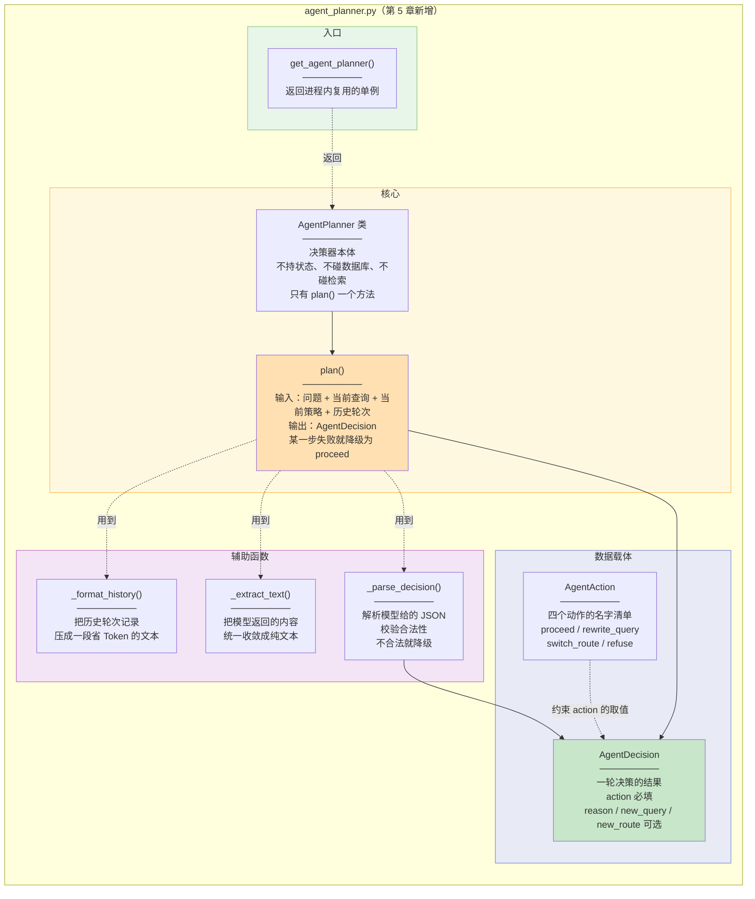
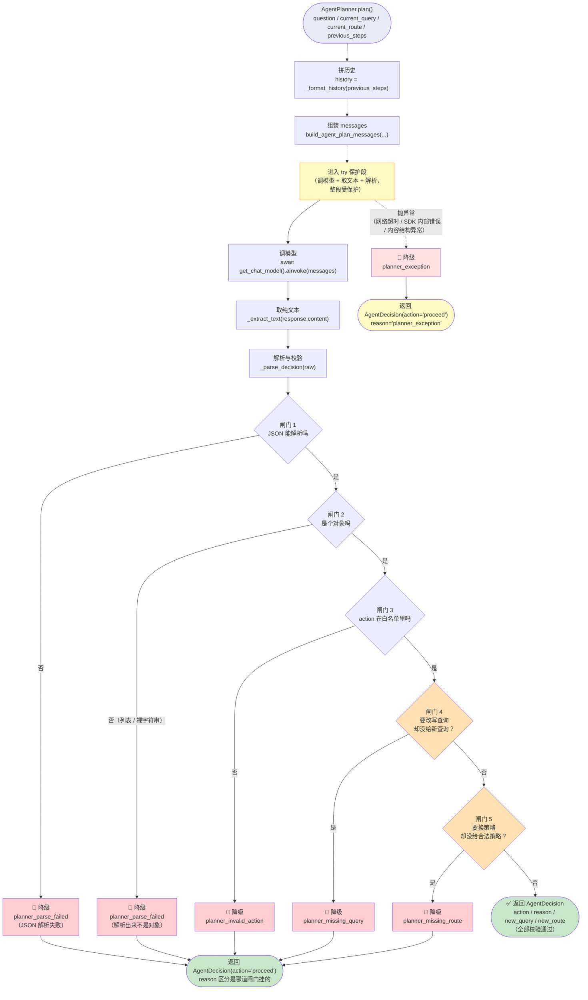

# 02_AgentPlanner封装

> 章节：Day07_Agentic RAG · 第 3 章 后端实现 · **第 5 步**
> 覆盖：`backend/app/llm/agent_planner.py`（新建，305 行）
> 记录日期：2026.09.21

---

## 一、本批次定位

第 4 章把 prompt 写好了，但它只是一段**模板 + 装配函数**。本批次把它封装成一个**可调用对象**，负责「**调模型 → 解析单行 JSON → 校验合法性 → 降级**」这条完整链路。

```
第 4 章做的（prompts.py）              第 5 章做的（agent_planner.py）
──────────────────────                ──────────────────────────
AGENT_PLAN_PROMPT            ──→      AgentPlanner.plan()
build_agent_plan_messages             ├─ _format_history()   拼历史
                                      ├─ 调模型 + _extract_text()
                                      ├─ _parse_decision()   解析 + 校验
                                      └─ 六条降级路径
                                              ↓
                                      AgentDecision（决策结果）
```

| 文件 | 改动 | 行数 |
| --- | --- | --- |
| `app/llm/agent_planner.py` | **新建** | **305** |

---

## 二、两张图

### 2.1 图 1：模块部件总览（静态结构）



**读图要点**：`AgentPlanner` 框里那三个"不"（**不持状态、不碰数据库、不碰检索**）是它能**脱离 LangGraph 单独测试**的原因 —— 实测 26 个用例全部不连库、不连图。

### 2.2 图 2：`plan()` 完整路径与降级（动态路径）



**读图要点**：

| # | 要点 |
| --- | --- |
| ① | 淡黄框是**受保护的整段** —— 调模型 + 取文本 + 解析**三段**，不只是"调模型"那一行 |
| ② | `P1` / `P2` 两个橙色菱形是**语义闸门** —— 与前三道"格式/取值"闸门性质不同（见 §5.5） |
| ③ | 两个绿框（`OUT1` / `OUT2`）是**两个层次的降级**：`OUT1` = 校验层失败，`OUT2` = 调用层失败 |
| ④ | 所有降级的 `action` **统一为 `proceed`**，区别只在 `reason` 字符串 → 线上靠它定位是哪一道闸门挂的 |

---

## 三、五个部件与职责

| 行号 | 部件 | 一句话职责 |
| --- | --- | --- |
| **L42** | `AgentAction` | 四个动作的名字清单（`Literal` 类型） |
| L45 / L48 | `VALID_ROUTES` / `VALID_ACTIONS` | 从类型**推导出的元组**，供运行时校验 |
| **L51-64** | `class AgentDecision` | **一轮决策的结果**（`frozen dataclass`） |
| **L67-116** | `class AgentPlanner` | 决策器本体，只有 `plan()` 一个方法 |
| L124-132 | `get_agent_planner()` | 进程级单例 |
| L135-162 | `_format_history()` | 历史记录 → 省 Token 的紧凑文本 |
| **L165-278** | **`_parse_decision()`** | **解析 + 五道闸门 + 六条降级（本模块核心）** |
| L282-305 | `_extract_text()` | 各家模型的 `content` → 统一成纯文本 |

---

## 四、两个白名单：合法取值只写一遍（L42-48）

```python
AgentAction = Literal["proceed", "rewrite_query", "switch_route", "refuse"]      # L42

VALID_ROUTES: tuple[str, ...] = get_args(QueryRoute)      # L45
VALID_ACTIONS: tuple[str, ...] = get_args(AgentAction)    # L48
```

### 4.1 为什么要 `get_args` 推导，而不是各写一份

```
AgentAction  是 Literal 类型  →  给【类型检查器】看
VALID_ACTIONS 由它推导出来     →  给【运行时校验】用

两者【单一来源】→ 永远不可能不一致
```

**若各写一份、且不一致，后果是「静默的行为错」，不是崩溃**（实证见 §8.1）：

```
把 VALID_ACTIONS 改成漏掉 "refuse"（模拟两处不一致）：

模型说：{"action":"refuse","reason":"知识库不覆盖"}    ← 该拒答
解析结果：action='proceed'  reason='planner_invalid_action'

⚠️ 结果 = 【去生成了】，而不是拒答
   → 不报错、不崩溃
   → 日志只有一条 WARNING
   → 用户看到"模型硬答了一个它本不该答的问题"（可能是编的）
```

**这比"报错"危险得多** —— 报错会立刻发现，而这个是**静默地降低答案可信度**。

### 4.2 `VALID_ROUTES` 的源头是第 5 期

```
QueryRoute（第 5 期，前端契约也用）→ VALID_ROUTES（本模块校验）
```

**⚠️ 但跨语言无法靠推导对齐**：前端是 TypeScript，没法 `get_args`。前端那份白名单**只能靠契约注释 + 测试**保证一致（`QueryRoute` 的注释已写明"必须与前端 `QueryRouteRead.route` 严格一致"）。

**所以 `get_args` 保证的是「Python 侧内部一致」，跨语言还得靠约定。**

---

## 五、`_parse_decision`：六步流水线（L165-278）

**本模块的核心。** 六步切分：

```
第一步 文本前置清洗       L177-194（标题在 L178）
第二步 JSON 反序列化      L196-207（标题在 L197）  ← 闸门 1
第三步 顶层类型防御       L209-216（标题在 L210）  ← 闸门 2
第四步 字段提取与清洗     L218-253（标题在 L219）  ← 闸门 3
第五步 联动一致性校验     L255-266（标题在 L256）  ← 闸门 4、5
第六步 构造决策对象       L268-278（标题在 L269）
```

### 5.1 第一步：文本前置清洗（L177-194）

```python
    text = raw.strip()
    if text.startswith("```"):
        text = text.lstrip("`")
        if text.lower().startswith("json"):
            text = text[4:]
        text = text.strip()
        if text.endswith("```"):
            text = text[:-3]
        text = text.strip()
```

**为什么要剥 markdown 围栏**：prompt 里明确说了"只输出单行 JSON"，但模型**经常惯性包 ` ```json `**。剥一层成本极低，能省掉一次无谓降级。

**三个切片语法**：`lstrip("`")` 剔除左侧反引号、`text[4:]` 跳过 `json`、`text[:-3]` 丢弃闭合的 ```。

### 5.2 第二步 + 第三步：两道格式闸门（L201-216）

```python
    try:
        data = json.loads(text)                    # L203
    except json.JSONDecodeError:                   # L204
        logger.warning("... 降级 proceed: raw=%r", raw)
        return AgentDecision(action="proceed", reason="planner_parse_failed")   # L207

    if not isinstance(data, dict):                 # L215
        return AgentDecision(action="proceed", reason="planner_parse_failed")   # L216
```

**⚠️ L215 容易被当成多余的**，它的必要性在于：

```
json.loads('"hello"')   → 返回 str     ← "解析成功"但根本不是决策对象
json.loads('[1,2,3]')   → 返回 list    ← 同上
                          ↓ 若不判 dict
        data.get("action", "")  →  AttributeError: 'list' object has no attribute 'get'
```

**`%r` 的作用**：带引号与转义符打印，**便于排查模型吐出的特殊乱码**。

**两条降级共用同一个 `reason`** —— 语义上都是"解析出来的东西不是决策对象"，可合并；排查时看 `raw=%r` 就行。

### 5.3 第四步：字段提取与清洗（L218-253）—— 闸门 3

**4.1 `action`（L224-231）**

```python
    action = str(data.get("action", "")).strip().lower()
    if action not in VALID_ACTIONS:
        logger.warning("agent planner 返回非法 action，降级 proceed: action=%r", action)
        return AgentDecision(action="proceed", reason="planner_invalid_action")
```

**三次归一化**：

| 操作 | 防的是什么 |
| --- | --- |
| `.get("action", "")` | 键缺失 |
| `str(...)` | 模型返回数字 / `None` 等非字符串 |
| `.strip().lower()` | 大小写与空白差异（`"PROCEED"` → `"proceed"`） |

**实测**：`{"action":"PROCEED"}` 正确归一为 `proceed`（**不降级**）；`{"action":"teleport"}` → 降级。

**4.3 `new_query`（L237-244）**

```python
    new_query_raw = data.get("new_query")
    new_query = (
        str(new_query_raw).strip()
        if isinstance(new_query_raw, str) and new_query_raw.strip()
        else None
    )
```

**三重防御**：非字符串 → `None`；空串 → `None`；**纯空白 `"   "` → `.strip()` 后为空 → `None`**。

**⚠️ 最后那条最关键**：不写 `and new_query_raw.strip()`，**纯空白串会被当成合法查询** → 下游"改写"成空查询 → 检索直接返回空。

**4.4 `new_route`（L246-253）**

```python
    if isinstance(new_route_raw, str) and new_route_raw.strip().lower() in VALID_ROUTES:
        new_route = new_route_raw.strip().lower()
    else:
        new_route = None
```

**⭐ 为什么 `new_route` 要白名单而 `new_query` 不用**：

| 字段 | 性质 | 能不能枚举 |
| --- | --- | --- |
| `new_query` | **自由文本** | ❌ 无法枚举 —— 任何查询词都合法 |
| `new_route` | **有限枚举值** | ✅ 只有 4 个 |

**更关键的是"用途"**：

```
new_route 不是给模型看的，是给【程序】用的 —— 它决定调用哪个检索实现
    下游用法：QueryRewriter.apply_route(route) → 按 route 名查表/分支
             "graph" 这种自创值 → 查不到实现

new_query 只是被当成一段文本送进检索器 → 任何字符串都能用
```

**所以 `new_route` 必须卡白名单，本质是「它要被程序索引」。**

**注意"不在白名单"不是降级整个决策，而是把 `new_route` 置 `None`** —— 然后由第五步统一处理。**责任分层**：第四步管"**字段合法化**"，第五步管"**决策可执行性**"。

### 5.4 ⭐ 第五步：联动一致性校验（L255-266）—— 本模块最值得学的部分

```python
    if action == "rewrite_query" and not new_query:              # L260
        logger.warning("... 缺 new_query，降级 proceed")
        return AgentDecision(action="proceed", reason="planner_missing_query")

    if action == "switch_route" and not new_route:               # L264
        logger.warning("... 缺 new_route，降级 proceed")
        return AgentDecision(action="proceed", reason="planner_missing_route")
```

**⚠️ 为什么必须有**：`action` 通过了白名单**不等于决策可执行**。

```
模型输出：{"action": "rewrite_query", "reason": "换个说法试试"}
                      ↑ 合法                    ↑ 但没给 new_query
        ↓ 若不校验
返回 AgentDecision(action="rewrite_query", new_query=None)
        ↓ 下游 plan_retrieval 拿到后
"要改写查询，但新查询是空的" → 【什么都没改就再检索一遍】
        → 白跑一轮 LLM + 两路检索，【且不报错】
```

**⭐ 一句话：合法 ≠ 可执行。**

| 校验层 | 闸门 | 挡什么 |
| --- | --- | --- |
| 格式层 | 闸门 1（能解析）+ 闸门 2（是对象） | JSON 坏、不是对象 |
| 白名单层 | 闸门 3（`action` 合法） | 模型自创 action |
| **可执行层** | **闸门 4 / 5** | **"合法但不可执行"** |

**实测覆盖三种"给了但无效"**：

| 输入 | 结果 |
| --- | --- |
| `{"action":"rewrite_query"}` | 降级 `planner_missing_query` |
| `{"action":"rewrite_query","new_query":"   "}` | 降级（**纯空白**） |
| `{"action":"rewrite_query","new_query":123}` | 降级（**非字符串**） |

### 5.5 第六步：构造决策对象（L268-278）

```python
    return AgentDecision(
        action=action,  # type: ignore[arg-type]
        reason=reason,
        new_query=new_query,
        new_route=new_route,
    )
```

**`# type: ignore[arg-type]` 是必需的**：`action` 运行时是 `str`，而字段声明为 `AgentAction`（`Literal`）。类型检查器无法理解"上面已用 `VALID_ACTIONS` 校验过了"，需人工标注。

**⚠️ 待补**：L251 附近的 `new_route = new_route_raw.strip().lower()` **还缺一个 `# type: ignore[assignment]`** —— 否则 `str` 赋给 `QueryRoute | None` 会有类型告警。

---

## 六、`plan()` 主流程（L78-116）

```python
    async def plan(self, question, current_query, current_route, previous_steps):
        history = _format_history(previous_steps)                    # L94
        messages = build_agent_plan_messages(...)                    # L97

        try:                                                          # L106
            response = await get_chat_model().ainvoke(messages)       # L108
            raw = _extract_text(response.content)                     # L110
            return _parse_decision(raw)                               # L112
        except Exception:                                             # L113
            logger.exception("agent planner 调用失败，降级 proceed: question=%r", question)
            return AgentDecision(action="proceed", reason="planner_exception")   # L116
```

### 6.1 ⭐ 两层兜底的分工

| 层 | 位置 | 挡什么 |
| --- | --- | --- |
| **内层** | `_parse_decision` 里的 `try`（只包 `json.loads`，L201-207） | **能预期的坏数据**：非 JSON、字段非法、决策不可执行 |
| **外层** | `plan()` 的 `try`（L106-116） | **没预料到的**：网络超时、SDK 内部错误、`content` 结构异常 |

**为什么 `_extract_text` 也要包进外层**（而不只是"调模型"那一行）：

```
_extract_text 是【最容易因厂商差异出意外】的那一段
    content 的运行时类型可能是 str / list[dict] / list[str] / None
    换个模型厂商或升个 langchain 版本就可能变

反而 ainvoke 那一行比较"标准"（网络 / 超时），异常类型更好预期
```

### 6.2 降级目标是 `proceed`，不是 `refuse`

```python
            return AgentDecision(action="proceed", reason="planner_exception")   # L116
```

| 降级到 | 后果 |
| --- | --- |
| `proceed` ✅ | 「就按当前候选去生成」—— 等价于**不开 agent 循环**的行为 |
| `refuse` ❌ | 用户会因为**决策器自己出错**而拿不到答案 —— 明明内部故障，却显示"知识库没有相关内容" |

**决策器是"锦上添花"的环节**：给不出更聪明的下一步也不该让链路失败。

### 6.3 为什么传 `question` 而不只是 `current_query`

```
current_query 可能已被改写好几轮 → 可能已跑偏
question 永远是"用户到底想要什么"的锚点
```

**两者都给模型，让它判断"是不是改写着走着偏了"。**

---

## 七、`_format_history`（L135-162）与 `_extract_text`（L282-305）

### 7.1 `_format_history`：为什么不用 `json.dumps`

```python
    if not steps:
        return "（无）"                                     # L148

    lines: list[str] = []
    for step in steps:
        lines.append(
            f"round={step.get('round')} action={step.get('action')} "
            f"route={step.get('route')} query={step.get('query')} "
            f"retrieved_count={step.get('retrieved_count')} "
            f"top_score={step.get('top_score')} "
            f"sufficient={step.get('sufficient')}"
        )
    return "\n".join(lines)
```

**取的是 7 个字段**（`reason` 被丢弃）。

| # | 为什么不用 `json.dumps` |
| --- | --- |
| ① | **Token 成本**：`agent_steps` 含 `reason`（长句）与 `query`，整段 JSON 序列化会把预算吃掉大半 |
| ② | **信噪比**：决策器真正需要的是「第几轮、什么动作、什么策略、检了几条、多少分」这几个**数** |
| ③ | **可读性**：一行一轮，模型更容易对齐（实测它的 `reason` 里直接引用了 `top_score 0.38`、`0.41`） |

**实测渲染结果**：

```
round=1 action=initial route=original query=接口 retrieved_count=5 top_score=0.74 sufficient=None
```

**⭐ 全程 `.get()` 而不是 `[]`（L155-159）**：

```
第 3 章的设计：plan_retrieval 先追加决策字段，observe_context 后补观察字段

plan 刚追加时：  {'round':1, 'action':'initial', 'route':..., 'query':...}
                 ← retrieved_count / top_score / sufficient 【这三个键还不存在】

observe 回填后： {... , 'retrieved_count':5, 'top_score':0.74, 'sufficient':True}
```

**所以第二轮决策时，最新那条记录恰好是"缺三个键"的** —— 用 `[]` 就 `KeyError`，用 `.get()` 稳稳返回 `None`。

**⚠️ 措辞要准确**：是「**键还不存在**」，而不是「**有键没值**」：

```python
step.get('top_score')     # → None   ← 键不存在，.get 返回 None
'top_score' in step       # → False  ← 键压根不在
```

**实测**（缺字段不抛异常）：

```
_format_history([{'round':1,'action':'initial'}])
→ 'round=1 action=initial route=None query=None retrieved_count=None top_score=None sufficient=None'
```

### 7.2 `_extract_text`：为什么要收敛类型

```python
def _extract_text(content: str | list[str] | dict) -> str:
    if isinstance(content, str):
        return content
    if isinstance(content, list):
        return "".join(
            str(part.get("text", "")) if isinstance(part, dict) else str(part)
            for part in content
        )
    return str(content or "")
```

**`BaseMessage.content` 的运行时类型随厂商与 langchain 版本变化**：

| 结构 | 何时出现 |
| --- | --- |
| `str` | 最常见 |
| `list[dict]` | **多模态分块**，如 `[{"type":"text","text":"..."}]` |
| `list[str]` | 少数客户端 |
| `None` / 其他 | 空响应 |

**⚠️ 实测细节**：`hasattr(BaseMessage, "content")` 是 **`False`** —— `content` 是**实例属性**而非类属性。**所以不能靠类型标注判断，必须运行时收敛。**

**实测五种结构全部正确**：`str→'abc'`、`list[dict]→'abcd'`、`list[str]→'xy'`、`None→''`、`dict→"{'a': 1}"`。

---

## 八、验证结果

### 8.1 单元测试（不经模型，纯解析逻辑）

| 层 | 结果 |
| --- | --- |
| **正常解析** | **6/6**（含 markdown 围栏剥离、大小写归一、策略名归一） |
| **降级路径** | **10/10**（全部 `proceed` + 正确 `reason`，且都记 `WARNING`） |
| **边界** | `_format_history` 空 → `"（无）"`；`_extract_text` 五种结构 ✅ |
| **单例** | `get_agent_planner() is get_agent_planner()` = `True` |

**正常解析明细**：

```
{"action":"rewrite_query","reason":"x","new_query":"q"}  -> rewrite_query / q / None
{"action":"switch_route","new_route":"hyde"}             -> switch_route / None / hyde
{"action":"refuse"}                                      -> refuse / None / None
{"action":"proceed"}                                     -> proceed / None / None
```json {"action":"PROCEED"} ```                          -> proceed（围栏剥离 + 大小写归一）
{"action":"switch_route","new_route":"HYDE"}             -> new_route='hyde'（策略名归一）
```

**降级明细（10 条）**：

| 输入 | reason |
| --- | --- |
| 非 JSON / 顶层是列表 / 顶层是字符串 | `planner_parse_failed` |
| `action` 非法（`"teleport"`）/ 缺失 | `planner_invalid_action` |
| `rewrite_query` 缺 `new_query` / 纯空白 / 非字符串 | `planner_missing_query` |
| `switch_route` 缺 `new_route` / 非法（`"graph"`） | `planner_missing_route` |

### 8.2 端到端（真实 LLM）

| 场景 | 输出 `action` | 附带字段 | 耗时 |
| --- | --- | --- | --- |
| 含指代、一次都没命中 | `rewrite_query` | `该课程的学分是多少` | 3.35s |
| rewrite 已试过 | `switch_route` | `hyde` | 1.67s |
| 两轮全空 | `refuse` | — | 1.83s |
| 首轮空历史 | `rewrite_query` | `API接口认证方式有哪些，如…` | 1.64s |

**后两个场景完美符合 prompt 里的启发式规则**（"已试过 rewrite → 试 hyde"、"已试过 multi_query → refuse"）。

**异常降级实测**（把模型换成抛异常的桩）：

```
RuntimeError: 模拟模型服务 5xx
  → action='proceed'  reason='planner_exception'
  → 未抛异常，日志里有完整堆栈
```

### 8.3 与第 4 章裸 prompt 的对比

| 场景 | 第 4 章（裸 prompt） | 第 5 章（经 AgentPlanner） |
| --- | --- | --- |
| "**它的**学分是多少" | `课程学分` | **`该课程的学分是多少`** |

**仍然没消解"它"是哪门课**（根因不变：prompt 入参没有对话历史），但**保留了"学分"这个关键实体、去掉了"它"这个无意义词**。

**这印证了第 4 章归档里的待办**：`new_query` 无法消解指代是 **prompt 入参的问题，不是解析层的问题**，要等第 8 期连同 rewrite 一起修。

---

## 九、写入时我自己犯的三个错（已修正，值得记）

| # | 错误 | 后果 | 怎么发现的 |
| --- | --- | --- | --- |
| ① | **漏了 `import json`** | `_parse_decision` 里 `json.loads` 会 `NameError` | 写完后通读发现 |
| ② | **`current_query: QueryRoute`** | 类型标注错误（`QueryRoute` 是"策略名字面量"，而 `current_query` 是"查询文本"） | 第一版照抄截图，还加了个 `# noqa` 掩盖 |
| ③ | **`reason: str = None`** | 类型谎言（标 `str` 却默认 `None`） | 通读时发现 |

### 9.1 ② 最值得说：它来自**教程截图的笔误**

```
教程截图写的是:   current_query: QueryRoute
实际应该是:       current_query: str
```

**为什么截图会写错**：`plan()` 的相邻参数是 `current_route: QueryRoute`，作者很可能是**复制粘贴上面一行忘了改**。

**为什么危险**：如果**逐字照抄并加 `# noqa` 掩盖**（第一版就是这么干的），静态类型检查就永远查不出这个问题 —— 而调用方传的是 `state["query"]`（普通字符串），**类型上不匹配但运行时能跑**，于是错误被永久隐藏。

> **教训**：从截图抄代码时，**类型标注也要动脑判断**，不能因为"教程这么写的"就照抄。
> 把 `# noqa` 去掉也是同一个道理：**用一个注释压住告警，等于主动放弃发现问题的机会**。

### 9.2 另外补了一处教程缺失的常量

教程在 `_parse_decision` 里**内联字面量** `("proceed","rewrite_query","switch_route","refuse")` 做校验，但文件开头已定义了 `AgentAction`。因此补了 `VALID_ACTIONS = get_args(AgentAction)`，**与 `VALID_ROUTES` 的写法保持一致**，避免同一份合法值出现两处。

---

## 十、问题解析（五道自测题批改）

### Q1　`VALID_ACTIONS` 为什么用 `get_args` 推导？

**参考答案**：**保证合法取值只有一个来源**，避免"两处维护迟早不一致"。

**⚠️ 但必须说清后果是「静默的行为错」，不是崩溃**（实证）：

```
把 VALID_ACTIONS 改成漏掉 "refuse"：

模型说：{"action":"refuse","reason":"知识库不覆盖"}    ← 该拒答
解析结果：action='proceed'  reason='planner_invalid_action'
```

| 环节 | 发生什么 |
| --- | --- |
| 报错吗 | **不报错、不崩溃** |
| 日志 | 只有一条 `WARNING: 返回非法 action: action='refuse'` |
| **用户看到** | **模型硬答了一个它本不该答的问题**（可能是编的） |

**这比报错危险得多** —— 报错会立刻发现，这个是**静默地降低答案可信度**。

**⚠️ 另一处要修正**：不能说"前端也有白名单、没同步修改" —— **前端是 TypeScript，没法跨语言 `get_args`**。`get_args` 保证的是「**Python 侧内部一致**」，跨语言只能靠契约注释 + 测试。

| 作答 | 结果 |
| --- | --- |
| 方向（多处维护会不一致） | ✅ |
| 后果（"匹配失败"） | ⚠️ 不够具体，且未答"**不报错**"这个关键点 |

---

### Q2　`plan()` 的 `try` 为什么包三段？

**参考答案**：

```
三段 = 调模型 + 取文本 + 解析
```

**漏掉后两段的后果**：异常没人处理，**整条链路直接崩**，且不好排查。

**具体理由**：**`_extract_text` 是最容易因厂商差异出意外的那一段** —— `content` 的运行时类型可能是 `str` / `list[dict]` / `list[str]` / `None`，换个模型厂商或升个 langchain 版本就可能变。而 `ainvoke` 那一行比较"标准"（网络 / 超时）。

| 作答 | 结果 |
| --- | --- |
| 兜底目的 | ✅ |
| 漏掉的两段 | ✅ |
| 后果（崩掉 + 不好排查） | ✅ |

---

### Q3　`{"action": "rewrite_query", "reason": "换个说法"}` 合法吗？能执行吗？

**⭐ 这是本章最重要的一题，作答前半句答错了。**

**参考答案**：

```
json.loads 能解析   -> True      ← 【合法 JSON】
action 在白名单里   -> True      ← 【合法 action】（rewrite_query 是四个合法动作之一）
最终结果            -> action='proceed', reason='planner_missing_query'
```

**⭐ 结论：它是「合法」但「不可执行」的。**

| 校验层 | 闸门 | 这串 JSON |
| --- | --- | --- |
| 格式层 | 闸门 1 + 2 | ✅ 通过 |
| 白名单层 | 闸门 3 | ✅ 通过 |
| **可执行层** | **闸门 4 / 5** | ❌ **在这里被拦** |

**⚠️ 不拦的后果不是"生成极差的回答"，而是"白跑一轮"**：

```
不拦 → AgentDecision(action="rewrite_query", new_query=None)
     → 下游拿到"要改写查询，但新查询是空的"
     → 【什么都没改就再检索一遍】→ 拿到完全一样的结果
     → 白跑一轮 LLM + 两路检索，【且不报错】
```

**这是资源浪费 + 循环空转**，不是质量下降。（若这种空转把 `retrieval_round` 耗光，最后可能被迫拒答，那是间接后果。）

| 作答 | 结果 |
| --- | --- |
| "不合法" | ❌ **错**：它是合法的，只是不可执行 |
| "第五步拦截" | ✅ 步骤找得很准 |
| "会生成极差的回答" | ⚠️ 不准，实际是"**白跑一轮**" |

---

### Q4　为什么 `new_route` 要白名单、`new_query` 不用？

**参考答案**：

| 字段 | 性质 | 能不能枚举 |
| --- | --- | --- |
| `new_query` | **自由文本** | ❌ 无法枚举 |
| `new_route` | **有限枚举值** | ✅ 只有 4 个 |

**⭐ 更关键的是"用途"**：

```
new_route 是给【程序】用的 —— 它决定调用哪个检索实现
    下游：QueryRewriter.apply_route(route) → 按 route 名查表/分支
         "graph" 这种自创值 → 查不到实现

new_query 只是被当成一段文本送进检索器 → 任何字符串都能用
```

**所以 `new_route` 卡白名单的本质是「它要被程序索引」，不是「它花 Token」。**

| 作答 | 结果 |
| --- | --- |
| 方向（`new_route` 用于决策分流） | ✅ |
| 理由（"每一步都要花 Token"） | ⚠️ **不准**：两者都会被送进下一轮，Token 成本无差别 |
| 理由（`new_query` 无法白名单） | ✅ 但应表述为"**自由文本无法枚举**" |

---

### Q5　`_format_history` 为什么用 `.get()` 而不是 `[]`？

**参考答案**：

```
第 3 章的设计：plan_retrieval 先追加决策字段，observe_context 后补观察字段
→ "键还不存在"是【正常状态】，不是异常
→ 所以访问方式必须能容忍键缺失
```

**⚠️ 关键措辞**：是「**键根本不存在**」，不是「**有键但没值**」：

```python
step = {'round': 1, 'action': 'initial'}
step.get('top_score')     # → None    ← 键不存在
'top_score' in step       # → False   ← 键压根不在

# 而"有键没值"长这样（是另一种情况）：
step = {'round': 1, 'top_score': None}
```

**实测**：`_format_history([{'round':1,'action':'initial'}])` 稳稳返回 6 个 `None`，不抛异常；用 `[]` 则 `KeyError`。

| 作答 | 结果 |
| --- | --- |
| "用 `[]` 会报异常" | ✅ |
| "不利于链路退化" | ✅ |
| "有些情况下只有键，没有值" | ⚠️ **措辞错**：应是「**键还不存在**」 |

---

### 批改汇总

| 题 | 结果 | 核心缺口 |
| --- | --- | --- |
| **Q1** | ⚠️ 一半 | 未答出后果是「**该拒答却去生成**」这种**不报错的行为错**；跨语言无法靠推导对齐 |
| **Q2** | ✅ 正确 | 可补「`_extract_text` 是最易因厂商差异出意外的那段」 |
| **Q3** | ❌ **错** | **它是合法的，只是不可执行** —— 前三道闸门全部通过，卡在可执行层 |
| **Q4** | ⚠️ 一半 | 理由应落在「**`new_route` 要被程序索引**」，不是「花 Token」 |
| **Q5** | ⚠️ 一半 | 应是「**键还不存在**」，不是「有键没值」 |

**总评：1 题满分、3 题半对、1 题答错。**

### 三条必须内化的结论

**① ⭐「合法」与「可执行」是两件事（Q3）**

```
合法 JSON          ← 闸门 1、2 管
合法 action        ← 闸门 3 管
合法且可执行        ← 闸门 4、5 管   ← 这一层最容易被忽略
```

**同一个 JSON 可以同时满足前两条、却不满足第三条** —— 而且**前三道闸门的代码看起来"已经校验完了"，很容易让人以为安全了**。

**② 白名单的价值是"防止静默的行为错"，不是"防止崩溃"（Q1）**

```
不推导、两处不一致 → 不会崩溃
                   → 只会【该拒答却生成】这种静默行为错
                   → 线上极难发现（用户不会说"你该拒答没拒答"）
```

**③ 用 `.get()` 而不是 `[]` 的根因是"增量返回"（Q5）**

```
节点是增量返回的 → 字段会按执行顺序逐个出现
                → "键还不存在"是【正常状态】
                → 所以访问方式必须能容忍键缺失
```

---

## 十一、当前状态与待办

```
✅ 第 1 章 装 LangGraph（已装 1.2.11）
✅ 第 2 章 配置项（agent_loop_enabled / agent_max_rounds）
✅ 第 3 章 扩展 RAGState（+3 字段）
✅ 第 4 章 Planner Prompt（system / human / 模板 / 装配函数）
✅ 第 5 章 AgentPlanner 封装（本批次）
────────────────────────────────────────────────────────────
⬜ 第 6 章 plan_retrieval / observe_context 节点
⬜ 组装 StateGraph + 接入 ChatService
```

| # | 待办 | 何时处理 |
| --- | --- | --- |
| ① | **`retrieval_round` 必须每轮自增** —— 否则「轮次用尽」出口永不触发 → **死循环** | 第 6 章 |
| ② | L251 附近补 `# type: ignore[assignment]`（`new_route` 赋值给 `QueryRoute \| None`） | 随手可补 |
| ③ | `new_query` 无法消解指代（prompt 入参无对话历史） | 与第 8 期 rewrite 修复一起 |
| ④ | 关闭 `agent_loop_enabled` 后、`context_sufficient=False` 时该「带现有候选生成」还是「直接拒答」 | 第 5-6 章（官方未明确） |

---

## 十二、一句话总结

> 本批次把第 4 章的 prompt 封装成一个**可调用对象**：`AgentPlanner` 是**薄封装**（不持状态、不碰数据库、不碰检索，因此能脱离 LangGraph 单测），
> `plan()` 的主流程是「拼历史 → 组装 messages → 在**保护段**内完成调模型+取文本+解析」，
> 其中保护段包的是**三段而非一行**（因为 `_extract_text` 是最易因厂商差异出意外的那段），
> 且**降级目标是 `proceed` 而非 `refuse`** —— 决策器是锦上添花，它自己出错不该让用户拿不到答案；
> `_parse_decision` 是**六步流水线 + 五道闸门 + 六条降级**，其中最关键的是**第五步的联动一致性校验**：
> **`{"action":"rewrite_query"}` 是合法的 JSON、合法的 action，但不可执行** —— 不拦就会"什么都没改就再检索一遍"，**白跑一轮 LLM + 两路检索且不报错**；
> **⭐ 一句话：合法 ≠ 可执行。**
> 两个白名单（`VALID_ACTIONS` / `VALID_ROUTES`）都**从 `Literal` 类型 `get_args` 推导**，保证 Python 侧只有一处来源 ——
> 若两处不一致，后果不是崩溃而是「**该拒答却去生成**」这种**静默的行为错**，线上极难发现；
> **验证**：单元 16/16（正常 6 + 降级 10）+ 边界 8/8 + 端到端 4/4（真实模型，1.6~3.4 秒）+ 异常降级实测通过；
> **本批次还固化了一个抄代码的教训**：教程截图把 `current_query` 的标注写成了 `QueryRoute`（应为 `str`），
> 而"逐字照抄 + `# noqa` 掩盖"会让静态检查永远查不出来 —— **从截图抄代码时类型标注也要动脑判断**。

---

## 十三、关联文件索引

| 文件 | 关键位置 | 说明 |
| --- | --- | --- |
| `app/llm/agent_planner.py` | L1-16 | 模块 docstring（职责 / 分层定位 / 与 QueryRewriter 的关系） |
| `app/llm/agent_planner.py` | **L42-48** | **`AgentAction` + 两个白名单（`get_args` 推导）** |
| `app/llm/agent_planner.py` | L51-64 | `AgentDecision`（frozen dataclass，四字段） |
| `app/llm/agent_planner.py` | L67-76 | `AgentPlanner` 类（三个"不"） |
| `app/llm/agent_planner.py` | **L78-116** | **`plan()` 主流程（拼历史 / 组装 / 保护段 / 降级）** |
| `app/llm/agent_planner.py` | L106 / L108 / L110 / L112 | 保护段：try / 调模型 / 取文本 / 解析 |
| `app/llm/agent_planner.py` | L113-116 | 异常降级（`planner_exception`） |
| `app/llm/agent_planner.py` | L124-132 | `get_agent_planner()` 单例 |
| `app/llm/agent_planner.py` | L135-162 | `_format_history()`（L148 空返回 / L155-159 用 `.get`） |
| `app/llm/agent_planner.py` | **L165-278** | **`_parse_decision()` 六步流水线** |
| `app/llm/agent_planner.py` | L177-194 | 第一步：剥 markdown 围栏（标题 L178） |
| `app/llm/agent_planner.py` | L201-207 | 闸门 1：`json.loads` + `JSONDecodeError` |
| `app/llm/agent_planner.py` | **L215-216** | **闸门 2：`isinstance(data, dict)`（防 `AttributeError`）** |
| `app/llm/agent_planner.py` | L224-231 | 闸门 3：`action` 归一化 + 白名单（L227 归一 / L231 降级） |
| `app/llm/agent_planner.py` | L237-244 | `new_query` 三重防御（含纯空白） |
| `app/llm/agent_planner.py` | L246-253 | `new_route` 白名单窄化 |
| `app/llm/agent_planner.py` | **L255-266** | **第五步：联动一致性校验（标题 L256；闸门 4 L260 / 闸门 5 L264）** |
| `app/llm/agent_planner.py` | L268-278 | 第六步：构造 `AgentDecision` |
| `app/llm/agent_planner.py` | L282-305 | `_extract_text()` 收敛四种 `content` 结构 |
| `app/llm/prompts.py` | L294-352 | 第 4 章的决策器 prompt（本模块的输入契约） |
| `app/llm/models.py` | L32 | `get_chat_model()` |
| `app/llm/query_rewriter.py` | L224-231 | `get_query_rewriter()`（本模块单例写法的参照） |
| `app/workflows/rag_state.py` | L51 | `QueryRoute`（`VALID_ROUTES` 的推导源头） |
