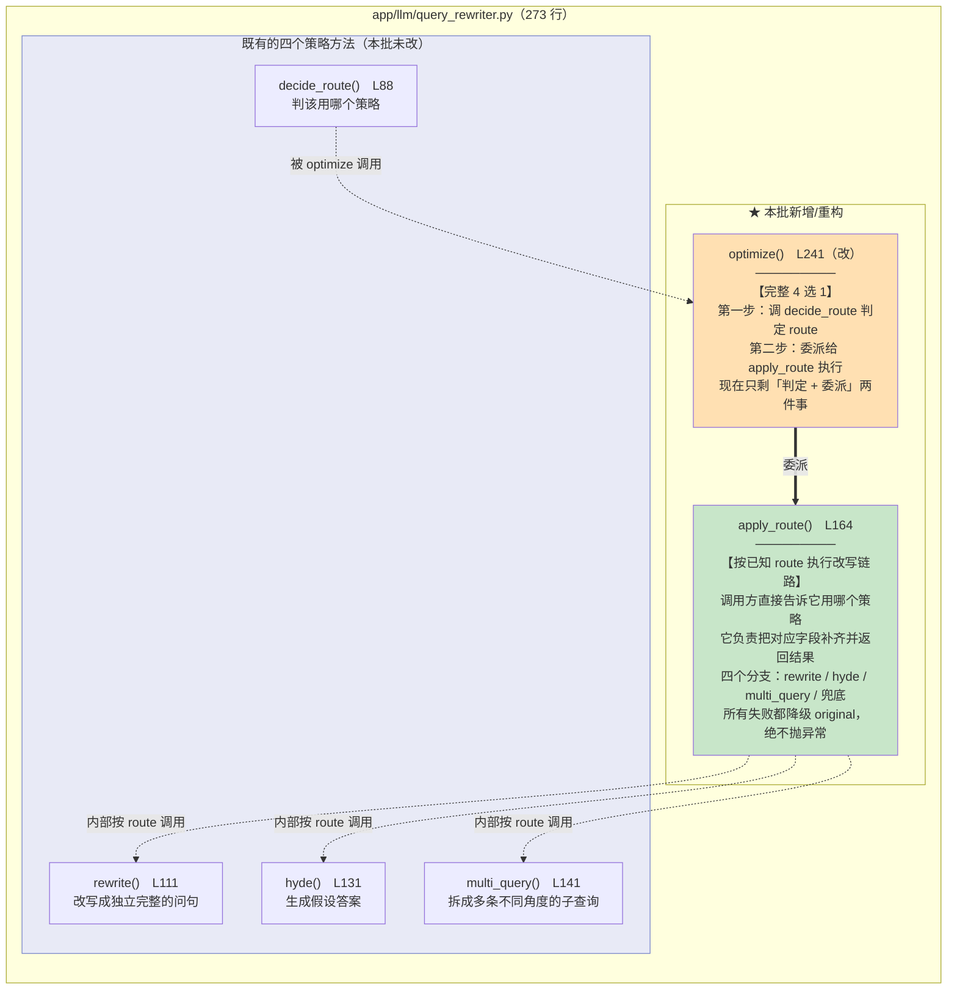
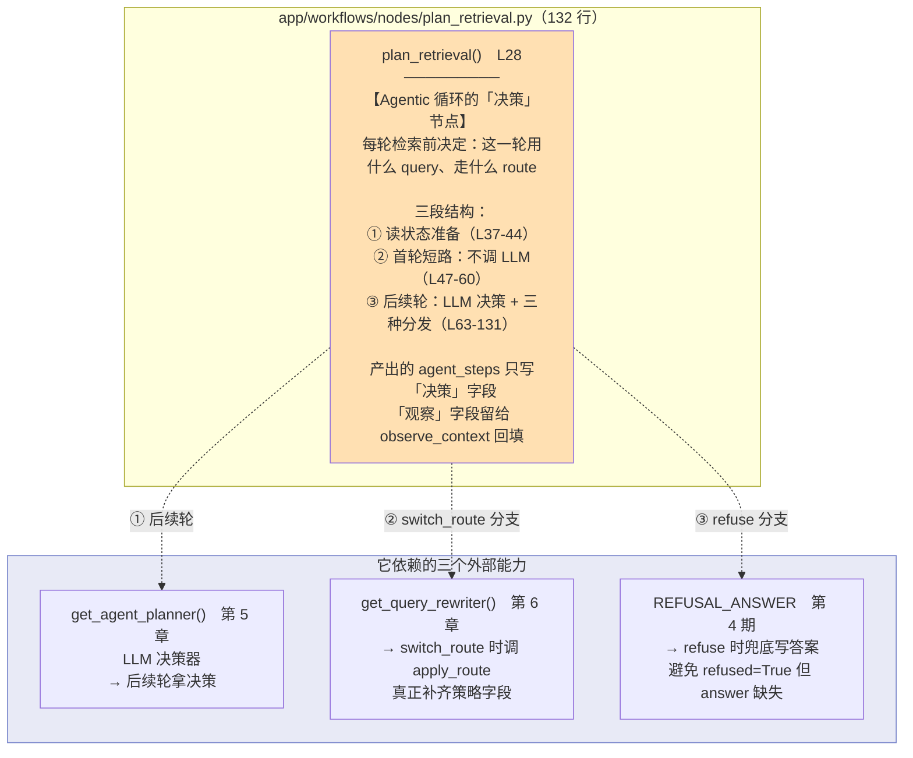
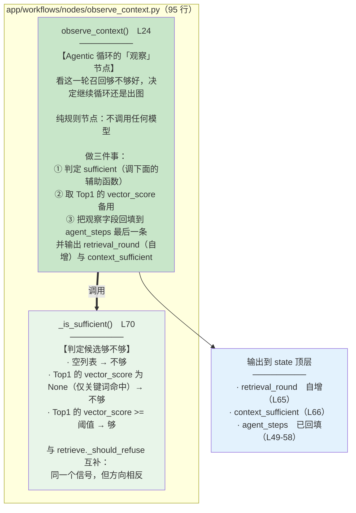
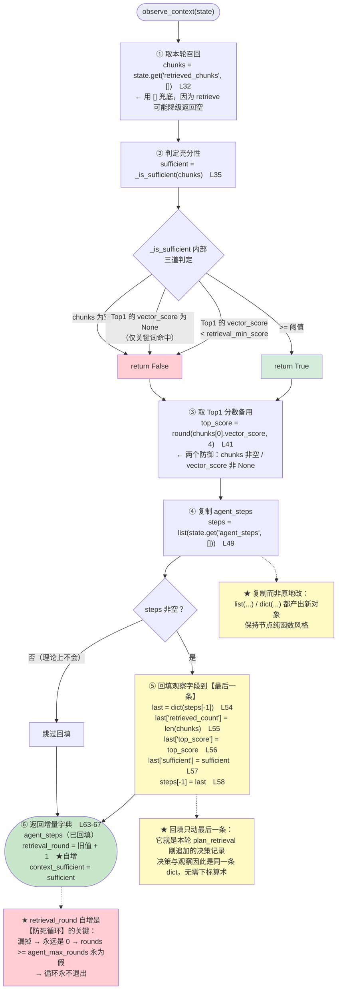
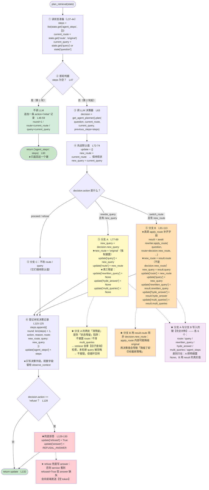

# 03_apply_route抽取与决策观察节点

> 章节：Day07_Agentic RAG · 第 3 章 后端实现 · **第 6-8 步**
> 覆盖：
> - 第 6 章 复用 `QueryRewriter.apply_route`（`backend/app/llm/query_rewriter.py`，**重构**）
> - 第 7 章 `plan_retrieval` 节点（`app/workflows/nodes/plan_retrieval.py`，**新建**）
> - 第 8 章 `observe_context` 节点（`app/workflows/nodes/observe_context.py`，**新建**）
> 记录日期：2026.09.21

---

## 一、三章的依赖关系

```
第 6 章  query_rewriter.py   抽出 apply_route
              ↓ 被谁调用
第 7 章  plan_retrieval.py   switch_route 分支 → apply_route
              ↓ 与谁配对
第 8 章  observe_context.py  观察并回填（决定循环停不停）
```

**一句话**：第 6 章**为**第 7 章准备了一个可复用的入口；第 7 章是**决策**节点；第 8 章是**观察**节点。**决策 + 观察 = 循环的两半。**

| 章 | 文件 | 改动 | 行数 |
| --- | --- | --- | --- |
| **6** | `app/llm/query_rewriter.py` | **重构**（+47 / -11） | 234 → **273** |
| **7** | `app/workflows/nodes/plan_retrieval.py` | **新建** | **132** |
| **8** | `app/workflows/nodes/observe_context.py` | **新建** | **95** |

> **`nodes/__init__.py` 本批未动** —— 把节点暴露给图是**第 9 章**的事。

---

## 二、五张图

### 2.1 图 1：`query_rewriter.py` 函数作用图



**读图要点**：图中 `==>`（粗箭头）是**"委派"** —— `optimize` 不再自己做分发，而是把活交给 `apply_route`。

### 2.2 图 2：`plan_retrieval.py` 函数作用图



**读图要点**：它**不写 `retrieval_round`** —— 那是 `observe_context` 的职责（**职责边界**）。

### 2.3 图 3：`observe_context.py` 函数作用图



**读图要点**：`retrieved_count` / `top_score` / `sufficient` **回填到 `agent_steps[-1]`**（与本轮 `plan_retrieval` 的决策**同一条 dict**）；而 `retrieval_round` / `context_sufficient` 写到 **state 顶层**。

### 2.4 图 4：`observe_context` 执行流程图



### 2.5 图 5：`plan_retrieval` 执行流程图



---

## 三、第 6 章：抽出 `QueryRewriter.apply_route`

文件：`app/llm/query_rewriter.py`（234 → **273 行**）

### 3.1 这是一次**纯重构**，不是新功能

```
重构前：optimize = 判定 route ＋ 自己 if/elif 分发
重构后：optimize = 判定 route ＋ 委派 apply_route
        apply_route = 只有分发
```

**方法名没变、签名没变、对调用方无感。**

### 3.2 为什么要抽 —— 核心是"别白跑一次 LLM 判定"

| 调用方 | route 从哪来 | 该走谁 |
| --- | --- | --- |
| `route_query` 节点（第 5 期，**未改**） | **未知**，需要判定 | `optimize` |
| `plan_retrieval` 节点（第 7 期） | **已知**（planner 给的 `new_route`） | 直接 `apply_route` |

**如果不抽，`plan_retrieval` 只有两个选择，都不好**：

| 选择 | 问题 |
| --- | --- |
| 复用 `optimize` | **白跑一次 `decide_route` 的 LLM 调用**，然后把它判定的结果丢掉 |
| 自己再写一遍 `if/elif` + 降级 | **逻辑重复**，两处的降级条件迟早不一致 |

**实测这个"白跑"是真的**：

```
直接调 apply_route 四次 → decide_route 被调用 0 次     ← 零浪费
调 optimize 一次       → decide_route 被调用 1 次     ← 判定一次再委派
```

**代码级实证**：`apply_route` 的**代码体（去掉 docstring）里 `decide_route` 出现 0 次**。

### 3.3 `apply_route` 的四个出口（L164-239）

```python
            if route == "rewrite":       # L192
                rewritten = await self.rewrite(question)
                if not rewritten:        # ← 空结果降级
                    return QueryRouteResult(route="original", query=question)
                return QueryRouteResult(route="rewrite", query=rewritten, rewritten_query=rewritten)

            if route == "hyde":          # L203
                hyde_answer = await self.hyde(question)
                if not hyde_answer:      # ← 空结果降级
                    ...

            if route == "multi_query":   # L212
                queries = await self.multi_query(question, multi_query_count)
                if len(queries) < 2:     # ← 不足 2 条降级
                    ...

            # 兜底：route 不在枚举内 → 原问题检索     L228-230
            return QueryRouteResult(route="original", query=question)

        except Exception:                 # L232-239
            logger.exception("apply_route 失败，降级到 original: route=%s question=%r", route, question)
            return QueryRouteResult(route="original", query=question)
```

**⚠️ 三个降级条件各有明确业务含义（不是"防御性编程"）**：

| 条件 | 为什么算失败 |
| --- | --- |
| `not rewritten` | **空改写词拿去 embedding 会报错**，或返回无意义向量 |
| `not hyde_answer` | 同理 —— 假设答案是**检索的输入**，不能为空 |
| `len(queries) < 2` | 只有 1 条子查询时"多路"退化成单路，**与 original 等价**，不如老实标 original |

**实测**：

```
route=rewrite + 模型异常    -> original（降级，未抛异常）
route='graph'（不在枚举内）  -> original（兜底）
```

### 3.4 `optimize` 现在只剩 17 行（L241-257）

```python
        try:                                                          # L251
            route = await self.decide_route(question)                  # L252
        except Exception:
            logger.exception("query route 判定失败，降级到 original: question=%r", question)
            return QueryRouteResult(route="original", query=question)
        return await self.apply_route(question, route, multi_query_count)  # L257
```

**⚠️ 那个 `try` 是"第二层防御"**：`decide_route` 内部**已经**做了失败降级（第 5 期写的），这里再包一层**看起来冗余** —— 但它的价值是：

```
即使将来有人改坏了 decide_route 的兜底
    → optimize 也不会把异常抛给 route_query 节点
    → 从"内层自己兜"变成"内外各兜一层"
```

**这是"分层兜底"的又一次应用**（与第 5 章 `AgentPlanner` 的思路一致）。

---

## 四、第 7 章：`plan_retrieval` 节点

文件：`app/workflows/nodes/plan_retrieval.py`（**132 行**）

### 4.1 三段结构

```
① 读状态准备（L37-44）
② 首轮短路：不调 LLM（L47-60）
③ 后续轮：LLM 决策 + 三种分发（L63-131）
```

### 4.2 ① 准备阶段（L37-44）

```python
    steps = list(state.get("agent_steps", []))                     # L37
    current_route: QueryRoute = state.get("route", "original")     # L43
    current_query = state.get("query") or state["question"]        # L44
```

| 行 | 写法 | 为什么 |
| --- | --- | --- |
| L37 | `list(...)` **复制** | 不原地改状态里的列表 → 保持"复制→改→整份写回"的纯函数风格 |
| L43 | `.get("route", "original")` | 缺省视为 original，与 `route_query` 关闭时行为一致 |
| L44 | `or state["question"]` | **兜底**：`query` 若为空串/None，用原问题比拿空串去检索安全得多 |

### 4.3 ② 首轮短路（L47-60）—— 关键设计一

```python
    if not steps:                              # L47
        steps.append({
            "round": 1,
            "action": "initial",               # L54
            "reason": "首轮检索沿用 route_query 决策",
            "route": current_route,
            "query": current_query,
        })
        return {"agent_steps": steps}          # L60
```

**判据是 `if not steps`（`agent_steps` 是否为空），不是 `retrieval_round == 0`** —— 官方原文：

> 首次进入 `plan_retrieval` 时 **`agent_steps` 还是空**，节点不调 LLM

**为什么用 `agent_steps`**：它的长度就是轮数，而且它是"**有没有历史决策**"的直接判据。用 `retrieval_round` 会引入**第二个真相来源**。

**⚠️ 只 `return {"agent_steps": steps}` —— 不返回 `retrieval_round`**：

```
plan_retrieval   → 管"决策与登记"（agent_steps 的决策字段）
observe_context  → 管"观察与计数"（回填观察字段 + retrieval_round 自增）
```

**实测**：

```
输入: {"question":"接口怎么认证","query":"接口怎么认证","route":"original"}
输出: {"agent_steps":[{"round":1,"action":"initial",
       "reason":"首轮检索沿用 route_query 决策","route":"original","query":"接口怎么认证"}]}
       ↑ 只有 agent_steps 一个键 → 证明没调 LLM、没改 route/query
```

### 4.4 ③ 默认值策略（L72-74）—— 让 `proceed`/`refuse` 零改动

```python
    update: RAGState = {}
    new_route = current_route       # L73  ← 先取"现值"
    new_query = current_query
```

**这个"先设默认值"的技巧很值得学**：

```
只有两种动作会"真的改变检索输入"：rewrite_query 与 switch_route
其余（proceed / refuse）→ 自然落在默认值上 → 一行都不用写
```

**如果不这么做**，就得给每个动作都写一遍赋值，且容易漏。

### 4.5 ④ 分支 A：`rewrite_query`（L77-89）—— 关键设计二

```python
    if decision.action == "rewrite_query" and decision.new_query:
        new_query = decision.new_query
        new_route = "original"                   # L81  ① 强制重置 route
        update["query"] = new_query
        update["route"] = new_route
        update["rewritten_query"] = None         # L88  ② 清旧改写
        update["hyde_answer"] = None             #      ③ 清旧假设答案
        update["multi_queries"] = None           #      ④ 清旧子查询
```

#### ⭐⭐ 为什么必须"重置 route + 清三个字段"

代码注释的原话：

> 改 query 同时把 route 强制重置为 original：上一轮可能是 multi_query。
> **残留的 multi_queries 会让 retrieve 忽略本轮新 query，必须清干净**

**逐层拆开这个 bug**：

```
上一轮 route=multi_query → state 里躺着 multi_queries=[q1,q2,q3]
     ↓ 本轮 planner 说"改写查询"
若不重置 route：route 仍是 multi_query
若不清理字段：multi_queries 仍是 [q1,q2,q3]
     ↓ retrieve 节点看到 route=="multi_query" 且有 multi_queries
     → 走多路召回，用【旧的三个子查询】检索
     → 本轮辛苦改写出的 new_query 【被完全忽略】
     ↓ 结果：说着"改写"，实际检索的东西和上一轮一模一样
     → 不报错、不崩溃，但循环空转
```

**反事实实证**：

```
不清理时状态：
    route = 'multi_query'
    query = '员工差旅住宿标准'          ← planner 辛苦改写出的新查询
    multi_queries = ['旧子查询1','旧子查询2','旧子查询3']
    ↓ retrieve 判据 `route == "multi_query" and multi_queries` 【成立】
    → 走多路召回，用那三条【旧子查询】检索
    → 新查询从未被使用
    → 这一轮与上一轮检索到【完全相同】的片段
    → observe_context 得到同样的 top_score → 仍 sufficient=False → 再进下一轮
    → 每轮都白跑一次 LLM 决策 + 两路检索，直到轮次用尽

清理后实测：
    route = 'original'
    query = '员工差旅住宿标准'
    multi_queries = None
    ↓ 判据不成立 → 单路检索，用【新查询】 ✅
```

**⚠️ 后果的准确说法是「动作失效、循环原地踏步」，不是「检索质量下降」** —— 质量下降是"变差"，这里是"**没动**"。这也解释了为什么它难查：每轮日志都正常，只是 query 没生效。

#### ⚠️ 另一个细节：为什么写 `None` 而不是"不写"

代码注释：

> 状态是增量的，若只覆盖 route/query 而留着上一轮的明细字段，
> 下游会读到过期的旧产物。**这里宁可写 None，也不给旧值任何被误读的机会。**

**这与第 3 期 `route_query` 节点的"只写非 None"策略正好相反** —— 区别在**语义**：

| 场景 | 该不该写 None | 理由 |
| --- | --- | --- |
| `route_query` 首轮产出 | **不写** | "没产出"就是"字段不存在"（`total=False` 的语义） |
| `plan_retrieval` 的 rewrite 分支 | **必须写** | 这是"**清掉上一轮的残留**"，不清就会读到脏数据 |

**判断"清不清残留"的方法**：问一句 —— **"下游会不会因为看到旧字段而走另一条分支？"** 会，就必须清。

### 4.6 ⑤ 分支 B：`switch_route`（L91-113）—— 关键设计三

```python
    elif decision.action == "switch_route" and decision.new_route:
        rewriter = get_query_rewriter()
        result = await rewriter.apply_route(                # L95
            question=state["question"],
            route=decision.new_route,
            multi_query_count=settings.multi_query_count,
        )
        new_route = result.route                            # L102
        new_query = result.query
        update["route"] = new_route
        update["query"] = new_query
        update["rewritten_query"] = result.rewritten_query
        update["hyde_answer"] = result.hyde_answer
        update["multi_queries"] = result.multi_queries
```

#### ⭐ 这是第 6 章的收口：**真的调 `apply_route` 补齐字段**

```
若只改标签：
    update["route"] = "hyde"
    → route 是 hyde，但 state 里【没有 hyde_answer】
    → retrieve 拿到 route=hyde 却拿不到假设答案
    → 检索行为实际与 original 无异
    → 这就是教程说的"只换标签不换行为"
```

#### ⚠️⚠️ `new_route = result.route`（L102），**不是 `decision.new_route`**

```
decision.new_route  = planner 想要的策略（如 hyde）
result.route        = apply_route 实际执行的策略（可能已降级为 original！）
```

**实证**（把模型换成抛异常的桩）：

```
planner 要求的策略  decision.new_route = 'hyde'
apply_route 内部 hyde 生成失败 → 实际返回 result.route = 'original'

若用 decision.new_route → 状态标 'hyde'，实际却用原问题检索  ← 状态与事实不符
                          前端面板显示"用了 hyde"，实际没用
用 result.route        → 状态标 'original'，如实反映        ← 正确
```

**⭐ 一句话记住**：

```
decision.new_route = "planner 想要什么"（意图）
result.route       = "实际执行成了什么"（事实）

状态要记录【事实】，不是【意图】。
```

**这与第 6 期 `observe_context` 用 `vector_score` 而不是 `score` 判阈值是同一类原则**：字段该存事实，不该存意图或别名。

#### 实测：两个分支写入的键**完全对称**（各 6 个）

```
rewrite_query 命中   update 键 = agent_steps, hyde_answer, multi_queries, query, rewritten_query, route
switch_route  命中   update 键 = agent_steps, hyde_answer, multi_queries, query, rewritten_query, route
      差别只在：A 把明细置 None，B 用 result 的真实值
```

### 4.7 ⑥ 登记决策记录（L115-125）

```python
    steps.append({
        "round": len(steps) + 1,          # L117  ← 轮次 = 现有条数 + 1
        "action": decision.action,
        "reason": decision.reason,
        "route": new_route,
        "query": new_query,
    })
    update["agent_steps"] = steps
```

**只写决策相关字段** —— `retrieved_count` / `top_score` / `sufficient` **留给 `observe_context` 回填**。

### 4.8 ⑦ `refuse` 兜底（L128-131）

```python
    if decision.action == "refuse":
        update["refused"] = True
        update["answer"] = REFUSAL_ANSWER
```

代码注释：

> refuse 时直接终止图：retrieve 不再跑，answer 也要在这里兜底，
> 否则 service 看到 `refused=True` 但 `state["answer"]` 缺失会发送**空 token**

**这是"契约完整性"问题**：若 `answer` 为空，服务层会推一个**空 token** 给前端，用户看到空白。

---

## 五、第 8 章：`observe_context` 节点

文件：`app/workflows/nodes/observe_context.py`（**95 行**）

### 5.1 纯规则节点（不调模型），做三件事

```python
    chunks = state.get("retrieved_chunks", [])       # L32
    sufficient = _is_sufficient(chunks)              # L35
    top_score = (                                    # L41
        round(chunks[0].vector_score, 4)
        if chunks and chunks[0].vector_score is not None
        else None
    )
```

**`top_score` 那三行的两个防御**：

| 防御 | 防什么 |
| --- | --- |
| `if chunks` | `retrieve` 可能降级返回空列表 → `chunks[0]` 会 **`IndexError`** |
| `chunks[0].vector_score is not None` | **仅关键词命中的切片 `vector_score` 为 None** → `None < float` 会 **`TypeError`** |

**保留 4 位小数**：与第 6 期 `retrieval_meta` 一致，避免浮点尾数抖动。

### 5.2 回填到 `steps[-1]`（L49-58）

```python
    steps = list(state.get("agent_steps", []))      # L49  复制
    if steps:                                       # L50
        last = dict(steps[-1])                      # L54  只动最后一条
        last["retrieved_count"] = len(chunks)       # L55
        last["top_score"] = top_score               # L56
        last["sufficient"] = sufficient             # L57
        steps[-1] = last                            # L58
```

**为什么只动最后一条**：它就是本轮 `plan_retrieval` 刚追加的那条决策记录。

**为什么 `last = dict(...)` 再整体替换，而不是 `steps[-1]["x"] = ...`**：

```
后者是【原地修改】一个 dict —— 那个 dict 可能还被别处引用
前者产出【新 dict】→ 与"不原地修改状态"的约定一致
```

**这就是第 3 章"每轮只留一条记录"设计的落地** —— 决策与观察**是同一条 dict**，不需要下标算术去对应。

### 5.3 ⭐⭐ `retrieval_round` 自增（L65）—— 本批最关键的防死循环点

```python
    return {
        "agent_steps": steps,
        "retrieval_round": state.get("retrieval_round", 0) + 1,   # L65
        "context_sufficient": sufficient,                          # L66
    }
```

**它是「轮次用尽」这个出口的判定依据**：

```
若漏掉自增（写成 state.get("retrieval_round", 0)）：
    retrieval_round 永远是 0
    → rounds >= agent_max_rounds(3)  永远为假
    → 循环永不退出
    → 【无限循环】：每轮一次 LLM 决策 + 一次两路并发检索，请求永不返回
```

**实测（连跑 4 次 observe）**：

```
retrieval_round: 0 → 1 → 2 → 3 → 4      ← 每轮都自增 ✅
agent_max_rounds = 3  → 第 3 轮后 `3 >= 3` 成立 → 「轮次用尽」出口能触发 ✅
```

**注意它比"判据写错"更危险**：

| 问题 | 后果 |
| --- | --- |
| `_is_sufficient` 判据写错 | 每轮都跑满上限 → **慢 3 倍** |
| `retrieval_round` 漏自增 | **永不返回** |

### 5.4 `_is_sufficient`：与 `retrieve._should_refuse` **互补**（L70-95）

```python
def _is_sufficient(chunks: list[RetrievedChunk]) -> bool:
    if not chunks:                                       # L84
        return False
    top = chunks[0]
    if top.vector_score is None:                         # L91
        return False
    return top.vector_score >= settings.retrieval_min_score   # L95
```

**"互补"的意思** —— 两者看**同一个信号**（Top1 的 `vector_score` 与阈值 `0.6`），但**方向相反**：

| 条件 | `retrieve._should_refuse` | `observe_context._is_sufficient` |
| --- | --- | --- |
| `not chunks` | `True`（熔断） | `False`（不够） |
| `vector_score is None` | `True`（熔断） | `False`（不够） |
| `vector_score < 0.6` | `True`（熔断） | `False`（不够） |
| `vector_score >= 0.6` | **`False`（放行）** | **`True`（够了）** |

**完全互补**：`_should_refuse` 为 `False` 的情况，正是 `_is_sufficient` 为 `True` 的情况。

**为什么不干脆复用 `_should_refuse`** —— **语义不同**：

```
_should_refuse = "该不该拒答"   → 为 True 时【熔断】（用户看到拒答文案）
_is_sufficient = "够不够继续"   → 为 True 时【收敛出图】（去生成答案）

同一批候选，"熔断"与"收敛"是两个方向不同的业务决策，不是同一个判断的两种叫法
    → 分开命名，让两个语义在代码里各自显式
```

**若硬复用一个**，代码会写成 `if not _should_refuse(chunks): ...`（**双重否定**），可读性反而更差，且丢掉语义。

**实测四场景**：

| 场景 | `context_sufficient` | 回填 | `top_score` |
| --- | --- | --- | --- |
| 空列表 | `False` | ✅ | `None` |
| `v=0.66` 达标 | **`True`** | ✅ | 0.66 |
| `v=0.42` 不达标 | `False` | ✅ | 0.42 |
| `v=None` 仅关键词 | `False` | ✅ | `None` |

---

## 六、三章协作：一轮完整循环

| 环节 | 谁写 `agent_steps` 的哪些字段 |
| --- | --- |
| `plan_retrieval` | `round` / `action` / `reason` / `route` / `query`（**决策**） |
| `observe_context` | `retrieved_count` / `top_score` / `sufficient`（**观察**，回填到**同一条**） |
| `observe_context` | 另外写 `retrieval_round` / `context_sufficient` 到 **state 顶层** |

---

## 七、验证结果

### 7.1 第 6 章：`apply_route` 等价性与分发正确性

**四个 route 直接走 `apply_route`（不判定）**：

```
route=original     -> original     query=原问题                       附带=[]
route=rewrite      -> rewrite      query=原问题（改写结果与原文相同）    附带=['rewritten_query']
route=hyde         -> hyde         query=假设答案…                    附带=['hyde_answer']
route=multi_query  -> multi_query  query=原问题（保底路径）             附带=['multi_queries(3)']

期间 decide_route 被调用次数 = 0     ← 证明"不白跑判定"
```

**对照**：`optimize` 调用时 `decide_route` 次数 = **1**。

**异常与非法 route 兜底**：

```
route=rewrite + 模型异常    -> original（降级，未抛异常）
route='graph'（不在枚举内）  -> original（兜底）
```

**代码级实证**：`apply_route` 代码体内 `decide_route` 出现 **0 次**；`self.rewrite(` / `self.hyde(` / `self.multi_query(` 各 **1 次**。

### 7.2 第 7 章：`plan_retrieval` 四个分支的实际产出

| 分支 | `update` 键 | 关键字段值 |
| --- | --- | --- |
| `rewrite_query` 命中 | `agent_steps, hyde_answer, multi_queries, query, rewritten_query, route`（6） | `route='original'`、`query='新查询'`、三个明细 `None` |
| `switch_route` 命中 | 同上（6） | `route=result.route`、明细取自 `result` |
| `proceed` | `agent_steps`（**1**） | 不改 route/query |
| `refuse` | `agent_steps, answer, refused`（3） | `answer=REFUSAL_ANSWER` |

**首轮分支**：

```
输入: {"question":"接口怎么认证","query":"接口怎么认证","route":"original"}
输出: {"agent_steps":[{"round":1,"action":"initial",...}]}
      ↑ 只有 agent_steps 一个键
```

### 7.3 第 8 章：`observe_context` 判定与回填

| 场景 | `context_sufficient` | 回填三字段 | `top_score` |
| --- | --- | --- | --- |
| 空列表 | `False` | ✅ | `None` |
| `v=0.66` 达标 | **`True`** | ✅ | 0.66 |
| `v=0.42` 不达标 | `False` | ✅ | 0.42 |
| `v=None` 仅关键词 | `False` | ✅ | `None` |

**⭐ 死循环防护实测**：

```
连跑 4 次 observe_context -> retrieval_round = 4     ← 每轮都自增
上限 agent_max_rounds = 3 -> 第 3 轮后可收敛         ← 「轮次用尽」出口能触发
```

### 7.4 全量导入回归

```
OK app.main / plan_retrieval / observe_context / query_rewriter 全部导入成功
```

**编码检查**：三个文件均为 **UTF-8 无 BOM**。

---

## 八、问题解析（五道自测题批改）

### Q1　为什么要抽 `apply_route`？不拆会怎样？

**参考答案**：为了"**别白跑一次 LLM 判定**"。

**不拆的话 `plan_retrieval` 只有两条路，都不好**：

| 选择 | 问题 |
| --- | --- |
| 复用 `optimize` | **白跑一次 `decide_route` 的 LLM 调用**，然后把判定结果丢掉 |
| 自己再写一遍 `if/elif` | **逻辑重复**，两处的降级条件迟早不一致 |

**实测证据**：直接调 `apply_route` 四次 → `decide_route` 调用 **0** 次；调 `optimize` 一次 → 调用 **1** 次。

| 作答 | 结果 |
| --- | --- |
| "为了别白跑一次 LLM 判定" | ✅ 正确 |

---

### Q2　为什么 `rewrite_query` 分支必须重置 route + 清三字段？不做会怎样？

**参考答案**：**后果是「动作失效、循环原地踏步」，不是「检索质量下降」。**

**反事实实证**：

```
不清理时状态：
    route = 'multi_query'
    query = '员工差旅住宿标准'          ← planner 辛苦改写出的新查询
    multi_queries = ['旧子查询1','旧子查询2','旧子查询3']
    ↓ retrieve 判据 `route == "multi_query" and multi_queries` 【成立】
    → 走多路召回，用那三条【旧子查询】检索
    → 新查询从未被使用
    → 这一轮与上一轮检索到【完全相同】的片段
    → 每轮白跑一次 LLM 决策 + 两路检索，直到轮次用尽
```

**为什么难查**：**每轮日志都正常**，只是改写的 query 没生效。

**判断"清不清残留"的方法**：问一句 —— **"下游会不会因为看到旧字段而走另一条分支？"** 会，就必须清。

| 作答 | 结果 |
| --- | --- |
| "读取残留历史" | ✅ 方向对 |
| "使下一轮的检索质量下降或生成质量下降" | ❌ **说轻了**：是"**新查询被完全忽略、循环原地踏步**"，不是"变差" |

---

### Q3　为什么用 `result.route` 而不是 `decision.new_route`？

**参考答案**：

```
decision.new_route = "planner 想要什么"（意图）
result.route       = "实际执行成了什么"（事实，可能已降级）
```

**实证**：

```
planner 要求的策略  decision.new_route = 'hyde'
apply_route 内部 hyde 生成失败 → 实际返回 result.route = 'original'

若用 decision.new_route → 状态标 'hyde'，实际却用原问题检索  ← 状态与事实不符
                          前端面板显示"用了 hyde"，实际没用
用 result.route        → 状态标 'original'，如实反映        ← 正确
```

**⭐ 原则：状态要记录「事实」，不是「意图」。**

**这与第 6 期用 `vector_score` 而非 `score` 判阈值是同一类原则。**

| 作答 | 结果 |
| --- | --- |
| 未作答 | ❌ 需补 |

---

### Q4　`retrieval_round` 漏自增会怎样？

**参考答案**：

```
retrieval_round 永远 = 0
    → rounds >= agent_max_rounds(3)  永远为假
    → 「轮次用尽」出口永不触发
    → 循环永不退出【且每轮一次 LLM 决策 + 一次两路并发检索】
    → 请求永不返回（不是"慢"，是"永不返回"）
```

**⚠️ 它比"判据写错"更危险**：

| 问题 | 后果 |
| --- | --- |
| `_is_sufficient` 判据写错 | 每轮跑满上限 → **慢 3 倍** |
| `retrieval_round` 漏自增 | **永不返回** |

| 作答 | 结果 |
| --- | --- |
| "一直进行决策检索，最终陷入死循环" | ✅ 正确 |

---

### Q5　为什么不复用 `_should_refuse`？

**参考答案**：因为"**熔断**"与"**收敛**"是**两个方向不同的业务概念**。

```
_should_refuse = "该不该拒答"   → True 时【熔断】，用户看到拒答文案
_is_sufficient = "够不够继续"   → True 时【收敛出图】，去生成答案
```

**两者完全互补**（同一信号、方向相反）：

| 条件 | `_should_refuse` | `_is_sufficient` |
| --- | --- | --- |
| `not chunks` | `True` | `False` |
| `vector_score is None` | `True` | `False` |
| `vector_score < 0.6` | `True` | `False` |
| `vector_score >= 0.6` | `False` | `True` |

**若硬复用一个**，代码会写成 `if not _should_refuse(chunks): ...`（**双重否定**），可读性更差，且丢掉语义。

| 作答 | 结果 |
| --- | --- |
| 未作答 | ❌ 需补 |

---

### 批改汇总

| 题 | 结果 | 核心缺口 |
| --- | --- | --- |
| **Q1** | ✅ 正确 | — |
| **Q2** | ❌ **后果说轻了** | 是「**新查询被完全忽略、循环原地踏步**」，不是「质量下降」 |
| **Q3** | ❌ 未作答 | **状态记事实（`result.route`）而非意图（`decision.new_route`）** |
| **Q4** | ✅ 正确 | 可补"是永不返回，不是变慢" |
| **Q5** | ❌ 未作答 | **「熔断」与「收敛」是两个方向不同的业务概念**，不能复用 |

**总评：2 对、3 缺。**

### 三条必须补的

**① Q2：状态残留的后果是「动作失效」，不是「质量下降」**

```
残留的 multi_queries 让 retrieve 走【旧路径】
    → 本轮改写的 query 【从未被使用】
    → 现象是"循环原地踏步"，不是"答得差"
```

**判断依据**：**"下游会不会因为看到旧字段而走另一条分支？"**

**② Q3：状态记事实，不记意图**

```
decision.new_route = 意图
result.route       = 事实（可能已降级）
→ 写 state 的必须是事实
```

**③ Q4：漏自增是「永不返回」，不是「变慢」**

```
判据写错 → 每轮跑满上限 → 慢 3 倍
漏自增   → rounds 永远 0 → 【循环永不退出】
```

---

## 九、当前状态与待办

```
✅ 第 1 章 装 LangGraph（已装 1.2.11）
✅ 第 2 章 配置项
✅ 第 3 章 扩展 RAGState（+3 字段）
✅ 第 4 章 Planner Prompt
✅ 第 5 章 AgentPlanner 封装
✅ 第 6 章 复用 QueryRewriter.apply_route（本批）
✅ 第 7 章 plan_retrieval 节点（本批）
✅ 第 8 章 observe_context 节点（本批）
────────────────────────────────────────────────────────────
⬜ 第 9 章 把节点暴露给图（nodes/__init__.py 导出新节点）
⬜ 第 10 章 用 StateGraph 编译检索子图
⬜ 第 11 章 ChatService 接入图
⬜ 第 12 章 Schema: AgentStep + Message…
```

| # | 待办 | 何时 |
| --- | --- | --- |
| ① | `nodes/__init__.py` 要导出 `plan_retrieval` / `observe_context` | 第 9 章 |
| ② | `apply_route` docstring 里写的"`optimize`（本类 **L238**）"行号已过期（实际 **L241**） | 随手可补 |
| ③ | `query_rewriter.py` L251 的 `new_route` 赋值处可补 `# type: ignore[assignment]`（与项目 4 处先例一致） | 随手可补 |
| ④ | `plan_retrieval.py` 的两处类型警告（L43 / L83）可选加 `# type: ignore[assignment]` | 待定 |
| ⑤ | `new_query` 无法消解指代（prompt 入参无对话历史） | 与第 8 期 rewrite 修复一起 |

---

## 十、一句话总结

> 本批三章构成 Agentic 循环的**两半 + 一个前置准备**：
> **第 6 章**把 `QueryRewriter.optimize` 抽出 `apply_route`，让"路由已知"的场景能跳过判定 ——
> 实测 `apply_route` 内 `decide_route` 出现 **0 次**，而 `optimize` 仍会调用 **1 次**，直接兑现"不白跑一次 LLM 判定"，
> 同时避免在节点里重写一遍 `if/elif` 与降级兜底（三个降级条件 `not rewritten` / `not hyde_answer` / `len(queries) < 2` 各有明确业务含义）；
> **第 7 章** `plan_retrieval` 是「决策」节点：首轮以 **`agent_steps` 是否为空**为判据短路（不调 LLM，只追加 `action=initial`），
> 后续轮调 `AgentPlanner` 并把结果分发到三个分支 —— 其中 **`rewrite_query` 必须同时重置 `route='original'` 并清空三个明细字段**，
> 否则残留的 `multi_queries` 会让 `retrieve` 走旧路径、**本轮改写出的新查询被完全忽略**（后果是"循环原地踏步"而非"质量下降"）；
> **`switch_route` 必须以 `result.route` 而非 `decision.new_route` 写状态** —— **状态要记「事实」不记「意图」**（`apply_route` 内部可能降级）；
> **第 8 章** `observe_context` 是「观察」节点（纯规则、不调模型）：把观察三字段**回填到 `agent_steps[-1]`**（与本轮决策同一条 dict，无需下标算术），
> 并输出 **`retrieval_round` 自增** —— **这是防死循环的关键**，实测连跑 4 次得 4、第 3 轮即可触发「轮次用尽」出口；
> 其 `_is_sufficient` 与 `retrieve._should_refuse` **完全互补**（同一信号、方向相反），
> 分开命名的理由是把「**熔断**」与「**收敛**」两个业务概念在代码里各自显式。

---

## 十一、关联文件索引

| 文件 | 关键位置 | 说明 |
| --- | --- | --- |
| `app/llm/query_rewriter.py` | L85-88 | `QueryRewriter` / `decide_route` |
| `app/llm/query_rewriter.py` | L111 / L131 / L141 | `rewrite` / `hyde` / `multi_query`（本批未改） |
| `app/llm/query_rewriter.py` | **L164-239** | **`apply_route`（新增）** |
| `app/llm/query_rewriter.py` | L172-184 | docstring：与 optimize 的关系 + 为什么抽出 |
| `app/llm/query_rewriter.py` | L192 / L203 / L212 | 三个策略分支 |
| `app/llm/query_rewriter.py` | L228-230 | 兜底：route 不在枚举内 |
| `app/llm/query_rewriter.py` | L232-239 | 异常降级（logger L235） |
| `app/llm/query_rewriter.py` | **L241-257** | **`optimize`（重构后：判定 + 委派）** |
| `app/llm/query_rewriter.py` | L252 / L257 | `decide_route` 调用 / `apply_route` 委派 |
| `app/llm/query_rewriter.py` | L268 | `get_query_rewriter` 单例 |
| `app/workflows/nodes/plan_retrieval.py` | **L28** | **`plan_retrieval` 定义** |
| `app/workflows/nodes/plan_retrieval.py` | L37-44 | 准备：`steps` / `current_route` / `current_query` |
| `app/workflows/nodes/plan_retrieval.py` | **L47-60** | **首轮短路（判据 `if not steps`；`return` 在 L60）** |
| `app/workflows/nodes/plan_retrieval.py` | L63 | `get_agent_planner().plan(...)` |
| `app/workflows/nodes/plan_retrieval.py` | L72-74 | 默认值策略（L73 `new_route = current_route`） |
| `app/workflows/nodes/plan_retrieval.py` | **L77-89** | **分支 A：`rewrite_query`（L81 重置 route / L88 起清三残留）** |
| `app/workflows/nodes/plan_retrieval.py` | **L91-113** | **分支 B：`switch_route`（L95 调 `apply_route` / L102 取 `result.route`）** |
| `app/workflows/nodes/plan_retrieval.py` | L115-125 | 登记决策记录（L117 算 round） |
| `app/workflows/nodes/plan_retrieval.py` | **L128-131** | **`refuse` 兜底（L130 写 `answer`）** |
| `app/workflows/nodes/plan_retrieval.py` | L132 | `return update` |
| `app/workflows/nodes/observe_context.py` | **L24** | **`observe_context` 定义** |
| `app/workflows/nodes/observe_context.py` | L32 / L35 / L41 | 取 chunks / 判定 sufficient / 取 top_score |
| `app/workflows/nodes/observe_context.py` | **L49-58** | **回填到 `steps[-1]`（L54 `last = dict(...)`）** |
| `app/workflows/nodes/observe_context.py` | **L63-67** | **返回（L65 `retrieval_round` 自增 / L66 `context_sufficient`）** |
| `app/workflows/nodes/observe_context.py` | **L70-95** | **`_is_sufficient`（L84 空列表 / L91 None / L95 阈值）** |
| `app/workflows/rag_state.py` | L51 / L68 / L71 / L73 | `route` / `agent_steps` / `retrieval_round` / `context_sufficient` |
| `app/core/config.py` | L173 / L179 | `agent_loop_enabled` / `agent_max_rounds` |
| `app/workflows/nodes/retrieve.py` | L86-115 | `_should_refuse`（与 `_is_sufficient` 互补；L104 空列表 / L111 None / L115 阈值） |
| `app/workflows/nodes/route_query.py` | L57 | `optimize` 的既有调用点（本批未改） |
