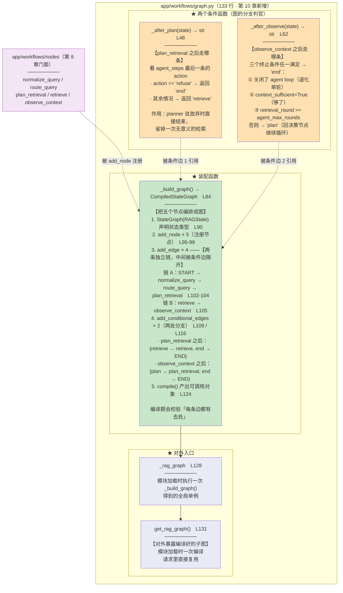
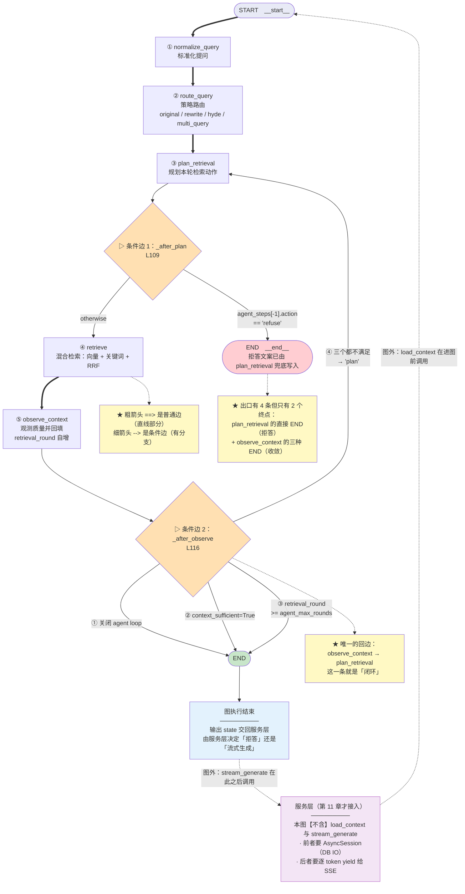

# 04_节点导出与StateGraph编译

> 章节：Day07_Agentic RAG · 第 3 章 后端实现 · **第 9-10 步**
> 覆盖：
> - 第 9 章 把节点暴露给图（`backend/app/workflows/nodes/__init__.py`，**改动**）
> - 第 10 章 用 `StateGraph` 编译检索子图（`backend/app/workflows/graph.py`，**新建**）
> 记录日期：2026.09.21

---

## 一、本批次定位

前一批写完两个新节点后，它们是**孤立的函数**。本批把 5 个节点**注册进图、连好边、编译成可调用对象** —— 到这一步，**Agentic 循环终于成为一张真正能跑的图**。

| 章 | 文件 | 改动 | 行数 |
| --- | --- | --- | --- |
| **9** | `app/workflows/nodes/__init__.py` | +2 导入 +2 `__all__` 条目（并重排注释） | 26 → **30** |
| **10** | `app/workflows/graph.py` | **新建** | **133** |

---

## 二、第 9 章：把节点暴露给图

```python
from app.workflows.nodes.generate import stream_generate
from app.workflows.nodes.load_context import load_context
from app.workflows.nodes.normalize_query import normalize_query
from app.workflows.nodes.observe_context import observe_context       # L16 新增
from app.workflows.nodes.plan_retrieval import plan_retrieval        # L17 新增
from app.workflows.nodes.retrieve import retrieve
from app.workflows.nodes.route_query import route_query

__all__ = [
    "load_context",     # 1. 历史消息加载节点
    "normalize_query",  # 2. Query 标准化与意图透传节点
    "route_query",      # 3. 查询优化策略路由节点（判定并按策略产出最终检索词）
    "plan_retrieval",   # 4. Agentic 循环决策节点（决定本轮用什么 query / route）   ← L26
    "retrieve",         # 5. 混合检索与拒答熔断节点
    "observe_context",  # 6. Agentic 循环观察节点（判定是否足够、回填观察字段）      ← L28
    "stream_generate",  # 7. 大模型流式输出生成节点
]                                                                     # L30
```

### 2.1 为什么必须走门面导出，而不是让 `graph.py` 直接引用深层模块

| 做法 | 问题 |
| --- | --- |
| `from app.workflows.nodes.plan_retrieval import plan_retrieval` | 外部对**深层子模块**形成碎片化引用；文件改名/拆分会波及所有引用点 |
| **走门面 `from app.workflows.nodes import ...`** ✅ | 由 `__init__.py` 收敛路径；`__all__` 显式约定公开符号 |

**⚠️ 这里有一个真实存在的坑（本系列已踩过两次）**：

```
`app/workflows/nodes/__init__.py` 导出的【函数名】与【子模块名】同名
    → `import app.workflows.nodes.plan_retrieval as PR` 拿到的是【函数】而非模块
    → 想给节点打桩时 `PR.get_agent_planner = Stub` 实际是在给函数挂属性，静默无效
    → 正确姿势：importlib.import_module("app.workflows.nodes.plan_retrieval")
           或 sys.modules["app.workflows.nodes.plan_retrieval"]
```

**本批写验证脚本时又踩了一次**（`AttributeError: 'function' object has no attribute 'get_agent_planner'`），改用 `importlib` 后正常。

### 2.2 `__all__` 的顺序被重排了

教程是按**字母序**插入两个新名字的：

```
原顺序：load_context, normalize_query, route_query, retrieve, stream_generate
新顺序：load_context, normalize_query, route_query, plan_retrieval, retrieve, observe_context, stream_generate
```

**实现时改成按「执行顺序」排**（load → normalize → route → plan → retrieve → observe → generate），并给每条注释加上**序号**（1~7）。

**理由**：`__all__` 的用途不只是"声明公开符号"，它也是**读者理解流程顺序的第一入口**。按执行顺序排 + 编号，比字母序更有信息量。

---

## 三、第 10 章：用 `StateGraph` 编译检索子图

文件：`app/workflows/graph.py`（**133 行**）

### 3.1 两个条件函数（图的分支判官）

**注意：它们不是节点，而是"条件边的判官"** —— LangGraph 在节点执行完、准备跳转时调用它们。

```python
def _after_plan(state: RAGState) -> str:                              # L48
    """planner 决策为 refuse 时直接结束，避免再做无意义的检索。"""
    if state.get("agent_steps"):                                      # L53
        last_action = state["agent_steps"][-1].get("action")           # L54
        if last_action == "refuse":                                   # L56
            return "end"
    return "retrieve"                                                 # L59
```

| 设计点 | 说明 |
| --- | --- |
| **判空**（L53） | 理论上进入本分支时一定有记录，但**条件函数必须容错**：若为空就当作"没有拒答意图"，继续走检索 |
| **`.get("action")`**（L54） | 记录是 dict，字段可能缺失；直接下标会 `KeyError` |
| **只读最后一条** | 它就是本轮 `plan_retrieval` 刚追加的决策记录 |

```python
def _after_observe(state: RAGState) -> str:                           # L62
    """observe 后决定继续循环还是结束。

    结束条件（任一即停）：
    - 关闭了 agent loop（退化为单轮）
    - 本轮已足够（context_sufficient=True）
    - 达到 agent_max_rounds 上限
    """
    if not settings.agent_loop_enabled:                               # L71  ①
        return "end"
    if state.get("context_sufficient"):                               # L74  ②
        return "end"
    if state.get("retrieval_round", 0) >= settings.agent_max_rounds:  # L78  ③
        return "end"
    return "plan"                                                     # L81
```

**三个出口的顺序有讲究**：

```
① 总开关关闭  → 整个图退化成单轮，跑一轮就出图（最高优先级）
② 本轮已足够  → 收敛出图
③ 轮次用尽    → 必须收敛（否则会无限循环）
```

**依次短路**（`if` 顺序即优先级），任一命中即 `end`；三个都不满足才回 `plan_retrieval` 继续循环。

**⚠️ L77 那句注释点出一个易错点**：

```python
    #    用 .get(..., 0) 兜底：首轮进入本函数时该字段可能还没被写入
    if state.get("retrieval_round", 0) >= settings.agent_max_rounds:
```

**若写成 `state["retrieval_round"]`**，首轮会 `KeyError` —— 因为 `retrieval_round` 是 `observe_context` 才写的，而本函数正是在 `observe_context` **之后**被调用，**首轮时它刚被写入**（所以其实有值）。但用 `.get(..., 0)` 是**防御性写法**：万一将来 `observe_context` 改了、或这个函数被别处复用，都不会崩。

### 3.2 装配函数 `_build_graph`（L84-124）

```python
def _build_graph():
    builder = StateGraph(RAGState)                                    # L90

    builder.add_node("normalize_query", normalize_query)              # L95
    builder.add_node("route_query", route_query)                      # L96
    builder.add_node("plan_retrieval", plan_retrieval)                 # L97
    builder.add_node("retrieve", retrieve)                            # L98
    builder.add_node("observe_context", observe_context)               # L99

    builder.add_edge(START, "normalize_query")                        # L102
    builder.add_edge("normalize_query", "route_query")                 # L103
    builder.add_edge("route_query", "plan_retrieval")                  # L104
    builder.add_edge("retrieve", "observe_context")                   # L105

    builder.add_conditional_edges(                                    # L109
        "plan_retrieval",
        _after_plan,
        {"retrieve": "retrieve", "end": END},
    )
    builder.add_conditional_edges(                                    # L116
        "observe_context",
        _after_observe,
        {"plan": "plan_retrieval", "end": END},
    )

    return builder.compile()                                          # L124
```

#### ⚠️ 关键：4 条普通边**不是一条直线**，而是**两条独立链**

```
链 A（普通边 3 条，L102-104）：START → normalize_query → route_query → plan_retrieval
                                【这里被条件边 1 隔开】
链 B（普通边 1 条，L105）  ：retrieve → observe_context
                                【这里被条件边 2 隔开】
```

**如果 5 个节点真能串成一条直线，本期就不需要 LangGraph 了** —— "被条件边隔开"正是"有分支"的体现。

#### `add_node` 的两个细节

| # | 细节 |
| --- | --- |
| ① | **节点名是字符串**，与条件函数返回的键、`path_map` 的值三者必须一致。写错**不会报错**（LangGraph 编译期只校验"边有去处"），只会在运行时 `KeyError` |
| ② | **节点是"拿 state 返回 partial state"的函数**，LangGraph 会把返回值**增量合并**进状态 —— 因此各节点只需返回自己产出的那几个字段（这正是前几期"节点只写自己字段"约定的兑现） |

#### `add_conditional_edges` 的三个参数

```python
    builder.add_conditional_edges(
        "plan_retrieval",                      # ① 从哪个节点出发
        _after_plan,                           # ② 用哪个条件函数判定
        {"retrieve": "retrieve", "end": END},  # ③ path_map：把返回值映射到真实节点名 / END
    )
```

**实测发现的一个内部表示差异**（纯细节，不影响行为）：

```
get_graph() 读出的条件边 data：
    observe_context -> __end__          data=end
    observe_context -> plan_retrieval   data=plan      ← 键(plan) 与 值(plan_retrieval) 不同名
    plan_retrieval  -> __end__          data=end
    plan_retrieval  -> retrieve         data=None      ← 键(retrieve) 与 值(retrieve) 同名 → 被归一为 None
```

**原因**：`path_map` 里键与目标同名时，LangGraph 内部把 `data` 归一成了 `None`。**图本身完全正确**（8 条边实测全对），只是可视化里的标签不如图自解释。

#### `compile()` 的一个隐性好处

```python
    # 6. 编译：产出可调用对象。
    #    编译期会校验"每条边都有去处"，因此拓扑写错会在这里直接暴露。
    return builder.compile()
```

**编译期校验**是 LangGraph 相对手搓 `while/if` 的一个实质优势：**有向图的悬挂节点/不可达节点会在编译时报错**，而不是等到线上某个请求走进死路。

### 3.3 对外入口（L128-133）

```python
# 模块加载时编译一次；编译产物无状态，请求里直接复用，无额外构造成本。
_rag_graph = _build_graph()                                           # L128


def get_rag_graph():                                                  # L131
    """对外暴露已编译好的子图：模块加载时一次编译，请求里直接复用。"""
    return _rag_graph                                                 # L133
```

**为什么在模块加载时编译**：编译产物**无状态**（状态由每次 `ainvoke` 的入参携带），因此**只需编译一次**，请求里直接复用 —— 这是第 1 章列出的第三个 LangGraph 特点（"编译产物可复用，无状态请求里直接 `ainvoke`，没有额外构造成本"）的兑现。

---

## 四、两张图

### 4.1 图 1：`graph.py` 函数作用图



**读图要点**：两个橙框是**条件函数**（不是节点）；`_build_graph` 里那条"**两条独立链**"是修正过的说法（详见 §3.2）。

### 4.2 图 2：图编排执行流程图



**读图要点（四条）**：

| # | 要点 |
| --- | --- |
| ① | **粗箭头 `==>` 是普通边，细箭头 `-->` 是条件边** |
| ② | **唯一的回边 `observe_context → plan_retrieval` 就是"闭环"** —— 本期所有工作的目的 |
| ③ | **出口有 4 条，但终点只有 2 个**（`plan_retrieval` 的直接 END + `observe_context` 的三种 END） |
| ④ | **图不含 `load_context` 与 `stream_generate`** —— 前者要 DB IO、后者要流式，都留在服务层 |

---

## 五、验证结果

### 5.1 第 9 章：门面导出

```
__all__ = ['load_context','normalize_query','route_query','plan_retrieval',
           'retrieve','observe_context','stream_generate']
7 个名字全部可从门面访问 ✓
app.main 导入成功 ✓
```

### 5.2 第 10 章：编译产物与拓扑

**从编译产物里读出的真实拓扑**（不是照抄代码，是 `get_graph()` 的输出）：

```
节点: ['normalize_query', 'observe_context', 'plan_retrieval', 'retrieve', 'route_query']
含 START/END: True / True

__start__         -> normalize_query      （普通边）
normalize_query   -> route_query          （普通边）
route_query       -> plan_retrieval       （普通边）
plan_retrieval    -> __end__              （条件边）
plan_retrieval    -> retrieve             （条件边）
retrieve          -> observe_context      （普通边）
observe_context   -> __end__              （条件边）
observe_context   -> plan_retrieval       （条件边）  ← 闭环
```

**8 条边，与设计完全一致。**

### 5.3 条件函数逐分支实测

**`_after_plan`**：

| 输入 | 期望 | 实测 |
| --- | --- | --- |
| `refuse` 记录 | `end` | ✓ |
| `rewrite_query` 记录 | `retrieve` | ✓ |
| `initial` 记录 | `retrieve` | ✓ |
| 空 `agent_steps` | `retrieve` | ✓ |
| 记录缺 `action` | `retrieve` | ✓ |

**`_after_observe`**：

| 输入 | 期望 | 实测 |
| --- | --- | --- |
| `context_sufficient=True` | `end` | ✓ |
| `retrieval_round=3 >= 3` | `end` | ✓ |
| `retrieval_round=2 < 3` | `plan` | ✓ |
| 首轮无 `retrieval_round` 字段 | `plan` | ✓ |
| 空状态 | `plan` | ✓ |
| **关闭 `agent_loop_enabled`（无论 round 多少）** | **`end`** | ✓ |

### 5.4 ⭐ 真跑图：闭环确实转起来了

| 问题 | 轮次 | 过程 | 耗时 |
| --- | --- | --- | --- |
| `接口怎么认证` | **1** | `route=hyde` → `top=0.7419` 达标 | 4.75s |
| **`学分是多少`** | **2** | round1 `route=rewrite` `top=0.5244` **不够** → planner `rewrite_query` → round2 `route=original` `top=0.6056` **达标** | 3.19s |
| `B200 的散热设计` | **1** | `route=original` → `top=0.6362` 达标 | 0.66s |

**第二个问题是本期的核心价值演示**：

```
第 1 轮 0.5244 不达标
    → observe_context 判 sufficient=False
    → _after_observe 返回 "plan"（因为 round=1 < 3）
    → 回到 plan_retrieval
    → planner 决定 rewrite_query
    → 第 2 轮改写后 0.6056 达标
    → 收敛出图
```

**前六期做不到这件事** —— 那时首轮不达标就只有"硬答"或"拒答"两种结局。

**`agent_steps` 的完整留痕**：

```
round=1 action=initial        route=rewrite     query='学分是多少'                     检了=5 top=0.5244 够=False
round=2 action=rewrite_query  route=original    query='本科计算机科学与技术专业毕业所需总学分'  检了=5 top=0.6056 够=True
```

**每一轮的决策与观察都在同一条记录里**（第 3 章"每轮只留一条"的设计落地）。

---

## 六、⚠️ 本批发现的两个问题

### 6.1 发现一个真 bug：`state["answer"]` 会跨轮残留

**实测现象**：

```
query='学分是多少'  最终: refused=False  但  state["answer"] = "抱歉，知识库中没有找到与该问题相关的可靠依据。"
```

**干净的复现**：

```
第1轮（不达标）: refused=True   足够=False  answer=有（拒答文案）
第2轮（达标）  : refused=False  足够=True   answer=有（拒答文案！）   ← 残留
★ 最终: refused=False 但 answer = '抱歉，知识库中没有找到与该问题相关的可靠依据。'
```

**根因**：`retrieve.py` L79-81

```python
    # 6. 若触发熔断，直接置入标准拒答文案，下游无需再调用大模型推理
    if refused:
        update["answer"] = REFUSAL_ANSWER
```

**`retrieve` 只在 `refused=True` 时写 `answer`，从不写空值**；而 LangGraph 的状态**跨轮累积**：

```
第 1 轮  retrieve → refused=True  → 写 answer = 拒答文案
第 2 轮  retrieve → refused=False → 只写 refused=False，【不动 answer】
                                    → 第 1 轮的拒答文案留在 state 里
```

**这是"状态残留"的第三次出现**（第 7 章是 `multi_queries` 残留，这里是 `answer` 残留）。

**影响**：

```
第 2 轮没有触发 refuse 分支 → plan_retrieval 不写 answer → retrieve 也不写
    → 最终 refused=False，却带着第 1 轮的拒答文案

服务层若按 refused 判断并走 stream_generate
    → 会把这个【残留的拒答文案】当成"模型答案"用
```

**⚠️ 目前尚未暴露到用户侧** —— 因为第 11 章（`ChatService` 接入图）还没写。**第 11 章一接上就会踩到。**

**候选修法**（未实施，等第 11 章确定接线方式后再定）：

| 方案 | 做法 | 评价 |
| --- | --- | --- |
| **A** ✅ 倾向 | `retrieve` 里显式清空：`update["answer"] = REFUSAL_ANSWER if refused else ""` | 与第 7 章 `rewrite_query` 分支"显式写 None 清残留"**完全同一手法**（谁写的谁清） |
| B | `plan_retrieval` 进入新一轮时清 `answer` / `refused` | 也行，但职责不如 A 贴切 |
| C | `observe_context` 在 `sufficient=True` 时清 | 语义最贴（"够了"就不该保留拒答），但跨了节点职责 |

**方案 A 的一个待定细节**：写 `""` 还是 `None`？`RAGState.answer: str` 声明为 `str`，所以 `""` 更合类型；**但 `stream_generate` 是否会把空串当"没有答案"**，要看第 11 章怎么接入。

### 6.2 `graph.py` 的一堆 IDE 类型警告：**运行时无害，建议不管**

**现象**（PyCharm）：

```
graph.py:90  应为类型 'StateT = TypedDictLikeV1 | TypedDictLikeV2 | DataclassLike | ...'，但实际为 'type[RAGState]'
graph.py:95-99 （5 条）应为类型 'NodeInputT = ...'，但实际为 'Callable[...]'
graph.py:15  拼写错误：在单词 'ainvoke' 中
```

**根因：两个 `TypedDict` 的元类不同**

```
typing.TypedDict              建的类 → 元类 typing._TypedDictMeta               ← 本项目 RAGState 用的
typing_extensions.TypedDict   建的类 → 元类 typing_extensions._TypedDictMeta    ← langgraph 的类型标注用的
```

**langgraph 的类型标注按 `typing_extensions.TypedDict` 写**，而 `RAGState` 用标准库 `typing.TypedDict` → 静态检查器认为不满足约束。那 6 条 `NodeInputT` 警告是**同一根因的连带**（`add_node` 的节点参数类型依赖状态类型）。

**最后一条完全无关**：`ainvoke` 不是英文单词，属 PyCharm 拼写检查噪音。

**运行时实测全部通过**：

| 检查 | 结果 |
| --- | --- |
| `StateGraph(RAGState)` 构造 | ✓ |
| `.compile()` | ✓ |
| `.ainvoke()` 真跑（3 个问题） | ✓ 闭环正常转 |
| `get_graph()` 读出拓扑 | ✓ 8 条边全对 |

**结论**：

```
这些警告表达的是「langgraph 的类型标注与标准库 TypedDict 不匹配」
而不是「我们的代码用错了」

我们的用法是 langgraph 官方文档的标准用法（StateGraph(TypedDict)）
→ 是 langgraph 自己的类型声明偏窄，不该我们改
```

**且项目 `pyproject.toml` 里没有配置 mypy / pyright** → 这些警告**只存在于 IDE**，不影响 CI、不影响构建。

**建议**：不管。若将来有多人协作且有人按严格 mypy 跑，再考虑给 6 处加 `# type: ignore`（与项目已有 4 处先例一致）。

---

## 七、⭐ 顺带挖出的两个运行时约束（值得记住）

验证类型警告时，做了两个实验，挖出 **langgraph 的两条真实行为**：

### 约束 1：langgraph **会静默丢弃不在 schema 里的键**

```
实验：schema 只声明 {question, n}
      节点返回 {"extra_obj": object(), "n": 42}
结果：输出 keys = ['n', 'question']      ← extra_obj 被【静默丢弃】，不报错
```

**含义**：**任何节点写到 state 的字段，必须先在 `RAGState` 里声明。**

```
写了一个没声明的字段 → 不报错，只是【静默丢掉】
                     → 下游读不到 → 又是我们熟悉的"静默读不到值"
```

**这解释了为什么第 3 章要先扩展 `RAGState` 再加节点** —— **顺序不能反**。

### 约束 2：schema 里**可以**声明非 Pydantic 类型

```
实验：schema 声明 {chat_history: list[Message], retrieved_chunks: list[RetrievedChunk]}
      传入真实 Message / RetrievedChunk 实例
结果：✓ 运行成功，两个字段都完整保留（类型都是 list）
```

**⚠️ 这里有个反直觉的对比**：

```
TypeAdapter(RAGState) → 失败：Unable to generate pydantic-core schema for <class 'Message'>
但实际跑图             → 完全成功，字段完好
```

**结论**：**`TypeAdapter(RAGState)` 失败 ≠ 图跑不起来**。langgraph 对 `total=False` 的 TypedDict **不做严格的 Pydantic 校验**。

**所以"RAGState 不能一键转 Pydantic 模型"其实是我们的隐藏优势** —— 状态里能**直接放 ORM 实例与领域对象**（`Message` / `RetrievedChunk`），不必为它们写 Pydantic 适配层。

---

## 八、当前状态与待办

```
✅ 第 1 章 装 LangGraph
✅ 第 2 章 配置项
✅ 第 3 章 扩展 RAGState
✅ 第 4 章 Planner Prompt
✅ 第 5 章 AgentPlanner 封装
✅ 第 6 章 复用 QueryRewriter.apply_route
✅ 第 7 章 plan_retrieval 节点
✅ 第 8 章 observe_context 节点
✅ 第 9 章 把节点暴露给图（本批）
✅ 第 10 章 用 StateGraph 编译检索子图（本批）
────────────────────────────────────────────────────────────
⬜ 第 11 章 ChatService 接入图
⬜ 第 12 章 Schema: AgentStep + Message…
```

| # | 待办 | 优先级 | 何时 |
| --- | --- | --- | --- |
| ① | ⚠️ **`state["answer"]` 跨轮残留 bug**（`refused=False` 却带拒答文案） | **高** | 第 11 章接入时必修 |
| ② | `graph.py` 的 6 处 IDE 类型警告 | 低（不管） | 若将来配 mypy 再说 |
| ③ | `apply_route` docstring 里写的 "`optimize`（本类 L238）" 行号已过期（实际 L241） | 低 | 随手可补 |
| ④ | `plan_retrieval.py` 两处类型警告（L43 / L83） | 低 | 待定 |
| ⑤ | `new_query` 无法消解指代（prompt 入参无对话历史） | 中 | 与第 8 期 rewrite 修复一起 |

---

## 九、一句话总结

> 本批把 5 个孤立节点变成了**一张能跑的图**：第 9 章走**门面导出**（`nodes/__init__.py` 加两个导入 + 两个 `__all__` 条目，
> 并按**执行顺序**重排 `__all__` 使它能当"流程目录"用；顺带再次踩到"函数名遮蔽同名子模块"那个坑）；
> 第 10 章新建 `graph.py`，用 `StateGraph` 注册 5 个节点、连 **4 条普通边（两条独立链，中间被条件边隔开）**
> + **2 处条件边**，其中 `observe_context → plan_retrieval` 那条回边就是**整个 Agentic 循环的闭环**；
> **`compile()` 会在编译期校验"每条边都有去处"**，这是相对手搓 `while/if` 的实质优势；
> 编译产物在模块加载时构建一次、请求里复用（兑现第 1 章"编译产物可复用"的特点）；
> **实测拓扑 8 条边全对**，两个条件函数的**全部分支逐条验证通过**（含关闭总开关时恒为 `end`），
> 并**真跑图验证闭环确实转动**：`学分是多少` 第 1 轮 0.5244 不达标 → planner 决定改写 → 第 2 轮 0.6056 达标收敛，
> **这正是前六期做不到的事**（那时首轮不达标只有"硬答"或"拒答"两种结局）；
> **本批还发现一个真 bug**：`state["answer"]` 会**跨轮残留** —— `retrieve` 只在 `refused=True` 时写 `answer`、
> 从不写空值，于是第 1 轮的拒答文案进入第 2 轮，最终出现 **`refused=False` 却带着拒答文案**的矛盾状态；
> 这是"状态残留"的第三次出现（第 7 章是 `multi_queries`），**第 11 章接入服务层时会踩到，必须修**；
> 最后固化两条 langgraph 的运行时约束：**① 不在 schema 里声明的键会被静默丢弃**（所以第 3 章必须先扩展 `RAGState` 再加节点）；
> **② schema 里可以声明非 Pydantic 类型**（`Message` / `RetrievedChunk` 都能直接放，`TypeAdapter` 失败不代表图跑不起来）。

---

## 十、关联文件索引

| 文件 | 关键位置 | 说明 |
| --- | --- | --- |
| `app/workflows/nodes/__init__.py` | L13-19 | 7 个节点的门面导入（L16 `observe_context` / L17 `plan_retrieval` 为本批新增） |
| `app/workflows/nodes/__init__.py` | L22-30 | `__all__`（按执行顺序排 + 编号；L26 `plan_retrieval` / L28 `observe_context`） |
| **`app/workflows/graph.py`** | L1-26 | 模块 docstring（**图边界**：为什么不放 `load_context` / `stream_generate`） |
| `app/workflows/graph.py` | L28 / L35 | 导入 LangGraph 三件套 / 节点门面 |
| **`app/workflows/graph.py`** | **L48-59** | **`_after_plan`（L53 判空 / L54 取 action / L56 refuse→end / L59 默认 retrieve）** |
| **`app/workflows/graph.py`** | **L62-81** | **`_after_observe`（L71 关开关 / L74 sufficient / L78 轮次上限 / L81 默认 plan）** |
| **`app/workflows/graph.py`** | **L84-124** | **`_build_graph`（L90 StateGraph / L95-99 add_node × 5 / L102-105 add_edge × 4 / L109+L116 条件边 × 2 / L124 compile）** |
| `app/workflows/graph.py` | L102-104 | **普通边链 A**：START → normalize_query → route_query → plan_retrieval |
| `app/workflows/graph.py` | L105 | **普通边链 B**：retrieve → observe_context |
| `app/workflows/graph.py` | L112 | 条件边 1 的 path_map：`{"retrieve": "retrieve", "end": END}` |
| `app/workflows/graph.py` | L119 | 条件边 2 的 path_map：`{"plan": "plan_retrieval", "end": END}` ← **闭环回边** |
| `app/workflows/graph.py` | L128 / L131-133 | `_rag_graph` 单例 / `get_rag_graph()` |
| `app/workflows/nodes/plan_retrieval.py` | L128-131 | `refuse` 兜底写 `answer`（与 `retrieve` 的兜底**形成残留冲突**，见 §6.1） |
| `app/workflows/nodes/retrieve.py` | L79-81 | **`if refused: update["answer"] = REFUSAL_ANSWER`** ← **残留 bug 的根因** |
| `app/workflows/nodes/observe_context.py` | L65-66 | 写 `retrieval_round`（自增）/ `context_sufficient` ← `_after_observe` 读的正是这两个 |
| `app/workflows/rag_state.py` | L32-73 | `RAGState` 字段全集（**未声明的键会被 langgraph 静默丢弃**） |
| `app/core/config.py` | L173 / L179 | `agent_loop_enabled` / `agent_max_rounds` ← `_after_observe` 读的两个配置 |
| `app/services/chat_service.py` | — | 第 11 章要接入的调用方 |
