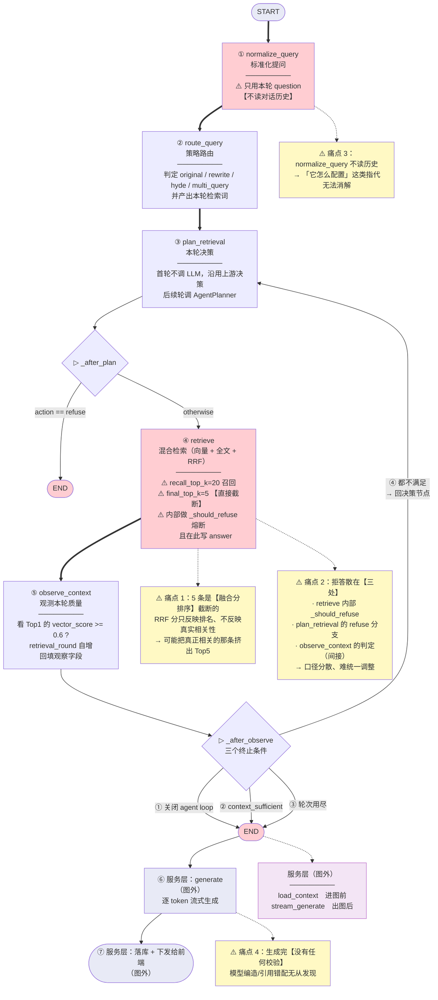
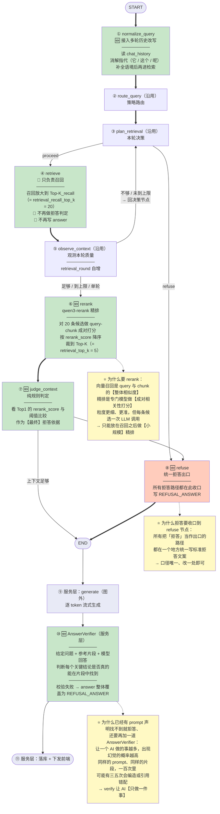

# 01_需求分析与方案设计

> 期：**Day08 · 检索链路优化与答案可信度**
> 章：第 1 章 需求分析与方案设计
> 记录日期：2026.09.21

---

## 一、本期定位

> 上一期引入了 Agentic RAG，让系统在召回不足时能**自主获取额外信息**。
> 这一期的目标是让最终送给 LLM 的上下文**更准**、生成出来的答案**更可信**，
> 同时把**会话列表 / 删除 API** 和左侧会话栏也补齐，前端从**单会话**变成**真正的多会话产品形态**。

**一句话**：第 7 期让系统**能自己多找几轮**，第 8 期让**每一轮找得更准**、**答得更可信**。

---

## 二、需求分析（本期做四件事）

| # | 做什么 | 解决链路中的哪一环 |
| --- | --- | --- |
| 1 | 接入 DashScope **`qwen3-rerank`** 模型做**精排**，把召回 Top 20 重排后裁到 Top 5 | **召回质量** |
| 2 | 新增 **`judge_context`** 拒答判定节点 + 统一 **`refuse`** 节点，把多处分**散**的拒答收到一处 | **上下文判定** |
| 3 | 在 **`normalize_query`** 里接入**多轮历史改写**，让指代和省略在**进入路由之前**就被消解 | **query 质量** |
| 4 | 在 **`generate` 之后**执行 **`AnswerVerifier`**，让 AI 自己核对答案是否被引用片段支撑 | **答案可信度** |

**教程原话**：

> 四件事看起来不少，但它们解决的其实是**同一条链路上不同环节**的问题：
> 召回质量、上下文判定、query 质量、答案可信度。

---

## 三、方案设计

### 3.1 整体链路升级

**优化前**（5 节点，详见 §4 图 1）：

```
START → normalize_query → route_query → plan_retrieval → retrieve → observe_context → END
                                          ↑                    │            │
                                          └──── 不够/未到上限 ──┘            │
                                          ←──────── refuse ────────────────┘
```

**优化后**（7 节点 + 1 统一出口，详见 §4 图 2）：

```
START → normalize_query → route_query → plan_retrieval → retrieve → observe_context
                                                          ↑              │
                                                          └─ 不够/未到上限 ┘
                                                                         │ 足够/到上限/单轮
                                                                         ↓
                                                    rerank → judge_context
                                                                 │    │
                                                      上下文足够  │    │ 上下文不足
                                                                 ↓    ↓
                                                                END  refuse ←─ plan_retrieval 的 refuse
                                                                      │
                                                                      ↓
                                                                     END
        （图外）服务层：generate → AnswerVerifier → 落库/下发
```

**教程列出的主要变动**：

| 变动 | 说明 |
| --- | --- |
| `normalize_query` | 接入多轮历史改写 |
| `retrieve` | **不再做拒答判定**；召回数量从 `retrieval_top_k` **放大到** `retrieval_recall_top_k`，把全部候选交给 rerank |
| **新增** `rerank` | 节点调 DashScope `qwen3-rerank`，对候选做 **query-chunk 成对打分**，按 `rerank_score` **降序**裁到 `retrieval_top_k` |
| **新增** `judge_context` | **纯规则**节点，拿 **Top1 的 `rerank_score` 与阈值比较**，作为**最终拒答条件** |
| **新增** `refuse` | 节点，把**所有触发拒答的边**都收到一个地方 |
| `generate` **之后** | 在 **service 层**执行 `AnswerVerifier`，校验失败就把 `answer` 覆盖成拒答文案 |

### 3.2 Reranker 选型

> 向量召回靠的是**预先算好的 embedding**，是问题 embedding 与 chunk embedding 的**整体相似度**。
> 精排（rerank）是**另一类模型**，专门做 query 和单个 chunk 的**成对相关性打分**，
> 输入是 `query + 候选文本` 对，输出是 **0-1 的相关度分数**。
> **粒度更细**，但**要为每条候选发一次 LLM 调用**，所以**只能放在召回之后做小规模精排**。
> 这里选择**阿里云百炼的 `qwen3-rerank`**。

**⚠️ 接口协议不同（实现时的第一个坑）**：

```
qwen3-rerank 【不】走 OpenAI 兼容协议
    → 不能复用现有的 get_chat_model / get_embedding_model
    → 教程的选择：单独用 httpx 做客户端
    → 教程也提到官方提供了 SDK（langchain-community 的 DashScopeRerank）
```

**官方 SDK 用法**（教程给出，供参考）：

```python
from langchain_community.document_compressors.dashscope_rerank import DashScopeRerank

sequence = ["text1", "text2", "text3"]
reranker = DashScopeRerank(model="gte-rerank-v2")
print(reranker.rerank(documents=sequence, query="文本3", top_n=2))
```

**说明**：SDK 示例用的是 `gte-rerank-v2`，而本项目选的是 `qwen3-rerank`；教程明确说"**为了简单考虑，后续实现的时候会单独用 httpx 做客户端**"。

### 3.3 Answer Verify 兜底

> 精排解决了召回的 chunk **排序不够准**的问题。**但即便送进去的上下文是对的，LLM 生成时也可能编造**，这就需要生成之后再**加一道校验**。

**教程自问自答**（这段是关键）：

> **问**：prompt 已经声明了"找不到就拒答"，**为什么还要再来一道校验呢**？
>
> **答**：原因比较简单，因为**让一个 AI 做的事情越多，出现幻觉的概率就会越高**。
> 同样的 prompt、同样的片段，**一百次里可能有三五次会编造或者引用错配**。
> **verify 是让 AI 专门做一件事**：给定问题、参考片段、模型回答，**判断每个关键结论是不是真的能在片段里直接找到**。

**失败处理**：

```
校验失败 → 把答案【整段】替换成 REFUSAL_ANSWER
```

**教程原话**：

> 到这里，后端链路从**召回到生成到校验**的方案就齐了。

### 3.4 会话侧栏与多会话产品形态

> 除了链路优化，这一期还要补齐一个**产品层面**的缺口，也就是**目前前端只有单会话**，
> 用户想**回看之前的对话都找不到入口**。

**改造项**：

| # | 事项 |
| --- | --- |
| 1 | 新增 `GET /api/conversations`（分页）与 `DELETE /api/conversations/{id}` 两个接口 |
| 2 | 新建 `ConversationSidebar` 组件，TanStack Query 拉列表 + `Popconfirm` 删除 |
| 3 | `ChatPage` 改成 `Layout.Sider + Layout.Content` 的**左右两栏** |
| 4 | **切会话 / 删会话时取消正在进行的 SSE 流**，避免数据回填错位 |
| 5 | **首次提问后把会话标题自动改成问题前 30 字** |

### 3.5 实现顺序（教程给定）

```
配置 → reranker → 新节点 → 旧节点改造 → 多轮改写 → 重连图 → 答案校验 → service 集成 → 会话 CRUD → API
```

| 步 | 内容 | 对应章节 |
| --- | --- | --- |
| 1 | 配置 | 新增 rerank / judge / verify 配置项 |
| 2 | reranker | 新增精排客户端模块 |
| 3 | 新节点 | `rerank` / `judge_context` / `refuse` |
| 4 | 旧节点改造 | `retrieve` 只召回、`normalize_query` 读历史 |
| 5 | 多轮改写 | 历史改写 prompt 与实现 |
| 6 | 重连图 | `graph.py` 加节点与边 |
| 7 | 答案校验 | `AnswerVerifier` |
| 8 | service 集成 | `chat_service.py` 接校验 |
| 9 | 会话 CRUD | repository + schema |
| 10 | API | 路由 |

---

## 四、两张图

### 4.1 图 1：当前检索链路（优化前）

> 对应 `01_当前检索链路-优化前.png`



**四条痛点的代码级依据**：

| 痛点 | 依据 |
| --- | --- |
| 1 · 融合分截断 | `retrieve.py` L40-41：`recall_top_k = settings.retrieval_recall_top_k`（20）/ `final_top_k = settings.retrieval_top_k`（5）；排序依据是 `rrf_score` |
| 2 · 拒答散在三处 | `retrieve.py` L71 `refused = _should_refuse(chunks)` / L87 写 `answer`；`plan_retrieval.py` L128-131 的 `refuse` 分支；`observe_context.py` L95 的阈值判定 |
| 3 · 不读历史 | `normalize_query.py` **L27** 的待办注释："后续可在此处结合 `chat_history` 扩展大模型改写逻辑（如消解代词"它/这个"，补充上下文语境）" |
| 4 · 无校验 | `app/workflows/nodes/generate.py`（68 行）只有 `stream_generate`，无任何校验环节 |

### 4.2 图 2：目标检索链路（优化后）

> 对应 `02_目标检索链路-优化后.png`



---

## 五、两图对照

| 维度 | 优化前 | 优化后 |
| --- | --- | --- |
| 图内节点 | **5** | **7 + 1 统一出口** |
| 裁到 5 的依据 | **RRF 融合分直接截断** | **`qwen3-rerank` 精排分** |
| 拒答依据 | `vector_score` vs `0.6` | `rerank_score` vs **新阈值** |
| 拒答出口 | **散在三处** | **统一到 `refuse` 节点** |
| `normalize_query` | 不读历史 | **读历史改写** |
| 生成后校验 | ❌ 无 | ✅ **`AnswerVerifier`** |
| `observe_context → END` | **有**（三条终止边） | **删除**，改接 `rerank` |
| 产品形态 | 单会话 | **多会话侧栏 + CRUD** |

---

## 六、⭐ 两处实现提示（先记住，写到对应章节时验证）

### 6.1 `_after_observe` 的语义要变

```
优化前：observe_context → END（三条终止边）或 → plan_retrieval（循环）
优化后：observe_context → rerank（继续）或 → plan_retrieval（循环）
        【END 那条边要删掉】
```

**原因**：判定"是否值得回答"的职责从 `observe_context` **移交**给了 `judge_context`（第 8 期之后它是**最终**拒答依据）。`observe_context` 只管"**这一轮要不要再试**"。

**实现时要改的是条件函数的 `path_map`**：从 `{"plan": "plan_retrieval", "end": END}` 变成 `{"plan": "plan_retrieval", "rerank": "rerank"}`。

### 6.2 拒答阈值必须**新增**配置项，不能复用 `retrieval_min_score`

```
retrieval_min_score  = 0.6            ← 比较对象是 vector_score（余弦相似度）
judge_context 的新阈值                 ← 比较对象是 rerank_score（精排模型输出）
```

**两者量纲不同、不可比**（第 6 期归档已强调：只有 `vector_score` 能与 `0.6` 比较；`rrf_score` 上限仅 `2/(k+1)≈0.033`、`ts_rank` 无上界且跨查询不可比）。

**⚠️ 如果误用 `retrieval_min_score` 去比 `rerank_score`**：精排分通常偏高（0-1 分布与余弦不同），会导致**拒答几乎不触发**或**判据完全失真**。

### 6.3 一处设计张力（供思考，实现时核实教程）

```
教程说 judge_context 是【纯规则节点】、看 Top1 的 rerank_score 与阈值比较
同时又新增了 refuse 统一出口 + planner 也能 refuse

→ 于是「是否拒答」的【判定】仍然有两处：
   ① planner 的 refuse      = 「这个问题根本不该检索」（实时天气、闲聊）
   ② judge_context          = 「检索了但证据不够」
   
   只不过「拒答动作」收敛到了一处

⭐ 这是两种【语义不同】的拒答 → 分成两处判定是合理的
```

---

## 七、本期起点状态（优化前的真实基线）

### 7.1 图的拓扑（实测 `get_rag_graph().get_graph()`）

```
节点（5）: normalize_query / route_query / plan_retrieval / retrieve / observe_context

边（8）:
  __start__         → normalize_query    [直线]
  normalize_query   → route_query        [直线]
  route_query       → plan_retrieval     [直线]
  plan_retrieval    → __end__            [条件]  ← refuse
  plan_retrieval    → retrieve           [条件]  ← proceed
  retrieve          → observe_context    [直线]
  observe_context   → __end__            [条件]  ← 三终止条件
  observe_context   → plan_retrieval     [条件]  ← 闭环回边
```

### 7.2 检索相关配置

| 配置项 | 值 | 位置 |
| --- | --- | --- |
| `retrieval_top_k` | `5` | `config.py` L139 |
| `retrieval_min_score` | `0.6` | L143 |
| `retrieval_recall_top_k` | `20` | L163 |
| `rrf_k` | `60` | L166 |
| `agent_loop_enabled` | `True` | L173 |
| `agent_max_rounds` | `3` | L179 |

**第 8 期要新增的配置项（实测均不存在）**：

```
rerank_model              = 【不存在】
rerank_top_k              = 【不存在】
rerank_min_score          = 【不存在】
judge_min_rerank_score    = 【不存在】
verify_enabled            = 【不存在】
```

### 7.3 现有检索模块

```
app/retrieval/
    __init__.py                 0 行
    hybrid_retriever.py       343 行
    keyword_retriever.py       77 行
    vector_retriever.py       116 行
```

**`rerank` / `judge` / `refuse` / `verif` 相关文件均不存在**（实测）—— 本期从零开始建。

---

## 八、当前状态

```
✅ 第 1 章 需求分析与方案设计（本章）
────────────────────────────────────────────────────────────
⬜ 配置（rerank / judge / verify 配置项）
⬜ reranker（httpx 客户端）
⬜ 新节点：rerank / judge_context / refuse
⬜ 旧节点改造：retrieve 只召回、normalize_query 读历史
⬜ 多轮改写
⬜ 重连图
⬜ 答案校验（AnswerVerifier）
⬜ service 集成
⬜ 会话 CRUD（repository + schema）
⬜ API（GET/DELETE /api/conversations）
```

---

## 九、一句话总结

> 第 8 期在 Agentic RAG 的基础上做**四个环节**的优化：
> **召回质量**（`retrieve` 只召回 Top-20 不截断 → 新增 `rerank` 节点用 `qwen3-rerank` 做 query-chunk **成对打分**再裁到 Top-5 ——
> 因为第 7 期的"裁到 5"依据是 **RRF 融合分**，它只反映排名、不反映真实相关性）、
> **上下文判定**（新增**纯规则**的 `judge_context` 拿 Top1 的 **`rerank_score`** 与阈值比较作为**最终**拒答依据，
> 并新增 `refuse` 节点把**所有拒答路径收口到一处**，解决第 7 期"拒答散在三处、口径难统一"的问题）、
> **query 质量**（`normalize_query` 接入多轮历史改写，让**指代与省略在进入路由之前**就被消解 ——
> 这正是第 5 期留下的待办："`new_query` 无法消解指代，因为 planner prompt 没有对话历史"）、
> **答案可信度**（在 `generate` **之后**、**图外服务层**执行 `AnswerVerifier`，让 AI **只做一件事**：
> 判断每个关键结论能否在参考片段里**直接找到**；校验失败就把答案**整段**覆盖为拒答文案 ——
> 教程的理由是"**让一个 AI 做的事情越多，出现幻觉的概率就会越高**，一百次里可能有三五次会编造或引用错配"）；
> 并在**产品层**补齐**多会话形态**（会话列表 / 删除 API + 左侧侧栏 + 切删会话时取消 SSE 流 + 首问自动生成标题）；
> 实现顺序由教程给定：**配置 → reranker → 新节点 → 旧节点改造 → 多轮改写 → 重连图 → 答案校验 → service 集成 → 会话 CRUD → API**。

---

## 十、关联文件索引

| 文件 | 关键位置 | 说明 |
| --- | --- | --- |
| `app/workflows/graph.py` | L95-99 / L102-105 / L109-120 | 当前 5 节点 / 4 条直线边 / 2 处条件边（本期要改） |
| `app/workflows/nodes/retrieve.py` | L40-41 | `recall_top_k` / `final_top_k`（本期改为只召回） |
| `app/workflows/nodes/retrieve.py` | L71 / L87 / L92 | `_should_refuse` 调用 / 写 `answer` / `_should_refuse` 定义（**拒答要移出本节点**） |
| `app/workflows/nodes/observe_context.py` | L65 / L95 | `retrieval_round` 自增 / 阈值判定（**判定要移交 judge_context**） |
| `app/workflows/nodes/plan_retrieval.py` | L128-131 | `refuse` 分支写 `answer`（**要改为指向 refuse 节点**） |
| `app/workflows/nodes/normalize_query.py` | **L27** | **待办注释：结合 `chat_history` 消解代词** |
| `app/workflows/nodes/generate.py` | L28 | `stream_generate`（本期在其后加 `AnswerVerifier`） |
| `app/services/chat_service.py` | L288-289 | 图执行 `ainvoke`（校验接在此之后） |
| `app/core/config.py` | L139 / L143 / L163 / L166 / L173 / L179 | 当前检索与循环配置 |
| `app/retrieval/hybrid_retriever.py` | 全文 | 混合检索器（本期 `retrieve` 要调它 + 交给 rerank） |
| `app/retrieval/vector_retriever.py` | — | `RetrievedChunk` 契约（本期要加 `rerank_score` 字段） |
| `app/api/schemas/chat.py` | L68 | `RetrievalMeta`（本期要加 `rerank_score`） |
