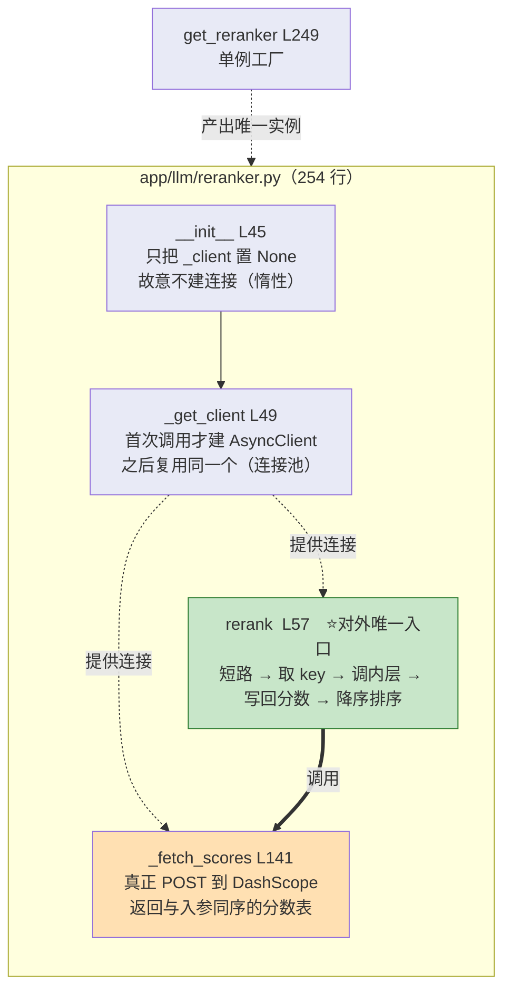
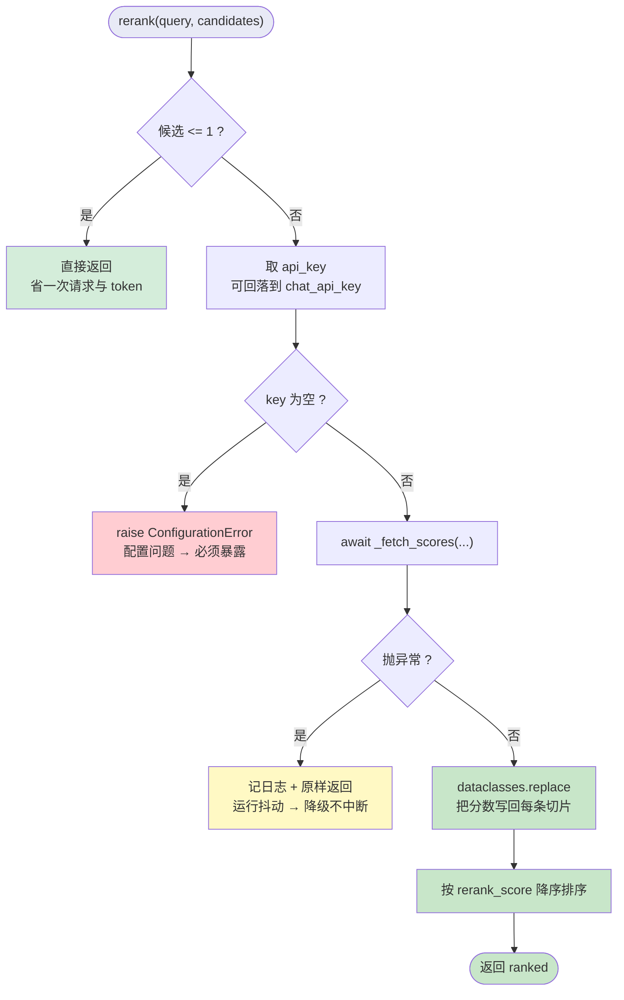
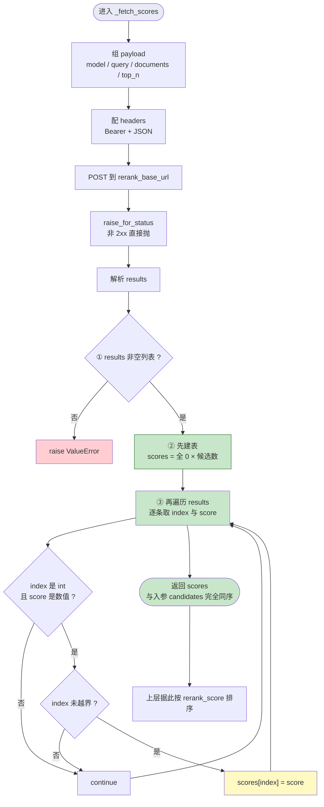
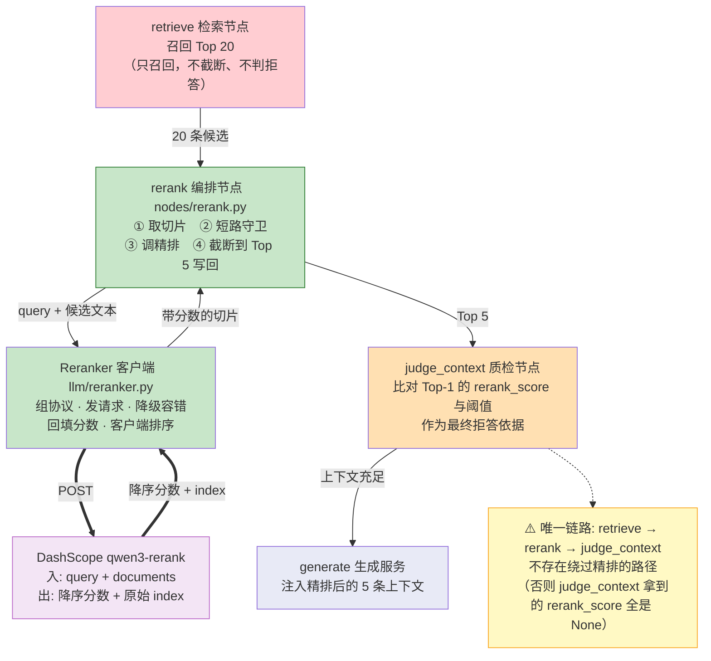

# 02_Reranker客户端与rerank节点

> 期：**Day08 · 检索链路优化与答案可信度**
> 章：第 3 章 Reranker 客户端 + `rerank` 节点
> 覆盖：
> - `backend/app/retrieval/vector_retriever.py`（**改动**：`RetrievedChunk` 加字段）
> - `backend/app/llm/reranker.py`（**新建**）
> - `backend/app/workflows/nodes/rerank.py`（**新建**）
> 记录日期：2026.09.22

---

## 一、本章定位

本期实现顺序：**配置 → reranker → 新节点 → 旧节点改造 → 多轮改写 → 重连图 → 答案校验 → service 集成 → 会话 CRUD → API**。

**本章是第 2 步**，也是**本期的核心** —— 教程原话："reranker 是本期链路改造的核心，它决定了召回候选最终的排序质量"。

**三件事的关系**：

```
① vector_retriever.py  →  契约先行：RetrievedChunk 加 rerank_score 字段
                              ↓ 没有它，精排分数无处安放
② llm/reranker.py      →  能力实现：真正调 DashScope、拿分、把分数写回切片
                              ↓ 没有它，节点无从调用
③ nodes/rerank.py      →  编排接入：把能力接到图状态上（取切片 → 精排 → 截断）
```

| 文件 | 改动 | 行数 |
| --- | --- | --- |
| `app/retrieval/vector_retriever.py` | 新增 1 个字段 | 116 → **124** |
| `app/llm/reranker.py` | **新建** | **254** |
| `app/workflows/nodes/rerank.py` | **新建** | **47** |

> **关于 `uv add httpx`**：教程要求先装 `httpx`。实操时 `httpx 0.28.1` **本来就可 import**（它是其它依赖的**传递依赖**，已躺在虚拟环境里），
> 但**依赖声明必须显式** —— 直接 `import` 一个"碰巧被装上"的包是脆弱做法：一旦上游依赖不再带它，代码立即崩。
> 因此仍执行了 `uv add httpx`，把它写进 `backend/pyproject.toml`（`"httpx>=0.28.1"`）并同步 `uv.lock`，**从传递依赖升级为直接依赖**。

---

## 二、契约先行：`RetrievedChunk` 加 `rerank_score`

### 2.1 新增字段（`vector_retriever.py` L69）

```python
    rerank_score: float | None = None  # qwen3-rerank 输出的 relevance_score ∈ [0, 1]
```

**字段前的注释**：

```python
    # --- 以下 1 个字段为第 8 期新增：承载精排阶段的成对相关性分 ---
    # reranker query-chunk 成对打分的相关度，越大越相关。
    #   【为什么单独一个字段而不是覆盖 score】：
    #   score 是"统一排序键"，其含义随召回路径变化（向量路=余弦、关键词路=ts_rank、混合=RRF）；
    #   而 rerank_score 是【精排模型给出的绝对相关性】，量纲与前几者都不同。
    #   单独存放才能让下游既按 rerank_score 排序，又保留原始向量分 / 召回来源等调试信息。
```

### 2.2 ⭐ 四个"原始分"的量纲对照

| 字段 | 含义 | 值域 | 能否与阈值比 |
| --- | --- | --- | --- |
| `score` | **统一排序键（别名）** | 随路径变 | ✗ 语义不定 |
| `vector_score` | 余弦相似度 | `[0,1]` | ✅ **与 `retrieval_min_score=0.6`** |
| `keyword_score` | `ts_rank` | 无上界 | ✗ 跨查询不可比 |
| `rrf_score` | `Σ 1/(k+rank)` | 上限 **`2/(k+1) ≈ 0.033`** | ✗ |
| **`rerank_score`** | **精排模型成对打分** | **`[0,1]`** | ✅ **与 `rerank_min_score=0.3`** |

**⚠️ 注意后两个都落在 `[0,1]`，但含义完全不同** —— 这正是第 1 章里"拒答阈值必须分成两个配置项"的原因。

### 2.3 ⚠️ `frozen=True`：写分数只能产新对象

```python
@dataclass(frozen=True)          # L30
class RetrievedChunk:
```

**实测**：

```
c.rerank_score = 0.9                    → 抛 FrozenInstanceError
dataclasses.replace(c, rerank_score=..) → 新对象；原对象不变；其它字段保留
```

**⭐ frozen 的设计意图不是"防止手滑"，是"让修改留下痕迹"**：

```
若契约【可变】：
    任何环节都能就地改上下文里的分数
    → "这条为什么排在前面"无从追溯

契约 frozen 之后：
    想改就得显式产新对象 → 所有改动点都可见
```

**这是第 3 期"把契约设计成不可变"的收益兑现。**

---

## 三、`Reranker` 客户端（`app/llm/reranker.py`，254 行）

### 3.1 为什么单独写客户端，不复用 `models.py`

模块 docstring：

> `models.py` 里封装的是 `langchain_openai.ChatOpenAI` 与 Embeddings —— 它们走的是 **OpenAI 兼容协议**（`/chat/completions`、`/embeddings`）。而百炼的 rerank 不在这个协议里，端点是独立的 `{base}/reranks`，请求体与响应体结构也不同。强行用 ChatOpenAI 去调它只会得到 **404 / 400**，因此这里**直接用 `httpx` 发 HTTP 请求**。

**第 1 章的实测依据**：

```
compatible-mode/v1/reranks        → 404
compatible-api/v1/reranks + 嵌套  → 400
compatible-api/v1/reranks + 扁平  → 200 ✅
```

> 另：教程提到官方 SDK（`langchain-community` 的 `DashScopeRerank`），但"为了简单考虑，后续实现时单独用 httpx 做客户端"。

### 3.2 `__init__` + `_get_client`（L45-55）

```python
    def __init__(self) -> None:
        # 延迟创建：不在 __init__ 里建客户端，避免模块导入阶段就建立连接池
        self._client: httpx.AsyncClient | None = None                       # L47

    def _get_client(self) -> httpx.AsyncClient:
        """获取（或惰性创建）共享的异步 HTTP 客户端。"""
        if self._client is None:                                            # L51
            # 【为什么在这里传 timeout 而不是每次 post 时传】：
            # 一个 AsyncClient 的超时设置对它的所有请求生效，集中一处更不容易漏改。
            self._client = httpx.AsyncClient(timeout=settings.rerank_timeout)  # L54
        return self._client
```

| # | 设计 | 为什么 |
| --- | --- | --- |
| ① | `__init__` **不建客户端** | 避免**模块导入阶段**就建连接池（那时可能还没有事件循环） |
| ② | `timeout` 在**建客户端时**传 | 对**它所有请求**生效，集中一处不易漏改 |
| ③ | **复用同一个客户端** | 复用连接池；精排是主链路同步调用，延迟敏感 |

### 3.3 ⭐ `rerank()` 主方法（L57-139）

#### ① 短路（L76）

```python
        # 0 条或 1 条候选没有"排序"可言：调用精排只是白花一次请求与几毛钱 token
        if len(candidates) <= 1:
            return candidates
```

#### ② 取 key（L87）+ 缺 key 抛错（L89）

```python
        api_key = settings.effective_rerank_api_key                          # L87
        # 【为什么这里 raise 而不是降级】：缺少 API Key 是部署配置问题，
        # 静默降级会让"精排从未生效"这件事被掩盖很久；明确抛错才能尽早暴露。
        if not api_key:
            raise ConfigurationError(                                        # L89
                "Rerank API key 未配置，请在 .env 设置 RERANK_API_KEY 或 CHAT_API_KEY"
            )
```

#### ③ ⭐⭐ 两种失败**处理策略不同**（本方法最值得学的设计）

```python
        try:                                                                 # L97
            scores = await self._fetch_scores(query, candidates, api_key)    # L99
        except Exception:                                                    # L100
            # 与其它外部依赖一致：精排失败【降级为不重排】，不影响主链路出结果
            # （对比上面缺 key 的情况：那是配置错误，这是运行时抖动，处理策略不同）
            logger.exception("rerank 调用失败，降级为不重排: query=%r", query)  # L105
            return candidates
```

| 失败类型 | 处理 | 本质 |
| --- | --- | --- |
| **缺 API Key** | **抛 `ConfigurationError`** | **配置错误 → fail fast** |
| **调用失败** | **记日志 + 返回原候选** | **运行抖动 → fail soft** |

**⭐ 一句话原则**：

```
配置错误 → 必须暴露（fail fast）
运行抖动 → 必须降级（fail soft）
```

**⚠️ `try` 的边界是刻意的**：

```
L87-89（取 key + 抛错）在 try 之外
    → 缺 key 的 ConfigurationError 不会被 except 吞掉
若把 L87-89 也放进 try：
    → 缺 key 也会"静默降级" → 正好违背"配置错误必须暴露"
```

#### ④ 用 `replace` 写分数（L120-123）

```python
        ranked = [
            dataclasses.replace(chunk, rerank_score=score)
            for chunk, score in zip(candidates, scores, strict=False)         # L123
        ]
```

**`strict=False` 的含义**（代码注释）：

> `_fetch_scores` 约定返回与 `candidates` 等长的列表，但若上游实现变动导致长度不符，`zip` 默认会**静默截断**到较短的一方 —— 那样会**悄悄丢掉部分候选**。`strict=False` 是显式声明"长度可能不齐，短的一方为准"，避免误以为是等长。

**实测**：

```
zip([1,2,3], [10,20], strict=False)  →  [(1,10), (2,20)]   ← 取短的一方
zip([1,2,3], [10,20], strict=True)   →  抛 ValueError
```

#### ⑤ 排序（L134）+ 返回（L139）

```python
        # 【为什么在客户端排序，而不是直接用接口返回的顺序】：
        # _fetch_scores 已把分数回写到"与入参同序"的列表上，这里统一按字段排序，
        # 排序依据只有一个来源（字段），不依赖两次列表顺序的对应关系。
        # or 0.0：未拿到分数的候选视为最低分，排在最后。
        ranked.sort(key=lambda c: c.rerank_score or 0.0, reverse=True)        # L134
        return ranked
```

### 3.4 ⭐⭐ `_fetch_scores()`（L141-238）

#### ① 组 payload（L158-171）

```python
        payload: dict[str, Any] = {                                          # L158
            "model": settings.rerank_model,
            "query": query,
            # 【注意是顶层扁平结构，不是 input 嵌套】：
            # 嵌套 input:{query,documents} 是【多模态】精排 qwen3-vl-rerank 的写法；
            # 文本精排（本模型走 OpenAI 兼容端点）要求 query / documents 直接放在顶层。
            "documents": [c.content for c in candidates],
            # top_n 传全量：本期要的是"给所有候选打分后再由节点截断到 retrieval_top_k"，
            # 若这里就传 retrieval_top_k，被截掉的那些就永远拿不到分数，
            # observe_context / 调试面板也就无从判断"落选的那条其实更相关"。
            "top_n": len(candidates),
        }
```

**⭐ `top_n` 传全量特别值得注意**：

```
若传 retrieval_top_k（5）：
    精排只返回 5 条 → 落选的 15 条永远没有 rerank_score
    → 调试面板看不到"落选者其实更相关"
    → 也就无法回答"到底是召回不行，还是精排不行"

传全量（20）：
    → 每条候选都有分数 → 可对比、可诊断
```

#### ② POST + `raise_for_status`（L187-197）

```python
        response = await client.post(
            settings.rerank_base_url, json=payload, headers=headers
        )
        # 非 2xx 直接抛（由 rerank 的 except 兜住降级），不在这里吞掉
        response.raise_for_status()
```

**职责分层**：内层只负责"拿到数据或抛错"，**降级策略由外层决定**。

#### ③ 第 1 道防御：结构校验（L206-211）

```python
        data = response.json()                                               # L203
        # 防御性取值：避免字段缺失或为 None 导致后续迭代报 AttributeError
        results = data.get("results") or []                                  # L206
        if not isinstance(results, list) or len(results) == 0:               # L207
            # 【设计考量：显式报错 vs 隐式填 0】：
            # 若此时默认返回全 0，所有候选 chunk 得分相同，排序将完全退化为"原样输出"，
            # 这种"静默失效"在生产日志中极难被监控发现，因此必须抛出异常让告警捕获。
            raise ValueError(f"rerank 响应缺少 results: {data!r}")            # L211
```

**⚠️ 这条注释点出一个"静默失败"模式**：

```
返回全 0 → 所有候选同分 → sort 变成"保持原序"
        → 表面上看"精排跑了、也没报错"
        → 实际分数全是假的 → 从日志里【完全看不出】
```

#### ④ 第 2、3 道防御 + 回填（L219-238）

```python
        # 先铺一份全 0 的分数表：凡是在 results 里没出现的下标，分数就是 0
        # （正常不会发生，但能保证返回值长度与入参严格一致）
        scores: list[float] = [0.0] * len(candidates)                        # L219
        for item in results:                                                 # L222
            idx = item.get("index")
            score = item.get("relevance_score")
            # 三重防御：index 必须是 int、score 必须是数值，否则跳过这一条
            if not isinstance(idx, int) or not isinstance(score, (int, float)):  # L227
                continue
            # 越界防御：index 必须在合法范围内才写入
            if 0 <= idx < len(scores):                                       # L231
                scores[idx] = float(score)
        return scores                                                        # L238
```

#### ⑤ ⭐⭐⭐ 为什么必须**先建表、再回填**

```
scores 是【按 candidates 的位置】索引的数组 → candidates[i] 的分数放在 scores[i]

先建一张长度 = len(candidates) 的全 0 表
    → 表长【天然等于】入参长度
    → 后面按下标回填，位置永远不会错
    → 未出现在 results 里的候选，分数保持 0.0

⭐ 所以"与入参严格等长"这个保证，来源就是【先建表】这个动作本身
```

**⚠️ 若改成"边遍历边 append"**：

```python
# ❌ 错误写法
scores = []
for item in results:
    scores.append(item["relevance_score"])
```

| # | 后果 |
| --- | --- |
| ① | **丢失 index 对齐** → `scores` 变成"按返回顺序"，而返回是**降序**的 → **把最高分贴给 `candidates[0]`** |
| ② | **长度不对** → 若接口只返回 18 条，`zip(..., strict=False)` 会**静默丢掉最后 2 条候选** |
| ③ | **未返回的候选没有兜底分** |

#### ⑥ ⭐⭐⭐ 为什么必须靠 `index` 回填

**实测数据**（第 1 章实测）：

```
query = "接口怎么认证"
返回顺序（降序）：index=2 (0.8985), index=0 (0.2524), index=1 (0.2231)

❌ 按返回顺序对应：
   candidates[0] ← 0.8985   ← 把"接口认证"的分数贴给了"今天天气"
   → 排序结果完全错乱

✅ 按 index 回填：
   candidates[2] ← 0.8985   ← 正确
```

**⚠️ 危险之处**：

```
不会报错、不会崩
只是"分数贴错了人"
→ 表现为"精排后排序看起来合理，但内容是错的"
→ 极难发现
```

### 3.5 单例工厂（L249）

```python
_reranker: Reranker | None = None                                            # L246


def get_reranker() -> Reranker:                                              # L249
    """获取 Reranker 单例。"""
    global _reranker
    if _reranker is None:
        _reranker = Reranker()
    return _reranker
```

**与 `get_chat_model` / `get_query_rewriter` / `get_agent_planner` 完全同构**（本项目第 5 个单例工厂）。

**⭐ 这里单例的价值比前几个更大**：

```
前面几个单例省的只是"重复实例化一个无状态对象"
这个单例省的是【连接池】—— 复用才有意义
```

---

## 四、`rerank` 节点（`app/workflows/nodes/rerank.py`，47 行）

### 4.1 完整实现（L26-47）

```python
async def rerank(state: RAGState) -> RAGState:                               # L26
    """对召回的候选切片做精排，并截断到 retrieval_top_k。"""
    chunks = list(state.get("retrieved_chunks", []))                         # L32

    # 【两个短路条件】：
    # ① 精排总开关关闭 —— 支持"有 / 无精排"的对比实验（与 agent_loop_enabled 同一思路）
    # ② 候选不足 2 条 —— 没有排序可言，调精排纯属浪费一次请求与 token
    # 两者都直接返回空增量（而不是原样写回 retrieved_chunks）：
    # 状态本来就是增量的，"没改动"就不该写，避免下游误以为本节点产出过内容。
    if not settings.rerank_enabled or len(chunks) <= 1:                      # L39
        return {}                                                            # L40

    # 精排 + 排序（客户端内部已保证失败时降级为"原序不重排"，不会抛异常）
    reranked = await get_reranker().rerank(state["query"], chunks)           # L43

    # 截断到最终要送进生成的条数。
    # 注意这里是【切片】而不是原地改：reranked 已按 rerank_score 降序。
    return {"retrieved_chunks": reranked[: settings.retrieval_top_k]}        # L47
```

### 4.2 ⭐ 三个细节

**① 短路返回空字典，而不是原样写回**（L40）

```python
    if not settings.rerank_enabled or len(chunks) <= 1:
        return {}          # ← 不是 {"retrieved_chunks": chunks}
```

> 状态本来就是增量的，"没改动"就不该写，避免下游误以为本节点产出过内容。

**⭐ "没改动"与"产出为空"是两件事** —— 这条原则本项目已出现 **3 次**：

| 期 | 位置 | 做法 |
| --- | --- | --- |
| 第 7 期 | `plan_retrieval` 首轮 | 只返回 `agent_steps`，**不返回** `retrieval_round` |
| 第 7 期 | `observe_context` | 只写观察字段，不碰决策字段 |
| **第 8 期** | **`rerank` 短路** | **返回 `{}`，不写回 `retrieved_chunks`** |

**② `list(...)` 复制**（L32）：与本项目所有节点约定一致（不原地改状态里的列表）。

**③ 截断用切片而非原地删**：`reranked` 已降序 → `[:retrieval_top_k]` 就是"最相关的 N 条"。

### 4.3 ⭐ 本期核心设计原则（模块 docstring）

> **召回阶段宁滥勿缺，精排阶段宁缺勿滥。**
>
> - `retrieve` 负责"宁滥勿缺"：用 `retrieval_recall_top_k`（20）尽量多地把**可能有用**的都捞回来，不在这里做截断 —— 因为截断需要一个"相关性"判据，而召回阶段手里只有融合分，**它只反映排名**。
> - `rerank` 负责"宁缺勿滥"：用专门的成对打分模型给出**绝对相关性**，这时候再截断才站得住脚。

**一句话**：

```
召回时：不知道谁真的相关 → 那就多捞（20 条）
精排后：知道谁真的相关了 → 那就狠裁（5 条）
```

### 4.4 ⚠️ 本节点**还没接进图**

```
rerank 节点【已写好，但 graph.py 里还没有它】
    → 现在跑问答，行为与第 7 期【完全一样】
    → 等「重连图」那一章才真正生效
```

**验证方法**：

```python
from app.workflows.graph import get_rag_graph
g = get_rag_graph()
print(sorted(n for n in g.get_graph().nodes if not n.startswith("__")))
# → ['normalize_query', 'observe_context', 'plan_retrieval', 'retrieve', 'route_query']
#    ↑ 没有 rerank
```

---

## 五、四张图（含 Mermaid 源码）

### 5.1 图 1：`Reranker` 模块函数作用图

> 对应 `01_Reranker模块函数作用图.png`



### 5.2 图 2：`Reranker` 执行流程图

> 对应 `02_Reranker执行流程与防御.png`



**⭐ 全图一句话**：`缺 Key → 抛错；调用失败 → 降级`

### 5.3 图 3：`_fetch_scores` 内部流程图

> 对应 `03_子流程：_fetch_scores 内部.png`



**⭐ 全图两点**：

```
① 顺序：先建表（全 0）→ 再遍历回填 → 保证"与入参严格等长"
② 必须靠 index 回填，不能靠返回顺序（返回是降序的）
```

### 5.4 图 4：`rerank` 节点串联图

> 对应 `04_rerank节点串联流程图.png`



---

## 六、验证结果（8 项全通过）

| # | 验证项 | 结果 |
| --- | --- | --- |
| 1 | `RetrievedChunk` 新字段 | 14 字段 ✓ / 默认 `None` ✓ / **仍 `frozen`** ✓（赋值抛 `FrozenInstanceError`） |
| 2 | `dataclasses.replace` | 原对象未变 ✓ / `vector_score` 保留 ✓ / 是不同对象 ✓ |
| 3 | **真实精排调用** | 3.24s / 返回 3 条 / **排序被改变** ✓ |
| 4 | 单例复用 | `get_reranker() is get_reranker()` ✓ / httpx 客户端惰性创建 ✓ |
| 5 | 0 / 1 条短路 | 返回**空字典** ✓ / `_fetch_scores` 调用 **0** 次 ✓ |
| 6 | 截断 | 20 条 → **5 条** ✓ |
| 7 | 开关关闭 | 返回空字典（透传）✓ |
| 8 | 缺 API Key | 抛 `ConfigurationError` ✓ |

### ⭐ 第 3 项：精排**真的改变了排序**

```
query = "接口怎么认证"

【召回原序】（按 vector_score）
  1. vector=0.55  "RAG 是检索增强生成技术"
  2. vector=0.51  "接口认证采用 API Key，放在请求头 Authorization 里"   ← 真正相关的排第 2
  3. vector=0.42  "今天天气晴朗，气温 25 度"

【精排后】
  1. rerank=0.8985  "接口认证采用 API Key…"        ← 升到第 1
  2. rerank=0.2524  "今天天气晴朗，气温 25 度"
  3. rerank=0.2231  "RAG 是检索增强生成技术"        ← 降到第 3
```

**⭐ 这组数字同时说明三件事**：

| # | 结论 |
| --- | --- |
| ① | **余弦相似度会把"接口认证"排在"RAG 技术"后面**（0.51 < 0.55）→ 所以需要精排 |
| ② | **`rerank_min_score = 0.3` 合理** —— 相关 0.8985 / 不相关 0.2524、0.2231，**阈值正好切在空隙里** |
| ③ | **精排的区分度比余弦大得多**（0.9 vs 0.25，而余弦只有 0.55 vs 0.51） |

---

## 七、问题解析（五道自测题批改）

### Q1　为什么 `rerank_score` 要单独一个字段，而不覆盖 `score`？

**参考答案**：

> `score` 是"统一排序键"，其含义随召回路径变化（向量路=余弦、关键词路=`ts_rank`、混合=RRF）；而 `rerank_score` 是**精排模型给出的绝对相关性**，量纲与前几者都不同。

**补充**：下游要**按 `rerank_score` 排序**，同时要**保留原始向量分 / 召回来源**用于调试面板 → 若覆盖 `score`，原始排序依据与调试信息全丢。

| 作答 | 结果 |
| --- | --- |
| 完整复述了"量纲不同" | ✅ **完全正确** |

### Q2　`RetrievedChunk` 是 `frozen=True` 的，精排怎么把分数写进去？

**参考答案**：`dataclasses.replace(chunk, rerank_score=score)` 产出**新对象**。

**⭐ 更要理解的设计意图**：

```
frozen 不是为了"防止手滑"，是为了"让修改留下痕迹"
    可变契约：任何环节都能就地改 → "为什么排前面"无从追溯
    frozen  ：想改必须产新对象 → 所有改动点显式可见
```

| 作答 | 结果 |
| --- | --- |
| 未答出 API；方向对 | ⚠️ **半对** |

### Q3　`try` 的边界是刻意的

**参考答案**：

```
L87-89（取 key + 抛 ConfigurationError）在 try 之外
    → 缺 key 的异常不会被 except 吞掉
若把它们放进 try → 缺 key 也会"静默降级" → 违背"配置错误必须暴露"
```

**两种失败**：

| 失败类型 | 处理 | 本质 |
| --- | --- | --- |
| 缺 API Key | 抛 `ConfigurationError` | **配置错误 → fail fast** |
| 调用失败 | 记日志 + 返回原候选 | **运行抖动 → fail soft** |

| 作答 | 结果 |
| --- | --- |
| "配置阶段问题必须抛错 / 保留降级链路" | ✅ **正确**（可补 `try` 边界这一点） |

### Q4　为什么必须先建表、再回填？

**参考答案**：

```
scores 是【按 candidates 的位置】索引的数组
先建长度 = len(candidates) 的全 0 表
    → 表长天然等于入参长度 → 按下标回填位置永远不会错
    → "与入参严格等长"这个保证，来源就是【先建表】本身
```

**若改成"边遍历边 append"**：

| # | 后果 |
| --- | --- |
| ① | **丢失 index 对齐** → 变成"按返回顺序"，而返回是**降序**的 → **把最高分贴给 `candidates[0]`** |
| ② | **长度不对** → 接口只返回 18 条时 `zip(strict=False)` **静默丢掉最后 2 条候选** |
| ③ | 未返回的候选没有兜底分 |

| 作答 | 结果 |
| --- | --- |
| 未作答 | ❌ **缺** —— **这正是你刚修的那张图（图 3）的核心** |

### Q5　短路为什么返回 `{}` 而不是 `{"retrieved_chunks": chunks}`？

**参考答案**：

```
LangGraph 状态是【增量合并】的
    返回 {}            = 我没改任何东西（透传）
    返回 {键: 值}      = 我把这个键设成这个值
```

**"没改动"与"产出为空"是两件事** —— 这条原则本项目已出现 **3 次**：

| 期 | 位置 | 做法 |
| --- | --- | --- |
| 第 7 期 | `plan_retrieval` 首轮 | 只返回 `agent_steps`，不返回 `retrieval_round` |
| 第 7 期 | `observe_context` | 只写观察字段 |
| **第 8 期** | **`rerank` 短路** | **返回 `{}`** |

| 作答 | 结果 |
| --- | --- |
| 未作答 | ❌ **缺** |

### 批改汇总

| 题 | 结果 | 核心缺口 |
| --- | --- | --- |
| **Q1** | ✅ 完全正确 | — |
| **Q2** | ⚠️ 半对 | 没答出 `dataclasses.replace`；**更要理解 frozen 的意图是"让修改留痕"** |
| **Q3** | ✅ 正确 | 补：**`try` 边界是刻意的** |
| **Q4** | ❌ 缺 | **先建表 → 再回填**；改成 append 会丢 index 对齐 + 长度不对 |
| **Q5** | ❌ 缺 | **增量状态下"没改动就不该写"**（第 3 次出现同一原则） |

**1 对、1 半对、3 缺。**

### 三条必须补的

**① Q2：`frozen` 的意图是让修改留痕**

```
可变：任何环节都能就地改 → 改动来源无从追溯
frozen：想改必须产新对象 → 所有改动点显式可见
```

**② Q4：先建表 → 再回填 是"与入参严格等长"的来源**

```
先建长度对的全 0 表 → 按下标回填 → 位置永远对
改成 append → 变成"按返回顺序" → 把最高分贴给 candidates[0]（返回是降序的）
```

**③ Q5："没改动"和"产出为空"是两件事**

```
返回 {}       = 透传
返回 {键: 值} = 我改过这个键
```

---

## 八、⚠️ 下一章的前置预警

```
judge_context 的判定依据是 Top-1 的 rerank_score
    但 rerank_score 在【三种情况】下是 None：
        ① 短路（候选 ≤ 1）
        ② 短路（rerank_enabled=False）
        ③ 降级（调用失败）

    → judge_context 必须处理 None，否则会 TypeError
```

**这与第 7 期 `observe_context` 处理 `vector_score is None` 是同一类防御。**

---

## 九、当前状态

```
✅ 第 1 章 需求分析与方案设计
✅ 第 2 章 配置项扩展
✅ 第 3 章 Reranker 客户端 + rerank 节点（本章）
────────────────────────────────────────────────────────────
⬜ 新增节点：judge_context / refuse
⬜ 旧节点改造：retrieve 只召回、normalize_query 读历史
⬜ 多轮改写
⬜ 重连图 ← rerank 到这里才真正生效
⬜ 答案校验（AnswerVerifier）
⬜ service 集成
⬜ 会话 CRUD
⬜ API
```

---

## 十、一句话总结

> 本章落地了本期的**核心**：先给 `RetrievedChunk` 加 `rerank_score` 字段（**契约先行** —— 且它是 `frozen=True` 的，
> 所以精排写分数**只能 `dataclasses.replace` 产新对象**，这正让"修改留下痕迹"），
> 再新建 `Reranker` 客户端（**因为 rerank 不走 OpenAI 兼容协议，不能复用 `models.py`，直接用 `httpx`**；
> `__init__` 故意不建连接、`_get_client` 惰性创建并**复用连接池**），
> 最后新建 `rerank` 节点把它接进图状态（**取切片 → 短路守卫 → 精排 → 截断到 `retrieval_top_k`**）；
> 本章最值得学的三处设计：**① 两种失败处理策略不同** —— 缺 API Key 抛 `ConfigurationError`（配置错误 fail fast）、
> 调用失败记日志降级（运行抖动 fail soft），且 **`try` 的边界是刻意的**（取 key 与抛错必须在 `try` 之外）；
> **② `_fetch_scores` 必须先建全 0 表再遍历回填** —— 这个顺序本身就是"与入参严格等长"的来源，
> 且**必须靠 `index` 回填而不能靠返回顺序**（接口返回是**降序**的，实测 `index=2` 得 0.8985 排第一，
> 按顺序对应会把最高分贴给 `candidates[0]`）；**③ 短路返回 `{}` 而不是写回原值** ——
> "没改动"与"产出为空"是两件事（这条原则本项目已出现 3 次）；
> 并固化本期核心分工原则：**召回阶段宁滥勿缺（捞 20 条），精排阶段宁缺勿滥（裁 5 条）** ——
> 因为截断需要一个"相关性"判据，而召回阶段手里只有**只反映排名**的融合分；
> **实测验证 8 项全通过**，其中最有说服力的是**精排真的改变了排序**：
> 余弦相似度把"接口认证"（0.51）排在"RAG 技术"（0.55）**后面**，精排把它拉到 **0.8985**、
> 同时把不相关的压到 0.25 以下（**这也印证了 `rerank_min_score = 0.3` 恰在空隙里**）。

---

## 十一、关联文件索引

| 文件 | 关键位置 | 说明 |
| --- | --- | --- |
| `app/retrieval/vector_retriever.py` | L30 | `@dataclass(frozen=True)` |
| **`app/retrieval/vector_retriever.py`** | **L69** | **新增 `rerank_score: float \| None = None`** |
| `app/retrieval/vector_retriever.py` | L56-61 | 第 6 期的 6 个调试字段（`sources` / `vector_rank` / … / `rrf_score`） |
| **`app/llm/reranker.py`** | **L38** | **`class Reranker`** |
| `app/llm/reranker.py` | L45 / L47 | `__init__` / `_client = None`（惰性） |
| `app/llm/reranker.py` | L49 / L51 / L54 | `_get_client` / 惰性判断 / `AsyncClient(timeout=...)` |
| **`app/llm/reranker.py`** | **L57-139** | **`rerank()` 主方法** |
| `app/llm/reranker.py` | L76 | 0/1 条短路 |
| `app/llm/reranker.py` | L87 / L89 | 取 key / 缺 key 抛 `ConfigurationError` |
| `app/llm/reranker.py` | **L97 / L99 / L100 / L105** | **`try` 边界 / 调 `_fetch_scores` / `except` / 降级日志** |
| `app/llm/reranker.py` | L120 / L123 | `dataclasses.replace` / `zip(..., strict=False)` |
| `app/llm/reranker.py` | L134 / L139 | `ranked.sort(...)` / `return ranked` |
| **`app/llm/reranker.py`** | **L141-238** | **`_fetch_scores()`** |
| `app/llm/reranker.py` | L158-171 | payload（顶层扁平 + `top_n` 全量） |
| `app/llm/reranker.py` | L187 / L197 | `client.post` / `raise_for_status` |
| `app/llm/reranker.py` | L203 / L206 | `response.json()` / `results = data.get("results") or []` |
| `app/llm/reranker.py` | L207 / **L211** | **第 1 道防御：结构校验（→ `raise ValueError`）** |
| `app/llm/reranker.py` | **L219 / L222** | **先建全 0 表 / 再遍历回填** |
| `app/llm/reranker.py` | L227 / L231 | 第 2 道防御（类型）/ 第 3 道防御（越界） |
| `app/llm/reranker.py` | L238 | `return scores` |
| `app/llm/reranker.py` | L246 / L249 | `_reranker` 单例 / `get_reranker()` |
| **`app/workflows/nodes/rerank.py`** | **L26** | **`async def rerank`** |
| `app/workflows/nodes/rerank.py` | L32 | `list(state.get("retrieved_chunks", []))` |
| `app/workflows/nodes/rerank.py` | **L39 / L40** | **两短路条件 / `return {}`** |
| `app/workflows/nodes/rerank.py` | L43 | 调 `get_reranker().rerank(...)` |
| `app/workflows/nodes/rerank.py` | **L47** | **截断返回 `reranked[:retrieval_top_k]`** |
| `app/core/config.py` | L185 / L190 / L193 / L196 / L202 / L204 | 第 1 章新增的精排配置 |
| `app/core/config.py` | L139 / L163 | `retrieval_top_k=5` / `retrieval_recall_top_k=20` |
| `app/workflows/graph.py` | L95-99 | 现有 5 个节点（**尚无 `rerank`**，待第 6 步重连图） |
