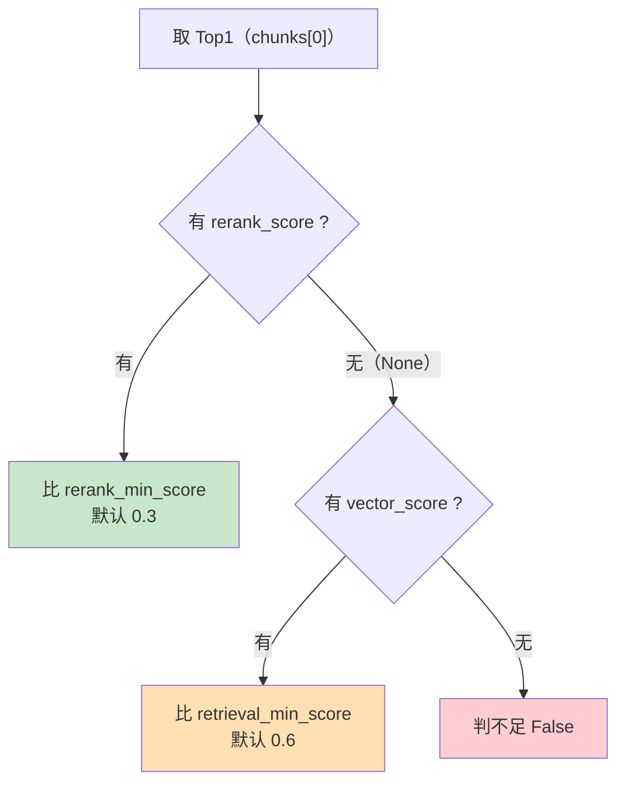

# 03_上下文裁判与统一拒答出口

> 期：**Day08 · 检索链路优化与答案可信度**
> 章：**教程第 3 章 · `judge_context` 与 `refuse` 节点**
> 覆盖：
> - `backend/app/workflows/nodes/judge_context.py`（**新建**）
> - `backend/app/workflows/nodes/refuse.py`（**新建**）
> - `backend/app/workflows/nodes/__init__.py`（**改动**：导出三个新节点）
> 记录日期：2026.09.22

---

## 一、本章定位

**教程第 3 章包含三个子项**（按教程目录）：

```
3、judge_context 与 refuse 节点
    ├ judge_context     ← 本章
    ├ refuse            ← 本章
    └ 节点导出          ← 本章
```

**本章解决的问题**：把**散在三处**的拒答逻辑收成"**一处判定 + 一处输出**"。

```
【改造前】拒答散在三处：
    retrieve._should_refuse          ← 按 vector_score 熔断，并在此写 answer
    plan_retrieval 的 refuse 分支     ← 写 REFUSAL_ANSWER
    observe_context._is_sufficient    ← 同口径判定（间接）

【改造后】
    判定：judge_context（按 rerank_score 裁定）   ← 新增
    动作：refuse 节点统一写文案                     ← 新增
    老节点：各自只管自己的本职（清理见教程第 4 章）
```

| 文件 | 改动 | 行数 |
| --- | --- | --- |
| `app/workflows/nodes/judge_context.py` | **新建** | **76** |
| `app/workflows/nodes/refuse.py` | **新建** | **39** |
| `app/workflows/nodes/__init__.py` | 加 3 个导出 | 30 → **39** |

---

## 二、`judge_context` 节点

### 2.1 完整实现（76 行）

```python
# 引入全局系统配置单例（读 rerank_min_score / retrieval_min_score）
from app.core.config import settings
# 引入 RAG 共享图状态类型定义
from app.workflows.rag_state import RAGState


async def judge_context(state: RAGState) -> RAGState:                        # L30
    """裁定当前上下文是否足以回答：返回 context_is_enough。"""
    chunks = state.get("retrieved_chunks", [])                               # L41

    # 一条都没召回 → 无任何依据，必然不足
    if not chunks:                                                           # L47
        return {"context_is_enough": False}                                  # L48

    # 精排后 chunks 已按 rerank_score 降序 → 首位就是"最相关"的那条
    top = chunks[0]                                                          # L51

    if top.rerank_score is not None:                                         # L56
        # 分支①：有精排分 → 用精排阈值。
        #   注意比较对象是 rerank_min_score（默认 0.3），【不是】retrieval_min_score（0.6）：
        #   精排分与余弦相似度量纲不同，混用会让拒答判定完全失真。
        is_enough = top.rerank_score >= settings.rerank_min_score            # L58
    elif top.vector_score is not None:                                       # L62
        # 分支②：没有精排分 → 回退到向量余弦相似度。
        #   何时会走到这里：rerank 被短路（候选 ≤ 1 / 开关关闭）或降级（调用失败）。
        #   此时用更严格的 retrieval_min_score（0.6）—— 没有精排佐证就更保守。
        is_enough = top.vector_score >= settings.retrieval_min_score         # L65
    else:                                                                    # L69
        # 分支③：两种分数都没有（仅关键词命中的切片）→ 缺乏语义佐证，保守判不足。
        #   这正是第 7 期 retrieve._should_refuse "场景 B" 的同一口径。
        is_enough = False

    return {"context_is_enough": is_enough}                                  # L76
```

### 2.2 纯规则节点，不调模型

模块 docstring：

> 拿精排后的 Top1 分数与阈值比较，裁定"这批上下文到底够不够"。
> **本节点不调用任何模型** —— 与 `observe_context` 同类，只看分数比阈值。
> 之所以能用规则裁定：**精排分已经是"问题与候选的成对相关性"这一最终判据**，
> 再让模型判一次只会引入新的不确定性。

### 2.3 ⭐⭐ 核心：**两分数、两阈值的回退链**



| 分支 | 何时进入 | 用哪个阈值 | 为什么 |
| --- | --- | --- | --- |
| **① 有精排分** | 正常路径 | **`rerank_min_score` = 0.3** | 精排分是**成对相关性**，是**最可信**的判据 |
| **② 无精排分** | rerank **短路或降级** | **`retrieval_min_score` = 0.6** | 回退到余弦相似度，且**更严格** |
| **③ 两者都无** | 仅关键词命中的切片 | — | **判不足**（缺乏语义佐证） |

### 2.4 ⭐⭐ 两个必须理解的点

#### 点 1：降级的条件是「**缺失**」，不是「低」

```
0.2 有值   → 走分支①  → 0.2 >= 0.3 → False        ← 【不降级】
None      → 才走分支②                              ← 降级

⭐ 若"分数低就降级到向量分"：
    只要精排给出低分，就会被向量分"救回来"
    → 精排等于白做
    → 而且会放过"话题相近但没有答案"的候选
```

#### 点 2：**判据越弱，门槛要越高**

```
精排分（成对相关性，可信）  → 门槛 0.3
余弦相似度（整体相似度，较弱）→ 门槛 0.6

为什么回退时反而更严格？
    精排分 0.35 已能说明"这条确实在回答这个问题"；
    而"话题相同但没有答案"的文本，余弦也可能到 0.7
    → 判据越弱，门槛必须越高
```

### 2.5 ⚠️ 本节**尚未**把 `context_is_enough` 加进 `RAGState`

**按教程的实现顺序，该字段在第 6 章「重连工作流图」时才补进状态契约。**

**所以现在**：

```
节点可以独立单测 ✓（返回值不经过 schema）
但接进图后该字段会被【静默丢弃】✗
```

**实测证据**（用当前 `RAGState` 建图跑 `judge_context`）：

```
图执行后输出键: ['question', 'retrieved_chunks']
含 context_is_enough: False    ← 【被静默丢弃了】
```

**⭐ 这是一个非常好的教学案例** —— 它印证了第 9-10 章学到的那条约束：

> **任何节点写到 state 的字段，必须先在 `RAGState` 里声明；未声明的键会被 LangGraph 静默丢弃。**

**⚠️ 一个曾经踩过的坑（记录）**：实现时我**一度把该字段提前加进了 `RAGState`**，理由是"第 3 章的节点要写它，不声明会被丢弃会误导验证"。
但**随即按用户要求回退**，改为严格遵循教程的章节顺序 —— 字段在第 6 章加。
**回退后验证**：`context_is_enough` 已不在 `RAGState`（字段数 16），`judge_context` 的 7 个场景**仍全部通过**（因为它不依赖 schema）。

### 2.6 验证：7 个场景全部通过

| 场景 | 判定 | 结果 |
| --- | --- | --- |
| 空列表 | `False` | ✓ |
| 精排 0.9 | `True` | ✓ |
| 精排 0.2 | `False` | ✓ |
| **精排 0.2 但向量 0.8** | **`False`** | ✓ **⭐ 有精排分时就是权威，不回退** |
| 无精排 + 向量 0.7 | `True` | ✓ |
| 无精排 + 向量 0.5 | `False` | ✓ |
| 两个都没有 | `False` | ✓ |

**⚠️ 第 4 项是最值得注意的行为**：

```
精排 0.2（低）但向量 0.8（高）
    → 判 False（不信向量）

因为精排是"问题与候选的成对相关性"，
而向量只是"整体相似度" —— 后者可能被"话题相近但没有答案"骗到。
有更可信的判据时，就不该回退到较弱的那个。
```

---

## 三、`refuse` 节点

### 3.1 完整实现（39 行，逻辑极简）

```python
# 引入标准拒答文案常量
from app.llm.prompts import REFUSAL_ANSWER
# 引入 RAG 共享图状态类型定义
from app.workflows.rag_state import RAGState


async def refuse(state: RAGState) -> RAGState:                               # L28
    """统一拒答出口：置 refused 标志并写入标准拒答文案。"""
    return {"refused": True, "answer": REFUSAL_ANSWER}                       # L39
```

### 3.2 ⭐ 为什么值得单独一个节点

**改造前**，`REFUSAL_ANSWER` 被写在**三处**：

| 位置 | 场景 |
| --- | --- |
| `retrieve._should_refuse` → 写 `answer` | 检索就熔断 |
| `plan_retrieval` 的 `refuse` 分支 | planner 主动放弃 |
| `observe_context`（间接） | 同口径判定 |

**收敛后的收益**（教程原话）：

> `planner` 决策 `refuse` 时，由图边把控制权交给 `refuse` 节点统一返回文案。
> **后续改文案、加日志、加 metrics 都只需要改一处。**

**验证**：全仓现在只有 **2 处**出现 `REFUSAL_ANSWER`：

```
app/llm/prompts.py               ← 常量定义
app/workflows/nodes/refuse.py    ← 【唯一】写入点 ✓
```

### 3.3 ⭐⭐ 「判定」与「动作」是两件事（本章最重要的设计思想）

```
本节点只负责【动作】（写文案）
"是否拒答"的【判定】仍有两处 —— 而且这是【合理的】：
    ① plan_retrieval 的 refuse 决策 = 「这个问题根本不该检索」（实时天气、闲聊）
    ② judge_context 的裁定          = 「检索了，但证据不够」

两种【语义不同】的拒答 → 分成两处判定
但拒答【动作】统一在这里执行
```

**⚠️ 不要误以为"收敛"等于"判定也只剩一处"** —— **收敛的是动作**。

### 3.4 为什么两个字段一起写

```python
    return {"refused": True, "answer": REFUSAL_ANSWER}
```

代码注释：

> 服务层按 `refused` 分流（拒答直接下发预置文案、不调模型），
> 而持久化与前端展示用的是 `answer`。
> **两者必须成对写入**，否则会出现"标记为拒答却没有文案"或"有文案却标记未拒答"的错配。

**实测**：

```
refuse({}) → {'refused': True, 'answer': '抱歉，知识库中没有找到与该问题相关的可靠依据。'}
```

---

## 四、节点导出（`nodes/__init__.py`）

### 4.1 改动

```python
from app.workflows.nodes.generate import stream_generate
from app.workflows.nodes.judge_context import judge_context      # L14 新增
from app.workflows.nodes.load_context import load_context
from app.workflows.nodes.normalize_query import normalize_query
from app.workflows.nodes.observe_context import observe_context
from app.workflows.nodes.plan_retrieval import plan_retrieval
from app.workflows.nodes.refuse import refuse                    # L19 新增
from app.workflows.nodes.rerank import rerank                    # L20 新增
from app.workflows.nodes.retrieve import retrieve
from app.workflows.nodes.route_query import route_query

__all__ = [                                                      # L28
    "load_context",     # 1. 历史消息加载节点
    "normalize_query",  # 2. Query 标准化与意图透传节点
    "route_query",      # 3. 查询优化策略路由节点
    "plan_retrieval",   # 4. Agentic 循环决策节点
    "retrieve",         # 5. 混合检索节点（第 8 期起只负责召回，不再判拒答）
    "observe_context",  # 6. Agentic 循环观察节点（判"要不要再试"）
    "rerank",           # 7. 精排节点                             ← L35
    "judge_context",    # 8. 上下文裁判节点（判"能不能回答"）      ← L36
    "refuse",           # 9. 统一拒答出口（所有拒答边收口到这里）  ← L37
    "stream_generate",  # 10. 大模型流式输出生成节点
]                                                                # L39
```

### 4.2 ⚠️ 一处与教程不一致（**刻意保留项目既有约定**）

```
【教程的 __all__】按【字母序】排：
    judge_context, load_context, normalize_query, observe_context,
    plan_retrieval, refuse, rerank, retrieve, route_query, stream_generate

【本项目】按【图的执行顺序】排并编号（第 7 期定的约定）：
    load_context → normalize_query → route_query → plan_retrieval → retrieve
    → observe_context → rerank → judge_context → refuse → stream_generate
```

**保留项目约定的理由**：

```
__all__ 不只是"公开符号清单"，它也是读者理解【整条链路顺序】的第一入口
    按执行顺序排 + 编号 → 一眼看出节点在链路上的位置
    按字母序排         → 只是一个符号表，没有流程信息
```

**⚠️ 但要注意一处顺序**：`rerank` 排在 `retrieve` **之后**、`judge_context` **之前** —— 与本期的**新链路**一致（而教程的字母序里 `rerank` 排在 `refuse` 后面，看不出这个关系）。

### 4.3 验证

```
__all__ 共 10 项，全部可从门面访问 ✓
['load_context', 'normalize_query', 'route_query', 'plan_retrieval', 'retrieve',
 'observe_context', 'rerank', 'judge_context', 'refuse', 'stream_generate']
```

---

## 五、本章结论

| # | 结论 |
| --- | --- |
| **①** | **拒答的"动作"收敛到一处，但"判定"仍是两处** —— 且这是合理的（两种语义不同的拒答） |
| **②** | **`judge_context` 的回退链有优先级**：有精排分就用精排分（**不回退**）；**缺失**时才用向量分，且门槛更高（**判据越弱，门槛越高**） |
| **③** | **`context_is_enough` 故意不在本章加进 `RAGState`** —— 教程安排在第 6 章；本章节点可独立单测 |

---

## 六、问题解析（五道自测题批改）

### Q1　Top1 同时有 `rerank_score=0.2` 和 `vector_score=0.8`，判够还是不够？

**参考答案**：**不够**。

```python
    if top.rerank_score is not None:        # 0.2 is not None → True
        is_enough = 0.2 >= 0.3              # → False
    elif top.vector_score is not None:      # 【根本不会到这里】
```

**⭐ 关键：降级的条件是「缺失（`is None`）」，不是「低」**。

```
若"分数低就降级到向量分"：
    只要精排给出低分，就会被向量分"救回来"
    → 精排等于白做
    → 而且会放过"话题相近但没有答案"的候选
```

| 作答 | 结果 |
| --- | --- |
| "够，因为精排分支没过去，跳到降级余弦相似度" | ❌ **关键误解** |

### Q2　两个阈值分别在什么情况下用？为什么回退时更严格？

**参考答案**：

| 分支 | 何时用 | 阈值 |
| --- | --- | --- |
| ① 有 `rerank_score` | 正常路径 | **`rerank_min_score` = 0.3** |
| ② 无 `rerank_score` | rerank 短路 / 降级 | **`retrieval_min_score` = 0.6** |

**为什么回退时更严格**：

```
精排分（成对相关性，可信）  → 门槛 0.3
余弦相似度（整体相似度，较弱）→ 门槛 0.6

"话题相同但没有答案"的文本，余弦也能到 0.7
    → 判据越弱，门槛必须越高
```

| 作答 | 结果 |
| --- | --- |
| 结论对（"能用精排就用精排"），但未答"为什么更严格"，且两个阈值的先后说反 | ⚠️ **半对** |

### Q3　拒答的"判定"现在还剩几处？分别是什么语义？

**参考答案**：**两处，且语义不同**。

| # | 判定处 | 语义 |
| --- | --- | --- |
| ① | `plan_retrieval` 的 `refuse` 决策 | 「**这个问题根本不该检索**」 |
| ② | `judge_context` 的裁定 | 「**检索了，但证据不够**」 |

**收敛的是【动作】，不是【判定】**。

| 作答 | 结果 |
| --- | --- |
| "两处" | ✅ 正确（补语义更好） |

### Q4　`retrieve` 口径放大遵循什么设计？

**参考答案**：

```
retrieve：宁滥勿缺 —— 让 rerank 有【足量】候选可挑
rerank  ：宁缺勿滥 —— 有了绝对相关性才敢裁
```

**核心原因**：

```
retrieve 融合后按【RRF 融合分】降序截断到 5
    RRF 分 = Σ 1/(k + rank)，上限仅 2/(k+1) ≈ 0.033
    它只反映"在两条腿里都排前面"，【不反映真实相关性】

→ 第 6 名之后可能有一条"真正回答了问题"的切片，因 RRF 排序被切掉
→ 而精排的成对打分本可以把它捞上来

若 retrieve 先裁到 5：精排只能在 5 条里排序
    → 召回阶段漏掉的，精排永远救不回来
```

| 作答 | 结果 |
| --- | --- |
| "放大遵循宁滥勿缺设计…不放大优质语义会被一刀切，精排优化很有限" | ✅ 正确 |

### Q5　`plan_retrieval` 的 `refuse` 分支为什么只写 `refused=True`、不写 `answer`？

**参考答案**：**因为写文案是 `refuse` 节点的活**。

```
图的条件边 _after_plan 读的是 agent_steps[-1]["action"] == "refuse"
    → 它据此把控制权交给 refuse 节点
    → refuse 节点写 answer

所以 plan_retrieval 只需要"声明意图"，控制流与文案各归其位
```

**⚠️ `update["refused"] = True` 这一行保留**：服务层按 `state["refused"]` 分流（拒答直接把 `answer` 当 token 下发、不调模型），所以这个标记必须有人写。

| 作答 | 结果 |
| --- | --- |
| 未作答 | ❌ **需补** |

### 批改汇总

| 题 | 结果 | 核心缺口 |
| --- | --- | --- |
| **Q1** | ❌ **关键误解** | 降级条件是 **`is None`**，不是"分数低"；精排 0.2 + 向量 0.8 → **判不足** |
| **Q2** | ⚠️ 半对 | 未答"为什么回退时更严格"（**判据越弱，门槛越高**）；两阈值先后说反 |
| **Q3** | ✅ 正确 | 补：收敛的是**动作**，判定仍是两处（语义不同） |
| **Q4** | ✅ 正确 | 补：RRF 分**只反映排名** |
| **Q5** | ❌ 需补 | **控制流由条件边负责（读 `agent_steps`），文案由 `refuse` 负责** |

**2 对、1 半对、2 缺。**

### 两条必须补的

**① Q1：降级的条件是「缺失」，不是「低」**

```
有精排分   → 它就是权威（0.2 就是 0.2，判不足）
没有精排分 → 才回退到向量分

⭐ 否则"低分总被高向量分救回来" → 精排等于白做
```

**② Q2：判据越弱，门槛要越高**

```
精排分（成对相关性，可信）  → 门槛 0.3
余弦相似度（整体相似度，较弱）→ 门槛 0.6
```

**这两条合起来就是 `judge_context` 的全部设计** —— **一个"可信度 → 门槛"的映射**。

---

## 七、当前状态

```
✅ 教程第 2 章  Reranker 客户端 + rerank 节点（已归档）
✅ 教程第 3 章  judge_context / refuse / 节点导出（本章）
────────────────────────────────────────────────────────────
⬜ 教程第 4 章  retrieve 与 plan_retrieval 删除拒答逻辑
⬜ 教程第 5 章  normalize_query 接入多轮上下文改写
⬜ 教程第 6 章  重连工作流图（含 RAGState 新增 context_is_enough）
⬜ 教程第 7 章  AnswerVerifier 答案校验器
⬜ 教程第 8 章  ChatService 集成 verify + 把 rerank_score 加进检索元数据
```

---

## 八、一句话总结

> 本章把**散在三处**的拒答逻辑收成"**一处判定 + 一处输出**"：新增 `judge_context` 纯规则节点（**不调模型**，因为精排分已是"问题与候选的成对相关性"这一最终判据）
> 拿 Top1 分数裁定"到底能不能回答"，产出 `context_is_enough`；新增 `refuse` 节点作为**唯一**的拒答文案输出点，
> 并把三个新节点（`rerank` / `judge_context` / `refuse`）从门面导出；
> `judge_context` 的核心是一条**两分数、两阈值的回退链**，两条必须理解的设计：
> **① 降级的条件是「缺失（`is None`）」而不是「低」** —— 有精排分时它就是权威（实测"精排 0.2 + 向量 0.8"判 **不足**），
> 否则低分总被高向量分救回来，精排等于白做；**② 判据越弱、门槛要越高** —— 精排分（成对相关性）门槛 0.3、
> 余弦相似度（整体相似度）门槛 0.6，因为"话题相同但没有答案"的文本余弦也能到 0.7；
> 并固化一条重要认知：**"收敛"收敛的是【动作】，不是【判定】** —— 判定仍是两处（`plan_retrieval` 的"这问题不该检索"
> 与 `judge_context` 的"检索了但证据不够"），因为这是两种**语义不同**的拒答；
> **⚠️ 本章还刻意留了一个"未完成"**：`context_is_enough` **不放进 `RAGState`**（教程安排在第 6 章），
> 因此该字段现在**不会真正进入图状态** —— 实测用当前 schema 建图跑 `judge_context`，输出里确实**没有这个键**（被静默丢弃），
> 这正好实证了第 9-10 章那条约束："**未在 schema 声明的键会被 LangGraph 静默丢弃**"；
> 本节点仍可独立单测（7 场景全通过），等第 6 章补上字段后再由图使用。

---

## 九、关联文件索引

| 文件 | 关键位置 | 说明 |
| --- | --- | --- |
| **`app/workflows/nodes/judge_context.py`** | **L30** | **`async def judge_context`** |
| `app/workflows/nodes/judge_context.py` | L1-19 | 模块 docstring（职责 / 纯规则 / 与 observe_context 的分工 / 未入 schema 的说明） |
| `app/workflows/nodes/judge_context.py` | L41 / L47 / L48 | 取 chunks / 判空 / 返回 `False` |
| `app/workflows/nodes/judge_context.py` | L51 | `top = chunks[0]` |
| `app/workflows/nodes/judge_context.py` | **L56 / L58** | **分支①：有精排分 → 比 `rerank_min_score`** |
| `app/workflows/nodes/judge_context.py` | **L62 / L65** | **分支②：回退 → 比 `retrieval_min_score`** |
| `app/workflows/nodes/judge_context.py` | L69 | 分支③：两者都无 → `False` |
| `app/workflows/nodes/judge_context.py` | L76 | `return {"context_is_enough": is_enough}` |
| **`app/workflows/nodes/refuse.py`** | **L28 / L39** | **`refuse` 定义 / `return {"refused": True, "answer": REFUSAL_ANSWER}`** |
| **`app/workflows/nodes/__init__.py`** | L14 / L19 / L20 | 三个新导入（`judge_context` / `refuse` / `rerank`） |
| `app/workflows/nodes/__init__.py` | L28-39 | `__all__`（10 项，按执行顺序排；L35-37 为三个新增） |
| `app/core/config.py` | L202 / L143 | `rerank_min_score=0.3` / `retrieval_min_score=0.6`（**两个阈值**） |
| `app/llm/prompts.py` | — | `REFUSAL_ANSWER` 常量定义 |
| `app/workflows/nodes/retrieve.py` | L92（**已删**） | 原 `_should_refuse`（口径迁到 `judge_context`，清理见第 4 章） |
| `app/workflows/nodes/plan_retrieval.py` | L129-130 | (`refuse` 分支，清理见第 4 章) |
| `app/workflows/rag_state.py` | — | **目前不含 `context_is_enough`**（第 6 章再加） |
| `app/retrieval/vector_retriever.py` | L69 | `rerank_score`（`judge_context` 分支①的依据） |
| `app/workflows/graph.py` | L109-113 | `_after_plan` 条件边（第 6 章要改为指向 `refuse` 节点） |
