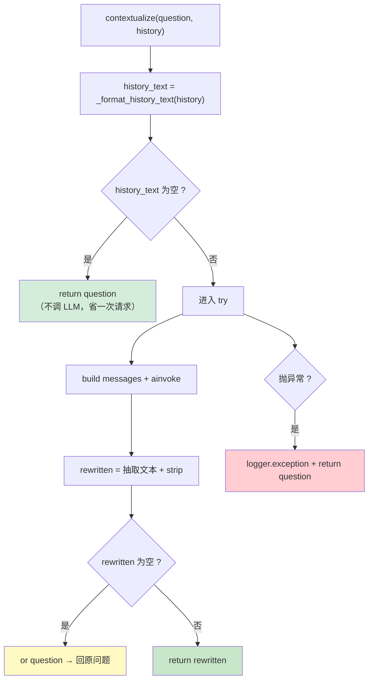

# 05_多轮上下文化改写

> 期：**Day08 · 检索链路优化与答案可信度**
> 章：**教程第 5 章 · `normalize_query` 接入多轮上下文化**
> 覆盖：
> - `backend/app/llm/prompts.py`（**改动**：新增 contextualize prompt）
> - `backend/app/llm/query_rewriter.py`（**改动**：新增 `contextualize` 方法 + 两个辅助件）
> - `backend/app/workflows/nodes/normalize_query.py`（**重写**）
> - `backend/app/workflows/nodes/route_query.py`（**改动**：改用 `state["query"]`）
> - `backend/app/workflows/nodes/plan_retrieval.py`（**改动**：两处改用 `state["query"]`）
> 记录日期：2026.09.22

---

## 一、本章定位

**教程第 5 章包含三个子项**：

```
5、normalize_query 接入多轮上下文化
    ├ contextualize prompt              ← prompts.py
    ├ QueryRewriter 新增 contextualize   ← query_rewriter.py
    └ 改造 normalize_query 节点          ← normalize_query.py（并顺带改 route_query / plan_retrieval）
```

**本章解决的问题**：多轮对话里，用户会说"**它**怎么配置"、"**那**学分呢" ——
这些问句**单独拿去检索什么也找不到**，因为指代没有消解、省略没有补全。

**教程原话**：

> 接下来处理链路多轮对话时 query 质量不高的问题。
> 比如用户追问"它的价格是多少"，如果 AI 不理解"它"的指代，检索根本找不到正确的 chunk。

| 文件 | 改动 | 行数 |
| --- | --- | --- |
| `app/llm/prompts.py` | 新增 4 项（2 常量 + 1 模板 + 1 构造函数） | 362 → **404** |
| `app/llm/query_rewriter.py` | 新增 `_ROLE_LABEL` / `_format_history_text` / `contextualize` | 273 → **339** |
| `app/workflows/nodes/normalize_query.py` | **重写**（28 行 → 44 行） | 28 → **44** |
| `app/workflows/nodes/route_query.py` | `state["question"]` → `state["query"]` | 75 → **79** |
| `app/workflows/nodes/plan_retrieval.py` | **两处**同一替换 | 132 → **136** |

---

## 二、`contextualize` prompt（`prompts.py` L369-404）

```python
# =============================================================================
# 第 8 期：多轮上下文化 prompt
# =============================================================================

_CONTEXTUALIZE_SYSTEM = """你是一个多轮对话查询改写助手。请基于对话历史把用户当前问题改写成
**独立完整、可单独检索**的问句：

- 消解指代："它"、"这个"、"上面提到的…"、"刚才那个…"等
- 补全省略：用户在追问场景里经常省略主语或宾语，需要从历史里把缺失成分补全
- 不要回答问题，不要扩展含义，不要改变用户的真实意图
- 不要加任何引号、编号、解释，只输出单行改写后的问句
- 如果当前问题已经独立完整，直接原样输出

【对话历史】
{history}"""                                                            # L369

_CONTEXTUALIZE_HUMAN = "{question}"                                     # L381

CONTEXTUALIZE_PROMPT = ChatPromptTemplate.from_messages(                # L383
    [("system", _CONTEXTUALIZE_SYSTEM), ("human", _CONTEXTUALIZE_HUMAN)]
)


def build_contextualize_messages(question: str, history: str) -> list[BaseMessage]:   # L388
    """组装多轮上下文化改写的 messages。"""
    return list(
        CONTEXTUALIZE_PROMPT.invoke(
            {"question": question, "history": history}
        ).to_messages()
    )
```

### 2.1 prompt 的五个约束，逐条都有用意

| 约束 | 防什么 |
| --- | --- |
| 消解指代 / 补全省略 | **核心目的** |
| **不要回答问题** | 防模型"越权" —— 它只该改写问句，不该顺手答一遍（那是 `generate` 的活） |
| **不要扩展含义、不改真实意图** | 防"改写漂移" —— 把"它多少钱"扩写成"B200 的价格、供货周期、售后政策"就不是原意了 |
| **不加引号 / 编号 / 解释** | 输出**直接被当成检索词**，带引号或"改写后：xxx"会污染向量化输入 |
| **已独立完整就原样输出** | 防"无谓改写" —— 首轮的问题本来就是完整的，别乱动 |

### 2.2 「为什么 `history` 是已格式化的纯文本」

代码注释：

> 把 `Message` → 纯文本的转换放在调用方（`query_rewriter` 的 `_format_history_text`），
> 让 prompt 层保持"**只认字符串**"的简单契约 —— 与 `build_agent_plan_messages` 的 `history` 参数同一做法。

**⭐ 这是本项目 prompt 层的一贯设计**：

```
prompts.py    → 只负责"模板 + 占位符填充"，输入输出都是字符串
调用方（llm/*.py） → 负责"领域对象 → 文本"的转换
```

**好处**：`prompts.py` 不需要 import `Message` 等 ORM 类型，**依赖方向干净**（prompt 层不依赖 db 层）。

---

## 三、`QueryRewriter` 的新增内容（`query_rewriter.py`）

### 3.1 新增导入（L30-37）

```python
from app.db.models import Message, MessageRole
from app.llm.prompts import (
    build_contextualize_messages,      # 新增
    build_hyde_messages,
    build_multi_query_messages,
    build_rewrite_messages,
    build_route_messages,
)
```

### 3.2 `_ROLE_LABEL`（L57-60）—— ⚠️ **与教程有一处刻意的差异**

```python
# 角色 → 中文标签。给上下文化 prompt 看的人话版历史。
# 【为什么用 MessageRole 枚举作键、而不是字母串】：
# MessageRole 继承自 str，枚举成员与它的字符串值 __eq__ 且 __hash__ 相同（实测），
# 因此 ORM 里读出来的 "user" 字符串也能命中这个字典；
# 这样键既"类型安全"（只能用合法角色）又"实际可用"（字符串照常命中）。
# 【⚠️ 为什么【不】放 MessageRole.SYSTEM】：
# 下方的过滤条件写作 `if not role_label`，依赖"不在表里 → 被过滤"。
# 若把 SYSTEM 也放进来，它就永远通不过过滤，与 docstring 声明的"过滤 system"矛盾。
# system 是系统提示词、不是对话内容，塞进"对话历史"只会浪费 token 并干扰指代消解。
_ROLE_LABEL: dict[MessageRole, str] = {
    MessageRole.USER: "用户",           # L58
    MessageRole.ASSISTANT: "助手",      # L59
}
```

#### ⚠️⚠️ 这里修正了**教程代码本身的一个 bug**

**教程的 `_ROLE_LABEL` 包含三个键**（含 `MessageRole.SYSTEM: "系统"`），
**但它自己的 docstring 写着"只取 user / assistant，过滤 system"** —— **代码与注释矛盾**。

**实测（照教程原样写的代码）**：

```
含 system 的历史 -> '系统: 你是助手\n用户: Q'    ← ❌ system 没被过滤
```

**原因**：

```python
role_label = _ROLE_LABEL.get(msg.role)               # SYSTEM 在表里 → "系统"（truthy）
if not role_label or not msg.content.strip():        # 过滤条件【不成立】
    continue                                         # → 不跳过，system 被收进历史
```

**过滤条件写的是 `if not role_label`，它依赖"不在表里 → 被过滤"这个机制** ——
所以**表里一旦有 SYSTEM，过滤就失效**。

**按 docstring 的意图修正（删掉 SYSTEM 项）后的实测**：

| 场景 | 输出 |
| --- | --- |
| 空历史 | `''` |
| 只 user | `'用户: 接口怎么认证'` |
| user + assistant | `'用户: A?\n助手: A!'` |
| **含 system** | **`'用户: Q'`** ← ✅ system 被过滤 |
| **system 夹在中间** | **`'用户: Q1\n助手: A1'`** ✅ |
| 含空内容 | `'用户: Q'` |
| 全部被过滤 | `''` |

**⭐ 判定这个修正正确的三条理由**：

```
① 教程的【注释】说明了意图（过滤 system）
② 教程的【代码】没实现这个意图
③ system 是系统提示词、不是对话内容
   → 塞进"对话历史"会让每轮都重复一遍系统提示词
   → 既浪费 token，也会干扰指代消解（模型可能把系统提示当成"上文提到的东西"）
```

### 3.3 `_format_history_text`（L63-76）

```python
def _format_history_text(history: list[Message]) -> str:               # L63
    """把历史 Message 压成给 contextualize prompt 看的纯文本。

    只取 user / assistant，过滤 system；空内容跳过，避免把空消息塞进 prompt 浪费 token。
    """
    lines: list[str] = []                                             # L68
    for msg in history:                                               # L69
        role_label = _ROLE_LABEL.get(msg.role)                        # L70
        # 过滤两类：角色不在白名单（如 system）、或内容为空白
        if not role_label or not msg.content.strip():                 # L72
            continue
        lines.append(f"{role_label}: {msg.content.strip()}")          # L74
    # 用换行连接：prompt 里 {history} 占位符会原样嵌入这段文本
    return "\n".join(lines)                                           # L76
```

**⭐ 三个细节**：

| # | 细节 | 为什么 |
| --- | --- | --- |
| ① | **一次过滤两类**：`not role_label or not content.strip()` | 角色白名单 + 空内容，一个条件解决 |
| ② | `msg.content.strip()` 调了**两次** | 判断用一次、拼装用一次 —— 保证拼进 prompt 的是**去空白后**的文本 |
| ③ | 格式 `"{角色}: {内容}"` | 比裸文本更利于模型分清"谁说的"；中文标签比 `user:` 更贴合中文 prompt |

### 3.4 ⭐⭐ `contextualize`（L120-152）

```python
    async def contextualize(self, question: str, history: list[Message]) -> str:   # L120
        """基于多轮历史把当前问题改写成独立完整的问句。

        消解"它/这个/上面提到的"等指代、补全省略，让后续 route_query / retrieve
        看到的 query 已经独立可检索。空历史直接回原问题；任何异常 / 改写为空 → 降级回原问题。

        【为什么放在 QueryRewriter 而不是 normalize_query 节点里】：
        本类已经是"所有 LLM 改写能力"的收敛点（route / rewrite / hyde / multi_query），
        上下文化本质是第五种改写，放进来即可复用单例、日志与降级约定。
        """
        history_text = _format_history_text(history)                  # L134
        # 没有可用历史 → 没有指代可消解，直接回原问题，省一次 LLM 调用
        if not history_text:                                          # L136
            return question                                           # L137

        try:                                                          # L139
            messages = build_contextualize_messages(                  # L140
                question=question, history=history_text
            )
            response = await get_chat_model().ainvoke(messages)       # L143
            rewritten = _extract_text(response.content).strip()       # L144
            # `or question`：模型偶尔返回空串，此时回退到原问题
            return rewritten or question                              # L146
        except Exception:                                             # L147
            # 与其它改写方法一致：任何失败都降级，不让 LLM 抖动阻断检索链路
            logger.exception(                                         # L149-151
                "contextualize 调用失败，降级回原问题: question=%r", question
            )
            return question                                           # L152
```

#### ⭐ 为什么放进 `QueryRewriter` 而不是写在节点里

```
QueryRewriter 已经是"所有 LLM 改写能力"的收敛点
    route / rewrite / hyde / multi_query   ← 已有的四种
    contextualize                          ← 本期第五种

放进来即可复用：单例、logger、降级约定、以及"模型输出不可信"的处理风格
```

**⚠️ 这也是第 6 期抽出 `apply_route` 之后，本类的第二次扩展** ——
说明"薄方法 + 单例"的设计**经得起追加**（本次只加了一个方法，没有改动既有方法的任何一行）。

#### ⭐⭐ 四层降级链（本方法的完整防护）



| 层 | 触发条件 | 处理 |
| --- | --- | --- |
| **① 无历史** | `history_text` 为空串 | **原问题**（**且不调 LLM**） |
| **② 改写为空** | 模型返回空串 | **原问题**（`or question`） |
| **③ 抛异常** | 模型 5xx / 网络错误 | **原问题**（记日志） |
| **④ 正常** | — | 返回改写结果 |

**⭐ 这四层与 `QueryRewriter` 里其它方法的降级约定完全一致**（第 5-6 期就定下的"任何失败都降级，绝不向调用方抛异常"）。

**实测**：

```
模型异常（桩）-> 记日志 + 返回原问题 ✓
仅 system 历史 -> 过滤后为空 -> 透传原问题 ✓
```

---

## 四、改造 `normalize_query` 节点（重写，28 → 44 行）

### 4.1 完整实现

```python
"""Query 标准化与多轮上下文化节点。
 ...（模块 docstring 见文件）
"""

# 引入改写器单例（它的 contextualize 方法负责实际改写）
from app.llm.query_rewriter import get_query_rewriter
# 引入 RAG 共享图状态类型定义
from app.workflows.rag_state import RAGState


async def normalize_query(state: RAGState) -> RAGState:                # L27
    """RAG 工作流节点：基于对话历史把当前问题改写为独立可检索的问句。"""
    # chat_history 由 load_context 预加载（正序、最近若干轮）；缺失时用 [] 兜底
    history = state.get("chat_history") or []                          # L34

    # 首轮对话没有历史 → 没有指代可消解，直接透传原问题，省一次 LLM 调用
    if not history:                                                    # L37
        return {"query": state["question"]}                            # L38

    # 有历史则交给改写器做上下文化（内部已保证失败降级回原问题，不会抛异常）
    rewritten = await get_query_rewriter().contextualize(              # L41
        question=state["question"], history=history
    )
    return {"query": rewritten}                                        # L44
```

### 4.2 ⭐ 节点里**不做 try/except**（与 `route_query` 同一手法）

```
contextualize 内部已保证"任何失败都降级回原问题且不抛异常"
    → 节点再包一层异常处理就是【重复防御】

这与 route_query 的注释说的是同一件事：
    "本节点不 try/except——优化器已保证…在这里再包一层异常处理反而是重复防御"
```

### 4.3 ⭐ 为什么改写结果写进 `query` 而不覆盖 `question`

模块 docstring：

> `question` 是"**用户原话**"，是业务事实，后续决策器 / 答案校验都要以它为准（避免被改写带偏）；
> `query` 是"**这一轮实际拿去检索的词**"，是可加工的工作变量。
> 两者分开存，才能既保留用户的真实意图、又让检索用上补全后的问句。

**⭐ 这是本章最重要的一条设计原则**：

| 字段 | 语义 | 可否被加工 |
| --- | --- | --- |
| `question` | 用户原话（**业务事实**） | ❌ **不可变** |
| `query` | 这一轮实际送去检索的词 | ✅ 可被 `normalize_query` / `route_query` 改写 |

**⚠️ 第 7 期 `plan_retrieval` 的 planner prompt 就是靠这个区分工作的**：

```
build_agent_plan_messages 的参数注释写着：
    :param question: 用户原始提问（始终以它为准，避免被改写后的 query 带偏）
    :param current_query: 当前这一轮实际用于检索的查询词
```

**→ 所以 `question` 与 `query` 的分离在第 7 期就已经设计好了，本章是它的第一次真正落地。**

---

## 五、顺带改造的两个节点

### 5.1 `route_query`（L61-62）

```python
     result = await get_query_rewriter().optimize(
-        question=state["question"],
+        question=state["query"],
         multi_query_count=settings.multi_query_count,
     )
```

**新增注释**：

```python
    #    【第 8 期起传 state["query"] 而不是 state["question"]】：
    #    normalize_query 已把"消解了指代、补全了省略"的独立问句写进 query，
    #    策略路由应当基于那个【已经完整】的问句判定与改写 ——
    #    否则「它怎么配置」这类残缺问句会被判成 original，改写能力白白浪费。
```

### 5.2 `plan_retrieval`（**两处**，L65 与 L98）

```python
     decision = await get_agent_planner().plan(
-        question=state["question"],
+        question=state["query"],
         current_route=current_route,
         current_query=current_query,
         previous_steps=steps,
     )
```

```python
         result = await rewriter.apply_route(
-            question=state["question"],
+            question=state["query"],
             route=decision.new_route,
             multi_query_count=settings.multi_query_count,
         )
```

**⚠️ 教程原话**：

> **注意** `plan_retrieval` 中用了**两次** `question`，都要改称 `query`，**注意别漏了**。

**实测确认**：

```
plan_retrieval.py   question=state["query"] × 2    question=state["question"] × 0  ✓（正好两处）
route_query.py      question=state["query"] × 1    question=state["question"] × 0  ✓
```

### 5.3 ⚠️ 有一处 `state["question"]` **刻意不改**（L42）

```python
    current_query = state.get("query") or state["question"]
```

**为什么保留**：

```
这是【兜底链】：query 缺失时回落到原问题
    → 若改成 `state.get("query") or state["query"]` 就永远是 None，兜底失效
    → 若改成 `state["query"]` 则 query 缺失时会 KeyError

⭐ "保留用户真实意图"的兜底，就该用 question
```

**⭐ 这正好演示了 `question` / `query` 的分工**：

```
所有"基于当前检索词做加工"的地方 → 用 query（本次改了 3 处）
所有"保留用户真实意图 / 兜底"的地方 → 用 question（本次没改 1 处）
```

---

## 六、⭐ 实测：指代消解真的生效了

### 6.1 真实多轮改写

| 当前问题 | 历史 | 改写结果 | 效果 |
| --- | --- | --- | --- |
| **`它怎么配置`** | 接口怎么认证 / 用 API Key，放请求头 | **`API Key 怎么配置`** | ✅ "它" → "API Key" |
| **`那学分呢`** | 接口怎么认证 / 用 API Key | **`学分怎么认证`** | ✅ 补全了省略的谓语 |
| **`上面提到的那个模型多少钱`** | B200 散热设计 / 采用液冷方案 | **`B200 的价格是多少`** | ✅ "那个模型" → "B200" |
| `接口怎么认证` | 无历史 | 透传 | ✅ 无历史不调 LLM |

**⚠️ 第 2 条值得注意**：

```
"那学分呢" → "学分怎么认证"

模型【继承了上文的话题（认证）】，但语义略有偏移
（用户原意可能是"学分是多少"）
→ 这是【模型理解的局限】，不是流程 bug
→ 改写能力终究受模型理解影响，不能期望 100% 准确
```

### 6.2 prompt 编译与变量

```
CONTEXTUALIZE_PROMPT 变量: ['history', 'question']      ✓
组装出 2 条消息，system 里含历史: True                    ✓
```

### 6.3 降级链

```
无历史          -> 透传原问题（不调 LLM）✓
仅 system 历史  -> 过滤后为空 -> 透传 ✓
模型异常        -> 记日志 + 回原问题 ✓
改写为空        -> `or question` 回原问题 ✓
```

---

## 七、本章结论

| # | 结论 |
| --- | --- |
| **①** | **`question` 与 `query` 的职责分离在本章真正落地** —— 前者是业务事实（不可变）、后者是工作变量（可加工）；**"加工用 query，兜底用 question"** |
| **②** | **改写能力收敛在 `QueryRewriter`** —— 上下文化是第五种改写，复用了单例 / logger / 降级约定，**本类第二次扩展而既有方法一行未改** |
| **③** | **四层降级链**：无历史 / 改写为空 / 抛异常 / 正常 —— 与 `QueryRewriter` 其它方法一致，"任何失败都降级，绝不抛给调用方" |
| **④** | ⚠️ **修正了教程代码的一个 bug**：`_ROLE_LABEL` 含 `SYSTEM` 导致 docstring 声明的"过滤 system"失效 |
| **⑤** | **prompt 层只认字符串** —— `Message → 文本` 的转换在调用方做，`prompts.py` 不依赖 `db` 层 |

---

## 八、当前状态

```
✅ 教程第 2 章  Reranker 客户端 + rerank 节点（已归档）
✅ 教程第 3 章  judge_context / refuse / 节点导出（已归档）
✅ 教程第 4 章  retrieve 与 plan_retrieval 删除拒答逻辑（已归档）
✅ 教程第 5 章  normalize_query 接入多轮上下文化（本章）
────────────────────────────────────────────────────────────
⬜ 教程第 6 章  重连工作流图（含 RAGState 新增 context_is_enough）⚠️ 本期风险最高
⬜ 教程第 7 章  AnswerVerifier 答案校验器
⬜ 教程第 8 章  ChatService 集成 verify + 把 rerank_score 加进检索元数据
```

**⚠️ 当前图仍是"散落零件"状态**：`normalize_query` / `route_query` 已改造，但 `rerank` / `judge_context` / `refuse` 还没接进图。

**教程原话（本章末）**：

> 到这里，新节点（`rerank` / `judge_context` / `refuse`）写好了，老节点（`retrieve` / `plan_retrieval` / `normalize_query` / `route_query`）也改造完成了。
> **但它们还是散落的零件，要把它们串成一张完整的图才能跑起来。**

---

## 九、一句话总结

> 本章解决"**多轮对话里指代消解**"：在 `prompts.py` 新增 `CONTEXTUALIZE_PROMPT`（**五条约束各有防的对象** ——
> 不回答问题、不扩展含义、不加引号编号、已完整就原样输出），在 `QueryRewriter` 新增第五种改写能力 `contextualize`
> （**四层降级链**：无历史 / 改写为空 / 抛异常 / 正常，与类内其它方法一致；
> 它放在本类是因为这里是"所有 LLM 改写能力的收敛点"，**本次扩展既有方法一行未改**），
> 并把 `normalize_query` 从"透传节点"改造成"上下文化节点"；
> 本章真正落地的核心设计是 **`question` 与 `query` 的职责分离** ——
> `question` 是**用户原话（业务事实，不可变）**、`query` 是**这一轮实际用于检索的词（工作变量，可加工）**，
> 因此本次把 `route_query` 与 `plan_retrieval` 的**三处** `state["question"]` 改成 `state["query"]`
> （教程特意提醒"`plan_retrieval` 有两处，注意别漏"），
> 却**刻意保留** `plan_retrieval` 里 `current_query = state.get("query") or state["question"]` 这个**兜底链** ——
> **加工用 `query`，兜底用 `question`**；
> **⚠️ 本章还修正了教程代码本身的一个 bug**：它的 `_ROLE_LABEL` 包含 `MessageRole.SYSTEM`，
> 而过滤条件写作 `if not role_label`（依赖"不在表里 → 被过滤"），于是**它 docstring 声明的"过滤 system"实际失效** ——
> 实测照原样写会把 `系统: ...` 收进对话历史；按注释意图删掉 SYSTEM 项后 **7/7 场景通过**；
> **实测指代消解确实生效**：`它怎么配置` → `API Key 怎么配置`、`上面提到的那个模型多少钱` → `B200 的价格是多少`。

---

## 十、关联文件索引

| 文件 | 关键位置 | 说明 |
| --- | --- | --- |
| **`app/llm/prompts.py`** | **L369 / L381** | **`_CONTEXTUALIZE_SYSTEM`（五条约束）/ `_CONTEXTUALIZE_HUMAN`** |
| **`app/llm/prompts.py`** | **L383 / L388** | **`CONTEXTUALIZE_PROMPT` / `build_contextualize_messages`** |
| `app/llm/prompts.py` | L20 | `ChatPromptTemplate` 导入（**已存在，本章无需新增导入**） |
| `app/llm/prompts.py` | L339-362 | `build_agent_plan_messages`（**history 传字符串**的先例） |
| `app/llm/query_rewriter.py` | L30-37 | 新增 `Message` / `MessageRole` / `build_contextualize_messages` 导入 |
| **`app/llm/query_rewriter.py`** | **L57-60** | **`_ROLE_LABEL`（⚠️ 刻意不含 SYSTEM）** |
| `app/llm/query_rewriter.py` | L58 / L59 | `USER: "用户"` / `ASSISTANT: "助手"` |
| **`app/llm/query_rewriter.py`** | **L63-76** | **`_format_history_text`（L68 建表 / L69 循环 / L70 取标签 / L72 过滤 / L74 拼装 / L76 连接）** |
| **`app/llm/query_rewriter.py`** | **L120-152** | **`contextualize`（L134 格式化历史 / L136-137 无历史短路 / L140 组消息 / L143 调模型 / L144 抽取 / L146 `or question` / L147-152 异常降级）** |
| `app/llm/query_rewriter.py` | L117 | `class QueryRewriter`（L154 是 `decide_route`，即新方法插在类开头） |
| `app/db/models.py` | L549 | `class MessageRole(str, Enum)`（**str 枚举 → 可作字符串字典键**） |
| **`app/workflows/nodes/normalize_query.py`** | **L27** | **`async def normalize_query`（重写后）** |
| `app/workflows/nodes/normalize_query.py` | L34 / L37-38 | 取 `chat_history`（`or []` 兜底）/ 无历史短路透传 |
| `app/workflows/nodes/normalize_query.py` | **L41 / L44** | **调 `contextualize` / 返回 `{"query": rewritten}`** |
| **`app/workflows/nodes/route_query.py`** | **L61-62** | **`optimize(question=state["query"], ...)`** |
| `app/workflows/nodes/route_query.py` | L50-52 | `query_route_enabled=False` 的短路（保留 `state["query"]`） |
| **`app/workflows/nodes/plan_retrieval.py`** | **L65** | **planner 调用改用 `state["query"]`** |
| **`app/workflows/nodes/plan_retrieval.py`** | **L98** | **`apply_route` 改用 `state["query"]`** |
| `app/workflows/nodes/plan_retrieval.py` | **L42** | **`current_query = state.get("query") or state["question"]`（⚠️ 刻意不改的兜底链）** |
| `app/workflows/rag_state.py` | L44 / L47 | `chat_history` / `query` 两个字段 |
