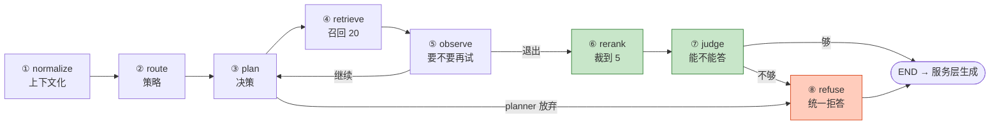
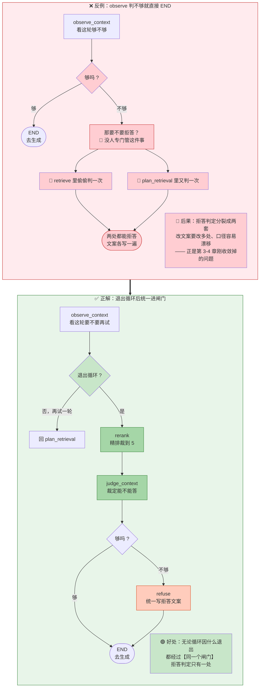
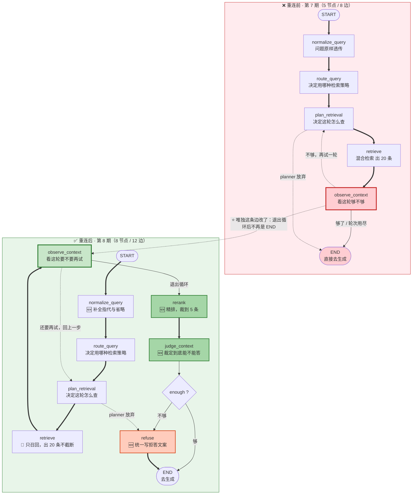

# 06_重连工作流图

> 期：**Day08 · 检索链路优化与答案可信度**
> 章：**教程第 6 章 · 重连工作流图**
> 覆盖：
> - `backend/app/workflows/rag_state.py`（**改动**：新增 `context_is_enough` + 更新注释语义）
> - `backend/app/workflows/graph.py`（**改动**：三个条件函数 + 3 个新节点 + 重连边）
> 记录日期：2026.09.22

---

## 一、直观版流程图（本期全景）

> 对应 `02_当前图流程直观版.png`



**三点记忆锚**：

```
① 循环圈只有一段：  observe → plan → retrieve → observe（最多转 3 轮）
② 所有出口汇到两个终点：  END（去生成） / refuse（统一拒答）
③ 本期新增的只有 3 个节点（图中绿/红）：  rerank / judge_context / refuse
```

---

## 二、本章定位 —— 为什么是"本期最关键的一步"

**前五章造的都是"零件"，但没接进图**：

| 章 | 造了什么 | 接到图里了吗 |
| --- | --- | --- |
| 第 2 章 | `rerank` 节点 | ❌ |
| 第 3 章 | `judge_context` / `refuse` 节点 | ❌ |
| 第 4 章 | `retrieve` / `plan_retrieval` 改造 | ❌（改了行为，但图还是旧的） |
| 第 5 章 | `normalize_query` 改造 | ❌ |

**⚠️ 所以前五章做完，系统处于"半成品"状态**（实测过）：

```
retrieve 出 20 条 → 直接进 prompt（rerank 节点根本没被调用）
且 retrieve 不再判拒答 → 永不拒答
```

**直到本章把边接上，"第 8 期的全部设计"才第一次真正生效。**

| 文件 | 改动 | 行数 |
| --- | --- | --- |
| `app/workflows/rag_state.py` | 新增 1 字段 + 更新 1 处注释 | 80 → **88** |
| `app/workflows/graph.py` | 3 个条件函数 + 3 节点 + 4 边 | 133 → **181** |

---

## 三、`RAGState` 新增字段（`rag_state.py` L72-82）

```python
    # observe_context 判定本轮候选是否足够；True 时图走出循环进入 rerank
    #   【第 8 期语义变化】：此前 True 时图【直接 END】，本期改为【走向 rerank】——
    #   observe 只负责"这一轮还要不要再试"，"到底能不能回答"交给 judge_context 裁定。
    context_sufficient: bool                                                # L75

    # rerank 后基于 Top1 score 的拒答闸门
    #   False 时图走向 refuse 节点；True 时图走向 END。
    #   【与 context_sufficient 的区别】：前者是循环内部节奏（要不要再试），
    #   本字段是对外最终结论（能不能回答）—— 两个字段、两个判定时点。
    context_is_enough: bool                                                 # L81
```

### ⭐ 这是第 3 章埋下、本章收口的那个字段

```
第 3 章写完 judge_context 时，它就在写 state["context_is_enough"]
但 RAGState 里【没有这个字段】
    → 实测：用当时的 schema 建图跑，输出里没有这个键（被【静默丢弃】）
    → 教程把它安排在第 6 章（重连图之前的第 1 步）

第 6 章补上字段 → 它才能真的进入状态
```

**⭐ 这演示了一条**顺序原则**：

```
正确顺序：先加字段（本章第 1 步）→ 再接图
错误顺序：先接图 → 字段被丢弃 → 条件边永远读到 None → 功能静默失效
```

**⚠️ 记录一次"提前又被回退"的过程**：实现第 3 章时我**一度把该字段提前加进了 `RAGState`**，
理由是"节点要写它、不声明会被丢弃会误导验证"；**随后按用户要求回退**，改为严格遵循教程章节顺序。
**回退后验证**：`context_is_enough` 已不在 `RAGState`，`judge_context` 的 7 个场景**仍全部通过**（因为它不依赖 schema）。

---

## 四、三个条件函数 —— 本章的核心

### 4.1 `_after_plan`（`graph.py` L63-78，改动 1 行）

```python
def _after_plan(state: RAGState) -> str:                                    # L63
    """planner 决策为 refuse 时直接走 refuse 节点统一拒答文案，跳过后续检索 / 精排。

    【第 8 期变化】：此前这里返回 "end"（直接结束图），本期改为返回 "refuse" ——
    文案不再由 plan_retrieval 自己写，而是交给专门的 refuse 节点，实现"拒答出口唯一"。
    """
    if state.get("agent_steps"):
        last_action = state["agent_steps"][-1].get("action")
        if last_action == "refuse":
            return "refuse"                                                 # L76
    return "retrieve"                                                       # L78
```

**⭐ 一个字的改动，意义完全不同**：

```
改前：planner 说放弃 → 直接 END（图结束，answer 由 plan_retrieval 写）
改后：planner 说放弃 → 走 refuse 节点 → refuse 写 answer → END
```

**这正是第 3-4 章"拒答动作收敛到一处"在本章的落地。**

### 4.2 ⭐⭐ `_after_observe`（L81-105，改动 3 行，**本章最重要的设计**）

```python
def _after_observe(state: RAGState) -> str:                                 # L81
    """observe 后决定继续循环还是结束循环交给 rerank 精排。

    退出循环条件（任一即停）：
    - 关闭了 agent loop（退化为单轮）
    - 本轮已足够（context_sufficient=True）
    - 达到 agent_max_rounds 上限

    【⭐ 退出循环后统一进 rerank，不再直接 END】：
    哪怕本轮 sufficient=False，也走完 rerank → judge_context，
    让 judge_context 一处统一把关拒答闸门。
    否则"这一轮不够"与"最终不够"会变成两套判定，口径容易漂移。
    """
    if not settings.agent_loop_enabled:
        return "rerank"                                                     # L96（原 "end"）
    if state.get("context_sufficient"):
        return "rerank"                                                     # L99（原 "end"）
    if state.get("retrieval_round", 0) >= settings.agent_max_rounds:
        return "rerank"                                                     # L103（原 "end"）
    return "plan"                                                           # L105
```

#### ⭐⭐ 为什么三个出口都改成 `rerank`

> 对应 `04_退出循环为何要进闸门.png`



**用一句大白话总结**：

```
observe 只回答「还要不要再找一次」
judge_context 才回答「找到的东西够不够拿去回答」

❌ 反例的毛病 = 让 observe 兼管第二件事
✅ 正解的做法 = 第二件事交给专门的人（judge_context）+ 专门的出口（refuse）
```

**⚠️ 一个容易被忽略的细节**：即使 `sufficient=False` 且轮次用尽，**也照样走精排** ——
因为"不够"只是**循环层面**的结论，**最终是否拒答要等精排后的分数说话**。

### 4.3 `_after_judge`（L108-112，新增）

```python
def _after_judge(state: RAGState) -> str:                                   # L108
    """judge_context 后的最终闸门：上下文足够 → END；不足 → refuse 节点。"""
    if state.get("context_is_enough"):
        return "end"                                                        # L111
    return "refuse"
```

**极简** —— 判定逻辑全在 `judge_context` 节点里，条件函数只负责**路由**。

**⚠️ 注意"字段缺失"也走 `refuse`**：

```python
    if state.get("context_is_enough"):     # 缺失 → None → falsy
        return "end"
    return "refuse"                        # → 走拒答
```

**这是"保守兜底"**：拿不到裁定结果时，**宁可拒答也不瞎答** ——
与第 3 章 `judge_context` 分支③（两种分数都没有 → 判不足）**同一保守倾向**。

---

## 五、`_build_graph` 的重连（L115-172）

### 5.1 新增三个节点（L131-133）

```python
    builder.add_node("rerank", rerank)                                      # L131
    builder.add_node("judge_context", judge_context)                         # L132
    builder.add_node("refuse", refuse)                                       # L133
```

### 5.2 边的新增与改动

```python
    # 普通边（新增 1 条）
    builder.add_edge("rerank", "judge_context")                             # L141

    # 条件边一（改 path_map：end → refuse）
    builder.add_conditional_edges(                                          # L146
        "plan_retrieval", _after_plan,
        {"retrieve": "retrieve", "refuse": "refuse"},                       # L148（原 "end": END）
    )

    # 条件边二（改 path_map：end → rerank）
    builder.add_conditional_edges(                                          # L154
        "observe_context", _after_observe,
        {"plan": "plan_retrieval", "rerank": "rerank"},                     # L156（原 "end": END）
    )

    # 条件边三（新增）
    builder.add_conditional_edges(                                          # L162
        "judge_context", _after_judge,
        {"end": END, "refuse": "refuse"},                                   # L164
    )

    # 普通边（新增 1 条：refuse 是终点前最后一步）
    builder.add_edge("refuse", END)                                         # L168
```

### 5.3 ⭐ 重连前后对照

> 对应 `03_重连前后图结构对照.png`



**每个节点在干什么（对照表）**：

| 节点 | 干什么 | 期次变化 |
| --- | --- | --- |
| `normalize_query` | **把问题补完整** —— "它怎么配" → "API Key 怎么配" | 🆕 第 8 期起读历史改写 |
| `route_query` | **决定用哪种检索策略** —— 原样 / 改写 / 假设答案 / 多路子查询 | 第 5 期就有；本期起基于改写后的词 |
| `plan_retrieval` | **决定这一轮怎么查**（首轮沿用上游，后续轮由 LLM 决策） | 第 7 期就有 |
| `retrieve` | **去知识库捞候选** —— 向量 + 全文，融合后出 20 条 | 🔧 本期起**只召回、不截断、不拒答** |
| `observe_context` | **看这一轮的货够不够**（只判"要不要再试"） | 语义收窄 |
| `rerank` | **精排重新排序** —— 对 20 条逐个打分，裁到最相关的 5 条 | 🆕 本期新增 |
| `judge_context` | **裁定到底能不能回答** —— 看第 1 名的精排分过不过线 | 🆕 本期新增 |
| `refuse` | **统一写拒答文案**（所有拒答路径都汇到这） | 🆕 本期新增 |

---

## 六、详细版流程图（8 节点 / 12 边）

> 对应 `01_当前图流程详解.png`

```mermaid
flowchart TD
    S(["START"])

    S ==> NQ["① normalize_query<br/>----<br/>多轮上下文化<br/>读 chat_history → 消解指代<br/>产出 query<br/>🔸无历史则透传，不调 LLM"]

    NQ ==> RQ["② route_query<br/>----<br/>策略路由（基于 query）<br/>original / rewrite / hyde / multi_query"]

    RQ ==> PR["③ plan_retrieval<br/>----<br/>本轮决策<br/>首轮不调 LLM（沿用上游）<br/>后续轮调 AgentPlanner"]

    PR --> CP{"▷ _after_plan<br/>agent_steps 末条 action"}
    CP -- "refuse" --> RF
    CP -- "otherwise" --> RT

    RT["④ retrieve<br/>----<br/>混合检索（向量 + 全文 + RRF）<br/>⭐ 召回口径放大到 20 条<br/>🔸不截断、不判拒答"]

    RT ==> OC["⑤ observe_context<br/>----<br/>看 Top1 的 vector_score ≥ 0.6 ?<br/>retrieval_round 自增<br/>回填观察字段"]

    OC --> CO{"▷ _after_observe<br/>三个退出条件"}
    CO -- "① 关开关 / ② 已足够 / ③ 轮次用尽<br/>→ rerank" --> RK
    CO -- "④ 都不满足<br/>→ 回决策节点" --> PR

    RK["⑥ rerank<br/>----<br/>qwen3-rerank 成对打分<br/>对 20 条打分后<br/>⭐ 裁到 5 条（retrieval_top_k）<br/>🔸rerank_score 严格降序"]

    RK ==> JC["⑦ judge_context<br/>----<br/>纯规则裁定<br/>Top1 的 rerank_score ≥ 0.3 ?<br/>🔸无精排分则回退比 vector_score ≥ 0.6<br/>产出 context_is_enough"]

    JC --> CJ{"▷ _after_judge<br/>最终闸门"}
    CJ -- "context_is_enough" --> E(["END"])
    CJ -- "不足 / 字段缺失" --> RF

    RF["⑧ refuse<br/>----<br/>统一拒答出口<br/>写 refused=True + REFUSAL_ANSWER"]

    RF ==> E

    E --> GEN["服务层（图外）<br/>⑨ generate 流式生成<br/>注入精排后的 5 条上下文"]
    GEN --> VER["服务层（图外）<br/>⑩ AnswerVerifier 校验（第 7 章待实现）<br/>校验失败 → 覆盖为拒答文案"]
    VER --> OUT(["服务层（图外）<br/>⑪ 落库 + 下发 SSE"])

    style S fill:#e8eaf6
    style NQ fill:#c8e6c9
    style RQ fill:#e8eaf6
    style PR fill:#ffe0b2
    style RT fill:#c8e6c9
    style OC fill:#e8eaf6
    style RK fill:#c8e6c9,stroke:#2e7d32
    style JC fill:#c8e6c9,stroke:#2e7d32
    style RF fill:#ffccbc,stroke:#d84315
    style E fill:#e8eaf6
    style GEN fill:#f3e5f5,stroke:#ba68c8
    style VER fill:#f3e5f5,stroke:#ba68c8
    style OUT fill:#f3e5f5,stroke:#ba68c8
    style CP fill:#ffe0b2
    style CO fill:#ffe0b2
    style CJ fill:#ffe0b2
```



---

## 七、验证结果

### 7.1 拓扑（从编译产物读出）：**8 节点 / 12 条边**

```
节点(8): judge_context, normalize_query, observe_context, plan_retrieval,
         refuse, rerank, retrieve, route_query

__start__         -> normalize_query     [直线]
normalize_query   -> route_query         [直线]
route_query       -> plan_retrieval      [直线]
plan_retrieval    -> retrieve            [条件]
plan_retrieval    -> refuse              [条件]  ← 改
retrieve          -> observe_context     [直线]
observe_context   -> plan_retrieval      [条件]  ← 闭环
observe_context   -> rerank              [条件]  ← 改
rerank            -> judge_context       [直线]  ← 新增
judge_context     -> __end__             [条件]  ← 新增
judge_context     -> refuse              [条件]  ← 新增
refuse            -> __end__             [直线]  ← 新增
```

### 7.2 三个条件函数 **12 个分支全绿**

```
_after_plan:    refuse→refuse ✓ / rewrite→retrieve ✓ / 空→retrieve ✓
_after_observe: sufficient→rerank ✓ / 轮次用尽→rerank ✓ / 未用尽→plan ✓ / 关开关→rerank ✓ / 空状态→plan ✓
_after_judge:   enough=True→end ✓ / False→refuse ✓ / 字段缺失→refuse ✓
```

### 7.3 ⭐ 端到端实测：**8 节点全部生效**

| 问题 | 轮次 | chunks | Top1 rerank | Top1 vector |
| --- | --- | --- | --- | --- |
| `接口怎么认证` | 1 | **5** | 0.3690 | 0.7347 |
| `学分是多少` | **3** | **5** | 0.3508 | 0.5853 |
| `上海天气怎么样` | **3** | **5** | 0.5311 | 0.3787 |
| `B200 的散热设计` | 1 | **5** | 0.7699 | 0.6251 |

**⭐ 三条关键证据**：

```
① chunks 全部 = 5（retrieval_top_k）
   → rerank 节点【真的生效了】：retrieve 出 20 条 → 精排裁到 5

② agent_steps 里「检了=20」
   → retrieve 的【召回口径真的放大了】

③ chunks 的 rerank_score 严格降序
   [0.369, 0.3297, 0.2651, 0.2582, 0.2578]
   → 精排 + 排序真的执行了
```

### 7.4 拒答路径定向验证

```
把 rerank_min_score 抬到 0.6 逼出不足：
  '学分是多少'  context_is_enough=False  refused=True   answer=有
                answer = '抱歉，知识库中没有找到与该问题相关的可靠依据。'   ← refuse 节点写的 ✓
  'B200...'    context_is_enough=True   refused=None   answer=无          ← 走 END ✓

反证：B200 即使阈值抬到 0.7 仍达标（Top1 rerank≈0.77）→ "达标走 END"
```

### 7.5 ⚠️ 一个**标定变化**（不是 bug）

```
同一问题「学分是多少」：
    第 7 期：vector Top1 = 0.5853 < retrieval_min_score(0.6)  → 拒答
    第 8 期：rerank Top1 = 0.3508 > rerank_min_score(0.3)     → 不拒答（去生成）
```

**原因**：**阈值换了量纲、需要重新标定**。

```
rerank_min_score = 0.3 是第 1 章定的"经验值"（探测时"不相关的结果都压在 0.3 以下"）
但真实语料里，有的结果落在 0.35~0.53（不太相关但也不完全无关）
    → 0.3 的门槛【偏松】，会放过一些本该拒答的
```

| 性质 | 说明 |
| --- | --- |
| **逻辑链** | ✅ 完全正确（`retrieve → rerank → judge_context → refuse/END`） |
| **阈值数值** | ⚠️ 需按新量纲重新标定 —— 这是**调参**，不是改代码 |

**另一个观察**：不拒答时 `refused=None`（而非 `False`）—— **没有任何节点写它**。

```
服务层 `if state.get("refused")` → None 是 falsy → 走生成 ✓ 没问题
但若哪里用 `state["refused"] is False` 严格比较就会出错
```

---

## 八、问题解析（五道自测题）

### Q1　`_after_observe` 的三个终止条件为什么都返回 `"rerank"` 而不是 `"end"`？

**答案**：**因为要让拒答判定只有一个闸门**。

```
若 observe 一判不够就 END：
    "这一轮不够"（observe）与"最终不够"（judge）变成两套判定
    → 拒答口径又分裂了（正是第 3-4 章刚收敛掉的问题）

改成统一进 rerank → judge_context：
    无论循环因何退出（关开关 / 已足够 / 轮次用尽），都经过【同一个闸门】
    拒答判定只有一处
```

**一句话**：

```
observe 只回答「还要不要再找一次」
judge_context 才回答「找到的东西够不够拿去回答」

❌ 让 observe 兼管第二件事 = 判定分裂
```

### Q2　`context_sufficient` 与 `context_is_enough` 分别由谁写、各表示什么？

**答案**：

| 字段 | 谁写 | 表示 | 属于 |
| --- | --- | --- | --- |
| `context_sufficient` | `observe_context` | **这一轮还要不要再试** | **循环内部节奏** |
| `context_is_enough` | `judge_context` | **到底能不能回答**（最终拒答依据） | **对外结论** |

**为什么必须两个字段**：

```
循环可能"再试几轮"仍不达标 → 两者的判定时点与语义都不同
    observe 在循环中间反复判（每轮都判）
    judge 只在退出循环后判一次
```

### Q3　为什么 `context_is_enough` 必须在本章**第 1 步**加进 `RAGState`？

**答案**：**因为 LangGraph 只保留已在 schema 中声明的键，未声明的键会被静默丢弃**。

```
若先接图、后加字段：
    接图后 judge_context 写的 context_is_enough 会被丢掉
    → _after_judge 永远读到 None → 永远走 refuse（静默失效）

实测证据（第 3 章做过的实验）：
    用当时没有该字段的 RAGState 建图跑 judge_context
    → 输出键里没有 context_is_enough   ← 被丢弃
```

**所以顺序是：先扩展状态契约 → 再接图。**

### Q4　`_after_judge` 里字段缺失会走哪条路？这个行为是刻意的吗？

**答案**：**走 `refuse`（拒答）**，且**是刻意的保守兜底**。

```python
    if state.get("context_is_enough"):     # 缺失 → None → falsy
        return "end"
    return "refuse"                        # → 走拒答
```

**⭐ 判定逻辑**：

```
拿不到裁定结果 = 不知道"能不能回答"
    → 宁可拒答，也不瞎答
```

**这与第 3 章 `judge_context` 分支③（两种分数都没有 → 判不足）是同一保守倾向。**

### Q5　`'学分是多少'` 三轮都 `sufficient=False`，但最终 `context_is_enough=True`。矛盾吗？

**答案**：**不矛盾** —— 因为两者判的**不是同一件事**。

```
observe_context 判的是：这轮的 vector_score（0.5244 / 0.5478 / 0.5853 都 < 0.6）
    → 结论：语义相似度不够，再试一轮

judge_context 判的是：精排后的 rerank_score（Top1 = 0.3508）
    → 用【另一把尺子】量同一批候选 → 结论：够（> 0.3）
```

**⭐ 关键理解**：

```
两个判据量纲不同（余弦相似度 vs 精排成对相关性）
    → 完全可能"向量看着不够、精排看着够"

而且"循环放弃了" ≠ "最终拒答"：
    轮次用尽只是【循环层面的止损】，不代表"证据不足"
    最终还是让精排后的分数说话
```

**⚠️ 这也正是 Q2 那张"标定变化"的由来**：换尺子后，拒答率会变化。

---

## 九、当前状态

```
✅ 教程第 1-6 章 全部完成（本期主体已跑通）
────────────────────────────────────────────────────────────
⬜ 教程第 7 章  AnswerVerifier 答案校验器（verify prompt + 实现）
⬜ 教程第 8 章  ChatService 集成 verify + 把 rerank_score 加进检索元数据
```

**教程原话（本章末）**：

> 图重连完毕，但方案设计里的答案校验还没做。这一步**不能放在 LangGraph 图里**，
> 因为**要等流式结束才能拿到完整答案**，所以放在 **service 层**。

---

## 十、一句话总结

> 本章把前五章造的"零件"**接进图**，是本期最关键的一步 —— 在此之前系统处于半成品状态
> （`retrieve` 出 20 条直接进 prompt、且永不拒答，因为 `rerank` / `judge_context` / `refuse` 都没接上）；
> 改动只有两处文件：`RAGState` **先补上 `context_is_enough` 字段**（第 3 章埋下、本章收口；
> **必须先加字段再接图** —— 否则该键会被 LangGraph **静默丢弃**，`_after_judge` 永远读到 `None`），
> 以及 `graph.py` 的**三个条件函数 + 3 个新节点 + 4 条边**；
> 其中最核心的设计是 **`_after_observe` 的三个终止条件全部从 `"end"` 改成 `"rerank"`** ——
> **哪怕本轮 `sufficient=False` 也走完 `rerank → judge_context`**，让拒答判定只有**一个闸门**，
> 否则"这一轮不够"（observe）与"最终不够"（judge）会变成**两套口径**，正是第 3-4 章刚收敛掉的问题；
> 一句话：**`observe` 只回答「还要不要再找一次」，`judge_context` 才回答「够不够拿去回答」**；
> `_after_plan` 则从 `"end"` 改成 `"refuse"`，让 planner 放弃时也走统一拒答出口；
> `_after_judge` 新增，且**字段缺失时也走 `refuse`**（保守兜底：拿不到裁定就宁可拒答）；
> **实测验证**：拓扑 8 节点 12 边全对、三个条件函数 **12 个分支全绿**、
> **端到端 4 个问题全部跑通 8 节点**（`chunks` 全部 = 5 证明精排真的在裁、`agent_steps` 的"检了=20"证明召回口径真放大了、
> `rerank_score` 严格降序证明精排排序真的执行了），拒答路径定向验证确认 **`refuse` 节点真的被走到**；
> 并记录一个**标定观察**（不是 bug）：换尺子后拒答率会变（同一问题第 7 期拒答、第 8 期不拒答），
> 因为 `rerank_min_score = 0.3` 这个经验值按新量纲**偏松**，需要重新标定。

---

## 十一、关联文件索引

| 文件 | 关键位置 | 说明 |
| --- | --- | --- |
| **`app/workflows/rag_state.py`** | **L75** | **`context_sufficient: bool`（注释 L72 已更新语义）** |
| **`app/workflows/rag_state.py`** | **L81** | **`context_is_enough: bool`（注释 L77-80）** |
| `app/workflows/rag_state.py` | L84 | `answer: str` |
| **`app/workflows/graph.py`** | **L1-40** | **模块 docstring（图的边界 / 三个条件边 / 为什么退出循环要进 rerank）** |
| `app/workflows/graph.py` | L47-54 | 导入 8 个节点（L48 `judge_context` / L52 `refuse` / L53 `rerank`） |
| **`app/workflows/graph.py`** | **L63-78** | **`_after_plan`（L76 `return "refuse"` / L78 `return "retrieve"`）** |
| **`app/workflows/graph.py`** | **L81-105** | **`_after_observe`（L96 / L99 / L103 三处 `return "rerank"`；L105 `return "plan"`）** |
| **`app/workflows/graph.py`** | **L108-112** | **`_after_judge`（L111 `return "end"`，否则 `refuse`）** |
| **`app/workflows/graph.py`** | **L115-172** | **`_build_graph`** |
| `app/workflows/graph.py` | L121 | `builder = StateGraph(RAGState)` |
| `app/workflows/graph.py` | L131-133 | 三个新节点注册 |
| `app/workflows/graph.py` | L141 | `add_edge("rerank", "judge_context")` |
| `app/workflows/graph.py` | L146-148 | 条件边一 + path_map（`refuse`） |
| `app/workflows/graph.py` | L154-156 | 条件边二 + path_map（`rerank`） |
| `app/workflows/graph.py` | L162-164 | 条件边三 + path_map（`judge`） |
| `app/workflows/graph.py` | L168 | `add_edge("refuse", END)` |
| `app/workflows/graph.py` | L172 / L176 / L179 | `compile()` / `_rag_graph` / `get_rag_graph` |
| `app/core/config.py` | L139 / L163 / L202 / L179 | `retrieval_top_k=5` / `retrieval_recall_top_k=20` / `rerank_min_score=0.3` / `agent_max_rounds=3` |
| `app/workflows/nodes/judge_context.py` | L76 | `return {"context_is_enough": is_enough}`（写本字段的唯一来源） |
| `app/workflows/nodes/refuse.py` | L39 | `return {"refused": True, "answer": REFUSAL_ANSWER}` |
| `app/workflows/nodes/rerank.py` | L47 | `return {"retrieved_chunks": reranked[:retrieval_top_k]}` |
| `app/workflows/nodes/observe_context.py` | L65-66 | 写 `retrieval_round` / `context_sufficient`（`_after_observe` 读它们） |
| 图（本轮产出） | — | `01_当前图流程详解.png` / `02_当前图流程直观版.png` / `03_重连前后图结构对照.png` / `04_退出循环为何要进闸门.png` |
