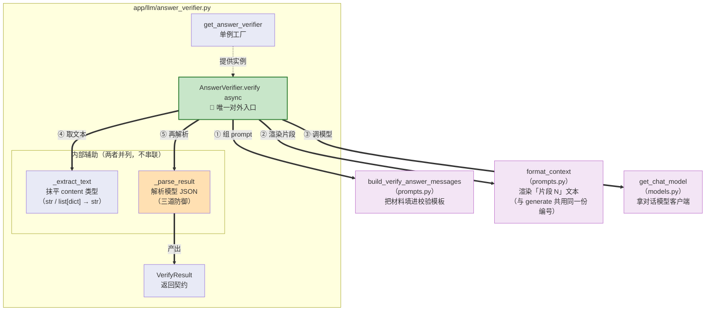
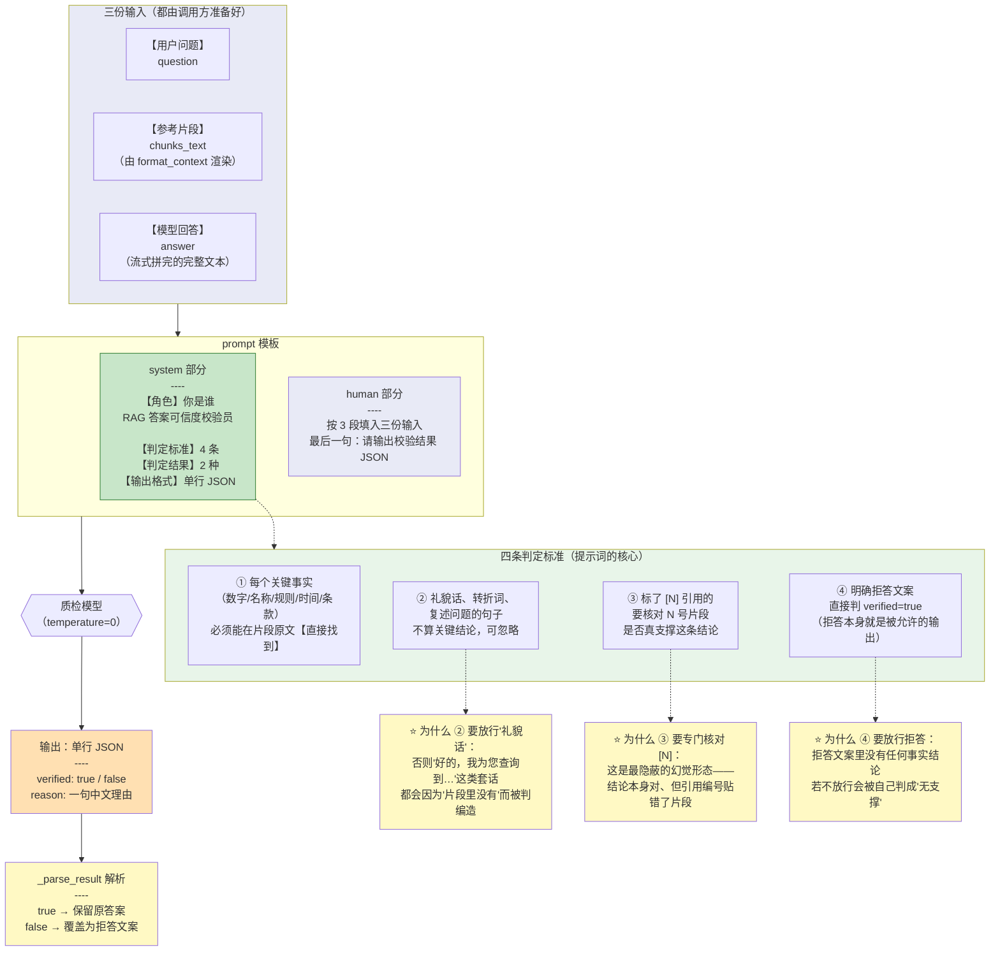
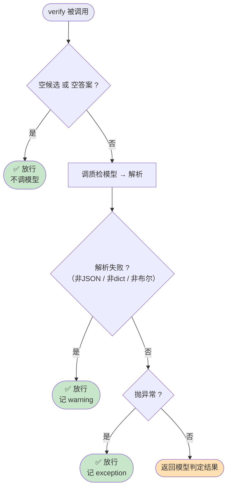

# 07_答案可信度校验器

> 期：**Day08 · 检索链路优化与答案可信度**
> 章：**教程第 7 章 · `AnswerVerifier` 答案校验器**
> 覆盖：
> - `backend/app/llm/prompts.py`（**改动**：新增 verify prompt）
> - `backend/app/llm/answer_verifier.py`（**新建**）
> 记录日期：2026.09.22

---

## 一、本章定位

**教程第 7 章包含两个子项**：

```
7、AnswerVerifier 答案校验器
    ├ verify prompt          ← prompts.py
    └ AnswerVerifier 实现    ← answer_verifier.py（新建）
```

**本章解决的问题**：精排解决了"召回的 chunk 排序不够准"，**但即便送进去的上下文是对的，LLM 生成时也可能编造**（数字说错、引用张冠李戴）。

| 文件 | 改动 | 行数 |
| --- | --- | --- |
| `app/llm/prompts.py` | 新增 4 项（2 常量 + 1 模板 + 1 构造函数） | 404 → **460** |
| `app/llm/answer_verifier.py` | **新建** | **192** |

**⚠️ `format_context` 直接复用**（`prompts.py` **L75** 已有，第 4 期就在用）——
这是**关键**：它让校验员看到的「片段 N」编号与回答里 `[N]` 引用的编号**严格一致**。

---

## 二、图 1：`AnswerVerifier` 模块函数作用图

> 对应 `01_AnswerVerifier模块函数作用图.png`



**读图方式 —— 这张图就是 `verify` 的 5 步**：

```
① 组 prompt → ② 渲染片段 → ③ 调模型 → ④ 取文本 → ⑤ 解析 → 产出 VerifyResult
```

**⭐ 注意 `_extract_text` 与 `_parse_result` 是【并列】的，不是串联**：

```python
    raw = _extract_text(response.content).strip()   # 先取文本（④）
    return _parse_result(raw)                       # 再解析文本（⑤）
```

### 五个部件一览

| 部件 | 类型 | 干什么 |
| --- | --- | --- |
| **`AnswerVerifier.verify`** | async 方法 | **唯一对外入口**，串起 5 步 |
| `_parse_result` | 内部函数 | 把模型返回的文本**解析成 `VerifyResult`**（三道防御） |
| `_extract_text` | 内部函数 | 抹平 langchain `content` 类型差异 |
| `VerifyResult` | `@dataclass(frozen=True)` | **返回契约**：`verified` + `reason` |
| `get_answer_verifier` | 工厂 | **惰性单例** |

### 三个外部依赖

| 函数 | 一句话作用 |
| --- | --- |
| `build_verify_answer_messages` | 把「问题 + 片段 + 回答」**填进校验模板**，产出 `messages` |
| `format_context` | 把检索切片渲染成**「片段 N」文本**（**与 `generate` 共用同一份编号**） |
| `get_chat_model` | **取对话模型客户端**（单例，已统一 `temperature=0`） |

**⚠️ 为什么 `format_context` 必须复用**：

```
若 verify 自己另写一套渲染：
    回答里写"根据片段 3"，而 verify 眼里的"片段 3"是另一条
    → 会误判成"引用张冠李戴"，把正确回答错杀
```

---

## 三、图 2：`verify` prompt 在干什么

> 对应 `02_verify提示词作用图.png`



### ⭐ 四条判定标准，每条都在**堵一个具体的漏洞**

| # | 标准 | **如果不写**会怎样 |
| --- | --- | --- |
| ① | 关键事实必须能**直接找到** | 模型会用预训练知识"合理推断"（从"600 元"推出"大约 600-800 元"），而这**不是原文说的** |
| ② | **礼貌话可忽略** | "好的，我为您查到…"这些片段里当然没有 → **全部误判成编造** |
| ③ | 核对 `[N]` **引用编号** | 结论对、但**引用贴错了片段** —— 最难发现的幻觉形态 |
| ④ | **拒答文案直接通过** | 拒答里没有事实结论 → 按标准① 会被判"无支撑" → **拒答被自己的校验器否掉** |

**⭐ 第 ④ 条最容易漏**：

```
拒答文案："抱歉，知识库中没有找到…"
    按标准① 逐字核对 → 片段里当然没有这句话
    → 会被判 verified=false
    → 而 verify=false 的处理是【覆盖为拒答文案】
    → 结果：白费一次调用 + 一个不必要的事件

所以必须显式声明："拒答本身就是被允许的输出"
```

### ⚠️ `{{ }}` 双大括号（ChatPromptTemplate 的坑）

```python
示例：{{"verified": false, "reason": "..."}}
       ↑↑ 双大括号 = 转义
```

**为什么**：

```
ChatPromptTemplate 把 {xxx} 当【变量占位符】
    若写单个 { → 会被当成变量名
    → invoke 时报 KeyError: 'Input to ChatPromptTemplate is missing variables'

写成 {{ }} → 渲染后输出单个 { }
```

**⭐ 这个坑第 7 期就踩过**（`_AGENT_PLAN_SYSTEM` 里也有同样的 `{{ }}`），
**实测确认：单括号在 `from_messages()` 时能编译通过，但 `invoke()` 时才抛错。**

---

## 四、`AnswerVerifier` 的实现要点

### 4.1 `verify` 的四层防护（**本模块的精髓**）



**⭐ 四个出口里，三个都是"放行"**：

| 出口 | 触发 | 处理 |
| --- | --- | --- |
| ① 空候选 / 空答案 | 上游已截断 | **放行**，且**不调模型**（省一次调用） |
| ② 解析失败 | JSON 脏 / 结构不对 / 非布尔 | **放行** + warning |
| ③ 调用抛异常 | 网络抖动 / 模型 5xx | **放行** + exception |
| ④ 正常 | — | 返回模型判定 |

### 4.2 ⭐⭐ 核心容错哲学：**反直觉的"假定通过"（Fail-Open）**

```python
        except Exception:
            logger.exception("answer verifier 调用失败，降级 verified=True: ...")
            return VerifyResult(verified=True, reason="verifier_exception")
```

**⚠️ 与项目其它模块完全相反**：

| 模块 | 失败时降级方向 |
| --- | --- |
| `QueryRewriter` | 回**原问题**（更保守，不改写） |
| `AgentPlanner` | 回 `proceed`（更保守，不乱动） |
| `Reranker` | 回**不重排**（更保守） |
| **`AnswerVerifier`** | **`verified=True`（更宽松，放行）** |

**教程原话**：

> 校验器属于"品质防御加分项"，而非"阻断性硬依赖"；
> 若校验器自身崩溃就将回答硬性改判为拒答，
> 会导致"外部质检抖动拖垮整个原本正确的问答服务"。
>
> **工程设计铁律：校验机制本身的偶发失败，绝不能比被校验主链路的失败更具破坏性。**

### 4.3 ⭐⭐ `_parse_result` 的三道防御

| 防御 | 防什么 | 失败后 |
| --- | --- | --- |
| ① 清 Markdown 围栏（L142） | 模型习惯性包 ` ```json ... ``` ` | 继续解析 |
| ② JSON 反序列化（L153-154） | 输出残缺 JSON / 夹杂废话 | **放行** `verifier_parse_failed` |
| ③ **严格布尔校验**（L171） | 模型返回 `"true"` / `1` 等非布尔 | **放行** `verifier_invalid_verified` |

#### ⚠️ 第 ③ 道是**致命逻辑陷阱**

```python
    if not isinstance(verified_raw, bool):     # ✅ 严格白名单
    # if verified_raw:                          # ❌ 致命反向 Bug
```

**为什么不能用真值判断**：

```
模型返回 {"verified": "false"}    ← 字符串
    "false" 是非空字符串 → Python 真值判断为 True
    → 把【校验不通过】误判成【校验通过】   ← 方向性错误！
```

**实测证实**（见 §5.2）：`{"verified":"false"}` → 走 `verifier_invalid_verified`（放行），
**而不会**被误判成"通过后继续用 false 的逻辑"。

### 4.4 关键行号

| 位置 | 说明 |
| --- | --- |
| L63 | `async def verify` |
| L82 | 空输入短路 |
| L91 / L94 | `build_verify_answer_messages` / `format_context` |
| L102-106 | `ainvoke` → `_extract_text` → `_parse_result` |
| L107-113 | except 降级 |
| L122 | `get_answer_verifier` |
| L130 | `_parse_result` |
| L142 / L153-154 / L171 | 三道防御 |
| L182 | `_extract_text` |

---

## 五、验证结果

### 5.1 prompt 编译

```
VERIFY_ANSWER_PROMPT 变量: ['answer', 'chunks_text', 'question']   ✓
组装 2 条消息 ✓
```

### 5.2 `_parse_result` 防御：**12/12 通过**

| 用例 | 期望 | 实测 |
| --- | --- | --- |
| 正常 `true` | `True` / `""` | ✓ |
| 正常 `false` | `False` / `"金额不符"` | ✓ |
| 带 ` ```json ` 包裹 | 正确解析 | ✓ |
| 带 ` ``` ` 包裹 | 正确解析 | ✓ |
| 非 JSON | `True` / `verifier_parse_failed` | ✓ |
| JSON 是数组 | `True` / `verifier_parse_failed` | ✓ |
| `verified` 缺失 | `True` / `verifier_invalid_verified` | ✓ |
| **`verified` 是字符串 `"true"`** | **`True` / `verifier_invalid_verified`** | ✓ **不认字符串** |
| **`verified` 是字符串 `"false"`** | **`True` / `verifier_invalid_verified`** | ✓ **没被误判成通过** |
| **`verified` 是数字 `1`** | **`True` / `verifier_invalid_verified`** | ✓ **不认数字** |
| `reason` 缺失 | `False` / `""` | ✓ |
| `reason` 为 `null` | `False` / `""` | ✓ |

### 5.3 空输入短路（不调模型）

```
无候选   -> verified=True  reason=''   ✓
空答案   -> verified=True  reason=''   ✓
（用抛异常的桩模型验证：确实没被调用）
```

### 5.4 模型异常降级

```
verified=True  reason='verifier_exception'   ✓ 降级为放行（方向正确）
```

### 5.5 ⭐ **真实校验调用：三种场景判定全对**

| 场景 | 答案 | 判定 | 模型给出的理由 |
| --- | --- | --- | --- |
| **支撑**（数字一致） | "一线城市住宿每晚 600 元。" | **`True`** | "与片段1原文完全一致" |
| **编造**（数字不符） | "一线城市住宿每晚 **800** 元。" | **`False`** | "答案称 **800** 元，但片段 1 明确写为 **600** 元" |
| 拒答文案 | "抱歉，知识库中没有找到…" | `True` | 拒答是被允许的输出 |

**⭐ 第 2 条正是本期要解决的问题**：

```
模型把 600 说成 800（典型的"数字幻觉"）
    → AnswerVerifier 精确抓出，且给出了具体理由
    → 这就是"答案可信度"的兑现
```

### 5.6 单例与契约

```
get_answer_verifier() is 同实例: True   ✓
VerifyResult 是 frozen: True            ✓
```

---

## 六、本章结论

| # | 结论 |
| --- | --- |
| **①** | **`AnswerVerifier` 是"加分项"而非"硬依赖"** —— 因此它的降级方向与项目其它模块**完全相反**（失败一律**放行**） |
| **②** | **`verified` 必须严格是布尔值** —— 用真值判断会把字符串 `"false"` 误判成"通过"，属**方向性致命 Bug** |
| **③** | **四条判定标准各堵一个漏洞** —— 尤其第 ④ 条（放行拒答）最易漏：否则拒答会被自己的校验器否掉 |
| **④** | **必须复用 `format_context`** —— 保证校验员看到的「片段 N」编号与回答里 `[N]` 引用严格对齐，否则会错杀正确回答 |
| **⑤** | **校验必须等流式结束** —— 因此它**不能放进 LangGraph 图**，只能留在服务层（教程本章末明确说了这点） |

---

## 七、当前状态

```
✅ 教程第 1-7 章 全部完成
────────────────────────────────────────────────────────────
⬜ 教程第 8 章  ChatService 集成 verify
    ├ 把 rerank_score 加进检索元数据
    ├ verify_result 载荷构造
    ├ stream_answer 主流程
    └ _persist_assistant_message 写…
```

**教程原话（本章末）**：

> `AnswerVerifier` 作为独立模块写好了，下面把它接进 **`ChatService` 的 `stream_answer` 主流程**。
> **这是本期改动最大的一个地方**，要在**流式 token 跑完后执行校验**，
> 校验失败就**替换成拒答文案**，最后把结果随 SSE 推给前端、**随消息落库**。

**⚠️ 第 8 章的一个已知风险点**：

```
第 7 期那个 answer 残留 bug 的修法是"两个分支都写 answer"
现在 retrieve 已经不写了、改由 refuse 写
    → 接入 verify 时要注意【覆盖 answer 的时机】
    → 校验失败要覆盖成拒答文案，不能与 refuse 节点的写入冲突
```

---

## 八、一句话总结

> 本章新增 **`AnswerVerifier`**（192 行）—— 一个"专职质检员"：生成完答案后，
> 让模型**只做一件事**（审查，不给任何发挥空间），逐条核对回答里的关键结论能否在参考片段里**直接找到**；
> 立项理由是教程那句 **"让一个 AI 做的事情越多，出现幻觉的概率就越高"** ——
> `generate` 的 prompt 要同时管语义理解、文风、润色、格式、引用，任务太重；verify 把它拆出来独立审查；
> 它的**四条判定标准各堵一个漏洞**：① 关键事实必须直接找到（堵泛化脑补）、② 礼貌话可忽略（堵过度严格）、
> ③ 核对 `[N]` 引用（堵引用张冠李戴 —— 最隐蔽的幻觉形态）、④ **放行拒答文案**（否则拒答会被自己的校验器否掉）；
> **两个最值得记住的设计**：
> **① 反直觉的 Fail-Open 降级** —— 任何异常一律 `verified=True`（**放行**），与项目其它模块"失败即更保守"完全相反，
> 因为校验器是**加分项而非硬依赖**，**"校验机制自身的偶发失败，绝不能比被校验主链路的失败更具破坏性"**；
> **② `verified` 必须严格 `isinstance(..., bool)`** —— 用真值判断会让字符串 `"false"`（非空 → True）
> 把"校验不通过"**误判成"通过"**，是**方向性致命 Bug**；
> 并**复用 `format_context`** 保证「片段 N」编号与回答里 `[N]` 严格对齐（否则会错杀正确回答）；
> **实测验证**：`_parse_result` **12/12 通过**（含 `"true"` / `"false"` / `1` 三种非布尔全部正确拦下）、
> 空输入短路不调模型、异常降级方向正确、
> 而**真实校验调用效果很好** —— "600 元"判通过、"800 元"判不通过且理由精确到"片段 1 明确写为 600 元"、
> 拒答文案正确放行；**这是"答案可信度"的最终兑现**。

---

## 九、关联文件索引

| 文件 | 关键位置 | 说明 |
| --- | --- | --- |
| **`app/llm/prompts.py`** | **L408** | **verify 段标题** |
| **`app/llm/prompts.py`** | **L411** | **`_VERIFY_ANSWER_SYSTEM`（角色 + 四条判定标准 + 两种结果 + 输出格式）** |
| **`app/llm/prompts.py`** | **L426** | **`_VERIFY_ANSWER_HUMAN`（三段：问题 / 片段 / 回答）** |
| **`app/llm/prompts.py`** | **L437** | **`VERIFY_ANSWER_PROMPT`** |
| **`app/llm/prompts.py`** | **L442** | **`build_verify_answer_messages`** |
| `app/llm/prompts.py` | **L75** | **`format_context`（第 4 期就有，本章复用）** |
| **`app/llm/answer_verifier.py`** | **L1-26** | **模块 docstring（职责 / 为什么要独立校验 / Fail-Open 哲学）** |
| `app/llm/answer_verifier.py` | L28 / L30 | `from dataclasses import dataclass` / `import json` |
| `app/llm/answer_verifier.py` | **L48-57** | **`@dataclass(frozen=True) class VerifyResult`（L56 `verified` / L57 `reason`）** |
| `app/llm/answer_verifier.py` | **L60** | **`class AnswerVerifier`** |
| **`app/llm/answer_verifier.py`** | **L63-113** | **`async def verify`** |
| `app/llm/answer_verifier.py` | L82 | 空候选 / 空答案短路 |
| `app/llm/answer_verifier.py` | L91-95 | 组 prompt（含 `format_context` L94） |
| `app/llm/answer_verifier.py` | L102-106 | `ainvoke` / `_extract_text` / `_parse_result` |
| `app/llm/answer_verifier.py` | **L107-113** | **except 降级 `verified=True`** |
| `app/llm/answer_verifier.py` | L119-125 | `_verifier` 单例 / `get_answer_verifier` |
| **`app/llm/answer_verifier.py`** | **L130-179** | **`_parse_result`（L142 防御1 / L153-154 防御2 / L159 非 dict / L165 取值 / L171 防御3 / L178 reason）** |
| `app/llm/answer_verifier.py` | **L182-192** | **`_extract_text`（L188 str 分支 / L192 list 分支）** |
| `app/llm/models.py` | — | `get_chat_model`（外部依赖） |
| `app/retrieval/vector_retriever.py` | L31 | `RetrievedChunk`（`verify` 的入参类型） |
| `app/services/chat_service.py` | — | 第 8 章要接入的地方 |
