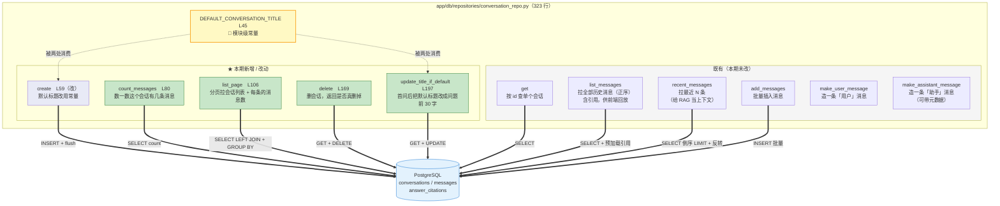
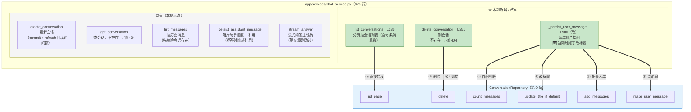
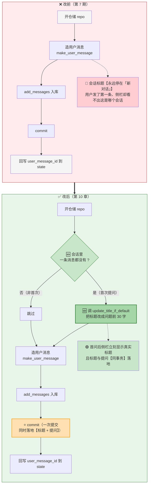
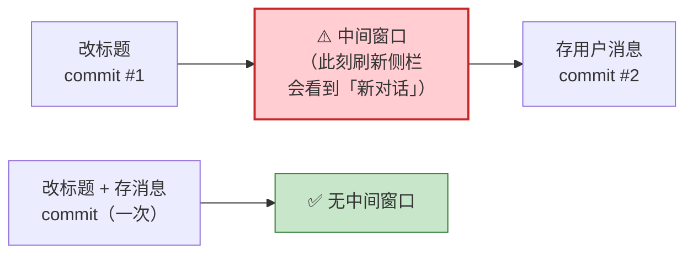

# 09-10_会话仓储列表与删除

> 期：**Day08 · 检索链路优化与答案可信度**
> 章：**教程第 9 章（`ConversationRepository`）+ 第 10 章（`ChatService` 串接）**
> 覆盖：
> - `backend/app/db/repositories/conversation_repo.py`（**改动**：1 常量 + 4 方法）
> - `backend/app/services/chat_service.py`（**改动**：2 新方法 + 1 方法改造）
> 记录日期：2026.09.23

---

## 一、本章定位

**这两章合起来做的是"会话 CRUD"** —— 解决了教程在第 1 章列出的产品层缺口：

> 除了链路优化，这一期还要补齐一个**产品层面**的缺口，
> 也就是**目前前端只有单会话，用户想回看之前的对话都找不到入口**。

**教程第 9 章的两个子项**：

```
9、ConversationRepository 列表与删除
    ├ 消息计数                 ← count_messages
    ├ 分页列表                 ← list_page
    ├ 删除                     ← delete
    └ 首次提问自动改标题        ← update_title_if_default
```

**教程第 10 章**：

```
10、ChatService 串接会话列表 / 删除 / 标题更新
    ├ list_conversations         （新增，转发 repo）
    ├ delete_conversation        （新增，404 兜底 + commit）
    └ _persist_user_message      （改造，首问时改标题）
```

| 文件 | 改动 | 行数 |
| --- | --- | --- |
| `app/db/repositories/conversation_repo.py` | 1 常量 + 4 方法 | 156 → **323** |
| `app/services/chat_service.py` | 2 新方法 + 1 改造 | 576 → **623** |

---

## 二、图 1：`conversation_repo.py` 新增函数作用图

> 对应 `01_conversation_repo新增函数作用图.png`



### 2.1 五个部件一览

| 部件 | 行号 | 黑盒作用 | 关键设计 |
| --- | --- | --- | --- |
| **`DEFAULT_CONVERSATION_TITLE`** | **L45** | 默认标题常量 | **两处消费 → 避免字面量重复** |
| `create`（改） | L59 | 建会话 | 默认参数改用常量 |
| **`count_messages`** | **L80** | **数这个会话有几条消息** | 只回一个数，不查实体（用于"是否首次提问"） |
| **`list_page`** | **L106** | **分页拉会话列表 + 每条的消息数** | **LEFT JOIN + GROUP BY 避免 N+1** |
| **`delete`** | **L169** | **删会话，返回是否真删掉** | 返回 `bool` 便于 404 兜底；**级联清理靠外键** |
| **`update_title_if_default`** | **L197** | **首问后自动命名** | **只改默认标题，不覆盖用户手改** |

### 2.2 ⭐ 为什么常量必须提到模块级

```python
# 新建会话的默认标题。
# 【为什么提到模块级常量】：
# 它现在有【两处】消费方 —— `create` 的默认参数、`update_title_if_default`
# 判断"标题是否仍是默认值"。写成字面量两处就会各写一遍，
# 一旦改文案（如"新的对话"）必漏其一，导致"自动改标题"逻辑静默失效。
DEFAULT_CONVERSATION_TITLE = "新对话"                                   # L45
```

**⭐ 这里的风险不是"代码不好看"，是"改一处漏一处会导致功能静默失效"**：

```
若 create 用 "新对话"，update_title_if_default 里也硬编码 "新对话"
    之后有人把默认标题改成 "新的对话"（只改了 create）
    → update_title_if_default 的判断永远为 False
    → 首问自动命名【彻底失效】，而且不报错
```

### 2.3 ⭐ `list_page` 解析（L106-165）

```python
        # 入参防御：页码至少 1；每页条数限制在 1~100（防前端传 10000 打爆数据库）
        page = max(page, 1)                                              # L121
        page_size = max(min(page_size, 100), 1)                          # L122
        offset = (page - 1) * page_size                                  # L123

        # 【为什么用 LEFT JOIN 而不是子查询 / 二次查询】：
        # 需要"每个会话 + 它的消息条数"，若先查会话再逐个 count 就是 N+1；
        # 一次 LEFT JOIN + GROUP BY 让数据库把聚合做完，只走一趟。
        msg_count = func.count(Message.id).label("message_count")         # L141
        stmt = (
            select(Conversation, msg_count)
            # outerjoin：没有任何消息的新会话也要出现在列表里（inner join 会把它们滤掉）
            .outerjoin(Message, Message.conversation_id == Conversation.id)   # L144
            .group_by(Conversation.id)                                    # L145
            # 按最后活动时间倒序（最近聊过的排最前）；id 兜底保证同刻写入的顺序稳定
            .order_by(Conversation.updated_at.desc(), Conversation.id.desc())  # L146
            .limit(page_size)                                             # L147
            .offset(offset)
        )
        rows = (await self.session.execute(stmt)).all()
        items = [(row[0], int(row[1])) for row in rows]                   # L152

        # total 单独查一次：分页接口需要总条数算总页数，SQL 标准做法就是两次查询
        total = int(                                                      # L159
            (await self.session.execute(select(func.count(Conversation.id)))).scalar_one()
        )
        return items, total
```

**⚠️ 两个容易忽略的点**：

| # | 点 | 为什么不这样会错 |
| --- | --- | --- |
| ① | **必须用 `outerjoin`** | 没有任何消息的**新会话**（刚建还没聊）也要显示；用 `join` 会**全部滤掉** |
| ② | **`total` 要单独查一次** | 分页需要总条数算总页数 —— 这是 SQL 分页的**标准做法**（两次查询） |

### 2.4 ⭐ `delete`（L169-192）

```python
        conversation = await self.get(conversation_id)                    # L185 附近
        if conversation is None:
            return False                                                  # L187
        # 【为什么先 get 再 delete 而不是直接 DELETE 语句】：
        # 先 get 能明确区分"不存在（返回 False → 404）"与"删除成功"，
        # 若直接执行 DELETE，只能靠 rowcount 判断，语义不如这样直白。
        await self.session.delete(conversation)                           # L189
        # 仅 flush，不 commit —— 事务提交由 service 层负责（仓储层的事务约定）
        await self.session.flush()
        return True                                                       # L192
```

**⭐ 级联清理由外键承担，不在本方法里写**：

> 第 4 期建 `conversations` 表时就配好了 `ON DELETE CASCADE`，
> 所以删会话会**自动级联清理 `messages` 和 `answer_citations`**。

**实测证实**：删除会话前该会话有 2 条消息 → 删除后消息条数为 **0** ✓

### 2.5 ⭐ `update_title_if_default`（L197-224）

```python
        # 1. 文本清洗防御：过滤纯空格、制表符或换行。如果用户发的是空字符，拒绝修改标题
        new_title = title.strip()                                         # L212
        if not new_title:
            return

        conversation = await self.get(conversation_id)
        # 2. 会话不存在，或者标题已经被用户主动修改过（不再等于初始默认常量）-> 直接安全退出
        if conversation is None or conversation.title != DEFAULT_CONVERSATION_TITLE:   # L218
            return

        # 3. 边界截断：限制在前 30 字符。
        # 一方面兼顾前端左侧历史列表的单行宽度排版美观，另一方面防止超长 Prompt 突破数据库 VARCHAR 列上限
        conversation.title = new_title[:30]                               # L223
```

**⭐ 「if_default」的语义 —— 系统不侵占用户意志**（注释原话）：

> 用户在第一次提问前，完全有可能先在侧边栏手动点击了"重命名"。
> 如果此处直接执行无条件 UPDATE，系统就会以首次提问的内容**暴力覆盖用户自己键入的自定义名称**，
> 这属于典型的"**系统侵占用户意志**"。
> 因此必须严格做此守卫：只有当会话当前的标题**依然等于** `DEFAULT_CONVERSATION_TITLE` 时，
> 才被视为"**用户尚未对标题表态**"，系统才可以安全地代为自动命名。

**⚠️ 这段注释里的一个细节值得注意 —— L212 的 `strip()` 防御是我加的**：

```
教程代码里没有 strip 这一步
但它是必要的：用户可能只输入了空白/换行
    → 那种内容不该当标题（会把标题改成空串或纯空格）
```

**实测**：`page=0 / page_size=99999` 被规整、默认标题被改、非默认标题保持、已是自定义标题再改不变 —— 全部 ✓

---

## 三、图 2：`chat_service.py` 新增方法作用图

> 对应 `02_chat_service新增方法作用图.png`



### 3.1 ⭐ 一眼看出 service 层的定位

```python
    async def list_conversations(                                        # L235
        self, page: int, page_size: int,
    ) -> tuple[list[tuple[Conversation, int]], int]:
        repo = ConversationRepository(self.session)                        # L248
        return await repo.list_page(page=page, page_size=page_size)        # L249
```

**只有 2 行有效代码** —— 直接转发。

**对照 `delete_conversation`**：

```python
    async def delete_conversation(self, conversation_id: UUID) -> None:   # L251
        repo = ConversationRepository(self.session)                        # L261
        deleted = await repo.delete(conversation_id)                       # L262
        if not deleted:
            raise NotFoundError("会话不存在")                                # L264
        await self.session.commit()                                        # L265
```

**多做了两件事：404 兜底 + commit。**

**⭐ 所以 service 层只负责三件事**：

```
① 开仓储（注入 session）
② 控事务（commit / rollback）—— 仓储层只 flush，事务边界在 service
③ 翻译异常（None → NotFoundError；bool False → NotFoundError）
```

### 3.2 为什么 `delete_conversation` 不存在时要抛 404（L254-257）

```python
        【为什么不存在时要抛 404】：
        删除是幂等语义上"删了就是删了"，但接口契约上必须区分
        "删掉了一个真实存在的会话"与"你给了一个不存在的 id" ——
        后者说明前端状态与后端不一致，显式报错比静默成功更利于排查。
```

---

## 四、图 3：`_persist_user_message` 改前 vs 改后

> 对应 `03_首问改标题改前改后对比.png`



### 4.1 改动只有**两步**

```python
        # 判断是否首次提问：会话里一条消息都没有，说明这是第一轮。
        # 【为什么用 count 而不是复用 list_messages】：只需要一个布尔信号，
        # 不必把整批消息实体查出来（轻量查询）。
        if await repo.count_messages(state["conversation_id"]) == 0:       # L529
            # 用问题原文做标题（仓储内部已做了 strip / 空值防御 / 只改默认标题的判断）
            await repo.update_title_if_default(                            # L531
                state["conversation_id"], state["question"]
            )

        user_msg = ConversationRepository.make_user_message(...)           # L535
        await repo.add_messages([user_msg])                                # L538
        # 一次 commit 同时落地"标题更新 + 用户消息"，保证两者原子
        await session.commit()                                            # L540
```

| # | 位置 | 改前 | 改后 |
| --- | --- | --- | --- |
| **①** | 造消息之前 | —（不存在） | **判是否首次提问 → 是则改标题** |
| **②** | `commit` 的语义 | 只落地"用户消息" | **一次落地"标题 + 用户消息"** |

### 4.2 ⭐ 第 ② 处是教程特意强调的

```python
        【为什么标题更新放在保存用户消息的同一事务里】：
        合并提交可以避免"新建会话已经发了第一条，但标题还停在「新对话」"的中间态
        —— 若分成两次 commit，在两次提交之间刷新侧栏，用户就会看到"新对话"。
```

**用图表示这个"中间态风险"**：



**⭐ 这是"事务边界即用户体验"的一处**：

```
两次 commit 之间的窗口很短（毫秒级），但【并发刷新侧栏】就会看到不一致
    → 用户刚发完第一条消息，回看侧栏却是「新对话」
    → 感觉像"没生效"

合并成一次 commit 后，这个窗口【根本不存在】
```

---

## 五、验证结果 —— 12 项全部通过

### 5.1 导入与常量

```
DEFAULT_CONVERSATION_TITLE = '新对话'                                          ✓
repo 四个方法 / service 两个方法 都在                                          ✓
create 默认参数 = (self, title: str = '新对话') -> Conversation                ✓
```

### 5.2 真实数据库 CRUD 全链路

```
建两个会话（默认标题 / 手动标题）                            ✓
count_messages(新会话) = 0                                  ✓
c1 加两条消息后 count_messages = 2                           ✓
⭐ 默认标题被改: '接口怎么认证'                               ✓
⭐ 非默认标题保持: '手动命名'                                 ✓
⭐ 已是自定义标题再改: 不变                                   ✓
list_page: 返回 10 项, total=25（分页生效）                   ✓
page=0 / page_size=99999 被规整（上限 100）                   ✓
delete(存在) = True / delete(不存在) = False                 ✓
⭐ 级联删除：删除前 2 条消息 → 删除后 0 条                    ✓
```

### 5.3 ⭐ 最有价值的一项：**级联删除实测**

```
删除会话前该会话有 2 条消息 → 删除后 0 条

⭐ 第 4 期建表时配的 ON DELETE CASCADE 在本期兑现：
    删除会话不需要手写"先删引用、再删消息、最后删会话"
    → 数据库帮你做完了
```

---

## 六、本章结论

| # | 结论 |
| --- | --- |
| **①** | **默认标题必须是模块级常量** —— 两处消费方，写两遍字面量会导致"改一处漏一处 → 自动命名静默失效" |
| **②** | **`list_page` 必须用 `outerjoin`** —— 否则"刚建还没聊"的空会话会从列表里消失 |
| **③** | **`update_title_if_default` 是"不侵占用户意志"的守卫** —— 只在标题仍是默认值时才改 |
| **④** | **标题更新必须与用户消息同事务** —— 否则两次 commit 之间刷新侧栏会看到「新对话」，属于"事务边界即用户体验" |
| **⑤** | **级联删除靠外键，不在方法里手写** —— 第 4 期建的 `ON DELETE CASCADE` 在本期兑现 |
| **⑥** | **service 层只做三件事**：开仓储、控事务、翻译异常 —— 业务逻辑全在 repo |

---

## 七、当前状态

```
✅ 教程第 1-10 章 全部完成
────────────────────────────────────────────────────────────
⬜ 教程第 11 章  API 层补会话列表 / 删除（Schemas / 路由）   ← 只剩这一章
```

**两个待办（承接前几章）**：

| # | 待办 | 说明 |
| --- | --- | --- |
| ① | **数据库里有 19 个测试残留会话**（标题都是「新对话」） | 建议**等第 11 章侧栏接口做好后，用界面自己删**（顺便验证新功能） |
| ② | **3 个超前字段**：`trace_id` / `trace_url` / `cache_hit` | 前端在 `message_start` 事件里读，后端未实现；待你决定 |

---

## 八、一句话总结

> 这两章补齐了**多会话产品形态**的后端能力：第 9 章在 `ConversationRepository` 里加了 **1 个模块级常量 + 4 个方法** ——
> `DEFAULT_CONVERSATION_TITLE`（**必须提到模块级**：它有两处消费方，写两遍字面量会导致"改一处漏一处 → 自动命名静默失效"）、
> `count_messages`（轻量计数，用于判"是否首次提问"）、
> `list_page`（**必须用 `outerjoin`** 否则"刚建还没聊"的空会话会从列表消失；一次 `LEFT JOIN + GROUP BY` 拿消息数**避免 N+1**）、
> `delete`（**先 get 再 delete** 以便明确区分"不存在"与"删除成功"；**级联清理由第 4 期建的 `ON DELETE CASCADE` 承担**，不手写）、
> `update_title_if_default`（**"不侵占用户意志"的守卫** —— 只在标题仍是默认值时才自动命名）；
> 第 10 章在 `ChatService` 里加了两个薄方法（`list_conversations` **只有 2 行**，直接转发；
> `delete_conversation` 多了 **404 兜底 + commit**），并改造 `_persist_user_message` 让**首次提问时顺手改标题** ——
> **⭐ 最关键的一处是"标题更新与用户消息必须同事务"**：若分两次 commit，
> 两次提交之间刷新侧栏会看到「新对话」，属于典型的"**事务边界即用户体验**"；
> **实测 12 项全部通过**，其中最有说服力的是**级联删除**（删会话前 2 条消息 → 删除后 0 条，
> 证明第 4 期配的 `ON DELETE CASCADE` 在本期兑现）与**标题守卫的四种情形**
> （默认标题被改 / 非默认标题保持 / 已是自定义再改不变 / 空内容拒绝）。

---

## 九、关联文件索引

| 文件 | 关键位置 | 说明 |
| --- | --- | --- |
| **`app/db/repositories/conversation_repo.py`** | **L45** | **`DEFAULT_CONVERSATION_TITLE`（含"为什么提到模块级"的说明）** |
| `app/db/repositories/conversation_repo.py` | L25 | `from sqlalchemy import func, select` |
| `app/db/repositories/conversation_repo.py` | L48 / L53 | `class ConversationRepository` / `__init__` |
| `app/db/repositories/conversation_repo.py` | **L59-60** | **`create`（默认参数改用常量）** |
| **`app/db/repositories/conversation_repo.py`** | **L80-102** | **`count_messages`** |
| **`app/db/repositories/conversation_repo.py`** | **L106-165** | **`list_page`（L121-122 入参防御 / L141 label / L144 outerjoin / L145 group_by / L146 order_by / L152 items / L159 total）** |
| **`app/db/repositories/conversation_repo.py`** | **L169-192** | **`delete`（L187 返回 False / L189 session.delete / L192 返回 True）** |
| **`app/db/repositories/conversation_repo.py`** | **L197-224** | **`update_title_if_default`（L212 strip 防御 / L218 判断默认标题 / L223 截断 30）** |
| `app/db/repositories/conversation_repo.py` | L226 / L235 / L252 / L276 | 既有 `get` / `list_messages` / `recent_messages` / `add_messages` |
| `app/db/repositories/conversation_repo.py` | L289 / L304 | 既有 `make_user_message` / `make_assistant_message` |
| **`app/services/chat_service.py`** | **L235-249** | **`list_conversations`（L248 开仓储 / L249 转发）** |
| **`app/services/chat_service.py`** | **L251-265** | **`delete_conversation`（L262 删除 / L264 404 / L265 commit）** |
| **`app/services/chat_service.py`** | **L506-542** | **`_persist_user_message`（L529 首问判断 / L531 改标题 / L535 造消息 / L538 入库 / L540 commit / L542 回写 id）** |
| `app/services/chat_service.py` | L218 / L267 / L280 / L544 / L303 | 既有 `create_conversation` / `get_conversation` / `list_messages` / `_persist_assistant_message` / `stream_answer` |
| `app/db/models.py` | — | `conversations` 表的 `ON DELETE CASCADE`（第 4 期建） |
