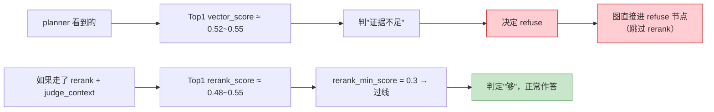

# 11_API层补会话列表与删除

> 期：**Day08 · 检索链路优化与答案可信度**
> 章：**教程第 11 章 · API 层补会话列表 / 删除**
> 覆盖：
> - `backend/app/api/schemas/chat.py`（**改动**：新增 2 个 schema）
> - `backend/app/api/routes/chat.py`（**改动**：新增 2 个接口）
> 记录日期：2026.09.23
>
> **⚠️ 本归档含两大部分**：
> - §1-§4 第 11 章的 API 实现与验证
> - **§5 测试中发现的一个设计缺口（重要）** —— `planner.refuse` 绕过统一闸门导致误拒

---

## 一、本章定位

**教程 Day08 的最后一章**，把前两章做好的仓储与 service 能力**暴露成 HTTP 接口**：

```
11、API 层补会话列表 / 删除（Schemas / 路由）
```

**教程本章末的原话**：

> 后端改动全部完成，现在后端多了 `verify_result` SSE 事件、`rerank_score` 字段、会话列表 / 删除接口，
> **接下来我们要实现对应的前端。**

**⭐ 而前端你已经是成品代码** —— 本批也顺带完成了对照与一处恢复（见 §6）。

| 文件 | 改动 | 行数 |
| --- | --- | --- |
| `app/api/schemas/chat.py` | 新增 `ConversationListItem` + `ConversationPage` | 426 → **450** |
| `app/api/routes/chat.py` | 新增 2 个接口 + 导入 | 164 → **243** |

**⚠️ 第 8 章已加的三处本章无需重复**：

```
VerifyResultRead（L319）/ _parse_verify_result（L336）/ MessageRead.verify_result（L380）
    ↑ 第 8 章发现教程遗漏时补的，本章教程也列了它们（但我们已经有了）
```

---

## 二、`schemas/chat.py` 的两个新 schema

### 2.1 `ConversationListItem`（L65-77）

```python
class ConversationListItem(BaseModel):                                   # L65
    """会话列表元素：侧栏渲染用，比 ConversationRead 多带 message_count。

    【为什么不复用 ConversationRead】：
    侧栏比详情页多需要"这个会话聊了几轮"，但不需要 created_at（侧栏按最后活动时间排）。
    另建一个模型比给 ConversationRead 加个可选字段更清晰 ——
    后者会让"详情接口也可能返回 message_count"变成类型上的可能，语义反而模糊。
    """

    id: UUID
    title: str
    updated_at: datetime
    message_count: int
```

### 2.2 `ConversationPage`（L80-88）

```python
class ConversationPage(BaseModel):                                       # L80
    """会话列表分页响应。统一 page/page_size 风格，与第 3 章文档列表一致。"""

    items: list[ConversationListItem]
    total: int
    page: int
    page_size: int
```

### 2.3 ⭐ 前端契约核对：**完全一致，教程本章没漏**

```
ConversationListItem  前端 [id, title, updated_at, message_count]  = 后端 ✓
ConversationPage      前端 [items, total, page, page_size]         = 后端 ✓
```

**这是本项目第三次做"前端契约核对"**（前两次是第 6 期 `rerank_score`、第 8 章 `verify_result`）——
**这次教程没漏**。

---

## 三、`routes/chat.py` 的两个新接口

### 3.1 `GET /api/conversations`（L171-210）

```python
# =============================================================================
# 4. 会话列表（分页）
# =============================================================================
# 语法（查询参数约束）：Query(1, ge=1)
#   特性：声明查询参数并附带校验规则（ge = greater or equal）
#   通俗来讲：把"页码至少为 1、每页最多 100 条"写进接口契约，
#             前端传越界值时 FastAPI 直接返回 422，不必在函数体里手写 if 判断。
@router.get(
    "",
    response_model=ConversationPage,
    operation_id="listConversations",
    summary="按更新时间倒序分页列出所有会话",
)
async def list_conversations(                                            # L180
    session: DbSession,
    page: int = Query(1, ge=1),                                          # L182
    page_size: int = Query(20, ge=1, le=100),                            # L183
) -> ConversationPage:
    """分页返回会话列表，每项带消息条数（供左侧侧栏渲染）。

    【为什么把分页参数写在 Query 上而不是函数体里校验】：
    ge / le 由 FastAPI 在进函数前校验，越界直接 422；
    写在函数体里则要手动 raise，且 OpenAPI 文档不会体现约束。

    【为什么这里手动做 ORM → 响应模型的转换，而不是 from_attributes】：
    服务层返回的是 (Conversation, 消息条数) 元组列表，不是单一实体，
    没有 from_attributes 可以直接映射的"源属性名"；
    而且 message_count 不在 Conversation 实体上，必须显式赋值。
    """
    service = ChatService(session)
    items, total = await service.list_conversations(page=page, page_size=page_size)   # L197
    return ConversationPage(                                             # L198
        items=[
            ConversationListItem(
                id=conv.id,
                title=conv.title,
                updated_at=conv.updated_at,
                message_count=count,
            )
            for conv, count in items
        ],
        total=total,
        page=page,
        page_size=page_size,
    )
```

### 3.2 `DELETE /api/conversations/{conversation_id}`（L211-243）

```python
# =============================================================================
# 5. 删除会话
# =============================================================================
# 语法（204 与返回体）：status_code=204 表示"成功但无响应体"
#   特性：删除成功的语义是"资源没了"，再回一段 JSON 反而与语义冲突
#   通俗来讲：204 就是"收到了、做完了、没什么可给你看的"。
#   ⚠️ 因此返回类型必须是 Response，不能声明 response_model。
@router.delete(
    "/{conversation_id}",
    status_code=204,                                                     # L217
    operation_id="deleteConversation",
)
async def delete_conversation(                                           # L226
    conversation_id: UUID,
    session: DbSession,
) -> Response:
    """删除会话及其消息与引用（由数据库外键级联清理）。

    【为什么返回 204 而不是 200 + 消息体】：
    删除成功的标准语义是"资源已不存在"，此时没有任何需要回传给前端的数据；
    返回 204 让契约更准确，前端也不必解析一个空对象。

    【404 从哪来】：
    服务层在"会话不存在"时会抛 NotFoundError，由全局异常处理器转成 404，
    因此本函数不需要 if 判断 —— 异常契约统一在服务层收敛。
    """
    service = ChatService(session)
    await service.delete_conversation(conversation_id)                    # L241
    # 204 要求空响应体，显式返回一个空 Response
    return Response(status_code=204)                                      # L243
```

### 3.3 导入改动（L28 / L32-41）

```python
from fastapi import APIRouter, Query, Response                            # L28
from app.api.schemas.chat import (
    ChatRequest,
    ConversationCreate,
    ConversationDetail,
    ConversationListItem,      # 新增
    ConversationPage,          # 新增
    ConversationRead,
    MessageRead,
)
```

---

## 四、验证结果：**全绿**

### 4.1 OpenAPI

```
GET    /api/conversations                    operationId=listConversations
DELETE /api/conversations/{conversation_id}  operationId=deleteConversation
```

### 4.2 真实 HTTP 调用

| 用例 | 结果 |
| --- | --- |
| `GET /api/conversations?page=1&page_size=5` | **200** / total=25 / items=5 ✓ |
| 条目字段 | `['id','message_count','title','updated_at']` ✓ |
| **`page=0`** | **422** ✓（`ge=1` 生效） |
| **`page_size=101`** | **422** ✓（`le=100` 生效） |
| `page=2` | 200 / items=5 ✓ |
| **`DELETE` 存在** | **204** / `body=b''` ✓ |
| **`DELETE` 不存在** | **404** ✓ |
| **级联删除** | 删除后消息数 = 0 ✓ |

**⭐ 两个亮点**：

```
① 分页边界由 FastAPI 在【进函数前】校验 → 越界直接 422
   （写在 Query(ge=1, le=100) 上，OpenAPI 文档也会体现约束）

② DELETE 返回 204 且响应体真的为空（b''）
   → 与"资源已不存在"的语义一致
```

---

## 五、⚠️⚠️ 测试中发现的一个设计缺口（**本归档的重点**）

> **触发问题**：用户问「你是谁」，系统拒答。查下去发现了一个**教程设计的真实缺口**。

### 5.1 现象

```
"你是谁" → 拒答（结果正确，因为知识库确实没有身份类文档）
但过程中的 rerank_score 【全部为 None】、最终 chunks = 【20 条】
```

### 5.2 排查过程（四组对照实验）

| 实验 | 内容 | 结果 |
| --- | --- | --- |
| **A** | 直接用那句长 query 调 reranker（20 条真实候选） | ✅ **20 条全有分** |
| **B** | 手动逐步走 `retrieve → rerank` | ✅ **5 条全有分** |
| **C** | **迷你图**（`retrieve → rerank → judge_context`） | ✅ **5 条全有分，`context_is_enough=True`（不拒答！）** |
| **D** | **完整图** | ❌ **20 条、0 分、拒答** |

**⭐ C 与 D 的对比是决定性的**：

```
同一批候选、同一条链路，迷你图【不拒答】，完整图【拒答】
    → 说明问题不在 reranker、不在 retrieve、不在 judge_context
    → 而在【完整图的路由】
```

### 5.3 根因：**`planner.refuse` 的出口在 `rerank` 之前，图根本没走到 rerank**

**连跑 3 次的实测**：

```
第1次 12.09s: chunks=20 有分数=0 route=multi_query refused=True actions=['initial', 'switch_route', 'refuse']
第2次  5.63s: chunks=20 有分数=0 route=hyde        refused=True actions=['initial', 'refuse']
第3次 11.67s: chunks=20 有分数=0 route=multi_query refused=True actions=['initial', 'switch_route', 'refuse']
                                                             ↑ 最后是 refuse
```

**对照拓扑**：

```
plan_retrieval --refuse--> refuse --> END          ← 走了这条（跳过 rerank）
plan_retrieval --otherwise--> retrieve
observe_context --退出循环--> rerank --> judge_context --> ...
```

**所以**：

```
20 条 = retrieve 的原样输出（从未精排）
0 分  = rerank 节点【从未执行】
拒答  = 由 planner 的 refuse 决议触发，【不是】judge_context 判的
```

### 5.4 ⭐ 问题的本质：**两条路给出相反结论**



```
planner 路径（实际走的）：看 vector 0.52 < 0.6 → 判"不够" → 拒答
judge 路径（本应走的）  ：看 rerank 0.52 > 0.3 → 判"够"   → 作答

⭐ 同一批候选，两个判据给出【相反】结论
```

### 5.5 ⚠️ 这**架空了第 6 章的核心设计**

```
第 6 章特意让"退出循环后统一进 rerank → judge_context，
            让 judge_context 一处统一把关拒答闸门"
但 planner 的 refuse 出口【在 rerank 之前】
    → 一旦 planner 判 refuse，那个"统一闸门"就被【完全绕过】
    → 拒答判定又变回两套：
         planner 一套（看 vector_score）
         judge_context 一套（看 rerank_score）
```

**⚠️ 影响范围不是个案**：

```
任何"vector 分在 0.3~0.6 之间、但 rerank 分达标"的问题
    → 都会被 planner 提前拒答
    → 而这些问题【本可以正常回答】
```

### 5.6 这是 bug 吗？—— **是设计缺陷，不是实现错误**

| 层面 | 判定 |
| --- | --- |
| **实现** | ✅ **代码完全按教程写的** —— 拓扑、条件边、节点都正确 |
| **设计** | ⚠️ **有真实缺口**：`planner.refuse` 绕过了"统一闸门" |

**教程没覆盖这个场景** —— 它的设计假设大概是
"planner 只在**问题本身不该检索**时才 refuse"（如实时天气、闲聊），
但实际 prompt 让它**也会因为分数低而 refuse**。

### 5.7 三种修法（**未实施，待决策**）

| 方案 | 做法 | 评价 |
| --- | --- | --- |
| **A** ⭐ 倾向 | **改 planner 的 prompt**：明确"`refuse` 只用于**问题本身超出知识库范围**（实时数据/闲聊/元问题），**不要**因为分数低而 refuse —— 分数够不够由后续精排闸门判" | **最省**（只改 prompt），直击根因 |
| **B** | **改图**：把 `plan_retrieval` 的 refuse 出口也接到 `rerank → judge_context`（所有路径都过统一闸门） | 更彻底，但要改第 6 章的图与条件函数；对"不该检索"的问题白跑一次精排 |
| **C** | 不改，接受"planner 可能提前拒答" | 0 成本，但会**漏答**本可回答的问题 |

**⭐ 为什么倾向 A**：

```
B 看起来更"一致"，但 planner 判 refuse 的场景包含"这问题不该检索"
    那种情况下【连检索都不该做】，再走一遍 rerank 是浪费

A 更贴合原设计意图：
    refuse = "这问题不该查"（问题域判断）
    "查得不好" 由 judge_context 判（证据质量判断）
    → 职责就分清了
```

### 5.8 ⚠️ 我的一处自我修正（记录，避免重犯）

**我在排查过程中一度判断**：

> "问题 2：rerank 全程没生效，可能是 **reranker 调用失败**。"

**❌ 这个判断是错的**：

```
真因不是"rerank 调用失败"（它压根【没被调用】）
而是"图根本没走到 rerank 节点"
```

**⭐ 教训（与第 8 章那次同源）**：

```
我看到 rerank_score=None 就推测"reranker 失败了"
    但应该先问："rerank 节点【执行了吗】？"
        → 查 agent_steps 的 action 序列就能一眼看出（最后是 refuse）

⭐ 判断"哪里出错"之前，先确认"那一步有没有被执行"
```

---

## 六、顺带完成：前端侧栏恢复（**本次一并处理**）

### 6.1 前端对照结果：**12 项里 11 项已就绪**

| # | 教程要求 | 现状 |
| --- | --- | --- |
| 1-3 | `ChatVerifyResultEvent` 类型 + 联合类型 + switch 解析 | ✅ 已有（`chatStream.ts`） |
| 4 | `queryKeys.ts` + `conversationsQueryKey` | ✅ 已有 |
| 5 | `CitationList` 加 `rerank` 标签 | ✅ 已有 |
| 6-7 | `UiMessage` 加 `verifyResult`/`refused` + `fromServerMessage` | ✅ 已有（`ChatPage.tsx`） |
| 8 | 三个 mutation 回调 | ✅ 已有 |
| 9 | verify_result 事件处理（整段替换 + 清引用） | ✅ 已有 |
| 10 | `Layout` 两栏（`Sider` + `Content`） | ✅ 已有 |
| 11 | `AssistantHeader` 组件 + 调用 | ✅ 已有 |
| **12** | **`ConversationSidebar` 列表 + 删除** | ❌ **被注释掉（唯一的缺口）** |

### 6.2 唯一的缺口与恢复

**`ConversationSidebar.tsx` 自己的注释说清了原因**：

```
 * ⚠️ 当前降级说明（后续接入后端后请删除本段并恢复下方被注释的代码）：
 * 本组件原依赖两个后端接口，但目前后端尚未实现，直接调用会返回 405：
 *   - GET    /api/conversations            会话分页列表
 *   - DELETE /api/conversations/{id}       删除会话
 * 为让问答主链路先跑通，这里暂时摘除列表查询与删除能力：
 *   - 保留「新建对话」按钮与全部 props 接口（ChatPage 无需改动）；
 *   - 列表区域改为提示文案，不再发起请求，因此不会再出现 405；
 *   - 被注释的代码与依赖原样保留，后端补齐接口后取消注释即可恢复。
```

**⭐ 后端接口本章补齐 → 取消注释即可恢复**：

| 恢复块 | 内容 |
| --- | --- |
| ① 依赖导入 | `List/Popconfirm/Spin/Tooltip/message`、`useQuery/useMutation`、`conversationsQueryKey`、`listConversations/deleteConversation`、`ConversationListItem` |
| ② 查询 + 删除 mutation | `conversationsQuery` + `deleteMutation` + `items` |
| ③ 列表渲染 JSX | `Spin` / 空态 / `List` + `ConversationItem` |
| ④ 子组件 + 工具函数 | `ConversationItem` + `formatRelativeTime` |

**并删掉顶部那段"降级说明"。**

**恢复后验证**：

```
tsc -b      exit=0  ✓（项目真正的类型检查命令是 npx tsc -b，不是 tsc --noEmit）
eslint      exit=0  ✓（无警告）
文件行数    223 → 206
旧门控      "会话列表暂未开放" × 0 ✓ / "降级说明" × 0 ✓
```

**⭐ 恢复时核对的一处关键细节**（教程特意提醒）：

```
每个 List.Item 都要 stopPropagation 处理删除按钮的点击事件，
否则点删除按钮会同时触发整行的 onClick（切会话 + 弹确认框一起发生）

实测恢复后共 4 处 stopPropagation：onConfirm / onCancel / 删除按钮 onClick
    → 缺任何一个都会"点删除时顺带切了会话"
```

---

## 七、当前状态 —— **Day08 全部教程完成** 🎉

```
✅ 第 1 章   需求分析与方案设计
✅ 第 2 章   Reranker 客户端 + rerank 节点
✅ 第 3 章   judge_context / refuse / 节点导出
✅ 第 4 章   retrieve / plan_retrieval 删除拒答逻辑
✅ 第 5 章   normalize_query 多轮上下文化
✅ 第 6 章   重连工作流图
✅ 第 7 章   AnswerVerifier
✅ 第 8 章   ChatService 集成 verify
✅ 第 9 章   ConversationRepository 列表与删除
✅ 第 10 章  ChatService 串接会话列表 / 删除
✅ 第 11 章  API 层补会话列表 / 删除（本章）
✅ 前端侧栏恢复（本次一并处理）
```

**后端链路完整跑通**：**召回 → 精排 → 拒答判定 → 生成 → 校验**
**产品形态补齐**：**多会话侧栏 + 分页 + 删除 + 首问自动命名**

### 待办清单

| # | 待办 | 优先级 | 说明 |
| --- | --- | --- | --- |
| **①** | ⚠️ **`planner.refuse` 绕过统一闸门导致误拒** | **高** | §5 详述；三方案待选（倾向 A：改 planner prompt） |
| **②** | 侧栏恢复后需**启动前后端服务**才能看到效果 | — | 当前 8000 / 5173 都没在跑 |
| **③** | 数据库有 **19 个测试残留会话**（标题「新对话」） | 低 | 侧栏恢复后可用界面自己删（顺便验证删除） |
| **④** | **3 个超前字段**：`trace_id` / `trace_url` / `cache_hit` | 低 | 前端读 `message_start` 的这三个字段，后端未实现 |
| **⑤** | `rerank_min_score = 0.3` 的**标定** | 中 | 第 6 章观察：换尺子后拒答率会变，0.3 偏松 |

---

## 八、一句话总结

> 本章把第 9-10 章的仓储与 service 能力**暴露成 HTTP 接口**：新增两个 schema（`ConversationListItem` /
> `ConversationPage`，**与前端契约完全一致 —— 这是本项目第三次做契约核对，本次教程没漏**）
> 与两个接口 —— `GET /api/conversations`（**分页边界写在 `Query(ge=1, le=100)` 上，由 FastAPI 在进函数前 422**，
> 而不是函数体里手写 if）与 `DELETE /api/conversations/{id}`（**返回 204 且响应体为空**，
> 与"资源已不存在"的语义一致；404 由服务层的 `NotFoundError` 统一翻译）；
> **实测 8 项全绿**（200/422×2/204/404/级联删除）；
> **⚠️ 但测试"你是谁"时发现了一个教程设计的真实缺口** —— 该问题被拒答（结果正确），
> 但过程中 `rerank_score` 全为 `None`、最终 chunks = 20 条；
> 经**四组对照实验**定位：直接用长 query 调 reranker ✅、手动走 `retrieve→rerank` ✅、
> **迷你图（`retrieve→rerank→judge_context`）✅ 不拒答**、**完整图 ❌ 拒答** ——
> 根因是 **`planner.refuse` 的出口在 `rerank` 之前，图根本没走到 rerank**（`agent_steps` 的 action 序列末条是 `refuse`）；
> 本质是**两条路给出相反结论**：planner 看 `vector_score 0.52 < 0.6` 判"不够"→拒答，
> 而 `judge_context` 看 `rerank_score 0.52 > 0.3` 本会判"够"→作答；
> **这架空了第 6 章"让 `judge_context` 一处统一把关拒答闸门"的核心设计** ——
> 拒答判定又变回两套，且**任何"vector 分在 0.3~0.6 之间但 rerank 达标"的问题都会误拒**；
> **这是设计缺陷而非实现错误**（代码完全按教程写的）；给出三方案（倾向 **A：改 planner prompt，
> 明确 `refuse` 只用于"问题本身超出知识库范围"，而不是"检索分低"**），**未实施待决策**；
> **并记录我自己的一处判断偏差**：我一度推测"reranker 调用失败"，实际是"rerank 节点从未执行" ——
> 教训是**判断"哪里出错"之前，先确认"那一步有没有被执行"**；
> 另外本章顺带完成**前端侧栏恢复**：对照发现 **12 项里 11 项已就绪**，唯一缺口是 `ConversationSidebar.tsx`
> 被摘除了列表能力（其注释写明"后端补齐接口后取消注释即可恢复"）—— 恢复 4 处注释后 `tsc -b` / `eslint` 全部 exit=0。

---

## 九、关联文件索引

| 文件 | 关键位置 | 说明 |
| --- | --- | --- |
| **`app/api/schemas/chat.py`** | **L65-77** | **`ConversationListItem`（含"为什么不复用 ConversationRead"）** |
| **`app/api/schemas/chat.py`** | **L80-88** | **`ConversationPage`** |
| `app/api/schemas/chat.py` | L50 / L92 / L128 | `ConversationRead` / `RetrievalMeta` / `rerank_score`（第 8 章） |
| `app/api/schemas/chat.py` | L319 / L336 / L360 / L380 | `VerifyResultRead` / `_parse_verify_result` / `MessageRead` / `verify_result` 字段（第 8 章） |
| `app/api/schemas/chat.py` | L435 | `ConversationDetail` |
| **`app/api/routes/chat.py`** | **L28** | **`from fastapi import APIRouter, Query, Response`** |
| `app/api/routes/chat.py` | L32-41 | 两个新 schema 导入 |
| `app/api/routes/chat.py` | L63 / L89 / L133 | 既有 `create_conversation` / `get_conversation` / `stream_chat` |
| **`app/api/routes/chat.py`** | **L171-210** | **`GET /api/conversations`（L177 装饰器 / L180 函数 / L182-183 Query 约束 / L197 调 service / L198 返回）** |
| **`app/api/routes/chat.py`** | **L211-243** | **`DELETE /api/conversations/{id}`（L217 204 / L226 函数 / L241 调 service / L243 空 Response）** |
| **`frontend/src/components/ConversationSidebar.tsx`** | 全文（206 行） | **本次恢复的组件**（列表 + 删除 + 相对时间） |
| `frontend/src/pages/ChatPage.tsx` | L54 / L60 / L73 / L78 / L156 / L161 / L170 / L244 / L313 / L455 / L491 | UiMessage / fromServerMessage / 三个 handler / verify_result 分支 / Layout / AssistantHeader |
| `frontend/src/api/chatStream.ts` | L39-47 / L140-145 | `ChatVerifyResultEvent` / switch 解析 |
| `frontend/src/api/queryKeys.ts` | L8 | `conversationsQueryKey` |
| `frontend/src/components/CitationList.tsx` | L60 / L71-73 | `rerank_score` 标签 |
| **`app/workflows/graph.py`** | L63-78 / L109-113 | **`_after_plan` / 条件边一（`refuse` 出口 —— §5 缺口的所在）** |
| `app/workflows/graph.py` | L81-105 / L154-156 | `_after_observe` / 条件边二（`rerank` 出口） |
| `app/workflows/nodes/plan_retrieval.py` | L129-130 | `refuse` 决议（只写 `refused` 标记） |
| `app/workflows/nodes/judge_context.py` | L56 / L62 / L69 | 三个分支（精排分 / 向量回退 / 保守） |
| `app/llm/agent_planner.py` | — | planner prompt 的消费方（§5 方案 A 要改的地方：`prompts.py` 的 `_AGENT_PLAN_SYSTEM`） |
| `app/core/config.py` | L202 / L143 | `rerank_min_score=0.3` / `retrieval_min_score=0.6`（**两个判据的阈值 —— §5 矛盾的数值来源**） |
