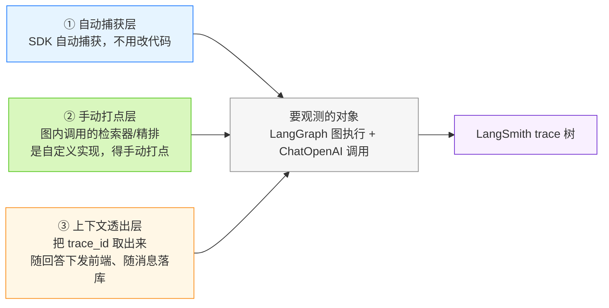
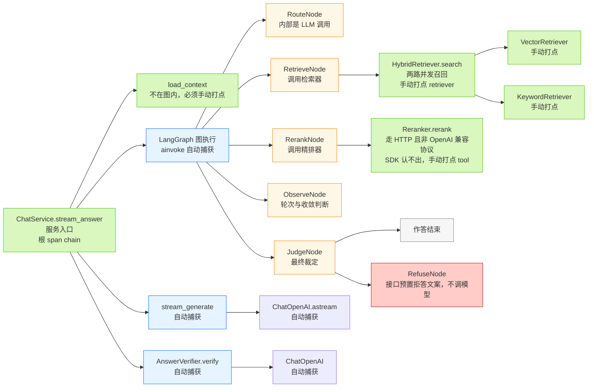
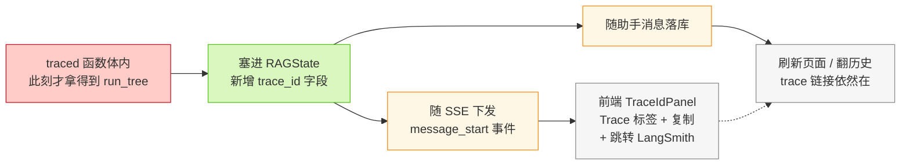

# 01_需求分析与方案设计

> 期：**Day09 · 可观测性**
> 章：第 1 章 需求分析与方案设计
> 记录日期：2026.09.23

---

## 一、本期定位

> Day08 让**答案更可信**（精排 + 校验），但**系统对自己的行为依然说不清**：
> 每次问答内部跑了 8 个节点、2 次 LLM 调用、3 次检索，出了问题只能靠零散日志猜。
> 这一期把**整条链路的每一步**都变成可查的 trace 树。

**一句话**：前八期让系统**答得更好**，这一期让系统**说得清自己刚才做了什么**。

---

## 二、需求分析

### 2.1 现在的痛：信息不少，但**不连在一起**

| 现在能看到的东西 | 缺什么 |
| --- | --- |
| 后端日志里零散几行耗时 | 看不出**这几次耗时是谁在等谁** |
| 前端 `QueryRoutePanel` / `AgentStepsPanel` / `CitationList` | 只有**结论**，没有每一步的**输入输出** |
| 答案本身 | 出问题只能**猜**是哪一步坏了 |

> 🔑 **本质不是"信息不够"，而是"信息不连在一起"。**

### 2.2 教程列出的具体问题

| # | 问题 |
| --- | --- |
| 1 | 回答慢，但**没时间都花在哪里**——是 embedding、rerank、还是 LLM 生成？ |
| 2 | **token 消耗**分布不清，算不出成本 |
| 3 | 检索统计（走 rewrite / hyde 的比例、成本、平均延迟）拿不到 |
| 4 | 用户反馈"这个回答有问题"，**没法还原当时的检索链路** |

### 2.3 做成什么样

一次问答 → LangSmith 上长成**一棵树**，每个节点都有 **输入 / 输出 / 延迟 / token**。

排查方式从"**猜**"变成"**看**"：

```
❌ 回答不对劲 → 逐段加 print、逐次重跑
✅ 打开 trace → 哪一步红了 / 慢了 / 输出为空，直接指出来
```

---

## 三、方案设计

### 3.1 整体接入分三层

| 层 | 由谁负责 | 我们要做什么 |
| --- | --- | --- |
| **① 自动捕获层** | LangChain SDK 自动 | **一行代码都不用改** |
| **② `@traceable` 补缺层** | 我们自己加装饰器 | 只给"SDK 认不出来"的关键函数加 |
| **③ 上下文透出层** | 我们自己写 | 把 `trace_id` 取出来 → 塞进 RAGState → SSE 下发前端 + 随消息落库 |

> 对应图：`01_可观测性接入三层架构图.png`



### 3.2 ⭐ 判据：什么时候必须手动打点

教程原话是"`service` / `retriever` / `reranker` 这些**非 LangChain 的代码** SDK 自己识别不出来"。

**把这句话翻译成可操作的判据**：

> ### 这个函数内部有没有调用「LangChain 生态的对象」？
> - **有** → SDK 顺着调用链自己就记了 → **不用装饰**
> - **没有** → SDK 看它就是普通 Python 函数 → **必须手动打点**

**三个例子验证**：

| 函数 | 内部是什么 | 要不要手动打点 |
| --- | --- | --- |
| `stream_generate` | `ChatOpenAI.astream`（LangChain 对象） | ❌ 不用 |
| `Reranker.rerank` | 裸 `httpx.post`（不是） | ✅ 要 |
| `load_context` | 裸 SQLAlchemy 查库（不是） | ✅ 要 |

> ⚠️ **注意判据不是"在不在图里"**：`stream_generate` **恰恰不在图里**（它是 service 直接 `await` 的），
> 但因为内部是 `ChatOpenAI`，照样自动被捕获。
> 反过来 `Reranker.rerank` 在**图内**被调用，却必须手动打点。

**本项目 6 处手动打点对象**：

```
stream_answer（根） / load_context
HybridRetriever.search / VectorRetriever.search / KeywordRetriever.search
Reranker.rerank
```

### 3.3 `run_type` 参数：只是"图标名字"

| `run_type` | UI 图标分类 | 含义 | 本项目谁用 |
| --- | --- | --- | --- |
| `chain` | 流程编排 | 一次完整调用流程 | `stream_answer`（根） |
| `retriever` | 检索 | 检索类操作 | 三个检索器 |
| `tool` | 外部工具调用 | 调外部服务 | `Reranker.rerank` |
| `llm` | 模型调用 | 模型推理 | **不用我们填**，LangChain 自动标 |

> **教程原话**：选对类型主要是 **UI 上更直观，不会影响 trace 数据本身**。
> → 所以这里**不用纠结**，选错只是图标难看。

### 3.4 全链路打点分布

> 对应图：`02_RAG 全链路 trace 打点分布图.png`



**配色约定**：

| 颜色 | 含义 |
| --- | --- |
| 🟩 绿 | **要手动加 `@traceable`** 的 6 处 |
| 🟦 蓝 | 自动捕获，**一行都不用改** |
| 🟧 橙 | 图内节点（自动成为父 span，本身不用装饰） |
| 🟥 红 | 拒答出口 |
| ⬜ 灰 | 结束 |

> **教程原图的三个小瑕疵**（自己画图时别照抄）：
> ① `load_context` 画了两个框，其实是同一个东西；
> ② 没画 `rerank` / `judge_context` / `refuse`（它们也是图内节点，一样自动捕获）；
> ③ 没画 `AgentPlanner` / `QueryRewriter`（本项目新增的两个 LLM 决策器）。

### 3.5 `trace_id` 的取 / 传 / 存

> 对应图：`03_trace_id 获取与透出链路图.png`



**四个动作**：

```
① 在 traced 函数【体内】取 run_tree → 拿到 trace_id
② 写进 RAGState（新增字段，与 user_message_id 同一层：都是"落库后回写"）
③ 随 SSE 下发前端 → TraceIdPanel 渲染「Trace」标签 + 复制 + 跳转链接
④ 随助手消息落库 → 刷新页面 / 翻历史时链接依然在
```

**前端消费端已就绪**（本章**不用改前端**）：

| 位置 | 内容 |
| --- | --- |
| `frontend/src/api/chatStream.ts` L14-22 | `ChatStartEvent` 定义 `traceId` / `traceUrl` / `cacheHit` |
| `frontend/src/api/chatStream.ts` L123-125 | 从 `message_start` 读 `data.trace_id` / `data.trace_url` / `data.cache_hit` |
| `frontend/src/pages/ChatPage.tsx` L227-229 | 把 `traceId` / `traceUrl` 灌进 UI 消息 |
| `frontend/src/pages/ChatPage.tsx` L469-471 | 渲染 `<TraceIdPanel>` |
| `frontend/src/components/TraceIdPanel.tsx` L16 | `if (!traceId) return null` —— **没有 trace 就整条不渲染**（第 2 条降级） |

### 3.6 ⚠️ 时序约束（教程没提，本章必须解决）

**实测结论**（本地探针，见 §4.3 验证 C）：

> `get_current_run_tree()` **出了被装饰函数的函数体就返回 `None`**。
> 因为它是从"**当前执行上下文**"里取的，函数返回后上下文即被清掉。

**因此 `trace_id` 只能在 `stream_answer` 的【函数体内】取。**

**而现在的代码里，第一条 SSE 事件发得太早**：

| 位置 | 现象 |
| --- | --- |
| `backend/app/services/chat_service.py` L368 | `message_start` 只发 `user_message_id` |
| `backend/app/services/chat_service.py` L357 | 而 `message_start` 在**图执行之前**就 yield 了 |
| → | **那一刻 `trace_id` 还没出生** |

**三个备选方案**：

| 方案 | 做法 | 代价 |
| --- | --- | --- |
| **A**（倾向） | 把 `message_start` 的 yield 挪到**图执行之后** | 前端拿到 `user_message_id` 占位晚一点点；**但不用改前端**（前端已定死从 `message_start` 读） |
| **B** | 新增一个事件专发 `trace_id` | 要改 `chatStream.ts` 加分支 |
| **C** | 挂在 `message_end` 上 | 此刻前端已在收尾，时机偏晚 |

---

## 四、未启用时的降级（教程第 3 节）+ 本地实测

### 4.1 教程的两条降级声明

> LangSmith 是 **SaaS 服务**，需要注册账号 + API key。让它跟我们的项目**强绑定不太合适**，
> 所以 LangSmith 相关的配置需要有**降级方案**，不配置这些就不启用 LangSmith：

| # | 声明 |
| --- | --- |
| 1 | `LANGSMITH_TRACING=False` 或 `LANGSMITH_API_KEY=""` 时，整条链路 trace **全部变成空操作**（no-op），即 `@traceable` 装饰器**只透传函数调用，不做任何上报**——这也是 `@traceable` **自身的默认行为** |
| 2 | **前端检测到没有相关数据时，直接不渲染 LangSmith 对应的 UI** |

> ⚠️ **变量名注意**：教程正文写的是 `LANGSMITH_TRACING`，但**开头那段又出现了一次 `LANGCHAIN_TRACING`**（旧版变量名）。
> 当前 `langsmith 0.12.2` 认的是 **`LANGSMITH_TRACING` / `LANGSMITH_API_KEY`**，
> 不要照抄成 `LANGCHAIN_TRACING_V2` 那一套。

### 4.2 本地实测：三种配置下的真实行为

**探针**：给一个假检索函数（`run_type="retriever"`）加 `@traceable`，在**函数体内**读 `get_current_run_tree()`，并检查函数是否真被执行。

| 配置 | 函数体内有 run 吗 | 真的发出去了吗 | 函数结果受影响吗 |
| --- | --- | --- | --- |
| `LANGSMITH_TRACING=false` + 有 key | ❌ 没有（`None`） | ❌ **完全不上报** | ❌ 不受影响 |
| 三个变量**都不设**（未配置） | ❌ 没有（`None`） | ❌ **完全不上报** | ❌ 不受影响 |
| `LANGSMITH_TRACING=true` + **key 为空** | ✅ **有 run**（拿得到 id） | 🔴 **上报失败**（401，每次请求打一行错误日志） | ❌ 不受影响 |

**三种情况下 `@traceable` 的透传性质都被验证**：函数正常执行、参数与返回值**完全不变**。

### 4.3 🔴 实测发现的坑：`key 为空` 并不是真的降级

教程把 `TRACING=False` 和 `KEY=""` 并列成"两种情况都降级"，**实测并不等价**：

```
LANGSMITH_API_KEY="" + LANGSMITH_TRACING=true
    → run 照样在本地建起来了（get_current_run_tree() 有值）
    → 于是我们的代码会把 trace_id 发到前端
    → 但后端一上传就得 401，LangSmith 上【啥都查不到】
    → 结果：前端显示一个点进去 404 的坏链接 + 每次请求都打一行错误日志
```

> **定性**：这**不是崩溃**（主流程完全不受影响），但它是**"看起来配好了、实际没配好"**的
> **假阳性**——比彻底不启用更糟，因为用户不知道该关掉哪个开关。

**建议的判据**（实测得出，实施时采用）：

> **只有 `LANGSMITH_TRACING` 为真【且】`LANGSMITH_API_KEY` 非空时，才往外暴露 `trace_id`。**
> 两者任一不满足 → 整体降级为 no-op，连 `trace_id` 都不下发。

这与项目既有原则一致 —— **配置类错误要 fail fast**，不要"半开半关"地跑。

### 4.4 降级链路的两端

| 端 | 降级表现 | 依据 |
| --- | --- | --- |
| **后端** | 装饰器变 no-op，**我们不写任何特判代码** | 实测 4.2；教程原文也说这是 `@traceable` 自身默认行为 |
| **前端** | `traceId` 为 `null` → `TraceIdPanel` 整条不渲染 | `TraceIdPanel.tsx` L16 `if (!traceId) return null` |
| **衔接** | 后端降级时必须发 **`null`** 而不是空字符串 | `chatStream.ts` L123 用的是 `??`（只对 `null`/`undefined` 兜底，空串会原样透传，反而让前端以为有 trace |

---

## 五、与项目现状的核对（写代码前必看）

### 5.1 ✅ 已就绪，不用动

| 项 | 状态 |
| --- | --- |
| **`langsmith` 依赖** | ✅ **已装**：由 `langchain` 传递依赖带入，版本 **0.12.2**，`backend/uv.lock` L1204 可见。**不需要新增依赖** |
| `@traceable` / `get_current_run_tree` | ✅ 可直接 `from langsmith import traceable, get_current_run_tree` |
| 前端 trace 消费端 | ✅ 5 处全部就绪（见 §3.5 表），**本章不改前端** |
| 观测相关后端模块 | ❌ **不存在**（`app/observability/` 无此目录），需要新建或就地装饰 |

### 5.2 ❌ 本章要补的字段契约（**第三次遇到同一模式**）

前端 `message_start` 已经在读三个字段，**后端一个都没有**：

| 字段 | 前端读它的地方 | 本章处理 |
| --- | --- | --- |
| `trace_id` | `chatStream.ts` L123 | ✅ **补**（本章功能就是可观测性） |
| `trace_url` | `chatStream.ts` L124 | ✅ **补**（教程明确说"后端按 `LANGSMITH_RUN_URL_PREFIX` 拼好下发"） |
| `cache_hit` | `chatStream.ts` L125 | ⛔ **不补**（属**第 12 期**语义缓存，本章不做缓存） |

> **判据**（本章第三次复用）：**教程这一章正在实现的功能，它的字段就要补；这一章没做的功能，字段就别补。**
>
> 补 `cache_hit` 会写一个**永远返回 `false`** 的字段，前端"缓存命中"标签永远不亮 → **反而误导人**。

### 5.3 ❌ 其他待补

| 项 | 现状 |
| --- | --- |
| `RAGState.trace_id` | ❌ 没有（`rag_state.py` 现 17 个字段） |
| `Message` 表存 `trace_id` 的列 | ❌ 没有（只有 `extra_metadata` JSONB，`models.py` L682）—— 落库方式待实现章节定 |
| `.env` / `.env.example` 的 LangSmith 项 | ❌ 都没有 |

---

## 六、自测题作答与薄弱点

| 题 | 判定 | 薄弱点 |
| --- | --- | --- |
| 1 · 哪一层不用改业务代码 | ✅ 对 | — |
| 2 · 为什么 `Reranker` 要手动打点而 `stream_generate` 不用 | ⚠️ 半对 | **理由错**：答成"`generate` 是 LangGraph 的调用"，实际是"它内部调了 `ChatOpenAI`"。**判据是"内部有没有 LangChain 对象"，不是"在不在图里"** |
| 3 · `run_type` 选错会怎样 | ✅ 对 | 只是 UI 图标错配，不影响 trace 数据 |
| 4 · `get_current_run_tree()` 在图执行后调用返回什么 | ❌ 不会 | **返回 `None`** → `trace_id` 只能在函数体内取（§3.6） |
| 5 · 为什么这期不补 `cache_hit` | ❌ 不会 | 属第 12 期语义缓存；**本章做才补，本章不做不补**（§5.2） |

> **本轮三个知识点**：
> ① 🆕 手动打点的判据 = **内部有没有 LangChain 对象**（不是"在不在图里"）
> ② 🔴 `trace_id` **只能**在函数体内取，且 `message_start` 发得太早
> ③ 🔁 **本章做才补，本章不做不补**

---

## 七、下一步（实现顺序）

```
① 配置（LANGSMITH_* 三项 + RUN_URL_PREFIX，并处理 §4.3 的假阳性）
② 三层打点（stream_answer / load_context / 三个检索器 / Reranker）
③ trace_id 取传存（RAGState + SSE + 落库）
④ 决定 §3.6 的时序方案（A / B / C）
```

---

## 关联文件索引

| 文件 | 位置 | 说明 |
| --- | --- | --- |
| `backend/app/core/config.py` | 全文 228 行 | 需要新增 LangSmith 配置项的地方（现有配置到 L208 `verify_answer_enabled`） |
| `backend/app/services/chat_service.py` | L303 | `async def stream_answer` —— 未来的**根 span** 挂载点 |
| `backend/app/services/chat_service.py` | L357 | `get_rag_graph().ainvoke(state)` —— `trace_id` 只能在此**之前**取 |
| `backend/app/services/chat_service.py` | L368 | `message_start` 事件 —— **目前发得太早**（§3.6） |
| `backend/app/services/chat_service.py` | L571-578 | `extra_metadata` 组装处 —— `trace_id` 落库候选位置 |
| `backend/app/workflows/rag_state.py` | L86-88 | `user_message_id` / `assistant_message_id` —— 新增 `trace_id` 的邻居 |
| `backend/app/retrieval/hybrid_retriever.py` | L56 | `HybridRetriever.search` —— 手动打点候选 |
| `backend/app/retrieval/vector_retriever.py` | L83 | `VectorRetriever.search` —— 手动打点候选 |
| `backend/app/retrieval/keyword_retriever.py` | L42 | `KeywordRetriever.search` —— 手动打点候选 |
| `backend/app/llm/reranker.py` | L57 | `Reranker.rerank` —— **必须**手动打点（裸 `httpx`，SDK 认不出） |
| `backend/app/llm/agent_planner.py` | L78 | `AgentPlanner.plan` —— 图内 LLM 决策器，是否自动捕获**待实测** |
| `backend/app/llm/query_rewriter.py` | L307 | `QueryRewriter.optimize` —— 同上，被 `route_query` 节点调用 |
| `backend/app/workflows/nodes/generate.py` | L47 | `get_chat_model().astream(...)` —— `stream_generate` 被自动捕获的**原因所在** |
| `frontend/src/api/chatStream.ts` | L14-22 / L123-125 | trace 三字段的读取唯一入口 |
| `frontend/src/components/TraceIdPanel.tsx` | L16 | 降级落点：无 `traceId` 即不渲染 |
| `backend/uv.lock` | L1204 | `langsmith 0.12.2` —— 依赖已就绪的证据 |
