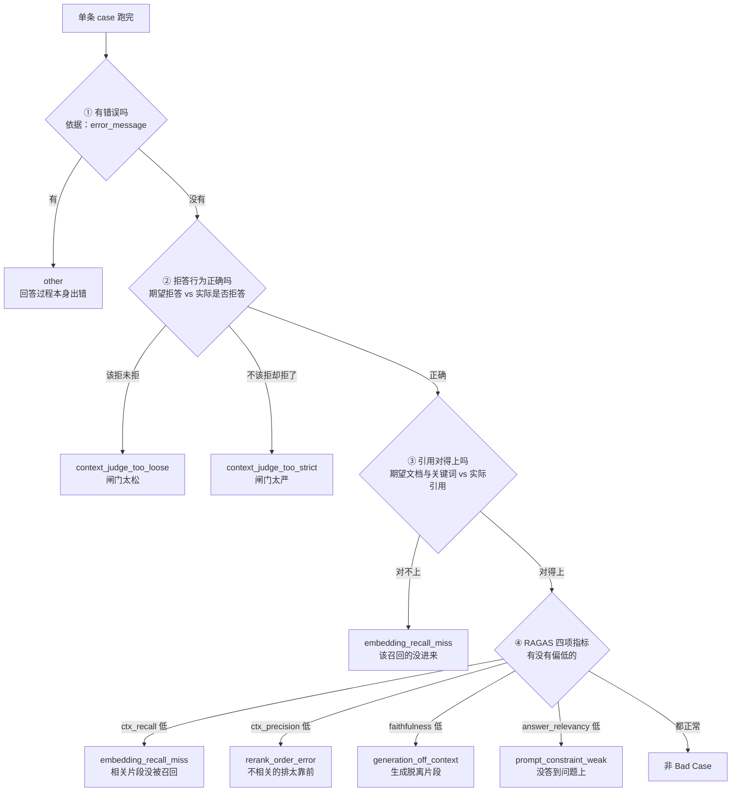
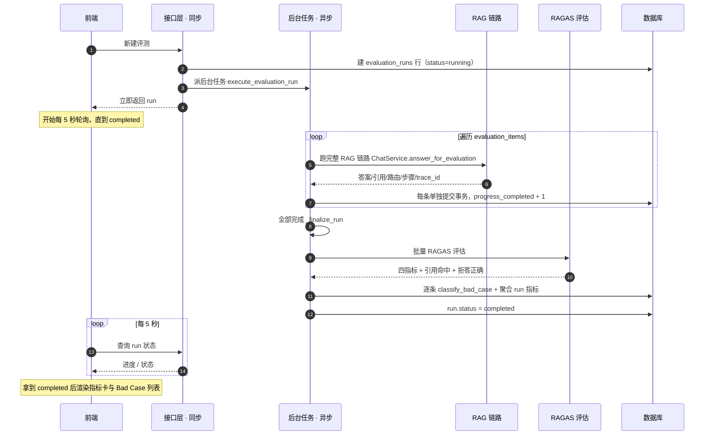

# 01_需求分析与方案设计

> 期：**Day10 · 评测与 Bad Case 分析**
> 章：第 1-2 章 需求分析 ＋ 方案设计
> 记录日期：2026.09.23

---

## 一、本期定位

> 前面九期把整条链路做完了：query 改写 → 混合检索 → 精排 → 生成 →
> 引用校验 → LangSmith 链路追踪。
>
> **但留下了一个没法回避的问题：每次改一处，到底变好了还是变差了？**

**教程原话**：

> 只靠手动提几个问题、肉眼对比答案，看起来挺顺，但是**没法用数据评估这些优化**。
> 这一期我们就来完善项目的评测系统，**再迭代策略的时候就有了数据支撑**。

**一句话**：前九期让链路**能跑、跑得准、看得清**；这一期给它装一把**尺子**。

| 期 | 产出 |
| --- | --- |
| Day08 | 让答案**更可信**（精排 + 校验） |
| Day09 | 让链路**看得清**（trace 树） |
| **Day10** | 让改动**量得出**（指标 + 坏例归因） |

---

## 二、需求分析：评测系统要有四个功能

| # | 功能 | 说明 |
| --- | --- | --- |
| 1 | **批量跑** | 挑一份评测集，后端**自动批量跑** RAG 流程 |
| 2 | **整体指标** | 跑完展示指标卡：Faithfulness / 引用命中率 / 平均耗时… |
| 3 | **单条详情** | 能查每条 case 的实况：实际答案、引用、检索到的 chunk、query 路由、agent steps、`trace_id` |
| 4 | **坏例归因** | 答错的 case **自动归类**（如「检索没召回」「prompt 约束不足」「模型生成偏离上下文」），方便针对性优化 |

> 💡 **第 3 项值得注意**：它把 Day09 的 `trace_id` 变成评测的一部分 ——
> **每条坏例都能一键跳到 LangSmith 看当时的完整链路**。
> **这就是"可观测"与"评测"两个能力的合流点。**

---

## 三、方案设计 · RAGAS 四指标 + 两个自定义指标

**RAGAS** 是 RAG 领域目前最主流的自动评测框架，评四个核心指标：

| 指标 | 中文 | 在问什么 |
| --- | --- | --- |
| **Faithfulness** | 忠实度 | 答案是否**严格基于检索到的上下文**，有没有**编造信息** |
| **Answer Relevancy** | 答案相关性 | 回答和用户问题**是否对得上**，有没有**答非所问** |
| **Context Precision** | 上下文精度 | 检索回来的内容里**「有用片段」的占比**高不高 |
| **Context Recall** | 上下文召回 | 参考答案里的**关键信息，检索环节有没有漏掉** |

**⚠️ 光有 RAGAS 不够，本项目另外加两个业务指标**：

| 指标 | 为什么需要它 |
| --- | --- |
| **引用命中率** | RAGAS 不评价"**引用标得对不对**"，而这是本项目的核心卖点 |
| **拒答正确率** | RAGAS 不评价"**该不该拒答**"，而这是防幻觉的最后一道闸门 |

**教程原话**：本项目使用 RAGAS 来评测答案质量，**另外加两个自定义的业务指标（引用命中率和拒答正确率）**，
综合评判**整条 RAG 链路是否靠谱**。

### ⭐ 四个指标各自"低"了指向哪一环（图一右半边的依据）

| 指标 | 低了说明 | 归因到 |
| --- | --- | --- |
| `ctx_recall` | 相关片段**根本没被召回** | `embedding_recall_miss` |
| `ctx_precision` | 片段召回了，但**不相关的排太靠前** | `rerank_order_error` |
| `faithfulness` | 片段是对的，但**生成脱离了片段** | `generation_off_context` |
| `answer_relevancy` | 生成没跑偏，但**没答到问题上** | `prompt_constraint_weak` |

> 🎯 **这张表的用法**：它就是**"指标 → 该去改哪一环"的对照表** ——
> **指标不是拿来看的，是拿来指方向的。**

---

## 四、Bad Case 归因：12 + 1 种分类

**教程原话**：

> 光看指标还不够，迭代时更想知道「**这一轮评测效果不好的 case 是在哪一步出了问题**」，
> 所以每条 case 跑完后，我们**按一组规则自动归类到 12 + 1 种原因里**。
>
> 规则按**优先级排序，命中即停**。这只是**自动初判**，后面还要能通过 **PATCH 接口人工修改归因**，
> 毕竟 **AI 有错判的可能，要让人能纠正**。

### 4.1 图一：Bad Case 归因链路

> 对应 `01_BadCase归因链路图.png`



### 4.2 四个判断点的**依据**与**数据来源**

| 步 | 判断什么 | 依赖字段 | 数据从哪来 |
| --- | --- | --- | --- |
| ① | 有没有错误 | `error_message` | 跑 case 时捕获的异常 |
| ② | 拒答是否正确 | 期望拒答 vs 实际是否拒答 | 评测集标注 vs 实跑结果 |
| ③ | 引用对得上吗 | 期望文档 / 期望关键词 vs 实际引用 | 同上 |
| ④ | RAGAS 是否偏低 | 四指标 | RAGAS 批量评估 |

### 4.3 ⚠️ 图里 8 种，契约里 **13 种**

**教程图只画了归因链路上最常触发的 8 种出口。**
而 `types.gen.ts` **L623** 定义的**完整分类是 13 种**：

| # | 分类 | 属于哪一环 |
| --- | --- | --- |
| 1 | `document_parse_failed` | 更早：文档解析 |
| 2 | `chunk_split_bad` | 更早：切片 |
| 3 | **`embedding_recall_miss`** | 图一 ③ / ④ |
| 4 | `keyword_recall_miss` | 更早：关键词路 |
| 5 | `rrf_fusion_error` | 更早：RRF 融合 |
| 6 | **`rerank_order_error`** | 图一 ④ |
| 7 | **`context_judge_too_loose`** | 图一 ② |
| 8 | **`context_judge_too_strict`** | 图一 ② |
| 9 | **`prompt_constraint_weak`** | 图一 ④ |
| 10 | **`generation_off_context`** | 图一 ④ |
| 11 | `citation_parse_failed` | 更早：引用解析 |
| 12 | `permission_filter_error` | 更早：权限过滤 |
| 13 | **`other`** | 图一 ① |

> 📌 **两者不冲突**：
> **13 种是"分类的全集"，图一的 8 种是"归因链路能自动判出来的那部分"。**
> 其余 5 种（解析 / 切片 / 关键词路 / RRF / 权限）**发生在本链路更早的环节**，
> 靠这套规则判不出来，需要人工归因 —— **这正是教程说的"要让人能纠正"。**
>
> ✅ **实现时按 13 种做**（以契约为准）。

---

## 五、整体执行链路

### 5.1 图二：评测执行时序图

> 对应 `02_评测执行时序图.png`



### 5.2 ⭐ 为什么这张图从"流程图"改成了"时序图"

**教程原图是流程图的形状**（`POST` 一分为三：建行 / 排队 / 立即返回）。
它没错，但**看不出这个架构最关键的一点**：

```
❌ 原流程图：把"建行""排队""立即返回"画成【同一个分叉】
   → 视觉上像是三件并行的事
   → 看不出"接口层到底等不等后台任务"

✅ 时序图：两条【虚线】把这件事钉死
   ④ API-->>FE  立即返回 run      ← 接口层【不等】后台任务
   ⑤ API-->>FE  进度 / 状态        ← 前端【反复问】而不是"等推送"
```

**这一章的架构精髓就是「接口只派活、不等活；前端靠轮询」** ——
**只有时序图能把这个"谁等谁"讲明白。**

### 5.3 各阶段的精确标识符（图二里几个字的展开）

| 图中简写 | 教程 / 契约里的精确名 |
| --- | --- |
| 建 `evaluation_runs` 行 | 评测主表，一次执行一行 |
| 派后台任务 | `execute_evaluation_run(run_id)` |
| 跑完整 RAG 链路 | `ChatService.answer_for_evaluation` |
| 单独提交事务，进度 +1 | 每条 case 一个独立事务 → **这就是"进度条能实时动"的原因** |
| 全部完成 `_finalize_run` | 遍历结束后的收尾 |
| 批量 RAGAS | `asyncio.to_thread` 跑**同步** API |
| 逐条归因 | `classify_bad_case` + 聚合 run 级指标 |

> 💡 **`每条单独提交事务` 是本设计的隐藏要点**：
> 如果等全部跑完再一次性落库，**前端那 5 秒轮询什么都看不到**（进度永远是 0）。
> 一条一提交，**轮询才能看到进度在动** —— **"能看进度"是设计出来的，不是自然有的。**

---

## 六、数据模型：两张表

| 表 | 一行代表什么 | 存什么 |
| --- | --- | --- |
| **`evaluation_runs`** | **一次执行** | 执行元数据、进度、最终聚合指标、状态 |
| **`evaluation_items`** | **一次执行下的每条 case** | 每条 case 的**输入快照**、**实际输出**、各项指标、**Bad Case 归因** |

**教程原话**：两张表分别对应「一次执行」和「一次执行下的每条 case」。

### 6.1 契约里两张表的字段（`types.gen.ts`）

**`evaluation_runs`**（`EvaluationRunRead` L778 / 列表项 L682）：

```
id / name / dataset_name / dataset_size
status: 'running' | 'completed' | 'failed'
progress_total / progress_completed / progress_failed     ← 进度三件套
faithfulness / answer_relevancy / context_precision / context_recall   ← RAGAS 四指标
citation_hit_rate / refusal_accuracy                       ← 两个自定义业务指标
avg_latency_ms / avg_first_token_latency_ms                ← 两个耗时
created_at
```

**`evaluation_items`**（`EvaluationItemRead` L501）：

| 分组 | 字段 |
| --- | --- |
| **输入快照** | `case_id` / `question` / `expected_answer` / `expected_document_names` / `expected_keywords` / `should_refuse` / `tags` |
| **实际输出** | `actual_answer` / `actual_refused` / `citations` / `retrieved_chunks_meta` / `query_route` / `agent_steps` / `verify_result` / **`trace_id`** |
| **指标** | `faithfulness` / `answer_relevancy` / `context_precision` / `context_recall` / `citation_hit` / `refusal_correct` |
| **耗时** | `latency_ms` / `first_token_latency_ms` |
| **归因** | `is_bad_case` / `bad_case_category` / `bad_case_note` |
| **异常** | `error_message` |

> 🎯 **同一个模式第 N 次出现**：`query_route` / `agent_steps` / `verify_result` / `trace_id`
> **这四个字段在 `EvaluationItemRead` 里又出现了一次** ——
> 与 `MessageRead` 里的那四个是**同一批调试卷**。
>
> **这不是重复**：评测要能**离线回看当时那条链路的全部线索**，
> 所以它必须**把实时链路的调试卷整体快照下来**。

### 6.2 `EvaluationItemUpdate`：人工纠错入口（L642）

```python
bad_case_category?: ... | null
bad_case_note?: str | null
is_bad_case?: bool | None      # 传 null 时保持原值
```

> 契约注释写得很好：**传 `is_bad_case=null` 时保持原值；
> 显式传 `is_bad_case=false` 可手动把误判的 case 标回"非 Bad Case"。**
>
> **这是"三态"设计**：`null` = 不改、`true` = 标为坏例、`false` = **撤销误判** ——
> 正好对应教程说的"**AI 有错判的可能，要让人能纠正**"。

---

## 七、⭐ 契约核对：前端**已经全部就绪**，后端**一行都没有**

### 7.1 前端现状（已存在）

| 文件 | 行数 | 内容 |
| --- | --- | --- |
| `pages/EvaluationListPage.tsx` | **186** | 评测列表页（含 running 自动轮询） |
| `pages/EvaluationDetailPage.tsx` | **423** | 评测详情页（指标卡 + Bad Case 列表 + 人工纠错） |
| `api/evaluation.ts` | **139** | 7 个 hook（含 5 秒轮询、创建、删除、更新归因） |
| `utils/badCaseCategory.ts` | **23** | 13 种分类的中文标签映射 |
| `components/BadCaseCategorySelect.tsx` | **34** | 归因下拉选择组件 |
| `api/queryKeys.ts` | 21 | 评测相关 query key |
| `routes/index.tsx` | 43 | **L33-34** 已注册 `/evaluation` 与 `/evaluation/runs/:id` |

### 7.2 后端现状（**零**）

```
在后端 app 目录下搜索 evaluation / ragas / bad_case：
    匹配到的文件数 = 0
```

### 7.3 后端要实现的路由（前端已在调用）

```
GET    /api/evaluations/datasets                     列出可用评测集
GET    /api/evaluations/runs                         分页列出 run
POST   /api/evaluations/runs                         新建 run
GET    /api/evaluations/runs/{run_id}                查 run 详情（含进度）
DELETE /api/evaluations/runs/{run_id}                删除 run
GET    /api/evaluations/runs/{run_id}/items          分页列出 case（支持 bad_case_only 过滤）
GET    /api/evaluations/items/{item_id}              查单条 case
PATCH  /api/evaluations/items/{item_id}              人工修改归因
```

> 📌 **`ListEvaluationItemsData` 里有 `bad_case_only?: boolean`**（`types.gen.ts` L2491）——
> **详情页的"只看坏例"筛选是后端参数，不是前端过滤。**

### 7.4 结论

> ### **`types.gen.ts` 就是本期的验收标准。**
>
> 这是本项目**第四次**遇到"前端字段超前"（前三次：第 6 期精排分、第 8 期校验结果、第 9 期 trace 字段）——
> **但这次超前最多**：**整个前端页面 + 7 个接口 + 13 种分类都已在契约里定义好了。**
>
> → **后端只要按契约实现，前端一行都不用改。**

---

## 八、本档"严格按教程"与"改造"的边界

### 8.1 严格按教程语义的部分

| 项 | 来源 |
| --- | --- |
| RAGAS 四指标 + 两个自定义指标 | 教程 §2.1 |
| 归因 **12 + 1 种**、**优先级命中即停**、**人工可纠正** | 教程 §2.2 |
| 执行链路 9 个阶段与其顺序 | 教程 §2.3 |
| 两张表的分工 | 教程 §4 |

### 8.2 本档做的**可读性改造**（不改变语义）

| 图 | 改造 | 为什么（不改变原意的前提下） |
| --- | --- | --- |
| 图一 | 判断框加副标题 **`依据：…` / `期望 vs 实际`** | 让**判据的数据来源**可见 —— 光看"拒答正确吗"不知道拿什么比 |
| 图一 | ④ 的五个出口**排成一行**，兜底 `非 Bad Case` 放最右 | 原图五条斜线交叉，"都正常"浮在中间**容易被误读成第一个判断** |
| 图二 | **流程图 → 时序图** | 原图把"建行/排队/立即返回"画成同一分叉，**看不出接口层等不等后台任务** |
| 图二 | 补齐 **`_finalize_run`** | 教程原图有这一步；改造过程中一度遗漏，已补回（**遍历结束 → 收尾 → 才评估**） |
| 图二 | 泳道标注 **「接口层 · 同步」「后台任务 · 异步」** | 原图没有这个区分，而这正是本设计的核心 |

> ⚠️ **两张图都不含 `_finalize_run` 之外的任何新增阶段** ——
> 标识符（`evaluation_runs`、`execute_evaluation_run`、`answer_for_evaluation`、
> `classify_bad_case`、`asyncio.to_thread`）**全部来自教程原文**。

---

## 九、待确认与遗留

| # | 项 | 说明 |
| --- | --- | --- |
| **1** | ⚠️ **RAGAS 指标"偏低"的阈值** | 图一里 `ctx_recall 低` 的**"低"是多少**，教程图**没给**。实现那一章一定会出现这个常量，**届时必须核对教程给的数值**，不能自己定 |
| 2 | **评测集放哪 / 什么格式** | 契约里是 `dataset_name`（"评测集文件名，不带 `.jsonl`"）→ **`.jsonl` 格式、按名字选**；具体目录位置待实现章确认 |
| 3 | **RAGAS 怎么装** | 需要新增第三方依赖（RAGAS），且它**是同步 API** → 教程用 `asyncio.to_thread` 包 |
| 4 | **`answer_for_evaluation` 是新方法** | 名字带 `for_evaluation` → 与线上 `stream_answer` **同源但不同**（评测要的是完整结果 + 耗时，不是逐 token 流） |
| 5 | 后端**全部待实现** | 表 / 迁移 / 仓储 / service / RAGAS 封装 / 归因规则 / 8 个接口 |

---

## 十、关联文件索引

### 10.1 本期将要改动的后端（**目前全不存在**）

| 预期文件 | 状态 |
| --- | --- |
| `backend/app/db/models.py` | ⬜ 待加两张表 |
| `backend/alembic/versions/*` | ⬜ 待加迁移 |
| `backend/app/db/repositories/evaluation_repo.py` | ⬜ 待新建 |
| `backend/app/services/evaluation_service.py` | ⬜ 待新建（`create_run` / `execute_evaluation_run` / `_finalize_run`） |
| `backend/app/llm/` 下的 RAGAS 封装 | ⬜ 待新建 |
| 归因规则（`classify_bad_case`） | ⬜ 待新建 |
| `backend/app/api/routes/evaluations.py` | ⬜ 待新建（8 个接口） |
| `backend/app/api/schemas/evaluation.py` | ⬜ 待新建（对齐 `types.gen.ts`） |
| `backend/app/services/chat_service.py` | ⬜ 待加 `answer_for_evaluation` |

### 10.2 契约与前端（**已存在，作为验收标准**）

| 文件 | 位置 | 说明 |
| --- | --- | --- |
| `frontend/src/client/types.gen.ts` | **L477-494** | `EvaluationItemPage` |
| `frontend/src/client/types.gen.ts` | **L501-632** | ⭐ `EvaluationItemRead`（输入快照 + 实际输出 + 指标 + 归因） |
| `frontend/src/client/types.gen.ts` | **L623** | ⭐ **13 种 `bad_case_category` 全集** |
| `frontend/src/client/types.gen.ts` | **L642-655** | ⭐ `EvaluationItemUpdate`（人工纠错，三态语义） |
| `frontend/src/client/types.gen.ts` | **L662-675** | `EvaluationRunCreate` |
| `frontend/src/client/types.gen.ts` | **L682-751** | `EvaluationRunListItem`（含进度三件套 + 六个指标 + 两个耗时） |
| `frontend/src/client/types.gen.ts` | **L778-852** | `EvaluationRunRead` |
| `frontend/src/client/types.gen.ts` | L2491 | `bad_case_only` 查询参数（"只看坏例"） |
| `frontend/src/pages/EvaluationListPage.tsx` | 全文 186 行 | 列表页 |
| `frontend/src/pages/EvaluationDetailPage.tsx` | 全文 423 行 | 详情页 + 人工纠错 |
| `frontend/src/api/evaluation.ts` | 全文 139 行 | 7 个 hook |
| `frontend/src/utils/badCaseCategory.ts` | 全文 23 行 | 13 种分类的标签映射 |
| `frontend/src/routes/index.tsx` | L33-34 | 评测页路由注册 |

### 10.3 可复用的既有能力（前几期产出）

| 能力 | 位置 | 评测里怎么用 |
| --- | --- | --- |
| 实时链路的调试卷 | `MessageRead` 的 `query_route` / `agent_steps` / `verify_result` | **评测项要整体快照同一批字段** |
| `trace_id` | Day09 的 `message_start` + `messages.metadata` | **坏例一键跳 LangSmith** |
| 答案校验器 | `app/llm/answer_verifier.py` | 归因 ④ 的 `faithfulness` 判据可参考 |
| RRF 融合的 `sources` | `hybrid_retriever.py` L341 | 归因 ③ 判断引用命中时的依据之一 |

### 10.4 归档配图

| 图 | 文件 |
| --- | --- |
| Bad Case 归因链路 | `01_BadCase归因链路图.png` |
| 评测执行时序 | `02_评测执行时序图.png` |
