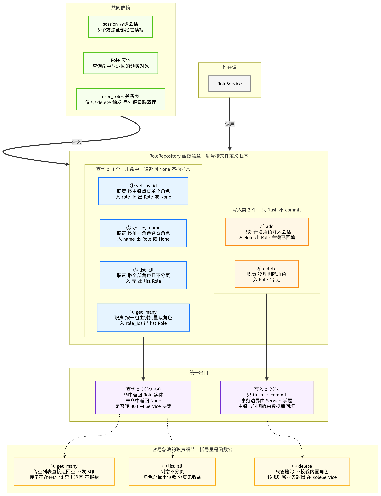
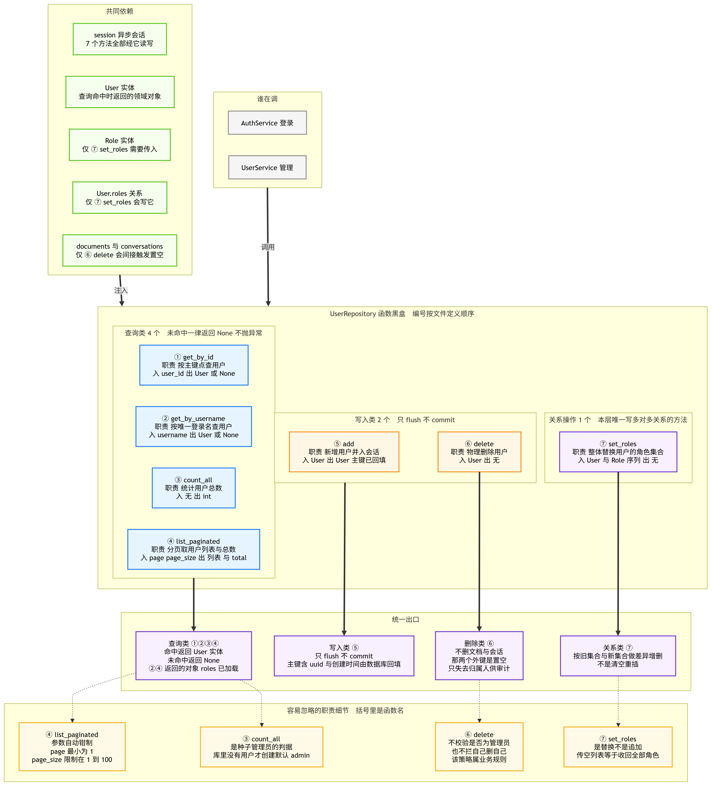
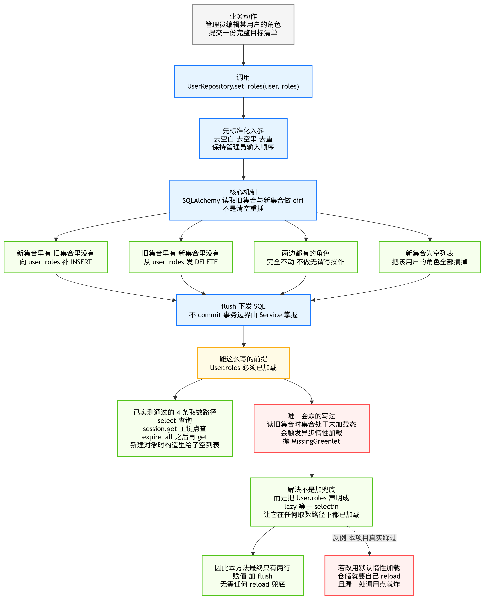
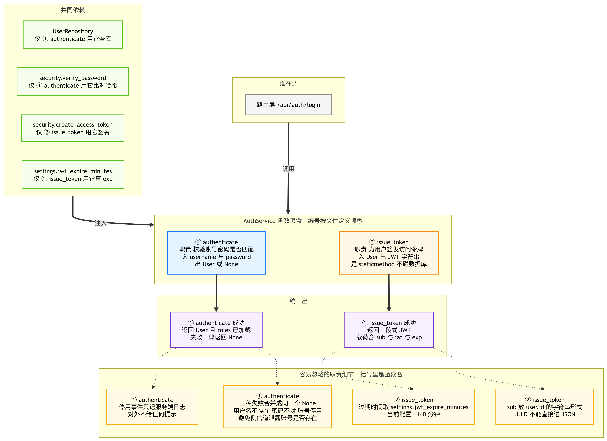
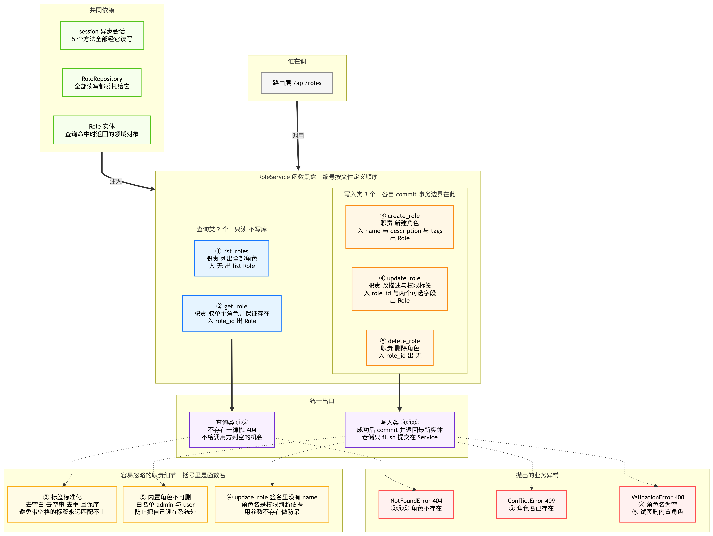
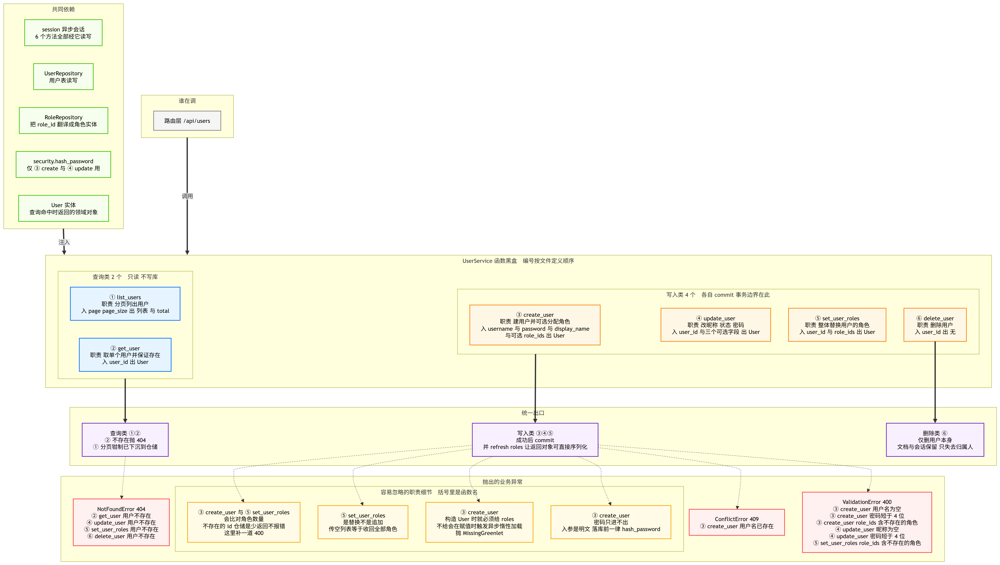

# 04_仓储与Service层

> 期：**Day11 · 认证、权限与安全检索**
> 章：第 3 章 后端实现 · **第 4 步「Repository 与 Service」**
> 记录日期：2026.09.26

---

## 一、本节在整条链路里的位置

> **前一步做完了"锁和钥匙"（密码哈希 + JWT）。这一步把它们接到数据库上，
> 并且第一次让系统能回答「这个人能看哪些文档」。**

```
第 3 章 后端实现
├── 第 1 步  安装依赖与配置项      ← 已归档（备料）
├── 第 2 步  数据模型与迁移        ← 已归档（打地基）
├── 第 3 步  密码哈希与 JWT 工具   ← 已归档（锁和钥匙）
├── 第 4 步  Repository 与 Service ← 你在这里（接数据库 + 权限计算）
├── 第 5 步  依赖注入（CurrentUser / CurrentAdmin）
├── 第 6 步  路由（/auth、/users、/roles）
└── 第 7 步  权限过滤接入检索 SQL
```

**本节是纯 Python 层：不碰 HTTP、不加路由。** 一句话概括这四块的分工：

```
Repository  ──  数据存取：只拼 SQL、只 flush，不 commit、不做业务判断
Service     ──  业务逻辑：做校验、决定事务边界（commit）、算权限
```

| 本步产出 | 性质 |
| --- | --- |
| `app/db/repositories/user_repo.py` | **新增**，7 个方法 |
| `app/db/repositories/role_repo.py` | **新增**，6 个方法 |
| `app/services/permission_service.py` | **新增**，2 个纯函数 + 2 个常量 |
| `app/services/auth_service.py` | **新增**，2 个方法 |
| `app/services/role_service.py` | **新增**，5 个方法 + 1 个常量 |
| `app/services/user_service.py` | **新增**，6 个方法 |
| `app/db/models.py` | **修改**：三处关系恢复 `lazy="selectin"`（见 §八） |

---

## 二、本节与前后步骤的依赖关系

```
                     第 4 步（本节）
        ┌──────────────────┴──────────────────┐
        ▼                                     ▼
  Repository 层                          Service 层
  user_repo / role_repo                  auth / permission / role / user
        │                                     │
        │ 只 flush 不 commit                   │ commit 事务边界
        │                                     │
        └──────────► 第 3 步 security.py ◄────┘
                     hash_password / verify_password
                     create_access_token
                            │
                            ▼
                  第 5 步 依赖注入 CurrentUser
                            │
                            ▼
                  第 6 步 路由 + 第 7 步 检索过滤
```

| 后续步骤 | 依赖本节的什么 |
| --- | --- |
| 第 5 步 | `permission_service.is_admin`（判管理员）+ `security.decode_access_token`（解令牌） |
| 第 6 步 | `AuthService.authenticate` / `issue_token`、`RoleService`、`UserService` 全部方法 |
| 第 6 步 | `UserRepository.count_all` + `settings.default_admin_*` 做**种子管理员初始化** |
| 第 7 步 | `compute_user_permission_tags` —— **全项目"能看哪些文档"的唯一口径来源** |

---

## 三、模块一 · `RoleRepository`（6 个方法）



### 3.1 编号与方法

| 编号 | 方法 | 职责 | 分组 |
| --- | --- | --- | --- |
| ① | `get_by_id` | 按主键点查单个角色 | 查询 |
| ② | `get_by_name` | 按唯一角色名查角色 | 查询 |
| ③ | `list_all` | 取全部角色，**不分页** | 查询 |
| ④ | `get_many` | 按一组主键批量取角色 | 查询 |
| ⑤ | `add` | 新增角色并入会话 | 写入 |
| ⑥ | `delete` | 物理删除角色 | 写入 |

### 3.2 四个容易忽略的行为

| 行为 | 说明 |
| --- | --- |
| ①② 未命中返回 `None` | **不抛异常**。是否转 404 由 Service 决定 —— 仓储层不知道 HTTP 的存在 |
| ③ **刻意不分页** | 角色总量天然极小（内置 2 个 + 业务角色通常个位数）。强行分页只会让前端多写一套翻页逻辑，收益为零 |
| ④ 传空列表**直接返回 `[]`，不发 SQL** | `WHERE id IN ()` 在 SQL 里是非法语法。显式短路既避免报错，也省一次无谓的往返 |
| ④ 传了**不存在的 id 只少返回**，不报错 | 调用方若要求"全部存在"，需自行比对数量 —— `RoleService` 与 `UserService` 都补了这道校验（不一致则抛 400） |
| ⑥ **只做删除，不校验内置角色** | "内置角色不可删"是**业务规则**，属于 Service 的职责，仓储不该知道 |

---

## 四、模块二 · `UserRepository`（7 个方法）



### 4.1 编号与方法

| 编号 | 方法 | 职责 | 分组 |
| --- | --- | --- | --- |
| ① | `get_by_id` | 按主键点查用户 | 查询 |
| ② | `get_by_username` | 按唯一登录名查用户（预加载 roles） | 查询 |
| ③ | `count_all` | 统计用户总数 | 查询 |
| ④ | `list_paginated` | 分页取用户列表与总数 | 查询 |
| ⑤ | `add` | 新增用户 | 写入 |
| ⑥ | `delete` | 物理删除用户 | 写入 |
| ⑦ | `set_roles` | **整体替换**用户的角色集合 | 关系操作 |

### 4.2 三个关键行为

**① 分页参数自动钳制（④）**

```python
page = max(page, 1)                    # page=0 → 1，防负 offset
page_size = max(min(page_size, 100), 1)  # -5 → 1，10000 → 100
```

即使上层 Pydantic 已做校验，仓储层仍要自主设防 —— 因为本方法也可能被数据修复脚本、
离线任务直接调用（不过 HTTP）。

**② 排序必须带唯一列兜底（③④）**

```python
.order_by(User.created_at.asc(), User.id.asc())
```

`created_at` 在高并发批量创建时可能**同一毫秒重复**，若排序列不唯一，
PostgreSQL 在分页时无法保证游标顺序，用户翻页会"漏看 / 重复看到"。
**实测佐证**：本节测试一次插入 3 个角色，`created_at` 完全相同，
此时顺序完全由随机 UUID 决定 —— 好在**稳定**（两次查询结果一致），这正是要的效果。

**③ `delete` 的连带影响与"反向对照"（⑥）**

这是本节最值得记住的一处 —— **同样是 `delete`，用户侧与角色侧的数据库行为完全相反**：

| 删除对象 | 对关联数据的影响 | 为什么 |
| --- | --- | --- |
| **删角色** | `user_roles` 关联行 **CASCADE 消失** | 关联行本身没有保留价值（谁持有过一个不存在的角色，没有审计意义） |
| **删用户** | `documents.created_by` / `conversations.user_id` **置 NULL** | **业务数据必须保留** —— 文档与会话是知识库资产，不能因为创建者离职就丢 |

### 4.3 `set_roles` 的整体替换与 diff 机制（⑦）



**关键认知：`user.roles = [...]` 不是"先删光再插一遍"，而是让 SQLAlchemy 读取旧集合做 diff。**

```
旧集合 {hr}      新集合 {hr, sales}   →  补一条 INSERT（挂 sales）
旧集合 {hr,sales} 新集合 {hr}          →  发一条 DELETE（摘 sales）
旧集合 {hr}      新集合 {hr}           →  完全不动，无写操作
旧集合 {hr}      新集合 {}             →  全部摘掉（"暂时停权"）
```

**也正因为要"读旧集合"，才引出本节唯一那个异步坑** —— 旧集合若未加载，
读取动作就发生在不可 await 的属性访问里，直接抛 `MissingGreenlet`。
详见 §八。

---

## 五、模块三 · `permission_service`（2 函数 + 2 常量）


### 5.1 为什么它是"纯函数模块"（没有类）

```
没有类、没有 session、没有数据库、没有 HTTP。
输入一个已经加载好的 User 实体，输出一个列表或布尔值。
```

**好处**：极易测试（喂对象断言结果即可，本节 12 项测试就是这么跑的）、
可被任何层复用（检索链路、会话列表、文档列表、评测入口都不关心"登录"，
只关心"这个用户能看什么"）。

### 5.2 `compute_user_permission_tags`（①）：全项目的唯一口径

```python
def compute_user_permission_tags(user: User) -> list[str]:
    merged: set[str] = set()
    for role in user.roles:
        for tag in role.permission_tags:
            if tag == WILDCARD_PERMISSION_TAG:
                return [WILDCARD_PERMISSION_TAG]   # ★ 短路
            merged.add(tag)
    return sorted(merged)
```

| 设计点 | 理由 |
| --- | --- |
| **通配短路** | 任一角色持 `"*"` → 立即返回 `["*"]`，不再往下合并。这是优化，也是语义：通配即"全部"，再叠加别的标签没有意义。第 7 步的 SQL 识别到 `"*"` 会**直接跳过权限 WHERE 拼接** |
| **集合去重 + 排序** | 顺序对 SQL 数组重叠运算（`&&`）**没有意义**，但排序能让结果**稳定** —— 同样的角色组合永远得到同样的列表，便于写断言、也便于打日志时肉眼比对 |
| **前置条件：`user.roles` 必须已加载** | 遍历 `user.roles` 会触发关系访问。模型已配 `lazy="selectin"`，从数据库取出的 User 都带好了 roles |

### 5.3 `is_admin`（②）：按角色名，而不是按通配标签

```python
def is_admin(user: User) -> bool:
    return any(role.name == ADMIN_ROLE_NAME for role in user.roles)
```

**两者在当前数据下等价（只有 admin 角色带 `"*"`），但含义不同：**

| 判据 | 回答的问题 | 用途 |
| --- | --- | --- |
| 角色名（**本项目选它**） | 这个人**是不是管理员** | 管理类接口的准入（谁能访问 `/api/users`） |
| 通配标签 | 这个人**能不能看全部文档** | 数据检索的过滤 |

**副作用（刻意的）**：若给某个业务角色也加了 `"*"`，他**数据上全可见，但不会**因此获得管理接口权限。
这个行为是合理的 —— **数据可见 ≠ 管理权**。

`ADMIN_ROLE_NAME` 这个常量还被 `RoleService.PROTECTED_ROLE_NAMES` 引用，
形成"角色名是权限判断依据"这条链上的双重依赖（详见 §六 RoleService 的防呆 2）。

---

## 六、模块四 · Service 层

### 6.1 `AuthService`（2 个方法）



| 编号 | 方法 | 职责 |
| --- | --- | --- |
| ① | `authenticate(username, password) -> User \| None` | 校验账号密码 |
| ② | `issue_token(user) -> str` | 签发 JWT（**`staticmethod`**） |

**① 的核心设计：三种失败合并成同一个 `None`**

```
用户名不存在  →  None
密码不对      →  None
账号已停用    →  None   （只在服务端日志记 login refused (disabled)）
```

**为什么要合并** —— 避免**侧信道泄露账号是否存在**：

```
若"用户不存在"提示"该用户不存在"、"密码错"提示"密码错误"，
攻击者就能拿一份用户名字典逐个探测，筛出"哪些用户名真实存在"，
再针对这批真实账号集中爆破密码。
```

统一成"用户名或密码错误"，让攻击者无法区分自己错在哪一步。

**② 为什么不抛异常**：`AuthService` **本模块不抛任何业务异常** —— 失败靠返回 `None` 表达。
`UnauthorizedError(401)` 是**路由层**拿到 `None` 之后再抛的。分工清晰：
Service 说"成不成"，路由层说"用哪个 HTTP 状态码"。

**② 为什么是 `staticmethod`**：它不需要数据库、不需要 session，只依赖 `user` 与全局配置。
标成静态方法能明确表达"这里不发生任何 I/O"，调用方也不必先构造实例。

### 6.2 `permission service` 与 `auth service` 的区别（本节最易混的一对）

| | `auth_service` | `permission_service` |
| --- | --- | --- |
| 回答 | **你是谁**（认证） | **你能干什么**（授权） |
| 形态 | 有类，2 个方法 | **无类**，纯函数 |
| 碰数据库 | ✅ 查 `users` 表 | ❌ 完全不碰 |
| 调用频率 | **一次**（登录那一次） | **每次请求** |
| 失败表现 | 返回 `None` | 返回空列表 / `False` |
| 失败对应状态码 | 401 | 403 |

> 🔴 **对应第 3 步那张图**：`auth_service` 失败 → 401（请先去登录）；
> `permission_service` 判定不够 → 403（登录了也没你的份）。

### 6.3 `RoleService`（5 个方法 + 1 常量）



| 编号 | 方法 | 职责 | 分组 |
| --- | --- | --- | --- |
| ① | `list_roles` | 列出全部角色 | 查询 |
| ② | `get_role` | 取单个角色，不存在抛 404 | 查询 |
| ③ | `create_role` | 新建角色 | 写入 |
| ④ | `update_role` | 改描述与标签 | 写入 |
| ⑤ | `delete_role` | 删除角色 | 写入 |

**本模块的重点不是功能，而是"防呆"** —— 角色管理是唯一能让管理员**把自己锁死在系统外**的功能面。

#### 防呆 1：内置角色不可删

```python
PROTECTED_ROLE_NAMES = frozenset({"admin", "user"})
```

- 删掉 `admin` → 再也没有人能管理用户；
- 删掉 `user` → 新用户的默认角色没了。

#### 防呆 2：**角色名不可改 —— 用"参数不存在"实现**

```python
async def update_role(self, role_id, *, description=None, permission_tags=None):
    #                                        ↑ 签名里根本没有 name
```

角色名是权限判断的依据（`is_admin` 比对 `"admin"`）。允许改名会导致：
代码里认的是 `"admin"`，而库里已被改成别的名字 → **管理员突然失去权限**。
与其在运行期检测"你是不是在改内置角色名"，**不如让这个参数根本不存在** —— 最直白的防呆。

> 这也是 `ADMIN_ROLE_NAME` 被 `permission_service` 与 `role_service` 双重依赖的原因：
> 一处定义，两处使用，改名会同时破坏两处逻辑，因此必须堵死。

#### 防呆 3：标签标准化（`_normalize_tags`）

```python
输入 [" sales ", "", "sales", "  ", "public"]
输出 ["sales", "public"]        # 去空白 / 去空串 / 去重 / 保序
```

**为什么必须做**：`permission_tags` 最终用于 PostgreSQL 的数组重叠运算（`&&`）。
若管理员输入 `"hr, "`（带尾随空格），存进库里就是一个"看起来像 hr 但实际不相等"的字符串，
检索时 `&&` **永远不命中** —— 表现为"权限明明配了却不生效"，极难排查。

**为什么保序而不是 `sorted(set(...))`**：
管理员按 `[sales, hr]` 输入，回显却变成 `[hr, sales]`，容易以为没保存成功。
用 `seen` 集合判重 + `result` 列表保序，两个需求同时满足。

### 6.4 `UserService`（6 个方法）



| 编号 | 方法 | 职责 | 分组 |
| --- | --- | --- | --- |
| ① | `list_users` | 分页列出用户 | 查询 |
| ② | `get_user` | 取单个用户，不存在抛 404 | 查询 |
| ③ | `create_user` | 建用户 + 可选分配角色 | 写入 |
| ④ | `update_user` | 改昵称 / 状态 / 密码 | 写入 |
| ⑤ | `set_user_roles` | 整体替换用户角色 | 写入 |
| ⑥ | `delete_user` | 删除用户 | 写入 |

#### ⚠️ 本步最容易踩的坑：`roles` 必须在**构造阶段**就传进去（③）

```python
# ❌ 错：new 出来再赋值 —— 集合未初始化，赋值时要读旧值算 diff
user = User(username=..., ...)      # roles 集合处于"未加载"态
await self.user_repo.add(user)      # flush
user.roles = roles                  # ← 触发异步惰性加载 → 崩

# 报错：
#   MissingGreenlet: greenlet_spawn has not been called ...

# ✅ 对：构造时就给（哪怕空列表），集合即"已加载的空集合"
user = User(..., roles=roles)       # 不传角色时给 roles=[] 也是如此，不能省略
```

**这个坑我在本节踩了两次**（一次在 `create_user`，一次在测试脚本里对新建对象
直接 `u.roles.append(r)`）。根因是同一个：**关系集合未初始化时，任何"读旧值"的操作
都会触发一次必须在 await 上下文中完成的 SQL**。

#### 密码只进不出（③④）

```python
password_hash=hash_password(password)    # 明文进，bcrypt 哈希出
```

入参是明文，落库前一律哈希；任何返回给外层的对象都只带 `password_hash`，
**绝不可能回显明文**。

#### 角色数量必须比对（③⑤）

仓储的 `get_many` 对不存在的 id 是"少返回"而不是报错。若不比对数量，
管理员传了一个已删除的角色 id，接口会**静默成功**、用户却少了一个角色 ——
这种"看起来成功实际没生效"最难排查，因此 Service 层补一道 400。

---

## 七、异常分布（用来验证图上的连线归属）

```
RoleService：
 ① list_roles      ── 不抛任何异常
 ② get_role        ── 404（查询类里唯一的异常点）
 ③ create_role     ── 400 / 409
 ④ update_role     ── 404
 ⑤ delete_role     ── 404 / 400

UserService：
 ① list_users      ── 不抛任何异常
 ② get_user        ── 404
 ③ create_user     ── 400 / 409
 ④ update_user     ── 404 / 400
 ⑤ set_user_roles  ── 404 / 400
 ⑥ delete_user     ── 404
```

**由此可得两条规律**（也是图上虚线归属的判据）：

| 状态码 | 出现在哪 | 为什么 |
| --- | --- | --- |
| **404** | **横跨查询与写入** | "取不到就报错"这个动作两类方法都有 |
| **400 / 409** | **只在写入** | 参数校验与唯一性冲突，只有在写的时候才会发生 |

> 📌 `AuthService` 与 `permission_service` **不抛任何业务异常**，
> 因此它们的两张黑盒图里**没有"异常"组** —— 这是刻意的，不是漏画。

---

## 八、⚠️ 本节的 `lazy="selectin"` 决策反转（必须留档）

这一处是本步最有价值的工程判断案例。

### 8.1 反转过程

```
第 2 步：为严格对齐教程，把 User.roles / Document.creator / Conversation.user
        的三处 lazy="selectin" 全部回退，改走默认惰性加载
        （第 2 步归档 §8.2 的 R3 / R4）

第 4 步：写 UserRepository.set_roles 时，赋值 user.roles = [...] 抛 MissingGreenlet
        （赋值前要读旧集合算 diff，而旧集合未加载）
                ↓
        为解决它，我先写了一段"兜底 reload"（inspect 判未加载 → 带 selectinload 重取）
                ↓
        用户提出：既然教程用 lazy="selectin" 就没这个问题，能不能改回去
                ↓
        改回后重新实测：不仅不需要兜底，
        set_roles 直接缩回两行（赋值 + flush），回到教程的简洁形态
```

### 8.2 决策依据：教程的 `lazy="selectin"` 与教程的意图并不冲突

**这一点是本节的结论**：当初回退 `lazy` 是"教条地服从教程的字面"，
而教程选 `selectin` 本来就是**为本项目这类场景服务的正确技术决策** ——
它要解决的正是"异步 SQLAlchemy 下访问未加载关系会崩"。
回退它反而制造了教程本身没有的复杂度。

### 8.3 实测：`selectin` 覆盖哪些取数路径

| 取数方式 | 赋值/读取 `roles` 前状态 |
| --- | --- |
| `select(User)`（`get_by_username` / `list_paginated`） | ✅ 已加载 |
| **`session.get()`（`get_by_id`）** | ✅ **已加载** |
| `expire_all()` 之后再 `session.get()` | ✅ 已加载 |
| 新建对象（构造时传 `roles=[]`） | ✅ 已加载 |
| 反证：`load_only(...)` 只取部分列 | ❌ 未加载（本项目无此用法） |

> ⚠️ **我最初判断错了一处**：曾以为"`selectin` 只对 `select()` 生效，
> `session.get()` 取回的实体仍会抛 `MissingGreenlet`"。
> 实测证伪 —— `selectin` 对 `session.get()` **同样生效**。
> 这条已修正进 `models.py` 的 `User.roles` 注释。

### 8.4 顺带发现：对"新建对象"直接 append 也会崩

```python
u2 = User(username=..., ...)   # 构造时没给 roles
s.add(u2)
await s.flush()
u2.roles.append(role)          # ← 抛 MissingGreenlet
```

`lazy="selectin"` 只在**查询**时生效；刚 `new` 出来、尚未从数据库加载过的对象，
其集合仍是未加载态。**新对象的集合必须在构造时初始化。**

### 8.5 结论

| 关系 | `lazy` | 理由 |
| --- | --- | --- |
| `User.roles` | **`selectin`** | 每次鉴权都要读，且 `set_roles` 赋值时要读旧集合 |
| `Document.creator` | **`selectin`** | 文档列表/详情要展示上传者 |
| `Conversation.user` | **`selectin`** | 会话归属展示 |
| `Role.users` | **默认（`select`）** | **刻意不加** —— 业务上从不需要从角色反查海量用户列表 |

---

## 九、验证结果（真机执行，合计 54 项全通过）

### 9.1 Repository 层（43 项）

| 分组 | 覆盖内容 | 结果 |
| --- | --- | --- |
| 关系配置 | `User.roles` / `Document.creator` / `Conversation.user` = `selectin`；`Role.users` = `select` | ✅ |
| RoleRepository | `add` 主键与时间戳回填 · `get_by_id` 命中/未命中 · `get_by_name` 命中/未命中 · `list_all` 数量与**顺序稳定** · `get_many` 取回/空列表/含坏 id | ✅ |
| UserRepository | `add` · `count_all` · `get_by_username` · `get_by_id` | ✅ |
| **selectin 行为** | `select` 路径已预加载 · `session.get` 路径已预加载 | ✅ |
| `set_roles` | 赋值 · 整体替换（非追加） · 传空列表清空 · 未加载入参也能跑 | ✅ |
| 分页钳制 | `page=0`→1 · `size=-5`→1 · `size=10000`→100 · 两页不重叠 · 每项 roles 已预加载 | ✅ |
| 唯一约束 | 重复 `username` 被数据库拒绝（`IntegrityError`） | ✅ |
| 删除语义 | 删用户后 `user_roles` 关联行 CASCADE 清零 | ✅ |
| 收尾 | `users=0` `roles=0` `user_roles=0` `documents=10`（零残留，存量未动） | ✅ |

### 9.2 Service 层（54 项中的另一批）

| 分组 | 覆盖内容 | 结果 |
| --- | --- | --- |
| 常量 | `*` · `admin` · `{admin, user}` | ✅ |
| RoleService | 创建/列表/详情 · 空名 400 · 重名 409 · 不存在 404 · **标签标准化 `['sales','public']`** · 描述 strip · **`update_role` 签名无 `name`** · 内置角色禁删 400 · 可删业务角色 | ✅ |
| UserService | 创建/分页/更新 · 空名 400 · 密码 <4 位 400 · 重名 409 · 坏角色 id 400 · **密码落库是 `$2b$` 非明文** · `display_name` 回落 `username` · 空昵称 400 · 改密码 <4 位 400 · 不存在 404 · `set_user_roles` 替换与清空 | ✅ |
| permission_service | admin→`['*']` · hr+user→`['hr','public']` · **通配短路（admin+hr 仍只返回 `['*']`）** · 无角色→`[]` · `is_admin` 真/假 | ✅ |
| AuthService | 正确凭据通过 · **密码错/无此人/停用 全部 `None`** · `issue_token` 三段式 · `sub = user.id` · 是 `staticmethod` | ✅ |
| delete_user | `user_roles` 关联清空 · 再取 404 | ✅ |
| 回归 | 四个 Service 可导入 · `import app.main` OK · OpenAPI **20 条路径不变**（本节不加路由） | ✅ |

---

## 十、遗留与下一步的坑

| # | 事项 | 说明 |
| --- | --- | --- |
| 1 | **种子管理员还没接** | 教程本步用的两个件都到位了：`UserRepository.count_all()`（"库内无用户"判据）+ `settings.default_admin_*`。**但播种动作属启动流程**，第 5～6 步接 |
| 2 | **`hash_password` 的 72 字节上限** | `create_user` / `update_user` 目前只校验"至少 4 位"。超 72 字节的密码会让 `hash_password` 抛**未捕获**的 `ValueError` → 500。**建议第 6 步在 Pydantic schema 上加 `max_length`**，让它在参数校验层返回 422 |
| 3 | **这两个模块目前是"零消费者"** | `auth_service` / `permission_service` 当前没有任何模块 import 它们（`role_service` 只在注释里提到 `is_admin` 的逻辑）。**这是正常的** —— 它们等第 5 步（依赖注入）、第 6 步（路由）、第 7 步（检索过滤）来消费 |
| 4 | **`UserService` 缺少"不能删自己"** | `delete_user` 没有这个拦截。属业务策略，第 6 步按需补充 |
| 5 | **`UserRepository.get_by_username` / `list_paginated` 里的 `.options(selectinload(...))` 是冗余的** | 有了模型级 `lazy="selectin"` 之后，这两处不会多产生任何查询。保留是为了表达"登录紧接着要读 roles"的意图，并在将来模型配置变动时仍然安全 |

---

## 十一、本节地图

```
第 4 步「Repository 与 Service」
├── Repository 层（只 flush，不 commit，不做业务判断）
│   ├── role_repo.py   6 个方法 ①②③④ 查询 / ⑤⑥ 写入
│   └── user_repo.py   7 个方法 ①②③④ 查询 / ⑤⑥ 写入 / ⑦ 关系操作
│         └── ★ ⑦ set_roles：整体替换，靠读旧集合算 diff
├── Service 层（做校验 + 决定事务边界 commit）
│   ├── permission_service.py  2 纯函数 + 2 常量
│   │     └── ★ compute_user_permission_tags：全项目唯一权限口径，通配短路
│   ├── auth_service.py        2 方法（authenticate / issue_token）
│   │     └── ★ 三种失败合并成同一个 None，防侧信道
│   ├── role_service.py        5 方法 + PROTECTED_ROLE_NAMES
│   │     └── ★ 三道防呆：内置不可删 / 名字不可改 / 标签标准化
│   └── user_service.py        6 方法
│         └── ★ 构造时就给 roles，否则 MissingGreenlet
└── 关键决策 ★ lazy="selectin" 反转（§八）

验证 54 项全通过 · 回归：OpenAPI 20 条路径不变
```

---

## 十二、最应该学习的图

**`05_set_roles整体替换与diff机制.png`**
> 本节唯一有"机制"的地方。一眼看清"整体替换 = 读旧集合算 diff，不是清空重插"，
> 以及为什么这一步要求 `roles` 必须已加载。
> **这张图理解了，§八 那段决策反转就不用再读文字。**

**`04_UserService函数黑盒总览.png`**
> 7 个块里藏着本节最贵的那个坑（③ `create_user` 的"构造时就必须给 roles"）。
> 黑盒视角下你能看清"哪些方法有额外约束"，而不用读实现。

---

## 十三、自查 5 题

1. `RoleRepository.delete` 和 `UserRepository.delete` 对关联数据的处理**正好相反**，分别是什么？为什么这样设计？
2. `compute_user_permission_tags` 里，为什么遇到 `"*"` 要**立即返回**而不是继续合并？第 7 步的 SQL 会因此做什么优化？
3. `RoleService.update_role` 的签名里**为什么没有 `name` 参数**？如果允许改名会发生什么？
4. `UserService.create_user` 如果把 `roles` 留到 `add()` 之后再赋值，会抛什么异常？为什么？
5. `AuthService.authenticate` 为什么把"用户名不存在"和"密码错误"都返回同一个 `None`？不合并会有什么风险？

---

## 十四、本节实际新增或修改文件

```
后端
├── backend/app/db/repositories/
│   ├── user_repo.py              【新增】7 个方法
│   └── role_repo.py              【新增】6 个方法
├── backend/app/services/
│   ├── permission_service.py     【新增】2 纯函数 + 2 常量
│   ├── auth_service.py           【新增】2 个方法
│   ├── role_service.py           【新增】5 个方法 + 1 常量
│   └── user_service.py           【新增】6 个方法
└── backend/app/db/models.py      【修改】三处关系恢复 lazy="selectin"
                                          （User.roles / Document.creator / Conversation.user）

归档
└── 项目阶段性总结/Day11_认证、权限与安全检索/02_2026.9.26/03_Repository 与 service/
    ├── 04_仓储与Service层.md                                  【本文件】
    ├── 03.1_backend_app_db_repositories_role_repo++backend_app_db_repositories_user_repo/
    │   ├── 01_RoleRepository函数黑盒总览.png
    │   ├── 02_UserRepository函数黑盒总览.png
    │   └── 05_set_roles整体替换与diff机制.png
    ├── 03.2_backend_app_services_role_service++backend_app_services_user_service/
    │   ├── 03_RoleService函数黑盒总览.png
    │   └── 04_UserService函数黑盒总览.png
    └── 03.3_backend_app_services_auth_service++backend_app_services_permission_service/
        ├── 06_AuthService函数黑盒总览.png
        └── 07_permission_service函数黑盒总览.png
```

> 📌 **图编号跨三个子文件夹连续（01～07）**，与"哪个文件放在哪个文件夹"无关，
> 代表的是"本节第几张图"。

> **⚠️ 交叉引用：第 2 步归档 §8.2 的 R3 / R4 已被本节反转** ——
> `User.roles` / `Document.creator` / `Conversation.user` 三处 `lazy="selectin"`
> **已恢复**。理由见本节 §八。阅读第 2 步归档时请以本节结论为准。

> 下一节：**第 5 步「依赖注入：CurrentUser 与 CurrentAdmin」** ——
> 把 `Authorization: Bearer` 头解成 `User` 实体，并接上种子管理员初始化。
