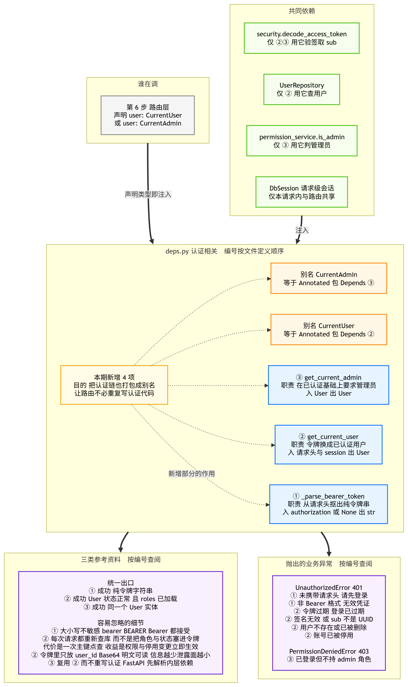
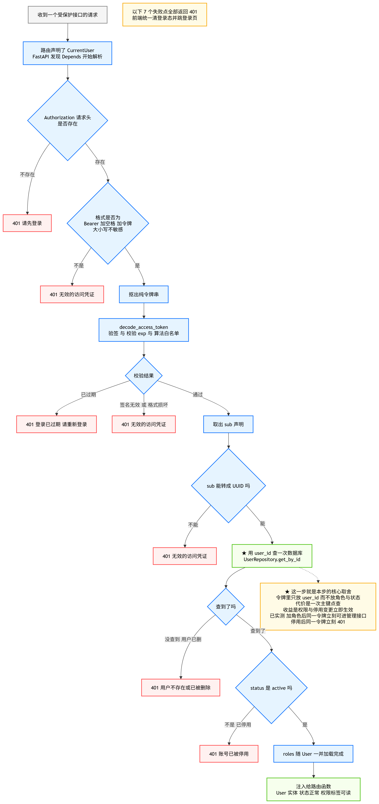
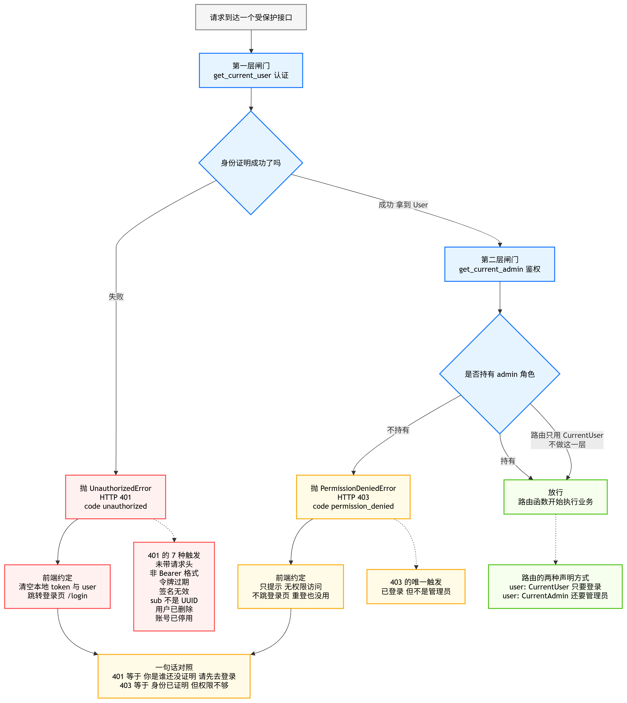

# 05_依赖注入

> 期：**Day11 · 认证、权限与安全检索**
> 章：第 3 章 后端实现 · **第 5 步「依赖注入：CurrentUser 与 CurrentAdmin」**
> 记录日期：2026.09.26

---

## 一、本节在整条链路里的位置

> **前四步把零件都造齐了：能验令牌、能查用户、能判管理员。
> 这一步把三件独立的能力拧成一条「谁来都自动认一下」的流水线。**

```
第 3 章 后端实现
├── 第 1 步  安装依赖与配置项      ← 已归档
├── 第 2 步  数据模型与迁移        ← 已归档
├── 第 3 步  密码哈希与 JWT 工具   ← 已归档
├── 第 4 步  Repository 与 Service ← 已归档
├── 第 5 步  依赖注入             ← 你在这里
├── 第 6 步  路由（/auth、/users、/roles）
└── 第 7 步  权限过滤接入检索 SQL
```

**本节只改一个文件：`app/api/deps.py`（26 → 168 行）。** 不加路由、不加表、不改模型。

| 本步产出 | 性质 |
| --- | --- |
| `_parse_bearer_token` | **新增**，纯字符串处理（不碰库） |
| `get_current_user` | **新增**，依赖：令牌 → 已验证用户 |
| `get_current_admin` | **新增**，依赖：已验证用户 → 管理员 |
| `CurrentUser` / `CurrentAdmin` | **新增**，两个 `Annotated` 类型别名 |

---

## 二、本节解决的问题：把认证链打包成"声明即生效"

### 2.1 没有依赖注入时，每个接口都要重复一遍

```
async def some_route(request: Request, session: AsyncSession = Depends(get_session)):
    auth = request.headers.get("Authorization")          # ① 取请求头
    if not auth or not auth.startswith("Bearer "):       # ② 判格式
        raise UnauthorizedError("请先登录")
    token = auth[7:]
    subject = decode_access_token(token)                 # ③ 验签取 sub
    user = await UserRepository(session).get_by_id(UUID(subject))   # ④ 查库
    if user is None or user.status != UserStatus.ACTIVE:  # ⑤ 判状态
        raise UnauthorizedError(...)
    # 到这里才终于能开始写业务……
```

**这段代码会在每个受保护接口里复制一遍。** 漏掉任何一步都是安全漏洞
（例如漏了 ⑤，被停用的账号还能继续用）。

### 2.2 有依赖注入后

```python
async def some_route(user: CurrentUser, session: DbSession): ...
async def admin_only(user: CurrentAdmin, session: DbSession): ...
```

**路由函数只声明参数类型，认证与鉴权就自动完成。** 完整逻辑只有一份，改一处全局生效。

---

## 三、模块黑盒总览



### 3.1 编号与方法

| 编号 | 名称 | 职责 | 状态 |
| --- | --- | --- | --- |
| ① | `_parse_bearer_token` | 从 `Authorization` 头抠出纯令牌串 | 🆕 本期新增 |
| ② | `get_current_user` | 令牌 → 已认证且状态正常的 User | 🆕 本期新增 |
| ③ | `get_current_admin` | 在②基础上追加"必须是管理员" | 🆕 本期新增 |
| — | `CurrentUser` | `Annotated[User, Depends(get_current_user)]` | 🆕 本期新增 |
| — | `CurrentAdmin` | `Annotated[User, Depends(get_current_admin)]` | 🆕 本期新增 |
| — | `DbSession` | `Annotated[AsyncSession, Depends(get_session)]` | 既有（第 1 期） |

### 3.2 为什么要拆成三个函数

```
_parse_bearer_token   只做「从请求头抠令牌」这一件纯字符串的事
                      —— 与数据库无关、与业务无关
                      —— 拆出来既能被 ② 复用，也便于单独测试
                                （本节验收里就单独测了它 8 项）
        ↓
get_current_user      负责「把令牌换成用户」—— 需要数据库
        ↓
get_current_admin     负责「再判一层权限」—— 复用 ②，不重写认证
```

### 3.3 ⚠️ 本步最关键的设计取舍：为什么每次请求都重新查库

**JWT 是自包含的**，完全可以签发时就把角色名和状态写进令牌，省掉这次查询。**本项目刻意不这么做。**

| 若不查库（把角色塞进令牌） | 本项目（只放 `user_id`，每请求查一次） |
| --- | --- |
| 管理员收回某人的 admin 角色后，**在那个令牌过期前他依然能进管理接口**（最长 24 小时） | 角色变更**立即生效** |
| 停用账号要"最多等 24 小时"才真正生效 | 停用**立即生效** |
| 令牌里角色越多，泄露时暴露的信息越多（**Base64 是明文可读的，不是加密**） | 令牌里只有一个 `user_id`，泄露面最小 |

**代价**：每个受保护请求多一次**主键点查**（走索引的单行查询）。

**这笔交易划算**：用一次廉价查询换取"权限变更立即生效"。

**已实测验证**（用**同一个令牌**，不重新签发）：

```
变更前：访问 CurrentAdmin            → 403
后台给他加 admin 角色 → 同一令牌再访问 → 200   ← 权限立即生效
后台收回 admin 角色   → 同一令牌再访问 → 403   ← 立即失效
后台停用账号          → 同一令牌再访问 → 401   ← 无需等令牌过期
```

### 3.4 关于 `session` 复用（一处容易误解的地方）

`get_current_user` 与路由函数**都依赖 `get_session`**。FastAPI 的**依赖缓存**会把
**同一个** session 实例注入进来 —— 注意是**本请求内共享**，不是跨请求共享：

```
✅ 正确理解：同一次请求里，认证用的 session 与业务用的 session 是同一个
❌ 错误理解：所有请求共用一个 session（那是灾难，会串事务）
```

**好处**：共享身份映射（Identity Map，同一行不会查两次），也避免跨会话的对象游离问题。

---

## 四、流程图一 · 令牌 → 已认证用户 的完整链路



```
收到请求
  └─ Authorization 请求头存在吗？ ── 否 ─→ 401 请先登录
       └─ 是：格式是 "Bearer 加空格 加令牌" 吗？── 否 ─→ 401 无效的访问凭证
            └─ 是：抠出令牌 → decode_access_token 验签 + 校验 exp + 算法白名单
                 ├─ 已过期 ────────→ 401 登录已过期，请重新登录
                 ├─ 签名无效/损坏 ──→ 401 无效的访问凭证
                 └─ 通过：取出 sub
                      └─ sub 能转成 UUID 吗？── 否 ─→ 401 无效的访问凭证
                           └─ 是：★ 用 user_id 查一次数据库
                                ├─ 没查到（用户已删）→ 401 用户不存在或已被删除
                                ├─ status 不是 active → 401 账号已被停用
                                └─ 是：roles 随 User 一并加载完成
                                     └─ 注入给路由函数
```

**这张图的价值在于**：一眼看清**7 个失败点分布在哪些环节**，
以及 ★ 那一查库换来的是什么（见 §3.3）。

> ⚠️ 注意一个细节：`decode_access_token` 只保证「签名合法且未过期」，
> **不保证 payload 里的业务字段齐全**。所以 `sub` 转 UUID 这一步不能省 ——
> 缺 `sub`、`sub` 是数字、`sub` 不是 UUID 这三种情况实测都被挡住了（401 而不是 500）。

---

## 五、流程图二 · 认证与鉴权两层闸门（401 与 403 的分界）



```
请求到达受保护接口
  │
  ├─ 第一层闸门：get_current_user（认证）
  │     身份证明成功了吗？
  │       ├─ 失败 → 401 UnauthorizedError（code=unauthorized）
  │       └─ 成功 → 拿到 User
  │
  └─ 第二层闸门：get_current_admin（鉴权）
        持有 admin 角色吗？
          ├─ 不持有 → 403 PermissionDeniedError（code=permission_denied）
          └─ 持有   → 放行，路由函数开始执行业务
```

**这两层的分工，正好对应第 3 步归档里那张「401 与 403」的图：**

| | 401 | 403 |
| --- | --- | --- |
| 语义 | **"你是谁"没证明成功** | **身份已证明，但权限不够** |
| 触发 | 7 种（见下表） | 1 种：已登录但不是管理员 |
| 前端约定 | **清登录态 + 跳 `/login`** | **只提示"无权限"，不跳登录页**（重登也没用） |

---

## 六、异常映射表（按编号查阅，与代码一一对应）

`deps.py` 里实际有 **6 个 raise 点**，全部覆盖如下：

| 编号 | 触发条件 | 异常 | 状态码 | 文案 |
| --- | --- | --- | --- | --- |
| ① | 未携带 `Authorization` 请求头 | `UnauthorizedError` | 401 | 请先登录 |
| ① | 非 Bearer 格式 / 只有前缀无令牌 | `UnauthorizedError` | 401 | 无效的访问凭证 |
| ② | 令牌已过期 | `UnauthorizedError` | 401 | 登录已过期，请重新登录 |
| ② | 签名无效 / 格式损坏 / `sub` 不是 UUID | `UnauthorizedError` | 401 | 无效的访问凭证 |
| ② | 用户不存在（已被删除） | `UnauthorizedError` | 401 | 用户不存在或已被删除 |
| ② | 账号已被停用 | `UnauthorizedError` | 401 | 账号已被停用 |
| ③ | 已登录但不持 admin 角色 | `PermissionDeniedError` | 403 | 仅管理员可访问 |

> 📌 代码里 `无效的访问凭证` 有 **2 个 raise 点**（请求头格式 / 验签失败），
> 表里合并成两条是因为**对前端来说文案相同**，合并展示更清楚。

### 6.1 为什么"未携带"与"格式错误"要给不同文案

两者都是 401，但语义不同：

- **没带请求头** → 用户就是没登录，提示"请先登录"，前端跳登录页是正确反应；
- **带了但不是 Bearer** → 多半是前端拼错了请求头（例如漏了 `"Bearer "` 前缀），
  提示"无效的访问凭证"能让开发者更快定位到是**客户端构造请求**的问题。

---

## 七、容易忽略的细节速查表

| 编号 | 细节 | 为什么 |
| --- | --- | --- |
| ① | **大小写不敏感**：`bearer` / `BEARER` / `Bearer` 都接受 | HTTP 规范里认证方案名大小写不敏感。用 `partition(" ")` 只按第一个空格切分，比 `split` 安全（不会因多余空格抛解包错误） |
| ② | **每次请求都重新查库**，而不是把角色与状态塞进令牌 | 见 §3.3：用一次主键点查换"权限变更立即生效" |
| ② | **令牌里只放 `user_id`** | Base64 是明文可读的（不是加密），里面信息越少泄露面越小 |
| ③ | **复用 ② 而不重写认证** | 依赖套依赖，FastAPI 会先解析内层依赖。认证逻辑只此一份，将来加"令牌黑名单"只需改一处 |
| ②③ | **与路由共享同一个 session** | 靠 FastAPI 的依赖缓存，**仅限本请求内**；同一行不会查两次 |

---

## 八、验证结果（真机执行，29 项全通过）

> 方式：真库 + `httpx.ASGITransport` 直连 ASGI app（不启 uvicorn），全程单事件循环。

### 8.1 `_parse_bearer_token` 纯函数（8 项）

| 验证项 | 结果 |
| --- | --- |
| 正常值取出令牌 | ✅ |
| **小写 `bearer` 接受** | ✅ |
| **大写 `BEARER` 接受** | ✅ |
| `None` → 401「请先登录」 | ✅ |
| 空串 → 401 | ✅ |
| 无 scheme（`"abc"`）→ 401「无效的访问凭证」 | ✅ |
| 非 Bearer（`"Basic abc"`）→ 401 | ✅ |
| 只有前缀无令牌（`"Bearer "`）→ 401 | ✅ |

### 8.2 令牌各阶段失败（9 项）

| 场景 | 状态码 | 响应体 |
| --- | --- | --- |
| 不带请求头 | **401** | `{'code': 'unauthorized', 'message': '请先登录'}` |
| 非 Bearer | 401 | — |
| 乱码令牌 | 401 | — |
| 签名被篡改 | 401 | — |
| 别的密钥签的 | 401 | — |
| 过期令牌 | 401 | `{'code': 'unauthorized', 'message': '登录已过期，请重新登录'}` |
| **`sub` 不是 UUID** | **401（不是 500）** | — |
| 缺 `sub` | 401 | — |

### 8.3 成功路径与权限判定（6 项）

| 验证项 | 结果 |
| --- | --- |
| 普通用户访问 `CurrentUser` | ✅ 200，返回的是自己 |
| **`roles` 已加载并可读** | ✅ 返回 `roles: 1` |
| admin 访问 `CurrentAdmin` | ✅ 200 |
| 普通用户访问 `CurrentAdmin` | ✅ **403**，`{'code': 'permission_denied', 'message': '仅管理员可访问'}` |
| **是 403 而不是 401** | ✅ |
| 令牌有效但用户已删除 | ✅ 401「用户不存在或已被删除」 |
| 账号已停用 | ✅ 401「账号已被停用」 |

### 8.4 ★ 两个"立即生效"的实测（4 项）

| 验证项 | 结果 |
| --- | --- |
| 变更前访问 `CurrentAdmin` | 403 |
| **加 admin 角色后、仍用同一个令牌** | ✅ **200**（权限立即生效） |
| **收回 admin 角色后、仍用同一个令牌** | ✅ **立刻回到 403** |
| **停用后、仍用同一个令牌** | ✅ **立刻 401**（无需等令牌过期） |

> 这 4 项是本步最有说服力的证据 —— 它们证明"令牌里不带角色"这件事真的做到了。

### 8.5 收尾与回归

| 项 | 结果 |
| --- | --- |
| 测试数据清理 | `users=0` `roles=0` `user_roles=0` `documents=10` |
| `deps` 导入 | ✅ `CurrentUser` / `CurrentAdmin` / `DbSession` / 两个函数均可导入 |
| `import app.main` | ✅ 正常 |
| OpenAPI 路径数 | ✅ **20 条不变**（本节不加路由） |

---

## 九、遗留与下一步的坑

| # | 事项 | 说明 |
| --- | --- | --- |
| 1 | **⚠️ 种子管理员初始化还没接** | 教程在本步末尾提到"首次启动时自动建好管理员账号"。所需两件都已就位：`UserRepository.count_all()`（"库内无用户"判据）+ `settings.default_admin_*`（三个配置项）。**但播种动作属启动流程**（改 `create_app()` 或加 lifespan），建议**第 6 步一起做** —— 因为那时才有 `/auth/login` 可以验证它 |
| 2 | **`hash_password` 的 72 字节上限**（第 4 步遗留） | `UserService.create_user` / `update_user` 目前只校验"至少 4 位"。超 72 字节的密码会让 `hash_password` 抛**未捕获**的 `ValueError` → 500。**第 6 步写 `/users` 路由时在 Pydantic schema 上加 `max_length=72`**，让它返回 422 |
| 3 | **缺少"令牌主动吊销"能力** | JWT 无状态的固有代价：管理员无法强制某人立刻下线（只能靠停用账号，本步已支持）。若将来需要，得引入 Redis 黑名单 —— 本期不做 |
| 4 | **`CurrentAdmin` 的判据是角色名** | `is_admin` 比对的是 `"admin"` 角色名。这也解释了为什么 `RoleService.update_role` 不允许改名（第 4 步归档 §6.3 防呆 2）—— 两处是同一条链上的依赖 |

---

## 十、本节地图

```
第 5 步「依赖注入」
├── 改一个文件  app/api/deps.py（26 → 168 行）
├── 三个函数
│   ├── ① _parse_bearer_token  纯字符串，不碰库
│   ├── ② get_current_user     令牌 → 用户（含 7 个失败点）
│   └── ③ get_current_admin    追加管理员判定（复用②）
├── 两个别名
│   ├── CurrentUser   → 声明即"必须登录"
│   └── CurrentAdmin  → 声明即"必须管理员"
└── ★ 核心取舍：每请求重查库，换"权限与停用变更立即生效"

验证 29 项全通过 · 回归：OpenAPI 20 条路径不变
遗留：种子管理员未接（第 6 步）/ 72 字节上限（第 6 步）
```

---

## 十一、最应该学习的图

**`03_认证与鉴权两层闸门流程图.png`**
> 401 与 403 的**分界点**就在"身份证明成功了吗"这一岔。
> 这是本期最常被写错的一处，也是前端分支逻辑的依据。
> **承接第 3 步那张「401 与 403 判定及前端响应分工」，两张一起看就彻底钉住了。**

**`01_deps认证依赖黑盒总览.png`**
> 一眼看清"新增了什么、为了干什么"，以及三个函数的职责边界。
> 配合 §六、§七 两张速查表，等于这一节的完整索引。

---

## 十二、自查 5 题

1. 为什么本项目宁可每个请求多查一次库，也不把角色和状态写进令牌里？说出至少两个理由。
2. `get_current_admin` 为什么抛 **403** 而不是 **401**？两者对前端的含义分别是什么？
3. `_parse_bearer_token` 为什么对"没带请求头"和"格式不对"给不同的文案？两者状态码相同，区分的价值在哪？
4. 为什么 `sub` 已经是"签名保护过的"数据，还要再校验它能否转成 UUID？
5. 路由里写 `user: CurrentUser` 与写 `user: CurrentAdmin` 分别会发生什么？后者多了哪一层？

---

## 十三、本节实际新增或修改文件

```
后端
└── backend/app/api/deps.py     【修改】26 → 168 行
      ├── 既有：DbSession（未改动）
      ├── 新增 ① _parse_bearer_token
      ├── 新增 ② get_current_user
      ├── 新增 ③ get_current_admin
      └── 新增 CurrentUser / CurrentAdmin 两个类型别名

归档
└── 项目阶段性总结/Day11_认证、权限与安全检索/02_2026.9.26/04_backend_app_api_deps/
    ├── 05_依赖注入.md                            【本文件】
    ├── 01_deps认证依赖黑盒总览.png
    ├── 02_令牌到用户完整链路流程图.png
    └── 03_认证与鉴权两层闸门流程图.png
```

> 下一节：**第 6 步「路由层」** —— `/api/auth/login`、`/api/auth/me`、`/api/users`、`/api/roles`，
> 对齐前端已写死的 **12 个 operationId**；同时接上**种子管理员初始化**并补掉 **72 字节上限**。
