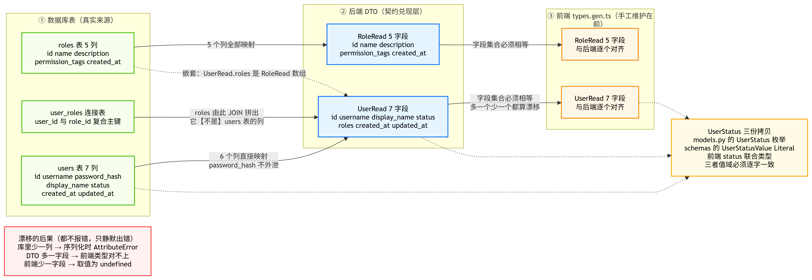
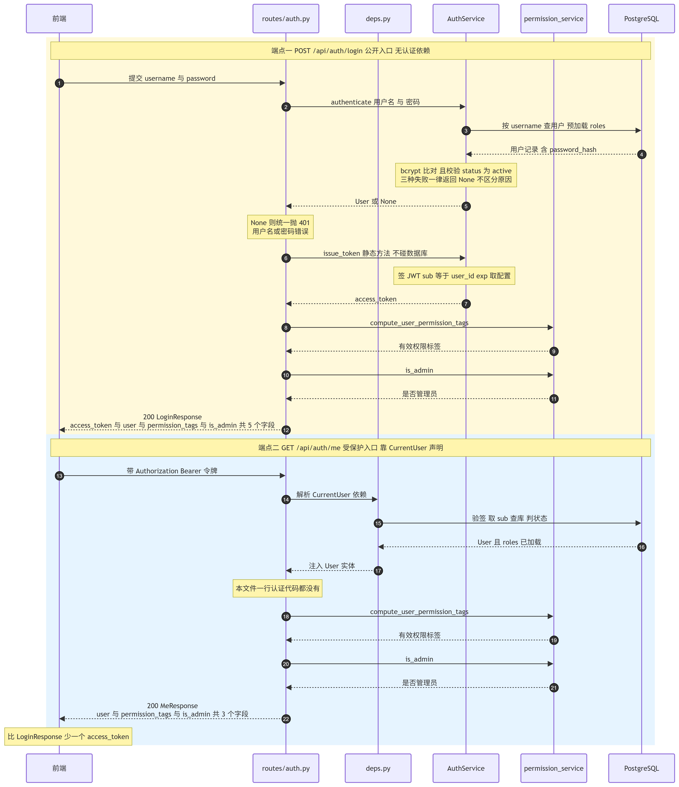
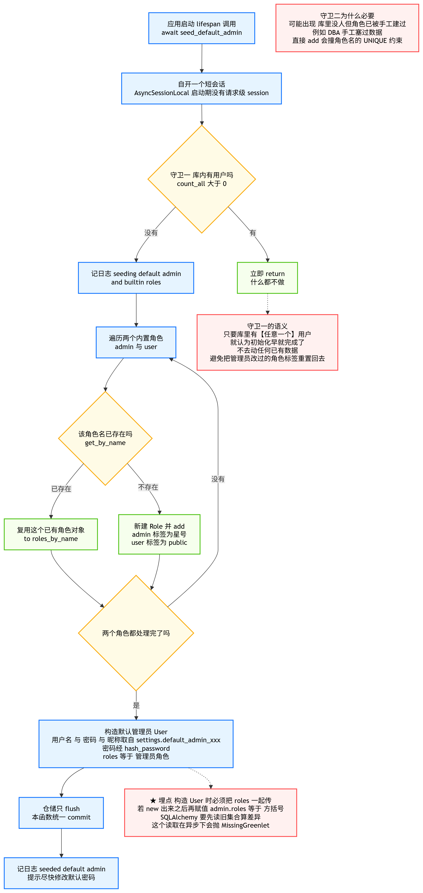
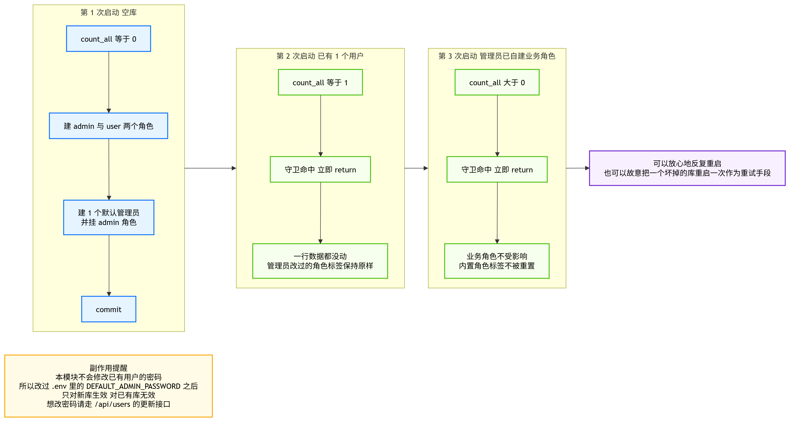

# 06_登录路由与初始化管理员

> 期：**Day11 · 认证、权限与安全检索**
> 章：第 3 章 后端实现 · **第 6 步「登录路由与初始化管理员」**
> 记录日期：2026.09.26

---

## 一、本节在整条链路里的位置

> **前五步把零件和流水线都造好了，但整个系统还没有一个"门"。
> 这一步装上两个门：一个让人进来（登录），一个让人照镜子（/me），
> 并且保证新库第一次启动就有人能进来。**

```
第 3 章 后端实现
├── 第 1 步  安装依赖与配置项      ← 已归档
├── 第 2 步  数据模型与迁移        ← 已归档
├── 第 3 步  密码哈希与 JWT 工具   ← 已归档
├── 第 4 步  Repository 与 Service ← 已归档
├── 第 5 步  依赖注入             ← 已归档
├── 第 6 步  登录路由与初始化管理员 ← 你在这里（本章【完整】）
│      ├── schemas/auth.py   契约层
│      ├── routes/auth.py    /login 与 /me
│      ├── db/seed.py        种子初始化
│      └── main.py 的 lifespan 接线
│
└── 第 7 章  用户与角色管理路由     ← 下一个目标（不是本章的剩余部分）
      └── /api/users 与 /api/roles 共 10 个端点
```

> 📌 **章节归属说明（已核对）**：教程在本步末尾那句「接下来要让 admin 能管理用户和角色」
> 引出的是**独立的第 7 章**（教程标题为「7、用户与角色管理」），
> 而不是本章的后半。**所以本节是完整的一节，不存在"未写完"的部分。**

**本节四个文件的分工**：

| 文件 | 行数 | 角色 |
| --- | --- | --- |
| `app/api/schemas/auth.py` | 150 | **契约层**：对外请求 / 响应的形状 |
| `app/api/routes/auth.py` | 97 | **传输层**：两个端点 |
| `app/db/seed.py` | 133 | **启动初始化**：内置角色 + 默认管理员 |
| `app/main.py` | 195 | **装配层**：lifespan 钩子 + 路由挂载 |

---

## 二、契约层 · `schemas/auth.py`

### 2.1 三方契约对齐图



**这张图钉住了三件容易搞错的事**：

| # | 结论 | 说明 |
| --- | --- | --- |
| 1 | **`roles` 不是 `users` 表的列** | 它来自 `user_roles` 连接表 JOIN（本项目实测确认）。所以「DTO 字段必然对应数据库列」这个直觉是错的 |
| 2 | **`password_hash` 有意不外泄** | `users` 表 7 列，`UserRead` 只用其中 6 列 + `roles` |
| 3 | **`UserStatus` 有三份拷贝** | `models.py` 的枚举 / 本文件的 `Literal` / 前端的联合类型 —— **三份，不是两份** |

### 2.2 三方对账实测结果（9/9）

```
users 表 7 列：id, username, password_hash, display_name, status, created_at, updated_at
roles 表 5 列：id, name, description, permission_tags, created_at

UserRead 里【直接来自 users 表列】的：id, username, display_name, status, created_at, updated_at
UserRead 里【来自 relationship】的  ：roles

PASS  UserRead 的列字段在 users 表都有对应列
PASS  UserRead 的关系字段确实来自 relationship（roles 不在表里）
PASS  RoleRead 每个字段在 roles 表都有对应列
PASS  UserRead 不含 password_hash
PASS  users 表未暴露的列恰好只有 password_hash
PASS  前端 UserRead 字段集合与后端一致（差集两侧都为空）
PASS  前端 RoleRead 字段集合与后端一致
PASS  UserStatus 三份：models=['active','disabled'] / schema 同 / frontend 同
PASS  models 与 schema 的 UserStatus 逐字一致（含顺序）
```

> ⚠️ **对账脚本本身也踩过一次坑，值得记**：最初的断言写的是
> 「`UserRead` 每个字段在 `users` 表都有对应列」，结果 `roles` 报错。
> 这不是代码 bug，而是**断言把"关系字段"和"列字段"混为一谈了**。
> 修正后按两类分别断言 —— 这个分类本身就是这张图要传达的核心。

### 2.3 六个模型

| 模型 | 字段 | 用途 |
| --- | --- | --- |
| `UserStatusValue` | `Literal["active", "disabled"]` | 与 `models.UserStatus` 逐字对齐 |
| `RoleRead` | `id` / `name` / `description` / `permission_tags` / `created_at` | 角色读模型 |
| `UserRead` | `id` / `username` / `display_name` / `status` / `roles` / `created_at` / `updated_at` | 用户读模型 |
| `LoginRequest` | `username` / `password` | 登录请求体 |
| `LoginResponse` | `access_token` / `token_type` / `user` / `permission_tags` / `is_admin` | 登录响应 |
| `MeResponse` | `user` / `permission_tags` / `is_admin` | 当前用户视图 |

### 2.4 两个设计点

**① `RoleRead` 为什么没有 `Role.users`**

角色与用户是多对多：一个角色可能被成百上千个用户持有。若在这里带上 `users`，
查一个用户就会连带拉出整棵"用户-角色-用户"的树。需要"这个角色有哪些用户"时，
应当去 `/api/users` 按角色筛选，而不是从角色对象反查。

**② `LoginRequest` 为什么不做长度校验**

```
创建用户时校验密码长度是【业务规则】（我们规定至少 4 位），要给出明确的 400；
登录时若对格式做限制，会向外泄露"哪些输入格式才是合法账号"的信息。
登录失败一律回 401「用户名或密码错误」，不区分"格式不对"还是"密码不对"。
```

---

## 三、传输层 · `routes/auth.py`

### 3.1 两个端点的认证路径对比



**这张图是本节的"理解点"**，一眼看清三件事：

| # | 看清什么 |
| --- | --- |
| 1 | **两条链路的认证机制根本不同**：`login` 靠**密码**（查库比对哈希），`/me` 靠**令牌**（依赖注入解析）。`login` 是全项目唯一公开的业务端点 |
| 2 | **`/me` 为什么本文件零认证代码**：`deps.py` 那一整段（验签 → 查库 → 判状态）被折叠成参数声明 `user: CurrentUser` |
| 3 | **两个端点最后走同一段权限计算**，差别只在返回字段数（5 个 vs 3 个） |

### 3.2 端点总表

| 方法 | 路径 | operationId | 认证 | 响应模型 | 成功码 |
| --- | --- | --- | --- | --- | --- |
| POST | `/api/auth/login` | `login` | **无**（公开） | `LoginResponse` | 200 |
| GET | `/api/auth/me` | `getCurrentUser` | `CurrentUser` | `MeResponse` | 200 |

> `operation_id` 必须与前端 `types.gen.ts` / `sdk.gen.ts` 里已写死的契约**逐字一致**，
> 否则前端生成的 SDK 函数名会对不上。

### 3.3 登录失败为什么统一文案

```python
if user is None:
    raise UnauthorizedError("用户名或密码错误")
```

`AuthService.authenticate` 已经把三种失败（用户名不存在 / 密码不对 / 账号停用）
合并成同一个 `None`，路由层必须**沿用同一个笼统文案**，否则前面那层合并就白做了 ——
分开提示会让攻击者能拿用户名字典探测出"哪些账号真实存在"。

**实测确认**：密码错与用户名不存在两种情况的响应体**完全相同**：

```
密码错         → 401 {'code': 'unauthorized', 'message': '用户名或密码错误'}
用户名不存在   → 401 {'code': 'unauthorized', 'message': '用户名或密码错误'}
```

### 3.4 401 而不是 400

账号密码不对属于"身份没证明成功"，用 401（未认证）而不是 400（参数不合法）——
因为**请求体格式完全合法，问题出在凭据本身**。

---

## 四、启动初始化 · `db/seed.py`

### 4.1 主流程与两道守卫



| 守卫 | 逻辑 | 防住什么 |
| --- | --- | --- |
| **守卫一** | `count_all() > 0` → 立即 `return` | **幂等**：只要库里有任意一个用户，就认为初始化早就完成，**不去动任何已有数据**（避免把管理员改过的角色标签重置回去） |
| **守卫二** | 逐个 `get_by_name`，存在即复用 | 可能出现"库里没人、但角色已被手工建过"（DBA 手工塞过数据）→ 直接 `add` 会撞角色名的 **UNIQUE 约束** |

### 4.2 ⚠️ 那个已经踩过两次的坑

```python
# ★ roles 必须【在构造时】就传进去
admin_user = User(
    username=...,
    password_hash=...,
    display_name=...,
    status=UserStatus.ACTIVE,
    roles=[roles_by_name["admin"]],   # ← 构造参数
)
```

若写成"先 new 再赋值"（`admin_user.roles = [...]`），SQLAlchemy 会先读旧集合算差异，
而这个读取动作在异步驱动下会抛 `MissingGreenlet`。
**第 4 步已实测确认，`user_service.create_user` 也是同样的写法。**

### 4.3 两个内置角色的标签为什么这么定

| 角色 | 标签 | 含义 |
| --- | --- | --- |
| `admin` | `["*"]` | **通配**。第 7 步的检索 SQL 识别到它会**直接跳过权限过滤** —— 既跑得最快，也符合"管理员看全量"的预期 |
| `user` | `["public"]` | **注意它不是空数组**。空数组的文档对所有人可见（公开语义），而 `user` 的标签用于匹配那些**明确标了** `public` 的文档。两者语义不同，不要混 |

### 4.4 幂等性：三次启动各发生什么



| 启动次序 | 库内状态 | 本模块行为 |
| --- | --- | --- |
| 第 1 次 | 空库 | 建 2 个内置角色 + 1 个默认管理员（挂 admin 角色） |
| 第 2 次 | 已有 1 个用户 | **守卫命中，一行数据都没动** |
| 第 3 次 | 管理员已自建业务角色 | **守卫命中，业务角色不受影响、内置角色标签不被重置** |

**好处**：可以放心反复重启，也可以故意把坏掉的库重启一次作为重试手段（因为幂等）。

**⚠️ 一个容易被误解的副作用**：

```
改了 .env 里的 DEFAULT_ADMIN_PASSWORD
        ↓
只对【新库】生效 —— 因为已有库会被守卫一直接短路掉
        ↓
想改已有库的 admin 密码，只能走 /api/users 的更新接口
```

这不是 bug，而是"幂等 + 不碰已有数据"的必然结果。

---

## 五、装配层 · `main.py` 的 lifespan

```python
@asynccontextmanager
async def lifespan(_app: FastAPI) -> AsyncIterator[None]:
    logger = get_logger(__name__)
    settings.warn_if_jwt_unconfigured()      # 密钥自检
    try:
        await seed_default_admin()           # 种子初始化
    except Exception:
        logger.exception("种子初始化失败；后续可重新启动重试")
    yield
```

### 5.1 为什么种子初始化必须放 lifespan

它是**异步**的（要查库、要写入），而 `create_app()` 是**同步函数** ——
放进去只能靠 `asyncio.run` 硬跑，会在"恰好在事件循环里调用 `create_app`"时直接报错。
lifespan 天生运行在事件循环里，`await` 是自然的。

### 5.2 顺带解决了第 1 步的一个悬案

第 1 步加的 `settings.warn_if_jwt_unconfigured()` 一直**没有任何调用点**（死代码）。
当时的问题是"该在哪调用它"：

```
放在 create_app() 里不合适 —— 那时 configure_logging() 还没执行，
                            告警会以默认格式输出
放在 lifespan 里就对了    —— 日志系统早已就绪，且服务还没开始接请求
```

**所以第 1 步归档里那个"选项 A"落地了，那条遗留可以关掉。**

### 5.3 为什么初始化失败不阻断启动

种子初始化失败只意味着"可能登不进去"，而不该让整个服务起不来 ——
那样连 `/docs` 都看不了，反而更难排查。记下异常堆栈，修好后重启即可重试（幂等，所以重启是安全的重试方式）。

---

## 六、与教程的偏离（4 处，逐条修正过措辞）

> ⚠️ **本节初稿的两张对照表里有一句硬错、一句夸大，已修正**。
> 下面这版是逐条实测核对后的准确表述。

| # | 教程 | 本项目 | 准确的"为什么" |
| --- | --- | --- | --- |
| 1 | `UserRead.roles: list[RoleRead] \| None` | `list[RoleRead]`（非 Optional） | 教程的 `Optional` 在 Pydantic 里**是合法的**（允许显式传 `None`），**不是自相矛盾**。但本项目 `lazy="selectin"` 下 relation **永远已加载、取不到 `None`** —— 去掉 Optional 是让类型反映真实约束。若真返回 `None`，前端声明为 `Array<RoleRead>` 的字段会收到 `null`，`.map()` 会崩 |
| 2 | lifespan 里 `if not settings.jwt_secret` 内联判断 | `settings.warn_if_jwt_unconfigured()` | **行为完全等价（已实测）**：`jwt_configured` 就是 `bool(jwt_secret)`；空密钥时打 ERROR、有密钥时一条都不打。封装成 config 的方法，顺带让第 1 步那个"死代码"活了过来 |
| 3 | `create_app()` 里用 `# ... 略 ...` 省略 | 完整实现 + **注册 auth 路由** | 教程给出了 lifespan 的完整实现，但省略了"怎么把 router 挂上去"—— 而那正是必须自己写对的地方。不注册则 `/api/auth/login` 直接 404 |
| 4 | （第 2 步本就有"生成迁移"这一步） | **额外一个迁移补 `users.updated_at`** | **不是"教程没写迁移"**。真实原因是：第 2 步我建的 `User` 模型与教程分叉（我多加了 `updated_at` 又按"严格跟教程"删掉），导致第 6 步教程的 `UserRead` 声明了 `updated_at` 却无列可读。**补回来是"消除分叉"** |

### 6.1 关于第 4 处那个额外迁移的两个技术点

```python
# 迁移 4f198960f636_add_users_updated_at
op.add_column('users', sa.Column('updated_at', sa.DateTime(timezone=True),
              server_default=sa.text('now()'), nullable=False, ...))
```

| 技术点 | 说明 |
| --- | --- |
| **`server_default=now()` 是必需的** | 这列是 `NOT NULL` 且库里已有 1 个 admin 行。没有数据库侧默认值，PostgreSQL 会因"存量行无法满足非空约束"**直接拒绝 ALTER TABLE**。执行前特意核过迁移文件确认它带着 `server_default` 才跑 |
| `server_default` 与 `onupdate` 分工不同 | 前者只管"加列时怎么回填历史数据"；模型上的 `onupdate=func.now()` 管"以后每次 UPDATE 自动刷新"。**两者都不可少** |

**实测**：执行后有存量 admin 行被正确回填，7 列齐全。

---

## 七、验证结果

### 7.1 第一轮：种子 + 登录 + /me（38/38）

**种子初始化（10 项）**

```
创建 1 个用户；用户名 / 昵称取自 settings.default_admin_*
密码已哈希（$2b$ 前缀，非明文）
创建 2 个内置角色：admin 持 ['*']、user 持 ['public']
admin 用户已挂 admin 角色（user_roles 1 行）
幂等：再跑一次 seed，用户 / 角色 / 关联行数量全不变
```

**登录（10 项）**

```
正确凭据 → 200，响应体字段与前端契约精确一致
permission_tags = ['*']、is_admin = True
响应中【不含 password_hash】
令牌 sub = 用户 id、exp - iat = 86400s（= 1440 分钟）
密码错 → 401「用户名或密码错误」
用户名不存在 → 401 且文案与密码错【完全相同】（防侧信道）
缺 password → 422（框架级参数校验）
```

**/me（8 项）**

```
带令牌 → 200，字段集合恰好 = {user, permission_tags, is_admin}
不含 access_token（与 LoginResponse 的区别）
不带令牌 / 坏令牌 / 过期令牌 → 全部 401
★ 停用账号后、同一令牌访问 /me → 立刻 401
```

### 7.2 第二轮：补时间戳后复验（14/14）

```
seed 成功，created_at 与 updated_at 都有值
★ user 字段集合 = 7 个，与前端契约逐字一致
  ['created_at','display_name','id','roles','status','updated_at','username']
created_at / updated_at 都是 ISO 时间串
roles 仍是数组（非 null），role 字段仍是 5 个
me.user 也是 7 个字段
★ updated_at 真的会自动刷新：
    改名前 2026-09-26T09:40:37.030964Z
    改名后 2026-09-26T09:40:38.083193Z   ← onupdate 生效
  created_at 保持不变
```

### 7.3 三方契约对账（9/9）

见 §2.2。

### 7.4 回归

| 项 | 结果 |
| --- | --- |
| OpenAPI 路径数 | 20 → **22** |
| operationId 总数 | **29 个且唯一** |
| `login` / `getCurrentUser` | ✅ 均存在 |
| 前端 `tsc -b` | ✅ **exit 0** |
| `alembic head` | `4f198960f636` |
| 数字对账 | 第 7 步归档记的"27 个 operationId" + 本次 2 个 = **29** ✅ 无意外丢失 |

---

## 八、本节地图

```
第 6 步（前半）「登录路由与初始化管理员」
├── schemas/auth.py   6 个模型（150 行）
│     ├── UserStatusValue / RoleRead / UserRead
│     └── LoginRequest / LoginResponse / MeResponse
│     └── ★ 三方契约对齐：DB 列 / 后端 DTO / 前端类型
├── routes/auth.py    2 个端点（97 行）
│     ├── POST /login  operationId=login          公开端点
│     └── GET  /me     operationId=getCurrentUser 需认证
├── db/seed.py        2 个内置角色 + 1 个默认管理员（133 行）
│     ├── 守卫一 count_all() > 0 → 幂等
│     ├── 守卫二 get_by_name 存在即复用 → 不撞 UNIQUE
│     └── ★ 构造 User 时必须带 roles
└── main.py           lifespan 钩子 + 挂载 auth 路由（195 行）
      └── 顺带唤醒第 1 步的 warn_if_jwt_unconfigured()

验证：38 + 14 + 9 全通过 · 回归：22 条路径 / 29 个 operationId / 前端 tsc 通过
```

---

## 九、最应该学习的图

**`02_两个端点的认证路径对比.png`**
> 一眼看清"公开端点 vs 受保护端点"的认证机制差异，以及 `/me` 为什么本文件零认证代码。
> 这是本节唯一需要理解（而非记忆）的地方。

**`03_seed主流程与两道守卫.png`**
> 一眼看清"两道守卫各防什么"和那个"必须构造时传 roles"的坑。
> 配合 `04_幂等性` 那张看，`seed.py` 就彻底清楚了。

---

## 十、自查 5 题

1. `POST /login` 是唯一公开的业务端点，为什么？`/me` 为什么不能也公开？
2. 登录失败时，"用户名不存在"与"密码错误"为什么必须返回**完全相同**的文案？
3. `seed_default_admin` 的第一个守卫是 `count_all() > 0`，它防的是什么？第二个守卫 `get_by_name` 又防什么？
4. 构造 `User` 时如果把 `roles` 留到 `add()` 之后再赋值，会抛什么异常？为什么？
5. `users.updated_at` 这个迁移为什么必须带 `server_default=now()`？不带会怎样？

---

## 十一、✅ 第 6 章已完整完成，以及第 7 章的预告

教程在本步末尾写着：

> **「登录和初始化让系统能登录进来了，接下来要让 admin 能管理用户和角色。」**

> 📌 **这句话引出的是独立的第 7 章（「7、用户与角色管理」），不是本章的后半。**
> **本节（第 6 章）到此完整结束，不存在未写完的部分。**

### 11.1 第 6 章交付的端点（2 个，全部完成）

| 端点 | operationId | 状态 |
| --- | --- | --- |
| `POST /api/auth/login` | `login` | ✅ |
| `GET /api/auth/me` | `getCurrentUser` | ✅ |

### 11.2 第 7 章要做的端点（10 个，尚未开始）

| 端点 | operationId |
| --- | --- |
| `GET /api/users` | `listUsers` |
| `POST /api/users` | `createUser` |
| `GET /api/users/{user_id}` | `getUser` |
| `PATCH /api/users/{user_id}` | `updateUser` |
| `DELETE /api/users/{user_id}` | `deleteUser` |
| `PUT /api/users/{user_id}/roles` | `assignUserRoles` |
| `GET /api/roles` | `listRoles` |
| `POST /api/roles` | `createRole` |
| `PATCH /api/roles/{role_id}` | `updateRole` |
| `DELETE /api/roles/{role_id}` | `deleteRole` |

> **好消息**：这 10 个端点的业务逻辑**已经全部写好了** —— 第 4 步的 `UserService` / `RoleService`
> 已经把 11 个方法的实现与校验做完（54 项测试通过）。
> **第 7 章只是"把已有 Service 暴露成 HTTP"**，与第 10 期写 `routes/evaluations.py` 是同类工作。
>
> 预计：4 个新文件（`schemas/users.py`、`schemas/roles.py`、`routes/users.py`、`routes/roles.py`）
> + 改 `main.py`，完成后 OpenAPI 从 22 条路径 / 29 个 operationId 变成 **26 条路径 / 39 个 operationId**。
> 届时前端 `sdk.gen.ts` 里已写死的 12 个 operationId 就全部兑现了。

### 11.3 从本节带入第 7 章的待办

| # | 事项 | 说明 |
| --- | --- | --- |
| 1 | **补 72 字节上限** | `UserService.create_user` / `update_user` 目前只校验"至少 4 位"。超 72 字节的密码会让 `hash_password` 抛**未捕获**的 `ValueError` → 500。建议在 users 的 schema 上加 `max_length=72`，让它在参数校验层返回 422（第 4 步遗留，第 7 章正是写这些 schema 的地方） |
| 2 | **恢复前端 `RequireAdmin`** | 第 10 期为了跑通评测控制台，把它临时改成直通（`RequireAdmin.tsx` 里有完整注释与恢复方法）。现在后端有 `CurrentAdmin` 了，而且第 7 章正好要写管理端点，适合一并恢复 |
| 3 | **`users` 时间戳的前端展示** | 契约里有了（`created_at` / `updated_at`），但 `UsersPage.tsx` 的表格列里没有。属前端范围，可选 |

### 11.4 本节新发现的一个边界（不是第 7 章的事，仅记档）

**`count_all() > 0` 这个幂等守卫偏粗**：它假设"库里有用户" ⇒ "初始化完成"。
理论上存在"库里已被手工插了 1 个用户，但两个内置角色不存在"的半初始化状态，
此时本次启动会跳过、内置角色永远建不出来。

**后果不严重**（有用户能登录，只是缺内置角色），且正常部署不会出现。
更严谨的写法是分别检查三个前置条件（有没有 admin 角色 / user 角色 / 至少一个用户）。
**建议保持教程原样**，仅在此记档。

---

## 十二、本节实际新增或修改文件

```
后端
├── backend/app/api/schemas/auth.py      【新增】150 行 · 6 个契约模型
├── backend/app/api/routes/auth.py       【新增】 97 行 · /login 与 /me
├── backend/app/db/seed.py               【新增】133 行 · 内置角色 + 默认管理员
├── backend/app/main.py                  【修改】+54 行 · lifespan 钩子 + 挂载 auth 路由
├── backend/app/db/models.py             【修改】User 补回 updated_at（+ 模块头部说明）
└── backend/alembic/versions/
      └── 4f198960f636_add_users_updated_at.py   【新增】迁移

前端
└── （本步未改动；`types.gen.ts` 的 UserRead 7 字段原本就已对齐，无需修改）

归档
└── 项目阶段性总结/Day11_认证、权限与安全检索/02_2026.9.26/05_backend_app_api_schemas_auth++backend_app_api_routes_auth++backend_app_db_seed++backend_app_main/
    ├── 06_登录路由与初始化管理员.md              【本文件】
    ├── 01_三方契约对齐图.png
    ├── 02_两个端点的认证路径对比.png
    ├── 03_seed主流程与两道守卫.png
    └── 04_幂等性：三次启动各发生什么.png
```

> 下一节：**第 7 章「用户与角色管理」** —— `/api/users` 与 `/api/roles` 共 10 个端点，
> 把前端已写死的 12 个 operationId 全部兑现，并补掉 72 字节上限。
