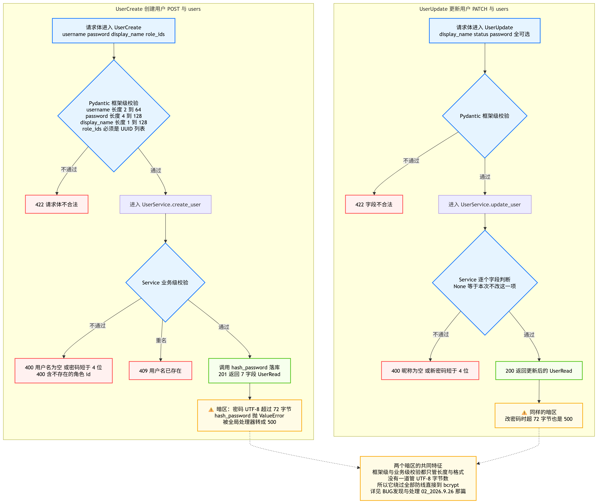
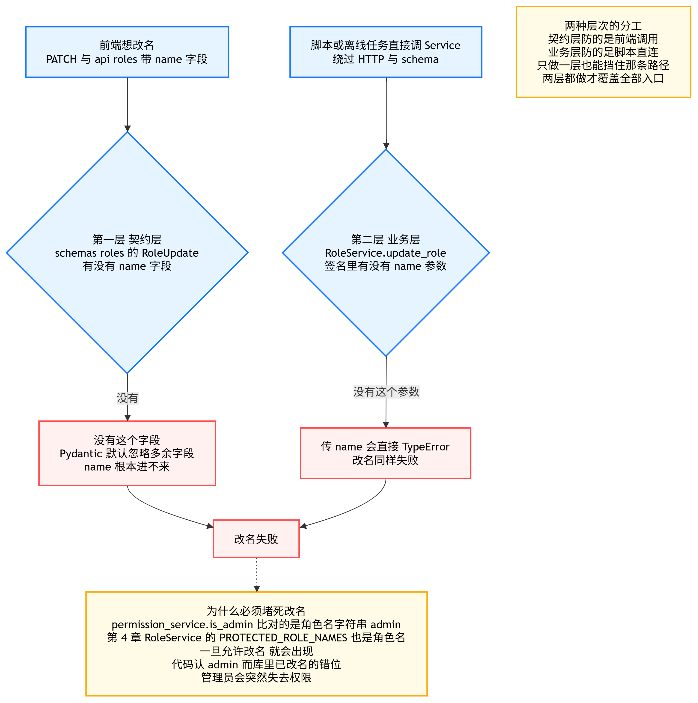
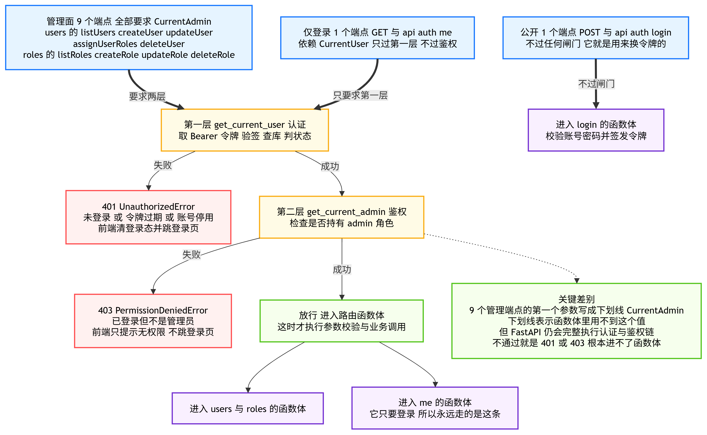
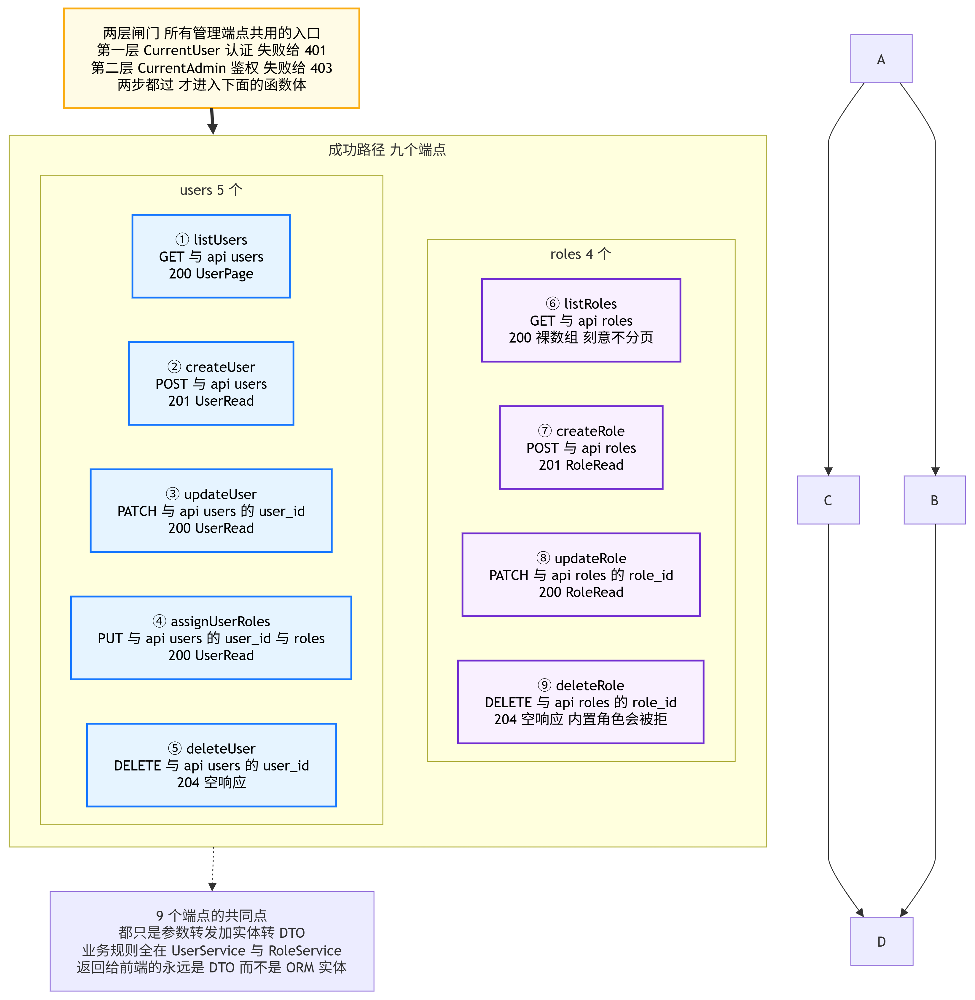
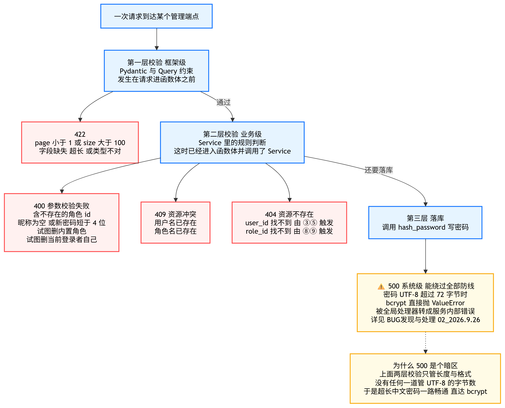

# 07_用户与角色管理

> 期：**Day11 · 认证、权限与安全检索**
> 章：第 3 章 后端实现 · **第 7 章「用户与角色管理 API」**
> 记录日期：2026.09.26

---

## 一、本章在整条链路里的位置

> **上一章解决了"能不能进来"，这一章解决"进来之后能管谁"。**
> 至此，前端 `sdk.gen.ts` 里已写死的 **12 个 operationId 全部兑现**。

```
第 3 章 后端实现
├── 第 1～5 步/章  ……              ← 已归档
├── 第 6 章  登录路由与初始化管理员  ← 已归档（2 个端点 + 种子初始化）
└── 第 7 章  用户与角色管理 API      ← 你在这里（9 个端点）
      ├── schemas/users.py   4 个契约模型
      ├── schemas/roles.py   2 个契约模型
      ├── routes/users.py    5 个端点
      ├── routes/roles.py    4 个端点
      └── main.py            挂载两个新路由
```

| 文件 | 行数 | 角色 |
| --- | --- | --- |
| `app/api/schemas/users.py` | 101 | **契约层**：4 个模型 |
| `app/api/schemas/roles.py` | 50 | **契约层**：2 个模型 |
| `app/api/routes/users.py` | 209 | **传输层**：5 个端点 |
| `app/api/routes/roles.py` | 138 | **传输层**：4 个端点 |
| `app/main.py` | 214 | **装配层**：挂载 users / roles |
| `app/services/user_service.py` | 247 | **修改**：修一个 500 bug（见 §六） |

### 1.1 12 个 operationId 到此刻全部兑现

```
auth    login · getCurrentUser                      ← 第 6 章
users   listUsers · createUser · updateUser         ← 本章
        assignUserRoles · deleteUser                ← 本章
roles   listRoles · createRole · updateRole         ← 本章
        deleteRole                                  ← 本章
```

> ⚠️ **一处我先前记错、已纠正的事**：前端**没有** `GET /api/users/{user_id}`（也没有 `getUser` 这个 SDK 函数）。
> 我一度把 `getCurrentUser` 误记成"相邻的 getUser"，凭空多算了一个端点。
> 实际：用户只有 5 个操作（list / create / update / assignRoles / delete），全部对应上了。

---

## 二、Schema 层

### 2.1 两个 Schema 的校验路径与状态码出口



**这张图把"两层校验"和"一个暗区"画在了一起**：

```
UserCreate / UserUpdate
  ├─ 第一层 Pydantic 框架级 ── 不通过 → 422
  └─ 第二层 Service 业务级   ── 不通过 → 400 / 409
        └─ 通过 → 调用 hash_password
              └─ ⚠️ 暗区：密码 UTF-8 超 72 字节 → ValueError → 500
```

**暗区的意义**：框架级与业务级校验**都只管长度与格式，没有一道管 UTF-8 字节数**，
所以它绕过了全部防线直达 bcrypt。详见 `BUG发现与处理/02_2026.9.26/01_密码超72字节直接500.md`。

### 2.2 `RoleUpdate` 没有 `name` 字段的双层防护



**同一个防呆为什么要做两次**：

| 层 | 位置 | 挡住谁 |
| --- | --- | --- |
| 契约层 | `schemas/roles.py` 的 `RoleUpdate` **没有 name 字段** | 前端调用（Pydantic 默认忽略多余字段） |
| 业务层 | `RoleService.update_role` 签名 **没有 name 参数** | 脚本 / 离线任务直连 Service（传了会抛 `TypeError: unexpected keyword argument`） |

**为什么必须堵死改名**：`permission_service.is_admin` 比对的是角色名字符串 `"admin"`，
`RoleService.PROTECTED_ROLE_NAMES` 也是角色名。一旦允许改名，就会出现
**"代码认 admin、而库里已改名"的错位 → 管理员突然失去权限**。

### 2.3 六个契约模型

| 模型 | 用途 | 关键约束 |
| --- | --- | --- |
| `UserCreate` | 创建用户请求 | `username` 2~64 / `password` 4~128 / `display_name` 1~128 / `role_ids` UUID 列表 |
| `UserUpdate` | 改用户请求（PATCH） | 三字段全可选，传 `None` = 不改 |
| `AssignRolesRequest` | 分配角色请求（PUT） | `role_ids` 列表；空列表 = 收回全部 |
| `UserPage` | 分页响应 | `items` / `total` / `page`≥1 / `page_size` 1~100 |
| `RoleCreate` | 创建角色请求 | `name` 1~64 / `description` ≤256 / `permission_tags` 列表 |
| `RoleUpdate` | 改角色请求（PATCH） | **无 `name` 字段** |

### 2.4 ⭐ 必须记住的三态语义（最容易搞混的地方）

| 字段 | 传 `None` | 传值 | 传空值 `[]` / `""` |
| --- | --- | --- | --- |
| `RoleUpdate.description` | 不改 | 改成新值 | **清空** |
| `RoleUpdate.permission_tags` | 不改 | 替换成新标签 | **清空所有标签** |
| `UserUpdate.display_name` | 不改 | 改成新值 | ❌ 被 `min_length=1` 拦成 **422** |
| `UserUpdate.status` | 不改 | 改状态 | ❌ 被 `Literal` 拦成 **422** |
| `UserUpdate.password` | **不改密码** | 重置为新密码 | ❌ 被 `min_length=4` 拦成 **422** |

> 🔴 **一句话记法**：角色那两个字段"**空值 = 清空**"，用户这三个字段"**空值 = 非法**"。
> 因为**角色可以有零个标签，但用户不能没有昵称 / 状态 / 密码**。

---

## 三、路由层

### 3.1 两层闸门在管理面上的应用



**本章与上一章最大的区别**：`auth` 路由里 `/login` 公开、`/me` 只要登录；
而**用户与角色的 9 个端点全部要求 `CurrentAdmin`**。

| 调用者 | 经过几层 | 结果 |
| --- | --- | --- |
| 管理面 9 个端点 | **两层**（认证 + 鉴权） | 401 / 403 / 放行 |
| `GET /api/auth/me` | **一层**（只认证） | 401 / 放行 |
| `POST /api/auth/login` | **零层**（公开） | 它就是用来换令牌的 |

> 📌 **`_: CurrentAdmin` 的下划线是什么意思**：
> 表示"只为触发依赖，函数体里用不到这个值"。
> **但 FastAPI 仍然会完整执行认证 + 鉴权链** —— 不通过就是 401 / 403，**根本进不了函数体**。

### 3.2 九个端点的成功路径



| # | 方法 | 路径 | operationId | 成功码 | 返回模型 |
| --- | --- | --- | --- | --- | --- |
| ① | GET | `/api/users` | `listUsers` | 200 | `UserPage` |
| ② | POST | `/api/users` | `createUser` | **201** | `UserRead` |
| ③ | PATCH | `/api/users/{user_id}` | `updateUser` | 200 | `UserRead` |
| ④ | PUT | `/api/users/{user_id}/roles` | `assignUserRoles` | 200 | `UserRead` |
| ⑤ | DELETE | `/api/users/{user_id}` | `deleteUser` | **204** | —（空响应） |
| ⑥ | GET | `/api/roles` | `listRoles` | 200 | **裸数组** `list[RoleRead]` |
| ⑦ | POST | `/api/roles` | `createRole` | **201** | `RoleRead` |
| ⑧ | PATCH | `/api/roles/{role_id}` | `updateRole` | 200 | `RoleRead` |
| ⑨ | DELETE | `/api/roles/{role_id}` | `deleteRole` | **204** | —（空响应） |

### 3.3 错误契约的三层漏斗



```
第一层 框架级（Pydantic / Query）  ── 请求还没进函数体 ──→ 422
第二层 业务级（Service 规则）      ── 已进函数体并调了 Service ──→ 400 / 409 / 404
第三层 落库（hash_password）      ── 绕过前两层 ──→ ⚠️ 500
```

### 3.4 错误码 × 端点矩阵（图里不画，查这张表更快）

| 端点 | 成功 | 可能错误 |
| --- | --- | --- |
| ① `listUsers` | 200 | 422（Query 越界） |
| ② `createUser` | 201 | 422（字段）/ 409（重名）/ 400（角色 id 不存在）/ **500（密码超 72 字节）** |
| ③ `updateUser` | 200 | 422（字段）/ 400（昵称空、密码短）/ 404（用户不存在）/ **500（同上）** |
| ④ `assignUserRoles` | 200 | 400（角色 id 不存在）/ 404（用户不存在） |
| ⑤ `deleteUser` | 204 | 400（删自己）/ 404（用户不存在） |
| ⑥ `listRoles` | 200 | — |
| ⑦ `createRole` | 201 | 422（名称长度）/ 409（重名）/ 400（名称为空） |
| ⑧ `updateRole` | 200 | 404（角色不存在） |
| ⑨ `deleteRole` | 204 | 400（内置角色）/ 404（角色不存在） |
| **全部 9 个** | — | **401（未登录）/ 403（非管理员）** ← 由闸门统一施加 |

### 3.5 users 与 roles 的三处刻意差异

| 维度 | `routes/users.py` | `routes/roles.py` |
| --- | --- | --- |
| 端点个数 | 5 | 4 |
| 列表是否分页 | **分页**（`page` / `page_size`，框架 + 仓储双保险） | **不分页** |
| 列表返回结构 | `UserPage` = `{items, total, page, page_size}` | **裸数组** `list[RoleRead]` |
| 为什么这么定 | 用户量随使用持续增长 | 角色是配置型数据，个位数量级，分页零收益 |

### 3.6 ⭐ 两处"只有读代码才知道"的细节

**① `updateUser` 是唯一需要手工转类型的端点**

```
payload.status 的静态类型是字符串 Literal["active","disabled"]
而 Service 期望 UserStatus 枚举，数据库列也存枚举 value
        ↓
所以这里显式转换：status = UserStatus(payload.status)

【为什么还要 try/except ValueError】
虽然 UserStatusValue 这个 Literal 已经把合法值限死了、正常路径不可能走到这里，
但多一层防御不亏：万一将来有人放宽了 Literal 却忘了同步补枚举成员，
这里会把 ValueError 转成 400（而不是让它冒成 500）。
from exc 保留原始异常链，方便排障时看到真实原因。
```

**② `deleteUser` 的防呆（也是本章唯一的业务护栏）**

```
它是唯一把 CurrentAdmin 参数命名为 admin（而不是 _）的端点
因为函数体里要比对 admin.id == user_id —— 防止把当前登录者自己删掉

【防的是什么事故】
管理员把自己删掉之后，系统里可能一个管理员都不剩，
而"再建一个管理员"这件事本身又需要管理员权限 → 直接把自己锁在系统外。

【注意它与角色侧的护栏是不同层次的保护】
- RoleService.delete_role 保护的是【内置角色】（admin / user 角色本身不可删）
- 这里保护的是【当前操作者】（不能删自己）
两者可以同时成立：管理员 A 可以删管理员 B（若确需如此），但删不掉自己。
```

> 📌 **这处防呆纠正了我第 4 步归档里的一个说法**：我在那里写"`UserService` 缺少不能删自己"，
> 当时记为"后续按需补充"。本章教程正好加了这个防呆，实现位置是**路由层**而非 Service 层
> —— 因为它需要"当前登录者"这个只有 HTTP 上下文才有的信息。第 4 步归档已回填修正。

---

## 四、本章与教程的偏离

| # | 教程 | 本项目 | 为什么 |
| --- | --- | --- | --- |
| 1 | `service.set_roles(...)` | `service.set_user_roles(...)` | **教程这里应是笔误**：第 4 步实现的 `UserService` 方法名是 `set_user_roles`（带 `user_` 前缀，与 `RoleService` 区分）。按教程原样写会 `AttributeError` |
| 2 | 直接 `UserRead.model_validate(user)` | 多一层 `_reload_for_read` | **修 500 bug**，见 §六 |
| 3 | — | `status` 显式转 `UserStatus` 枚举 | 教程漏了这一步；不转的话 Service 拿到字符串、ORM 存的是枚举，**状态转换会失效** |
| 4 | 教程只写了 `max_length=128` | **同样只写 `max_length=128`**（未加固） | 按用户决定：**这个 72 字节边界暂不修**，已单独记入 `BUG发现与处理/02_2026.9.26/`，等 Day13 全部学完统一处理 |

---

## 五、验证结果（真机执行，53 项全通过）

> 方式：真库 + `httpx.ASGITransport` 直连 ASGI app，全程单事件循环。

### 5.1 鉴权三层次

| 验证项 | 结果 |
| --- | --- |
| 未登录访问 `/api/users` | ✅ **401** |
| 未登录访问 `/api/roles` | ✅ **401** |
| 普通用户访问 `/api/users` | ✅ **403** `{'code':'permission_denied','message':'仅管理员可访问'}` |
| 普通用户访问 `/api/roles` | ✅ 403 |
| 普通用户 `POST /api/users` | ✅ 403 |
| 管理员访问 `/api/users` | ✅ 200 |

### 5.2 users 端点

```
createUser  201 且返回 7 字段 UserRead、roles 空数组、不含 password_hash
            重名 409、用户名 1 字符 422、密码 3 位 422
listUsers   {items,total,page,page_size} 字段集合正确、total 正确
            page=0 → 422、page_size=101 → 422、page_size=1 → 1 条
updateUser  ★ 改昵称 200（修复后不再 500）、updated_at 可正常序列化
            停用 200 → 该账号立刻无法登录 401、启回 200
            改密码 200 → 新密码可登录；密码 2 位 422；status 非法 422；不存在 404
assignRoles 分配 200、★ 整体替换为 2 个（非追加）、空列表清空、坏角色 400
deleteUser  ★ 管理员删自己 400（防呆）、删普通用户 204、重复删 404
```

### 5.3 roles 端点

```
listRoles   返回裸数组（不是 Page 对象）、两个内置角色、role 字段 5 个
createRole  201、★ 标签标准化 ['hr','public']（去空白/去空串/去重/保序）、重名 409、空名 422
updateRole  200、★ 传 name 被忽略（schema 里根本没这个字段）
deleteRole  删内置 admin/user 各 400、删业务角色 204、重复删 404
```

### 5.4 回归与收尾

| 项 | 结果 |
| --- | --- |
| OpenAPI 路径数 | 22 → **27** |
| operationId 总数 | **38 个且唯一** |
| 12 个契约 operationId | ✅ **全部兑现** |
| 前端 `tsc -b` | ✅ **exit 0** |
| `alembic head` | `4f198960f636` |
| 测试数据清理 | ✅ users=0 roles=0 docs=10 convs=7 |

---

## 六、⚠️ 本章抓到的一个真 bug：更新接口全部 500

### 6.1 现象

```
PATCH /api/users/{id}  →  unhandled exception
pydantic ValidationError: updated_at
  Error extracting attribute: MissingGreenlet: greenlet_spawn has not been called
```

### 6.2 根因链（只对 UPDATE 发作）

```
updated_at 列带 onupdate=func.now()
        ↓
每次 UPDATE 时 SQLAlchemy 都会把它写进 SET 子句
        ↓
commit() 会把"本次写过的列"标记为【过期 expired】
        ↓
路由层同步执行 UserRead.model_validate(user)
        ↓
读 updated_at → 触发异步重载 → 抛 MissingGreenlet → 500
```

**为什么 `create_user` 没事**：INSERT 不涉及 `onupdate`，`created_at` / `updated_at`
由 `server_default` 生成后**被当作普通值回填**，提交后不会过期。
**所以这个坑只在更新路径上发作，非常容易被漏掉。**

**为什么教程没暴露它**：教程的 `users` 表**原本没有 `updated_at`** ——
它是我们第 6 章为了兑现教程的 `UserRead` 才补回来的。
**也就是说：这个 bug 是"补回教程字段"这一步的副作用。**

### 6.3 修法与取舍

```python
# backend/app/services/user_service.py（三个写方法后统一调用）
async def _reload_for_read(self, user: User) -> None:
    await self.session.refresh(user)
```

| 方案 | 结果 |
| --- | --- |
| 只写 `refresh(user, attribute_names=["roles"])` | ❌ **不够** —— `updated_at` 依然过期，序列化照样炸 |
| 写死"哪些列可能过期" | ❌ 很脆弱：将来给表加一个带 `onupdate` 的列就会重演 |
| **不带 `attribute_names` 的 `refresh(user)`** | ✅ 一次性恢复实体全部状态，多一条主键查询换"写到哪都不会炸" |

> 📖 **可迁移的教训**：**任何带 `onupdate` 的列，在 commit 之后都会过期。**
> 只要提交后还要把实体交给 Pydantic 序列化，就必须先 reload。

---

## 七、⚠️ 已知未修：密码超 72 字节 → 500

**这是本章唯一有意保留的问题**，已单独归档在：

```
项目阶段性总结/BUG发现与处理/02_2026.9.26/01_密码超72字节直接500.md
```

一句话复述：

```
max_length=128 限制的是【字符数】，而 bcrypt 拒绝的是超过 72 【字节】的明文。
纯 ASCII 下 72 字符恰好 = 72 字节；但中文 25 个字（UTF-8 每字 3 字节）就超，
emoji 19 个就超 —— 此时 hash_password 抛 ValueError → 500。

实测：ASCII 71 → 201    ASCII 73 → 500
      中文 24 字 → 201  中文 25 字 → 500
```

| 项 | 状态 |
| --- | --- |
| 是否安全漏洞 | ❌ **不是**（bcrypt 报错本身是正确行为；问题只是"报错方式不该是 500"） |
| 数据是否会受损 | ❌ 不会（异常发生在写库之前） |
| 登录路径是否受影响 | ❌ 不影响（`verify_password` 已兜住 `ValueError`，超长密码只是登录失败 401） |
| 修复方案 | ✅ 已设计好（schema 加按字节的 validator 返回 422 + `hash_password` 加安全网） |
| 何时修 | **等 Day13 全部学完**（用户决定） |

---

## 八、本章地图

```
第 7 章「用户与角色管理 API」
├── Schema 层
│   ├── users.py  4 个模型（UserCreate / UserUpdate / AssignRolesRequest / UserPage）
│   └── roles.py  2 个模型（RoleCreate / RoleUpdate —— 无 name 字段）
│         └── ⭐ 三态语义：角色"空值=清空"，用户"空值=非法"
├── 路由层
│   ├── users.py  5 个端点  全要求 CurrentAdmin
│   │     └── ⭐ updateUser 唯一手工转 UserStatus；deleteUser 唯一比对 admin.id 防呆
│   └── roles.py  4 个端点  全要求 CurrentAdmin
│         └── ⭐ listRoles 返回裸数组不分页
├── 错误契约三层漏斗：422 框架级 / 400·409·404 业务级 / ⚠️ 500 系统级
└── 装配  main.py 挂载两个路由

验证 53/53 · 回归：27 条路径 / 38 个 operationId / 前端 tsc 通过
Bug   更新接口 500（已修）· 密码 72 字节（已记档，待 Day13 修）
```

---

## 九、最应该学习的图

**`03_两层闸门在管理面上的应用.png`**
> 一眼看清"三类调用者各过几层闸门"，以及 401 与 403 分别由哪一层产生。
> 承接第 5 步的 `deps.py`，是那两层依赖在真实端点上的落地。

**`05_错误契约的三层漏斗.png`**
> 一眼看清"什么错误在哪一层被拦、返回什么码"，以及**为什么 500 能绕过前两层**。
> 这张图与 `BUG发现与处理` 那篇是配套的 —— 修复时它就是"该在哪一层加防线"的依据。

---

## 十、自查 5 题

1. `_: CurrentAdmin` 里的下划线是什么意思？既然函数体用不到它，为什么还必须写？
2. 同一个"角色不许改名"的约束，为什么要在 schema 和 Service 各做一次？各挡的是谁？
3. `RoleUpdate.permission_tags` 传 `None` 和传 `[]` 有什么区别？`UserUpdate.password` 传 `None` 和传 `""` 呢？
4. 为什么 `createUser` 不会因为 `updated_at` 过期而报错，而 `updateUser` 会？
5. 密码超过 72 字节时返回 500 —— 这是安全漏洞吗？为什么？

---

## 十一、本章实际新增或修改文件

```
后端
├── backend/app/api/schemas/users.py      【新增】101 行 · 4 个契约模型
├── backend/app/api/schemas/roles.py      【新增】 50 行 · 2 个契约模型
├── backend/app/api/routes/users.py       【新增】209 行 · 5 个端点
├── backend/app/api/routes/roles.py       【新增】138 行 · 4 个端点
├── backend/app/main.py                   【修改】挂载 users / roles 两个路由
└── backend/app/services/user_service.py  【修改】新增 _reload_for_read（修 500 bug）

BUG 归档（独立目录）
└── 项目阶段性总结/BUG发现与处理/02_2026.9.26/
    └── 01_密码超72字节直接500.md          【新增】含实测证据与修复方案

本章归档
└── 项目阶段性总结/Day11_认证、权限与安全检索/02_2026.9.26/06_backend_app_api_routes_roles++backend_app_api_routes_users++backend_app_api_schemas_roles++backend_app_api_schemas_users++backend_app_main/
    ├── 07_用户与角色管理.md              【本文件】
    ├── 01_两个Schema的校验路径与状态码出口.png
    ├── 02_RoleUpdate没有name字段的双层防护.png
    ├── 03_两层闸门在管理面上的应用.png
    ├── 04_九个端点的成功路径.png
    └── 05_错误契约的三层漏斗.png
```

> 🔗 **交叉引用**：
> - 本章的 72 字节问题 → `BUG发现与处理/02_2026.9.26/01_密码超72字节直接500.md`
> - 第 4 步归档 §十 遗留 #4（"`UserService` 缺少不能删自己"）→ **已在本章补上，并已回填修正**
> - 第 4 步归档 §十 遗留 #2（72 字节上限）→ **本章部分解决（`max_length` 是字符不是字节），仍待修**
