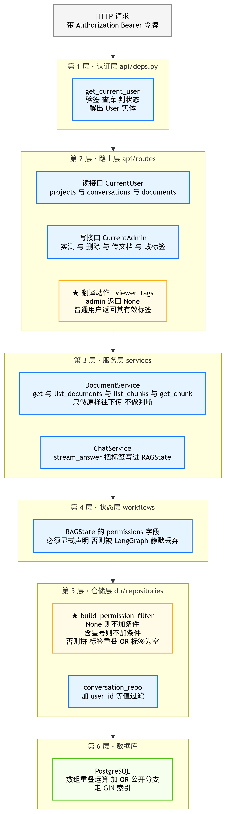
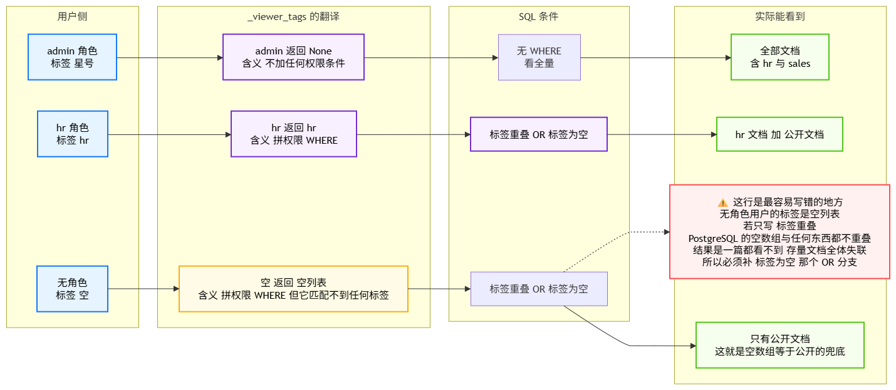
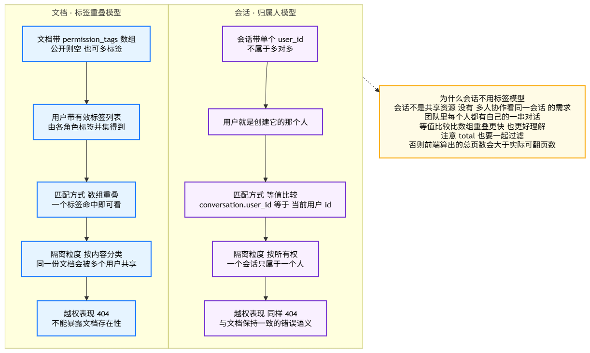

# 08_给文档和会话挂上用户态

> 期：**Day11 · 认证、权限与安全检索**
> 章：第 3 章 后端实现 · **第 8 章「给文档和会话挂上用户态」**
> 记录日期：2026.09.26
> 说明：本篇按"我没细看代码"来写 —— 每一处改动都配了"它解决什么问题、少了它会怎样"。

---

## 一、本章在整条链路里的位置

> **前面第 1～7 章解决的是"门"的问题：没有令牌进不来、不是管理员不能进管理面。**
> **本章解决的是"窗"的问题：进来之后，你能从数据库里捞出哪些数据。**

```
第 3 章 后端实现
├── 第 1～5 步/章  ……              ← 已归档（配置 / 安全工具 / 仓储与 Service / 依赖注入）
├── 第 6 章  登录路由与初始化管理员  ← 已归档（2 个端点 + 种子初始化）
├── 第 7 章  用户与角色管理 API      ← 已归档（9 个端点）
└── 第 8 章  给文档和会话挂上用户态  ← 你在这里（权限贯穿 + 归属隔离）
      ├── core/permissions.py              常量上收（权限体系的"锚点"）
      ├── db/repositories/document_repo.py  ★ 权限过滤条件的唯一生成地
      ├── db/repositories/conversation_repo.py  会话归属（user_id）过滤
      ├── services/document_service.py     只做透传 + 新增改标签
      ├── services/chat_service.py         算标签 → 写进 RAGState
      ├── workflows/rag_state.py           声明 permissions 字段
      ├── api/routes/documents.py          _viewer_tags 翻译 + 双来源认证 + 新 PATCH
      ├── api/routes/chat.py               5 个端点全部带上 user
      ├── api/routes/evaluations.py        整组挂管理员闸门
      └── api/schemas/documents.py         DocumentRead 补 2 个字段
```

### 1.1 一句话概括这一章做了什么

**把"当前用户是谁"这个信息，从 HTTP 请求头一路送到了 SQL 的 `WHERE` 子句里。**

前 7 章的所有成果都只是"**在门口验票**"：
验完票你进了大厅，但大厅里所有的抽屉（文档、会话）**当时还是谁都能拉开的**。
本章给每个抽屉装了锁，并且让"你是谁"这个信息**跟着请求一起走完六层**。

---

## 二、为什么这一章非有不可

### 2.1 一个残酷的事实：前 7 章的保护可以被一行 `curl` 绕过

```
第 6 / 7 章的成果：没有令牌 → 401；不是管理员 → 403
        ↓
但是：一个普通用户用自己的【合法令牌】调用 GET /api/documents
        ↓
第 6 / 7 章的回答是："令牌有效，放行。"
        ↓
于是他能看到【全公司所有文档】，包括 HR 的薪酬制度、sales 的报价单
```

> 🔴 **这就是本章要堵的洞**：认证（你是谁）与鉴权（你能不能进这个接口）
> 都做好了，但**数据权限（你能看到哪些行）**一个都没做。
> 这类漏洞在真实项目里非常常见，也最危险 —— 因为所有"关着的门"看起来都很正常。

### 2.2 本章的两条主线（后面每个文件都归到这两条上）

| 主线 | 管什么 | 覆盖对象 | 匹配方式 |
| --- | --- | --- | --- |
| **① 内容权限** | 这份**文档**该给谁看 | 文档 / 切片 / 文件下载 | **标签重叠**（多对多） |
| **② 会话归属** | 这条**会话**是谁的 | 会话 / 消息 / 提问 | **归属人相等**（一对一） |

> 📌 **两条主线用的是两套模型，不是一套** —— 这是本章最容易误解的地方，详见 §五。

---

## 三、六层落地：用户态怎么一层层往下走



**这张图是本章的总地图**，建议先把它看成"一条自上而下的流水线"：
每一层只做一件小事，六层串起来才构成完整的权限。

### 3.1 第 1 层 · 认证层 `api/deps.py`（上一章已归档，本章没改）

```
HTTP 请求头  Authorization: Bearer <JWT>
        ↓ get_current_user
① 验签（PyJWT）      —— 令牌是不是我签的、过期没
② 查库（每次请求都查）—— 用户还在不在、状态是不是 active
③ 解出 User 实体     —— 带上 roles（lazy="selectin" 已预加载）
        ↓ get_current_admin
④ 判角色名 == "admin" —— 不是就 403
```

> ⚠️ **注意"每次请求都查库"这个刻意的选择**：
> 如果只信任令牌里的内容，那么"管理员把某人停用"必须等令牌过期（最长 1440 分钟）才生效。
> 每请求查一次库，换来的是**权限变更立即生效**，代价是一次主键查询。

### 3.2 第 2 层 · 路由层 `api/routes/*`：在这里把"用户"翻译成"信号"

**这是全章最关键的一次翻译，函数只有一行**：

```python
# backend/app/api/routes/documents.py  L72-94
def _viewer_tags(user: User) -> list[str] | None:
    return None if is_admin(user) else compute_user_permission_tags(user)
```

| 调用者 | `_viewer_tags` 返回 | 仓储的理解 |
| --- | --- | --- |
| admin | `None` | **不加任何权限条件** |
| hr 角色用户 | `["hr"]` | 拼"标签重叠 OR 标签为空" |
| 无任何角色 | `[]` | 同上，但只会命中"标签为空"那半边 |

> ⭐ **为什么返回 `None` 而不是 `["*"]`**：
> 如果把 `"*"` 传到仓储，仓储就得再判断一次"这是不是通配"——
> 那"通配"这个**业务概念**就漏进仓储层了。
> 在**这一处**把 admin 翻译成 `None`，仓储只需要理解一件事：**`None` = 不过滤**。
>
> 这是本章第二次"分层收敛"（第一次是把权限常量上收到 `core`）：
> - **常量共享** → 放到最底层的 `core`
> - **语义翻译** → 放在最靠近"知道用户是谁"的那一层（路由层）

**路由层里谁挂什么**（`routes/documents.py` 共 9 个端点）：

| 挂什么 | 端点 | 为什么 |
| --- | --- | --- |
| `CurrentUser`（读接口） | `listDocuments` / `getDocument` / `listDocumentChunks` / `getDocumentChunk` / `downloadDocument` | 谁登录谁能读，但读到的范围由标签决定 |
| `CurrentAdmin`（写接口） | `uploadDocument` / `deleteDocument` / `retryDocument` / `updateDocumentPermissionTags` | 改动语料是管理动作 |

**会话侧更简单**（`routes/chat.py` 5 个端点全部挂 `CurrentUser`）：
它们不需要"翻译"，直接把 `user.id` 传下去做等值过滤。

### 3.3 第 3 层 · 服务层 `services/*`：**原则上不做判断，只做透传**

```
DocumentService.get / list_documents / list_chunks / get_chunk
        ↑ permission_tags=...  原样透传给仓储
```

> ⭐ **为什么服务层不做权限判断**：
> 一旦服务层也开始判断"这个人能不能看"，权限规则就有了**两个来源**，
> 早晚会出现"路由放行、服务拦住"或反过来的扯皮。
> **本章把判断统一收敛到两个地方：路由层（翻译身份）＋ 仓储层（生成 SQL）。**

**唯二两个"写"的地方**：

| 方法 | 做什么 |
| --- | --- |
| `DocumentService.upload(..., created_by=, permission_tags=)` | 上传时记录**上传者**和**初始标签** |
| `DocumentService.update_permission_tags(document_id, tags)` | **新增**：管理员改文档可见性 |

`ChatService.stream_answer(conversation_id, question, *, current_user)` 是本章唯一"算东西"的服务方法：

```python
# backend/app/services/chat_service.py  L465-491
await self.get_conversation(conversation_id, user_id=current_user.id)   # ① 归属校验
permissions = compute_user_permission_tags(current_user)               # ② 算有效标签
...
state = { ..., "permissions": permissions, ... }                       # ③ 写进图状态
```

### 3.4 第 4 层 · 状态层 `workflows/rag_state.py`：**声明了才存在**

```python
# backend/app/workflows/rag_state.py  L42-47
    # 【第 11 期新增】用户有效权限标签，由 ChatService 在【进图前】注入。
    permissions: list[str]
```

> 🔴 **这一行不加会怎样**：`RAGState` 是 `TypedDict(total=False)`，
> LangGraph 会把**状态模式里没声明的键【静默丢弃】**——
> 服务层明明塞进去了 `permissions`，进图之后就凭空消失了，**而且不报任何错**。
> 排查这种问题极其痛苦：断点打在图外能看到、打在图内就没有。
>
> 这正是第 9 期 `trace_id` 踩过的同一个坑，所以这次先声明好。

### 3.5 第 5 层 · 仓储层 `db/repositories/*`：**权限真正落地的地方**

| 文件 | 改动 |
| --- | --- |
| `document_repo.py` | 新增模块级函数 `build_permission_filter()`；`get_by_id` / `list_paginated` 接受 `permission_tags=` |
| `conversation_repo.py` | `create` / `get` / `list_page` / `delete` 全部接受 `user_id=` |

**会话侧的核心权衡**（`conversation_repo.get`）：

```python
if user_id is None:
    return await self.session.get(Conversation, conversation_id)   # 主键直查，能命中 Identity Map
return (await self.session.execute(
    select(Conversation).where(
        Conversation.id == conversation_id,
        Conversation.user_id == user_id,      # ← 多一个等值条件
    )
)).scalar_one_or_none()
```

> 📌 **为什么传了 `user_id` 就不能用 `session.get()`**：
> `session.get()` 只接受主键，**没法附带 `WHERE user_id = ...`**。
> 所以一旦要归属过滤，就必须退化成显式 `select()`。

### 3.6 第 6 层 · 数据库：条件长这样

```sql
-- 普通用户（以 hr 为例）
WHERE documents.permission_tags && ARRAY['hr']::varchar[]
   OR documents.permission_tags = ARRAY[]::varchar[]

-- admin / 内部调用（permission_tags 传 None）
（连 WHERE 都不拼）
```

> ⭐ **为什么 admin 要"不拼"而不是拼一个恒真条件**：
> 少一个条件就少一次数组运算 —— 而且 `BitmapOr` 的两个分支都不需要走，
> 直接走主键/顺序扫描，是**最快**的路径。

---

## 四、三种标签语义与那个必须补的 OR 分支



**这张图把"三种身份 → 三种信号 → 三种 SQL → 三种实际结果"画成了一行。**

### 4.1 三条路径对照表

| 身份 | 标签 | `_viewer_tags` | SQL 条件 | 实际能看到 |
| --- | --- | --- | --- | --- |
| admin | `["*"]` | `None` | **无 WHERE** | 全部文档（含 hr 与 sales） |
| hr 角色 | `["hr"]` | `["hr"]` | 重叠 OR 为空 | hr 文档 ＋ 公开文档 |
| 无角色 | `[]` | `[]` | 重叠 OR 为空 | **只有公开文档** |

### 4.2 🔴 本章最容易写错的一处：`&&` 对空数组永远不成立

**直觉写法**（错的）：

```python
Document.permission_tags.op("&&")(permission_tags)
```

```
SELECT ... WHERE permission_tags && '{}'::varchar[]   -- 返回 0 行！
```

> **PostgreSQL 的 `&&` 语义是"两边都必须有元素可重叠"。**
> **空数组与任何东西都不重叠 —— 包括另一个空数组。**

**后果有多严重**（不是"少看见"，是"集体失联"）：

| 谁会中招 | 表现 |
| --- | --- |
| 有 hr 标签的用户 | **看不到公开文档**（公开文档标签为空，`&&` 不命中） |
| **无任何角色的用户** | **一篇都看不到** —— 存量 8 篇文档全体失联 |

所以必须显式补一个 OR 分支（`document_repo.py` L73-87）：

```python
return or_(
    Document.permission_tags.op("&&")(permission_tags),
    Document.permission_tags == [],          # ← 这个 OR 分支是"公开"的兜底
)
```

### 4.3 第二个坑：右边必须是 `[]`，不能是字符串 `"{}"`

```
直觉写法（照抄 SQL 里的数组字面量）：
    Document.permission_tags == "{}"
        ↓ SQLAlchemy 按【字符串】绑定参数
    documents.permission_tags = $1::VARCHAR
        ↓ 左边是 varchar[]，类型对不上
PostgreSQL 报错：operator does not exist: character varying[] = character varying
        ↓
接口 500
```

```
正确写法：Document.permission_tags == []
        ↓ SQLAlchemy 沿用左侧的数组类型来绑定参数
    documents.permission_tags = $1::VARCHAR[]
        ↓ 类型对得上
PostgreSQL 正确识别为"空数组比较"
```

> 📌 **实测踩过这个 500**（本章开发过程中真实发生），
> 所以 `document_repo.py` 里留了一段专门的注释把这个坑写死在代码旁。

### 4.4 加了 OR 分支，GIN 索引会不会失效？**不会**

```
实测 EXPLAIN：

BitmapOr
  -> Bitmap Index Scan on ix_documents_permission_tags   (permission_tags && '{hr}')
  -> Bitmap Index Scan on ix_documents_permission_tags   (permission_tags = '{}')
```

> **PostgreSQL 会把 `OR` 规划成 `BitmapOr`，两个分支各自走同一个 GIN 索引。**
> 也就是说：**"补上那个 OR 分支"既拿到了正确性，又没有付出性能代价。**
> 这个结论值得记 —— 很多人因为怕索引失效而不敢写 OR，结果写出了一个静默的全量失联。

### 4.5 `permission_tags` 的三态语义（一张表记住）

| 值 | 含义 | 谁能看到 |
| --- | --- | --- |
| `[]`（空数组） | **公开** | 任何登录用户 |
| `["hr"]` | 有门禁 | 持 hr 标签的用户 ＋ admin |
| `["*"]` | 通配 | 不该出现在文档上；它只属于 **admin 角色** |

> ⚠️ **`["*"]` 出现在文档上是"配置错误但无害"**：
> 检索时 `build_permission_filter` 直接短路返回 `None`，
> 于是**所有用户都能看到这篇文档**（等于公开）。
> 上传接口没拦这个值，属于已知的小遗留（见 §九）。

### 4.6 标签标准化：为什么必须做

```python
# backend/app/services/document_service.py  L166-195  _normalize_tags()
去空白 → 丢弃空串 → 去重 → **保持用户输入顺序**
```

**不做的后果**：用户输入 `"hr "`（带尾随空格）会存成一个
"看起来像 hr 但实际不相等"的字符串，检索时 `&&` **永远不命中** ——
表现为"权限明明配了却不生效"，**极难排查**。

> 📌 **为什么不用 `sorted(set(...))`**：那会改变用户输入顺序。
> 用户输入 `[sales, hr]`，回显变成 `[hr, sales]`，会让人以为"没保存成功"。
> 所以用 `seen` 集合 + 结果列表，同时满足"去重"和"保序"。

> 📌 **当时为什么让 `RoleService` 与 `DocumentService` 各留一份副本**：
> 两处逻辑完全相同（8 行纯函数），但分属两个互不依赖的模块。
> 抽公共函数反而要新建工具模块、让两个 service 都依赖它 —— **对一个 8 行函数不划算**。
> 真正需要统一的是**行为**，不是**代码位置**，所以两处都写了同样的说明。
>
> ⚠️ **记录更正（2026.09.26）**：我原先在这里写的是「**三个** service 各留一份副本
> （`RoleService` / `UserService` / `DocumentService`）」—— **这是错的**。
> 实际查证只有 `role_service` 与 `document_service` **两处**，`user_service` 从未有过这个函数。
>
> 📌 **而且这个"不抽公共模块"的判断当天就被推翻了**：
> 紧接着修直传链路丢标签的 BUG 时，`document_upload_service` 也需要同一套清洗，
> 于是新建了 `app/core/tags.py` 提供公开的 `normalize_tags()`，
> 两处副本改为转发（保留 `_normalize_tags` 作为兼容垫片）。
> **教训：以"这个函数只有 8 行"为由拒绝抽取，是低估了它被复用的速度。**
> 详见 `BUG发现与处理/02_2026.9.26/02_直传链路漏掉鉴权与权限标签.md` §九.2。

---

## 五、两种隔离模型：为什么文档用标签、会话用归属



**这张图左右对照了两套模型，右边黄框解释了会话为什么故意不用标签。**

### 5.1 五个维度的对照

| 维度 | 文档（标签重叠模型） | 会话（归属人模型） |
| --- | --- | --- |
| 字段 | `permission_tags` **数组** | `user_id` **单个** |
| 关系 | 一份文档可被多人共享（多对多） | 一个会话只属于一个人 |
| 匹配方式 | 数组重叠 `&&` | 等值比较 `=` |
| 隔离粒度 | 按**内容分类**（同一份文档多人共享） | 按**所有权**（一个会话只属于一个人） |
| 越权表现 | **404**（不能暴露文档存在性） | **404**（与文档保持一致） |

### 5.2 会话为什么不用标签模型

```
会话是"私有聊天记录"，不存在"共享资源"这个需求：
  没有"多人协作看同一会话"的场景
  团队里每个人都有自己的会话串
        ↓
等值比较比数组重叠【更快】也【更好理解】
        ↓
而且归属人只有一个，用数组反而是过度设计
```

### 5.3 ⭐ 两个必须一起过滤的地方：`items` 与 `total`

```
分页接口有两段 SQL：
    items_stmt  ── 取当页数据
    count_stmt  ── 算总数
        ↓
只过滤数据、不过滤总数会怎样：
    前端算出 total=20 → 显示 3 页
    实际每页只有 2 条 → 翻到第 2 页就是空列表
        ↓
用户看到"第 2 页是空的"，会以为数据丢了
```

> 🔴 **这是分页接口最经典的一类 bug**，本章在 `document_repo.list_paginated`
> 和 `conversation_repo.list_page` 里都显式给两个语句加了同一个条件，
> 并在两处 docstring 里都写了提醒（"看起来重复，但绝不能只改一处"）。

### 5.4 越权为什么统一返回 404 而不是 403

```
若"存在但无权" → 403，"不存在" → 404
        ↓
攻击者可以靠状态码差异【探测出某个 document_id / conversation_id 是否真实存在】
        ↓
于是可以枚举出系统里有多少文档、有哪些 id（信息泄露）
        ↓
统一返回 404（"查不到"），攻击者无法区分这两种情况
```

> 📌 **这是本章贯穿始终的一个安全设计原则**：
> **"没有权限"与"不存在"在对外表现上必须完全一致。**
> 代码里体现为：仓储层遇到无权时返回 `None`（而不是抛 403），
> Service 层再统一抛同一个 `NotFoundError`。

---

## 六、接口变化总览

### 6.1 会话（5 个端点全部加 `CurrentUser`）

| 端点 | operationId | 传下去的东西 |
| --- | --- | --- |
| POST `/api/conversations` | `createConversation` | `user.id` → 归属人（**必传**，否则造出"无主会话"） |
| GET `/api/conversations` | `listConversations` | `user_id=user.id` → 只列自己的 |
| GET `/api/conversations/{id}` | `getConversation` | `user_id=user.id` → 别人的报 404 |
| POST `/api/conversations/{id}/chat` | `streamChat` | `current_user=user` → 归属校验 + 算标签 |
| DELETE `/api/conversations/{id}` | `deleteConversation` | `user_id=user.id` → 只能删自己的 |

> 📌 **为什么建会话时 `user_id` 必须传**：
> 不记录归属人，这条会话就成了"**无主会话**"——
> 列表按 `user_id` 过滤，它在**任何用户**的列表里都看不到，等于凭空产生垃圾数据。

### 6.2 文档（9 个端点）

| 端点 | operationId | 闸门 | 权限处理 |
| --- | --- | --- | --- |
| POST `/api/documents` | `uploadDocument` | **admin** | 接收 `permission_tags`（JSON 字符串）+ 记录 `created_by` |
| GET `/api/documents` | `listDocuments` | user | `_viewer_tags(user)` |
| GET `/api/documents/{id}` | `getDocument` | user | `_viewer_tags(user)` |
| DELETE `/api/documents/{id}` | `deleteDocument` | **admin** | — |
| POST `/api/documents/{id}/retry` | `retryDocument` | **admin** | — |
| GET `/api/documents/{id}/file` | `downloadDocument` | user | **双来源认证**（见下） |
| GET `/api/documents/{id}/chunks` | `listDocumentChunks` | user | `_viewer_tags(user)` |
| GET `/api/documents/{id}/chunks/{cid}` | `getDocumentChunk` | user | `_viewer_tags(user)` |
| **PATCH `/api/documents/{id}/permission-tags`** | `updateDocumentPermissionTags` | **admin** | **本章新增** |

### 6.3 ⭐ `downloadDocument` 的双来源认证（最特殊的一个端点）

```
普通接口：前端 axios 会给每个请求自动加 Authorization 头
        ↓
但是下载文件走的是 <iframe> / window.open：
    浏览器【不会】给你加自定义请求头
        ↓
所以必须额外支持把令牌放在 URL 查询参数里：?token=xxx

代码（routes/documents.py L399-409）：
    effective_auth = authorization or (f"Bearer {token}" if token else None)
    user = await get_current_user(session, effective_auth)

优先级：Header 优先，其次 Query 里的 token
拿到 user 之后仍然要 _viewer_tags(user) 传下去 ——
否则"知道 id 就能下载别人文档原文"的后门就开了
```

> ⚠️ **代价**：令牌会出现在 URL 里（浏览器历史、代理日志、Referer）。
> 这是"浏览器能力限制"下的妥协方案；更严格的做法是签发**一次性短时效下载票据**。
> 本项目采用 Query token，属于**已知的有意取舍**。

### 6.4 `getDocumentChunk` 为什么最需要权限校验

> 它是**唯一会返回切块全文**的接口。
> 若只靠"路径双校验"（chunk 属于 document），
> 攻击者只要知道任一文档 id，就能把它的**全部原文逐条拉走** ——
> 文档列表 / 详情上的权限过滤会被这个后门**完全绕过**。

### 6.5 评测（8 个端点整组挂闸门）

```python
# backend/app/api/routes/evaluations.py
router = APIRouter(
    prefix="/evaluations",
    tags=["evaluations"],
    dependencies=[Depends(get_current_admin)],   # ← 挂在 router 上，一次声明整组生效
)
```

| 写法 | 优点 | 缺点 |
| --- | --- | --- |
| 逐路由加 `_: CurrentAdmin` | 路由函数内能拿到 `User` | 要在 8 个函数签名里重复 8 次 |
| **挂在 router 上（本章采用）** | 声明一次，新增端点**自动继承**保护 | 路由函数内拿不到 `User` |

> 📌 评测模块本来也不需要知道是谁在调用（评测跑批固定用通配权限、不代表任何真实用户），
> 所以这个缺点在这里不构成问题。

### 6.6 ⭐ 本章最"救命"的一行：防止权限过滤反噬评测

```python
# backend/app/services/chat_service.py  L715-720  answer_for_evaluation()
# 【第 11 期 · ⚠️ 本行是"权限过滤不反噬评测"的关键】
#    评测跑批没有"当前登录用户"，若不加这一行，permissions 会缺省为空列表，
#    检索 SQL 就会退化成"只能看到公开文档"——非公开文档全部检索不到，
#    Day10 的全部指标（context_recall / citation_hit_rate 等）会突然崩盘。
"permissions": [WILDCARD_PERMISSION_TAG],
```

> 🔴 **如果不加这一行会怎样**：
> 评测跑批没有登录用户 → `permissions` 缺省为 `[]` →
> 检索 SQL 退化成"只能看到公开文档" →
> **Day10 辛苦跑出来的全部指标集体崩盘**，而且崩得莫名其妙。
>
> 语义上也说得通：**评测是系统内部行为，不代表任何真实用户，理应看到全量语料。**

---

## 七、本章与教程的偏离（3 处）

| # | 教程 | 本项目 | 为什么 |
| --- | --- | --- | --- |
| 1 | 权限常量留在 `services/permission_service.py` | **上收到 `core/permissions.py`** | `db` 层仓储拼检索 SQL 时要判断"是否持通配标签"。若常量留在 services，`db` 就得 `import app.services.permission_service` —— **依赖方向反了**（db 是被 services 依赖的下层）。这是**结构性的、永久的**选择：下一章的 `chunk_repo` 也要用它。`permission_service.py` 仍转发导出两个常量，老 import 路径不破坏 |
| 2 | `DocumentService.get(document_id)` | `get(document_id, *, permission_tags=None)` | 教程漏了这个参数。不加则"详情接口"无法做权限过滤，与列表接口口径不一致 |
| 3 | `ChatService.get_conversation(conversation_id)` | 增加 `user_id=` 关键字参数 | 教程在 `stream_answer` 里只做了会话存在性校验，没有归属校验。不加则**任何人拿到 conversation_id 就能往别人的会话里提问**（并把消息写进别人的会话） |

> 📌 **偏离 1 的命名说明**：`permission_service.py` 里保留了
> `__all__ = ["ADMIN_ROLE_NAME", "WILDCARD_PERMISSION_TAG", ...]`，
> 所以 `from app.services.permission_service import WILDCARD_PERMISSION_TAG` **依然可用** ——
> 这是"搬家但不断老路"的标准做法。

---

## 八、验证结果（真机执行）

> 方式：真库 + `httpx.ASGITransport` 直连 ASGI app，全程单事件循环。
> 分两轮：隔离环境自建数据 35 项 + 真实语料回归 14 项。

### 8.1 隔离环境（35/35）

```
文档侧
  上传时带标签          → permission_tags 正确落库、被 _normalize_tags 清洗
  空标签文档            → 任何登录用户都能看到（公开语义成立）
  有 hr 标签的文档      → 无角色用户看不到、hr 用户看得到、admin 看得到
  ★ PATCH 改标签        → 改后立刻生效（同一个令牌，改前看不到、改后看得到）
  ★ 无权文档详情        → 404（不是 403，不暴露存在性）
  ★ 无权文档的切片      → 404（三层防线都堵上了）
  下载无权文档          → 404（header 与 query token 两条路都试了）

会话侧
  建会话                → user_id 正确落库
  列表                  → 只看到自己的（别人的不出现，且 total 也同步过滤）
  取别人的会话          → 404
  删别人的会话          → 404
  往别人的会话提问      → 404
  admin 视角            → 不传 user_id 时看到全部（内部调用路径可用）

闸门
  未登录任意接口        → 401
  普通用户读接口        → 200
  普通用户写接口        → 403
  普通用户 /api/evaluations/*  → 403
  普通用户 /api/users /api/roles → 403
```

### 8.2 真实语料回归（14/14）

> 语料状态：`users=1 (admin)` `roles=2` `docs=8` `chunks=82`

| 验证项 | 结果 |
| --- | --- |
| admin 看列表 | 8 篇全见（unfiltered 路径生效） |
| 新建空标签文档 | 无角色用户也能看到 |
| PATCH 把文档改为 `["hr"]` | 无角色用户**立刻**看不到；改回 `[]` 立刻又能看到 |
| 无权访问该文档的切片列表 | **404**（不是 403） |
| 无权访问该文档的**单条切片全文** | **404** ← 最有价值的那个后门被堵住 |
| RAG 图接受 `permissions` | ✅ 正常跑完（4.6～12.4 s，`route=rewrite`/`multi_query`，`retrieval` 节点执行） |
| `answer_for_evaluation` | ✅ 5.2～5.9 s 无异常（空语料上跑通） |

### 8.3 回归指标

| 项 | 变化 |
| --- | --- |
| OpenAPI 路径数 | 27 → **28**（新增 `PATCH /api/documents/{id}/permission-tags`） |
| operationId 总数 | 38 → **39**，且**全部唯一** |
| 前端 `tsc -b` | ✅ exit 0 |
| `alembic head` | `4f198960f636`（本章无新迁移） |
| 测试数据清理 | ✅ 只清理自建行，未触碰语料 |

---

## 九、⚠️ 已知遗留（3 处，都不影响本章验收）

> 📌 **其中 §9.1 与 §9.2 已合并成一份独立 BUG 归档**：
> `项目阶段性总结/BUG发现与处理/02_2026.9.26/02_直传链路漏掉鉴权与权限标签.md`
> （查明根因后确认它们是**同一次"预签名直传"改造的两个表现**，
> 那里有完整的证据链、影响评估与修复方案。）
>
> **更新（2026.09.26 当天）**：
> - **§9.2 丢标签 → ✅ 已修复**（前端界面验证时发现 100% 复现，当场修掉；详见该文档 §九）
> - **§9.1 无鉴权 → ❌ 仍未修**，按原计划等 Day13

### 9.1 🔴 分片上传的 3 个端点**完全没有鉴权**（❌ 仍未修）

```
backend/app/api/routes/document_uploads.py
    POST /api/documents/uploads/init            ← 无 CurrentUser、无 CurrentAdmin
    POST /api/documents/uploads/{upload_id}/complete
    DELETE /api/documents/uploads/{upload_id}
```

**发现方式**：本章排查"9 个文档端点是否都挂了闸门"时，
用 `grep CurrentUser|CurrentAdmin` 扫 `routes/documents.py`，只找到 10 处引用，
**但对不上 9 个函数** —— 因为完整的上传端点是**分批上传三件套**（init / complete / abort），
它们住在另一个文件 `document_uploads.py` 里，而那个文件**一个依赖都没挂**。

**风险**：任何**未登录**的调用者都能初始化上传、占用 COS 存储、触发解析流水线。

**根因**：分片上传是第 5 期实现的功能，第 11 期改造时按"文件"推进，
`routes/documents.py` 被彻查过，`routes/document_uploads.py` 被漏掉了。

> 📌 **补充（2026.09.26 追查）**：更准确的说法是 ——
> 直传链路是 **Day3 的传输方式改造**引入的（提交 `655c131`），
> 它把"一条上传"拆成了三个端点，等于**新开了三扇门**，
> 而第 11 期的门锁清单还停在旧协议（只有 `POST /api/documents` 一个端点）上。
> 详见 `BUG发现与处理/02_2026.9.26/02_直传链路漏掉鉴权与权限标签.md` §三。

**建议修法**（下一期做）：

```python
# document_uploads.py 的三个端点都加
_: CurrentAdmin,
```

### 9.2 🟡 分片上传落地的文档丢标签、丢上传者 → **丢标签已修 ✅ / 丢上传者仍未修**

> ✅ **2026.09.26 当天已修复"丢标签"部分**（`permission_tags` 搬运 + 清洗上收到 `core/tags.py`）。
> 触发原因是前端界面验证时实测 100% 复现；完整修复记录见
> `BUG发现与处理/02_2026.9.26/02_直传链路漏掉鉴权与权限标签.md` §九。
> **`created_by` 仍未落库**（需要给 `upload_sessions` 加一列，依赖 §9.1 的鉴权一起做）。
> 下面保留的是**修复前**的现场描述，作为问题记录。

```python
# backend/app/services/document_upload_service.py  L287-297（修复前）
document = Document(
    name=upload_session.original_name,
    ...
    status=DocumentStatus.UPLOADING,
)          # ← 这里【没有】permission_tags，【没有】created_by
```

**奇怪的地方在于**：`UploadSession` 表**本身就存了 `permission_tags`**
（`models.py` L210，`init_upload` 时从 `payload.permission_tags` 写入），
但 `finalize_upload` 创建正式文档时**没有把它搬过去**。

**后果（这条最需要知道）**：

```
分片上传落地的文档 permission_tags 缺省 = []
        ↓
而 [] 的语义是【公开】
        ↓
所以用分片上传的文档，无论管理员当初"打算"设什么标签，
一律都是【全员可见】—— 这是一个【默认放开】的权限缺口
```

> 📌 这也解释了语料现状：现有 8 篇文档 `permission_tags = {}`、`created_by = NULL`，
> 就是因为它们走的是分片上传路径。

### 9.3 🟡 检索 SQL **还没有**权限过滤（本章有意留到下一步）

```
backend/app/db/repositories/chunk_repo.py
    vector_search(...)     ← 无权限参数
    keyword_search(...)    ← 无权限参数
```

> **教程自己也写明了这一点**：
> "路由和 Service 层的权限透传做完了，但目前检索 SQL 还没有加权限过滤。"

**所以本章的验收边界要说清楚**：

| 已完成 | 未完成 |
| --- | --- |
| HTTP → 路由 → 服务 → 状态 → 仓储 → **列表/详情/切片/下载** SQL 的权限过滤 | **向量检索 / 关键词检索** SQL 的权限过滤 |
| 会话归属隔离全链路 | `retrieve` 节点读取 `state["permissions"]` |

**好消息是**：`permissions` 已经完整地走在 `RAGState` 里了 ——
下一步只需要在 `chunk_repo` 的两个检索方法里加一个参数 + 一个 WHERE，
并在 `workflows/nodes/retrieve.py` 里从状态里取出来传下去。

> ⚠️ **这意味着当前状态下**：一个普通用户可以正常访问文档列表（只能看到公开文档），
> 但在**问答里仍可能检索到非公开文档的内容**。
> 这一步的修补属于下一章的范围，**不要误以为本章已经全绿**。

### 9.4 其他小遗留（承前）

| # | 内容 | 状态 |
| --- | --- | --- |
| 1 | 前端 `RequireAdmin` 组件仍处于**临时停用**状态（`return <Outlet />`，恢复方法写在注释里） | Day10 为跑评测临时绕过；现在评测接口已要求 admin，**建议尽快恢复** |
| 2 | `users.created_at` / `updated_at` 未在 `UsersPage.tsx` 展示 | 无关紧要 |
| 3 | 密码超 72 字节 → 500 | 已单独归档，用户决定 Day13 全部学完后统一修 |
| 4 | 上传接口不拦 `permission_tags=["*"]` | 传了就等价于公开，配置错误但无害 |

---

## 十、本章最值得带走的三条设计思路

### 思路一：**把业务语义翻译成通用信号，收在最靠近"知道用户是谁"的那一层**

```
路由层（知道用户是谁）      admin → None      ← 翻译只发生在这一处
        ↓
仓储层（只懂通用信号）      None → 不拼条件   ← 仓储完全不懂"admin"是什么
```

> **好处**：仓储层可以脱离"权限体系"独立测试，也不需要为了权限而在 `db` 层
> `import services`（那会造成**永久性的反向依赖**）。

### 思路二：**同一套过滤条件必须同时作用于"数据"与"总数"**

```
分页 = 两段 SQL = 两个必须同步的 WHERE
漏一个 → 前端总页数虚高 → 翻到后面是空列表 → 用户以为数据丢了
```

> **这是分页接口的通用规律**，与权限无关：**任何**新增的过滤条件，
> 都要问一句"那个 `count_stmt` 加了吗？"

### 思路三：**"无权"必须长得像"不存在"**

```
403（存在但无权） + 404（不存在）  =  可通过状态码枚举资源 id
统一 404                          =  攻击者无法区分
```

> 代码落地方式：**仓储层无权时返回 `None`，由 Service 层统一抛 `NotFoundError`**。
> 这样"权限判断"和"错误契约"就分离开了：仓储不说话，Service 只发一种声音。

### 附：一条可迁移的 SQLAlchemy 教训

```python
Document.permission_tags == "{}"   # ❌ SQLAlchemy 按字符串绑定 → 类型不匹配 → 500
Document.permission_tags == []     # ✅ 沿用左侧数组类型绑定 → 正确的空数组比较
```

> **可迁移的教训**：**跟数组列比较时，右边给 Python 列表，不要给 SQL 字面量字符串。**
> SQLAlchemy 会根据右侧的**运行时类型**决定绑定参数的类型 —— 给字符串就是 `VARCHAR`。

---

## 十一、本章地图

```
第 8 章「给文档和会话挂上用户态」
├── 两条主线
│   ├── ① 内容权限：documents.permission_tags（数组重叠 &&）
│   │     └── 空数组 = 公开 → 必须补 OR 分支（否则全量静默失联）
│   └── ② 会话归属：conversations.user_id（等值比较 =）
│         └── 一个会话只属于一个人（不存在共享会话需求）
│
├── 六层落地
│   ├── ① api/deps.py        验签 + 查库 + 解 User（上一章，未改）
│   ├── ② api/routes/*       ★ _viewer_tags：admin→None，普通→有效标签（唯一翻译点）
│   │     └── downloadDocument 双来源认证（Header 优先，其次 ?token=）
│   ├── ③ services/*         原则上只透传；只两处写（upload / update_permission_tags）
│   │     └── chat_service：算标签 → 写 RAGState；评测路径固定注入 ["*"]
│   ├── ④ workflows/rag_state.py  permissions 必须显式声明（否则被静默丢弃）
│   ├── ⑤ db/repositories/*  ★ build_permission_filter（唯一生成地）
│   └── ⑥ PostgreSQL         BitmapOr 双分支都走 GIN 索引
│
├── 越权统一 404（不暴露存在性）
├── items_stmt 与 count_stmt 必须同源
└── 交接给下一章
      └── chunk_repo 的 vector_search / keyword_search 还没有权限过滤

验证 隔离 35/35 · 真语料 14/14 · 28 路径 / 39 operationId · 前端 tsc 通过
偏离 3 处（常量上收 core / DocumentService.get 加参 / get_conversation 加参）
遗留 3 处（分片上传无鉴权 · 分片落地丢标签 · 检索 SQL 未过滤）
```

---

## 十二、最应该学习的图

**`01_用户态如何贯穿六层.png`**
> 整章的总地图。一眼看清"一条请求自上而下经过哪六层、每层各做什么"，
> 以及**为什么六层缺一层整条链路就断**（尤其是第 4 层那个"声明了才存在"）。

**`02_三种标签到三种可见范围.png`**
> 把抽象的 `_viewer_tags` 翻译规则画成了"三行并列"，
> 右下角红框专门标注"空数组直接拼 `&&` 会一篇都看不到"这个致命坑。
> 复习权限语义时看这一张就够。

**`03_两种归属隔离模型.png`**
> 回答"为什么文档用标签、会话用归属"这个一定会被问到的问题，
> 并用一张表把"字段 / 关系 / 匹配 / 粒度 / 越权表现"五个维度对齐。

---

## 十三、自查 5 题

1. `_viewer_tags` 为什么对 admin 返回 `None` 而不是 `["*"]`？如果返回 `["*"]`，
   仓储层要多做什么？会产生什么结构性问题？
2. PostgreSQL 里 `permission_tags && '{}'::varchar[]` 返回 0 行 ——
   那么"一个没有任何角色的用户"如果不补那个 OR 分支，他能看到几篇文档？为什么？
3. 为什么 `Document.permission_tags == "{}"` 会 500，而 `== []` 就正常？
   两者的 SQL 分别长什么样？
4. `list_paginated` 里那个 `count_stmt` 如果忘了加权限条件，
   用户会在界面上看到什么现象？（提示：不是"数据泄露"）
5. `answer_for_evaluation` 里那行 `"permissions": ["*"]` 如果删掉，
   受影响的是**用户问答**还是**离线评测**？会出现什么症状？

---

## 十四、本章实际新增或修改文件

```
后端
├── backend/app/core/permissions.py                    【新增】 37 行 · 权限常量（上收）
├── backend/app/db/repositories/document_repo.py        【修改】307 行 · build_permission_filter + 2 处过滤
├── backend/app/db/repositories/conversation_repo.py    【修改】378 行 · 4 个方法加 user_id
├── backend/app/services/document_service.py            【修改】693 行 · _normalize_tags + 4 处透传 + update_permission_tags
├── backend/app/services/chat_service.py                【修改】1037 行 · stream_answer 加 current_user + 注入 permissions
├── backend/app/services/permission_service.py          【修改】 87 行 · 常量转发导入 + __all__
├── backend/app/workflows/rag_state.py                  【修改】102 行 · 声明 permissions 字段
├── backend/app/api/routes/documents.py                 【修改】594 行 · _viewer_tags + 双来源认证 + PATCH 新端点
├── backend/app/api/routes/chat.py                      【修改】256 行 · 5 个端点加 CurrentUser
├── backend/app/api/routes/evaluations.py               【修改】321 行 · router 级管理员闸门
├── backend/app/api/schemas/documents.py                【修改】397 行 · DocumentRead 补 2 字段 + 新请求模型
└── backend/app/db/seed.py                              【修改】133 行 · 常量 import 路径改到 core

统计：12 个文件（1 新增 / 11 修改），diff 为 +721 / -101 行

本章归档
└── 项目阶段性总结/Day11_认证、权限与安全检索/02_2026.9.26/07_backend_app_core_permissions++backend_app_db_repositories++backend_app_services++backend_app_workflows++backend_app_api++backend_app_db_seed/
    ├── 08_给文档和会话挂上用户态.md              【本文件】
    ├── 01_用户态如何贯穿六层.png
    ├── 02_三种标签到三种可见范围.png
    └── 03_两种归属隔离模型.png
```

> 🔗 **交叉引用**：
> - 第 7 章归档 §六（`updated_at` 过期导致 500）→ **本章 `update_permission_tags` 是同一个坑，
>   已按同样的配方（`commit()` 后 `refresh()`）提前规避**
> - 第 4 步归档（依赖注入 `deps.py`）→ 本章所有端点的闸门都建立在它之上
> - **下一章**：`chunk_repo.vector_search` / `keyword_search` 加权限过滤 +
>   `workflows/nodes/retrieve.py` 读取 `state["permissions"]`
