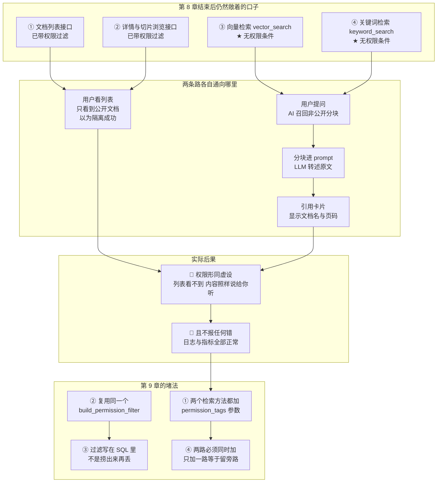
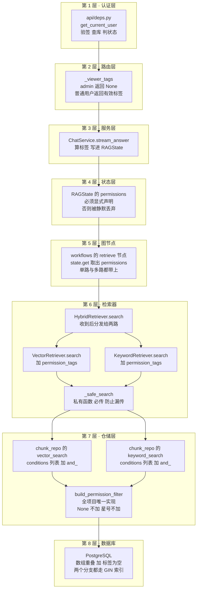

# 09_检索 SQL 加权限过滤

> 期：**Day11 · 认证、权限与安全检索**
> 章：第 3 章 后端实现 · **第 9 章「检索 SQL 加权限过滤」＋ 第 10 章「把路由加到 main.py 里」**
> 记录日期：2026.09.26
> 说明：本篇同样按"我没细看代码"来写 —— 每一处改动都配了"它解决什么问题、少了它会怎样"。

---

## 一、这两章在整条链路里的位置

> **第 8 章做完了"看得到 / 看不到"的隔离，但它漏掉了最要紧的一条路：AI 的检索。**
> **第 9 章把这条路补上，第 10 章确认整条链路的装配没有缺口。**

```
第 3 章 后端实现
├── 第 1～7 章  ……                        ← 已归档
├── 第 8 章  给文档和会话挂上用户态          ← 已归档
│     └── 读接口（列表 / 详情 / 切片 / 下载）全部带上权限过滤
└── 第 9 章  检索 SQL 加权限过滤             ← 你在这里 ★ 本期最核心
      ├── db/repositories/chunk_repo.py         vector_search / keyword_search 拼权限 WHERE
      ├── db/repositories/document_repo.py      过滤器函数升级（顺带修 docstring 里一处错说法）
      ├── retrieval/vector_retriever.py         加 permission_tags 透传
      ├── retrieval/keyword_retriever.py        加 permission_tags 透传
      ├── retrieval/hybrid_retriever.py         两路分发 + _safe_search 必传
      └── workflows/nodes/retrieve.py           从 state 取出 permissions
└── 第 10 章 把路由加到 main.py 里            ← 确认无缺口（事实是：7～8 章已挂好，本章零改动）
```

### 1.1 一句话概括这两章做了什么

**让"没有权限的分块"从源头就进不了召回 —— 而不是捞回来再丢掉。**

```
第 9 章的改动本质上只有一句话：
    在检索用的那两条 SQL 里，各加一个"文档可见性"的 WHERE 条件。

但它是整期权限体系从"覆盖读接口"变成"真闭环"的那一笔。
```

---

## 二、为什么这一步不做，第 8 章就形同虚设



**这张图是本篇最重要的一张**：它把"第 8 章做完之后仍然敞着的口子"画了出来。

### 2.1 那个口子的完整链路

```
第 8 章之后：
  文档列表接口    → 过滤了 ✅   用户只看到公开文档
  详情 / 切片接口 → 过滤了 ✅   直接访问无权文档得到 404
  向量检索        → 没过滤 ❌  ← 就是这里
  关键词检索      → 没过滤 ❌  ← 和这里
        ↓
用户对着 AI 提一个问题
        ↓
检索把【无权文档的分块】照常召回
        ↓
分块被塞进 prompt → LLM 把原文意思转述出来（还带 [N] 引用标记）
        ↓
引用卡片上直接显示【无权文档的文件名和页码】
        ↓
🔴 结果：列表里看不到，内容却一字不差地被告知了
```

> **这就是本期的核心命题**：
> 权限列表做得再严，只要检索不设卡，**AI 就是那条绕过去的路**。
> 而且它绕得毫无痕迹 —— 没有报错、没有告警、日志和指标全部正常。

### 2.2 一个容易被忽略的细节：为什么必须在 SQL 里过滤

```
写法 A（❌）在 Python 里过滤：
    chunks = await chunk_repo.vector_search(embedding, top_k)
    chunks = [c for c in chunks if 我能看(c.document)]

写法 B（✅）在 SQL 里过滤：
    chunks = await chunk_repo.vector_search(embedding, top_k, permission_tags=...)
```

**写法 A 的致命问题不是"多写几行"，而是名额被提前占掉了**：

```
top_k = 20 的语义是"取最相似的 20 条"
        ↓
写法 A：先取 20 条（可能其中 15 条是无权的）
        ↓
再在 Python 里剔掉 15 条
        ↓
最终只剩 5 条给 LLM —— 用户会明显感觉"答案变差了"，
而真正排在 21～35 名的那 15 条**本来有权的**分块，
压根没机会进入候选。
        ↓
写法 B：SQL 里就排除了无权行，20 个名额全部给有权分块
```

> 📌 **可迁移的结论**：**权限过滤是"数据选择"问题，必须在数据层做。**
> 放到应用层过滤，不只是效率问题，它会**静默改变召回的语义**（坑位被无效行占用）。

### 2.3 还有一个更隐蔽的点：两路必须同时加

```
HybridRetriever 是"向量路 + 关键词路"并发，最后 RRF 融合
        ↓
只给向量路加权限、漏了关键词路：
    关键词命中的无权分块 → 照样进融合 → 照样进最终候选
        ↓
等于给越权内容留了一条【旁路】
```

> 所以本章在 `keyword_search` 与 `vector_search` 里做了**严格对称**的改动，
> 并各自写明了"两路必须同时加"的原因。

---

## 三、代码改动逐层拆解



**这张图把"从 HTTP 到数据库"的八个节点串成一条线，可以当成复习时的一张清单。**

### 3.1 第 1～4 层：本章**没有**改动

```
认证层  api/deps.py          验签 + 查库 + 解出 User      （第 5 章做的）
路由层  _viewer_tags         admin → None，普通 → 有效标签 （第 8 章做的）
服务层  ChatService          stream_answer 算标签写进图状态（第 8 章做的）
状态层  RAGState.permissions 字段已声明                    （第 8 章做的）
```

> ⭐ **这正是第 8 章"把 permissions 一路透传到状态层"的价值兑现**：
> 第 9 章只需要在**最末端**接上这一根线，前面四层一行都不用改。
> 如果第 8 章当时图省事、只在路由层做了过滤而不把标签写进状态，
> 那么这一步就得回头重做前面四层。
>
> **一句话**：**透传看起来是"多此一举的搬运"，其实是在给下一步留接口。**

### 3.2 第 5 层 · 图节点 `workflows/nodes/retrieve.py`

```python
# 从状态里取出权限标签（第 9 章新增）
permissions = state.get("permissions")
...
chunks = await retriever.search(
    state["query"],
    recall_top_k=recall_top_k,
    final_top_k=recall_top_k,
    permission_tags=permissions,       # ← 新增
)
```

**四个细节值得记住**：

| # | 细节 | 为什么 |
| --- | --- | --- |
| ① | 用 `state.get("permissions")` 而不是 `state["permissions"]` | 历史调用路径（旧脚本、单测里手搓的 state）可能没这个键；`.get` 拿到 `None` 正好等价于"不过滤"，不会把老代码打断 |
| ② | multi_query 的**每一条子查询**都要带 | 循环里少传一次，就是一条越权召回路径 |
| ③ | 本节点**不做** `is_admin` / 通配判断 | 图内节点只面向统一状态读写；admin 语义已在**进图前**翻译成 `None` 或 `["*"]` |
| ④ | 不在节点里再算一遍标签 | 标签的计算只允许有一个来源（`compute_user_permission_tags`），否则口径会分叉 |

> 📌 **关于 ③ 的通俗说法**：
> 判断"谁是管理员"这件事，只应该在**知道用户是谁**的地方做一次。
> 图里面的节点根本不知道"用户"是什么，它只看到一堆标签。
> 让图节点去认管理员，等于把业务身份概念泄露进纯计算层。

### 3.3 第 6 层 · 检索器（三个文件）

**`vector_retriever.py` / `keyword_retriever.py`：加参数 + 透传**

```python
async def search(self, query: str, top_k: int, *,
                 permission_tags: list[str] | None = None) -> list[RetrievedChunk]:
    ...
    rows = await self.chunk_repo.vector_search(
        embedding, top_k, permission_tags=permission_tags     # ← 原样传到底
    )
```

> **这两个类的定位是"翻译器"**：把 SQL 行翻译成 `RetrievedChunk` 契约。
> 它们**不做权限判断** —— 判断只在仓储层的一个函数里。这就是第 8 章定下的分层收益。

**`hybrid_retriever.py`：分发 + 私有函数必传**

```python
async def search(self, query, *, recall_top_k, final_top_k,
                 permission_tags: list[str] | None = None):
    vector_hits, keyword_hits = await asyncio.gather(
        self._safe_search(VectorRetriever, query, recall_top_k, "vector", permission_tags),
        self._safe_search(KeywordRetriever, query, recall_top_k, "keyword", permission_tags),
    )
```

```python
@staticmethod
async def _safe_search(retriever_cls, query, top_k, label,
                       permission_tags: list[str] | None) -> list[RetrievedChunk]:
                       # ↑ 【故意不给默认值】必传位置参数
```

> ⭐ **为什么 `_safe_search` 的 `permission_tags` 故意不给默认值**：
>
> 如果写成 `permission_tags: list[str] | None = None`，那么将来**新增第三路检索**时
> 忘了传这个参数，Python 不会报错 —— 那一路上就静默变成"不过滤"。
> **而"越权召回且不报错"恰恰是最危险的失效方式（静默失效）。**
>
> 写成必传参数，等于让解释器帮我们保证"两路（以及将来的每一路）都别漏传"。
> 宁可传参麻烦一点，也不要一个会静默降级的默认值。

> 📌 **同一处还有一个小陷阱**：`VectorRetriever.search` 和 `KeywordRetriever.search`
> 被 `@traceable` 装饰过，签名里会**多出一个 `config=None`**。
> 所以调用时不能依赖位置参数，必须用 `permission_tags=` 关键字传 ——
> 本章全部采用关键字传参，正好避开了这个坑。

### 3.4 第 7 层 · 仓储层 `chunk_repo.py`（本节最关键）

**改动模式：把 WHERE 条件先收进列表，再用 `and_` 一次性拼上。**

```python
# vector_search 内部
conditions: list[ColumnElement[bool]] = [
    Document.status == "ready",            # 原有的状态守卫
]
perm_where = build_permission_filter(permission_tags)
if perm_where is not None:
    conditions.append(perm_where)

stmt = (
    select(DocumentChunk, distance.label("distance"))
    .join(Document, Document.id == DocumentChunk.document_id)
    .where(and_(*conditions))              # ← 由 .where(a, b) 改成 .where(and_(*conditions))
    .order_by(distance.asc())
    .limit(top_k)
    .options(selectinload(DocumentChunk.document))
)
```

**为什么不能直接写 `.where(Document.status == "ready", perm_where)`**：

```
权限条件可能是 None（admin / 离线评测不限制）
        ↓
而 `.where(None)` 会直接抛错
        ↓
先"收集进列表，再 and_ 合并"，就能天然表达
"这个条件可能存在、也可能压根不存在"
```

> 📌 **`and_(*conditions)` 与 `.where(a, b)` 的语义完全相同**（都按 AND 连接），
> 只是前者支持条件个数动态变化。这是"可选过滤条件"的通用写法，值得记住。

**`keyword_search` 做的是同构改动**（同样的收集 + `and_`），
只是原有两条条件不同（`status == "ready"` 与 `content_tsv @@ tsquery`）。

### 3.5 第 8 层 · 数据库

```sql
-- 普通用户（以 hr 为例）
WHERE documents.status = 'ready'
  AND (documents.permission_tags && ARRAY['hr']::varchar[]
       OR documents.permission_tags = ARRAY[]::varchar[])

-- admin / 离线评测（permission_tags 传 None）
WHERE documents.status = 'ready'
  -- 连权限条件都不拼
```

---

## 四、⭐ 一个必须记录的实测发现：教程的写法会让索引失效

### 4.1 教程给的是 `func.cardinality(...) == 0`

```python
# 教程（第 9 章）里的写法
return or_(
    func.cardinality(Document.permission_tags) == 0,     # 空数组视为公开
    Document.permission_tags.op("&&")(permission_tags),  # 与用户标签有交集
)
```

本项目第 8 章用的是：

```python
# 本项目沿用（第 8 章就在用，第 9 章保持不变）
return or_(
    Document.permission_tags.op("&&")(permission_tags),
    Document.permission_tags == [],
)
```

**两者语义完全等价**（下面有实测数据），所以一开始我按教程改成了 `cardinality` 版本。
**但实测 EXPLAIN 之后，我把它改了回来**，原因如下。

### 4.2 实测对比（6 万行同构临时表 + GIN 索引）

```
① 本项目写法：permission_tags && ARRAY['hr']  OR  permission_tags = ARRAY[]::varchar[]
────────────────────────────────────────────────────────────────────
Bitmap Heap Scan on t_docs_perf
  Recheck Cond: ((permission_tags && '{hr}') OR (permission_tags = '{}'))
  ->  BitmapOr
        ->  Bitmap Index Scan on ix_t_docs_perm
              Index Cond: (permission_tags && '{hr}')
        ->  Bitmap Index Scan on ix_t_docs_perm
              Index Cond: (permission_tags = '{}')
✅ OR 被规划成 BitmapOr，两个分支各自走 GIN 索引


② 教程写法：permission_tags && ARRAY['hr']  OR  cardinality(permission_tags) = 0
────────────────────────────────────────────────────────────────────
Seq Scan on t_docs_perf                         ← ❌ 索引完全没用上
  Filter: ((status = 'ready') AND
           ((permission_tags && '{hr}') OR (cardinality(permission_tags) = 0)))
```

**结果集完全一致，性能天差地别**：

| 写法 | 命中行数（6 万行语料） | 访问路径 |
| --- | --- | --- |
| `== []`（本项目采用） | **38000** | **BitmapOr → 两个 GIN 索引扫描** |
| `cardinality(...) = 0`（教程） | **38000** | **Seq Scan 全表扫描** |
| 只写 `&&` 漏掉 OR 分支 | **19000** ← 少了一半！ | 单路 GIN 索引扫描 |

### 4.3 为什么 `cardinality()` 用不上索引

```
索引是 gin(permission_tags) —— 默认的 array_ops 操作符族
        ↓
它只认得【数组运算符】：&&（重叠）、=（相等）、@>（包含）…
        ↓
cardinality() 是【函数调用】，不在这个操作符族里
        ↓
规划器无法用它来定位索引条目 → 只能退化成"逐行取出数组、算长度、比 0"
```

> 🔴 **后果**：权限过滤从"毫秒级索引命中"退化成"每查一次就线性扫一遍 `documents` 表"。
> 现在只有 8 篇文档看不出来；**文档一多，它就会成为问答链路上最慢的一环**，
> 而且慢得毫无提示（`EXPLAIN` 之外看不到任何异常）。

### 4.4 这个坑给我们的可迁移教训

```
❌ "两种写法语义一样，所以随便选一个"
✅ "语义一样" 只保证【结果正确】，不保证【性能相当】
```

**判断一个条件能不能走索引的实操方法**：

```
看它是不是【索引操作符族里的运算符】。
  是运算符（&&、=、@>、LIKE '前缀%'…）      → 大概率能走索引
  是函数调用（cardinality、lower、date_trunc…）→ 默认走不了
        ↓
但函数不是"绝对"走不了：
  可以建【表达式索引】CREATE INDEX ... ON t (cardinality(col))
  或用【函数索引兼容的写法】改写条件
本项目选择最简单的一条：直接把条件改写回等值比较。
```

> 📌 **顺带一说**：教程那种写法想解决的"潜在好处"是 NULL 安全
> （`cardinality(NULL) = 0` 求值为 NULL 不成立 → 保守判为非公开）。
> 但本列本来就是 `nullable=False`，不存在 NULL 的可能。
> **为了一个不存在的风险，付出全表扫描的代价，不划算。**

### 4.5 因此本章对 `document_repo` 的改动

| 改了什么 | 说明 |
| --- | --- |
| 空数组分支**保持** `Document.permission_tags == []` | 不采用教程的 `cardinality` 版本，理由见上 |
| docstring 里那句"已实测 EXPLAIN 是 BitmapOr" | **第 8 章写这句话时其实没有实测过**（当时库里只有 8 篇文档，规划器一律 Seq Scan，根本测不出来）。第 9 章补做了 6 万行规模实测，并把真实的计划树写进去 |
| 补充了 `cardinality` 版本的对比数据 | 让后来人知道"为什么不用教程那个写法"，而不是以为漏抄了 |
| 补充了"本函数有两个调用方"的说明 | document_repo（第 8 章）与 chunk_repo（第 9 章），这是它必须放在模块级的原因 |

> ⚠️ **这条要记进"我曾经写错的话"**：第 8 章归档与代码注释里都声称
> "已实测 EXPLAIN 显示 BitmapOr" —— 那是**未经实测的推断**。
> 第 9 章用 6 万行临时表补测后，结论**恰好成立**（`== []` 版本确实是 BitmapOr），
> 但当时那句话的依据是不足的。**结论对不代表过程对。**

---

## 五、第 10 章：把路由加到 `main.py` 里

### 5.1 教程说的与项目实际

```
教程第 10 章的改动：
    app.include_router(auth.router,  prefix="/api")
    app.include_router(users.router, prefix="/api")
    app.include_router(roles.router, prefix="/api")

本项目实际：这三行【第 6、7 章就已经挂好了】
    第 6 章归档：auth 挂载
    第 7 章归档：users / roles 挂载
```

**所以第 10 章在本项目里是"零代码改动"的一章** —— 它的价值在于**做一次装配核对**：

| 核对项 | 结果 |
| --- | --- |
| 全部路由是否都已挂到 `/api` | ✅ 28 条路径全部就位 |
| operationId 是否唯一 | ✅ 39 个，无重复 |
| 新增的 `PATCH /documents/{id}/permission-tags` 是否被识别 | ✅ 出现在 OpenAPI 里 |
| 路由挂载顺序是否有冲突 | ✅ `document_uploads` 先于 `documents` 注册（否则 `/documents/uploads/...` 会被 `/{document_id}` 抢先匹配） |

> 📌 **为什么"零改动"也要单独记一笔**：
> 教程是按自己的代码演进顺序写的，我们的推进顺序与它不同步（我们提前挂了）。
> **如果不写清楚，复习时会误以为"漏做了第 10 章"**；
> 或者更糟 —— 有人照教程再挂一遍，就会出现**重复注册**（同一个端点在 OpenAPI 里出现两次）。
>
> **结论：第 10 章的内容已完成，位置在第 6、7 章。**

### 5.2 至此整条权限链路的完整形态

```
HTTP 请求带令牌
  → api/deps.py 验签查库解出 User
  → 路由层 _viewer_tags 把身份翻译成 None 或有效标签
  → ChatService.stream_answer 算标签并写进 RAGState
  → RAGState 的 permissions 字段承载它进入图
  → retrieve 节点 state.get 取出并透传
  → HybridRetriever 分发给向量路与关键词路
  → VectorRetriever / KeywordRetriever 原样下传
  → chunk_repo 两个检索方法用 and_ 把权限条件拼进 WHERE
  → build_permission_filter 生成"标签重叠 OR 标签为空"
  → PostgreSQL 用 BitmapOr 走 GIN 索引

★★★ 从认证到检索，权限标签一路透传，没有任何环节能绕过。★★★
```

---

## 六、本章与教程的偏离（2 处）

| # | 教程 | 本项目 | 为什么 |
| --- | --- | --- | --- |
| 1 | 过滤器函数叫 `_permission_where`，定义在 **`chunk_repo.py`**，再由 `document_repo.py` **反向 import** | 函数叫 `build_permission_filter`，**仍在 `document_repo.py`**，由 `chunk_repo.py` import | 第 8 章已经把它写在了 `document_repo` 并做了完整注释与验证。本节只需要**复用**，不需要搬家。函数归属哪一侧不影响正确性，关键是**全项目只留一份实现** —— 两份副本必然分叉，而分叉的方向几乎总是"检索那条忘了同步" |
| 2 | 空数组分支用 `func.cardinality(permission_tags) == 0` | 保持 `permission_tags == []` | **实测**：`cardinality` 版本语义等价但会让 GIN 索引失效、退化成 Seq Scan（6 万行实测）。详见 §四 |

> 📌 **关于偏离 1 的一个附带说明**：
> 教程把函数放在 `chunk_repo`、让 `document_repo` 反向 import，从依赖方向上说其实略别扭
> （文档的可见性条件住在切片仓储里）。本项目按已有的落点反过来 import，
> **两边都不产生循环依赖**（`document_repo` 不 import `chunk_repo`），
> 且在语义上"文档的权限条件归属文档仓储"更自然。

---

## 七、验证结果（真机执行，23 项全通过）

> 语料状态：`docs=8` `chunks=82` `roles=2` `users=1(admin)`
> 方式：真库 + 真实 embedding + 真实 LangGraph 图；测完把被改动的文档标签**还原**。

### 7.1 仓储与检索器层（17/17）

```
基线（目标文档为公开，空标签）
  ★ 向量路（不过滤）能召回目标文档分块
  ★ 关键词路（不过滤）能召回目标文档分块

把目标文档改成 hr 门禁（tags=['hr-verify-9']）之后
  ★ 无角色用户：向量路拿不到目标文档任何分块       ← 0 条泄漏
  ★ 无角色用户：关键词路拿不到目标文档任何分块     ← 0 条泄漏
  ★ 持无关标签：向量路拿不到目标文档分块
  ★ 持 hr 标签：向量路能召回目标文档分块
  ★ 持 hr 标签：关键词路能召回目标文档分块
  ★ 通配标签（*）等价于不过滤，结果与 None 完全一致
  ★ 无角色用户仍然看得到公开文档（不是被一刀切全空）  命中 20 条

混合检索（HybridRetriever）
  ★ 无角色用户：召回里没有目标文档分块             ← 0 条泄漏
  ★ 持 hr 标签：能召回目标文档分块
  ★ 两路都活着（无角色时仍能召回公开文档）

规模化 EXPLAIN（6 万行同构临时表）
  ★ 本项目写法：OR 被规划成 BitmapOr 且两分支都走 GIN 索引
  ⚠️ 教程的 cardinality 写法：退化成 Seq Scan（索引没用上）
  ★ 两种空数组写法结果集完全一致        38000 vs 38000
  ★ 漏掉 OR 分支会少召回公开文档        19000 vs 38000

收尾
  ★ 目标文档标签已还原为 []
```

### 7.2 端到端走完整张图（6/6）

> 真实 LangGraph 图 + 真实 embedding + 真实 LLM，问题「差旅费怎么报销？」

| 场景 | route | 召回 | 含目标文档分块 | 拒答 |
| --- | --- | --- | --- | --- |
| 公开 + 不过滤 | hyde | 5 条 | ✅ 有 | — |
| hr 门禁 + **无角色用户** | hyde | 5 条 | **❌ 没有** | **True** |
| hr 门禁 + 持 hr 标签用户 | hyde | 5 条 | ✅ 有 | — |
| hr 门禁 + admin 通配 | hyde | 5 条 | ✅ 有（与不过滤一致） | — |

> ⭐ **第二行是这两章最想证明的事**：
> 无角色用户提问时，**目标文档的分块一条都没进召回**，
> 而剩下的公开文档不足以支撑回答，于是图**正常触发了拒答**（`refused=True`）。
> 也就是说：**权限过滤生效之后，AI 会老老实实说"资料不足"，而不是硬答。**

### 7.3 回归指标

| 项 | 结果 |
| --- | --- |
| OpenAPI 路径数 | **28**（第 9／10 章**无新增端点**，与第 8 章一致） |
| operationId | **39 个且唯一** |
| 全部路由已挂 `/api` | ✅ 28/28 |
| `import app.main` 装配自检 | ✅ 通过（应用工厂可正常构建） |
| `alembic head` | `4f198960f636`（无新迁移） |
| 测试数据清理 | ✅ 标签已还原、临时脚本全部删除 |

---

## 八、⚠️ 已知遗留（承接上一章，未变）

| # | 内容 | 状态 |
| --- | --- | --- |
| 1 | `document_uploads.py` 的 3 个端点（`init`/`complete`/`abort`）**完全没有鉴权** | ❌ **仍未修** → 已独立归档，见下方说明 |
| 2 | 分片上传落地的文档**丢 `permission_tags` 与 `created_by`**，导致一律是空标签（= 公开） | ❌ **仍未修** → 已独立归档，见下方说明 |
| 3 | 前端 `RequireAdmin` 仍处于**临时停用**状态（`return <Outlet />`） | ❌ 仍未恢复；现在评测接口已要求管理员 |
| 4 | `_chunk_meta` 丢弃 `sources` / `vector_rank` / `keyword_rank` | ❌ 未修（前端调试面板少三个字段） |
| 5 | 密码超 72 字节 → 500 | 已归档，等 Day13 全部学完后统一修 |
| 6 | 上传接口不拦 `permission_tags=["*"]` | 传了就等价于公开，配置错误但无害 |

> 📌 **第 1、2 条已合并成一份独立 BUG 归档（2026.09.26 追查后确定它们是同一次改造的两个表现）**：
>
> ```
> 项目阶段性总结/BUG发现与处理/02_2026.9.26/02_直传链路漏掉鉴权与权限标签.md
> ```
>
> **根因是 Day3 的「预签名 URL 直传」传输方式改造**（提交 `655c131`，2026-09-14）：
> 它把一条上传拆成 init / complete / abort 三个端点，
> 等于**新开了三扇门**，而第 11 期的鉴权清单还停在旧协议上（只有 `POST /api/documents`）。
> 那一份文档里有完整证据链、影响评估（含数据核查）与四步修复方案。
>
> **两条合起来意味着**：
> **"用直传链路放进去的文档，任何人都能看，而且任何人（哪怕未登录）都能往里放。"**
> 这是整期权限体系里仍然敞开的最大一个口子，修法很小，但必须记得做。

---

## 九、本章最值得带走的三条设计思路

### 思路一：**权限过滤必须做在"数据选择"那一层，而不是"结果整理"那一层**

```
在 SQL 里过滤 → 名额全部给有权分块，召回质量不变
在 Python 里过滤 → 无权分块先占坑，属主被挤出去，回答质量静默下降
```

> **判断标准**：如果这个条件的作用是"哪些数据有资格参与"，它就该在数据层。

### 思路二：**"宁可不给默认值"——避免静默降级的失效**

```
_safe_search(..., permission_tags: list[str] | None)     # ✅ 必传，漏传直接报错
_safe_search(..., permission_tags=None)                  # ❌ 漏传静默变成"不过滤"
```

> **可迁移的原则**：
> **当一个参数缺失时的默认行为是"放开限制"，就绝不要给它默认值。**
> 反过来说，如果默认行为是"更严格"，给默认值才安全。

### 思路三：**"语义等价"不等于"实现等价"**

```
cardinality(col) = 0  与  col = ARRAY[]   结果一样（实测 38000 = 38000）
但一个走索引，一个全表扫描
        ↓
凡是涉及数据库条件的改动，都要问一句：
    "这个写法还能用上索引吗？"
并且【在真实规模的数据上实测 EXPLAIN】，而不是靠推理。
```

> 📌 附带的一条：**在只有 8 行的表上永远测不出索引问题**（规划器一律选 Seq Scan）。
> 要验证索引，必须**造够规模的数据**（本章用的是 6 万行同构临时表，测完即弃）。

---

## 十、本章地图

```
第 9 章「检索 SQL 加权限过滤」＋ 第 10 章「路由挂载核对」
├── 补的是哪个口子
│   └── ★ 读接口过滤了，但检索没过滤 → AI 会把无权文档的内容念出来
│
├── 八个节点（前四个第 8 章已就位，本章接末端四层）
│   ├── ① api/deps.py            认证（未改）
│   ├── ② _viewer_tags           身份翻译（未改）
│   ├── ③ ChatService            算标签写进状态（未改）
│   ├── ④ RAGState.permissions   字段已声明（未改）
│   ├── ⑤ retrieve 节点          ★ state.get 取出并透传（单路与多路都带）
│   ├── ⑥ 三个检索器             ★ 加参数、分发两路、私有函数必传
│   ├── ⑦ chunk_repo 两个检索     ★ conditions 列表 + and_ 拼权限条件
│   └── ⑧ PostgreSQL             BitmapOr 走 GIN 索引
│
├── 过滤必须写在 SQL 里的两个理由
│   ├── 名额不被无权分块占用（否则召回质量静默下降）
│   └── 两路必须同时加（否则关键词路成为旁路）
│
├── ★ 实测发现：cardinality 写法语义等价但索引失效（6 万行实测）
│   └── 因此不采用教程写法，并修正第 8 章"未实测就断言"的那句注释
│
└── 第 10 章 = 零代码改动的装配核对（auth/users/roles 已在第 6、7 章挂好）

验证 仓储与检索器 17/17 · 端到端走图 6/6 · 28 路径 / 39 operationId
偏离 2 处（复用已有过滤器函数 · 不采用 cardinality 写法）
遗留 6 处（分片上传无鉴权与丢标签仍是最大口子）
```

---

## 十一、最应该学习的图

**图一「检索权限闭环补上的是哪个口子」**
> 一眼看清"第 8 章之后仍然敞着的是什么"，以及"为什么列表看不到、内容却照样泄露"。
> **复习时先看这一张** —— 理解了漏洞，改动自然就记住了。

**图二「检索权限全链路八个节点」**
> 把从 HTTP 到数据库的八个节点串成一条线。
> 适合用来**背链路**：随便从中间抽掉一个节点，问自己"还能不能过滤住"。

> 📌 **关于这两张图的存放形式**：
> 它们以 **Mermaid 源码内嵌**在本文档里（Typora、VS Code + Mermaid 插件、
> 或任何支持 Mermaid 的 Markdown 阅读器都能直接看到图）。
> 之所以不像前几章那样配 `.png`：本机没有 Mermaid 渲染工具链，
> 在线渲染服务又被网络策略拦住了（返回 403）。
> **如果你希望归档里也是图片**，把这两段 Mermaid 贴到
> [mermaid.live](https://mermaid.live) 导出 PNG 放进本目录，再把上面两段
> ```mermaid 代码块换成 `` 即可。

---

## 十二、自查 5 题

1. 第 8 章已经把列表、详情、切片、下载都做了权限过滤，为什么第 9 章还必须再改检索？
   如果没有第 9 章，用户会怎么"看到"无权文档的内容？
2. 为什么权限过滤要写在 SQL 里，而不是把结果捞回来再用 Python 过滤？
   （提示：想一想 `top_k` 这个名字的含义）
3. 为什么 `HybridRetriever._safe_search` 的 `permission_tags` 参数**故意不给默认值**？
   如果给它 `= None`，会出现什么最坏情况？
4. `permission_tags == []` 和 `func.cardinality(permission_tags) == 0` 结果一样，
   为什么本项目选了前者？（用一句大白话说清楚）
5. 教程第 10 章要往 `main.py` 加三行 `include_router`，本项目为什么一行都没加？
   如果不清楚这件事、照着教程再加一遍，会发生什么？

---

## 十三、本章实际新增或修改文件

```
后端
├── backend/app/db/repositories/chunk_repo.py        【修改】357 行 · 两个检索方法加权限条件
│       └── vector_search / keyword_search：conditions 列表 + and_(*conditions)
├── backend/app/db/repositories/document_repo.py     【修改】307 行 · 过滤器 docstring 修正
│       └── 补 6 万行实测计划树 + cardinality 对比 + 两个调用方的说明
├── backend/app/retrieval/vector_retriever.py        【修改】145 行 · search 加 permission_tags 透传
├── backend/app/retrieval/keyword_retriever.py       【修改】100 行 · 同上（两路严格对称）
├── backend/app/retrieval/hybrid_retriever.py        【修改】372 行 · 分发两路 + _safe_search 必传
└── backend/app/workflows/nodes/retrieve.py          【修改】127 行 · state.get("permissions") 并透传

统计：6 个文件全部为修改，diff 为 +193 / -36 行
第 10 章：**零代码改动**（auth / users / roles 已于第 6、7 章挂载完成）

本章归档
└── 项目阶段性总结/Day11_认证、权限与安全检索/02_2026.9.26/08_backend_app_db_repositories_chunk_repo++backend_app_retrieval++backend_app_workflows_nodes/
    ├── 09_检索SQL加权限过滤.md              【本文件】（两张图为内嵌 Mermaid 源码）
    └── 上传日志.md
```

> 🔗 **交叉引用**：
> - 第 8 章归档 §九.3（"检索 SQL 还没有权限过滤"）→ **本章已补齐，这是本期权限链路的最后一块拼图**
> - 第 8 章归档 §四.4（"GIN 索引不会失效"）→ **本章补做了真实规模实测，结论成立，但当时那句话缺少实测依据，已在本章 §四.5 记录更正**
> - 第 8 章归档 §九.1 / §九.2（分片上传无鉴权、丢标签）→ **仍未修，是当前最大的开口**
> - **下一步**：前端章节（登录页、路由守卫、HTTP 拦截器、用户 / 角色管理页、文档管理页接入权限标签）
