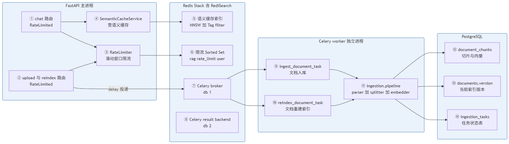
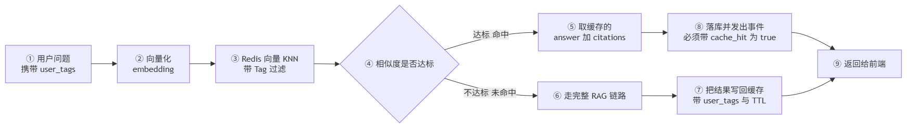
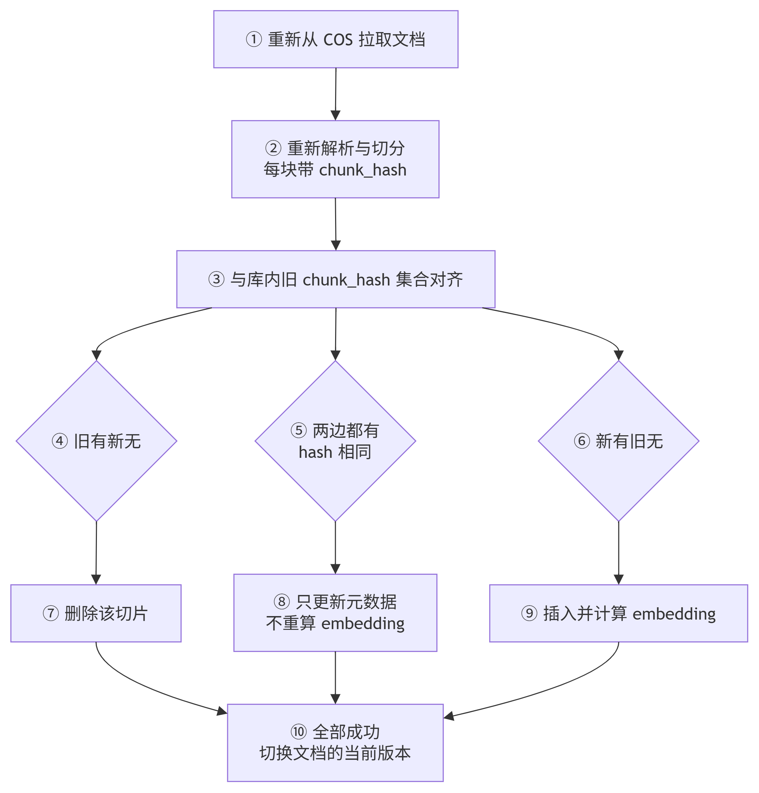

# 01_需求分析与方案设计

> 期：**Day12 · 缓存、限流、异步任务与增量索引**
> 章：**第 1 章 需求分析与方案设计**（本期第一步，尚未写任何代码）
> 记录日期：2026.09.26
> 说明：本篇按"我没细看代码"来写 —— 每处结论都标了**实测依据**，并区分「教程说的」与「本项目实际现状」。

---

## 一、本期目标

> **前面各期一直在做"功能正确性"（能答、答得准、有权限、可评测），**
> **这一期第一次转向"系统性能与可靠性"：让整条链路扛得住并发、禁得起重启、算得起钱。**

要收四件事，**它们各自独立、但服务同一个主题**：

```
① 异步任务     把 ingest 从进程内 BackgroundTasks 搬到 Celery
                → 进程重启不丢任务、可分布式、可重试、可观测

② 语义缓存     问题语义相同就直接返回缓存答案
                → 省下每一次的 LLM 调用费用，响应也从"数秒"变成"毫秒"

③ 增量索引     文档改了一小段，只对真正变了的 chunk 重算 embedding
                → 不重算全部 123 个 chunk，省算力也省时间

④ 接口限流     给 /chat 与 /documents/upload 加保护
                → 这两个接口每个请求都在真金白银地花 token 与算力
```

### 1.1 四件事的关系（为什么放在同一期）

| # | 目标 | 解决什么痛点 | 核心手段 |
| --- | --- | --- | --- |
| ① | 异步任务 | **任务会丢**：进程重启时正在跑的任务直接消失，文档永远卡在中间态 | Celery + Redis broker（任务持久化） |
| ② | 语义缓存 | **重复花钱**：一堆人问同一件事的十种说法，每次都完整跑一遍 RAG + LLM | Redis Stack + RediSearch 向量近邻 + 标签过滤 |
| ③ | 增量索引 | **重复算力**：改一段就要整篇重切重嵌 | `chunk_hash` 集合求差 |
| ④ | 接口限流 | **被拖垮**：单个用户刷 `/chat` 就能把额度与算力吃光 | 滑动窗口（Redis Sorted Set） |

> 📌 **一个共同的技术底座**：②③④ 都指向 **Redis**。
> 这也是为什么本期要一次性上 `Redis Stack`（普通 Redis 没有向量检索能力）。

---

## 二、⚠️ 现状落差（本项目实测，教程不会提）

### 2.1 异步任务的真实短板（对应目标 ①）

教程指出的 `BackgroundTasks` 三个缺点，在本项目**逐条都成立**，且能定位到具体代码：

| 教程说的缺点 | 本项目现状 |
| --- | --- |
| 进程重启，正在跑的任务被直接丢掉，文档永远停在某个状态 | ⚠️ **成立**。`documents.status` 有 `parsing` / `indexing` 两个中间态，重启后没有任何恢复逻辑 |
| 分布式多实例时无法把任务分给其他实例 | ⚠️ **成立**。任务是进程内对象，多副本部署时谁也不认谁 |
| 需要重试功能，只能自己手写 | ⚠️ **成立**。目前的"重试"是人工点按钮（`retryDocument`），没有自动重试 |

**实测：本项目共有 3 处 `background_tasks.add_task`，其中 2 处属于本期改造范围**

| # | 位置 | 挂什么任务 | 是否本期改造 |
| --- | --- | --- | --- |
| 1 | `services/document_service.py` L367 | `ingest_document(document.id)`（上传后） | ✅ **改为 Celery** |
| 2 | `services/document_service.py` L549 | `ingest_document(doc.id)`（重试时） | ✅ **改为 Celery** |
| 3 | `services/document_upload_service.py` L224 | `self.finalize_upload(upload_id)`（直传确认） | ✅ **改为 Celery** |
| 4 | `services/evaluation_service.py` L133（routes 侧） | `execute_evaluation_run(run.id)` | ❌ **本期不动** |

> ⚠️ **第 3 处值得单独说**：它正是 Day11 那个"丢标签"BUG 的案发现场 ——
> `finalize_upload` 跑在**独立的后台会话**里、拿不到请求上下文（所以 `created_by` 至今落不了库）。
> **搬到 Celery 之后依然是独立进程，这个限制不会因为换框架而消失** ——
> 但 Celery 的**任务参数**可以显式携带 `user_id`，反而给"记下谁上传的"开了正路。
> （Day11 归档里把 `created_by` 列为"待修"，本期正好是修它的时机。）

> 📌 **为什么评测任务（第 4 处）本期不搬**：教程本期只讲"文档向量化流程优化"。
> 评测跑批同样是长任务、同样有重启丢失问题，但**擅自扩大范围会让本期的验证量翻倍**。
> 记为**已知同构问题**，留待后续（Day13 或专门一期）。

### 2.2 缓存：一个字都没有（对应目标 ②）

```
实测：全项目搜 redis / cache / semantic → 只有 1 处命中，而且是【注释】
      app/core/security.py L115：「在不引入 Redis 黑名单等重型机制的前提下…」
      → 即：JWT 无法主动吊销这件事，当时就是拿"不想引入 Redis"当理由的
```

**但"缓存"的接口位其实已经预留好了**：

| 位置 | 现状 |
| --- | --- |
| `messages` 表 | 只有 6 列：`id / conversation_id / role / content / metadata / created_at` —— **没有 `cache_hit` 列**。但它有 `metadata` JSONB，Day12 的 `cache_hit=true` 可以落在里面，**不必加列** |
| 前端 `ChatPage.tsx` | UI 层**已经读了** `cacheHit` 字段并在气泡上显示"缓存命中"标签（`UiMessage.cacheHit`），来源是 `m.cache_hit` |
| `services/chat_service.py` | 落库时**没有**写这个字段 |

> 🎯 **所以这是一个"前端预支、后端欠账"的典型状态**（与 Day11 的 `permission_tags` 完全同构）：
> 界面已经准备好了显示"缓存命中"，但后端一个缓存都没做。

### 2.3 增量索引的地基**已经打好了**（对应目标 ③）—— 这是本期最好的消息

```
实测 document_chunks（11 列）：
    id / document_id / content / embedding / page_no / section_path
    chunk_index / chunk_hash / metadata / created_at / content_tsv
                                  ↑ 已经存在
索引：ix_document_chunks_chunk_hash  btree (chunk_hash)     ← 也已经建好了
```

`splitter.py` 的注释写得很明确：

> `chunk_hash`：基于切片正文计算的 **MD5** 指纹摘要，
> **为后续向量库增量更新、去重及缓存命中判定提供唯一幂等标识**。

**也就是说：Day12 的增量索引不是"从零造"，而是"把早就存好、却从没用过的指纹用起来"。**

实测数据现状：

```
chunks 总数 = 123      有 chunk_hash = 123      去重后 = 123
→ 目前【没有】任何重复指纹（110 篇文档 0 重复）
```

> 📌 **这意味着**：增量索引上线后，最大的收益场景不是"跨文档去重"，
> 而是**同一篇文档重新入库时，识别出哪些 chunk 没变**（本期教程的主目标）。

**但有一个缺口**：`documents` 表**没有 `version` 列**（实测 15 列，无 `version`）。
而教程的架构图里明确画了 `documents.version` —— 这是本期要加的第一张"改表"。

### 2.4 限流：一个字都没有（对应目标 ④）

```
实测：全项目搜 rate_limit / RateLimit / 限流 → 0 处命中
```

而这两个接口的代价是实打实的：

| 接口 | 每调一次花什么 |
| --- | --- |
| `POST /api/conversations/{id}/chat` | 一次 embedding + 两次数据库检索 + 一次 rerank + 一次 LLM 生成（按 token 计费） |
| `POST /api/documents` / `uploads/init`+`complete` | 一次 COS 上传 + Docling 解析 + 上百次 embedding + 落库 |

> ⚠️ **值得注意**：Day11 给这两个接口加了**鉴权**，但鉴权只解决"谁能调"，
> **不解决"能调多少次"** —— 一个合法管理员连点 100 次上传，系统照样会被拖垮。
> **本期补的正是这一维。**

### 2.5 依赖现状：Redis / Celery 相关**一个都没装**

```
实测 backend/pyproject.toml（19 个依赖）：
    alembic asyncpg bcrypt cos-python-sdk-v5 docling fastapi httpx
    langchain langchain-community langchain-core langchain-openai
    langchain-text-splitters pgvector pydantic-settings pyjwt
    python-multipart ragas sqlalchemy uvicorn

搜 celery / redis / redisvl / slowapi / limits → 全部 0 命中
```

**本期要新增的依赖（预计）**：

| 包 | 用途 |
| --- | --- |
| `celery` | 任务队列框架（broker + worker） |
| `redis` | Celery broker 的客户端 |
| `redisvl` | **官方 Redis 向量库 Python SDK**（封装 KNN 检索 / Tag 过滤 / TTL） |

> 📌 教程强调：**用 `RediSearch` 模块而不是自己写向量检索**，并且**用官方 `redisvl` 而不是手写 RediSearch 命令**。
> 后者能把"缓存查找"写成声明式 schema + 查询，而不是拼一堆 `FT.SEARCH` 字符串。

---

## 三、关键设计决策

### 3.1 为什么用 Redis Stack，而不是普通 Redis

```
普通 Redis：只有 KV / List / Hash / Set / ZSet
    → 要做"语义近似匹配"，必须把【所有缓存条目全部拉回应用层】，
      在 Python 里逐条算余弦相似度
    → O(全量缓存数) 次浮点运算 + 全量网络传输
    → 缓存条目上万之后，比直接调一次 LLM 还慢

Redis Stack：内置 RediSearch 模块
    → 有 HNSW 向量索引 + 余弦距离 + Tag 过滤，命令完全兼容标准 Redis
    → "找语义最接近的那条缓存" = 一次 KNN 查询，O(log n)
```

> ⭐ **一句话**：**语义缓存的前提是"向量近邻检索"，而普通 Redis 没有这个能力。**
> 自己实现等于把"缓存"做成"全表扫描"。

**为什么选 Redis Stack 而不是别的向量库**：
本期已经必须引入 Redis（Celery 的 broker 要用），**再让 Redis 兼任向量库，等于少维护一个中间件**。

### 3.2 为什么用 RedisVL，而不是手写 RediSearch 命令

```
手写 FT.SEARCH：要在 Python 里拼查询字符串、手写 schema、手工转换 float32 字节
RedisVL：官方维护的 Python SDK，把 schema / KNN / Tag 过滤 / TTL 封装成对象
```

> 📌 与 Day11 选 PyJWT 而不用 passlib 是同一个判断逻辑：
> **能用官方薄封装解决的，就不要自己拼字符串。**

### 3.3 缓存命中不能"简单跳过整条链路"——四条行为必须保留

这是本期设计里最容易被做错的一处。教程明确列出：

| 必须保留的行为 | 为什么 |
| --- | --- |
| **user 消息要入库** | 否则会话历史里"用户问了什么"缺失，对话记录不完整 |
| **citations 事件要发** | 前端要展示引用来源列表，缓存答案同样需要引用 |
| **assistant 消息要落库** | 否则刷新页面后这条回答消失 |
| **且要标记 `cache_hit = True`** | 前端据此显示"缓存命中"标签（该 UI 已就绪） |

```
❌ 错误做法：命中缓存 → 直接 return 缓存文本 → 前面四条全跳过
✅ 正确做法：命中缓存 → 拿到 answer + citations → 仍然走"落库 + 发事件"的收尾流程
```

> 🔴 **注意落库时 `cache_hit` 写哪里**：`messages` 表**没有这一列**，
> 实测它只有 `metadata` JSONB —— 所以写进 `metadata`，**不加列、不需要迁移**。

### 3.3.1 ⚠️ 补丁：缓存 schema **必须**带权限标签过滤（教程大纲未提）

> **本节是看过教程实现大纲后的补充**。大纲第 2 节只有
> `2.1 SemanticCacheService` → `2.2 ChatService 接入缓存`，
> **没有"缓存与权限标签绑定"这一步** —— 这是本期最大的设计缺口。

```
缓存条目如果不带 permission_tags：
    A 用户（hr 角色）提问 → 得到答案 → 写入缓存
        ↓
    B 用户（无角色）问同一个问题 → 语义命中缓存 → 直接拿到 A 的答案
        ↓
    🔴 Day11 刚做好的检索权限过滤，被缓存这条路【完全绕开】
        ↓
    而且用户完全无感：界面正常、没有报错、日志也没有异常
```

**为什么不能"等接 ChatService 时再补"**：

```
RedisVL 的索引 schema 是在建索引时声明的
    → 要把 permission_tags 作为 Tag 字段，必须在【定义 schema 的那一刻】就写进去
        ↓
如果等到 2.2 接 ChatService 时才想起
    → 要回去改 schema + 删索引 + 重建 + 清空已有缓存
        ↓
等于第 2 节返工
```

**结论：在第 2 节增加一步「缓存 schema 设计」，至少包含三样**：

| schema 组成 | 说明 |
| --- | --- |
| `embedding` | 向量字段（维度 1024，与 `text-embedding-v3` 对齐），HNSW + 余弦距离 |
| `permission_tags` | **Tag 字段**，查询时按当前用户的有效标签过滤 |
| `ttl` / `expires_at` | 缓存有效期（见 3.3.2） |

> 📌 **Tag 字段的取值来源**与 Day11 完全一致：`_viewer_tags(user)`（admin → 不限制，普通用户 → 有效标签）。
> **不要另造一套权限口径**，否则缓存与检索会出现两套可见范围。

### 3.3.2 ⚠️ 补丁：缓存失效——只靠 TTL 不够

```
Day11 有 PATCH /documents/{id}/permission-tags     ← 管理员可以【随时】改文档可见性
        ↓
改之前缓存的答案，是按【旧权限】算出来的
        ↓
若缓存还活着 → 改了权限之后，新权限的用户仍可能命中旧答案
        ↓
表现为"权限改了但问答结果没跟着变"，且同样【没有报错】
```

**两个可选方案**：

| 方案 | 做法 | 评价 |
| --- | --- | --- |
| **A（建议）** | 缓存 TTL 设短（把风险窗口限制在可接受范围），并在归档里写明这个取舍 | 简单，本期够用 |
| B | 改 `permission_tags` 时主动失效相关缓存 | 更严格，但要建立"文档 → 缓存条目"的反向索引，本期可能过重 |

> ⚠️ **无论选哪个，都要在文档里写明**——否则以后回看会以为"缓存没有失效机制"是遗漏，
> 而不是有意接受的取舍。

### 3.4 增量索引：`chunk_hash` 集合对齐，比对后分三类

```
① 从 COS 重新拉取文档 → 重新解析切分成 new_chunks（每个都带 chunk_hash）
② 从库里取出该文档现有的全部 chunk_hash，得到 old 集合
③ 求差与交集，分三类处理：

   旧有、新无          → 删除该 chunk
   两边都有（hash 相同）→ 【只更新元数据】chunk_index / page_no / section_path
                          ★ 不重算 embedding ← 这是整个增量的收益所在
   新有、旧无          → 插入新 chunk，并计算 embedding
```

> ⭐ **收益的量化直觉**：假设一份文档 100 个 chunk，只改了 1 段（影响 2 个 chunk）：
>
> | 方案 | embedding 调用次数 |
> | --- | --- |
> | 现在的全量重建 | **100 次** |
> | 增量索引 | **2 次** |
>
> **省下 98%。** 而 embedding 是按量计费的，也是整条入库链路最慢的一环。

**为什么"元数据变了但内容没变"要单独处理**：
chunk 在文档里的位置（第几页、第几节、第几块）可能因为前面插入一段而变化，
但**内容本身没变 → embedding 完全一样 → 没必要重算**。这是最容易漏掉的一类"假变更"。

### 3.5 ⚠️ 补丁：`version` 与 `latest_task` 的取舍（教程大纲与原图不一致）

> **本节是对初版本篇的更正**。初版我照着教程的**架构图**写"必须加 `documents.version`"，
> 但看过**实现大纲**后发现两者对不上：

```
教程架构图（方案设计那一页）：
    PostgreSQL → documents.version          ← 画了 version

教程实现大纲（三、实现步骤 第 5 节）：
    5.5 文档响应附带 latest_task            ← 通篇没有 version
        ↑ 暗示用"最新任务"来表达版本
```

**两条路都可行，但差别不小，必须先定：**

| 方案 | 做法 | 代价 |
| --- | --- | --- |
| **A. 加 `documents.version`** | 新 chunk 带新版本号写入，全部成功后才切换文档的当前版本 | 要加列 + 迁移；**检索 SQL 要多带一个 `version` 条件 → Day11 刚改过的两个检索方法要再动一次** |
| **B. 用 `latest_task` 当版本** | 靠 `ingestion_tasks` 最新一条表达"当前版本"，chunk 不做版本列 | 不用加列；但"任务表"与"数据表"耦合，**原子切换要自己保证** |

**初版本篇倾向 A（版本字段最干净），现在改为倾向 B**，理由有二：

1. **教程实现大纲选了 B** —— 按"严格跟教程"的原则，除非它在本项目会坏
2. **B 不用动 Day11 刚验证过的检索 SQL** —— 少一次回归风险（Day11 刚在 `chunk_repo` 的两个检索方法上踩过"只改 items 不改 count"的坑）

**但方案 B 必须先回答一个问题（建议在做到 5.2 之前确认）：**

```
reindex 中途失败时，用户读到的到底是：
    ✅ 完整的旧版本         → B 可行
    ❌ 一半旧一半新的半成品   → 必须回头补 A（或给 chunk 加 version）
```

> 🔴 **这是本篇唯一一条"必须在动手前想清楚"的问题**。
> 若 `latest_task` 只表示"最近一次任务的状态"，而 chunk 表里新旧切片混在一起、
> 没有字段能区分，那么失败后就会读到半成品 —— 那时再补版本列，等于第 5 节返工。

### 3.6 ⚠️ 补丁：评测任务本期**明确不搬** Celery

实测本项目 `BackgroundTasks` 共 **4 处**，教程大纲第 4 节只覆盖了文档相关的 **3 处**：

| # | 位置 | 挂什么任务 | 大纲是否覆盖 |
| --- | --- | --- | --- |
| 1 | `services/document_service.py` L367 | `ingest_document`（上传后） | ✅ 4.5 |
| 2 | `services/document_service.py` L549 | `ingest_document`（重试） | ✅ 4.5 |
| 3 | `services/document_upload_service.py` L224 | `finalize_upload`（直传确认） | ✅ 4.4 / 4.5 |
| 4 | `services/evaluation_service.py` | `execute_evaluation_run`（评测跑批） | ❌ **未提** |

**不搬是对的**（教程本期只讲"文档向量化流程优化"），但**必须写明这是有意为之**：

> 📌 **写进归档的原话建议**：
> 「评测任务 `execute_evaluation_run` 本期**保持** `BackgroundTasks`。
> 它同样是长任务、同样有重启丢失问题，属于**已知同构问题**，
> 留待后续专门处理。**不是遗漏。**」

否则以后回看会以为漏做了，或者有人顺手改一半 —— 导致评测链路半死不活（比不改更难排查）。

### 3.7 ⚠️ 补丁：Celery worker 与 asyncio 的兼容性，要**提前**验证

```
ingest_document / finalize_upload 都是 async 函数
finalize_upload 内部还自己开 AsyncSessionLocal（因为要在后台跑）
        ↓
Celery worker 默认是【同步进程】
        ↓
若不处理，会踩 "event loop is already running"
或 "attached to a different loop"
```

> ⚠️ **本项目在 Day11 写验证脚本时真实踩过一次同类问题**：
> 多个 engine 绑定了不同的 event loop，报 `attached to a different loop`。
> 所以这不是理论风险。

**建议把大纲的 `4.7 启动 worker 验证` 拆成两半**：

```
4.1 Celery 应用实例建好之后
    → 立刻写一个 hello-world async 任务并跑通         ← 提前验证事件循环
4.7 真正的 worker 验证
    → 验证 ingest_document 全链路
```

**理由**：别等到 `4.4 Celery 任务函数` 写完才发现事件循环不兼容 —— 那时要改的是任务函数签名与调用方式，波及面更大。

---

## 四、整体架构

> ✅ **主架构图 = 教程图的优化版**：**容器划分、节点、编号顺序、连线流程与教程完全一致**。
>
> 相对教程原图，只做了三件"更好读"的事，**不动任何业务含义**：
>
> | # | 只改可读性，不改流程 |
> | --- | --- |
> | 1 | 节点补 **①～⑭ 编号**，配合下方路径表可以顺着读 |
> | 2 | 标签里的 `rag:rate_limit:user:*` 写成 **`rag rate_limit user`** —— 原图这类带 `:` 的字符在 Mermaid 里会被解析器截断 |
> | 3 | 下方补 **「怎么读这张图」路径表**，把三条请求路径写成文字，图里就不用靠追踪长线去认路 |
>
> 📌 **三张图均已导出为 PNG**（`01_主架构图_四容器与三条请求路径.png` / `02_语义缓存的三态流转.png` / `03_增量索引的三分类流转.png`），
> 正文直接引用显示，任何编辑器都能看到。
> 本项目暂无 Mermaid 渲染工具链（本机无 mermaid-cli，在线服务被网络策略拦截），
> 三张图是在 [mermaid.live](https://mermaid.live) 渲染后另存的；需要改图时重新导出即可。

### 4.1 主架构图：四容器与三条请求路径





**怎么读这张图**（三条请求路径 + 一处共享状态，顺着编号读）：

| 路径 | 走法 | 说明 |
| --- | --- | --- |
| **提问（命中缓存）** | ① → ④ → ⑤ | 只查 Redis，**不调 embedding、不检索、不调 LLM** |
| **提问（未命中）** | ① → ③ → 走原 RAG 链路 | 照常跑，跑完再把结果写回 ⑤；**③ 是每次请求都过的限流闸门** |
| **上传 / 重建** | ② → ③ → ⑦ → ⑨ 或 ⑩ → ⑪ → ⑫⑬⑭ | 重活全部交给独立 worker 进程 |
| **限流状态** | ③ → ⑥ | 每次请求都读写一次 Redis |

> ⭐ **四个容器各管一件事**，这是本期分工的本质：
> **主进程只管"接请求 + 判限流 + 查缓存"，worker 只管"干重活"，Redis 只管"共享状态"，PostgreSQL 只管"最终真相"。**

> 🔴 **⑦ → ⑨ 与 ⑦ → ⑩ 那两条线，代表 `.delay()` 投递**：
> 投出去之后主进程立刻返回，而**任务已经持久化在 Redis 里** ——
> 这正是"进程重启任务不丢"的来源（对比现在 `BackgroundTasks` 的任务只活在进程内存里）。

> ⚠️ **节点 ⑬ 标的是 `documents.version`（教程架构图的写法），但教程实现大纲 5.5 走的是 `latest_task`。**
> 图先按架构图画，**最终以哪一列为准见 §3.5** —— 这是本期唯一一处"教程自己前后不一致"。

> 📌 **图里没有画、但要知道的两处**（教程原图同样没有，属刻意留白）：
>
> | 留白 | 在这里看 |
> | --- | --- |
> | 缓存**命中 / 未命中**的分叉走向 | §4.2 缓存三态流转图；本节路径表前两行也写了文字说明 |
> | `ingestion_tasks` 的状态**是怎么被更新的** | §六 的 `4.2` / `4.3`，以及 §3.6 |


### 4.2 语义缓存的三态流转





> 🔴 **⑧ 是本节最容易做错的一步**：命中缓存**不等于**可以跳过落库与事件
> （user 消息 / citations / assistant 消息 / `cache_hit` 标记，四样一个都不能少）。

> ⚠️ **Tag 过滤是缓存的安全底线**：缓存条目必须带上 `permission_tags` 一起存，
> 查询时按**当前用户的标签**过滤。否则会出现
> **"A 用户有权看到的答案被缓存后，B 用户直接命中"** —— 那就把 Day11 刚做好的权限体系一条路绕过去了。
> **这一点教程截图里没展开，但它是本期与 Day11 的交叉风险点，必须显式设计。**

### 4.3 增量索引的三分类流转





> ⭐ **⑧ 就是增量索引的全部价值所在**：省下的正是最贵的 embedding 调用。

> ⚠️ **⑩「切换版本」是本篇唯一一个"必须在动手前想清楚"的点**：
> 教程架构图说用 `documents.version`，实现大纲说用 `latest_task`。
> 两条路都行，但**都要能保证"要么完整旧版本、要么完整新版本"**，
> 不能出现一半旧一半新的半成品。详见 §3.5。

---

## 五、数据模型与依赖变化

### 5.1 本期涉及的表

| 表 | 动作 | 说明 |
| --- | --- | --- |
| `ingestion_tasks` | **新建**（大纲 4.2 明确） | 异步任务状态表：让 Celery 任务可查询、可重试、可观测；并提供 `latest_task` 给文档响应 |
| `documents` | **加列待定** | 架构图画了 `version`，但实现大纲走 `latest_task`。**两者取一，见 §3.5** |
| `document_chunks` | **加列待定** | 只有当上一行选 `version` 方案时才需要 |
| `messages` | **不加列** | `cache_hit` 写进已有的 `metadata` JSONB（实测 messages 只有 6 列，但 `metadata` 够用） |

> 🔴 **本表相对初版有一处实质更正**：
> 初版写"`documents` 必须加 `version`"，是照**架构图**下的结论。
> 看过**实现大纲**后确认两者不一致（大纲 5.5 走 `latest_task`），
> **已改为"待定"，并倾向大纲的方案 B**（少动 Day11 刚验证过的检索 SQL）。详见 §3.5。
>
> ⚠️ 若最终选 `version` 方案，则现有 `ix_document_chunks_chunk_hash` 可能需要调整，
> 且**检索 SQL 要多带一个 `version` 条件** —— Day11 刚改过的两个检索方法要再动一次。

### 5.2 依赖新增（预计 3 个）

```toml
celery    # 任务队列
redis     # broker 客户端
redisvl   # 官方 Redis 向量库 SDK
```

**同时要新增的运行组件**：一个 Redis Stack 实例（含 RediSearch 模块）。
本机已有 `rag-kb-postgres` 容器，预计再起一个 `rag-kb-redis`。

> ⚠️ **部署注意**：普通 `redis` 镜像**没有** RediSearch 模块，必须用 `redis/redis-stack` 镜像，
> 否则语义缓存在运行时会报"未知命令 FT.CREATE"。

---

## 六、实现顺序（已对照教程实现大纲校正）

> ✅ **本节已按教程实现大纲更新**。初版是我按依赖关系推断的（9 步），
> 与大纲实际结构有两处实质差异，见下方"与初版的差异"。

### 6.1 教程的实现大纲（五节）

```
三、实现步骤
├── 1、引入 Redis 与依赖
├── 2、语义缓存
│     ├── 2.1 SemanticCacheService
│     ├── 2.2 ChatService 接入缓存
│     ├── 2.3 SSE / Schema / 前端透传 cache_hit
│     └── 2.4 前端展示「缓存命中」Tag
├── 3、滑动窗口限流
│     ├── 3.1 RateLimiter
│     └── 3.2 把限流挂载到 deps
├── 4、Celery 异步任务
│     ├── 4.1 Celery 应用实例
│     ├── 4.2 ingestion_tasks 表
│     ├── 4.3 IngestionTaskRepository
│     ├── 4.4 Celery 任务函数和 pipeline 改造
│     ├── 4.5 DocumentService 切到 Celery
│     ├── 4.6 路由层去掉 BackgroundTasks
│     └── 4.7 启动 worker 验证
└── 5、增量索引
      ├── 5.1 chunk_repo 补两个方法
      ├── 5.2 reindex pipeline
      ├── 5.3 DocumentService.reindex
      ├── 5.4 reindex 路由
      ├── 5.5 文档响应附带 latest_task
      └── 5.6 前端「上传新版本」按钮

四、运行验证（1 语义缓存命中 · 2 滑动窗口限流）
五、扩展
```

### 6.2 与初版推断的差异（两处，其中一处大纲更优）

| # | 初版（我的推断） | 教程大纲 | 评价 |
| --- | --- | --- | --- |
| 1 | Celery 排第 **3** 位 | Celery 排第 **4** 位 | ✅ **大纲更优**。它按"改动风险递增"排：第 1～3 步都是**往外加**（新增文件与路径，几乎不动现有链路）；第 4～5 步才是**往里改**（改 3 处 add_task、改路由层、改已跑通的全量重建逻辑）。**先加后改，风险梯度正确** |
| 2 | 缓存 schema 与 SemanticCacheService 相邻两步 | 大纲把 schema **并入 2.1** | ⚠️ **有缺口**：schema 若不显式声明 `permission_tags` Tag 字段，缓存会绕过 Day11 权限。**建议在 2.1 内部显式拆出"2.1a schema 设计"**，见 §3.3.1 |

> ⭐ **另一处值得学习的拆分**：`4.5 DocumentService 切到 Celery` → `4.6 路由层去掉 BackgroundTasks`
> 拆成两步，意味着**切换过程中有中间态**（服务层先换、路由层再收），便于中途验证。
> 一步到位反而不好排查。

### 6.3 建议补充进大纲的三条（展开见 §三）

```
① 在 2.1 内显式包含"缓存 schema 设计"（向量 + permission_tags Tag + TTL）   → §3.3.1
② 把 4.7 的验证拆一半到 4.1（先跑通 hello-world async 任务）                → §3.7
③ 在文档里写明"评测任务本期不搬 Celery"                                    → §3.6
```

**为什么"增量索引"排最后（大纲与初版在这点上一致）**：
它要改的是**已经跑通的全量重建逻辑**，必须先把 Celery 任务化、版本一致性都打好底，
否则出问题时分不清是"任务调度错了"还是"比对逻辑错了"。

---

## 七、⚠️ 风险预警

### 7.1 语义缓存 × Day11 权限 = 本期最大风险

```
缓存条目如果不带 permission_tags：
    A 用户（hr 角色）提问 → 得到答案 → 写入缓存
        ↓
    B 用户（无角色）问同一个问题 → 命中缓存 → 直接拿到 A 的答案
        ↓
    🔴 Day11 辛苦做的检索权限过滤【被缓存这条路完全绕开】
```

**必须在第 2 节设计缓存 schema 时就带上 Tag 过滤**（即大纲的 `2.1` 内），
而不是等到 `2.2` 接 ChatService 时才想起来。**展开见 §3.3.1。**

### 7.2 增量索引 × 权限 = 第二个交叉风险

Day11 给 `chunk_repo` 的两个检索方法加了权限条件；本期若为 `version` 再加一个条件，
**两个条件必须同时作用于检索、列表、计数三处**（Day11 踩过"只改 items 不改 count"的坑）。

### 7.3 缓存 × 可观测性 = 指标会"变好看"

命中的问答**不经过图**，因此：
```
LangSmith 上的 trace 会变少、延迟平均值会变低
Day10 的评测指标如果受缓存影响，就不再反映"真实检索质量"
```
**对策**：评测路径（`answer_for_evaluation`）应**绕过缓存**，或在指标里标注缓存命中率。

### 7.4 Celery × 现有"独立会话"约定

`finalize_upload` 现在自己开 `AsyncSessionLocal()`（因为要在后台跑）。
搬到 Celery 后**这个模式要继续保持**（worker 进程里没有请求级 session），
但要额外注意：**Celery worker 也是 asyncio 环境吗？**
若 worker 用同步模式跑异步函数，需要显式 `asyncio.run()` 包装 —— 这是常见的踩坑点。
**→ 已单列成 §3.7，建议在 `4.1` 就提前验证，不要等到 `4.7`。**

---

## 八、本期验收标准（先定好，写代码时照这个测）

### 8.1 教程大纲自带的验证（2 条）

```
1 语义缓存命中
2 走一遍滑动窗口限流
```

### 8.2 ⚠️ 建议补充的 8 条（大纲未覆盖）

大纲的"四、运行验证"只有上面 2 条，**覆盖不到本期最容易出事的地方**。
下面按"哪条对应哪个风险"列出来：

| # | 验收项 | 期望 | 对应风险 |
| --- | --- | --- | --- |
| 3 | 同一问题换一种说法问两遍 | 第二遍**命中缓存**，响应明显变快，`metadata.cache_hit = true` | 目标 ② |
| 4 | 缓存命中时检查落库 | **user 消息、citations、assistant 消息、cache_hit 四样齐全** | §3.3 |
| 5 | ★ **不同权限用户问同一问题** | **不能**互相命中对方的缓存（Tag 过滤生效） | §3.3.1 / §7.1 |
| 6 | ★ 上传文档后**杀掉 worker**，再重启 | 任务**不丢**，文档最终能到 `ready` | 目标 ① 的核心价值 |
| 7 | 改文档一小段后 reindex | 只有**变化的 chunk 重算 embedding**；未变 chunk 的 `embedding` 值不变 | 目标 ③ |
| 8 | ★ reindex 中途失败 | 文档仍能读到**完整的旧版本**，不是半成品 | §3.5（version 方案是否成立） |
| 9 | 高频调用 `/chat` | 超过阈值返回 **429**，返回体说明限流原因 | 目标 ④ |
| 10 | 限流按用户隔离 | A 用户被限流**不影响** B 用户 | 目标 ④ |

### 8.3 ⚠️ 五条回归底线（本期改造不能打破的既有能力）

| # | 验收项 | 期望 | 为什么必须测 |
| --- | --- | --- | --- |
| 11 | **Day11 权限仍生效** | 检索权限过滤不受缓存与新 SQL 条件影响 | 缓存与 version 都可能绕过它 |
| 12 | **Day10 评测指标持平** | 与本期改造前基本持平 | 评测路径若命中缓存，指标就变成"测缓存"而不是"测检索质量" |
| 13 | 旧上传链路仍可用 | `POST /api/documents`（multipart）与直传链路都能正常入库 | Day12 要改 3 处 add_task，容易顾此失彼 |
| 14 | OpenAPI 契约不破坏 | 路径与 operationId 数量只增不减、且唯一 | 前端 SDK 依赖它（Day11 刚核对过 28 路径 / 39 operationId） |
| 15 | 前端 `tsc -b` | exit 0 | 2.3 / 2.4 / 5.6 都要动前端 |

> 📌 **13～15 是我按本项目情况加的"工程底线"**，教程不会写，但每次改造都该跑一遍。

---

## 九、本节地图

```
第 1 章 需求分析与方案设计
├── 一、本期目标        四件事：异步任务 / 语义缓存 / 增量索引 / 接口限流
│     └── 共同底座：都要 Redis（所以一次上 Redis Stack）
├── 二、现状落差 ⚠️（本项目实测）
│     ├── 2.1 BackgroundTasks 三个缺点逐条成立；4 处 add_task（评测那处本期不动）
│     ├── 2.2 缓存零基础；但前端 UI 已预支 cache_hit 显示、messages.metadata 够用
│     ├── 2.3 ★ 增量索引地基已打好：chunk_hash 列与索引都在，只是从没用过
│     ├── 2.4 限流零基础；Day11 的鉴权只解决"谁能调"，不解决"能调多少次"
│     └── 2.5 依赖零基础：celery / redis / redisvl 一个都没装
├── 三、关键设计决策（3.1～3.4 来自教程；3.3.1 起是看过大纲后的补丁）
│     ├── 3.1 Redis Stack 而非普通 Redis（普通 Redis 没有向量近邻能力）
│     ├── 3.2 RedisVL 而非手写 FT.SEARCH（官方薄封装）
│     ├── 3.3 缓存命中不能跳过四条行为（落库两条 + 事件 + cache_hit）
│     ├── 3.3.1 ⚠️ 缓存 schema 必须带 permission_tags（大纲缺口）
│     ├── 3.3.2 ⚠️ 缓存失效：只靠 TTL 不够（大纲缺口）
│     ├── 3.4 增量索引三分类（删 / 只更新元数据 / 插入并嵌入）
│     ├── 3.5 ⚠️ version 与 latest_task 的取舍（架构图与大纲不一致）
│     ├── 3.6 ⚠️ 评测任务本期明确不搬 Celery
│     └── 3.7 ⚠️ Celery × asyncio 兼容性要提前验证
├── 四、整体架构        三张图（主架构·缓存三态·增量三分类）
├── 五、数据模型        新建 ingestion_tasks；version 待定；messages 不加列
├── 六、实现顺序        教程五节大纲（已校正）+ 与初版的两处差异
├── 七、风险预警 ⚠️      缓存 × 权限（最大）/ 增量 × 权限 / 缓存 × 可观测 / celery × 异步会话
└── 八、验收标准        15 条（教程自带 2 + 建议补 8 + 回归底线 5）
```

---

## 十、最应该学习的图

**图一 `主架构图：四容器与三条请求路径`**
> **容器划分、节点、编号顺序、连线流程与教程完全一致**（四个容器横向：FastAPI → Redis Stack → Celery worker → PostgreSQL），
> 只在可读性上做了三件事：补 ①～⑭ 编号、修掉会被解析器截断的标签（`rag:rate_limit:user:*` → `rag rate_limit user`）、
> 补一张路径表（不用靠追踪长线去认路）。
>
> **看图顺序建议**：先顺着编号读一遍路径表的三条路径，再回图里对照编号，
> 这样"哪条线属于哪条请求"一眼就能分清，不用来回追线。

**图二 `语义缓存的三态流转`**
> 把"命中 / 未命中"两条路并排画出来，并标出**命中之后仍然必须落库**这一步。
> ⚠️ 看这张图时要额外记住 §3.3.1：**③ 那一步的 KNN 查询必须带 Tag 过滤**，
> 否则"不同权限用户互相命中缓存"会从这条路绕开 Day11 的权限体系。
> 复习时看这一张就够，不用回去翻文字。

**图三 `增量索引的三分类流转`**
> 把"集合对齐 → 分三类处理 → 切换版本"讲成一条直线。
> ⭐ 中间的「两边都有 hash 相同 → 只更新元数据」就是本期省下 98% embedding 的那个分叉。
> ⚠️ 末端的「切换版本」是 §3.5 那个待定问题 —— **画在图上但方案还没定**。

---

## 十一、本节实际新增或修改文件

```
一、第 1 章 需求分析与方案设计（纯文档，未改动任何代码）

项目阶段性总结/Day12_缓存、限流、异步任务与增量索引/01_需求分析与方案设计/
└── 01_需求分析与方案设计.md        【本文件】（三张图为内嵌 Mermaid 源码）

二、本项目现状核查（只读，未产生改动）
   查询了 documents / document_chunks / conversations / messages / upload_sessions
   的列结构与索引，以及 pyproject.toml 依赖、全项目 redis 与 rate_limit 关键字命中等

三、文档修订记录

  初版（2026.09.26）        按教程「需求分析 + 方案设计」两页截图写
  修订版（2026.09.26）      用户提供「三、实现步骤」完整大纲后校正，共 7 处：
     ① 新增 §3.3.1  缓存 schema 必须带 permission_tags（大纲缺口，最高优先级）
     ② 新增 §3.3.2  缓存失效只靠 TTL 不够（大纲缺口）
     ③ 新增 §3.5    version 与 latest_task 的取舍（架构图 vs 大纲不一致）
     ④ 新增 §3.6    评测任务本期明确不搬 Celery（4 处 add_task 只覆盖 3 处）
     ⑤ 新增 §3.7    Celery × asyncio 兼容性提前验证
     ⑥ 重写 §六     用教程五节大纲替换初版的 9 步推断，并记录两处差异
     ⑦ 扩充 §八     验收标准 10 条 → 15 条（补 8 条 + 5 条回归底线）
  二次修订（2026.09.26）    §4.1 主架构图改为「教程图的优化版」：
     · 第一次改成了纵向四层重排 —— 用户反馈「还是教程的图更好理解」，已回退
     · 最终方案：**容器划分与连线流程完全照教程**，只改可读性四件事
       （补编号 / 修会被截断的标签 / 合并重复连线 / 补路径表）
```

> 🔗 **与前面各期的关系**：
> - **Day04/05/06** 建立的检索链路 → 本期给它的入口加缓存与限流
> - **Day10 评测** → 本期缓存**不能让评测路径命中**，否则指标失真；评测任务本期**不搬 Celery**
> - **Day11 权限** → 本期缓存必须带 `permission_tags` 做 Tag 过滤，
>   否则"A 看到的答案被 B 命中"会**从缓存这条路绕过刚做好的权限体系**（§3.3.1 / §7.1）
> - **Day11 归档遗留的 `created_by`** → 本期换 Celery 后，任务参数可以显式携带 `user_id`，
>   给了"记录谁上传的"一条正路（§2.1）
