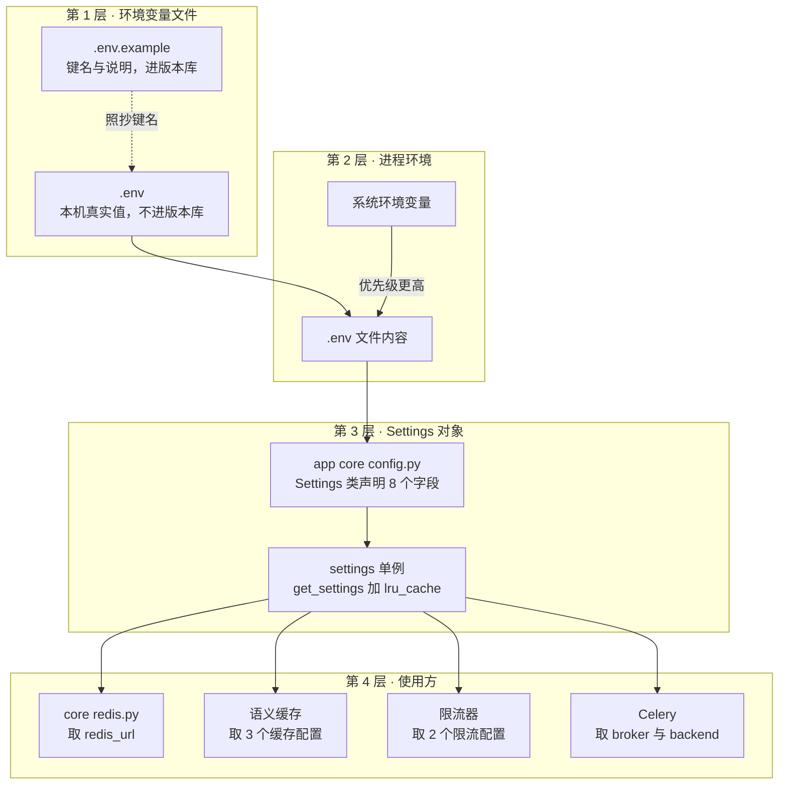
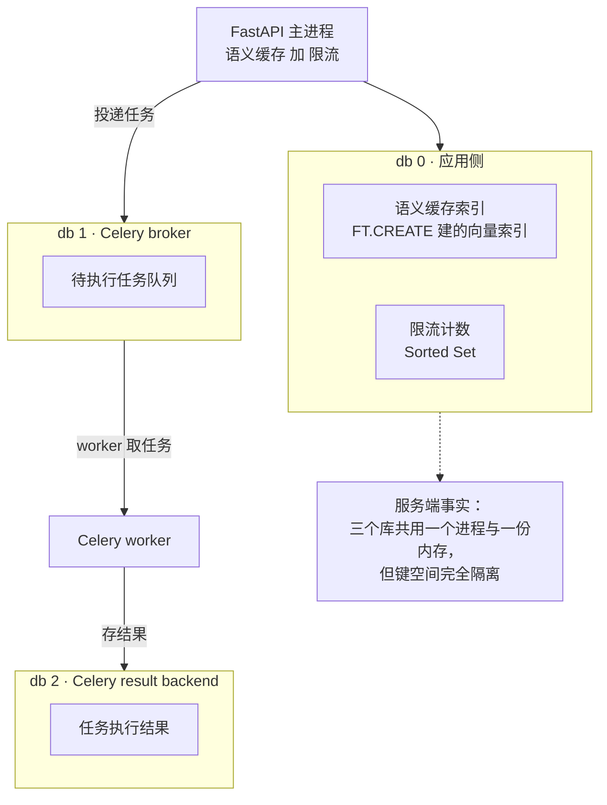

# 01_引入Redis与依赖

> 期：**Day12 · 缓存、限流、异步任务与增量索引**
> 章：**第 1 章「引入 Redis 与依赖」**（本期第一个动手的章节）
> 记录日期：2026.09.27
> 说明：本篇按"我没细看代码"来写 —— 每处改动都配了"它解决什么问题、少了它会怎样"。

---

## 一、本章在整条链路里的位置

> **本期四件事（异步任务 / 语义缓存 / 增量索引 / 接口限流）里，有三件都要用到 Redis。**
> **所以本章不是"某一件事的第一步"，而是"四件事共同的地基"。**

```
第 1 章 需求分析与方案设计        ← 已归档（只画图、没写代码）
└── 第 2 章 引入 Redis 与依赖      ← 你在这里（本期第一个动手的章节）
      ├── pyproject.toml / uv.lock     装 3 个依赖
      ├── .env / .env.example          加 11 个配置键
      ├── app/core/config.py           加 8 个 Settings 字段
      ├── app/core/redis.py            ★ 新增：异步客户端单例
      └── app/core/exceptions.py       ★ 新增：RateLimitError（429）
```

### 1.1 本章的定位：只搭地基，不实现功能

```
本章结束时，你能做到：
    ✅ 从 Python 连上 Redis Stack
    ✅ 读到 RediSearch 模块（语义缓存的前提）
    ✅ 拿到一个进程内唯一的异步客户端
    ✅ 抛出一个语义正确的 429 异常

本章结束时，你还【没有】：
    ❌ 任何缓存逻辑（第 3 章）
    ❌ 任何限流逻辑（第 4 章）
    ❌ 任何 Celery 任务（第 5 章）
```

> 📌 **这种"先搭地基"的章节容易让人低估**。
> 但它的价值在于：**后面三章都不需要再碰配置与依赖**，
> 而且环境层面的坑（下详）会在这里一次性暴露完。

---

## 二、先搞清楚：这一章到底引入了几个"东西"

初学者最容易在这里糊涂 —— "Redis"这个词同时指了三样东西。先分清：

| # | 引入的东西 | 是什么 | 谁在用 |
| --- | --- | --- | --- |
| 1 | **`redis` 这个 Python 包** | Redis 官方异步客户端 | 语义缓存、限流 |
| 2 | **`redisvl` 这个 Python 包** | Redis 官方**向量库** SDK | 语义缓存（做向量近邻） |
| 3 | **`Redis Stack` 这个服务** | 装了模块的 Redis **服务端**（不是普通 Redis） | 上面两个 + Celery |
| 4 | **`celery` 这个 Python 包** | 任务队列框架 | 异步任务 |

### 2.1 服务端（Redis Stack）与客户端（redis / redisvl）的区别

```
Docker 容器 rag-kb-redis
    = redis/redis-stack-server:7.4.0-v0        ← 服务端，跑在 6379
        内含模块：search（RediSearch）/ ReJSON / bf / timeseries / redisgears_2
        ↓ 通过 TCP 连接
Python 进程（FastAPI / Celery worker）
    ├── redis 包      → 普通 KV 操作（SET/GET/Sorted Set…）
    ├── redisvl 包    → 向量索引与 KNN 查询（它内部还是用 redis 包的连接）
    └── celery 包     → 把任务投递/取出队列
```

**一句话**：**服务端负责"能做什么"，客户端负责"怎么调用"。**
装了 `redisvl` 包但连的是普通 Redis，照样用不了向量检索 ——
因为能力在**服务端模块**里，不在客户端包里。

### 2.2 为什么必须用 Redis Stack，而不是普通 Redis

```
普通 redis 镜像：只有 KV / List / Hash / Set / ZSet
    → 想做"语义近似匹配"，只能把【所有缓存条目全部拉回应用层】逐条算余弦相似度
    → O(全量缓存数) 的浮点运算 + 全量网络传输
    → 缓存条目上万之后，比直接调一次 LLM 还慢

Redis Stack：内置 RediSearch 模块
    → HNSW 向量索引 + 余弦距离 + Tag 过滤，命令完全兼容标准 Redis
    → "找语义最接近的那条缓存" = 一次 KNN 查询，O(log n)
```

> 🔴 **如果镜像用错，症状是运行时报 `unknown command 'FT.CREATE'`** ——
> 不是启动报错、不是连不上，而是**第一个用到向量功能的代码路径**突然炸。
> 这类"装的时候没事、用的时候才炸"的问题，排查成本很高。

### 2.3 实测确认的三个环境事实

```
redis_version = 7.4.0
已加载模块    = ReJSON / RedisCompat / bf / redisgears_2 / search / timeseries
逻辑库数量    = 16（db 0 ~ db 15）
```

> ⚠️ 其中 `search` 是**语义缓存的前提**，实测专门单独断言了它（见 §六）。

---

## 三、配置：11 个键的三层流向

### 3.1 一张图看懂"配置从哪来、到哪去"



**优先级规则**（`config.py` 里写明的）：**系统环境变量 > `.env` 文件 > 代码默认值**。

### 3.2 11 个键分三组

| 组 | 键 | 值 | 作用 |
| --- | --- | --- | --- |
| **连接** | `REDIS_PORT` | `6379` | 仅作记录（URL 里已含端口） |
| | `REDIS_URL` | `redis://localhost:6379/0` | **应用侧**：缓存 + 限流 |
| | `CELERY_BROKER_URL` | `redis://localhost:6379/1` | Celery **待执行任务** |
| | `CELERY_RESULT_BACKEND` | `redis://localhost:6379/2` | Celery **任务结果** |
| **缓存** | `SEMANTIC_CACHE_ENABLED` | `true` | 总开关（便于做有/无对比） |
| | `SEMANTIC_CACHE_TTL_SECONDS` | `3600` | 单条缓存最长存活 1 小时 |
| | `SEMANTIC_CACHE_MIN_SIMILARITY` | `0.92` | 余弦相似度命中阈值 |
| **限流** | `RATE_LIMIT_ENABLED` | `true` | 总开关（便于本地压测） |
| | `RATE_LIMIT_PER_MINUTE` | `60` | 单用户每分钟上限 |

> 📌 `REDIS_PORT` 这一项**在本项目里其实没被代码读取** ——
> 它只是让 `.env` 的端口信息一眼可见，避免出现"URL 里写 6379、上面又写 6380"的不一致。
> 教程这么给的，我们照跟。

### 3.3 ⭐ 最值得理解的一处：为什么一台 Redis 要分成三个逻辑库

这是本章信息量最大的一个设计决策。

```
Redis 默认提供 16 个逻辑库（db 0 ~ db 15）
    → 同一个进程、同一块内存、同一个端口
    → 但【键空间完全隔离】：db 0 里的 foo 与 db 1 里的 foo 是两个互不相关的键
```

**三个库的划分依据不是"数据量"，而是"生命周期与清理策略"**：

| 库 | 用途 | 想清理时会发生什么 | 是否可随手清空 |
| --- | --- | --- | --- |
| **db 0** | 语义缓存 + 限流计数 | 缓存失效了想推倒重来 | ✅ **可以**，丢了只是下次重新查一遍 |
| **db 1** | Celery broker（待执行任务） | 清掉 = **所有排队任务直接丢失** | ❌ **绝对不行** |
| **db 2** | Celery result backend（执行结果） | 清掉 = 查不到历史结果 | ⚠️ 影响最小，但仍不建议 |

> ⭐ **一句话记法**：
> **"能随手清掉的"和"清掉会出事的"必须分开放。**
> 如果三个混在 db 0 里，某天你想 `FLUSHDB` 清缓存，
> 就会连带把待执行的文档解析任务全部丢掉 —— 而且**不会有任何报错**。

### 3.4 逻辑库隔离的实测（这条是专门防"URL 写错库"的）

```
同一个键名 day12:verify:samekey 在三个库各写一次：
    db0 → '来自 db0'
    db1 → '来自 db1'
    db2 → '来自 db2'
三者互不覆盖 ✅
```

**为什么要专门测这个**：
`redis://localhost:6379/1` 与 `.../0` 只差一个字符，写错了**不会报任何错** ——
只会让"应用缓存"和"任务队列"互相看到对方的键。

```
最危险的一类笔误：
    REDIS_URL 误写成 /1
        ↓
    SemanticCache 把缓存写进了 broker 库
        ↓
    结果：Celery worker 可能把缓存条目当成任务去消费（或反之）
    两种组件共用一个键空间，键名冲突时的行为完全不可预期
        ↓
    而且【没有任何报错】，只表现为"偶尔有奇怪的任务/缓存行为"
```

---

## 四、核心代码：三个文件

### 4.1 `app/core/redis.py`（新增）—— 异步客户端单例

**整个文件只有一行有效代码**，但那一行的两个参数都是刻意的：

```python
@lru_cache(maxsize=1)
def get_redis() -> Redis:
    return aioredis.from_url(settings.redis_url, decode_responses=True)
```

#### ① 为什么要 `lru_cache`（进程内单例）

```
redis.asyncio.from_url(...) 每次调用都会新建一个【连接池】
        ↓
若语义缓存、限流、将来的组件各建一个：
    ① 连接数翻倍（Redis 侧看到的 client 数比预期多，排查时容易被误导）
    ② 每个池各自维护空闲连接，资源利用率变差
    ③ 关闭时机不统一，进程退出时容易留下未释放的连接
        ↓
用 lru_cache 把"同一条 URL 只建一个客户端"收敛成一个函数
全项目只从 get_redis() 取客户端
```

**实测**：两次 `get_redis()` 返回**同一个对象**（`c1 is c2 == True`）。

#### ② 为什么要 `decode_responses=True`

```
默认（False）：返回 bytes
    → 每处取值都要 v.decode()、每处写值都要 v.encode()
    → 漏一处就是"看起来存进去了，取出来是 b'...'"这类难查的小 bug

decode_responses=True：读写自动以 str 处理
    → 本项目缓存的是文本（问题、答案、标签），用 str 更贴合，省掉全部手工编解码
```

> ⚠️ **代价（要知道，但本项目不受影响）**：
> 存**二进制**（如 float32 向量字节）时必须显式标注类型。
> 本项目的向量是交给 **RedisVL** 处理的，不走这个客户端 —— 所以这个代价我们不用付。

**实测**：写 `"中文测试"` 读回来是 `str` 类型且无乱码。

#### ③ 为什么这个客户端**只连 db 0**

```
本模块 = 【应用侧】客户端（语义缓存 + 限流）→ db 0
Celery 的 broker（db 1）与 result backend（db 2）
    → 由 Celery 自己按配置直连，【不共用这个客户端】
```

**理由**：三者的生命周期与清理策略完全不同（见 §3.3），
共用一个客户端只会让"谁在用哪个库"变得模糊。

### 4.2 `app/core/config.py`（修改）—— 8 个字段

| 字段 | 默认值 | 备注 |
| --- | --- | --- |
| `redis_url` | `redis://localhost:6379/0` | 应用侧 |
| `celery_broker_url` | `redis://localhost:6379/1` | |
| `celery_result_backend` | `redis://localhost:6379/2` | |
| `semantic_cache_enabled` | `True` | |
| `semantic_cache_ttl_seconds` | `3600` | |
| `semantic_cache_min_similarity` | `0.92` | |
| `rate_limit_enabled` | `True` | |
| `rate_limit_per_minute` | `60` | |

> ⚠️ **注意 `Settings` 里 `extra="ignore"`**（第 2 章就设过）：
> **未声明的键会被静默丢弃**。所以 `.env` 里写了、`Settings` 里没声明 = **等于没写**，
> 而且不报错。这也是为什么本项目此前踩过 `HF_ENDPOINT` 从未生效的坑。
> **本章 8 个键全部在 `Settings` 里声明了**，`.env` 的值才真的生效。

### 4.3 `app/core/exceptions.py`（修改）—— `RateLimitError`

```python
class RateLimitError(AppException):
    code = "rate_limited"
    message = "请求过于频繁，请稍后再试"
    http_status = HTTPStatus.TOO_MANY_REQUESTS   # 429
```

**为什么单独一个类，而不是复用 `PermissionDeniedError`（403）**：

| 异常 | 含义 | 前端/调用方该怎么做 |
| --- | --- | --- |
| **403** | **身份不够** | 重试没用，提示"无权限"即可 |
| **429（本类）** | **身份没问题，只是频率超了** | **等一会重试是有效的**，可按 `Retry-After` 退避 |

> ⭐ **把 429 混进 403 的后果**：调用方会误判为"权限问题"而**放弃重试**，
> 明明是"稍后再试就能成功"的请求，被当成了永久失败。

---

## 五、⚠️ 本章撞上的环境冲突（已修复并归档）

> 完整的诊断过程、证据链与回退方法见：
> `项目阶段性总结/BUG发现与处理/02_2026.9.26/03_Windows原生Redis抢占6379导致语义缓存不可用.md`
> 这里只记与本章直接相关的部分。

### 5.1 症状

配置与容器都正常，但连通性验证时：

```
redis.exceptions.ResponseError: unknown command 'MODULE'
INFO server 显示 redis_version = 3.0.504      ← 而容器镜像是 7.4.0！
```

### 5.2 根因

```
Windows 上装过一个原生 Redis 3.0.504，注册成服务（服务名 Redis，开机自启）
        ↓
它以 PID 5540 占着 0.0.0.0:6379
        ↓
Docker 启动 rag-kb-redis 时做端口映射 6379->6379：
    映射【登记成功】（docker port 显示正常），但底层 bind 失败（已被占）
        ↓
Windows 端口分配不报错，只是"谁先占谁赢"
        ↓
于是 localhost:6379 实际连到那个老 Redis（没有 MODULE、没有 RediSearch）
```

### 5.3 为什么这个坑特别值得记

**三个"看起来都正常"，只有一条线索暴露了真相**：

| 检查项 | 表面结果 | 是否可信 |
| --- | --- | --- |
| 容器状态 | `Up (healthy)` | ⚠️ 容器内部自己的 6379 是好的，所以健康 |
| `docker port` | 显示 `6379/tcp -> 0.0.0.0:6379` | ❌ **展示的是配置意图，不是真实监听者** |
| Python 连接 | 连接成功、PING 通 | ❌ 连上了，但连错对象了 |
| **`redis_version`** | **3.0.504 ≠ 7.4.0** | ✅ **唯一可信的线索** |

> 🔴 **可迁移的教训**：
> **引入任何"独占端口"的中间件时，先问"这个端口现在真正归谁"**：
>
> ```
> 看配置意图 → docker port / docker-compose.yml      可能撒谎
> 看真实占用 → Get-NetTCPConnection -LocalPort N     不会撒谎
> ```
>
> 这类冲突**不会在安装时报错**，容器也一直 healthy，
> 只在第一个真正用到该中间件高级特性的功能上突然爆炸 —— 那时你已写了几百行代码。

### 5.4 修复

```powershell
# 需要管理员权限（普通会话 Stop-Service 会报 "Cannot open Redis service"）
Stop-Service -Name Redis -Force
Set-Service  -Name Redis -StartupType Disabled     # ★ 必须设 Disabled
```

**为什么不能只 `Stop`**：该服务是 **Auto 启动**。
只停的话，**下次开机它会再次抢走 6379**，症状完全一样（版本号 3.0.504、MODULE 不认）。

**修复后**：`redis_version = 7.4.0`，模块含 `search`。
**回退方法**（若将来别的项目需要它）：
`Set-Service Redis -StartupType Automatic; Start-Service Redis`

> 📌 **停用前先确认过**：那个 Redis 库内**没有真实数据**
> （db0 仅 1 个键，还是本次验证脚本刚写进去的探针键）。

---

## 六、验证结果（21 项全通过）

> 方式：真机 + 真实 Redis Stack 连接；探测键测完即清。

### 6.1 配置加载（8 项）

```
redis_url 读到 db 0            ✅  redis://localhost:6379/0
celery_broker_url 读到 db 1    ✅  redis://localhost:6379/1
celery_result_backend 读到 db 2 ✅  redis://localhost:6379/2
semantic_cache_enabled         ✅  True
semantic_cache_ttl_seconds     ✅  3600
semantic_cache_min_similarity  ✅  0.92
rate_limit_enabled             ✅  True
rate_limit_per_minute          ✅  60
```

> ⭐ 这一组同时证明了 §4.2 那个隐患不存在：**8 个键全部在 `Settings` 里声明了，
> `.env` 的值真的读进来了**（而不是被 `extra="ignore"` 丢掉）。

### 6.2 客户端与连通性（7 项）

```
★ 两次 get_redis() 返回同一对象     ✅  进程内单例成立
PING 通                             ✅
★ 取出来是 str 不是 bytes           ✅  decode_responses 生效
中文往返无乱码                      ✅  '中文测试'
redis_version 是 7.4.x              ✅  7.4.0
★ 含 RediSearch 模块（search）      ✅  语义缓存的前提
含 ReJSON 模块                      ✅
```

### 6.3 逻辑库隔离（2 项）

```
★ 同一个键名在三个库各存各的，互不覆盖  ✅  db0/db1/db2 = 来自 db0/来自 db1/来自 db2
服务端确认有 16 个逻辑库                ✅  ['databases', '16']
```

### 6.4 异常类（4 项）

```
继承 AppException          ✅
code = rate_limited        ✅
http_status = 429          ✅
支持动态覆盖 message       ✅
```

---

## 七、本章地图

```
第 2 章「引入 Redis 与依赖」
├── 引入的 4 样东西（最容易混）
│   ├── redis 包     → 普通 KV 操作（客户端）
│   ├── redisvl 包   → 向量索引与 KNN（客户端）
│   ├── Redis Stack  → 装了 RediSearch 的【服务端】（能力所在）
│   └── celery 包    → 任务队列
│         └── ⭐ 能力在服务端模块里，不在客户端包里：装对包但连错服务端照样不能用
│
├── 配置：11 个键 / 三组
│   ├── 连接    REDIS_URL(db0) / BROKER(db1) / RESULT(db2)
│   ├── 缓存    ENABLED / TTL / MIN_SIMILARITY
│   └── 限流    ENABLED / PER_MINUTE
│         └── ⭐ 分三个库的依据是【清理策略】，不是数据量
│               能随手清掉的（缓存）与清掉会出事的（队列）必须分开
│
├── 代码：3 个文件
│   ├── core/redis.py       ★ 新增：lru_cache 单例 + decode_responses + 只连 db0
│   ├── core/config.py      8 个字段（★ 必须声明，否则 extra="ignore" 静默丢弃）
│   └── core/exceptions.py  RateLimitError(429)：与 403 的区别是"重试有效"
│
├── ⚠️ 环境冲突（已修复）
│   └── Windows 原生 Redis 3.0.504 抢占 6379 → 连错对象 → 没有 RediSearch
│         唯一线索：redis_version 对不上（docker port 会撒谎）
│
└── 验证 21/21（配置 8 + 连通 7 + 库隔离 2 + 异常 4）

本期后续（本章只搭地基，不实现功能）
├── 第 3 章 语义缓存      → 用 db0 的 RediSearch 做向量近邻
├── 第 4 章 滑动窗口限流  → 用 db0 的 Sorted Set 计数
├── 第 5 章 Celery        → 用 db1 投递、db2 存结果
└── 第 6 章 增量索引      → 靠 chunk_hash（第 1 章已确认地基已就位）
```

---

## 八、最应该理解的图

**图一「逻辑库隔离模型」**（§3.3）



> **看图要点**：三个库**共用一个进程、一份内存、一个端口**，
> 但**键空间互不可见**。分库的依据是"清理策略"，不是"数据量"。

**图二「配置的四层流向」**（§3.1）
> 一眼看清 `.env` → 进程环境 → Settings → 使用方这条链。
> ⭐ 重点记住中间那步：**Settings 里没声明的键会被静默丢弃** ——
> 这是"配了却不生效"最常见的原因。

---

## 九、自查 5 题

1. `redis` 包、`redisvl` 包、`Redis Stack` 服务端，这三者的分工是什么？
   只装了 `redisvl` 但连的是普通 Redis，能用向量检索吗？为什么？
2. 为什么三个 URL 要分成 db 0 / db 1 / db 2，而不是都用一个库？请从"清理"
   的角度回答 —— 如果都放 db 0，某天你 `FLUSHDB` 会发生什么？
3. `get_redis()` 为什么加 `lru_cache`？如果每个用到的地方各自 `from_url`，
   会带来哪三个问题？
4. `decode_responses=True` 解决了什么麻烦？它的代价是什么？为什么本项目
   不受这个代价影响？
5. 为什么 `RateLimitError` 要单独成类，而不复用 `PermissionDeniedError`？
   把 429 混进 403 会让调用方做出什么错误决定？

---

## 十、本章实际新增或修改文件

```
后端
├── backend/app/core/redis.py            【新增】 46 行 · Redis 异步客户端单例
├── backend/app/core/config.py           【修改】341 行 · +8 个配置字段
├── backend/app/core/exceptions.py       【修改】127 行 · +RateLimitError（429）
├── backend/pyproject.toml               【修改】+ celery[redis] / redis / redisvl
└── backend/uv.lock                      【修改】依赖锁同步（+16 个包）

根目录（.env 已被 .gitignore 忽略，改动体现在 .env.example）
├── .env                                 【修改】+3 组共 11 个键
└── .env.example                         【修改】同上，并补充"必须用 Redis Stack"说明

归档
├── 项目阶段性总结/Day12_缓存、限流、异步任务与增量索引/02_2026.9.27/
│   └── 01_backend_app_core_redis++backend_app_core_config++backend_app_core_exceptions/
│       ├── 02_引入Redis与依赖.md          【本文件】
│       └── 上传日志.md
└── 项目阶段性总结/BUG发现与处理/02_2026.9.26/
    └── 03_Windows原生Redis抢占6379导致语义缓存不可用.md   【新增】环境冲突归档

环境变更（非代码）
├── Windows 服务 Redis（原生 3.0.504）→ Stopped / Disabled
└── Docker rag-kb-redis（redis-stack-server 7.4.0）→ healthy，占用 6379
```

> 🔗 **交叉引用**：
> - 第 1 章 §5.2（"依赖新增预计 3 个"）→ **本章已落地**，且补充了"必须用 Redis Stack 镜像"
>   与"即使镜像对了也可能被本机旧 Redis 截胡"两层坑
> - 第 1 章 §3.3.1（缓存 schema 必须带 `permission_tags`）→ **第 3 章要落地**，
>   本章只提供了 db 0 这个落点
> - 第 1 章 §3.3.2（缓存失效只靠 TTL）→ 本章 `SEMANTIC_CACHE_TTL_SECONDS` 就是那个 TTL
> - 第 11 章 `core/permissions.py`（常量上收到 core）→ **本章 `core/redis.py` 是同一手法**：
>   共享基础设施放最底层，谁都能用且不产生反向依赖
