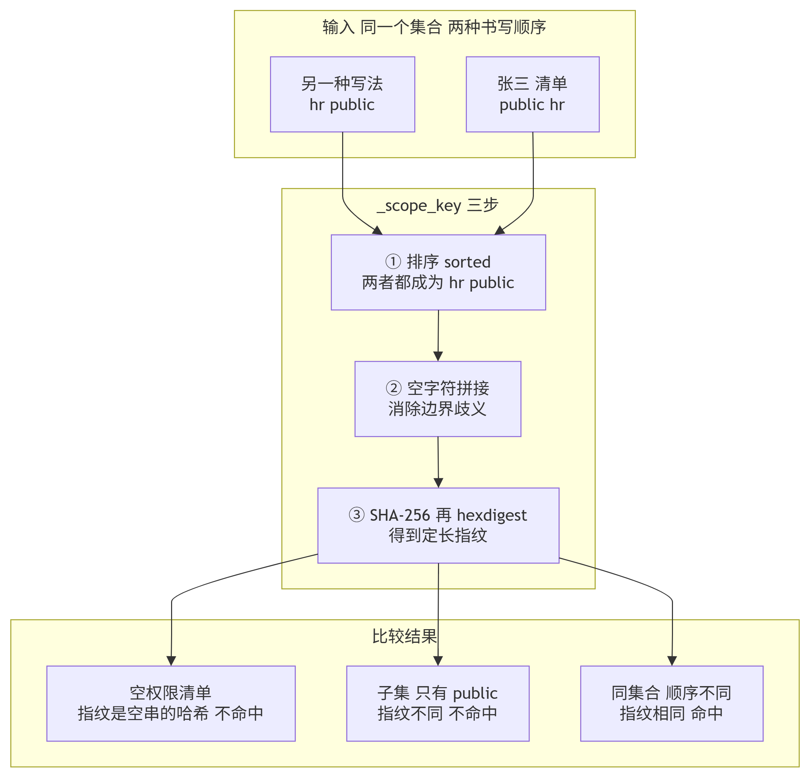
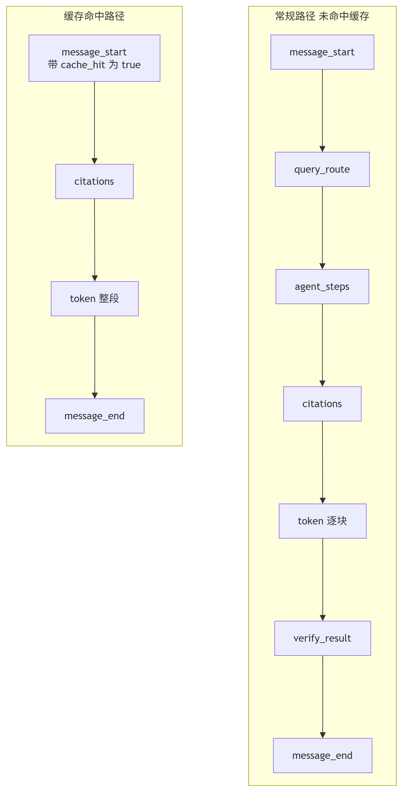
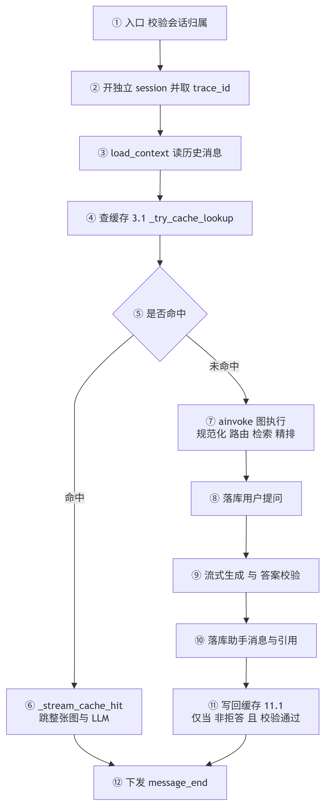
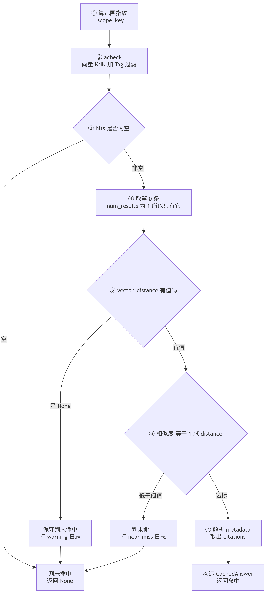
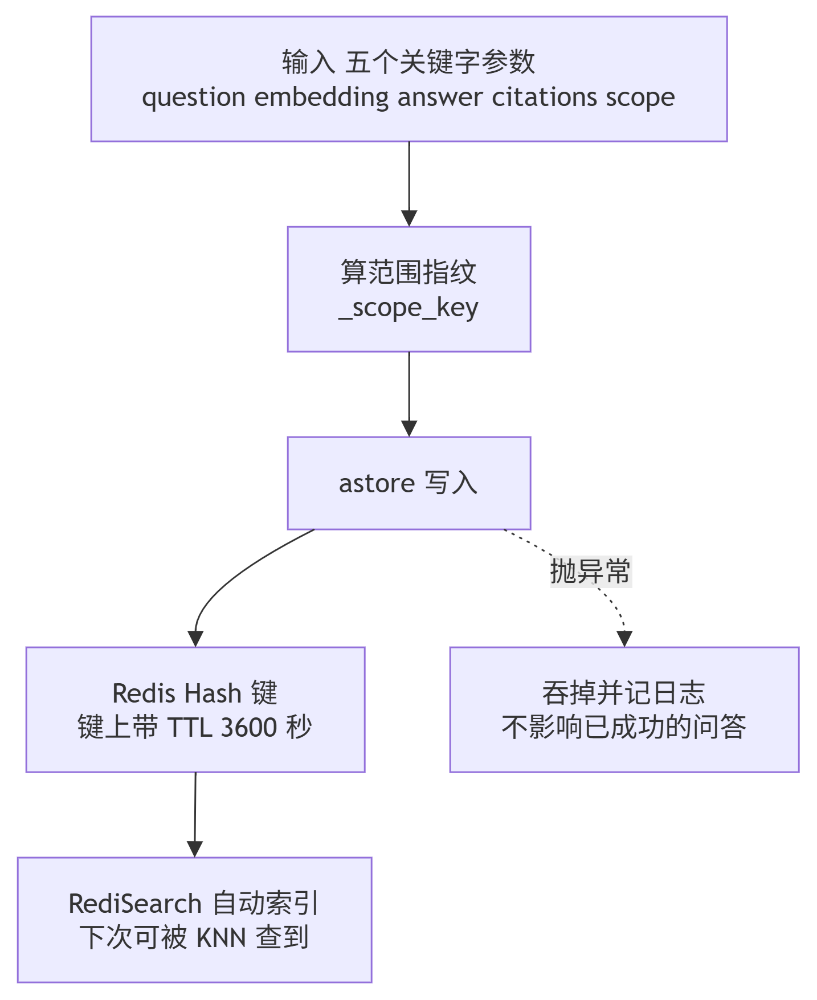
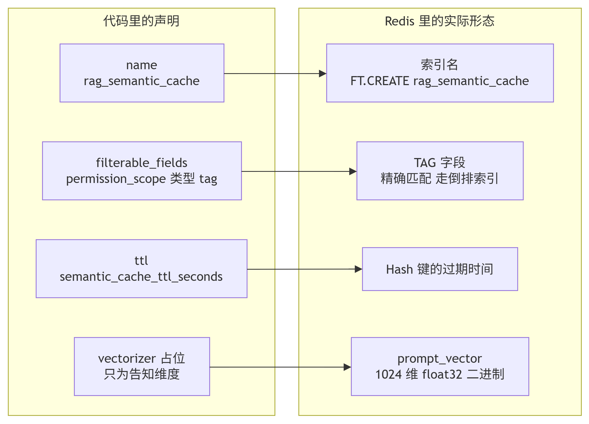
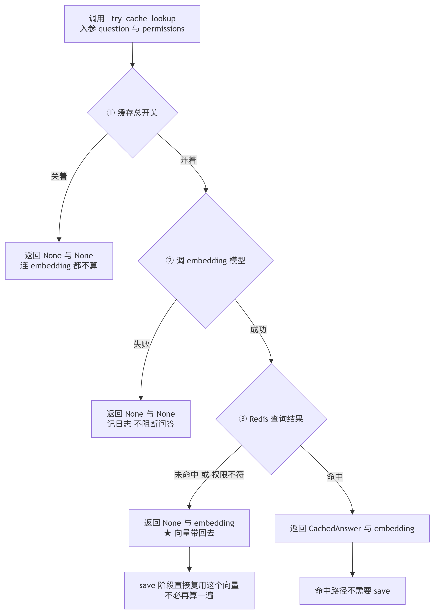
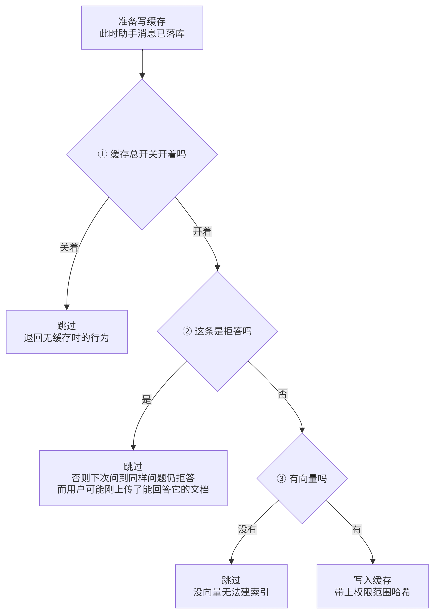
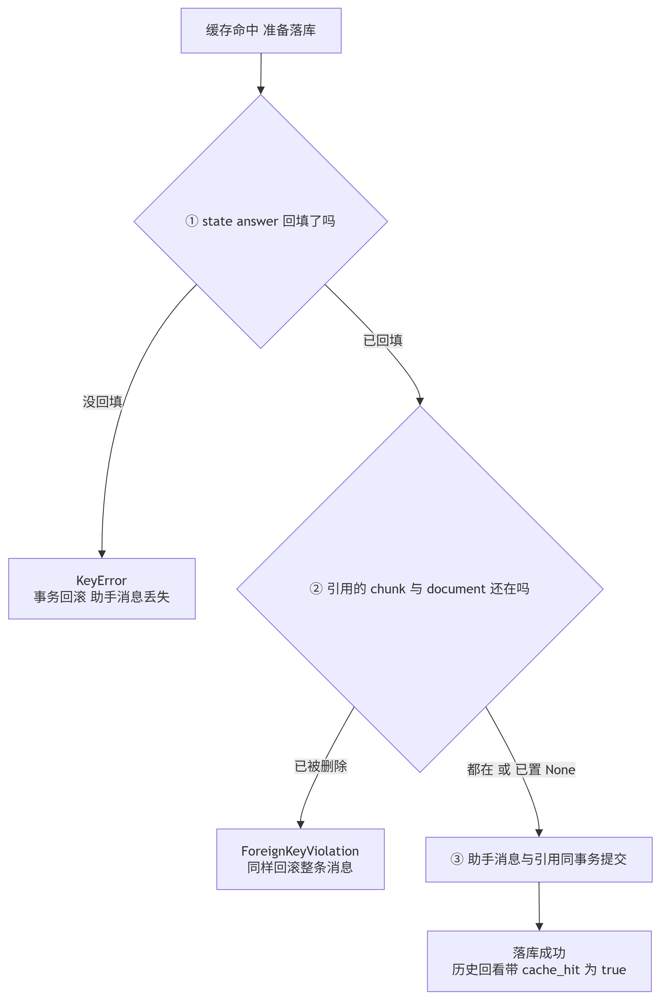

# 03_语义缓存

> 期：**Day12 · 缓存、限流、异步任务与增量索引**
> 章：**第 3 章「语义缓存」**（大纲 2.1 SemanticCacheService / 2.2 ChatService 接入 / 2.3 SSE 透传 / 2.4 前端展示）
> 记录日期：2026.09.27
> 说明：本篇按"我没细看代码"来写 —— 每处设计都配了"它解决什么问题、少了它会怎样"。
> ⚠️ 本章实测撞到**三处坑**，都有独立的 BUG 归档，正文里会指向它们。

---

## 一、本章在整条链路里的位置

> **第 2 章搭好了 Redis 地基，本章在上面盖第一件东西：让"问过的问题"不用再问第二遍。**

```
第 2 章 引入 Redis 与依赖            ← 已归档（连接、配置、客户端单例）
└── 第 3 章 语义缓存                  ← 你在这里
      ├── 2.1 SemanticCacheService       ★ 新增：缓存读写门面（含权限隔离）
      ├── 2.2 ChatService 接入缓存        ★ 进图前查、落库后写
      ├── 2.3 SSE / Schema 透传 cache_hit 后端暴露标记
      └── 2.4 前端展示「缓存命中」Tag      ✅ 前端早已就位，本次只校验
```

### 1.1 本章省掉的是什么

```
没有缓存：用户问「差旅费怎么报销」
    → 向量化（调用 embedding 模型）
    → 检索（向量 + 关键词两路）
    → 精排 rerank
    → LLM 生成
    全程约 5～15 秒，且每一步都在花钱

有缓存：同一个人换个说法再问
    → 向量化（还是要算，因为要用它去比对）
    → 一次 Redis KNN 查询
    → 命中，直接回放
    约 100 毫秒，0 次 LLM 调用
```

> ⭐ **一句话**：缓存省掉的不是"检索"，而是**最贵的那一步（LLM 生成）**。
> 向量化那一次是省不掉的 —— 不向量化就没法判断"语义像不像"。

---

## 二、最关键的设计：为什么缓存也要按权限隔离



这是本章与第 11 期权限体系的**交叉点**，也是整章最需要理解的一处。

### 2.1 一个具体的越权场景

```
张三的角色标签 = ["public", "hr"]
    问：「薪酬保密制度对谁可见？」 → 答案里含 hr 专属内容 → 写入缓存

李四的角色标签 = ["public"]
    问同一个问题 → 若命中张三的缓存 → 直接拿到含 hr 内容的答案
        ↓
    🔴 越权。而且第 11 期辛苦做的检索权限过滤，被"缓存"这条路完全绕开
```

### 2.2 为什么不能直接用标签数组做 Tag 匹配

```
RedisSearch 的 Tag 字段过滤语义是「**只要有交集就算命中**」
而本场景需要的是「**集合完全一致才算命中**」

    张三 ["public","hr"]  与  李四 ["public"]   有交集（public）
        ↓ 若用交集匹配
    李四命中张三的缓存 → 越权
```

### 2.3 本项目的做法：排序后拼接、算 SHA-256

```python
def _scope_key(permission_scope: list[str]) -> str:
    canonical = "\x00".join(sorted(permission_scope))   # 排序是关键词
    return hashlib.sha256(canonical.encode("utf-8")).hexdigest()
```

哈希值作为**唯一的 Tag 值**存进 Redis，查询时用同样方式算出当前用户的哈希去匹配：

| 对比 | 排序后 | 哈希 | 结果 |
| --- | --- | --- | --- |
| `["a","b"]` vs `["b","a"]` | 都是 `"a\x00b"` | 相同 | ✅ **命中** |
| `["a"]` vs `["a","b"]` | 不同 | 不同 | ❌ 不命中（子集） |
| `["a"]` vs `["b"]` | 不同 | 不同 | ❌ 不命中 |
| `["*"]` vs `["hr"]` | 不同 | 不同 | ❌ 不命中 |

**实测 7 组用例全部符合预期。**

### 2.4 这个取舍的代价与判断

```
代价：权限是子集时【也不命中】→ 缓存命中率变低

判断：不命中 → 走一遍完整链路，多花一次 LLM，用户无感
      误命中 → 用户看到自己无权查看的内容

      两者后果完全不对等 → 选保守
```

> ⭐ **一句话记法**：**宁可少命中，不可错命中。**

---

## 三、缓存命中的四条硬要求（最容易做错的地方）



教程与第 1 章都强调过：**命中缓存不能"直接把答案 return 出去"**，否则会丢四样东西。

| # | 必须保留 | 丢了会怎样 |
| --- | --- | --- |
| ① | **user 消息落库** | 会话历史里"用户问了什么"缺失，对话记录不完整 |
| ② | **citations 事件下发** | 前端引用来源列表空白 |
| ③ | **assistant 消息落库** | 刷新页面后这条回答凭空消失 |
| ④ | **`cache_hit=true` 标记** | 前端无法显示「缓存命中」标签，也失去统计依据 |

### 3.1 命中路径的事件序列（与常规路径对照）

```
常规路径：message_start → query_route → agent_steps → citations → token… → [verify_result] → message_end
命中路径：message_start → citations → token → message_end
                              ↑ 少了三个事件，而且是有意的
```

**为什么刻意少发三个事件**：

| 少发的事件 | 理由 |
| --- | --- |
| `query_route` / `agent_steps` | 命中缓存**压根没走路由与检索**，发出去就是伪造轨迹 |
| `verify_result` | 命中的答案在写入缓存前**已经校验通过**（见 §4.1），再校验一次毫无意义且白花钱 |

前端对这几个事件的缺失已有处理（面板不渲染），所以少发不破坏契约。

### 3.2 答案为什么要一次性下发，而不是逐字模拟流式

```
缓存命中的全部价值就是"快"
逐 token 人为加延时 → 只是让打字动画好看，却把这唯一的优势抵消掉
```

前端拿到整段 `delta` 会直接渲染，不需要为缓存路径做特殊处理。

---

## 四、代码结构

### 4.1 写缓存的前提条件（三条，缺一不可）

```python
if (
    settings.semantic_cache_enabled          # ① 总开关开着
    and not state.get("refused")             # ② 不是拒答
    and query_embedding is not None          # ③ 有可用的向量
):
    await get_semantic_cache().save(...)
```

**② 为什么必须"非拒答"**：

```
拒答 = 知识库里没有依据
    → 把它缓存下来，下次问到同样问题只会继续拒答
    → 而用户可能刚刚上传了能回答这个问题的文档
```

**同时它还覆盖了第三种情况**：答案校验失败（`verified=False`）会把 `refused` 置 True ——
那种答案是本系统自己都不信的（"缺乏引用支撑"），更不能缓存。

> 📌 **这一条在实测中被真实触发过**：我第一次测试时故意在问题里塞了一个与知识库不符的条件，
> 答案校验判为不通过 → 拒答 → **缓存确实没写**。
> 也就是说：**这条护栏是被验证过在工作，而不是纸面设计。**

### 4.2 `query_embedding` 为什么要跨阶段传递

```
查缓存      需要先算 query 的向量（必须）
写缓存      也需要 query 的向量
        ↓
若两处各算一次 → 同一句话算两遍 embedding（多花钱、多耗时）
        ↓
所以 _try_cache_lookup 返回 (命中结果, 向量)，
    把向量一路带到保存阶段复用
```

**三种"拿不到"的情况统一返回 `(None, None)`**：

| 情况 | 处理 |
| --- | --- |
| 缓存总开关关掉 | 直接短路，**连 embedding 都不算**（省一次模型调用） |
| embedding 失败 | 记日志、返回 None —— 缓存是旁路能力，不能因此阻断问答 |
| 未命中 | 正常情况 |

主链路对这三者**一视同仁**：没缓存就用常规查询去查。这正是本设计的兜底语义。

### 4.3 `_stub_embed` 为什么存在

```
RedisVL 建索引时必须知道【向量维度】（要写进 FT.CREATE 的 schema）
        ↓
维度可以从一个"示例向量"推断 → 于是给一个全零的占位向量
        ↓
但它【主链路永远不会被调用】：
    查缓存时传 vector=query_embedding（自己算好的真实向量）
    写缓存时同样传 vector=
RedisVL 只在"没给 vector 时"才去调 vectorizer
```

**它只是为了让索引能建起来。**

### 4.4 `distance_threshold` 为什么设成 2.0（等于不过滤）

```
这个参数是【余弦距离】阈值：0 = 完全相同，2 = 完全相反，越小越相似
理论上可以写 1 - min_similarity 让库直接过滤
        ↓
但本项目刻意不这么做，原因是【可观测性与可调参性】：
    库直接过滤掉的话，我们看不到"差一点就命中"的请求
    调阈值时只能盲猜（命中率低或太宽松，都不知道差多少）
        ↓
放应用层判定，就能把最相似那条的相似度打进日志
```

**所以：库只负责 Tag 过滤（权限）与 KNN 排序，相似度判定统一在应用层。**

---

### 4.5 本期新增代码的流程图














## 五、⚠️ 三个必须知道的坑（实测踩过，已修）



> 完整记录见 `BUG发现与处理/02_2026.9.26/04_语义缓存实现中的三处坑.md`

| # | 坑 | 症状为什么隐蔽 |
| --- | --- | --- |
| **一** | 命中路径漏写 `state["answer"]` | 前端**正常收到答案与引用**，但刷新后这条消息消失。因为 `yield` 在落库之前，异常又被流式兜住 |
| **二** | `return_fields` 漏了 `vector_distance` | 相似度判定被整段跳过 → 阈值静默失效 → 表现为"缓存命中率特别高"，看着像好事 |
| **三** | 缓存引用指向已删除的 chunk | 外键失败 → 回滚整条助手消息。`ON DELETE SET NULL` 只保护删除，不保护"插入一个早已被删的 id" |

### 坑一的教训（"先发结果、后落库"的顺序）

```
这个顺序下，任何"落库要用到的中间状态"都必须在发结果之前就位。

因为发出去之后，后续失败只能走"降级提示" ——
而用户已经看到答案了，再告诉他"这条没存上"体验很糟，
所以设计上就会倾向于静默兜住，而静默兜住 = 问题被藏起来。
```

### 坑二的教训（`if x is not None` 的陷阱）

```
给可选参数写分段判定时，必须想清楚【x 为 None 时走哪条路】：

    跳过判定  → 等于该参数不存在（危险）
    保守拒绝  → 等于"条件不满足"（安全）

凡这个参数关系到【安全或质量】，一律走"保守拒绝"。
```

---

## 六、相似度阈值必须实测定标（教程的 0.92 命中不了）

这一节不是 bug，但**不改就发现不了缓存有任何作用**。

### 6.1 实测数据（text-embedding-v3，中文问答，9 组样本）

| 关系 | 相似度区间 | 0.92 | 0.75 |
| --- | --- | --- | --- |
| 相近（换说法） | 0.7589 ~ 0.8819 | ❌ **全不命中** | ✅ 命中 |
| 相关但**不同问点** | 0.8381 | ❌ 不命中 | ✅ 命中（可接受） |
| 无关 | 0.4154 ~ 0.5161 | ✅ 挡住 | ✅ 挡住 |

**可行区间是 (0.5161, 0.7589]，取 0.75。**

### 6.2 具体样本（便于以后重新定标时对照）

```
差旅费怎么报销？     vs 出差费用如何申请报销呢    0.8809   相近
差旅费怎么报销？     vs 报销的流程是什么         0.7589   相近（更短）
差旅费怎么报销？     vs 差旅报销需要哪些材料      0.8381   相关但不同问点
员工请假流程是什么？  vs 我想请假，需要什么手续    0.8819   相近（教程原例）
员工请假流程是什么？  vs 请假怎么办              0.8769   相近（教程原例）
差旅费怎么报销？     vs 年假有多少天？           0.5161   无关
差旅费怎么报销？     vs 今天天气怎么样           0.4154   完全无关
```

### 6.3 定标方法（以后换模型照做）

```
① 准备 6~10 组样本：几组"换说法"、几组"相关但不同问点"、几组"完全无关"
② 算两两余弦相似度
③ 找"相近的最低分"与"无关的最高分"之间的区间
④ 取区间内的值（偏严一侧更安全）
```

> ⚠️ **换 embedding 模型后必须重新定标** —— 这个数只对当前模型有意义。

---

## 七、验证结果

| 层次 | 项数 | 结果 |
| --- | --- | --- |
| `_scope_key` 隔离性自检 | 7 | ✅ 全部符合预期 |
| RedisVL 端到端（服务层） | 20 | ✅ 全通过 |
| 走完整 ChatService 的端到端 | 13 | ✅ 全通过 |

**最关键的几条**：

```
★ 索引字段含 permission_scope(TAG)        权限隔离的物理基础
★ 无权限 / 其它角色 / admin（*）/ 多一个标签 → 全都不命中
★ 命中时 assistant 消息正常落库，历史 cache_hit = [False, True]
★ 命中的答案与首次完全一致，5 条引用一并下发
★ 缓存条目 TTL=3600，不是永不过期
★ alice 问同一问题不命中 admin 的缓存（未越权）
★ 命中路径无 error 事件
```

---

## 八、前端校验结论（按要求只校验、未改动）

前端**早就把这一章的契约与 UI 预支完了**，后端这次只是把字段真正供上：

| 文件 | 行 | 内容 | 结论 |
| --- | --- | --- | --- |
| `api/chatStream.ts` | 21 / 125 | `cacheHit: boolean` 字段 + 解析 `data.cache_hit` | ✅ 已就位 |
| `pages/ChatPage.tsx` | 58 / 76 / 229 / 509 | `UiMessage.cacheHit` + 历史映射 + SSE 赋值 + 「缓存命中」标签 | ✅ 已就位 |
| `client/types.gen.ts` | 1028 | `cache_hit?: boolean` | ✅ 已就位 |

> 📌 这是继 `permission_tags`（第 11 期）之后**第二次**出现"前端预支、后端欠账"的模式 ——
> 本项目的 `types.gen.ts` 是手工维护、提前于后端写的，所以后端只需"兑现契约"。

---

## 九、⚠️ 与教程的偏离清单

> **结论先说：核心结构与流程完全按教程，但有 5 处偏离，其中 3 处是实测发现的坑、1 处是配置值、1 处是分层取舍。**
> 逐行对照教程写成下表，便于日后分辨"哪些是有意为之、哪些是遗漏"。

### 8.1 三处「教程写法在本项目会坏」（实测确认，建议保留偏离）

| # | 教程怎么写 | 本项目怎么写 | 不改会怎样 |
| --- | --- | --- | --- |
| **D1** | `acheck(..., return_fields=["prompt","response","metadata"])` | 补上 **`"vector_distance"`** | RedisVL 只返回点名过的字段。漏掉它 → 相似度拿到 `None` → 判定被整段跳过 → **任何召回结果都算命中，阈值静默失效**（实测：无关问题"年假有多少天"命中了"差旅费怎么报销"的缓存） |
| **D2** | 命中后直接构造 `CachedAnswer` 返回 | 先判 `distance is None` → **保守判未命中** + warning 日志 | 只修 D1 不够：将来有人手滑删了那个字段，会再次静默失效。保守判定把"静默错命中"变成"响亮地不命中" |
| **D3** | 缓存引用"原样搬运"入库 | 落库前**批量校验 chunk/document 是否还在**，不在的置 None | 缓存最长存活 1 小时，期间文档可能被删。外键虽是 `ON DELETE SET NULL`，但**插入时仍校验 id 存在** → ForeignKeyViolation → **回滚整条助手消息**（用户看到答案，刷新就没了） |

> 📌 D1～D3 的完整过程见 `BUG发现与处理/02_2026.9.26/04_语义缓存实现中的三处坑.md`。

### 8.2 一处「配置值必须改」（实测标定，非偏好）

| # | 教程 | 本项目 | 为什么 |
| --- | --- | --- | --- |
| **D4** | `.env` 里 `SEMANTIC_CACHE_MIN_SIMILARITY=0.92` | **`0.75`** | 0.92 是拍出来的值。实测 text-embedding-v3 中文问答：相近（换说法）只有 0.7589~0.8819，**全部低于 0.92 → 缓存永远不命中**（等于白做）。可行区间 (0.5161, 0.7589]，取 0.75。详见 §六 |

> ⚠️ **换 embedding 模型后必须重新定标**，这个数只对当前模型有意义。

### 8.3 一处「分层取舍」（两种做法都自洽，本项目选了后者）

| # | 教程 | 本项目 | 说明 |
| --- | --- | --- | --- |
| **D5** | `distance_threshold = 1 - min_similarity`（**让库做过滤**）<br>应用层拿到结果直接用 | `distance_threshold = 2.0`（**不过滤**）<br>**相似度判定放在应用层** | 两种做法【功能等价】（都是"相似度 ≥ 阈值才算命中"），差别只在**判定放在哪一层**与**日志能看到什么** |

**为什么本项目选应用层判定**：

```
判定放在库层：
    库直接把不合格的过滤掉 → acheck 返回空 → 我们【看不到"差一点就命中"的相似度】
    → 调阈值只能盲猜（命中率低或太宽松，都不知道差多少）

判定放在应用层：
    库只负责 Tag 过滤（权限）与 KNN 排序，把最相似那条连同距离一起返回
    → 可以打出 near-miss 日志，调参有依据
```

> 📌 **已核实教程的做法确实生效**：RedisVL 的 `SemanticCache.__init__` 会
> `self.set_threshold(distance_threshold)` 存下来，`acheck` 在未显式传参时
> 回退到它，并交给 `VectorRangeQuery(distance_threshold=...)` 做范围过滤。
> **所以这不是"教程写错了"，而是两种自洽的分工方式。**

**✅ 最终选择：保留应用层判定（本项目采用）。推荐依据如下：**

```
查 RedisVL 源码确认了两个事实：
    L64:  distance_threshold: float = 0.1        ← 默认值
    L221 / L645: 库里只有 vectorizer 变更与阈值变更的 warning
                  【没有任何"未命中时记下距离"的日志】
        ↓
结论：教程方案下，缓存未命中时【看不到相似度是多少】，
      只有"命中 / 不命中"的二元结果。
      阈值调不对时（要么全不命中、要么乱命中），不知道差了多少。
        ↓
而应用层判定能打出：
    semantic cache near-miss: similarity=0.8809 < threshold=0.92 cached_question='差旅费怎么报销？'
```

**为什么在学习阶段这条日志特别值**：
本项目正在建立"什么算语义相近"的直觉。没有日志，只知道"没命中"；
有了它，能看到"年假问题 0.5161 / 换说法 0.8809"，阈值该怎么调一目了然。

**代价（明确记录）**：多传一个 float 字段（可忽略）+ 比教程多十几行判定代码。
**功能上两者完全等价** —— 不存在"哪种更正确"。

> ⚠️ **不要两处都判定（"双保险"是陷阱）**：
> ```
> 阈值改一次 → 要改两个地方 → 早晚改漏一处 → 两个阈值不一致
>     → 表现为"偶尔命中偶尔不命中"，极难排查
> ```
> 这正是本项目在别处反复强调的"判定来源只能有一个"。**二选一，选定后只留一处。**
>
> **想贴回教程时**，改一行即可：
> `distance_threshold=1.0 - settings.semantic_cache_min_similarity`，
> 并删掉 `lookup` 里那段应用层判定。
>
> **影响范围已确认**：差异只在 `semantic_cache_service.py` 的 `__init__` 与 `lookup` 内，
> **不涉及分层、数据模型、接口契约、事件协议** ——
> 后续第 4/5/6 章（限流 / Celery / 增量索引）都不会依赖这一处，学习不受影响。

### 8.4 完全照教程的部分（核对通过）

| 环节 | 教程 | 本项目 |
| --- | --- | --- |
| `_scope_key` | 排序 → `"\x00".join` → SHA-256 | ✅ 逐行一致（含注释里的越权例子） |
| `_stub_embed` | `(text, **_) -> [0.0] * embedding_dim` | ✅ 一致 |
| `CachedAnswer` | `frozen=True`，三字段 | ✅ 一致 |
| `SemanticCache` 构造 | `name` / `redis_url` / `ttl` / `vectorizer` / `filterable_fields` / `overwrite=False` | ✅ 一致（仅 `distance_threshold` 见 D5） |
| `lookup` 签名与流程 | `query_embedding, permission_scope` → `acheck` + Tag 过滤 | ✅ 一致 |
| `save` 签名与流程 | 关键字参数 + `metadata={"citations":...}` + `filters={_SCOPE_FIELD:...}` | ✅ 一致（另加存在性校验，见 D3） |
| `get_semantic_cache` | `lru_cache(maxsize=1)` | ✅ 一致 |
| `_try_cache_lookup` | 三种情况返回 `(None, None)`，向量跨阶段复用 | ✅ 一致 |
| `_safe_uuid` | 解析失败返回 None | ✅ 一致 |
| `_stream_cache_hit` | 四个事件 + 落库，刻意不发 query_route/agent_steps/verify_result | ✅ 一致（另加 `state["answer"]` 回写，见 §五 坑一） |
| `_persist_cached_assistant_message` | `metadata` 写 `cache_hit=True` | ✅ 一致 |
| `_persist_assistant_message` 补 `cache_hit=False` | 让该键在所有 assistant 消息上一致 | ✅ 一致 |
| `_parse_cache_hit` | 默认 False + 完整防御 | ✅ 一致 |
| 前端三个文件 | chatStream / ChatPage / types.gen | ✅ **早已就位，本次零改动** |

---

## 十、本章地图

```
第 3 章「语义缓存」
├── 省掉的是什么
│   └── ★ 省的是最贵的 LLM 生成；向量化省不掉（不向量化就没法比"像不像"）
│
├── 最关键设计：缓存也要按权限隔离
│   ├── 越权场景：张三(public+hr)的答案被李四(public)命中
│   ├── Tag 交集语义 ≠ 集合相等语义（前者会越权）
│   ├── 做法：排序后拼接 → SHA-256 → 作为唯一 Tag 值
│   └── ⭐ 代价是命中率低，但"宁可少命中，不可错命中"
│
├── 命中路径的四条硬要求（少一条都会出错）
│   ├── user 消息落库 / citations 事件 / assistant 落库 / cache_hit 标记
│   └── 刻意少发三个事件：query_route、agent_steps、verify_result
│
├── 写缓存的三条前提
│   └── 总开关开 + 非拒答 + 有向量（拒答与校验失败的答案都不可缓存）
│
├── ⚠️ 三处坑（实测）
│   ├── 一：漏写 state["answer"] → 前端看得到、刷新就没了
│   ├── 二：return_fields 漏 vector_distance → 阈值静默失效
│   └── 三：缓存引用指向已删 chunk → 外键失败回滚整条消息
│
└── 阈值必须实测定标
    └── 教程 0.92 全不命中；实测可行区间 (0.5161, 0.7589]，取 0.75

验证 `_scope_key` 7/7 · 服务层 20/20 · 端到端 13/13
前端 chatStream / ChatPage / types.gen 三个文件均已就位，无需改动
```

---

## 十一、自查 5 题

1. 缓存为什么省不掉"向量化"这一步？它真正省掉的是哪一步？
2. 为什么权限范围不能直接用 Tag 的"交集匹配"？举个会越权的例子。
3. 把权限清单**排序**之后再算哈希，是为了解决什么问题？如果不排序会发生什么？
4. 命中缓存时，为什么 `query_route` 和 `agent_steps` 这两个事件**不发**反而是对的？
5. 教程给的相似度阈值 0.92，在本项目实测下会发生什么？为什么这个值需要实测而不是照抄？

---

## 十二、本章实际新增或修改文件

```
后端
├── backend/app/services/semantic_cache_service.py     【新增】 语义缓存服务（缓存读写门面）
├── backend/app/services/chat_service.py               【修改】 1313 行 · 接入缓存 + 四个新内部方法
├── backend/app/api/schemas/chat.py                    【修改】 暴露 cache_hit 字段
├── backend/app/db/repositories/citation_repo.py       【修改】 +2 个存在性查询方法
└── backend/app/core/config.py                         【修改】 阈值默认值 0.92 → 0.75

根目录
└── .env.example                                       【修改】 阈值 0.75 并附实测依据

归档
├── 项目阶段性总结/BUG发现与处理/02_2026.9.26/
│   └── 04_语义缓存实现中的三处坑.md                     【新增】
└── 项目阶段性总结/Day12_缓存、限流、异步任务与增量索引/02_2026.9.27/
    └── 02_backend_app_services_semantic_cache_service++backend_app_services_chat_service/
        ├── 03_语义缓存.md                              【本文件】
        └── 上传日志.md
```

> 🔗 **交叉引用**：
> - 第 1 章 §3.3.1（缓存 schema 必须带 `permission_tags`）→ **本章落地并用 7 组用例验证了它有效**
> - 第 1 章 §3.3.2（缓存失效只靠 TTL）→ **§五 坑三正是这个取舍的代价**；
>   本次用"落库前校验存在性"缓解了症状，但没有根治
>   （真正的根治要在"改文档权限"时主动失效缓存，属于已知未做项）
> - 第 1 章 §3.3（命中不能跳过四条行为）→ **本章 §三 落地**
> - 第 2 章（Redis 地基）→ 本章消费 `REDIS_URL`(db0) 与三个缓存配置
> - **下一步**：第 4 章「滑动窗口限流」—— 落点 `RateLimiter` + 挂到 `deps`，
>   用的是第 2 章备好的 `RATE_LIMIT_*` 两个配置与 `RateLimitError`(429)
