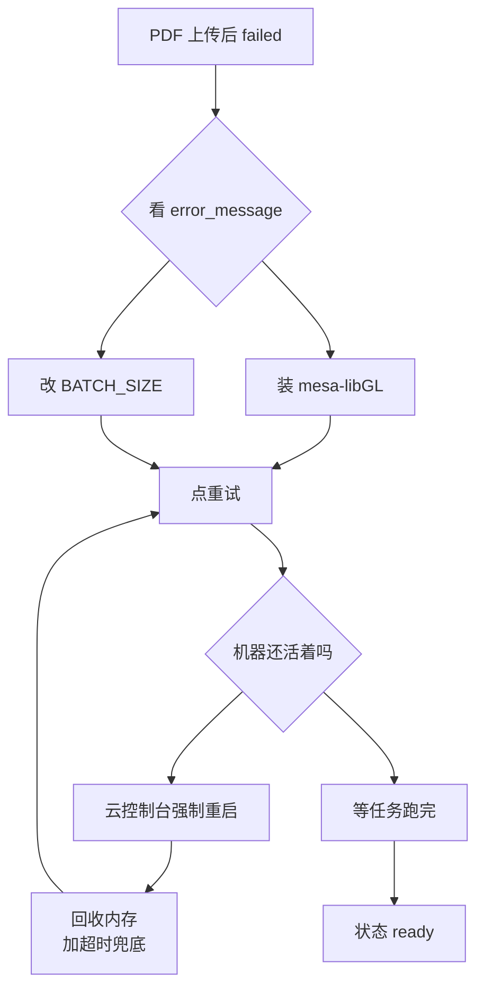

# 上线后排障记录：PDF 解析链路（从整机冻死到打通）

- **日期**：2026-09-29
- **环境**：腾讯云轻量应用服务器 / OpenCloudOS 9.6 / 2 vCPU / 3.6 GB 内存 / 1 GB swap（`/www/swap`）
- **服务形态**：宿主机 systemd 跑 uvicorn + Celery，Docker 只跑 PostgreSQL(pgvector+zhparser) 与 Redis Stack，Nginx 反代
- **⚠️ 时间口径**：数据库 `created_at` 存的是 **UTC**，文中时间已换算为 **北京时间（UTC+8）**

---

## 一、一句话结论

> PDF 上传后状态 `failed`，排查过程中一次解析把整机拖到 **SSH 都无法登录**，只能从云控制台强制重启。
> 最终定位到 **3 类问题**：系统依赖缺失、资源预算超支、缺少兜底与自愈。
> 修复后两份 PDF 分别在 **19 秒 / 5 秒** 内解析完成并进入 `ready`。

```
修 before                         修 after
─────────────────────────         ─────────────────────────
PDF 状态   failed                   ready（4 切片 / 5 切片）
整机状态   冻死、需强制重启         平稳，available 余量 2.6 GB
解析兜底   无（可永久占住 worker）  300 秒硬超时
API 内存   844 MB                  283 MB
```

---

## 二、现象与关键数据

| 指标 | 冻机那次（09:14） | 修复后（09:44） |
| --- | --- | --- |
| uvicorn 常驻 | 844 MB | **283 MB** |
| mysqld / php-fpm | 195 MB / active | 0（已停用并 disable） |
| celery 主进程 | 505 MB | ~250 MB |
| celery 解析子进程 | 805 MB | 1347 MB（含模型权重，属正常） |
| available 起点 | **632 MB** | **2622 MB** |
| Docling OCR / 表格识别 | 开（+260 MB） | 关 |
| 解析超时兜底 | **无** | 300 秒 |
| 结果 | ❌ 整机冻死 → 强制重启 | ✅ 19 秒 / 5 秒 → ready |

---

## 三、排障时间线（真实顺序）

| 时间 | 动作 | 观察 | 结论 |
| --- | --- | --- | --- |
| 08:58 | 上传两份 PDF | 状态 `failed` | 报错：`libGL.so.1: cannot open shared object file` |
| 09:00 | 查 `documents.error_message` | 同上 | 不是模型问题（`models/` 里 538 MB 权重齐全） |
| 09:02 | `dnf install mesa-libGL ...` | 装成功 | 缺系统图形库 |
| 09:03 | `python -c "import cv2"` | `cv2 OK 5.0.0` | 依赖链已修好 |
| 09:04 | 重启 celery 后点「重试」 | 任务转 `running` | 解析真的开始了 |
| 09:04~09:19 | 无干预 | CPU 打满 → SSH 断开 → 面板卡死 | **解析把整机拖死** |
| 09:19:37 | 云控制台强制关机 + 开机 | 启动日志正常 | 系统恢复 |
| 09:21 | 停 celery、加 systemd 资源限制 | Nice=10 / CPUWeight=20 / 并发降为 1 | 先按住它 |
| 09:24 | **本机实测** Docling 解析开销 | 见第五节 | 拿到资源基线 |
| 09:28 | 拉补丁 `0c444b6`、写入 `DOCLING_*` 三项 | — | 代码侧兜底就位 |
| 09:36 | 停 mysqld/php-fpm、拉 `81c76af`、重启 API | available 2186 MB | 内存翻倍 |
| 09:36 | 手工清理僵尸任务 | `parsing`/`running` → `failed` | 「重试」按钮恢复可用 |
| 09:44 | 点「重试」 | 19.4 秒后 `success` 4/4 | ✅ 第一份 PDF 通了 |
| 09:46 | 点另一份 PDF 的「重试」 | 5.1 秒后 `success` 5/5 | ✅ 模型已热，快 4 倍 |

---

## 四、六个坑（按发现顺序）

### 坑 1：`libGL.so.1` 缺失 —— 只有 PDF 失败，md/docx 全正常

**报错原文**（`documents.error_message`）：

```
Docling 解析失败: libGL.so.1: cannot open shared object file: No such file or directory
```

**为什么只有 PDF 中招**（这是整个排查的突破口）：

| 上传格式 | Docling 走的后端 | 是否加载神经网络 |
| --- | --- | --- |
| `.md` / `.docx` | SimplePipeline（纯文本 / XML 解析） | **不加载** |
| `.pdf` | StandardPdfPipeline（版面分析 + 表格识别 + OCR） | **加载** |

**根因链**：

```
docling → opencv-python（非 headless 版）
        → cv2 扩展在 import 时链接 libGL.so.1 / libSM / libXext / libXrender / libgthread
        → OpenCloudOS 最小化安装没有桌面图形库
        → import cv2 直接抛 ImportError
```

**修复**：

```bash
dnf install -y mesa-libGL glib2 libSM libICE libXext libXrender
# 验证（直接复现失败的那个 import）
python -c "import cv2; print('cv2 OK', cv2.__version__)"
```

**教训**：
- 「同样是上传解析，为什么 md 行、pdf 不行」——**先查两者的代码路径是否相同**，比逐个参数试错快得多；
- 最小化安装的 Linux 上跑 OpenCV 系依赖，必须补图形库；或在 `pyproject.toml` 里改用 `opencv-python-headless`（本项目跟随 docling 的依赖，选择装系统库）。

---

### 坑 2：一个解析任务拖死整机（资源预算超支）

**现场数据（冻结前 `ps` 快照）**：

```
PID   RSS       COMMAND
2911  864632    uvicorn      ← 844 MB
2126  199644    mysqld       ← 195 MB（宝塔自带，本项目完全不用）
…     …         celery ×2    ← 505 MB（主进程）+ 805 MB（子进程）
```

`free -h` 当时是 `used 3.0Gi / available 632Mi`。

**为什么会「冻死」而不是干脆 OOM**：内存耗尽后内核转入 swap 抖动（1 GB swap 反复换页），磁盘 I/O 成为瓶颈，`sshd` 连 fork 一个新会话都排不上队 —— 表现就是「SSH 登录一直转圈」，而不是服务报错。

**实测解析开销**（本机 2 页纯文字 PDF，同一台机器）：

| 配置 | 耗时 | 峰值内存 |
| --- | --- | --- |
| 默认（OCR + 表格识别开） | 31.1 s | **1087.5 MB** |
| 精简（两项关） | 24.1 s | **828.4 MB** |
| 仅验证超时拦截 | 17.1 s 中断 | 498.9 MB |

注意：**这只是「文字型 PDF」的差距**（关掉只省 24%，不是想当然的 1/3），因为纯文字 PDF 本来就直接抽文字层；扫描件/图片型 PDF 要逐页跑 OCR，差距会大得多。

**教训**：2 核 3.6G 上，解析峰值约 1 GB + worker 常驻 0.8 GB ≈ 1.8 GB，**必须把其他常驻进程压到最低**，否则必然撞天花板。

---

### 坑 3 ★：API 进程白背一整套推理栈（今天最大的一笔优化）

**导入链**（问题的根源）：

```
app.services.document_service          ← FastAPI 路由会 import 它
  └─ from app.ingestion.tasks import ingest_document_task   ← 只为 .delay() 投递
       └─ from app.ingestion.pipeline import run_ingest_sync
            └─ from app.ingestion import parser
                 └─ import docling / torch / transformers      ← 800 MB 级
```

`tasks.py` 顶层导入 pipeline 的理由原本是「它不回头 import 本模块，没有环」—— 这个判断**只回答了「会不会循环导入」，漏掉了「会不会把无关进程一起拖下水」**。

**本机 A/B 实测**（同一进程内）：

```
[A]  只导入 app.main + app.ingestion.tasks     253.4 MB   重型模块：无
[B]  再导入 app.ingestion.pipeline（旧行为）   485.6 MB   docling / torch / transformers
```

**线上效果**：uvicorn **844 MB → 283 MB（−561 MB）**。

**改法**：把 `from app.ingestion.pipeline import ...` 从模块顶层下沉到两个任务函数体内。

**为什么这样是安全的**：FastAPI 只需要「任务对象」来 `.delay()` 投递，不需要任务体；worker 在任务真正执行时才导入，Python 模块缓存保证只加载一次。任务注册不受影响（`ingest_document_task.name == "ingest_document"`）。

**教训**：**模块级 import 是一次全局广播**。判断该不该放在顶层，除了「有没有循环依赖」，还要问一句「谁会顺路被拖累」。

---

### 坑 4：Docling 超时**不抛异常**，而是静默返回残缺结果

官方语义（读 `docling/datamodel/pipeline_options.py` 得到）：

> `document_timeout`：Maximum processing time in seconds before aborting document conversion.
> When exceeded, the pipeline stops processing and returns **partial results with PARTIAL_SUCCESS status**.
> Timeout errors are recorded in `ConversionResult.errors` with `category=TIMEOUT`.

也就是说：**超时不报错，返回半成品**。若不拦截，一篇 200 页的文档会以「残缺内容」被正常入库并标记成功 —— 检索时莫名召回不全，日志里却没有任何失败痕迹，比直接失败更难排查。

**改法**（`backend/app/ingestion/parser.py`）：

```python
result = _get_converter().convert(source)
if result.has_timeout_errors():          # 显式拦截这条"非异常路径"
    raise TimeoutError(f"解析超时（超过 {…} 秒），已中止")
```

**验证**：把超时打桩为 0.001 秒后重跑，得到
`DocumentParseError: Docling 解析失败: 解析超时（超过 0 秒），已中止` ✅

---

### 坑 5：硬重启后的僵尸任务（当前仍是缺口）

强制重启后，数据库里留下了两条永远卡住的记录：

```
documents.status        = parsing      ← 前端永远显示"处理中"，「重试」按钮不可用
ingestion_tasks.status  = running      ← 永远不结束
```

原因：任务执行在 worker 进程内，进程被强杀时来不及回写终态；而 Celery 默认 `task_acks_late=False`（收到即确认），消息也不会重投 —— **这条任务就此消失，但数据库记录留在半路**。

**当前处置**（手工 SQL，本次就是这么处理的）：

```sql
update documents set status='failed', error_message='强制重启导致任务中断'
  where status in ('uploading','parsing','indexing');
update ingestion_tasks set status='failed', error_message='强制重启导致任务中断', finished_at=now()
  where status in ('pending','running');
```

**⚠️ 这是本项目明确记录的待修缺口**：应增加「启动时/定时清理超时任务」的自愈逻辑（列为后续事项）。

---

### 坑 6：`EMBEDDING_BATCH_SIZE=16` 撞上百炼接口上限

**现象**：文档上传成功，但状态 `failed`，报

```
400 ... batch size is invalid, it should not be larger than 10.: input.contents
```

**根因**：`.env.example` 模板里原写 `EMBEDDING_BATCH_SIZE=16`，注释还写着「推荐设为 16 或 32」—— 那是别家接口的经验值；`text-embedding-v3` 在 OpenAI 兼容模式下**单次上限就是 10**（代码默认值 10 是对的，模板抄错了）。

**修复**：模板改为 10 并把厂商限制写进注释；服务器 `.env` 同步改为 10。

---

## 五、加固清单（代码 + 运维）

### 5.1 代码侧（2 个提交）

| 提交 | 内容 |
| --- | --- |
| `0c444b6` | `config.py` 新增 `docling_do_ocr` / `docling_do_table_structure` / `docling_document_timeout_seconds`；`parser.py` 按配置组装 `PdfPipelineOptions`（只覆盖 `InputFormat.PDF`）并拦截超时残缺结果；`.env.example` 补说明与实测数据 |
| `81c76af` | `tasks.py` 把 pipeline 导入下沉到任务函数体内，API 进程不再加载 docling/torch |

**设计取向**：三个 Docling 开关的**默认值与教程完全一致**（全开 + 120 秒），改不改由**部署环境**通过 `.env` 决定 —— 代码不替运维做决定，小内存服务器自己关。

### 5.2 服务器侧（运维）

```bash
# ① 停掉宝塔自带、本项目用不到的常驻进程（面板"数据库 0"即为证据）
systemctl stop mysqld && systemctl disable mysqld
systemctl stop php-fpm-82

# ② Celery 资源限制（/etc/systemd/system/rag-kb-celery.service）
#    并发 2 → 1；Nice=10 / CPUWeight=20 / IOWeight=50；
#    OMP_NUM_THREADS=2 / MKL_NUM_THREADS=1 / TOKENIZERS_PARALLELISM=false
systemctl daemon-reload && systemctl restart rag-kb-celery

# ③ .env 追加三项（服务器专用，本机开发保持默认全开）
DOCLING_DO_OCR=false
DOCLING_DO_TABLE_STRUCTURE=false
DOCLING_DOCUMENT_TIMEOUT_SECONDS=300      # 实测约 3.5 秒/页 + 约 17 秒冷启动
```

> 注：`AcceleratorOptions` 会自动读取 `OMP_NUM_THREADS` 作为 Docling 的 `num_threads`，
> 所以 ② 里那两个环境变量同时也是在限制 Docling 的推理线程数。

---

## 六、验证结果

### 6.1 任务流水（`ingestion_tasks`，时间为 UTC）

```
0e3c5ef0 | failed  | 0/0 | 00:58:08 → 00:58:09     libGL 缺失
f99afd13 | failed  | 0/0 | 00:58:13 → 00:58:14     libGL 缺失
0aa6b505 | failed  | 0/0 | 01:04:38 → 01:36:37     僵尸任务（强制重启 + 手工清理）
a6794cff | success | 4/4 | 01:44:25 → 01:44:44     ✅ 19.4 秒
12ff6148 | success | 5/5 | 01:46:43 → 01:46:48     ✅  5.1 秒（模型已热）
```

第二次只花 5 秒 —— 印证了「worker 常驻 1.3 GB 是值得的」：模型权重留在内存里，后续解析省掉约 17 秒冷启动。

### 6.2 切片健康检查（11 篇文档全绿）

判定口径：`total = distinct_idx = distinct_hash`（即无重复入库、无内容重复）

```
80. 删除有序数组中的重复项 II.md | 13 | 13 | 13
ai大模型开发.pdf                 |  5 |  5 |  5
API接口文档-用户服务.md          | 20 | 20 | 20
IT服务支持手册.md                | 12 | 12 | 12
Java后端社招简历模版.pdf         |  4 |  4 |  4
产品技术规格-A100.md             | 13 | 13 | 13
产品技术规格-B200.md             | 17 | 17 | 17
信息安全规范.md                  |  9 |  9 |  9
员工福利手册.md                  |  8 |  8 |  8
差旅管理制度.md                  |  7 |  7 |  7
考勤与请假制度.md                |  9 |  9 |  9
```

### 6.3 解析质量抽样（`Java后端社招简历模版.pdf`）

Docling 输出的 Markdown 中文完全正确、无乱码、无段落反序，标题层级与表格行结构都保留：

```
## 黄策吾
- 18710668921 2404248797@qq.com https://github.com/float-com 21岁 共青团员
## 教育经历
西安明德理工学院 | 计算机科学与技术 | 全日制本科 | 2023-09 ~ 2027-07
## 专业技能
熟练使用 Python 3.12 与 FastAPI 异步分层架构及全局异常收敛…
```

---

## 七、⚠️ 我判断错的地方（逐条留档）

| # | 我的错误判断 | 事实 | 教训 |
| --- | --- | --- | --- |
| 1 | 断言「Docling 模型没预热」 | `models/` 里 538 MB 权重齐全，早在部署时就预热过 | **先取证再下结论**；`du -sh models` 一条命令就能否掉这个假设 |
| 2 | 预估「关掉 OCR/表格能省 1/3 内存」 | 实测只省 24%（1087.5 → 828.4 MB） | 性能判断必须实测，尤其是「我以为」的时候 |
| 3 | 怀疑 `ai大模型开发.pdf` 是图片型、关 OCR 导致内容丢失 | 那是简历的另一版（求职方向写着「应届毕业生 AI大模型开发」），1716 字符对一份简历完全正常；338 KB 的体积来自**嵌入的中文字体子集** | 看内容再下判断 —— 切片里明明写着"荣誉奖项/蓝桥杯"，我却先去猜格式 |
| 4 | 怀疑切片重复入库（`chunk_index` 出现 0,0,1,1,2） | 是自己的查询没带文档过滤，多篇文档混合排序造成的假象；`total = distinct_idx = distinct_hash` 全绿 | 写诊断 SQL 时**必须带 `where` 限定单篇文档**，否则会自己制造"证据" |

> 第 3、4 条尤其值得记住：**排查过程中自己制造的假象，比原始故障更容易把人带偏**。

---

## 八、遗留问题与后续计划

| 优先级 | 事项 | 说明 |
| --- | --- | --- |
| P1 | **僵尸任务自愈** | 启动时/定时把超时 `running` 任务与 `parsing` 文档收敛为 `failed`，替代手工 SQL（本次已踩两次） |
| P1 | `deploy.sh` 部署前自检 | 把今天的坑变成脚本检查：`libGL` 是否存在、可用内存是否 ≥ 2 GB、`EMBEDDING_BATCH_SIZE > 10` 告警、`DOCLING_DOCUMENT_TIMEOUT_SECONDS` 是否设置 |
| P2 | 扫描件型 PDF 的处理策略 | 当前关闭 OCR，图片型 PDF 会解析为空。方案：本地 Docling 转 Markdown 再上传 `.md`（服务器零成本），或临时开 OCR 单独重跑 |
| P2 | 解析任务的资源上限 | 目前靠 `Nice` + 低并发"软"限流；可补 systemd `MemoryMax` 让内核只杀任务所在 cgroup，而不影响整机 |
| P2 | `uv lock --torch-backend cpu` | 服务器上的 lock 仍锁着 CUDA 版 torch，`uv sync` 会拉 3 GB 无用的 GPU 包 |
| P3 | HTTPS | 宝塔面板 SSL 一键申请；装好后取消 `nginx.conf` 顶部 http→https 跳转段的注释 |

---

## 九、下次遇到同类问题的排查顺序（可复用）



**顺序化口诀**：

1. **先看 `documents.error_message`** —— 90% 的答案在这一列里，别猜；
2. **再看「哪些格式成功、哪些失败」** —— 差异即路径差异；
3. **动手前先算内存预算**：`free -h` + 各进程 `RSS` 求和，和「解析峰值」比一比；
4. **解析期间必须开监控**，并预设中止判据（`available < 200 MB` 或 swap 上涨就停 worker）；
5. **强杀/重启之后一定检查僵尸记录**，否则前端状态永远卡住。

---

*本文档由 Day13 上线后排障过程整理，所有数据均来自服务器实测与数据库查询，未做估算。*
