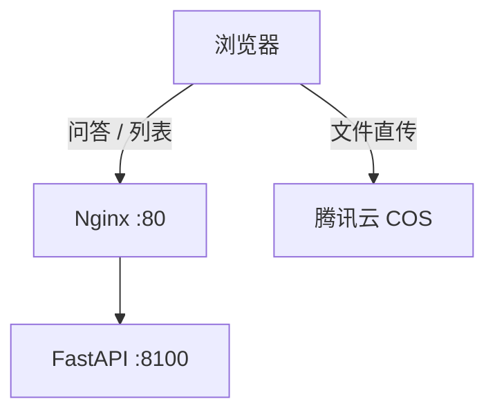

# 首次上线部署问题记录（含跨域专项）

- **日期**：2026-09-28（部署与联调当天）
- **目标形态**：宝塔面板 + **宿主机 systemd 跑后端** + Docker 只跑 PG/Redis + Nginx 反代
- **服务器**：腾讯云轻量应用服务器 / OpenCloudOS 9.6 / 2 vCPU / 3.6 GB / 60 GB / 公网 IP `81.70.119.33`
- **服务地址**：http://81.70.119.33
- **归档位置**：放在 `03_2026.9.29/` 下 —— 目录按**归档日期**划分（09-29 补写），事件本身发生在 09-28
- **相关归档**：`../../02_2026.9.28/07_上线前检查单/`（部署前测试与检查单）、`../01_上线后排障_PDF解析链路/`（次日 PDF 排障）

> **⚠️ 本文与「上线前检查单」的关系**：
> 检查单是**部署前**写的（基于代码静态分析与本机验证），本文是**部署后**写的真实战报。
> 两者对照着看，能清楚看到「纸面正确」与「真机跑通」之间差着哪些东西。

---

## 一、一句话结论

> 从裸机到全链路跑通，一共踩了 **14 个问题，全部是环境与配置问题，代码本身零 bug**。
> 其中**跨域问题最隐蔽**：本项目的上传走「浏览器直传 COS」，这条链路上有**两个独立的跨域关卡**，
> 只配后端 `CORS_ORIGINS` 完全无效 —— 而本地开发因为 COS 桶里早就放行了 `localhost`，**根本测不出来**。

```
分类          数量   性质
──────────────────────────────────────────────
部署工具链      6    环境差异（Docker / uv / SSH / 宝塔 Nginx 路径 / git 忽略规则）
生产配置        5    配置值抄错或遗漏（跨平台路径、端口、口令、.env 被覆盖）
云服务 COS      3    桶名 / 区域 / 跨域白名单
──────────────────────────────────────────────
合计           14    代码缺陷：0
```

---

## 二、★ 跨域（CORS）问题专项

> 单独成节，因为它是本次**最隐蔽、最值得写进检查清单**的一个，而且本地永远复现不了。

### 2.1 现象

在浏览器上传文档，前端直接报：

```
Failed to fetch
```

**关键线索**：后端日志里**连一条请求记录都没有** —— 说明请求根本没到后端。

### 2.2 定位过程

1. F12 → Network：请求确实发出去了，但被浏览器拦下（不是 4xx/5xx，是"请求未完成"）；
2. Console 里看到浏览器原文：

```
blocked by CORS policy: No 'Access-Control-Allow-Origin' header
is present on the requested resource.
```

3. 看被拦的请求 URL —— **不是自己的后端**，而是：

```
https://<COS桶名>.cos.ap-chongqing.myqcloud.com/...
```

**这一步是分水岭**：请求目标是腾讯云 COS，那么判定跨域的就不是自己的后端。

### 2.3 根因：链路上有两个跨域关卡

| 关卡 | 管的是哪一段 | 配置在哪里 |
| --- | --- | --- |
| 关卡 1 | 浏览器 → **自己的 FastAPI**（问答、列表、登录等） | 后端 `.env` 的 `CORS_ORIGINS` |
| 关卡 2 | 浏览器 → **腾讯云 COS**（预签名直传上传） | **COS 控制台 → 桶 → 安全管理 → 跨域访问 CORS 设置** |

本项目的文件上传走的是**预签名直传**链路：



浏览器**直接 PUT 到 COS**，既不经过 Nginx，也不经过后端 —— 所以：

- 配 `CORS_ORIGINS` ✅ 必要，但对上传**毫无作用**；
- 在 Nginx 里加响应头 ✅ 也没用（请求压根不走 Nginx）。

### 2.4 修复

腾讯云 COS 控制台 → 对应存储桶 → **安全管理 → 跨域访问 CORS 设置** → 新增规则：

| 配置项 | 值 |
| --- | --- |
| 来源 Origin | `http://81.70.119.33` |
| 允许的方法 | `PUT`、`GET`、`POST`、`DELETE`、`HEAD` |
| Allow-Headers | `*` |
| Max-Age | `600` |
| 其他 | 勾选返回 `Vary: Origin`（便于多来源缓存正确） |

> 若以后换域名或加 HTTPS，**这张白名单必须同步更新为 `https://新域名`** —— 否则上传会再次"Failed to fetch"。

### 2.5 验证

改完后在浏览器重新上传 `API接口文档-用户服务.md`（9.8 KB）：
文件成功落桶 → 文档列表出现该记录 → 状态进入解析流程 ✅

### 2.6 ★ 为什么本地开发测不出来（最有价值的一条）

本地开发时的页面来源是 `http://localhost:5173`，而**这个桶的 CORS 白名单里早就加了 localhost**（早期调试留下的），
于是本地怎么传都成功；一旦来源换成服务器 IP，规则不匹配立刻暴露。

**由此得出的上线检查项**：

> 凡是「客户端直连第三方云服务」的链路（对象存储直传、CDN、第三方 API），
> 上线时都必须把**来源白名单**当作一项独立检查项，与 `CORS_ORIGINS`、`Nginx server_name` 并列 ——
> 它们属于同一类东西：**"换个域名/端口就失效"的配置**。

---

## 三、问题清单总览

| # | 分类 | 现象 | 根因 | 修复 |
| --- | --- | --- | --- | --- |
| A1 | 工具链 | `docker compose up` 后容器起不来 | 系统 iptables 缺少 Docker 转发链 | `systemctl restart docker` 重建链 |
| A2 | 工具链 | `uv sync` 下载 3 GB 依赖 | lock 锁的是 **CUDA 版 torch** | 追加 `[tool.uv] torch-backend="cpu"` + `UV_TORCH_BACKEND=cpu`（**未彻底**，见遗留） |
| A3 | 工具链 | 部署脚本跑一半中断 | SSH 会话断开 → 子进程被 SIGHUP 杀掉 | `setsid nohup ... &` 后台执行 + 日志落盘 |
| A4 | 工具链 | Nginx 配置"写进去了却不生效" | 宝塔**没有** `/etc/nginx/conf.d/` | 写入 `/www/server/panel/vhost/nginx/rag-kb.conf` |
| A5 | 工具链 | 服务器拉不到 override 文件 | `.gitignore` 写成**未锚定**规则，误伤 `deploy/` 下同名文件 | 改为 `/docker-compose.override.yml`；脚本增加"源文件缺失即退出" |
| A6 | 工具链 | `/api/health` 返回 404 | **我的 curl 没带 `Host` 头**，被 TrustedHost 中间件判 404 | 带 `-H 'Host: 81.70.119.33'` 复测 → 正常 |
| B1 | 生产配置 | 模型下载了却"缓存为空"，反复重下 | `.env` 里 `HF_HOME` 是 **Windows 路径**，被照抄到 Linux | 改为 `/www/wwwroot/rag-kb/models`；模板改为注释该行 |
| B2 | 生产配置 | HF 下载 401 | `cas-server.xethub.hf.co`（HF 新的 Xet 传输）不通 | `HF_HUB_DISABLE_XET=1` |
| B3 | 生产配置 | 生产配置莫名全丢（发生 2 次） | `cp .env.example .env` 覆盖，且**当时没有备份** | 先 `cp .env .env.bak.$(date +%F)`；模板补说明 |
| B4 | 生产配置 | 后端连不上数据库 | 端口漏改（5432 vs 映射后的 55432）+ 口令错 | `DATABASE_URL` 改为 `...:<口令>@localhost:55432/...` |
| B5 | 生产配置 | 改 `.env` 的管理员口令无效 | `DEFAULT_ADMIN_PASSWORD` **只在库内无用户时生效** | 用 Python 生成哈希 + SQL 直接更新（见 4.5） |
| C1 | COS | `head_bucket` 报 `NoSuchResource` | 桶名写错 | 核对控制台真实桶名 |
| C2 | COS | 预签名 URL 指向 `ap-chongqing`，配置却写 `ap-guangzhou` | **我凭猜填了区域** | 改为 `COS_REGION=ap-chongqing` |
| C3 | COS | 浏览器上传 `Failed to fetch` | **COS 桶缺少本机来源的 CORS 规则** | 见第二节 |

---

## 四、逐条详述（只展开有复用价值的）

### 4.1 A1：系统 iptables 缺少 Docker 转发链

**现象**：`docker compose up -d` 之后容器网络不通/起不来，报 iptables 相关错误（缺少 `DOCKER-FORWARD` 链）。

**根因**：Docker 首次安装或系统防火墙规则被重置后，Docker 自己维护的转发链没有建起来。

**修复**：

```bash
systemctl restart docker          # 让 Docker 重建自己的 iptables 链
docker compose up -d
docker compose ps                 # 确认 healthy
```

**教训**：容器起不来先怀疑网络链与内核转发，别急着改 compose 文件。

---

### 4.2 A2：`uv sync` 拉下 3 GB 的 CUDA 版 torch

**现象**：服务器上 `uv sync` 下载量异常大（约 3 GB），磁盘与时间都被浪费 —— 而这台机器**没有 GPU**，推理全程跑 CPU。

**根因**：`uv.lock` 里锁定的是 CUDA 版 torch wheel，`uv sync` 严格按锁文件安装。

**当时的处理**：在 `pyproject.toml` 追加

```toml
[tool.uv]
torch-backend = "cpu"
```

并在环境里加 `UV_TORCH_BACKEND=cpu`。

**⚠️ 未彻底**：这只是"接下来新增/更新时按 CPU 解析"，**锁文件里已锁定的 CUDA 版本不会因此改变**。
彻底做法是重新生成锁文件（列为遗留事项）：

```bash
uv lock --torch-backend cpu && uv sync
```

---

### 4.3 A5：`.gitignore` 的未锚定规则误伤部署文件

**现象**：本地明明有 `deploy/docker-compose.override.yml`，服务器 `git pull` 后却不存在 →
override 不生效 → **PG/Redis 端口没有收回回环**（这个后果比"文件缺失"严重得多）。

**根因**：`.gitignore` 里写的是

```
docker-compose.override.yml        # ❌ 未锚定 = 匹配任意目录下的同名文件
```

于是 `deploy/docker-compose.override.yml`（**源文件，本该入库**）被一并忽略。

**修复**：

```
/docker-compose.override.yml       # ✅ 带前导斜杠 = 只匹配仓库根目录
```

同时在 `deploy.sh` 里增加硬校验：**override 源文件不存在就直接退出**，不允许"静默降级"。

**教训**：`.gitignore` 里凡是文件名规则，默认都该加前导 `/` —— 除非你确实想匹配任意深度。

---

### 4.4 A6：一次由自己制造的"假故障"

**现象**：`curl http://127.0.0.1:8100/api/health` 返回 404，一度怀疑路由没注册。

**真相**：反向代理访问时带的是 `Host: 81.70.119.33`，而中间件对**未列入白名单的 Host** 直接返回 404；
我用 `127.0.0.1` 直连时没带 `Host` 头，**是自己把请求做成了非法请求**。

**正确复测方式**：

```bash
curl -s -H 'Host: 81.70.119.33' http://127.0.0.1:8100/api/health
# {"status":"ok","detail":null}
```

**教训**：本机直连后端时**一定要模拟反代带上的 Host 头**，否则会追一个不存在的 bug。

---

### 4.5 B5：`DEFAULT_ADMIN_PASSWORD` 对已建号的库无效

**现象**：把 `.env` 里的 `DEFAULT_ADMIN_PASSWORD` 改成新口令、重启后端，**登录仍然失败**。

**根因**：该变量的语义是"**首次初始化**时的种子口令" —— 只在库内**没有任何用户**时生效。
库里已有 admin 时，改 `.env` 完全不产生任何影响。

**正确做法**（直接改库）：

```bash
cd /www/wwwroot/rag-kb/backend
# ⚠️ 必须用 heredoc：口令里含 ! 时，bash 会做历史展开，导致生成的哈希为空
uv run python - <<'PY'
from app.core.security import hash_password
print(hash_password('你的新口令'))
PY
# 再把输出填进 next 语句
docker compose exec -T postgres psql -U rag -d rag_kb \
  -c "update users set password_hash='<上一步的输出>' where username='admin';"
```

**★ 顺手踩到的坑**：第一次用 `H=$(uv run python -c "...")` 时，口令里的 `!` 被 bash 当作历史展开符，
命令被改写、生成的哈希是空串 → 写进库后登录必然失败。**改成 heredoc（`<<'PY'`）后正常**。
凡是要把"含特殊字符的字符串"传给 shell 的地方，都要留意这一点。

---

### 4.6 C2：不要凭猜填云服务配置

**现象**：预签名上传 URL 指向 `ap-chongqing`，而 `.env` 里我填的是 `ap-guangzhou` —— 两者不一致。

**根因**：我在不知道真实区域的情况下**猜了一个**。

**修复**：`COS_REGION=ap-chongqing`。

**教训（值得单独记一条）**：

> **配置值不许猜。** 云服务的区域、桶名、账号 ID 这类"猜错了不一定报错、但行为一定不对"的值，
> 必须从**已知可用的环境**（本地开发 `.env`、云控制台）复制过来。
> 类似地，C1 的 `NoSuchResource` 也是同一类错误：桶名写错。

---

## 五、⚠️ 我绕弯或判断错的地方（逐条留档）

| # | 我的错误 | 真相 | 教训 |
| --- | --- | --- | --- |
| 1 | 追查 `/api/health` 404 的"路由未注册"问题 | 是自己的 curl 没带 `Host` 头 | 本机复测必须模拟反代行为 |
| 2 | 猜 `COS_REGION=ap-guangzhou` | 真实是 `ap-chongqing` | **配置值不许猜** |
| 3 | 以为服务器拿不到 override 是"部署脚本没执行到那一步" | 是 `.gitignore` 把源文件忽略掉了，压根没推上去 | "文件不存在"先查版本控制，别先查脚本逻辑 |
| 4 | 把跨域问题先往"后端 CORS_ORIGINS 没配对"上想 | 上传走的是直传 COS，与后端 CORS 无关 | 先看**被拦请求的目标 URL**，再判断是谁在拦 |

---

## 六、最终可用的部署快照（脱敏）

### 6.1 端口与路径

| 项目 | 值 |
| --- | --- |
| PostgreSQL | `127.0.0.1:55432 -> 5432`（容器，只绑回环） |
| Redis | `127.0.0.1:56379 -> 6379`（容器，只绑回环） |
| 后端 uvicorn | `127.0.0.1:8100`（systemd 常驻） |
| Celery worker | systemd 常驻，`--concurrency=1` |
| Nginx | `:80`，站点配置 `/www/server/panel/vhost/nginx/rag-kb.conf` |
| 前端产物 | `/www/wwwroot/rag-kb/frontend/dist` |
| 项目根 | `/www/wwwroot/rag-kb` |
| 日志 | `/var/log/rag-kb/{api,celery}.log` |
| override 软链接 | `/www/wwwroot/rag-kb/docker-compose.override.yml -> deploy/docker-compose.override.yml` |

### 6.2 必须随环境改写的配置项（值见 `.env`，不入库）

| 变量 | 说明 |
| --- | --- |
| `ENVIRONMENT=production` | 不加则 JWT 硬校验不触发 |
| `JWT_SECRET` | ≥ 32 字符，且**不能是模板值** |
| `POSTGRES_PASSWORD` / `DATABASE_URL` | 口令与**端口 55432** 必须一致 |
| `REDIS_PORT` / `REDIS_URL` / `CELERY_*` | 端口 **56379** |
| `CORS_ORIGINS` | 必须含线上来源 `http://81.70.119.33` |
| `COS_REGION` / `COS_BUCKET` | 从云控制台复制，**不许猜** |
| `COS 桶的 CORS 白名单` | 必须含线上来源（见第二节） |
| `HF_HOME` | Linux 绝对路径 `/www/wwwroot/rag-kb/models` |
| `HF_HUB_OFFLINE` / `HF_HUB_DISABLE_XET` | 预热完模型后开启离线；禁用 Xet 传输 |

### 6.3 与文档不一致、需要改文档的地方

- `deploy/nginx.conf` 头部注释写的是「拷到 `/etc/nginx/conf.d/rag-kb.conf`」，
  而**宝塔面板的 vhost 目录是 `/www/server/panel/vhost/nginx/`** —— 已列入 `deploy.sh` 自检待办。
- `deploy/README.md` 里"最短部署路径"的三条命令**不足以跑通**，至少要补：
  改 `.env` 的 9 类变量（见 6.2）、装系统图形库、预热 Docling 模型、配 COS 桶 CORS。

---

## 七、遗留事项（与次日排障文档的衔接）

| 优先级 | 事项 | 详见 |
| --- | --- | --- |
| P1 | `uv lock --torch-backend cpu`，把 CPU 版 torch 真正写进锁文件 | 本文 4.2 |
| P1 | `deploy.sh` 部署前自检：libGL、可用内存、`BATCH_SIZE>10`、宝塔 Nginx 路径、COS CORS 提醒 | `../01_上线后排障_PDF解析链路/01_排障记录_从整机冻死到PDF链路打通.md` 第八节 |
| P1 | 僵尸任务自愈（强杀/重启后 `parsing` + `running` 永久卡住） | 同上 |
| P2 | HTTPS（宝塔面板 SSL 一键申请；同时要更新 COS CORS 白名单为 https） | 同上 |
| P2 | `deploy/README.md` 与 `nginx.conf` 注释按本文 6.3 修正 | 本文 |

---

## 八、可复用的「首次上线检查清单」

按顺序打钩，前四项是本次真正卡住过的地方：

```
[ ] 系统依赖：最小化 Linux 是否装了 mesa-libGL / libSM / libXext / libXrender
[ ] 内存预算：free -h 的 available 是否 ≥ 2 GB（解析峰值约 1 GB + worker 常驻 0.8 GB）
[ ] 云服务白名单：COS 桶 CORS 是否放行线上来源；COS_REGION / COS_BUCKET 是否从控制台复制
[ ] 配置值来源：所有 .env 值是否来自"已知可用环境"，有没有凭猜填的
[ ] .gitignore：文件名规则是否都带了前导 /，有没有误伤需要入库的文件
[ ] 反代复测：本机 curl 是否带上了 Host 头
[ ] 数据库端口：override 是否真生效（docker compose ps 里不能出现 0.0.0.0）
[ ] 已建号的库：管理员口令是否走 SQL 重置，而不是改 .env
[ ] 模型预热：Docling 权重是否已下载，HF_HOME 是否为当前平台的绝对路径
[ ] 备份：.env 是否已备份（cp .env .env.bak.$(date +%F)）
[ ] 长任务：部署/预热是否用 setsid nohup 后台跑，避免 SSH 断开中断
```

---

*本文所有问题均来自 2026-09-28 首次上线部署的真实过程；次日（09-29）的 PDF 解析链路排障单独成文，见 `../01_上线后排障_PDF解析链路/`。*
