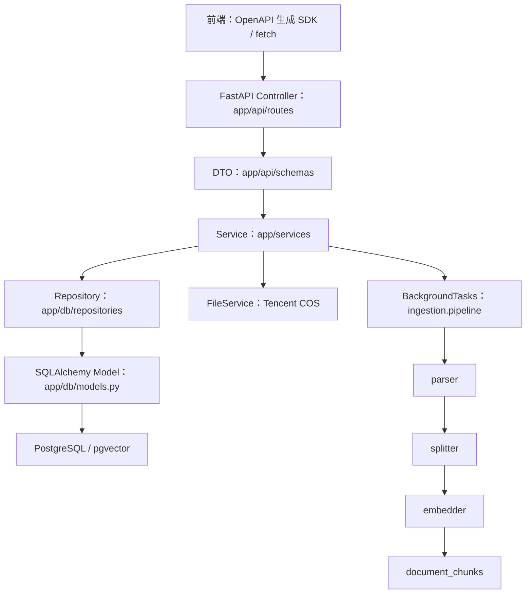
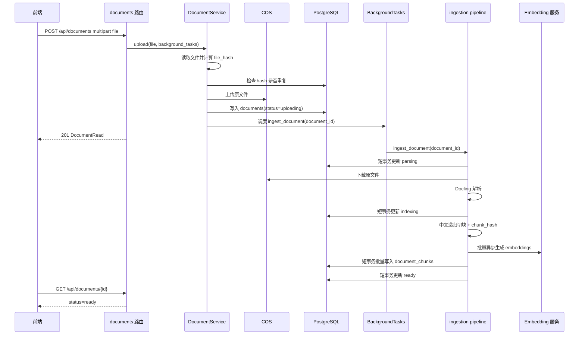
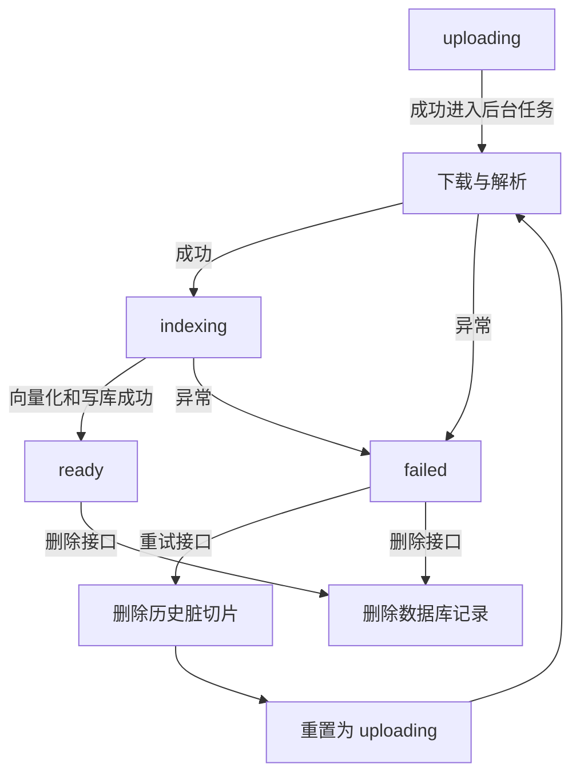
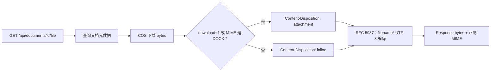

# Day 3 文档向量化 项目阶段总结与知识点复盘

> 项目：RAG Knowledge Base
>
> 阶段主题：文档摄取、向量化、文档生命周期 API 与切片浏览
>
> 扫描时间：2026-09-10

## 1. 本阶段结论

Day 3 的核心不是单独写一个上传接口，而是把“文件进入知识库”拆成一条可追踪、可重试、可查询的后端流水线：

```text
HTTP 上传
  -> COS 原文件落盘
  -> documents 建立主记录
  -> BackgroundTasks 调度摄取任务
  -> parsing：文件解析
  -> indexing：文本切块、向量化、批量写入 document_chunks
  -> ready：可检索、可查看详情
  -> failed：记录错误信息，允许重试
```

当前代码已经覆盖以下主要能力：

- FastAPI 应用工厂、CORS、全局异常处理和 `/api` 路由统一挂载。
- 文档上传、分页列表、详情、删除、失败重试。
- 原文件下载和浏览器内联预览。
- PDF、DOCX、Markdown、HTML 等文档的解析适配。
- 中文递归切块、chunk 顺序号和内容哈希。
- Embedding 客户端懒加载单例、批量异步向量化。
- `documents` 与 `document_chunks` 的 SQLAlchemy 模型和 Alembic 初始迁移。
- 切片分页、100 字摘要、完整切片详情、长度质量统计。
- 前端临时绕过登录和固定管理员权限，便于本地页面联调。

当前仍需要重点验证的风险：

- `backend/app/ingestion/pipeline.py` 中目前连续出现两段 `bulk_add(chunk_models)` 和 `commit()`。这是重复写入风险，应在测试时重点观察切片数量；（`已进行修复`）
- 切片模型支持页码、章节路径和 metadata，但当前摄取入库构造 `DocumentChunk` 时主要写入正文、序号、哈希和向量，后续需要确认是否要把解析元数据完整映射到数据库。
- 前端权限目前是临时 Mock，页面能打开不等于后端已经完成真实鉴权。

## 2. 核心概念

1. 文档主记录和文档切片是两层数据模型。`documents` 保存文件身份、哈希、COS 路径、生命周期状态和错误信息；`document_chunks` 保存正文、Embedding、顺序、哈希和扩展 metadata。
2. 文件上传和重型解析不应放在同一个长事务里。数据库事务只覆盖状态变化、主记录落库和切片批量落库，Docling 解析、COS 下载和远程 Embedding 请求期间应释放数据库连接。
3. 文档状态是可观察性的一部分。前端可以根据状态轮询或刷新列表，而不是把一次上传请求保持到解析和向量化全部结束。
4. 切块是检索质量和成本之间的平衡。需要保留语义边界，同时限制单块长度，并用 overlap 减少边界截断。
5. Embedding 结果必须和输入切片按位置一一对应。批量返回向量时，使用 `zip(chunks, embeddings)` 进行配对，不能依赖数据库重新排序。
6. 列表接口和详情接口承担不同的数据量职责。列表返回摘要，详情返回完整正文，避免一次加载全部长文本。
7. Repository 负责数据访问，Service 负责业务编排，Controller 负责 HTTP 协议。分层的意义是让 API 改动不直接污染 SQL 和摄取算法。

### 2.1 设计决策

- 使用 `file_hash` 唯一索引做文件内容级去重，而不是只按文件名判断重复。
- 使用 `chunk_hash` 记录切片内容指纹，为增量重建、去重和缓存命中预留依据。
- 解析和下载使用同步 SDK 时，通过 `asyncio.to_thread` 把阻塞工作转移到线程池，保护 FastAPI 事件循环。
- Docling Converter 和 Embedding 客户端采用懒加载单例，避免每次请求重复初始化重型模型或连接配置。
- 使用 PostgreSQL `pgvector` 保存向量，向量维度必须和 Embedding 配置及迁移脚本一致。
- 使用数据库端 `COUNT/AVG/MIN/MAX` 计算切片质量统计，避免把所有正文拉到 Python 进程后再遍历。
- 对原文件使用 `Content-Disposition` 区分 `inline` 和 `attachment`，对 DOCX 强制下载。

## 3. 模块职责与架构定位

### 3.1 分层结构



### 3.2 Controller 层的职责边界

Controller 位于 HTTP 传输边界，当前对应 `backend/app/api/routes/documents.py`。它应该做这些事情：

- 声明 HTTP 方法、路径、状态码和 OpenAPI `operation_id`。
- 接收 `UploadFile`、UUID、分页参数、状态过滤等协议输入。
- 通过 FastAPI 依赖注入取得数据库会话和后台任务。
- 调用 Service，不直接拼装 SQL，不直接操作 COS SDK，不直接执行切块和向量化。
- 把 ORM 实体转换为 Pydantic DTO。
- 控制响应类型，例如 JSON、空响应、二进制文件响应。
- 做输入边界校验，例如 `page >= 1`、`1 <= page_size <= 100`。

Controller 不应该负责这些事情：

- 判断文件哈希是否重复并决定业务状态。
- 决定删除时是否允许清理 COS。
- 维护文档状态机的全部规则。
- 实现 Docling、LangChain 或 pgvector 细节。
- 在响应中直接暴露 ORM 实体、COS bucket、object key 或完整 Embedding。

### 3.3 DTO 隔离原则

当前 `backend/app/api/schemas/documents.py` 使用 `from_attributes=True` 将 ORM 对象转成出参模型。DTO 隔离带来四个收益：

1. 安全：数据库中的 `cos_bucket`、`cos_object_key`、embedding 等内部字段不会自动泄漏。
2. 稳定：数据库字段调整时，API 对外契约可以保持不变。
3. 性能：列表 DTO 可以只暴露摘要，避免大量正文和向量被序列化。
4. 文档化：Pydantic 类型会自动进入 Swagger/OpenAPI，前端可以生成类型安全的 SDK。

推荐的边界是：

```text
ORM Document / DocumentChunk
        -> Service 业务结果
        -> DocumentRead / DocumentChunkRead
        -> JSON 或文件 Response
```

## 4. 核心接口时序与业务流转

### 4.1 文档上传到 READY



### 4.2 失败和重试



失败处理的关键是：捕获异常后记录不超过 500 字符的错误信息，状态变成 `failed`，而不是让后台任务静默失败。重试时应先清理失败留下的中间切片，再重新调度流水线。

### 4.3 文件预览和下载



## 5. 真实代码走读

### 5.1 应用入口与路由挂载

文件：`backend/app/main.py`

- `create_app()` 使用应用工厂模式，便于测试时创建独立 FastAPI 实例。
- 启动顺序是日志、FastAPI、CORS、全局异常处理、健康路由、文档路由。
- `app.include_router(health.router, prefix="/api")` 和 `app.include_router(documents.router, prefix="/api")` 负责统一挂载。
- 文档路由内部 prefix 是 `/documents`，所以最终地址是 `/api/documents`。
- CORS 允许前端 `http://localhost:5173` 访问后端，并允许携带凭证。

重点理解：模块内部的 prefix 与应用级 prefix 会拼接。只看到 `@router.get("")` 不能直接推断最终路径，必须同时看 `APIRouter(prefix="/documents")` 和 `include_router(prefix="/api")`。

### 5.2 文档 API 控制层

文件：`backend/app/api/routes/documents.py`

当前主要接口：

| 方法   | 最终路径                                         | 作用                   | 主要响应                   |
| ------ | ------------------------------------------------ | ---------------------- | -------------------------- |
| POST   | `/api/documents`                                 | 上传文档并调度后台摄取 | 201 + DocumentRead         |
| GET    | `/api/documents`                                 | 分页列表和状态过滤     | 200 + DocumentListResponse |
| GET    | `/api/documents/{document_id}`                   | 单文档详情             | 200 + DocumentRead         |
| DELETE | `/api/documents/{document_id}`                   | 删除文档               | 204                        |
| POST   | `/api/documents/{document_id}/retry`             | 失败文档重试           | 200 + DocumentRead         |
| GET    | `/api/documents/{document_id}/file`              | 下载或内联预览         | bytes                      |
| GET    | `/api/documents/{document_id}/chunks`            | 切片分页和质量统计     | 200 + list/stats           |
| GET    | `/api/documents/{document_id}/chunks/{chunk_id}` | 单切片完整详情         | 200 + detail               |

上传接口只返回主文档 DTO，不等待完整解析。前端应把 `uploading`、`parsing`、`indexing` 当作正常中间态，而不是当成上传失败。

### 5.3 Service、Repository 和事务

文件：

- `backend/app/services/document_service.py`
- `backend/app/db/repositories/document_repo.py`
- `backend/app/db/repositories/chunk_repo.py`

责任分配：

```text
DocumentService
  - 组织上传、去重、COS、数据库和后台任务
  - 组织删除、重试和状态约束
  - 组合文档查询、切片查询和统计

DocumentRepository
  - get_by_id / get_by_hash / add / update_status / list_paginated / delete
  - 只做 SQLAlchemy 数据访问
  - 使用 flush，不在仓储层擅自 commit

DocumentChunkRepository
  - bulk_add / delete_by_document / list_paginated_by_document
  - get_for_document 做 document_id + chunk_id 双条件校验
  - get_stats 使用数据库聚合计算切片长度
```

仓储层不 commit 是 Unit of Work 思路：Service 或流水线控制事务边界，避免一个底层方法偷偷提交，导致多个业务步骤无法整体回滚。

### 5.4 解析、切块和向量化

文件：

- `backend/app/ingestion/parser.py`
- `backend/app/ingestion/splitter.py`
- `backend/app/ingestion/embedder.py`
- `backend/app/ingestion/pipeline.py`

解析器使用 Docling，并通过 `asyncio.to_thread` 隔离同步、CPU 密集的转换任务；`DocumentConverter` 采用懒加载单例，避免重复加载模型。

切块器使用 `RecursiveCharacterTextSplitter`，当前优先级大致是：

```text
自然段 -> 换行 -> 。 -> ！ -> ？ -> ； -> ， -> 空格 -> 空字符串兜底
```

切块配置来自 `backend/app/core/config.py`：

- `chunk_size=600`
- `chunk_overlap=60`
- `length_function=len`

每个切片追加：

- `chunk_index`：全篇顺序，从 0 开始。
- `chunk_hash`：UTF-8 正文的 MD5 十六进制摘要。

Embedding 客户端通过 LangChain OpenAI 兼容接口对接 DashScope：

- API Key 未配置时应快速抛出配置异常。
- 模型、基础 URL、向量维度和批量大小由配置控制。
- `aembed_documents` 为异步批量接口。
- 运行前必须确保 `embedding_dim` 与 PostgreSQL `VECTOR(1024)` 及实际模型输出维度一致。

### 5.5 数据模型和迁移

文件：

- `backend/app/db/models.py`
- `backend/alembic/env.py`
- `backend/alembic/versions/b113db5ee4e1_init_documents_and_document_chunks.py`

`documents` 的关键字段包括：

- UUID 主键。
- 原始文件名、MIME、大小。
- SHA-256 文件哈希唯一索引。
- storage provider、COS bucket、object key、region。
- 文档状态和错误信息。
- 创建时间和更新时间。

`document_chunks` 的关键字段包括：

- UUID 主键和 `document_id` 外键。
- `content` 正文。
- `embedding VECTOR(1024)`。
- `chunk_index`、`chunk_hash`。
- 页码、章节路径和 JSONB metadata。
- `document_id` 外键 `ON DELETE CASCADE`。

迁移脚本升级时先执行：

```sql
CREATE EXTENSION IF NOT EXISTS vector
```

然后创建两张表和索引。`alembic/env.py` 显式导入 `app.db.models`，使模型注册到 `Base.metadata`，否则 `--autogenerate` 可能看不到新表。

注意：`downgrade()` 会删除 vector 扩展。若未来同一个数据库还有其他模块依赖 pgvector，回滚脚本需要重新评估扩展的所有者和生命周期。

### 5.6 切片质量统计

`DocumentChunkRepository.get_stats()` 使用 PostgreSQL 的 `char_length`、`COUNT`、`AVG`、`MIN`、`MAX`，返回不可变的 `ChunkStats` 数据类。

这比“把每个切片内容查到 Python 再计算长度”更适合大数据量，原因是：

- 减少网络传输。
- 减少 Python 内存占用。
- 让数据库执行擅长的聚合操作。
- 统计逻辑可以和分页列表查询保持同一份归属条件。

### 5.7 文件下载、RFC 5987 和中文文件名

文件下载接口使用：

```python
filename_quoted = quote(document.name, safe="")
Content-Disposition = f"{disposition}; filename*=UTF-8''{filename_quoted}"
```

其中：

- `inline` 表示浏览器尽可能在当前页面展示。
- `attachment` 表示下载文件。
- DOCX 因为浏览器通常无法直接渲染，所以强制 `attachment`。
- `filename*` 使用 UTF-8 百分号编码，符合 RFC 5987，解决中文名在不同浏览器和系统中的乱码问题。

## 6. 关键协议和安全细节

### 6.1 HTTP 状态码

| 场景             | 状态码 | 解释                               |
| ---------------- | ------ | ---------------------------------- |
| 上传创建文档     | 201    | 已创建主记录，后台处理可能仍在继续 |
| 查询成功         | 200    | 返回 JSON 或二进制内容             |
| 删除成功         | 204    | 成功但无响应体                     |
| 参数非法         | 400    | 状态不允许、分页越界等业务校验失败 |
| 资源不存在       | 404    | 文档或切片找不到                   |
| 配置或依赖不可用 | 503    | COS、数据库或向量服务未就绪        |

### 6.2 100 字切片列表摘要

切片列表不是详情接口。列表 DTO 只返回前 100 字左右的 `content_excerpt`，详情接口才返回完整 content。这样可以：

- 控制响应大小。
- 避免列表页面 DOM 过重。
- 让用户先定位切片，再按需读取全文。

这里的 100 字是展示层摘要策略，不是底层真正的 chunk_size。当前底层切块配置是 600 字符，二者不要混淆。

### 6.3 级联校验防越权

仅凭 `chunk_id` 查询会产生水平越权风险：攻击者拿到另一个文档的切片 UUID 后，可能读取不属于当前文档的内容。

当前仓储使用两个条件：

```text
DocumentChunk.id == chunk_id
AND DocumentChunk.document_id == document_id
```

Service 还应在入口处先确认父文档存在。这样即使切片 ID 有效但不属于 URL 中的文档，也会返回未找到，而不是泄露数据。

## 7. 踩坑与环境调优排错

### 7.1 Windows 应用程序控制策略/WDAC 拦截 C 扩展

截图中的问题属于 Windows 执行环境和 Python 原生扩展的交界问题。Docling、PyMuPDF、某些 PDF/OCR 依赖会加载 `.pyd` 或 DLL；如果 Windows 应用程序控制策略、WDAC 或企业安全策略不允许该扩展加载，常见表现是：

- 依赖已经安装，但 import 或解析时失败。
- 出现 DLL 加载失败、模块找不到、应用程序控制策略阻止等提示。
- API 上传后进入 `parsing`，随后变成 `failed`。

排查顺序：

1. 在后端虚拟环境中单独执行目标依赖的 import，先确认是不是 import 阶段失败。
2. 查看后端日志中的原始异常，不要只看前端的 502。
3. 确认 Python 位数、包位数、Windows 运行库和虚拟环境一致。
4. 通过 Windows 事件查看器检查 Code Integrity 或 AppLocker/WDAC 日志。
5. 在受控电脑上不要随意关闭安全策略；应让管理员为可信解释器和扩展提供合规放行，或使用已批准的运行环境。
6. 在无法加载 Docling 的情况下，可以先用健康检查、数据库迁移和 mock parser 验证其他链路，但不能把 mock 结果当成真实解析通过。

### 7.2 Alembic 迁移挂起

常见原因：

- PostgreSQL 容器未启动或端口不通。
- `DATABASE_URL` 指向了错误主机。
- 数据库在等待锁。
- pgvector 扩展不可用。
- 连接 URL 使用了同步驱动或异步驱动不匹配。
- 迁移运行目录不在 `backend`，导致 Alembic 配置和 Python import 路径不正确。

建议排查：

```powershell
cd D:\code\rag-knowledge-base\backend
uv run alembic current
uv run alembic heads
uv run alembic upgrade head
```

如果挂起，先检查数据库容器和连接，再检查 PostgreSQL 是否存在锁。确认 `alembic/env.py` 的 `settings.database_url` 已生效，且模型模块被显式导入。

迁移完成后建议核对：

```sql
SELECT extname FROM pg_extension WHERE extname = 'vector';
SELECT table_name FROM information_schema.tables
WHERE table_name IN ('documents', 'document_chunks');
```

### 7.3 前端临时 Auth Mock

当前为本地联调做了两个临时调整：

- `frontend/src/components/RequireAuth.tsx` 保留原登录守卫代码，但全部注释，当前实现直接返回 `<Outlet />`。
- `frontend/src/layouts/BasicLayout.tsx` 将 `isAdmin` 临时固定为 `true`，所以上传、删除、重试和管理员菜单可见。

这能让前端直接进入 `/documents`，但它只绕过了前端页面拦截，并没有形成真实身份认证。恢复正式逻辑时需要同时确认：

- `/login` 调用真实登录接口并持久化 token。
- `RequireAuth` hydrate 后校验 token，并请求 `/auth/me`。
- 请求拦截器统一注入 `Authorization: Bearer <token>`。
- 失效 token 统一清理并回到登录页。
- 后端每个敏感接口仍需做鉴权和权限标签校验。

临时 Mock 的边界是“便于页面和文档接口联调”，不能作为生产安全措施。

### 7.4 502、404 和前端 Error Boundary

- 前端 `404 Not Found`：先检查最终 URL，路由和 API 路径不是一回事；页面是 `/documents`，接口是 `/api/documents`。
- 前端 `502 Bad Gateway`：通常是后端请求失败、后端进程异常退出、代理目标不通，或后端调用 COS/数据库/Embedding 服务失败。
- `Unexpected Application Error: Cannot read properties of undefined (reading length)`：重点看浏览器栈中的源码行号，检查 API 返回字段是否缺失，并用 `data?.items ?? []`、默认空数组等方式防守；同时修复后端契约不一致。
- 前端没有上传按钮：当前 `DocumentsPage.tsx` 由 `isAdmin` 控制按钮显示；若没有管理员状态或 Mock 未生效，上传按钮会被条件渲染隐藏。

## 8. 自测验证清单

### 8.1 环境启动

后端：

```powershell
cd D:\code\rag-knowledge-base\backend
uv sync
uv run alembic upgrade head
uv run uvicorn app.main:app --reload --port 8000
```

前端另开终端：

```powershell
cd D:\code\rag-knowledge-base\frontend
npm install
npm run dev
```

访问：

```text
前端页面：http://localhost:5173/documents
Swagger：http://localhost:8000/docs
后端健康检查：http://localhost:8000/api/health
```

### 8.2 后端健康检查

```powershell
curl.exe -i http://localhost:8000/api/health
curl.exe -i http://localhost:8000/api/health/db
curl.exe -i http://localhost:8000/api/health/cos
```

期望：应用、数据库、COS 的结果能区分“正常、未配置、连接失败”，不要只看 HTTP 200，还要看 JSON 内容。

### 8.3 迁移和表结构

```powershell
cd D:\code\rag-knowledge-base\backend
uv run alembic current
uv run alembic history
uv run alembic check
```

检查点：

- 当前 revision 到达 `b113db5ee4e1`。
- `documents` 和 `document_chunks` 存在。
- `documents.file_hash` 有唯一索引。
- `document_chunks.document_id` 有索引和级联删除外键。
- embedding 维度与配置一致。

### 8.4 API 契约检查

在 Swagger 中依次测试：

1. `GET /api/documents?page=1&page_size=20`：空库也应返回合法的 `items` 数组。
2. `POST /api/documents`：上传 Markdown 或小型 PDF，期望 201，并得到文档 ID。
3. `GET /api/documents/{id}`：观察状态从 `uploading` 到 `parsing`、`indexing`、`ready` 或 `failed`。
4. `GET /api/documents/{id}/file?download=0`：PDF/Markdown 尝试 inline。
5. `GET /api/documents/{id}/file?download=1`：强制 attachment。
6. 上传中文文件名，检查 `Content-Disposition` 和下载后的文件名。
7. `GET /api/documents/{id}/chunks?page=1&page_size=20`：检查 `items`、`total`、`stats` 和 100 字摘要。
8. `GET /api/documents/{id}/chunks/{chunk_id}`：检查详情正文。
9. 使用另一个文档 ID 配合同一个 chunk ID：必须不能返回该切片内容。
10. `POST /api/documents/{id}/retry`：仅 failed 文档允许重试。
11. `DELETE /api/documents/{id}`：成功返回 204，随后文档详情返回 404。

### 8.5 前端联调

- 打开 `http://localhost:5173/documents`，确认临时 Auth Mock 能直接进入页面。
- 确认页面顶部没有 404/502 toast。
- 以管理员 Mock 进入时应看到“上传文档”按钮。
- 上传小型 Markdown，确认列表出现记录，状态可刷新变化。
- 点击文档名进入详情，确认元数据、原文预览和切片列表。
- 点击切片查看完整正文，确认分页和统计显示正常。
- 失败时观察浏览器 Network、后端终端日志和数据库 `error_message`，三者应能串起同一个 document_id。

## 9. 重点风险检查项

### 9.1 pipeline 重复 bulk_add

当前 `backend/app/ingestion/pipeline.py` 在一次成功路径里出现两段相同的：

```python
async with AsyncSessionLocal() as session:
    chunk_repo = DocumentChunkRepository(session)
    await chunk_repo.bulk_add(chunk_models)
    await session.commit()
```

需要在后续修改前确认这是临时代码残留还是有意设计。自测时用一个能稳定切成 2 至 3 个 chunk 的文件，比较：

```text
实际 chunk 数
数据库 document_chunks 数
接口返回 stats.total
```

三者应该一致。若数据库数量翻倍或第二次插入报错，应保留一次批量写入即可。

### 9.2 状态与事务一致性

若状态已经是 `ready`，但切片表为空，说明状态提交顺序或批量落库存在问题。建议每个阶段都记录：

```text
document_id、status、chunk_count、耗时、异常摘要
```

解析和远程向量化不能持有数据库长事务，避免连接池耗尽。

### 9.3 配置和迁移维度一致性

以下三处必须保持一致：

```text
settings.embedding_dim
Alembic VECTOR(dim)
Embedding 模型实际返回向量长度
```

任何一处改动都要先决定是否需要重建向量列和重新生成所有切片向量。

## 10. Day 3 知识点复盘题

1. 为什么上传接口不能等待完整解析结束再返回？
2. 为什么 Repository 不应该自行 commit？
3. `DocumentRead` 为什么不能直接返回 SQLAlchemy `Document`？
4. `chunk_size=600` 和切片列表摘要 100 字分别解决什么问题？
5. 为什么切片详情必须同时校验 `document_id` 和 `chunk_id`？
6. 为什么同步的 Docling/COS SDK 需要放到线程池？
7. 为什么 `alembic/env.py` 要显式 import `app.db.models`？
8. `embedding_dim` 和 `VECTOR(1024)` 不一致会出现什么后果？
9. `inline` 和 `attachment` 的差别是什么？中文文件名为什么需要 `filename*`？
10. 前端把 `isAdmin` 固定为 `true` 后，哪些安全问题仍然没有解决？
11. 处理失败时为什么要保存错误摘要并提供 retry，而不是只返回 500？
12. 如何验证流水线没有重复写入切片？

建议你能用自己的话回答每一题，并能指出对应的代码文件。真正掌握的标准不是记住函数名，而是能解释一次请求如何跨越 Controller、Service、Repository、Storage、Ingestion 和数据库。

---

## 附录：核心文件索引

| 文件                                                         | 复盘重点                               |
| ------------------------------------------------------------ | -------------------------------------- |
| `backend/app/main.py`                                        | 应用工厂、CORS、异常、路由挂载         |
| `backend/app/api/routes/documents.py`                        | 八类文档接口、下载预览、分页、级联校验 |
| `backend/app/api/schemas/documents.py`                       | DTO、序列化、摘要和分页响应            |
| `backend/app/services/document_service.py`                   | 上传、去重、删除、重试、业务状态约束   |
| `backend/app/ingestion/pipeline.py`                          | 解析、切块、向量化、批量入库、状态机   |
| `backend/app/ingestion/parser.py`                            | Docling 适配和线程隔离                 |
| `backend/app/ingestion/splitter.py`                          | 中文递归切块、chunk_index、chunk_hash  |
| `backend/app/ingestion/embedder.py`                          | DashScope/OpenAI 兼容 Embedding 单例   |
| `backend/app/db/models.py`                                   | documents 和 document_chunks ORM 模型  |
| `backend/app/db/repositories/document_repo.py`               | 文档数据访问和状态更新                 |
| `backend/app/db/repositories/chunk_repo.py`                  | 批量写入、统计、双 ID 归属校验         |
| `backend/alembic/env.py`                                     | 迁移配置和模型元数据注册               |
| `backend/alembic/versions/b113db5ee4e1_init_documents_and_document_chunks.py` | pgvector 扩展、初始表结构和索引        |
| `frontend/src/components/RequireAuth.tsx`                    | 临时登录守卫 Mock                      |
| `frontend/src/layouts/BasicLayout.tsx`                       | 临时管理员权限 Mock                    |
| `frontend/src/pages/DocumentsPage.tsx`                       | 文档列表、上传按钮和状态展示           |
