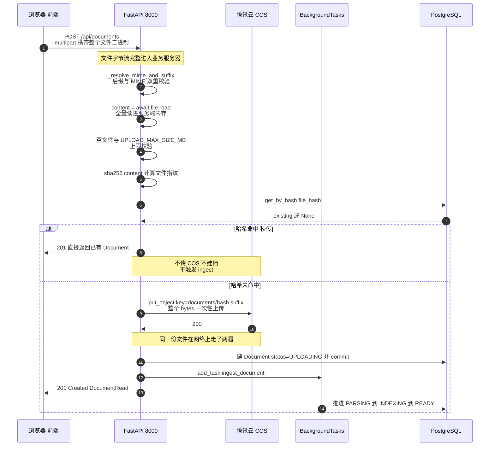
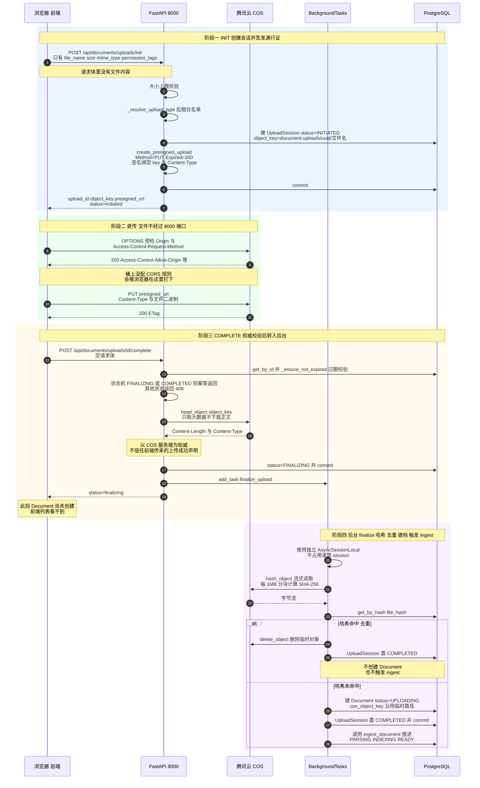
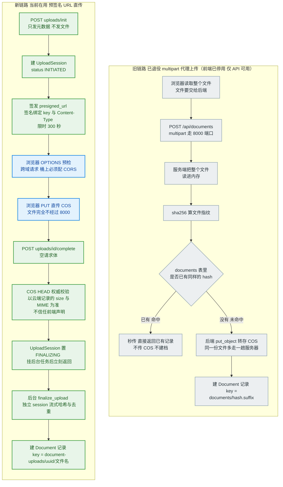
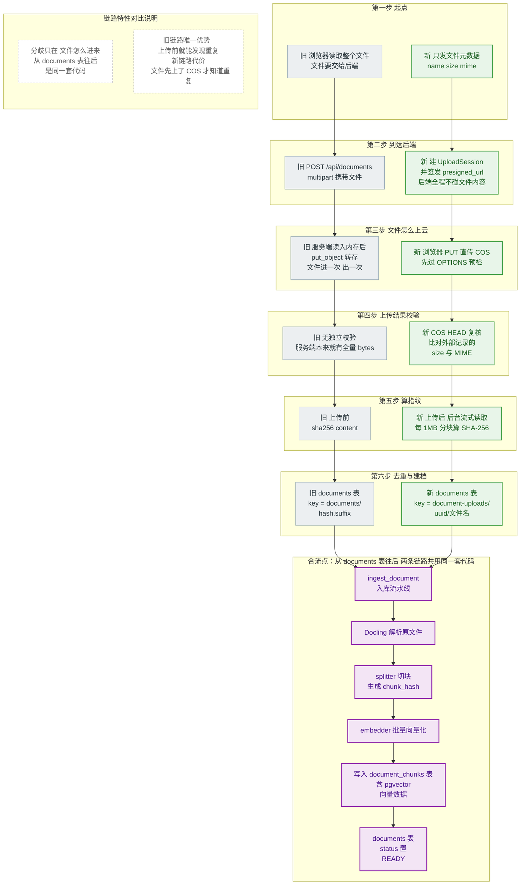
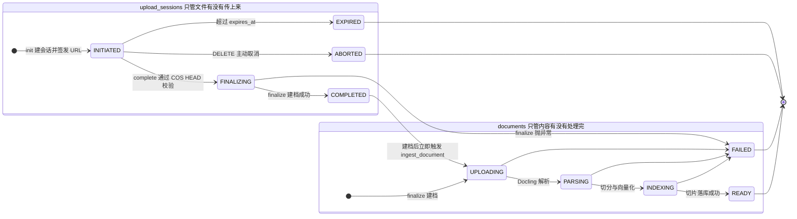
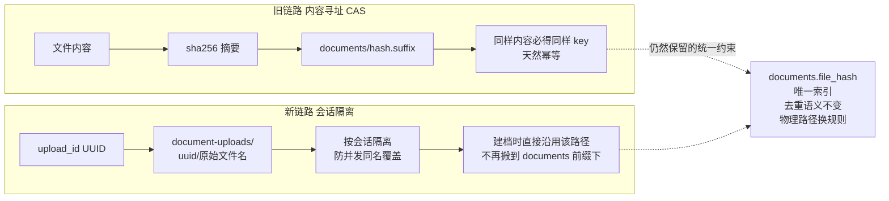
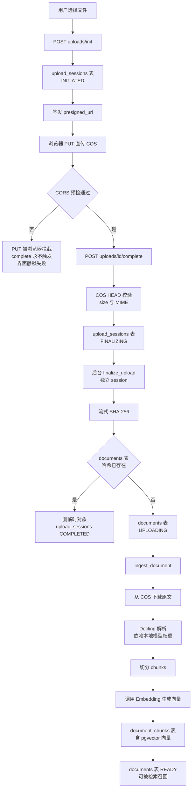

# 文档上传链路 Mermaid 架构图

配套 ASCII 版见 `上传链路架构对比.md`。本文提供可直接渲染的 Mermaid 源码，适用于 GitHub / VS Code / Typora / Mermaid Live Editor。

---

## 1. 旧链路：multipart 代理上传（时序图）

---

## 2. 新链路：预签名 URL 直传（时序图）

---

## 3. 两条链路的架构对比（流程图）

---

## 4.阶段对齐图（推荐用于逐步对照）

把两条链路的**同一个阶段放在同一行**，直接看出哪些步骤等价、哪些是新增的、从哪一步开始合流。没有跨子图连线。

## 5. 新链路两个状态机

---

## 6. 两条链路的对象键规则

---

## 7. 端到端全景（上传到可检索）

---
